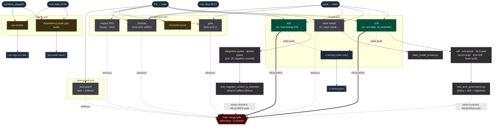
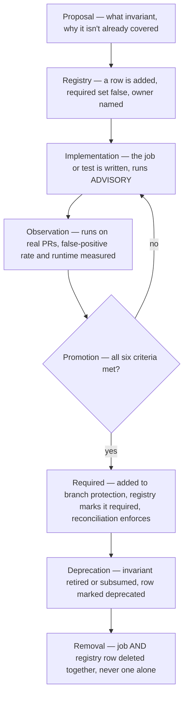

<!-- REVIEW ARTIFACT — hand-authored audit, not a generated doc. Safe to edit.
     Every load-bearing claim is cited path:line and re-verified against origin/main
     0c452fe on 2026-07-15. This document changes NO CI configuration or policy. -->

# FanOps — CI Architecture Review

*Rev 6 — governance-framing pass: adds a **CI Constitution** (principles · design goals · core
invariants · non-goals · a four-layer model · document roles) and a **CI Terminology** glossary near
the front, and on the recommendations side a permanent **CI Governance Model** (registry · drift
detection · reconciliation · ownership · promotion), a **Lifecycle of a CI Control**, and objective
**promotion criteria**. Rev 5 added severity×confidence classification, an explicit
audit→recommendations boundary, per-recommendation Architectural Decision Analysis (with do-nothing
baselines), a maintenance & ownership analysis for every proposed artifact, and evidence-vs-estimate
tagging on every risk claim. Review base `0c452fe`; five rounds of review-panel critique folded in (see
Delivery summary § Revision note).*

**Review base:** `origin/main` @ `0c452fee4009eb26a325cda5abbba5b3ccdc3255` (tip #657).
**Branch-protection probe:** `2026-07-15T14:53:38Z` (live `gh api …/branches/main/protection`).

> **Freshness (rev 3).** Re-fetched `origin/main`; it advanced `dc2110b → 0c452fe` (#656 extends
> ARCH-003 to check `docs/CONFIG.md`; #657 R1 regression-lock). `git diff dc2110b..0c452fe` on CI
> machinery touched **only** `tools/arch/{policy,selftest}.py`; the **four workflow files,
> `pyproject.toml`, `CI_SLO.md`, `ARCHITECTURE_GOVERNANCE.md`, `test_arch_governance.py`,
> `conftest.py`, and `test_variation_render.py` are unchanged**, so every topology/marker/anchor
> claim and the 18-BLOCKING/21-rule count still hold. **Branch protection re-probed: identical**
> (`unit`, `e2e`; strict; 0 reviews; admins not enforced). The one moved number: the negative-control
> count is now **25** (NC-01…NC-25; #656 added NC-25) — updated throughout, and itself the proof of
> CW-7 (the count went 21→24→25 in a handful of commits).
**Method:** read-only. Every claim tagged to `path:line`; numbers derived from source, not reused
from prose. **No CI file, workflow, branch-protection setting, script, marker, lockfile, hook, or
existing governance doc was modified** — the only tree change is this file.

## Thesis

> **The repository does not declare its intended merge policy in a machine-verifiable form.**

Every other finding derives from this. Required-ness lives only in GitHub's UI; ownership lives only
in scattered workflow comments; "which invariant blocks a merge, and by which path" is answerable
only by the cross-path analysis in this document. Without a version-controlled control plane, even a
perfect workflow inventory cannot *prove* that GitHub enforces what the repository intends. The root
remediation is therefore **not "add more required checks"** — it is to *establish a version-controlled
CI control registry, reconcile it against workflow definitions and live GitHub configuration, and
select one authoritative execution path per invariant.* Everything below is a symptom of, or a step
toward, that.

## Executive summary

- **Repository health — sound, not broken.** CI is functional and unusually well-instrumented (SLO
  gate, secret scan, lock-drift guard, AST ratchets, a stdlib architecture-governance engine). The
  two required gates (`unit`, `real-tooling E2E`) are well-designed and genuinely block. The defects
  here are **ownership-clarity and control-plane** problems, not a broken pipeline.
- **Principal architectural findings.** (a) Three "source-of-truth" planes disagree — workflow YAML
  (~11 checks), governance prose (18 rules tagged "BLOCKING"), and live branch protection (**2**
  required contexts). (b) Architecture governance blocks merges through a **second, required pytest
  path**, not the (advisory) `architecture` workflow — one shared implementation run through two
  harnesses (Phase 7). (c) That dual execution is a measured **~5.7 runner-min/PR** overlap (Phase 4).
- **Highest-priority risks.** Required contexts match mutable job-`name:` strings → a rename
  **deadlocks** the merge queue (G3, fails closed). `base install` and `impact --strict` run on every
  PR but **do not block and have no backup** (Phase 7). The live merge plane is CI-only with admin
  bypass (G13/G14). All trace back to the Thesis.
- **Recommended sequence.** **A** zero-risk fixes → **A′** classify the ambiguous test → **B** build
  the version-controlled control plane + drift checks → **C** choose one architecture-enforcement
  model → **D** reconcile branch protection one control at a time. **No branch-protection or policy
  change lands before the control plane exists.**

> **Scope note.** A review, not a remediation — every proposal carries exact `path:line`; **none is
> applied**. What this review deliberately does *not* assess is stated in *"Out of scope"* (near the
> end). The keystone distinction to carry into every phase: *workflow-blocking ≠ branch-protection-
> blocking ≠ policy-engine-blocking.*

---

## CI Constitution

*The normative frame this review applies. These principles are a **design stance** — a synthesis of
the audit, not themselves proven findings; Part I proves where the system does and does not meet them.
Their durable home is a standing Engineering Constitution (see "Document roles"); they live here as the
yardstick the audit measures against.*

### The four layers

CI governance is four distinct layers. Keeping them separate is what lets a future document change one
without disturbing the others; conflating them is the root of the three-plane disagreement the audit
proves (F1/G1).

| Layer | Question it answers | Where it lives (target) | Where it lives today | Changes … |
|---|---|---|---|---|
| **Principles** | *Why* does CI exist; what may it gate? | a standing Engineering Constitution | this section (nowhere durable) | rarely — a philosophy shift |
| **Governance** | *By what process* are controls added, promoted, retired, reconciled? | "CI Governance Model" + the `ci-ownership.yml` process | ad-hoc; R-rules scattered in prose | occasionally — a process change |
| **Architecture** | *Which* control owns *which* invariant, on *which* path, required or not? | `.github/ci-ownership.yml` (source of truth) | GitHub UI + workflow YAML + prose (3 planes) | per control added/promoted/removed |
| **Implementation** | *How* is each control executed? | workflow YAML, `tools/arch`, tests, branch protection | same (correct — this layer *is* code) | per code change |

The keystone finding restated in these terms: the **Architecture** layer has no version-controlled
source of truth, so it is read off the **Implementation** layer (GitHub config) — which inverts
principle 5. Every recommendation below moves one fact from Implementation up into Architecture, or
from prose up into Governance.

### Principles

Each principle is followed by the audit finding that shows it upheld or violated today — so no
principle is decorative.

1. **CI exists to enforce architectural invariants, not coding style.** Style is enforced only by the
   deliberately-minimal ruff set (`pyproject.toml:56-73`; E701/E702/E401/E501 ignored); the heavyweight
   gate is `tools/arch` (architecture governance). *Upheld today* — but the invariant path is
   mis-declared (principle 3).
2. **Every blocking check owns exactly one invariant.** A composite job (e.g. `unit`) is an execution
   bundle whose sub-gates each own one invariant (Phase 3; registry sub-rows). *Upheld*, and R1 keeps
   it so.
3. **One invariant has one authoritative execution path.** Architecture invariants execute through
   **two** paths — the advisory `architecture` workflow *and* the required `test_arch_governance.py`
   pytest lane (Phase 7; D2–D4). *Violated in legibility:* both run, only pytest blocks, and nothing
   declares pytest the authoritative one. REC-3 / Phase C picks the single path.
4. **Governance is version-controlled.** Required-ness lives only in GitHub's UI; it is knowable from
   the tree only via a live `gh api` probe (Phase 7; F1). *Violated* — this is the Thesis. REC-1
   (`ci-ownership.yml`) is the fix.
5. **GitHub configuration is implementation, not source of truth.** Today branch protection *is* the
   only source of truth for what blocks (G1). *Inverted.* The registry becomes the source; branch
   protection becomes a reconciled projection of it (DC-3).
6. **Every blocking control is explainable.** A required check must name its invariant, owner, and
   justification. The two required contexts are well-understood; the *prose* claims ~18 more "BLOCKING"
   that do not block a merge (G1). *Partially upheld* — R2 and the registry make every blocking claim
   resolve to one vocabulary.
7. **Advisory controls exist for observability, not merge gating.** `base-install`, `impact --strict`,
   the `architecture` jobs, and `lane-guard` run-but-don't-block (Phase 7). *Upheld mechanically* — but
   some own a **unique** invariant with no blocking backup (F2), so the honest response is to promote
   them (promotion criteria) or accept the gap explicitly, never leave it implicit.

### Design goals

What the CI system optimizes for, in priority order — each is observable in the current design, so
these describe intent already partly realized, not a wish-list:

- **Merge safety first.** No PR reaches `main` past a failing architectural invariant. *(Realized: the
  two required gates genuinely block; the gap is undeclared intent, not an open door.)*
- **Fast, honest PR feedback.** The required path is the fast hermetic lane + the real-toolchain E2E;
  heavy/slow work (asr, weekly reconciliation) is scheduled off the PR critical path.
- **Determinism.** Generated artifacts are pure functions of source, byte-reproducible
  (`test_arch_governance.py`); nothing gates on a wall clock.
- **Legibility on failure.** A red check names the invariant that broke and how to fix it (the
  negative-control suite exists to prove validators are not decorative).
- **Low single-operator overhead.** Noise is budgeted deliberately (Dependabot scoped narrow;
  enterprise checkboxes declined — `dependabot.yml:2-7`).

### Core invariants

The non-negotiables CI enforces on every eligible change (all currently enforced — this *names* them,
it does not propose them):

- Architecture governance holds: no BLOCKING policy finding, derived artifacts byte-match source, every
  negative control fires (`test_arch_governance.py`).
- The real-toolchain E2E suite actually runs and never silently skips (`test_ci_require_e2e.py`).
- The AST ratchets hold: the broad-except budget and the print-routing ban do not regress.
- The minimal ruff set is clean; the secret scan is clean; the lockfiles are not drifted.

### Non-goals

What CI deliberately does **not** gate on — each is an *evidenced* decision, so it must never be
mistaken for a Phase-5 gap (an unowned invariant we should own):

- **Full formatting / style enforcement.** No `black`, no `ruff format`; the compact one-liner house
  style is deliberate (`pyproject.toml` rationale). *Non-goal, not a gap.*
- **Coverage-percentage gating.** `--cov-fail-under` was removed (`ci.yml:62`, MOL-199). *Deliberate.*
- **Cross-OS / cross-Python matrix.** One environment by choice (a localhost tool). *Deliberate.*
- **Blocking on advisory security scans.** `pip-audit` is advisory, nightly-only (`nightly.yml`). *A
  visibility control, not a gate — principle 7.*
- **Enterprise access controls.** `CODEOWNERS` / `SECURITY.md` declined for a single-operator tool
  (`dependabot.yml:7`, `.agents/lanes.json:2`). *Deliberate — and it is why code-owner review must
  never be enabled: it would block the orchestrator's autonomous merge.*

### Document roles — where this governance belongs long-term

This review is **evidence and rationale**, a point-in-time artifact. The durable governance should
graduate *out* of it into standing documents, each owning exactly one layer — so future work references
a stable home instead of re-deriving it here:

| Document | Owns (layer) | Content | Lifespan |
|---|---|---|---|
| **Engineering Constitution** *(future)* | Principles | the seven principles above; the four-layer model | durable; changes rarely |
| **ADRs** *(future, one per decision)* | Architecture decisions | e.g. "the pytest lane is the authoritative arch-invariant path; the workflow is advisory" — context · decision · consequences, dated | durable; append-only |
| **`.github/ci-ownership.yml`** *(REC-1)* | Architecture | operational truth: control → invariant → owner → required? | living; one row per control |
| **This CI Review** | — | the mechanical proof and reasoning that *justify* the three above | point-in-time; supersede, don't accrete |

The test of the split: if a principle changes, only the Constitution edits; if a control is added, only
the registry edits; if a decision is revisited, a new ADR supersedes the old. Nothing forces a re-audit.

## CI Terminology

A shared vocabulary so "blocking," "required," and "check" mean one thing across this and future docs.
Where a term has more than one plane in this repo, all planes are named — the conflation of them is
itself an audit finding (Phase 7).

| Term | Definition (as used here) |
|---|---|
| **Control** | Any automated mechanism that can pass/fail a change — a test, a lint, a script, a policy rule. The broadest term; a control need not surface as a GitHub check. |
| **Check** | A GitHub-reported status context on a PR. Usually one job = one check, named by the job's `name:`. |
| **Workflow** | A `.github/workflows/*.yml` file: a trigger-bound collection of jobs. |
| **Job** | A unit of execution within a workflow, on one runner; reports one status check by its `name:`. |
| **Gate** | A control positioned so that failing it stops progress (a merge, or a downstream `needs:` job). "Gating" = has stop power. |
| **Blocking** | The property of stopping *something* on failure — but on **three distinct planes**: *workflow-blocking* (fails the job / `needs:` DAG), *branch-protection-blocking* (prevents merge), *policy-engine-blocking* (a `tools.arch` rule classed BLOCKING). A control can block its workflow yet not block a merge. |
| **Required** | A status check in branch protection's required set; GitHub prevents merge until it reports success. Matched by the exact job `name:` string. |
| **Advisory** | A control that runs and reports but is **not** required; failing it does not prevent merge. Exists for observability (principle 7). |
| **Invariant** | A property of the codebase that must always hold (e.g. "derived artifacts are byte-reproducible from source"). Controls exist to enforce invariants. |
| **Ownership** | The named party (a registry row / a subsystem `CLAUDE.md`) responsible for a control and its invariant. An unowned control is one nobody has committed to maintain or explain. |
| **Drift** | Divergence between a source of truth and a downstream representation (a generated doc that no longer matches its source; branch protection that no longer matches the registry). |
| **Reconciliation** | The process/job that detects (and optionally repairs) drift by comparing the source of truth against the live implementation and reporting the delta. |

## Classification key (applied to every finding and recommendation)

Documentation debt must not sit next to architectural risk as if equal. Two orthogonal axes:

**Severity** — blast radius if left unaddressed:
- **Critical** — can admit a broken merge to `main`, lose data, or silently disable a safety control.
- **High** — undermines the integrity/legibility of the merge-control plane; wrong decisions likely.
- **Medium** — real operational disruption or drift risk; fails safe, or is contained.
- **Low** — minor hygiene; a documented accepted risk.
- **Cosmetic** — documentation/number rot with no behavioral effect.

**Confidence** — how the claim was established:
- **Proven** — I read the exact bytes / ran the probe / derived the number from source this session.
- **High-confidence inference** — grounded in documented platform behavior or a shared implementation,
  but not directly executed/observed here (e.g. GitHub's required-check semantics; the E2E-side
  runtime split).
- **Opinion** — an architectural preference; no experiment settles it.

Recommendations additionally carry **[EVIDENCE-BACKED]** (the change follows necessarily from a proven
finding) or **[PREFERENCE]** (a defensible design choice the evidence informs but does not compel).

---

# Part I — Audit (proven findings)

*Phases 1–7 are the audit: findings established by reading the tree, probing live config, and deriving
numbers from source. No remediation is proposed here — that begins at the "End of audit" boundary
after Phase 7.*

## Phase 1 — Inventory

**Files:** `.github/workflows/{ci,architecture,lane-guard,nightly}.yml`, `.github/dependabot.yml`.
**Confirmed absent** (deliberate — `dependabot.yml:6-7`, `.agents/lanes.json:2`): `CODEOWNERS`,
branch-protection-as-code / rulesets, `.github/settings.yml`, `.pre-commit-config.yaml`,
composite `.github/actions/`, any `workflow_call` or local `uses: ./…`, any `strategy.matrix`.
The four workflows are **independent event-triggered leaves**; the only cross-job edge is
`ci-timing needs [unit, e2e]` (`ci.yml:197`).

> "Runs on PRs" ≠ "blocks merging." The **Blocking (branch-protection)** column is the live
> `gh api` truth; the **Blocking (workflow logic)** column is whether a red step fails the job.

### `ci.yml` — "CI" (216 lines) · triggers: `push`+`pull_request` → `main` · `concurrency` yes · `permissions: contents:read, actions:read`

| Job | Status-check context (`name:`) | timeout | needs | Purpose / invariant owned | Blocking (workflow) | Blocking (branch-protection) | Install / toolchain | Artifacts → consumer |
|---|---|---|---|---|---|---|---|---|
| `unit` | **`unit (fast, no toolchain)`** | 15 | — | fast logic suite green + lint + SLO + secret-scan + lock-drift + hook-verify | yes (all steps except timing report) | **✅ REQUIRED** | `requirements/ci-unit.txt` (dev+framing+studio), `-e . --no-deps` | `ci-timing-part-unit` (main push) → `ci-timing` |
| `base-install` | `base install (no extras) refuses smart-framing` | 10 | — | clean no-extras packaging contract: import + CLI + render-refuses-loudly | yes | ❌ not required | literal fresh venv, `pip install .` (base only) | — |
| `e2e` | **`real-tooling E2E (must run, not skip)`** | 25 | — | real ffmpeg/whisper pipeline runs (not mocks) + `@slow` cross-face proofs + cv2-present | yes | **✅ REQUIRED** | apt `ffmpeg espeak` + `requirements/ci-e2e.txt` (compose+dev+framing+studio+transcribe) | `ci-timing-part-e2e` (main push) → `ci-timing` |
| `ci-timing` | `ci-timing artifact (main only)` | — | `unit,e2e` | merge timing partials → observability artifact | n/a (main push only) | ❌ never a PR check | setup-python only | `ci-timing` (terminal; `actions:read` cross-run) |

Blocking sub-gates **inside** `unit` (all required-by-transitivity): secret scan `ci.yml:37` (PR),
lock-drift `ci.yml:45` (PR, `check-locks.sh`), ruff `ci.yml:54` (`ruff check .`), unit pytest
`ci.yml:61`, SLO gate `ci.yml:69-73` (`ci_slo_gate.py`, 135s PR / 140s main — `docs/CI_SLO.md:66`),
hook-verify `ci.yml:81-87`. **Advisory** (`continue-on-error`): timing reports `ci.yml:65,169,182`.

### `architecture.yml` — "architecture" (202 lines) · triggers: `push`+`pull_request` → `main` **+ `schedule` cron `17 5 * * 1`** · `concurrency` yes · `permissions: contents:read`

| Job | Status-check context | timeout | `if:` routing | Purpose / invariant owned | Blocking (workflow) | Blocking (branch-protection) |
|---|---|---|---|---|---|---|
| `gate` | `gate (drift + policy + registries)` | 10 | `event != schedule` | `tools.arch ci`: derived artifacts byte-match source + no BLOCKING policy finding + registries valid | yes | ❌ not required |
| `impact` | `impact report` | 10 | `event == pull_request` | `impact --strict`: PR blast-radius is computable and not BREAKING/UNKNOWN_IMPACT | yes | ❌ not required |
| `controls` | `negative controls (validator effectiveness)` | 15 | `event != schedule` (path-selected, **fails open**) | `tools.arch selftest`: the 25 controls each fire on an injected defect | yes | ❌ not required |
| `reconcile` | `scheduled reconciliation` | 20 | `event == schedule` | weekly full regen + **untracked-artifact** drift → reviewable diff, never auto-commit | yes | ❌ never a PR check |

`tools/arch` is **stdlib-only** (`architecture.yml:21-22`) → zero pip install, no lockfile.
No `continue-on-error` anywhere — every step is blocking *within its (non-required) job*.

### `lane-guard.yml` — "lane-guard" (42 lines) · trigger: **`pull_request` → `main` only** · **`concurrency` NONE** · `permissions: contents:read, pull-requests:read`

| Job | Status-check context | timeout | Purpose / invariant owned | Blocking (workflow) | Blocking (branch-protection) | Install |
|---|---|---|---|---|---|---|
| `lane-guard` | `lane file-ownership + cross-PR collision` | **none** | no cross-lane hot-file edit (`lane_guard.py`) + no cross-open-PR hot-file collision (`pr_collision_guard.py`) | yes | ❌ not required | stdlib + git/gh (no install) |

**Anomaly:** the only workflow using **floating action tags** — `actions/checkout@v7` (`:26`),
`actions/setup-python@v6` (`:29`) — against the CI-10 SHA-pin policy (`dependabot.yml:3`); all
other workflows pin full SHAs. Also the only job with **no `timeout-minutes` and no `concurrency`**.

### `nightly.yml` — "nightly" (88 lines) · triggers: **`schedule` cron `0 3 * * *` + `workflow_dispatch`** (never on PR path) · `concurrency` yes · `permissions: contents:read`

| Job | Status-check context | timeout | Purpose / invariant owned | Blocking (workflow) | Install | Artifacts |
|---|---|---|---|---|---|---|
| `dependency-audit` | `dependency audit (pip-audit)` | 15 | known-CVE visibility | **advisory** — `pip-audit` `continue-on-error` (`nightly.yml:38`) | `requirements/ci-unit.txt` | `nightly-pip-audit-report` (`if: always()`) |
| `asr-smoke` | `[asr] toolchain smoke (nightly)` | 45 | heavy `[asr]` (demucs/faster-whisper/torch) toolchain still works | yes (within the scheduled job) | apt `ffmpeg espeak` + `-e '.[dev,transcribe,asr,studio]'` | `nightly-asr-logs` (`if: failure()`) |

Never a merge gate (no PR trigger). This is deliberate (MOL-197 / `pyproject.toml:82`): the `[asr]`
install is too slow for per-PR.

---

## Phase 2 — Test Execution Map

`pyproject.toml` has **no `addopts`** (`:75-88`) — every selection is explicit per invocation.
Registered markers: `integration`, `slow`, `ci_hook_regression`, `asr` (`pyproject.toml:78-83`).
Global `timeout = 60` (`:88`) is the ledger-deadlock guardrail.

### CI pytest populations (mechanical, by marker expression)

| # | Workflow · job · step | `path:line` | Invocation | Selects | Required? |
|---|---|---|---|---|---|
| 1 | ci · unit | `ci.yml:61` | `pytest -q -n auto -m "not integration and not slow" --durations=25` | the hermetic logic suite (incl. `test_arch_governance.py` non-slow tests, both AST ratchets) | ✅ |
| 2 | ci · unit · hook-verify | `ci.yml:86` | `pytest -q tests/test_ci_require_e2e.py` then `test $? -eq 1` | one file; asserts skip→**fail** under `FANOPS_REQUIRE_E2E=1` | ✅ |
| 3 | ci · e2e · integration | `ci.yml:165` | `pytest -q -m "integration and not ci_hook_regression and not asr" -rs` | real-toolchain suite (16 integration files incl. `test_framing_cv2_required.py`) | ✅ |
| 4 | ci · e2e · slow | `ci.yml:179` | `pytest -q -m slow` | cross-face proofs + `test_arch_governance.py::test_negative_control_is_detected` (25 controls) | ✅ (in required e2e job) |
| 5 | nightly · asr-smoke | `nightly.yml:79` | `pytest -q -m "integration and asr" -rs` | the single `[asr]` file (`test_asr_real.py`) | scheduled, not required |

**Local paths (not CI; policy-denied to the agent):** `check-full.sh:32`, scoped `check.sh:104`
(operator override `FANOPS_LOCAL_TESTS=1` only, `check.sh:88`), and `.githooks/pre-commit:50` →
`check.sh`. Direct local `pytest`/`python -m pytest`/`python3 -m pytest` are **denied**
(`.claude/settings.json:14-16`); the test suite is single-sourced to CI by policy.

### The four distinctions the brief asked for

- **Same test executed more than once?** **No.** Marker design makes the populations disjoint:
  `test_ci_require_e2e.py` is `[integration, ci_hook_regression]`, so path 3 excludes it
  (`not ci_hook_regression`), path 5 excludes it (`not asr`), and it runs **only** in path 2. The
  `asr` file is excluded from path 3 (`not asr`) and runs only in path 5. No pytest test runs twice
  across CI.
- **Different tests protecting the same invariant?** **Yes, once, intentionally.** The
  *skip→fail* invariant is proven by (a) the live behavior in path 3 (`FANOPS_REQUIRE_E2E=1` turns
  any integration skip into failure via `conftest.py:90-102`) and (b) the meta-test in path 2 that
  asserts that mechanism exits 1. Two different tests, one invariant — this is a *guard on the
  guard*, not duplication.
- **Same validator called through multiple paths?** **Yes — the architecture governance engine.**
  `tools/arch` is invoked as a **CLI** (`python -m tools.arch ci|selftest`) in the non-required
  `architecture` workflow, **and** as a **library** by `tests/test_arch_governance.py` in the
  required `unit`/`e2e` lanes. The negative-control proof is literally *one implementation*:
  `test_negative_control_is_detected` "DELEGATES to `selftest.detect`" (`tests/test_arch_governance.py:212-217`)
  over the same `selftest.CONTROLS`. **This is responsibility overlap through a shared
  implementation invoked by two harnesses — the CLI command and the pytest module are different
  processes; the underlying check runs once per harness, not "twice."**
- **Local scope-tiered checks vs CI duplication?** Local ruff runs at three narrowing scopes
  (staged `.githooks/pre-commit:41`, scoped `check.sh:70`, full `check-full.sh:23`) before CI's
  `ruff check .` (`ci.yml:54`). That is **scope-tiering** (fail fast locally), not CI duplication —
  CI is the single authority; the local tiers are optional/denied accelerators.

---

## Phase 3 — Responsibility Audit

For each job: **invariant owned · failure prevented · covered elsewhere? · deletable? · evidence.**

| Job | Primary invariant | Failure prevented | Invariant covered elsewhere?¹ | Deletable? |
|---|---|---|---|---|
| `unit` | the hermetic logic suite + lint + SLO + secret/lock guards are green | a logic regression, a lint defect, a >budget suite, a leaked secret, drifted locks merges | **No** (sole owner of the fast suite) | **No** — it is one of the two required gates |
| `base-install` | no-extras `pip install .` imports + runs the CLI + **refuses** the render path loudly | a packaging break where a bare install silently centre-crops instead of raising `ToolchainMissingError` | **No** (unit installs `[framing]`, so it can't see the bare-install contract) | **No** — unique invariant; but see Phase 7 (it does not block) |
| `e2e` | the real ffmpeg/whisper pipeline actually runs; `@slow` proofs + cv2 present | "green on mocks, broken on real toolchain"; a `[framing]` regression out of the e2e lock | **No** (only lane with the real toolchain) | **No** — the other required gate |
| `ci-timing` | merged timing artifact exists on `main` | loss of SLO trend observability | partially (per-job partials exist) | **Yes, with low loss** — pure observability, main-push only |
| `gate` | `tools.arch ci`: artifacts match source, no BLOCKING finding, registries valid | a hand-edited derived artifact / undeclared env var / new import cycle | **Yes** — mirrored by `test_arch_governance.py` (`:32,98,167,172`) in the **required** unit lane | see Phase 4 (overlap, not pure redundancy) |
| `impact` | PR blast-radius computable and not BREAKING/UNKNOWN (`impact --strict`) | a change whose architectural reach cannot be computed waved through | **No** — needs the PR diff vs base; pytest does not compute it | **No** — unique, but does not block (Phase 7) |
| `controls` | the 25 negative controls fire (validators are not decorative) | a rule that looks enforced but silently no-ops (the NC-15 / IMPL-007 class) | **Yes** — `test_negative_control_is_detected` (`@slow`, required e2e) runs the same `selftest.detect` | see Phase 4 |
| `reconcile` | weekly full regen incl. **untracked** artifacts → reviewable drift | a newly-generated 11th artifact sitting uncommitted; slow drift the PR path-selection skips | **Partially** — PR `gate` covers tracked drift; only `reconcile` covers untracked + scheduled full sweep | **No** — owns the untracked-artifact + cron dimension |
| `lane-guard` | no cross-lane hot-file edit; no cross-open-PR collision | two agents silently colliding on a `lanes.json` hot file | **No** (unique to the multi-agent flow) | **No** — but does not block (Phase 7) |
| `dependency-audit` | known-CVE visibility | shipping on a dependency with a public CVE unnoticed | **No** | **Deferrable** — advisory by explicit decision (MOL-194) |
| `asr-smoke` | the heavy `[asr]` toolchain still installs + transcribes | an `[asr]`-only break invisible to PR CI | **No** (only lane that installs `[asr]`) | **No** — sole owner of that toolchain |

> **¹ "Invariant covered elsewhere," not "job covered elsewhere."** Where a row says the arch
> invariant is covered by the required pytest lane, that means the *policy/drift/registry invariant*
> is asserted there — **not** that the whole job is redundant. The pytest path does **not** exercise
> the workflow-execution properties the job uniquely owns: `if:`/event routing, the `python -m
> tools.arch` CLI wrapper behavior, `$GITHUB_STEP_SUMMARY` diagnostics, `permissions:`, the runner
> environment/setup, `deep_required` path selection, untracked-artifact reconciliation, and
> per-`github.event_name` behavior. So "substantially covered" is the accurate reading; a job whose
> *invariant* is covered can still be the sole owner of its *execution semantics*.

### Mixed-ownership finding (naming the defect the brief asked for)

**`unit` owns ~six unrelated invariants** (lint, unit-logic, SLO budget, secret-scan, lock-drift,
skip→fail hook-verify). By the brief's "one job, one question" rule this is **mixed ownership**.
It is *justified by cost* — all six share the same cheap no-toolchain venv, and splitting them into
six jobs would multiply install/setup time — but it is still a composite gate. **Correction (see
Phase 8 · SPLIT-consideration, Phase 9 · Rule G3):** do not split the job; instead give each
sub-gate an explicit entry in the **CI Ownership Registry** so "which invariant does step N own"
is answerable without reading YAML. The bundling is an execution optimization, not an ownership
statement — the registry is where ownership must live.

---

## Phase 4 — Duplication Audit

Classification vocabulary: **Required / Useful / Accidental / Historical / Obsolete / Unsupported.**

| # | Duplicated thing | Sites (`path:line`) | Class | Evidence / rationale |
|---|---|---|---|---|
| D1 | **ruff** at 4 scopes | CI `ci.yml:54`; full `check-full.sh:23`; scoped `check.sh:70`; staged `.githooks/pre-commit:41` | **Useful** | Deliberate scope-tiering (`.githooks/README.md`): staged→scoped→full→CI, fail-fast local, CI authoritative. Same ruleset (`pyproject.toml:56-73`); no independent config. |
| D2 | **arch policy check** via two harnesses | CLI `architecture.yml:55` (`tools.arch ci`); library `tests/test_arch_governance.py:98` (`policy.check()`) | **Required (current BP) · consolidation candidate** | Different entry points enforcing overlapping invariants. The pytest path runs in the **required** unit lane, so it is what actually blocks; the CLI path adds the job-summary drift view + is the schedule/reconcile host. Shared implementation ≠ single execution path (see callout). |
| D3 | **negative controls** via two harnesses | CLI `architecture.yml:146` (`tools.arch selftest`); pytest `tests/test_arch_governance.py:203-217` (`@slow`, same `selftest.detect`) | **Required (current BP) · consolidation candidate** | *One implementation, two callers* (`:212-215` consolidated them after a 23-vs-24 divergence). The pytest caller is required (e2e·slow); the CLI caller is path-selected + not required. The **25 controls execute in the required E2E job AND again in the dedicated `controls` job** — deliberate shared impl, but still **operational duplication of an expensive validation** (~170.51 s dedicated; see callout). |
| D4 | **arch drift** (byte-compare) two ways | `architecture.yml:55/63`; `tests/test_arch_governance.py:32` | **Required (current BP) · consolidation candidate** | Same as D2. Tracked-artifact drift blocks via pytest; `reconcile` uniquely adds untracked-artifact drift (`architecture.yml:172`). |
| D5 | **secret scan** shared impl, two callers | `scripts/scan-secrets.sh` ← `.githooks/pre-commit:28` (`staged`) + `ci.yml:37` (`diff-base`) | **Useful** | One regex source, two modes; local pre-flight + CI authority. Not duplication of logic — single source (`scan-secrets.sh:24`). |
| D6 | **install from `ci-unit.txt`** | `ci.yml:49` (unit) + `nightly.yml:35` (dependency-audit) | **Useful** | Same hashed lock reused so the audit audits exactly what CI installs. Intentional reuse, not drift-prone copy. |
| D7 | **`ruff check .` whole-tree** | `ci.yml:54` + `check-full.sh:23` | **Useful** | `check-full.sh` is explicitly "never hooked, optional CI parity" and is **denied** to the agent (`.claude/settings.json:17`). Local mirror of the CI authority. |

**No Accidental / Historical / Obsolete / Unsupported *implementation* duplicates were found** — the
arch overlap is deliberately single-implementation, and the audit proved it is *not* "the same
command run twice" (Phase 2). **But that answers only "is the redundancy valuable?" — not "must the
same expensive validation execute twice?"** Those are two questions, and the first pass conflated
them by stamping D2–D4 flatly "Required."

> **⚠ Consolidation candidate — now with measured cost.** The negative-control suite and the
> policy/drift engine execute through **two harnesses that both run per PR**: the required pytest lane
> *and* the dedicated `architecture` jobs. A shared implementation prevents *correctness* drift; it
> does **not** collapse two executions into one. D3 is best classified as **"required under current
> branch protection, but a candidate for relocation to one dedicated required execution path."**
>
> **Measured cost** (operator-provided instrumentation, 2026-07-15):
>
> | Metric | Value | Source |
> |---|---|---|
> | Dedicated `architecture/controls` selftest | **170.51 s** (~2.84 min) | operator measurement |
> | Negative controls | **25** (NC-01…NC-25, was 24 at rev 2 — see CW-7) | `selftest.py::CONTROLS` @ `0c452fe` |
> | Per-control cost | ~7 s each (25 × 7 ≈ 175 s ✓) | operator measurement |
> | Same 25 controls in `ci/e2e/slow` | serial (`ci.yml:179` has **no** `-n auto`) → **≈ equivalent (~170 s)**, pending exact `e2e_slow_s` read | inferred; measure in Phase C |
> | **Duplicated runner-time per PR** | **≈ 340 s ≈ 5.7 runner-min** (wall-clock not additive — parallel workflows — but runner-cost is) | derived |
>
> This is not a theoretical duplication. Two caveats I will not overstate: (1) the E2E-side figure is
> *inferred* from the shared serial implementation, not read from a timing artifact — `docs/CI_SLO.md`
> still shows an illustrative `e2e_slow_s: 6.0` (`:51`) that is **inconsistent** with a 25×7 s control
> load, so the SLO baseline itself needs refreshing; (2) **outcome-divergence between the two paths
> was not audited** — by construction they share `selftest.detect`, and the one historical divergence
> (23-vs-24) was eliminated by unifying the implementation (`test_arch_governance.py:212-215`), but
> "never diverged" is not proven without a CI-history check. **Diagnostic difference:** the dedicated
> job yields a standalone, attributable `tools.arch selftest` report; the E2E path buries the same
> result inside the slow step beside the cross-face proofs, so a failure is harder to localize — an
> argument *for* Model A. **What the evidence supports (and what it does not):** the measured runner
> cost and the cleaner diagnostics **shift the trade toward Model A — *assuming dual execution is not
> itself a desired redundancy.*** This review did **not** measure any defect-detection improvement
> from running the controls twice, so "executing twice is wasteful" holds only if runtime is valued
> above independent verification — a weighting that is the operator's to set, not the auditor's. The
> evidence is: ~5.7 duplicated runner-min/PR, cleaner isolated diagnostics, and shared-implementation
> outcome-identity by construction. The *decision* (Model A vs B) is Phase C.

---

## Phase 5 — Gap Analysis

Classification: **Confirmed control gap / Accepted risk / Policy ambiguity / Recommendation /
Intent-configuration contradiction.** Each is judged against *documented intent*, not generic CI
folklore.

| # | Finding | Class | Evidence / documented intent |
|---|---|---|---|
| G1 | `architecture/{gate,impact,controls}` + `lane-guard` + `base-install` run on every PR but are **not required** | **Intent-configuration contradiction** | Live protection lists only `unit`,`e2e` (probe). `AGENTS.md:159-161` states the operator *intends* to mark `lane-guard` required "to make it blocking rather than advisory" — intent not yet applied. gate/controls invariants are salvaged by the pytest path (Phase 4); `base-install` + `impact --strict` are **genuine run-but-don't-block controls**. |
| G2 | `architecture.yml:140` says "**21** injected defects"; `selftest.py::CONTROLS` has **25** | **Intent-configuration contradiction** (documentation drift) | `git show origin/main:tools/arch/selftest.py` → NC-01…NC-25 (was 24 at rev 2; count churned 21→24→25). Self-ironic vs `architecture.yml:11-14` ("a number in a comment is a number that rots"). |
| G3 | Required contexts are **mutable job-`name:` strings** (`unit (fast, no toolchain)`, `real-tooling E2E (must run, not skip)`) | **Confirmed control gap** (merge-availability / CI-deadlock, **not** bypass) | Branch protection matches by string; renaming a job's `name:` makes the required context never report → GitHub **blocks** the PR ("waiting for status") until an admin updates protection. Fails closed. Damage = stuck merge gate + undocumented drift (the required set no longer maps to any job). No test guards the name↔context binding. |
| G4 | No coverage floor (`--cov-fail-under` removed) | **Accepted risk** | `ci.yml:62` comment "MOL-199: coverage dropped (no --cov-fail-under)". Documented, deliberate. |
| G5 | `[asr]` real toolchain never proven on the PR path | **Accepted risk** | Explicit: `nightly.yml:3-6`, `pyproject.toml:82` (MOL-197) — too slow for per-PR; covered nightly. |
| G6 | No OS/Python **matrix** (single ubuntu-latest / 3.12) | **Accepted risk / Recommendation** | `requires-python = ">=3.12,<3.14"` (`pyproject.toml:5`) declares 3.12+3.13 support, but CI proves only 3.12. No documented decision either way → recommend an explicit accept-or-add. |
| G7 | `pip-audit` advisory + nightly-only | **Accepted risk** | `nightly.yml:37` "advisory — MOL-194 Phase A; not a merge gate until baseline triaged". Documented staging. |
| G8 | `lane-guard` has no `timeout-minutes` and no `concurrency` | **Recommendation** | `lane-guard.yml` (absent). A hung guard has no ceiling; stale runs aren't cancelled. Low severity (stdlib+git, seconds). |
| G9 | `lane-guard` uses floating `@v7`/`@v6` action tags | **Confirmed control gap** | `lane-guard.yml:26,29` vs the CI-10 SHA-pin policy (`dependabot.yml:3`) every other workflow follows. Supply-chain drift surface. |
| G10 | `tests/integration/test_variation_render.py` is **unmarked** (no `integration`) | **Policy ambiguity** | `grep` shows only `def test_two_accounts_get_distinct_burned_hooks` (`:8`), no `pytestmark`. Directory says "integration"; markers say "unit lane" (`not integration and not slow` collects it). One of the two is wrong. |
| G11 | Stale line-anchors in `tests/CLAUDE.md` | **Recommendation** (doc rot) | Cites timeout at `pyproject.toml:77` (actual `:88`), `_LEAKY_ENV` at conftest `:35` (actual `:46`), fixture at `:62` (actual `:117`). Mechanisms correct; anchors rotted. |
| G12 | The `(Unit:<slug>)` land-gate + orchestration enforcement is **dormant** | **Policy ambiguity** | `.orchestration/SPEC.md:3-9` (2026-07-15): hooks unwired by operator decision; code+tests still green. It reads as an active control in prose but enforces nothing at HEAD. |
| G13 | **CI-only approval model** — `required_approving_review_count: 0`, `require_code_owner_reviews: false` | **Accepted risk** (documented) | Deliberate: the autonomous orchestrator merges without human review (`.agents/lanes.json:2` forbids code-owner-review BP; `AGENTS.md` autonomous merge). **Consequence for this audit:** CI is the *sole* merge-quality gate, which raises the stakes on the required-check set being correct — it ties directly to the Priority finding. Decision to record: keep CI-only, or add a lightweight human/`CODEOWNERS` gate on a defined path subset. |
| G14 | **Administrator bypass** — `enforce_admins: false` | **Policy ambiguity** (decision needed) | Admins are **not** subject to the two required checks; an admin (or the orchestrator acting with admin rights) can merge with red/absent CI. Plausibly intentional (operator = admin, needs hotfix/override capability), but **undocumented**. Decision to record: accept (admin override is intended) or set `enforce_admins: true` and route overrides through an explicit break-glass procedure. |
| G15 | **Conversation resolution disabled** — `required_conversation_resolution: false` | **Accepted risk** | Unresolved PR review threads do not block merge. Largely moot under G13 (no required reviews), and consistent with the "advisory bots never block a land" stance (`.orchestration/SPEC.md:36`). Decision to record: accept, or require resolution if advisory-bot threads (e.g. CodeRabbit) should gate. |

---

## Phase 6 — Workflow Topology

Trigger → Workflow → Job → Validator/Test → Artifact/Result → Merge gate. **Solid** edges block a
merge; **dashed** edges are advisory (run-but-don't-block) or scheduled-only. Validated node-for-node
against the four YAML files.



`*` `gate`/`controls` are *advisory as workflow contexts* but their invariants reach the merge gate
through the **required** `ATU`/`ATE` pytest path (the dotted "same invariant, REQUIRED path" edges) —
the topological expression of the Phase 7 keystone.

---

## Phase 7 — Required-Check Audit  *(keystone)*

### The three planes, reconciled

**Plane 1 — workflow-defined checks (11 job contexts):** `unit (fast, no toolchain)`,
`base install (no extras) refuses smart-framing`, `real-tooling E2E (must run, not skip)`,
`ci-timing artifact (main only)`, `gate (drift + policy + registries)`, `impact report`,
`negative controls (validator effectiveness)`, `scheduled reconciliation`,
`lane file-ownership + cross-PR collision`, `dependency audit (pip-audit)`,
`[asr] toolchain smoke (nightly)`.

**Plane 2 — repository prose describing blocking controls:** `docs/ARCHITECTURE_GOVERNANCE.md` §6
tags **18 rules BLOCKING** (2 WARNING, 1 INFO). *This "BLOCKING" is a policy-engine severity* — it
means `tools.arch check` returns non-zero, which fails the `architecture/gate` **job**. The doc is
machine-generated (`ARCHITECTURE_GOVERNANCE.md:1-3`) and describes the *policy engine's* exit
semantics, **not** GitHub branch protection. `.orchestration/SPEC.md:6` separately lists "GitHub
branch protection with required checks" as a live safety rail — true, but only for the two contexts
below.

**Plane 3 — live GitHub branch protection** (`gh api …/branches/main/protection`, re-probed `2026-07-15T14:53:38Z`, unchanged):

```
required_status_checks.strict = true          # branches must be up-to-date before merge
required_status_checks.contexts = [
  "unit (fast, no toolchain)",
  "real-tooling E2E (must run, not skip)"
]
required_pull_request_reviews.required_approving_review_count = 0
required_pull_request_reviews.require_code_owner_reviews      = false
enforce_admins       = false
allow_force_pushes    = false
allow_deletions       = false
required_conversation_resolution = false
```

### Consequence of name-based matching  *(corrected — this is a deadlock risk, not a bypass)*

The two required contexts are the **human-readable `name:` fields** at `ci.yml:28` and `ci.yml:117`
— *not* the job ids `unit`/`e2e`. GitHub matches required checks by that exact string. The failure
mode is **required-context drift**, and — correcting an earlier misstatement in this review — it is a
**merge-availability / CI-deadlock** problem, **not** a silent protection bypass:

- A configured required context stays required. If a job is renamed so its old context string stops
  reporting, GitHub holds the PR as *"Expected — waiting for status to be reported"* and **blocks the
  merge** until the configured context reports `success`/`skipped`/`neutral`. It does **not** wave the
  PR through — a required check that never arrives fails **closed**, not open.
- So renaming `ci.yml:28`/`:117` does not let an unchecked PR merge; it makes **every** PR
  **unmergeable** until an admin updates branch protection to the new string. Combined with
  ambiguous/duplicate job names (which GitHub also treats as blocking), the practical damage is a
  **stuck merge queue plus undocumented configuration drift** — the required set silently ceasing to
  correspond to any running job.
- The strings contain parentheses and prose ("(fast, no toolchain)", "(must run, not skip)"), which
  invite exactly such edits. The drift guard (DC-1) exists to prevent the **stuck gate and the
  drift**, not a bypass.

### Every control, classified by what it actually does

| Control | Runs? | Blocks merge? | Classification |
|---|---|---|---|
| `unit` job (ruff, unit pytest, SLO, secret/lock guards, `test_arch_governance` non-slow) | ✅ | ✅ | **runs and blocks** (required) |
| `e2e` job (integration + `@slow`, incl. 25 negative controls, cv2 check) | ✅ | ✅ | **runs and blocks** (required) |
| `base-install` packaging contract | ✅ (PR) | ❌ | **runs but does not block** — *no other coverage* (genuine gap) |
| `architecture/gate` (drift + policy + registries) | ✅ (PR/push) | ❌ *as a context* | invariants **block via the required `unit` pytest path** (`test_arch_governance.py:32,98,167,172`); the workflow context itself does not block |
| `architecture/controls` (25 negative controls) | ✅ (path-selected) | ❌ *as a context* | invariants **block via the required `e2e` `@slow` path** (`test_negative_control_is_detected`) |
| `architecture/impact --strict` (BREAKING/UNKNOWN blast-radius) | ✅ (PR) | ❌ | **runs but does not block** — *no other coverage* (needs the PR diff; pytest can't compute it) |
| `architecture/reconcile` (weekly untracked-drift) | ✅ (cron) | ❌ | **scheduled-only; never a merge gate** |
| `lane-guard` | ✅ (PR) | ❌ | **described as blocking-intended but does not block** (`AGENTS.md:159-161` — operator hasn't marked it required) |
| `dependency-audit` (pip-audit) | ✅ (nightly) | ❌ | **advisory by decision** (`nightly.yml:37`) |
| `asr-smoke` | ✅ (nightly) | ❌ | scheduled coverage; not a PR gate |
| `(Unit:<slug>)` land-gate / orchestration enforcement | ❌ | ❌ | **dormant local/orchestration policy** — real code, unwired (`.orchestration/SPEC.md:3-9`) |
| coverage floor; OS/Python matrix | ❌ | ❌ | **not implemented anywhere** (G4, G6) |

**Net:** two controls block directly; the arch policy + negative-control invariants block *through a
different, required job*; `base-install` and `impact --strict` are the only PR-time checks that run
and protect a **unique** invariant yet **cannot block a merge**. The plane disagreement is real but
narrower than "governance doesn't block" — it is precisely: *the arch **workflow** is advisory while
its **invariants** are enforced elsewhere, except `impact --strict` and `base-install`, which are
advisory with no backup.*

### The probe is evidence, not durable configuration

The `gh api` result above is a **point-in-time snapshot**; it goes stale the instant anyone edits a
repository setting, and this document cannot self-update. A sound control plane must therefore
separate **three distinct things**, which the current repo collapses into one (the GitHub UI):

1. **Repository-side *intended* required contexts** — a version-controlled declaration (the
   Ownership Registry / a ruleset-as-code file). This is the durable source of truth; a review or a
   diff can reason about it offline.
2. **Live GitHub configuration** — what branch protection *actually* enforces right now (the probe).
   Authoritative for "what blocks today," but ephemeral and outside the tree.
3. **An authenticated reconciliation mechanism** — a scheduled or operator-run job that compares (1)
   against (2) and fails/alerts on divergence. **This cannot be a plain PR check:** a normal
   `pull_request`-triggered job on a private repo may lack the token scope to read branch protection
   reliably, and running it per-PR would leak the intended-config authority into an unprivileged
   context. It belongs on the `schedule`/`workflow_dispatch` path (like `reconcile`) with an
   explicitly-scoped token, or as an operator command.

The review records the live probe as *evidence*; it does **not** propose treating the probe as the
configuration. Closing this gap is CW-2 + DC-3 (below), sequenced in Phase B.

*(No branch-protection setting was mutated. This section is read-only.)*

---

## Findings Register — severity × confidence (end of audit)

Every audit finding, sorted by severity. **No Critical findings:** the two required gates are
well-formed and genuinely block, and the required-context failure mode fails *closed* — CI does not
currently admit a broken merge or lose data. The register exists so documentation rot (Cosmetic) is
never mistaken for control-plane risk (High).

| ID | Finding | Severity | Confidence | Basis |
|---|---|---|---|---|
| F1 | Merge policy is not declared in any machine-verifiable form (Thesis) | **High** | Proven | no ruleset/registry in-tree; required set only in UI |
| F2 | Three planes disagree; arch blocks only via a 2nd (required pytest) path, not the arch workflow | **High** | Proven | probe + `test_arch_governance.py:32,98` in required lanes |
| G1 | `base-install` + `impact --strict` run every PR but don't block and have **no covering path** | **High** | Proven | live probe; no mirroring test |
| F3 | Arch controls execute twice/PR (~5.7 runner-min) — dedicated job **and** required e2e·slow | **Medium** | Proven (170.51 s dedicated) · High-conf-inference (e2e split) | operator measurement; shared serial impl |
| G3 | Required contexts match mutable job-`name:`s → a rename **deadlocks** the queue | **Medium** | High-confidence inference | GitHub required-check semantics + string match; not injected-and-observed here |
| G9 | `lane-guard` uses floating `@v7`/`@v6` action tags (supply-chain drift) | **Medium** | Proven | `lane-guard.yml:26,29` vs `dependabot.yml:3` |
| G10 | `test_variation_render.py` unmarked → runs in the unit lane despite `tests/integration/` | **Medium** | Proven (unmarked) · High-conf-inference (impact) | `grep`; lane selection by marker |
| G13 | CI-only approval (`0` reviews, no CODEOWNERS) → CI is the sole merge-quality gate | **Medium** | Proven | probe; `.agents/lanes.json:2` |
| G14 | Admin bypass (`enforce_admins:false`); intent undocumented | **Medium** | Proven (setting) · Opinion (whether wrong) | probe |
| G4 | No coverage floor (`--cov-fail-under` removed) | Low | Proven | `ci.yml:62` (documented, MOL-199) |
| G5 | `[asr]` real toolchain not proven on PR path | Low | Proven | `nightly.yml:3-6` (documented) |
| G6 | No OS/Python matrix (3.12 only, though 3.12+3.13 declared) | Low | Proven (fact) · Opinion (add 3.13) | `pyproject.toml:5` |
| G7 | `pip-audit` advisory + nightly-only | Low | Proven | `nightly.yml:37` (documented) |
| G8 | `lane-guard` has no `timeout-minutes`/`concurrency` | Low | Proven | `lane-guard.yml` |
| G12 | `(Unit:<slug>)` land-gate is dormant (hooks unwired) | Low | Proven | `.orchestration/SPEC.md:3-9` |
| G15 | Conversation resolution disabled | Low | Proven | probe |
| G2 | `architecture.yml:140` says "21"; actual control count 25 (drifted 21→24→25) | Cosmetic | Proven | `selftest.py::CONTROLS` |
| G11 | Stale line anchors in `tests/CLAUDE.md` | Cosmetic | Proven | verified reads |

**Audit tally:** 3 High · 6 Medium · 7 Low · 2 Cosmetic · **0 Critical**. Confidence: 15 Proven,
2 High-confidence inference (G3 mechanism, F3 e2e split), plus 2 Opinion sub-claims (G6 add-3.13,
G14 whether-wrong) that are explicitly *not* findings.

---

# — END OF AUDIT · BEGIN RECOMMENDATIONS —

*Everything above is a proven finding or a classified inference. Everything below is **design**: a
proposed remediation architecture. Each recommendation is labelled **[EVIDENCE-BACKED]** (follows
necessarily from a proven finding) or **[PREFERENCE]** (a design choice the evidence informs but does
not compel), and every "risk"/"effort"/"impact" claim is marked *(proven)* or *(estimate)*. The
Architectural Decision Analysis (after the Clear-Win Appendix) carries the do-nothing baseline and the
status-quo/minimal/proposed comparison for each major recommendation.*

### Recommendation basis — what each rests on

| Rec | Recommendation | Type | Rests on (proven finding) |
|---|---|---|---|
| REC-1 | Version-controlled CI control plane (`ci-ownership.yml` → generated table) | **[EVIDENCE-BACKED]** | F1, F2, G1 — the merge policy is undeclared and the planes provably diverge |
| REC-2 | Drift checks DC-1…DC-5 (static + authenticated reconciliation) | **[EVIDENCE-BACKED]** | G3, G2, F2 — name/prose/config can drift undetected |
| REC-3a | *That* the arch hybrid must resolve to one path | **[EVIDENCE-BACKED]** | F3 — measured dual execution, no measured detection benefit |
| REC-3b | *Which* model (A vs B) | **[PREFERENCE]** | evidence shifts toward A; not compelled |
| REC-4 | `base-install` / `lane-guard` / `impact --strict` as promotion candidates | **[EVIDENCE-BACKED]** (uncovered) · **[PREFERENCE]** (promote?) | G1 — uncovered; the promotion is an operator merge-policy call |
| REC-5 | Clear-win fixes CW-1/CW-3/CW-4/CW-5/CW-6/CW-7 | **[EVIDENCE-BACKED]** | G8, G9, G11, G2, G3 — each fixes a proven defect |
| REC-5′ | CW-8 test re-classification | **[EVIDENCE-BACKED]** (mismatch) · needs Phase A′ measurement first | G10 |
| REC-6 | Rename `architecture/gate` context | **[PREFERENCE]** | no proven defect; clarity only, deferred to a migration |

---

## Phase 8 — Consolidation Proposal

Optimizing for **one expensive invariant → one authoritative execution path**, not fewer files. Each
verdict: current owner → proposed owner, evidence, risk, impact, migration prerequisites, and whether
branch-protection changes are required.

| Target | Verdict | Current → Proposed owner | Evidence | Risk if done | Impact | BP change? | Prereq |
|---|---|---|---|---|---|---|---|
| `ci.yml` | **KEEP** | `ci` lane | the two required gates + packaging contract | — | — | no | — |
| `nightly.yml` | **KEEP** | `ci` lane | unique `[asr]` + audit coverage off the PR path | — | — | no | — |
| `lane-guard.yml` | **KEEP + fix** (pin SHAs, add timeout+concurrency) | `ci` lane | G8, G9 | none *(proven — identical version pinned)* | closes a supply-chain drift surface + a hung-job hole | no | — |
| `ci-timing` job | **KEEP** (optionally RELOCATE to a reusable step) | `ci` lane | pure observability, main-push only | none | optional dedup of merge/upload logic | no | — |
| 11 job checks ↔ ownership | **RELOCATE ownership into a *machine-readable* registry** | scattered YAML comments → registry | Phase 3 mixed-ownership; Priority finding | none | every check answerable without reading YAML | no | Phase B |
| Required-check *set* | **SPLIT** the decision from the names (ruleset-as-code + drift guard) | GitHub UI → repo | G3: names mutable + unguarded | low | one reviewable source of intent; enables DC-1/DC-3 | **yes** (adopt) | Phase B |
| `base-install` | **Promotion candidate** (owns an otherwise-uncovered invariant) | `ci` lane → operator (BP) | Phase 7: cheap, unique, no blocking backup | low *(estimate; the job installs base deps only, no toolchain)* | *if* promoted, the no-extras packaging contract actually gates | operator (BP) | Phase D |
| `lane-guard` | **Promotion candidate** *if* cross-agent ownership is treated as a safety control | `ci` lane → operator (BP) | Phase 7 + `AGENTS.md:160` intent | low *(estimate; skips without `LINEAR_API_KEY` → could false-block)* | *if* promoted, cross-lane/PR collisions actually gate | operator (BP) | Phase D |
| `impact --strict` | **KEEP ADVISORY until measured** | `ci` lane → operator (BP) | Phase 7: unique, but UNKNOWN_IMPACT noise on large refactors is unquantified | medium *(estimate — false-positive rate unmeasured)* | premature promotion could block legitimate refactors | **yes, later** | measure first (Phase C) |
| `architecture.yml` (gate/controls) | **RESOLVE THE HYBRID** — pick one model (below) | `ci` lane | Phase 4: same invariant runs on two paths | see models | one authoritative path per invariant | model-dependent | Phase C |
| `architecture/gate` context **rename** | **DEFER** to a controlled migration (NOT a first fix) | `ci` lane | check names are integrations (dashboards, scripts, notifications, historical BP configs may key on them) | medium if done blind | clarity, once the registry + drift guard exist | no | after Phase B |

**On the rename specifically:** renaming `architecture/gate` to signal "advisory view" improves
clarity, but a status-check context **is an integration surface**. Do not rename first. Establish the
registry, the required-context drift guard, ownership semantics, and the intended topology; *then*
rename contexts in a controlled migration. (This corrects the first pass, which listed the rename as
an early clear-win.)

### Resolve the architecture-enforcement hybrid — choose ONE coherent model

The confusion Phase 7 documents exists because arch enforcement lives in **both** the dedicated
(advisory) workflow **and** the required pytest lane. The evidence-supported claim is narrow: **the
current hybrid runs one expensive validation on two paths at a measured ~5.7 runner-min/PR without a
measured detection benefit.** Two coherent end states resolve that; the review does not declare a
winner — it lays out the trade so the operator can:

- **Model A — dedicated architecture jobs authoritative.** Mark `architecture/gate` and
  `architecture/controls` **required**; **remove whole-engine arch execution from the general pytest
  populations** (`test_no_blocking_policy_findings`, `test_negative_control_is_detected`), keeping
  only focused unit tests for the arch *implementation* itself; keep `reconcile` for untracked/whole-
  repo drift. Result: **one owner, one workflow, one execution path, dedicated diagnostics, direct
  required-check semantics**, and the duplicated control load leaves the E2E job.
- **Model B — pytest lane stays authoritative.** Keep arch enforcement in the required `unit`/`e2e`
  lanes; make the dedicated arch jobs **diagnostic-only** — run `controls` on
  `schedule`/`workflow_dispatch` only (not per-PR), keep `impact` + `reconcile` (both unique), and
  rename contexts *after* documenting the advisory semantics.

**What the evidence supports:** the hybrid is the least defensible of the three (it pays the runtime
of Model B *plus* the maintenance of Model A). **What it does not decide:** whether the dual
execution's redundancy is worth ~5.7 runner-min/PR — because no defect-detection delta from running
twice was measured. The measured runner cost and cleaner isolated diagnostics **shift the trade
toward Model A**; the decision remains the operator's, and Phase C narrows the remaining unknowns
(exact `e2e_slow_s` split from a fresh `ci-timing.json`, outcome-divergence history, and refreshing
the stale `docs/CI_SLO.md` baseline).

**No workflow DELETE and no MERGE of files is recommended.** The review does not, however, stop at
"keep everything": it **surfaces two controls as promotion candidates** (evidence: each owns an
otherwise-uncovered invariant), **frames the arch-path choice as a decision the evidence informs but
does not settle**, and **recommends moving the required-check decision out of the UI into version
control** (the one recommendation the Thesis makes unconditionally). Which candidates to promote, and
which arch model to adopt, remain operator decisions.

---

## Phase 9 — Governance Rules

Proposed permanent rules. These are recommendations; none is implemented here.

- **R1 · One invariant, one documented owner.** Every CI check has exactly one primary invariant
  recorded in the CI Ownership Registry. A job that bundles sub-gates (e.g. `unit`) lists each
  sub-gate as its own registry row; the bundling is an execution note, not an ownership claim.
- **R2 · Every blocking check has one documented purpose.** "Blocking" is stated in exactly one
  vocabulary: *required in branch protection*. Policy-engine severities ("BLOCKING" in
  `ARCHITECTURE_GOVERNANCE.md`) must be relabeled or annotated as *job-exit* semantics so they are
  never read as merge-blocking.
- **R3 · No test executes through two independent paths unless the overlap is registered and
  justified.** The arch CLI↔pytest overlap (D2–D4) is legitimate *and* must carry a registry note
  ("shared `selftest.detect`; pytest path is the blocking one") so the redundancy can never be
  "cleaned up" by someone who doesn't know it is load-bearing.
- **R4 · No workflow validates another workflow's responsibility silently.** Where it must (arch),
  the shared implementation is the single source and the registry records both callers.
- **R5 · Adding a CI check requires a registry row** (context, invariant, entry point, required?,
  owner, trigger, timeout, deletion-proof). A check with no row is not merged.
- **R6 · Removing a CI check requires proving its invariant remains covered** — cite the covering
  test/job, or record an explicit accepted-risk decision.
- **R7 · Required-check names are load-bearing.** Renaming a job that backs a required context
  requires updating the ruleset-as-code in the same PR; a drift check (below) enforces it. Rationale:
  an un-updated rename does not bypass the gate — it **deadlocks** the merge (the context never
  reports), so the guard prevents a stuck queue and silent drift, not a bypass.
- **R8 · The intended merge policy is declared in version control** (the Priority finding). The set
  of contexts that *should* block lives in `.github/ci-ownership.yml`, not only in the GitHub UI, and
  an authenticated reconciliation (DC-3) proves live GitHub matches it. "What blocks a merge" must be
  answerable from the tree, not only from a live API probe.

### Proposed CI Ownership Registry — the future source of truth

**Machine-readable first.** A Markdown table is useful for humans but weak as a source of truth: it
cannot reliably power the drift checks below without a bespoke parser and another interpretation
layer, and adopting Markdown-as-source would give the repo **four** planes instead of three (YAML +
branch protection + governance prose + ownership Markdown). So the source of truth is a structured
file (`.github/ci-ownership.yml`), and the **human-readable table is *generated* from it** — the same
generate-and-byte-compare discipline `tools/arch` already uses for `ARCHITECTURE_GOVERNANCE.md`.
Shape:

```yaml
# .github/ci-ownership.yml — the version-controlled CI control plane (source of truth)
intended_required_contexts:            # plane 1: what SHOULD block (reconciled vs live GitHub)
  - "unit (fast, no toolchain)"
  - "real-tooling E2E (must run, not skip)"
checks:
  unit:
    context: "unit (fast, no toolchain)"
    workflow: .github/workflows/ci.yml
    job_id: unit
    required: true
    owner: ci
    invariant: hermetic_logic_suite
    trigger: [pull_request, push]
    timeout_minutes: 15
    deletion_proof: required           # must cite covering coverage or an accepted-risk decision
    notes: "composite — see sub_gates"
    sub_gates: [ruff, unit_pytest, slo, secret_scan, lock_drift, hook_verify, arch_policy_via_pytest]
  # …one entry per job/sub-gate…
```

Reconciled mechanically against three surfaces — **workflow job `name:`s**, **live required
contexts**, and **governance prose**. *Specify the drift checks; do not build them in this review:*

- **DC-1** every `required_status_checks.contexts` string ⊆ the set of workflow job `name:`s
  (catches a required context whose job was renamed/deleted before it **deadlocks** the merge queue —
  the G3 failure; fails closed, so the symptom is a stuck PR, not a bypass).
- **DC-2** every registry `context` ⊆ workflow job `name:`s, and no duplicate context names exist
  (catches a rotted registry row / a name collision).
- **DC-3** `intended_required_contexts` == live GitHub required contexts — an **authenticated,
  scheduled** reconciliation (not a per-PR job; see Phase 7 "probe is evidence, not config").
  Catches intent≠config (the G1 class) in *both* directions.
- **DC-4** any governance-doc string "BLOCKING"/"required" naming a check matches the registry's
  `required` field (catches prose≠config — the Plane-2 confusion).
- **DC-5** every workflow job has a registry row, and every `required: true` row is deletion-proofed.

The Markdown "CI Ownership Registry" below is the **generated view** of that YAML — presented here so
the review is self-contained, not as the proposed source format.

---

## CI Ownership Registry (populated from this review)

`Required?` column = **live branch protection** truth (not intent). "Del-proof" = what must be
shown before deletion.

| Check context | Workflow · job | Primary invariant | Test / validator entry point | Required? | Owner | Trigger | Timeout | Del-proof required | Notes |
|---|---|---|---|---|---|---|---|---|---|
| `unit (fast, no toolchain)` | ci · unit | hermetic logic suite green | `pytest -m "not integration and not slow"` (`ci.yml:61`) | **yes** | ci lane | PR+push | 15 | yes | composite — see sub-rows |
| ↳ lint | ci · unit (step) | no pyflakes/pycodestyle-E defect | `ruff check .` (`ci.yml:54`) | yes (transitive) | ci lane | PR+push | — | yes | ruleset `pyproject.toml:56-73` |
| ↳ SLO | ci · unit (step) | unit pytest ≤ budget | `ci_slo_gate.py` (`ci.yml:69`) | yes (transitive) | ci lane | PR+push | — | yes | 135s PR / 140s main |
| ↳ secret-scan | ci · unit (step) | no secret in PR diff | `scan-secrets.sh diff-base` (`ci.yml:37`) | yes (transitive) | ci lane | PR | — | yes | shared w/ pre-commit |
| ↳ lock-drift | ci · unit (step) | locks regenerated w/ deps | `check-locks.sh` (`ci.yml:45`) | yes (transitive) | ci lane | PR | — | yes | MOL-195 |
| ↳ hook-verify | ci · unit (step) | skip→fail hook works | `tests/test_ci_require_e2e.py` (`ci.yml:86`) | yes (transitive) | ci lane | PR+push | — | yes | asserts exit 1 |
| ↳ arch policy/drift | ci · unit (collected) | no BLOCKING finding; artifacts match source | `test_arch_governance.py:32,98,167,172` | yes (transitive) | ci lane | PR+push | — | **yes — G2/D2** | blocking path for arch invariants |
| `real-tooling E2E (must run, not skip)` | ci · e2e | real pipeline runs; cv2 present | `pytest -m "integration…"` (`ci.yml:165`) + `-m slow` (`:179`) | **yes** | ci lane | PR+push | 25 | yes | `FANOPS_REQUIRE_E2E=1` |
| ↳ negative controls | ci · e2e (`@slow`) | 25 controls fire | `test_negative_control_is_detected` (`:203`) | yes (transitive) | ci lane | PR+push | — | **yes — D3** | shared `selftest.detect`; ~170.51 s |
| `base install (no extras) refuses smart-framing` | ci · base-install | bare packaging contract | `base_install_smoke.py` (`ci.yml:114`) | **no** | ci lane | PR+push | 10 | yes | unique; **not covered elsewhere** |
| `ci-timing artifact (main only)` | ci · ci-timing | SLO trend artifact | `ci_timing_report.py --merge` (`ci.yml:210`) | no (main only) | ci lane | push | — | no | observability |
| `gate (drift + policy + registries)` | architecture · gate | artifacts/policy/registries (view) | `tools.arch ci` (`architecture.yml:55`) | **no** | ci lane | PR+push | 10 | yes | invariants block via unit pytest |
| `impact report` | architecture · impact | blast-radius not BREAKING/UNKNOWN | `impact --strict` (`architecture.yml:99`) | **no** | ci lane | PR | 10 | yes | unique; **not covered elsewhere** |
| `negative controls (validator effectiveness)` | architecture · controls | validators not decorative | `tools.arch selftest` (`architecture.yml:146`) | **no** | ci lane | PR+push (path-sel.) | 15 | yes | invariants block via e2e·slow |
| `scheduled reconciliation` | architecture · reconcile | untracked-artifact drift | `regen`+`docs`+drift (`architecture.yml:164`) | no (cron) | ci lane | cron Mon | 20 | yes | unique untracked dimension |
| `lane file-ownership + cross-PR collision` | lane-guard | no cross-lane/PR hot-file clash | `lane_guard.py` + `pr_collision_guard.py` | **no** | ci lane | PR | **none** | yes | intent=required (`AGENTS.md:159`) |
| `dependency audit (pip-audit)` | nightly · dependency-audit | CVE visibility | `pip-audit` (`nightly.yml:41`) | no (advisory) | ci lane | cron+dispatch | 15 | no | MOL-194 staged |
| `[asr] toolchain smoke (nightly)` | nightly · asr-smoke | `[asr]` toolchain works | `pytest -m "integration and asr"` (`nightly.yml:79`) | no (nightly) | ci lane | cron+dispatch | 45 | yes | too slow for PR |

---

## CI Governance Model

*The permanent structure the recommendations compose into — described as an evergreen model, not a
to-do list. Phase B of the remediation sequence is simply "stand this model up." It has five parts;
the first three already carry concrete specifications above (the registry and the DC checks), and the
last two are defined here.*

A control is governed by five mechanisms working together:

1. **Registry** *(source of truth — `.github/ci-ownership.yml`, REC-1).* One version-controlled entry
   per control: its context, invariant, owner, execution path, required-ness, trigger, timeout, and
   deletion-proof. This is the Architecture layer's home. Every other mechanism reads from it.
2. **Drift detection** *(static, per-PR — DC-1 / DC-2 / DC-5).* Cheap tree-local checks that the
   registry, the workflow job `name:`s, and the generated table stay mutually consistent: every
   required context maps to a real job name, no duplicate contexts, every job has a deletion-proofed
   row. Catches a rotted row before it can deadlock the queue.
3. **Reconciliation** *(authenticated, scheduled — DC-3 / DC-4).* A `schedule` / `workflow_dispatch`
   job with a scoped token that compares `intended_required_contexts` against **live** GitHub branch
   protection (and governance prose against the registry) and reports the delta in both directions.
   This is the mechanism that makes principle 5 true — it turns branch protection from *the* source of
   truth into a *reconciled projection* of the registry. It is deliberately **not** a per-PR job (the
   probe is evidence, not durable config — Phase 7).
4. **Ownership.** Every registry row names an owner; the detail lives in the owning subsystem's
   `CLAUDE.md`. The rule (R1) is one primary invariant per control; a composite job lists its sub-gates
   as their own rows, so ownership is never blurred by execution bundling.
5. **Promotion process.** The defined, criteria-gated path by which an advisory control becomes
   required (below). No control is promoted to a merge gate by ad-hoc decision — it passes the criteria
   or it stays advisory.

### Lifecycle of a CI Control

Every control moves through one path. Naming the path is what prevents governance drift later: a
control never appears as a required check without a registry row, and never leaves without its row
leaving too.



*(Textual fallback: Proposal → Registry → Implementation → Observation → Promotion → Required →
Deprecation → Removal, with a "criteria not met" edge from Promotion back to Observation/Implementation.)*

Two edges are load-bearing. **Registry precedes Implementation** — a control is *declared* before it is
built, so it is never a surprise on a PR. **Removal deletes the job and the row together** (R6) — a
half-removal is exactly the failure this whole model exists to prevent: an orphaned job nobody owns, or
a phantom required context that deadlocks every merge (the G3 class).

### Promotion criteria — advisory → required

Promotion is the one transition that changes the merge plane, so it must be objective, never a judgment
call. A control may be promoted to **required** *only* when **all six** hold; otherwise it stays
advisory. *(This gate is a **[PREFERENCE]** design proposal — a defensible process, not a proven
finding; the six conditions are drawn from the audit's own failure modes.)*

1. **Owns a unique invariant** — no other required check already enforces the same property (else the
   promotion adds a redundant gate, not coverage). *Checkable against the registry (R3).*
2. **False positives characterized** — the advisory-period false-positive rate is measured and
   acceptable (this is precisely why `impact --strict` must observe before it gates — ADA-4).
3. **Runtime acceptable** — the control fits the PR critical-path budget (within the fast-lane SLO;
   does not inflate merge latency). *Measured at the Observation stage, not assumed.*
4. **Failure messages actionable** — a failure names the broken invariant and the fix, not a bare exit
   code (the standard the negative-control suite already holds `tools/arch` to).
5. **Rollback exists** — demoting it back to advisory is a single registry edit + reconciliation, with
   no code revert required.
6. **Ownership exists** — a named owner in the registry row.

Applied to today's advisory controls: `base-install` satisfies 1/3/4/5/6 already and is the safest
first promotion (ADA-4); `impact --strict` fails **criterion 2** until an observation period quantifies
its UNKNOWN_IMPACT / false-positive rate, so it stays advisory *by this rule*, not by preference.

---

## Clear-Win Remediation Appendix

Independently actionable cards. **None applied.** Each: finding · evidence · root cause · minimal
correction · risk · verification · rollback · required operator decision.

> **"Clear-win" is a claim, so it is bounded:** it means *a localized, reversible edit whose risk is
> **proven** near-zero because it changes no runtime behavior (a comment, an anchor, an identical
> pinned SHA, an additive static check).* Under that definition CW-1/CW-3/CW-4/CW-5/CW-6/CW-7 qualify.
> **CW-8 does not** — its risk is an *(estimate)*, not proven-low, so it is routed to Phase A′, not
> Phase A. Every "risk" line below is tagged *(proven)* or *(estimate)*.

### CW-1 · Arch governance described as blocking but not a required check
- **Finding:** `architecture/gate` + `controls` are advisory contexts; readers assume "BLOCKING"
  (prose) = merge-blocking.
- **Evidence:** live protection = `unit`,`e2e` only; `ARCHITECTURE_GOVERNANCE.md` §6 tags 18 rules
  BLOCKING; invariants actually block via `test_arch_governance.py` (Phase 7).
- **Root cause:** two vocabularies for "blocking" (policy-exit vs branch-protection) with no
  annotation.
- **Minimal correction (sequence-aware):** the *first* fix is documentation only — add one sentence
  to the `ARCHITECTURE_GOVERNANCE.md` header (via its generator) noting these severities are
  *job-exit* semantics and that the merge-blocking path is the required pytest lane. **Do NOT rename
  the `gate` context as a first move** — a check context is an integration surface (dashboards,
  scripts, notifications, historical BP configs may key on it); defer any rename to a controlled
  migration *after* the registry + drift guard exist (Phase 8 note, Phase D). Promoting `gate` to
  required is a separate model choice (Phase 8 Model A / Phase C).
- **Risk:** doc-only correction is near-zero *(proven — a generated-doc sentence changes no behavior)*.
  A blind rename is *medium* *(estimate — depends on which external integrations key on the name)* (breaks integrations) — which
  is why it is deferred.
- **Verification:** re-probe `gh api …/protection`; confirm `test_arch_governance.py` still red on an
  injected undeclared env var.
- **Rollback:** revert the doc line.
- **Operator decision:** the architecture-enforcement model (Phase 8 A vs B). *(Owner: operator.)*

### CW-2 · Branch protection exists only in GitHub configuration
- **Finding:** no config-as-code; the required set lives only in the UI.
- **Evidence:** exhaustive sweep found no ruleset/settings.yml (`dependabot.yml:6-7` confirms
  deliberate omission of CODEOWNERS/SECURITY.md, but not of a ruleset).
- **Root cause:** required-ness was never version-controlled.
- **Minimal correction:** add a read-only ruleset-as-code file (e.g. `.github/rulesets/main.json`
  exported from the current settings) as the reviewable source of DC-1/DC-3.
- **Risk:** none *(proven — a checked-in file that documents current state changes no behavior)* if it
  *documents* current state; only a risk if an import tool later *applies* it *(estimate)*.
- **Verification:** diff the file against `gh api …/protection`.
- **Rollback:** delete the file.
- **Operator decision:** document-only vs enforce-via-import. *(Owner: operator.)*

### CW-3 · Mutable required-check names (drift → merge deadlock, not bypass)
- **Finding:** required contexts are prose job-`name:`s; a rename makes the context never report,
  which **blocks** every PR (stuck merge gate) and leaves the required set pointing at no job. It
  fails **closed** — no bypass.
- **Evidence:** `ci.yml:28`, `ci.yml:117`; branch protection matches by exact string; GitHub holds a
  PR until every configured required context reports `success`/`skipped`/`neutral`.
- **Root cause:** no binding between job name and required context; required-ness isn't versioned.
- **Minimal correction:** add a CI step / test (DC-1) asserting every required context ∈ current job
  `name:`s; freeze the two names with a code comment "REQUIRED CONTEXT — do not rename without a
  branch-protection update."
- **Risk:** none *(proven — an additive static check + an inert code comment)*. **Purpose is preventing a stuck queue + undocumented drift, not a bypass.**
- **Verification:** rename a job locally in a scratch branch → the DC-1 check fails.
- **Rollback:** remove the guard.
- **Operator decision:** none (safe). *(Owner: ci lane.)*

### CW-4 · lane-guard timeout/concurrency gap
- **Finding:** the `lane-guard` job has neither `timeout-minutes` nor `concurrency`.
- **Evidence:** `lane-guard.yml` (both absent; all other workflows set them).
- **Root cause:** omission.
- **Minimal correction:** add `timeout-minutes: 10` and a `concurrency:` block mirroring the others.
- **Risk:** none *(proven — additive workflow config: a timeout ceiling + a concurrency group)*.
- **Verification:** YAML parses; job still runs seconds.
- **Rollback:** revert two lines.
- **Operator decision:** none (safe). *(Owner: ci lane.)*

### CW-5 · Floating action references in lane-guard
- **Finding:** `actions/checkout@v7`, `actions/setup-python@v6` (floating) vs SHA-pin policy.
- **Evidence:** `lane-guard.yml:26,29`; policy `dependabot.yml:3`; SHA-pinned peers in the other 3
  workflows.
- **Root cause:** the file predates / missed the CI-10 pin sweep.
- **Minimal correction:** pin both to the same SHAs used in `ci.yml` (`…@9c091bb… # v7.0.0`,
  `…@ece7cb… # v6.3.0`).
- **Risk:** none *(proven — pins the identical resolved version the floating tag points at today)*; Dependabot already bumps action SHAs.
- **Verification:** grep shows no floating tag remains; job runs.
- **Rollback:** revert to `@v7`/`@v6`.
- **Operator decision:** none (safe). *(Owner: ci lane.)*

### CW-6 · Stale documentation anchors
- **Finding:** `tests/CLAUDE.md` cites timeout `pyproject.toml:77` (→`:88`), `_LEAKY_ENV` conftest
  `:35` (→`:46`), fixture `:62` (→`:117`).
- **Evidence:** verified reads at `0c452fe` (these files unchanged since `dc2110b`).
- **Root cause:** line drift after edits; anchors not regenerated.
- **Minimal correction:** update the three anchors (mechanism text is correct).
- **Risk:** none *(proven — updating a line-anchor in a prose doc changes no behavior)*.
- **Verification:** the cited lines contain the named constructs.
- **Rollback:** revert.
- **Operator decision:** none (safe). *(Owner: ci lane / docs.)*  *(Note: this review does not edit
  that existing doc — remediation is a separate PR.)*

### CW-7 · Stale negative-control count in a workflow comment
- **Finding:** `architecture.yml:140` says "21 injected defects"; the authoritative count is **25**
  (was 24 at rev 2). The comment has been wrong across the whole review: **21→24→25**.
- **Evidence:** `tools/arch/selftest.py::CONTROLS` = NC-01…NC-25 @ `0c452fe`; the workflow's own
  `:11-14` warns against numbers-in-comments.
- **Root cause:** the comment is not updated when a control is added (NC-25 landed in #656).
- **Minimal correction:** **remove the hard-coded number** — replace it with count-free phrasing
  ("the negative-control suite"), consistent with the file's own `:11-14` rule ("a number in a comment
  is a number that rots"). Do **not** merely bump 21→25: that re-introduces the same rot class and
  will drift again at NC-26 (it already drifted 24→25 during this review). The authoritative count
  stays `selftest.py::CONTROLS`.
- **Risk:** none *(proven — a workflow comment has no runtime effect)*.
- **Verification:** the comment names no count; `git grep -nE '\b(21|24|25)\b.*injected' architecture.yml` is empty.
- **Rollback:** revert.
- **Operator decision:** none (safe). *(Owner: ci lane.)*

### CW-8 · Ambiguous test placement / missing marker  *(NOT zero-risk — routed to Phase A′)*
- **Finding:** `tests/integration/test_variation_render.py` is unmarked, so it runs in the **unit**
  lane despite living in `tests/integration/`.
- **Evidence:** no `pytestmark`/`@pytest.mark` (`grep`); `def test_two_accounts_get_distinct_burned_hooks:8`.
- **Root cause:** directory-vs-marker mismatch.
- **Why it is not a Phase-A clear win:** re-marking/relocating changes **which dependency set runs
  it, which timeout applies, whether real-toolchain skip-enforcement (`FANOPS_REQUIRE_E2E`) applies,
  which *required* job owns it, and possibly CI duration.** That is a policy ambiguity (G10), not a
  mechanical fix — so it is sequenced into **Phase A′** (classify → prove deps → measure → then act),
  not Phase A.
- **Minimal correction (after Phase A′ answers):** add `pytestmark = pytest.mark.integration` (→ e2e
  lane) **or** relocate the file out of `tests/integration/` (confirm unit-lane intent).
- **Risk:** if it silently needs the real toolchain, the unit lane runs it hermetically today — a
  hidden skip-equivalent that only Phase A′ step (1) can rule out.
- **Verification:** confirm which lane collects it, and that it actually exercises what it claims.
- **Rollback:** revert the marker/move.
- **Operator decision:** hermetic vs integration, then which lane owns it. *(Owner: ci lane.)*

---

## Architectural Decision Analysis

For each major recommendation: a genuine **do-nothing baseline**, the **status-quo / minimal-change /
proposed-architecture** comparison, and the cost/risk/complexity ledger. The goal is to prove the
recommendation is the **least-complex solution that is also sound** — cheaper-to-write is not the same
as less-complex-to-trust. All risk/effort/impact tags are marked *(proven)* or *(estimate)*.

### ADA-1 · Version-controlled control plane (REC-1) — [EVIDENCE-BACKED]

**Do-nothing baseline:** keep required-ness in the GitHub UI and ownership in scattered workflow
comments. **Rejected** — F1/F2 are proven: the planes diverge and drift is invisible. The recurring
cost of do-nothing is exactly the manual cross-path derivation this whole document had to perform to
answer "what blocks a merge, and by which path"; that question should cost one `cat`, not an audit.

| Option | What | Quantified benefit | Op cost | Maintenance | Migration risk | New sources of truth | Long-term complexity |
|---|---|---|---|---|---|---|---|
| Status quo | 3 implicit planes, 0 machine-readable | — | — | high (human memory) | — | 3 unreconciled | rising (every check adds comment-only ownership) |
| Minimal | a static Markdown list of intended required checks | modest | trivial | manual edits rot | low *(estimate)* | **+1 unreconciled plane** (the exact 4th-plane trap) | *worse* — 4 planes |
| **Proposed** | `ci-ownership.yml` (source) → generated table + DC checks | collapses "what blocks" to 1 file + N checks | 1 file + 1 generate step + cheap static checks *(estimate)* | 1 row/check, edited in the same PR (R5/R7) | low *(estimate)* — additive, read-only | **1 authoritative** (registry); 2 *derived/reconciled* (YAML→MD, registry↔live) | **falling** — 1 declared plane replaces 3 implicit |

**Why least-complex:** the Minimal option is cheaper to *write* but adds an unverifiable 4th plane, so
it is more complex to *trust* — a net loss. The proposed registry is the least-complex option that is
also sound: it does not add a plane, it makes one of the three planes authoritative and mechanically
binds the other two to it.

### ADA-2 · Drift checks DC-1…DC-5 (REC-2) — [EVIDENCE-BACKED]

**Do-nothing baseline:** rely on humans to keep names/prose/config aligned. **Rejected** — G2 is proof
humans don't (the count drifted 21→24→25 unnoticed across this very review), and G3 shows an
undetected rename would deadlock the queue until someone debugs it cold.

| Option | Quantified benefit | Op cost | Maintenance | Migration risk | New sources of truth | Complexity |
|---|---|---|---|---|---|---|
| Do nothing | — | 0 | 0 | — | 0 | drift accumulates |
| **Minimal (DC-1 only)** | would have caught the G3 deadlock class at authoring time | one stdlib static test, seconds *(estimate, sized against existing arch tests)* | pure function of registry+YAML; ~0 | none *(read-only)* | 0 | negligible |
| Proposed (DC-1/2/5 static + DC-3/4 authenticated scheduled) | + catches intent≠live and prose≠config | + one scheduled authenticated job | ~0 | low *(estimate)* | 0 | small |

**Why least-complex:** split the cheap 80% (DC-1/2/5 — in-repo, stdlib, free, no secrets) from the
20% that needs a token (DC-3/4, scheduled per Phase 7's "probe is evidence, not config"). Shipping
DC-1 alone already retires the highest-severity drift (G3) at near-zero cost — that is the
least-complex high-value step, and it is [EVIDENCE-BACKED].

### ADA-3 · Resolve the architecture hybrid (REC-3) — 3a [EVIDENCE-BACKED] · 3b [PREFERENCE]

**Do-nothing baseline:** keep both execution paths. Unlike ADA-1/2 this is **tolerable, not urgent** —
the hybrid *fails safe* (both paths share `selftest.detect`, so they agree by construction) and the
only cost is ~5.7 runner-min/PR *(proven dedicated 170.51 s; e2e split High-confidence inference)*.
So do-nothing is **accepted as an interim state**, rejected only as an *end* state.

| Option | What changes | Quantified benefit | Migration risk | New sources of truth | Complexity |
|---|---|---|---|---|---|
| Do nothing | — | 0 | 0 | 0 | hybrid persists (Medium cost, fails safe) |
| **Minimal (Model B-lite)** | dedicated `controls` job → `schedule`/dispatch only (stop per-PR) | removes ~170 s/PR of the dedicated run *(estimate)* | **low** *(estimate)* — a 2-line trigger change, no BP change, no pytest surgery | 0 | falls (one per-PR path removed) |
| Proposed end-state (Model A) | dedicated jobs required; remove arch from pytest | additionally removes ~170 s from e2e-slow + dedicated diagnostics | **medium** *(estimate)* — new required contexts (G3 exposure), must prove coverage parity | net **−1 execution path** (pytest copy retired) | lowest *end* state, higher *step* |

**Why least-complex:** the least-complex *change* is **Model B-lite** — make the dedicated controls
schedule-only. It captures roughly half the duplication saving for a two-line edit, needs no
branch-protection change, and carries no false-block risk. Model A is the cleaner *end state* but a
larger *step* (it touches branch protection). Recommendation: take B-lite now (least-complex,
evidence-backed on the cost); treat Model A as an optional end-state decided in Phase C. *The
least-complex fix and the "nicest architecture" are not the same object — say so plainly.*

### ADA-4 · Promotion candidates (REC-4) — uncovered [EVIDENCE-BACKED] · promote? [PREFERENCE]

**Do-nothing baseline:** leave `base-install`, `lane-guard`, `impact --strict` advisory. **Partly
accepted** — that an invariant is uncovered (G1) is proven, but "every uncovered invariant must
block" is not a proven rule; it is an operator merge-policy weighting. Do-nothing is *defensible* for
all three and *correct* for `impact --strict` until its false-positive rate is measured.

| Candidate | Quantified benefit if promoted | Op cost | Migration risk | Least-complex? |
|---|---|---|---|---|
| **`base-install`** | closes the one cheap, uniquely-uncovered invariant (packaging contract) | seconds (base deps, no toolchain) — *near-proven low, the job installs no extras* | **low** *(estimate)* — deterministic, no secret; pair with DC-1 | **yes — promote first, alone** |
| `lane-guard` | cross-lane/PR collisions gate | seconds | **medium** *(estimate)* — skips without `LINEAR_API_KEY` → could false-block | after secret is guaranteed present |
| `impact --strict` | blast-radius gates | seconds | **medium–high** *(estimate)* — UNKNOWN_IMPACT false-positive rate **unmeasured**; could block legit refactors | **no** — measure first |

**New sources of truth:** none; but each promotion must update `ci-ownership.yml` (REC-1) in the same
PR. **Why least-complex:** promote **`base-install` first and alone** — it is the only candidate that
is cheap, deterministic, and secret-free. Bundling the other two multiplies migration risk for no
proven benefit; that is not the least-complex safe step.

### ADA-5 · Clear-win mechanical fixes (REC-5) — [EVIDENCE-BACKED]

**Do-nothing baseline:** leave the floating tags (G9), missing timeout/concurrency (G8), stale count
(G2), and stale anchors (G11). **Rejected** for these four — each is a localized, reversible edit that
fixes a proven defect at *(proven)* near-zero risk (SHA-pin = the identical version, pinned;
comment/anchor edits change no behavior). No architecture is introduced, no source of truth added, so
these are least-complex **by construction**. **CW-8 is excluded** and routed to Phase A′ (its risk is
*not* proven-low — re-marking changes the owning required job; G10).

---

## Maintenance & Ownership of proposed artifacts

Every artifact this review proposes is a *liability* as well as an asset — it must be owned, evolved,
validated, and eventually retired. A governance artifact nobody maintains rots into the exact problem
it was meant to fix (the Thesis, recursively). Ongoing cost is marked *(estimate)* — none is measured.

| Artifact (rec) | Owner | How it evolves | Validation | Lifecycle | Ongoing operational cost |
|---|---|---|---|---|---|
| `ci-ownership.yml` — source of truth (REC-1) | `ci` lane | one row added/edited in the **same PR** that adds/renames/removes a check (R5/R7) | DC-2/DC-5 (row ↔ job exists; every job has a row) | lives as long as CI has ≥1 check; a row dies with its check (deletion-proof, R6) | *(estimate)* ~1 row-edit per CI change; **0** if CI is unchanged |
| Generated ownership table (Markdown view) | generator, not a human | regenerated from the YAML; **never hand-edited** | byte-compare in CI (same discipline as `ARCHITECTURE_GOVERNANCE.md`, ARCH-006) | regenerates whenever the YAML changes | *(estimate)* one generate step per PR that touches the YAML; **0** otherwise |
| Ruleset-as-code (intended required contexts) (REC-1/CW-2) | operator (merge policy) | edited **only** when the required set changes, in the promoting PR (Phase D) | DC-3 (authenticated reconcile vs live GitHub) | permanent; one entry per promotion | *(estimate)* one scheduled authenticated job run/day; edits rare |
| DC-1/DC-2/DC-5 (static drift checks) (REC-2) | `ci` lane | pure functions of registry + workflow YAML; change only if those surfaces' shape changes | they are themselves tests (self-validating: break the input → they go red) | as long as the registry exists | *(estimate)* seconds/PR, like the existing arch tests |
| DC-3/DC-4 (authenticated reconciliation) (REC-2) | `ci` lane + operator (token) | changes only if branch-protection API or the prose format changes | run against live GitHub on a schedule | as long as branch protection is the enforcement surface | *(estimate)* one scheduled job/day + a scoped token to rotate |
| `ARCHITECTURE_GOVERNANCE.md` doc clarification (CW-1) | `tools/arch` generator | regenerated with the arch artifacts | existing ARCH-006 byte-compare | tied to the arch engine | **0 new** — rides an existing generator |
| Required-context freeze comments (CW-3) | `ci` lane | edited only on a deliberate rename (with a BP migration) | DC-1 enforces the binding the comment describes | tied to the two required jobs | **0** — inert text + one existing-style check |

**Maintenance failure modes, named:** (1) the YAML→Markdown generator not run → caught by the
byte-compare, same as the arch docs today; (2) a check added without a registry row → caught by DC-5;
(3) the ruleset drifting from live GitHub → caught by DC-3; (4) the DC checks themselves becoming
decorative → they are ordinary tests, so a broken input turns them red (the arch engine's own
negative-control discipline could be extended to them, but that is a *(preference)*, not proposed
here). **Net ongoing burden** *(estimate)*: a few row-edits per CI change plus one scheduled job — an
order of magnitude below the recurring manual cross-path analysis it replaces.

---

## Recommended Remediation Sequence

The clear-win cards and Phase-8 verdicts are sequenced so **no branch-protection or policy change
happens before the version-controlled control plane exists**. Order matters: promoting checks before
declaring intent just moves the problem into the UI again.

### Phase A — zero-policy-risk corrections (one small PR, no BP change)
1. Pin the floating `lane-guard` actions to SHAs (CW-5).
2. Add `timeout-minutes` + `concurrency` to `lane-guard` (CW-4).
3. **Remove** the hard-coded negative-control count from `architecture.yml:140` (CW-7) — do not bump
   the number (it was 24 at rev 2 and is already **25** at `0c452fe`; that churn is the whole point).
4. Correct the stale `tests/CLAUDE.md` anchors (CW-6).
5. Add "do not rename without a required-context migration" comments beside the two required job
   `name:`s (CW-3, doc half).

> **CW-8 is *not* here** (corrected). Re-marking/relocating `test_variation_render.py` changes its
> dependency set, its applicable timeout, whether real-toolchain skip-enforcement applies, which
> **required** job owns it, and possibly CI duration — the document itself classifies it a *policy
> ambiguity requiring an operator decision* (G10), so it is **not** a zero-risk edit. It moves to the
> classification step below.

### Phase A′ — test-placement classification decision (before touching the marker)
For `test_variation_render.py` (CW-8): (1) determine whether it is logically **hermetic** or genuinely
**integration** (read what it renders — does it need real ffmpeg?); (2) prove its actual dependencies
in each lane; (3) measure its current runtime in the unit lane; (4) *then* either add
`pytestmark = pytest.mark.integration` (→ e2e lane, gains real-toolchain skip-enforcement) or relocate
it out of `tests/integration/` (confirming unit-lane intent). No change lands until (1)–(3) are answered.

### Phase B — stand up the CI Governance Model (no BP change)
This phase **builds the permanent model** described in "CI Governance Model" above — not an ad-hoc set
of additions but the one-time establishment of the five-part structure (registry · drift detection ·
reconciliation · ownership · promotion). Concretely:
1. **Registry.** Add the machine-readable `.github/ci-ownership.yml` (Phase 9) and **generate** the
   human table from it — the Architecture layer's source of truth.
2. **Drift detection.** Add static/local checks **DC-1, DC-2, DC-5** (contexts exist in job names; no
   duplicate contexts; every job has a deletion-proofed row).
3. **Reconciliation.** Add the **authenticated, scheduled** reconciliation for **DC-3/DC-4** (intended
   vs live GitHub; prose vs registry) — on the `schedule`/`workflow_dispatch` path with a scoped token,
   **not** a per-PR job (Phase 7 "probe is evidence, not config").
4. **Ownership + promotion** go live the moment the registry exists: every row carries an owner (R1),
   and the promotion criteria govern any later advisory→required move — so Phase D operates *through*
   this model, not around it.
5. Add one sentence to the generated `ARCHITECTURE_GOVERNANCE.md` header clarifying "BLOCKING" =
   job-exit severity, blocking path = the required pytest lane (CW-1, doc half).

Once Phase B lands, the model is permanent: Phases C and D — and every future control — operate through
the lifecycle and promotion criteria rather than by editing GitHub directly.

### Phase C — choose the architecture-enforcement model (no BP change)
The dedicated-controls runtime is already measured (**170.51 s / ~5.7 duplicated runner-min per PR**,
Phase 4), which shifts the trade toward Model A without settling it. The *remaining* inputs are narrow: (a) read the exact
`e2e_slow_s` split from a fresh `ci-timing.json`; (b) audit whether the two paths have ever produced
different outcomes (they share `selftest.detect`, so expected identical); (c) refresh the stale
`docs/CI_SLO.md:51` baseline. Then commit to **Model A (dedicated required arch jobs, remove
whole-engine arch from pytest)** or **Model B (pytest authoritative, arch jobs diagnostic/scheduled)**
— Phase 8. Not both as full-suite executions.

### Phase D — branch-protection reconciliation (BP changes, one at a time)
Promote controls individually, each with: exact required context string, expected runtime, failure
owner, rollback procedure, and proof the context reports on *every* eligible PR.
1. `base-install` (cheap, unique — the safest first promotion).
2. `lane-guard` (if cross-agent ownership is treated as a safety control; ensure `LINEAR_API_KEY` is
   present).
3. Architecture: the `gate`/`controls` contexts **or** the existing transitive pytest path, per the
   Phase C decision — not both.
4. `impact --strict` **only after** an advisory observation period quantifies its UNKNOWN_IMPACT /
   false-positive rate.
5. Perform any context **rename** now, as a controlled migration, with the drift guard in place.

Each Phase-D promotion also updates `intended_required_contexts` in `.github/ci-ownership.yml` in the
same PR, so DC-3 stays green.

---

## Evidence and Methodology

- **Freshness gate (rev 3, re-run before this revision):** `git fetch origin main`; `origin/main`
  advanced `dc2110b → 0c452fe` (#656, #657). `git diff --name-only dc2110b..0c452fe` over CI machinery
  (`.github/`, `scripts/`, `tools/arch/`, `requirements/`, `pyproject.toml`, `CI_SLO.md`,
  `ARCHITECTURE_GOVERNANCE.md`, `SPEC.md`, `lanes.json`, `settings.json`, `test_arch_governance.py`,
  `conftest.py`, `test_variation_render.py`) returned **only `tools/arch/{policy,selftest}.py`** —
  everything else **byte-identical**, so the topology/marker/anchor claims and the 18-BLOCKING/21-rule
  count carry forward unchanged. (Rev-1/2 gate: `dc2110b` was itself 3 commits past the working
  checkout `0a3b503`, CI-irrelevant.)
- **Negative-control count re-derived from source**, not reused: `git show
  origin/main:tools/arch/selftest.py` → `CONTROLS = [NC-01 … NC-25]` (**25**, was 24 at `dc2110b`),
  iterated at `:325`. The "21" in `architecture.yml:140` is doubly stale (CW-7).
- **Duplicated-controls runtime:** operator-provided measurement — dedicated `architecture/controls`
  selftest **170.51 s** across the 25 controls (~7 s each). E2E-side split + outcome-divergence remain
  Phase-C measurements.
- **Live branch protection** re-probed at `2026-07-15T14:53:38Z` — **identical** to the rev-2 probe
  (`unit`, `e2e`; strict; 0 reviews; code-owner false; admins not enforced; force-push/deletions off;
  conversation-resolution off).
- **Anchor verification (immediately pre-delivery):** `_CLI_PRINT_COUNT=165`
  (`test_internal_prints_routed.py:21`); swallow baseline "49 files, 203 handlers"
  (`test_swallow_ratchet.py:77`); conftest `_LEAKY_ENV:46`, `_hermetic_publish_env:117`,
  `REQUIRE_STUDIO:83`, `require_e2e/rep.outcome:95-102`; arch policy severities 18/2/1 (generated
  doc §6); `test_variation_render.py` unmarked.
- **Read in full:** the 4 workflow files, `pyproject.toml`, `docs/CI_SLO.md`,
  `docs/ARCHITECTURE_GOVERNANCE.md` (origin/main), `.orchestration/SPEC.md`, `.agents/lanes.json`,
  `.claude/settings.json`, `.github/dependabot.yml`, `tests/test_arch_governance.py`,
  `tools/arch/selftest.py`; plus `grep`-level verification of `scripts/{check,check-full}.sh`,
  `.githooks/pre-commit`, `requirements/ci-*.txt`, `conftest.py`, the two AST ratchets.

---

## Out of scope — what this review intentionally did **not** assess

This is a **governance** review: it audits *ownership, blocking semantics, duplication, and the merge-
control plane*. The following are deliberately excluded — each is a legitimate concern, and each
would be its own review. Their absence here is a scoping decision, not an oversight:

- **CI runtime optimization / wall-clock tuning.** The one runtime number used (170.51 s) serves the
  *duplication* argument (Phase 4); this review does not profile or optimize job speed. (The stale
  `docs/CI_SLO.md` baseline is *flagged*, not fixed.)
- **GitHub Actions billing / runner-minute cost.** "Runner-min/PR" is used as a *duplication* metric,
  not a budget analysis. No cost model, quota, or plan-tier assessment was done.
- **Test quality / correctness / coverage adequacy.** Whether the tests *assert the right things* is
  out of scope — with one boundary exception noted because it distorts ownership: `test_variation_
  render.py`'s lane placement (CW-8). The removed `--cov-fail-under` is recorded as an accepted risk
  (G4), not evaluated.
- **Flaky tests / retry behavior / non-determinism.** Not surveyed. The 60 s deadlock-guardrail
  timeout is described as a mechanism, not audited for adequacy.
- **Security hardening beyond workflow governance.** In scope: action-pinning (CW-5), secret-scan
  *wiring* (D5), token/permission *scoping as it affects blocking* (Phase 7). Out of scope: the
  secret-scanner's regex completeness, SAST/DAST, supply-chain audit beyond pinning, and `pip-audit`
  triage (recorded as staged, G7).
- **The architecture-governance engine's internal correctness.** This review treats `tools/arch` as a
  *black-box control* and audits *where and whether it blocks*. Whether its 21 rules / 25 controls are
  individually sound is the domain of `test_arch_governance.py` itself, not this audit.
- **Release pipelines, versioning, deployment, publishing.** FanOps has no deploy workflow in
  `.github/workflows/`; nothing here assesses release or deployment CD (there is none to assess).
- **Non-GitHub CI surfaces.** Local hooks/scripts are inventoried only where they *duplicate or
  substitute* a CI control; the developer-experience of the local gate is not evaluated.

If a later reader asks "why didn't the CI review cover X," X is most likely here — scoped out on
purpose, with a pointer to the review that *would* own it.

---

## Open Policy Decisions

These are genuine operator forks the review deliberately does not pre-empt:

1. **Promote to required, or leave advisory?** `lane-guard` (`AGENTS.md:159-161` says the intent is
   "required"), `base-install`, and `architecture/gate`+`impact --strict`. Each is a branch-protection
   change (owner: operator). The arch *invariants* already block via pytest; `base-install` and
   `impact --strict` do not — those two are the real "advisory with no backup" decisions.
2. **OS/Python matrix (G6).** `requires-python` claims 3.12+3.13; CI proves 3.12 only. Accept the
   gap explicitly, or add a 3.13 leg.
3. **Coverage floor (G4) and pip-audit-as-gate (G7).** Both are documented staged decisions
   (MOL-199 / MOL-194) — confirm they remain accepted, or schedule the promotion.
4. **Ruleset-as-code (CW-2).** Adopt a version-controlled required-check source, or keep the UI as
   the sole authority.
5. **Re-wire the land-gate (G12)?** `.orchestration/SPEC.md` says the dormant gate "cost more in
   blocked work than it protected." Confirm it stays dormant, or define the wave conditions to
   restore it.

---

## Delivery summary

- **File created:** `docs/CI_ARCHITECTURE_REVIEW.md` (this file; not committed).
- **Current main SHA reviewed:** `0c452fee4009eb26a325cda5abbba5b3ccdc3255` (origin/main, tip #657;
  working checkout `0a3b503`, all CI-relevant files re-confirmed byte-identical to `0c452fe` except
  `tools/arch/{policy,selftest}.py`, whose only review-affecting delta is the control count).
- **Branch-protection probe timestamp:** `2026-07-15T14:53:38Z` (re-probe; identical to rev 2).
- **Counts verified:** **4** workflows · **11** jobs · **2** required contexts · **5** CI pytest
  execution paths (+3 local, policy-denied) · **25** negative controls (NC-01…NC-25) · **18** BLOCKING
  policy rules (of 21) · ruff at **4** scopes · duplicated-controls runtime **170.51 s / ~5.7
  runner-min per PR**.
- **Contradictions found (7):** (1) arch workflow/lane-guard/base-install run but don't block while
  prose reads "BLOCKING" [G1]; (2) "21" vs **25** negative controls (drifted 21→24→25) [G2/CW-7];
  (3) required-context drift → **merge deadlock** (stuck queue, not bypass) on a job rename [G3/CW-3];
  (4) `SPEC.md` "required checks" rail = only 2 of ~11 [Phase 7]; (5) floating action tags vs SHA-pin
  policy [G9/CW-5]; (6) `test_variation_render.py` dir-vs-marker [G10/CW-8]; (7) stale
  `tests/CLAUDE.md` anchors [G11/CW-6].
- **Live-merge-plane policy decisions surfaced (3):** CI-only approval [G13], admin bypass [G14],
  conversation-resolution disabled [G15] — each classified and routed to an operator decision.
- **Recommendations produced:** 8 clear-win cards (CW-1…CW-8), 11 consolidation verdicts + 2 coherent
  architecture-enforcement models (Phase 8), 8 governance rules (R1–R8) + 5 drift checks (DC-1…DC-5),
  a machine-readable Ownership Registry proposal + its generated table, **5 Architectural Decision
  Analyses (ADA-1…ADA-5) each with a do-nothing baseline**, a **Maintenance & Ownership analysis** for
  all 7 proposed artifacts, a 5-step remediation sequence (Phases A, A′, B, C, D), an explicit
  **Out-of-scope boundary**, and 5 open policy decisions.
- **Governance framing added (rev 6):** a **CI Constitution** (7 principles · design goals · core
  invariants · non-goals · a four-layer Principles/Governance/Architecture/Implementation model ·
  document roles), a **CI Terminology** glossary (12 terms), a permanent **CI Governance Model**
  (registry · drift detection · reconciliation · ownership · promotion), a **Lifecycle of a CI Control**
  diagram, and six objective **promotion criteria** for advisory→required (marked [PREFERENCE]).
- **Findings classified:** a severity×confidence **Findings Register** (3 High · 6 Medium · 7 Low ·
  2 Cosmetic · **0 Critical**; 15 Proven, 2 High-confidence inference), an explicit **audit→
  recommendations boundary**, and a **Recommendation-basis** table labelling each rec
  [EVIDENCE-BACKED] or [PREFERENCE]. Every risk/effort claim is tagged *(proven)* or *(estimate)*.
- **Revision note (rev 6):** governance-framing pass (final review round) — (1) a **CI Constitution**
  stating seven governing principles, design goals, core invariants, and non-goals, each tied to the
  audit finding that shows it upheld or violated; (2) an explicit **four-layer model** (Principles ·
  Governance · Architecture · Implementation) that restates the keystone finding as "the Architecture
  layer has no source of truth"; (3) Phase B rewritten as **"stand up the CI Governance Model"** — a
  permanent five-part structure (registry · drift · reconciliation · ownership · promotion), not a
  to-do list; (4) a **Lifecycle of a CI Control** (proposal→…→removal) so no control is ever a phantom
  required check or an orphaned job; (5) objective **promotion criteria** (advisory→required gated on
  six measurable conditions, marked [PREFERENCE]); (6) a **CI Terminology** glossary disambiguating
  control/check/workflow/job/gate/blocking/required/advisory/invariant/ownership/drift/reconciliation;
  (7) a **Document roles** table placing durable principles in a future Engineering Constitution, major
  decisions in ADRs, operational truth in `ci-ownership.yml`, and evidence in this review.
- **Revision note (rev 5):** the six-part rigor pass — (1) an ADA per major recommendation comparing
  status-quo/minimal/proposed with quantified benefit, op cost, maintenance, migration risk, new
  sources of truth, and long-term complexity, each justifying the **least-complex sound** option
  (notably: Model B-lite, not full Model A, is the least-complex hybrid fix; promote `base-install`
  first and alone); (2) proven findings **separated** from design behind an explicit boundary, each
  rec typed evidence-backed vs preference; (3) a maintenance/ownership table for every proposed
  artifact; (4) a genuine do-nothing baseline per recommendation (accepted for the arch hybrid as an
  interim state and for `impact --strict` until measured; rejected elsewhere with reasons); (5) the
  severity×confidence classification key + Findings Register; (6) *(proven)*/*(estimate)* tags on
  every risk claim, and "clear-win" bounded to *proven*-near-zero mechanical edits.
- **Revision note (rev 4):** evidence-first pass on the third critique round — promoted the **Thesis**
  to the top and compressed the Executive summary to four executive-readable bullets (health / findings
  / risks / sequence); pulled recommendations back to what the evidence supports (`base-install` /
  `lane-guard` are **promotion candidates**, not "promote"; Model A is where the measured cost **shifts
  the trade**, explicitly *not* a proven winner — no defect-detection delta from dual execution was
  measured); softened Phase 4's duplication language accordingly; and added the **"Out of scope"**
  section so the review boundary is explicit.
- **Revision note (rev 3):** applied the second critique round — (#1) the required-context rename
  finding **corrected** from "silent bypass" to **merge-availability / CI-deadlock** (fails closed),
  propagated to the exec summary, G3, Phase 7, CW-3, DC-1, R7; (#2) the duplication cost **quantified**
  (170.51 s / ~5.7 runner-min/PR) with diagnostic + divergence caveats, tilting Phase 8 toward Model A;
  (#3) CW-8 **removed from Phase A** into a dedicated classification step (Phase A′); (#4) G13–G15 added
  for the zero-review / admin-bypass / conversation-resolution settings; (#5) review base **refreshed**
  `dc2110b → 0c452fe`, control count re-derived **24 → 25**, branch protection re-probed. Rev 2 had:
  D3 reclassified as a consolidation candidate; "invariant covered elsewhere" tightened; registry made
  machine-readable-first; rename demoted to a controlled migration; probe framed as evidence not config;
  the A/B model choice; and the Priority finding.
- **Confirmation:** **no CI configuration or policy was modified.** No workflow, branch-protection
  setting, CI script, test marker, lockfile, hook, or existing governance document was changed. The
  document was **not committed**.
