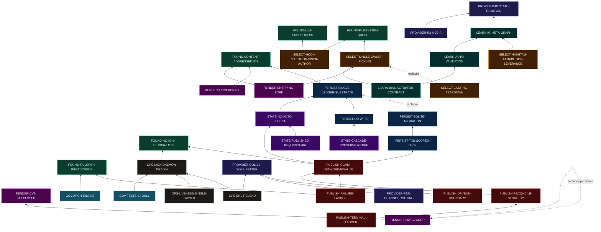

# FanOps — ADR Catalogue & Evidence Package

> **What this is.** A reconstructed catalogue of the architectural decisions that materially shaped
> FanOps, rebuilt from repository *evidence* — git history, merge/PR trail, the `.reports/architecture/`
> governance KB, the `docs/CODEMAPS/` subsystem traces, tests that encode invariants, in-code intent
> comments, and the 142-file project memory. **It is not a set of ADRs.** It is the evidence package
> from which ADRs can be written, plus the reports the archaeology asks for: missing-ADR, superseded-ADR,
> a chronological timeline, a dependency graph, a numbering scheme, and a formalization priority order.
>
> **Standard of proof (inherited from the repo's own audit method).** Every load-bearing claim cites
> `file:line`, a commit, a PR (`#NNN`), a tag, a test, or a memory record. Documentation and historical
> plans were treated as *leads, not proof*; where a plan and the merged code disagreed, **the code won**
> and the disagreement is recorded. Rationale that is not in the evidence is marked *"rationale not
> recorded"* rather than invented. Confidence is stamped per entry.
>
> **Produced:** 2026-07-15, against `main` @ `0a3b503` (tip #652). Line-anchored claims from the
> `.reports/architecture/` KB are pinned at its stated HEAD `fcffa73` (2026-07-14) — two days behind
> tip; where an anchor may have shifted it is noted. The repo's own lesson **INV-20 (line anchors rot,
> function names and semantics do not)** applies to this document too: trust the symbol, re-`grep` the line.

---

## 0. How to read this catalogue

- **§1 — Numbering scheme** (the recommended convention + why).
- **§2 — Master index** (every ADR candidate: number, slug, domain, status, confidence, priority). *This
  is the numbering authority; the catalogue body is slug-keyed.*
- **§3 — The catalogue**, grouped by domain. Each entry carries the full ADR field set.
- **§4 — Missing-ADR report** (decisions live in code, never written down; ranked).
- **§5 — Superseded / reversed-ADR report** (what replaced what, and why).
- **§6 — Chronological architectural timeline** (the eras, dated).
- **§7 — Dependency graph** (A *enabled* B; C *replaced* D; E *depends on* F).
- **§8 — Formalization priority order** (which ADRs to write first, and why).

**Field set per candidate** (the archaeology brief's schema): *Number · Title · Status · Date introduced ·
Current status · Problem · Context · Decision · Alternatives considered · Tradeoffs · Consequences ·
Evidence (code / commits / PRs / tests / docs+memory) · Still active? · Superseded by · Confidence.*

**Confidence key.** **High** = code + commit/PR + a test that pins it, or a first-hand KB `file:line`
read. **Medium** = code + one corroborating source; rationale partly inferred. **Low** = decision is
visible but its rationale or date is not firmly recoverable.

**Status key.** **Active** · **Superseded** · **Partially-superseded** (property holds, mechanism/scope
changed) · **Accepted-residual** (a known tradeoff the project chose to *keep* rather than fix).

---

## 1. Recommended numbering scheme

**Recommendation: keep the repo's existing convention — do not invent a new one.** The repo already
declares it in [`.agents/skills/domain-modeling/ADR-FORMAT.md`](../../.agents/skills/domain-modeling/ADR-FORMAT.md):

> *ADRs live in `docs/adr/` and use sequential numbering: `0001-slug.md`, `0002-slug.md` … Scan
> `docs/adr/` for the highest existing number and increment by one.*

That is the Nygard-standard convention and it is correct. The archaeology's job is only to (a) assign the
**back-fill numbers** for the decisions already made, and (b) fix the ordering rule.

**Ordering rule for the back-fill: chronological by the date the decision was *first made* (earliest =
`0001`).** ADR numbers are opaque unique handles — they are a *timeline*, not a taxonomy. Do **not**
encode the domain into the number (e.g. "01xx = persistence"): decisions routinely span domains
(the SQLite move touched persistence, ops, and CI at once), so a domain-keyed number rots the first time
a decision straddles two areas. Navigation by domain/status belongs in the **index (§2)**, not the number.

**Going forward** (new decisions): keep incrementing from the highest back-filled number. The `docs/adr/`
directory is created lazily (per the format doc) — this file is its natural `README.md`/index, and the
first real ADR file lands as `docs/adr/0001-<slug>.md`.

**Two indices, not a re-numbering:** because numbers are chronological, the domain grouping and the
status grouping live in §2's sortable index. A reader who wants "all persistence ADRs" or "all superseded
ADRs" reads the index; a reader who wants "what did we decide, in order" reads the numbers.

> The catalogue body below is headed by **stable slugs** (e.g. `PERSIST-SQLITE-STORE`). §2 maps each
> slug to its assigned `ADR-NNNN`. This keeps the evidence stable even if the chronological numbering is
> re-sequenced when the real ADR files are cut.

---

## 2. Master index

**99 canonical decisions**, deduped across the ten domain digs. IDs are assigned in **layered
(foundation-first) then within-domain-date** order for navigability; the pure acceptance-date sequence is
the timeline (§6). Numbers are opaque handles — **the slug is the stable anchor**; a maintainer cutting
real `docs/adr/NNNN-slug.md` files may adopt these or renumber to strict chronological per §1.
*Status:* `Active` · `Superseded` · `P-S` partially-superseded · `A-R` accepted-residual · `PROP` proposed/unapplied.
*Prio* = formalization tier (§8).

| № | Slug | Decision | First dated | Status | Conf | Prio |
|---|---|---|---|---|---|---|
| **Domain A — Foundational** |
| 0001 | `FOUND-CONTENT-ADDRESSED-IDS` | SHA-1[:12] content-addressed identity; builtin `hash()` banned | 06-01 | Active | H | 2 |
| 0002 | `FOUND-CONFIG-SOLE-OWNER` | `Config` sole runtime env owner; `Settings` doctor-only | 06 | Active/A-R | H/M | 3 |
| 0003 | `FOUND-SECRETS-ASYMMETRIC` | Secrets: reads fail-open, writes fail-closed (round-trip) | 06 | Active | M-H | — |
| 0004 | `FOUND-FAILOPEN-BREADCRUMB` | Fail-open-with-logged-breadcrumb norm, CI-ratcheted | 06 | Active | H | — |
| 0005 | `FOUND-LLM-SUBPROCESS` | The LLM is `claude -p` subprocess, not an HTTP API | 06 | Active | H | — |
| 0006 | `FOUND-FILESYSTEM-QUEUE` | The only queue is a filesystem queue (no broker) | 06 | Active | H | — |
| 0007 | `FOUND-NO-IO-IN-LEDGER-LOCK` | No network / heavy subprocess under the ledger lock | 06-21 | Active | H | 1 |
| **Domain B — Persistence & ledger** |
| 0008 | `PERSIST-SINGLE-LEDGER-SUBSTRATE` | One SQLite/WAL ledger, full-document replace | 07-09 | Active | H | 2 |
| 0009 | `PERSIST-SQLITE-MIGRATION` | JSON → SQLite behind a `LedgerStore` interface | 07-09 | Active | H | 2 |
| 0010 | `PERSIST-SCHEMA-MIGRATION-LADDER` | Additive v0→v11 ladder; newer schema refused | 06→07 | Active | H | 2 |
| 0011 | `PERSIST-TXN-SCOPED-LOCK` | Lock across load→mutate→save (lost-update close) | 07-09 | Active | H | 2 |
| 0012 | `PERSIST-NO-WIPE` | No-wipe / persist-by-default / day-bucket (HARD RULE) | 06-19 | Active | H | 2 |
| 0013 | `PERSIST-GATED-WIPE` | Snapshot + confirm-gated selective wipe (+ AR-02 residual) | 07-02 | Active/A-R | H | 1 |
| **Domain C — State model** |
| 0014 | `STATE-PER-UNIT-ENUMS` | Independent per-unit enums, immutable setters, reserved states | 06 | Active/A-R | H | 3 |
| 0015 | `STATE-NO-AUTO-PUBLISH` | Born `awaiting_approval`; publish iterates `queued` only (INV-08) | 06-19 | Active | H | **1** |
| 0016 | `STATE-PUBLISHED-REQUIRES-URL` | `published`⇒`public_url` (R1 type tripwire) | 06-29 | Active | H | 2 |
| 0017 | `STATE-CASCADE-PRESERVE-RETIRE` | Cascade preserves live/worklist; retire irreversible (PD-3) | 06-19 | Active/A-R | H | 2 |
| 0018 | `STATE-IMPORTED-MEDIA-UPSERT` | `ImportedMedia` natural-key latest-wins upsert | 07-02 | Active | H | — |
| **Domain D — Selection: personas / casting / hooks / hashtags** |
| 0019 | `SELECT-SINGLE-OWNER-PICKING` | Per-persona single-owner (`affinities` len==1) — the anchor | 07-05 | Active | H | **1** |
| 0020 | `SELECT-CASTING-TEARDOWN` | LLM casting + `AccountSelection` removed → affinities | 06-23→07-07 | Superseded chain | H | **1** |
| 0021 | `SELECT-OPERATOR-CASTING` | Operator casting = direct `affinities` mutation | 06-26→07-07 | Active | H | — |
| 0022 | `SELECT-ATOMIC-HOOK-INGEST` | Atomic-per-source (`if dec is None`); no bounded-skip | 07-05 | Active | H | 2 |
| 0023 | `SELECT-HOOK-RETENTION-VISION-AUTHOR` | Retention hook, vision author; editor/critic/taxonomy deleted | 06-20 | Active | H | 2 |
| 0024 | `SELECT-HOOK-BURN-NONFATAL` | `hook_burn_failed` ≠ `error`; operator restore review | 06-20 | Active | H | 3 |
| 0025 | `SELECT-CAPTIONS-HASHTAGS-ONLY` | Captions 3rd-person hashtags-only, owner×platform scoped | 06-15 | Active | H | — |
| 0026 | `SELECT-HASHTAG-ATTRIBUTION-SEVERANCE` | Hashtag worth = live Graph reach, never a post | 06-27 | Active | H | 2 |
| 0027 | `SELECT-PERSONA-CORPUS` | Per-persona corpus; VETTED=floor; propose/accept (S12 auto) | 06-23 | Active/P-S | H | 3 |
| 0028 | `SELECT-CONTENT-HASHTAGS-REVERTED` | Content-aware tags shipped then reverted to corpus-only | 06→07-10 | Superseded | H/M | — |
| 0029 | `SELECT-PERSONA-LEVER-ENGINE` | First-class Persona; `LEVER_REGISTRY` single truth | 06-27 | Active | H | 3 |
| 0030 | `SELECT-AGENT-GATE-ESCALATION` | 3-attempt gate: fail-closed moments / fail-open hooks (+intro_match residual) | 06 | Active/A-R | H | 3 |
| **Domain E — Clip / framing / render** |
| 0031 | `RENDER-SMART-FRAMING` | Subject/speaker-aware framing replaces blind crop (default-ON) | 06-27 | Active | H | 2 |
| 0032 | `RENDER-STATIC-CROP` | One static locked-off crop per shot; per-frame chase reverted | 06-28 | Active | H | **2** |
| 0033 | `RENDER-ADAPTIVE-ZOOM` | Face-size-adaptive zoom; far/mic-occluded held wide | 06-28 | Active | H | 3 |
| 0034 | `RENDER-CV2-FAILCLOSED` | cv2 REQUIRED, refuse loudly — the ONE fail-closed dep | 07-14 | Active | H | **1** |
| 0035 | `RENDER-FINGERPRINT` | Zoom-gated, geometry-versioned render fingerprint | 06-27 | Active | H | 2 |
| 0036 | `RENDER-TRUST-GATE` | Trust gate pins the OUTCOME, never the returned tuple | 07-14 | Active | H | 3 |
| 0037 | `RENDER-REFRAME-DRYRUN-APPLY` | Read-only dry-run → locked rollback-safe apply | 07-15 | Active | H | 3 |
| 0038 | `RENDER-ENTITY-NO-FORK` | Per-account `Render` entity; render fork deleted | 06-22→07 | Active/Superseded fork | H | — |
| 0039 | `RENDER-FFMPEG-MUXER-SUFFIX` | Atomic temp needs `.part.mp4` (muxer-by-extension) | 07-04 | Active | H | — |
| 0040 | `RENDER-YUNET-DETECTION` | YuNet over Haar; phantom filter; two-cluster recall | 06-27→07-15 | Active | H/M | — |
| **Domain F — Publish / schedule / reconcile** |
| 0041 | `PUBLISH-CLAIM-NETWORK-FINALIZE` | Three-phase handshake; claim committed pre-network | 06-21 | Active | H | **1** |
| 0042 | `PUBLISH-FAILURE-LADDER` | Network-ambiguity table; AuthError halts; no-downgrade | 07-06 | Active/A-R | H | **1** |
| 0043 | `PUBLISH-PER-POST-SCHEDULING` | Strictly-future suggestion; import-time monotonicity assert | 06-20 | Active | H | 2 |
| 0044 | `PUBLISH-RECONCILE-STRATEGY` | Date-windowed poll; `releaseURL`→url; permalink-trap-by-design | 06-20 | Active | H | 2 |
| 0045 | `PUBLISH-IDENTITY-VERIFICATION` | Verify identity at the transition (TikTok oEmbed / IG Graph) | 07-04 | Active | H | 2 |
| 0046 | `PUBLISH-TERMINAL-LADDER` | Terminal ladder = pure f(state, age) (RC-2) | 07-14 | Active | H | 2 |
| 0047 | `PUBLISH-DOUBLE-PUBLISH-DEFENCE` | Refuse at CLAIM (RC-1/RC-3b); heal → `needs_reconcile` | 07-11 | Active | H | 1 |
| 0048 | `PUBLISH-REPOST-FREELY` | Never build supersede/no-double-post (HARD RULE) | 06-18 | Active | H | 2 |
| 0049 | `PUBLISH-DRYRUN-BOUNDARY` | Halt `queued`+preview; two gates (+ INV-03 residual) | 06-26 | Active/A-R | H | 3 |
| 0050 | `PUBLISH-ARCHIVE` | Day-bucketed fail-open 0600 published archive | 06-19 | Active | M-H | — |
| **Domain G — Metrics / learning** |
| 0051 | `LEARN-AUTO-VALIDATION` | Auto-validate shape on first live metric (correctness gate) | 06-22 | Active | H | 2 |
| 0052 | `LEARN-VALIDATION-GATE` | OFF-until-proven + P4 floor (≥8×≥2) | 06-13 | Active | H | 3 |
| 0053 | `LEARN-REACH-FIRST` | Rank on raw Graph reach, not lift_score | 06-16 | Active | H | 3 |
| 0054 | `LEARN-IG-META-GRAPH` | IG metrics from Meta Graph (sole IG reader) | 07-02 | Active | H | 3 |
| 0055 | `LEARN-BIAS-ACTUATOR-CONTRACT` | Default-OFF + validation-frozen + amplify-only + no-auto-publish | 06-20→07-02 | Active | H | 2 |
| 0056 | `LEARN-CREATIVE-VARIATION` | v2 caption-safe / v3 amplify streak-gated / UCB / transfer | 06-04 | Active | H | — |
| **Domain H — Provider / go-live / secrets** |
| 0057 | `PROVIDER-PUBLISH-VS-MEASURE` | Publish via Postiz/Zernio only; Meta Graph read-only | 06-21 | Active | H | — |
| 0058 | `PROVIDER-BLOTATO-REMOVED` | Blotato removed; Zernio takes TikTok | 07-01 | Active | H | 3 |
| 0059 | `PROVIDER-REGISTRY` | Provider registry = single home for who-publishes-a-channel | 07-01 | Active | H | — |
| 0060 | `PROVIDER-GOLIVE-SOLE-SETTER` | `go_live` is the ONLY `FANOPS_LIVE=1` setter, 4-step gate | 06-14 | Active | H | **1** |
| 0061 | `PROVIDER-PER-CHANNEL-ROUTING` | Per-(handle×platform) routing is truth; `FANOPS_POSTER` legacy | 06-14 | Active/A-R | H | 3 |
| 0062 | `PROVIDER-FAIL-SAFE-LIVE` | Unknown poster/live value → dryrun; no false-LIVE | 06-14 | Active | H | — |
| 0063 | `PROVIDER-SECRETS-KEYRING` | Secrets → OS keyring, verify-on-write, write-only keys | 07-09 | Active | H | — |
| 0064 | `PROVIDER-R2-MEDIA` | IG media via Cloudflare R2 + host rewrite (dead-funnel fix) | 07-05 | Active | H | — |
| 0065 | `PROVIDER-META-PER-ACCOUNT` | Per-account Meta creds (publish-verification root cause) | 07-02 | Active | H | 2 |
| 0066 | `PROVIDER-SELF-HOSTED-POSTIZ` | Self-hosted Postiz + Mastra 1600-column workaround | 06-15 | Active/A-R | H | — |
| **Domain I — Ops / daemon / recovery** |
| 0067 | `OPS-LAZY-DAEMON-DRIVEN` | Lazy pull-only pipeline; launchd daemon is the driver | 06-14 | Active | H | — |
| 0068 | `OPS-LAUNCHD-KEEPALIVE` | KeepAlive resident, direct-exec plist, baked PATH | 06-14→07-11 | Active | H | 2 |
| 0069 | `OPS-ENV-RELOAD` | Per-tick `.env` reload reaches the resident daemon | 07-11 | Active | H | **1** |
| 0070 | `OPS-LIVENESS-SINGLE-OWNER` | One `daemon_progress` owner + RC-6 second verdict | 07-13→15 | Active | H | 2 |
| 0071 | `OPS-KEEPER-ADOPTS-PUMP` | External keeper adopts on code drift (execv reverted) | 07-13 | Active | H | 3 |
| 0072 | `OPS-CONTROL-FILE-CONTRACT` | No file silently steers runtime; atomic control-file writes | 06-16 | Active | H | 3 |
| 0073 | `OPS-RUN-LEASE` | One driver owns the converge loop (flock lease) | 07-11 | Active | H | — |
| 0074 | `OPS-RESPONDER-OPT-IN` | Explicit LLM opt-in + recurring-cost disclosure | 06 | Active | H | 3 |
| 0075 | `OPS-DEAD-MANS-SWITCH` | Heartbeat (mutation is the signal) + autopilot | 06-14 | Active | H | — |
| 0076 | `OPS-OPERATOR-TZ` | Operator-tz cadence, fail-closed to UTC | 06-29 | Active | H | — |
| 0077 | `OPS-GUARDED-DESTRUCTIVE-CLI` | Snapshot+confirm wipe; gc floor; root-divergence guard | 07 | Active | H | — |
| **Domain J — Studio** |
| 0078 | `STUDIO-LAZY-FLASK-NOAUTH` | Lazy Flask+htmx, localhost, no-auth by design (INV-21) | 06-06 | Active/A-R | H | 3 |
| 0079 | `STUDIO-ROUTE-ACTION-VIEW` | Thin route → one action (in-lock) or one view (pure read) | 06 | Active | H | — |
| 0080 | `STUDIO-APPROVAL-WORKLIST` | Review→Schedule→Posted; Studio is the approve gate | 06-19 | Active | H | — |
| 0081 | `STUDIO-ACCOUNT-FIRST` | `Batch` targets accounts; per-surface SKIP (v11) | 06-22 | Active | H | 3 |
| 0082 | `STUDIO-HTMX-200-ERRORS` | htmx 2.x errors re-render at HTTP 200 | 07 | Active | H | — |
| 0083 | `STUDIO-CHUNKED-UPLOAD` | Path-safe atomic chunked resumable upload | 07 | Active | H | — |
| 0084 | `STUDIO-UI-SYSTEM` | 4 locked IA + severity ladder + dark→light retheme | 06→07-04 | Active/P-S | H/L | 3 |
| 0085 | `STUDIO-JINJA-GLOBALS` | Macro-internal helpers as jinja globals | 06 | Active | H | — |
| 0086 | `STUDIO-DEV-SERVER` | Template hot-reload, restart-to-render, threaded, debug-off | 07 | Active | H | — |
| 0087 | `STUDIO-NEXTJS-SHELVED` | Next.js SPA planned, never adopted (deferred) | 06-28 | PROP/shelved | H | 3 |
| **Domain K — Governance / CI / testing** |
| 0088 | `GOV-TESTS-CI-ONLY` | Tests CI-only; pytest denied to the agent | 07-12 | Active | H | 2 |
| 0089 | `GOV-TWO-REQUIRED-GATES` | Two required gates + skip→fail hooks (+G1 residual) | — | Active/A-R | H | — |
| 0090 | `GOV-ARCH-ENGINE` | Cycle-7 engine: DERIVED/DECLARED, pure-fn artifacts, neg-controls, tracked-KB | 07-15 | Active | H | 2 |
| 0091 | `GOV-AST-RATCHETS` | New silent except / internal print / dropped cause = CI-red | 07 | Active | H | — |
| 0092 | `GOV-HOUSE-STYLE` | Compact one-liners; no black/ruff-format | — | Active | H | — |
| 0093 | `GOV-DEADLOCK-TIMEOUT` | 60 s pytest timeout = ledger-deadlock guardrail | — | Active | H | 2 |
| 0094 | `GOV-SLO-GATE` | Blocking unit-pytest SLO gate | 07 | Active | H | — |
| 0095 | `GOV-MULTI-AGENT-ORCHESTRATION` | Lane guard + PR-collision + worktree + merge-only orchestrator | 07-11 | Active | H | — |
| 0096 | `GOV-ENFORCEMENT-GATE-DISABLED` | Enforcement gate built then disabled (dormant) | 07-11→15 | Superseded | H | 3 |
| 0097 | `GOV-CI-ONLY-APPROVAL` | 0 reviews, no CODEOWNERS, admin bypass (accepted risk) | 07-11 | Active/A-R | H | — |
| 0098 | `GOV-CYCLE-REMEDIATION` | Cycle-based self-audit + implementation contract | 07-15 | Active | H | — |
| 0099 | `GOV-CI-CONTROL-PLANE-GAP` | Merge policy not machine-verifiable (review thesis) | 07-15 | PROP | H | — |

---

## 3. The catalogue

### Domain A — Foundational & cross-cutting primitives

*The contracts with no domain knowledge, and the whole-system stances (identity, the env boundary,
secrets, the failure norm, where the LLM and the queue live). Line anchors from the `.reports/architecture/`
KB (HEAD `fcffa73`).*

---

#### `FOUND-CONTENT-ADDRESSED-IDS` — Content-addressed, salt-free deterministic identity
- **Status:** Active
- **Date introduced:** 2026-06-01 — `0554e5d feat: content-addressed ids + surface_key` (day-1 scaffold)
- **Problem:** Re-running any pipeline stage must be idempotent *across processes*. Python's builtin
  `hash()` is salted per interpreter (PEP 456), so ids would differ every run and mint duplicate posts.
- **Context:** The pipeline is lazy/daemon-driven and re-runs `advance()` repeatedly; ids are the dedup
  key for the `add_*` `setdefault` family.
- **Decision:** All entity ids are `sha1`-derived from stable content tokens (`ids._hash`, truncated to
  12 hex, `usedforsecurity=False`). `make_id`, `child_id`, `surface_key(account, platform) = "account|platform"`.
  **The builtin `hash()` is banned.**
- **Alternatives considered:** builtin `hash()` (rejected in the module docstring); positional index
  tokens for children (rejected — `child_id` must take a content token, never an index).
- **Tradeoffs:** sha1 collision risk accepted at 12-hex for non-security use; reposts must add an epoch
  suffix precisely *because* ids are otherwise stable and `setdefault` would drop the collision.
- **Consequences:** whole-pipeline replay is a no-op; first-write-wins dedup for renders; enabled the
  `setdefault` semantics the whole ledger relies on.
- **Evidence — Code:** `src/fanops/ids.py:1-27` (INV-16); `crosspost.py:36-37` (explicit sha1 + why).
- **Evidence — Commits/PRs:** `0554e5d`; `c2d8cdc` (#312, MOL-108 — `usedforsecurity=False` for FIPS).
- **Evidence — Tests:** `tests/test_ids.py` — `test_no_builtin_hash_in_source` (greps source for `hash(`),
  `test_child_id_is_content_addressed_not_positional`, `test_content_id_stable_across_processes`.
- **Evidence — Docs/Memory:** `INVARIANT_AUDIT.md` INV-16; C1 codemap.
- **Still active?** Yes — every `add_*` and reconcile path depends on it.
- **Superseded by:** n/a
- **Confidence:** High

---

#### `FOUND-CONFIG-SOLE-OWNER` — `Config` is the sole runtime env owner; `Settings` is a doctor-only strict validator
- **Status:** Active (Accepted-residual: two hand-rolled parsers for one env surface)
- **Date introduced:** foundational (2026-06 era); hot-path restored `739abc8 fix(config): restore os.getenv hot path, drop per-read Settings()` (MOL-467, 2026-07-09)
- **Problem:** Runtime reads must be lenient and *live* (a `go_live` env write must be visible
  immediately, with no new object), while a preflight doctor must be *strict* (raise on a bad value).
- **Context:** 73 env vars; three writers of the environment; a Studio and a daemon with different
  `.env` re-read behaviour.
- **Decision:** `Config` owns runtime env reads **exclusively** — every property is an `os.getenv`
  evaluated *per access*, uncached. `Settings` never feeds `Config` (`Settings.runtime_load` has **zero
  callers**); it is only a doctor-strict validator + a docs/introspection surface. **The strict/lenient
  split is intentional, not drift.**
- **Alternatives considered:** a single cached settings object feeding runtime (rejected — would not see
  a live `os.environ` write); `extra="forbid"`-style strict runtime (rejected — runtime must fall back,
  not raise).
- **Tradeoffs:** `_VALID_BACKENDS` is **defined twice** (`config.py:72`, `settings.py:18`), guarding the
  write and read boundaries separately — if they drift the two boundaries disagree on a legal backend
  (the gap `RC-3`/`INV-03` rides). Accepted as a maintenance hazard, not a correctness one.
- **Consequences:** a `go_live` `os.environ[...]` write is visible on the next attribute access without a
  new `Config`; `MOL-467` explicitly reverted a per-read `Settings()` regression back to the hot path.
- **Evidence — Code:** `config.py` (per-access `os.getenv`); `settings.py:1,142-143`; `INV-05` full trace.
- **Evidence — Commits/PRs:** `739abc8` (MOL-467).
- **Evidence — Tests:** `tests/test_config.py`, `tests/test_config_verb.py`, `tests/test_config_doc_drift.py`.
- **Evidence — Docs/Memory:** `INVARIANT_AUDIT.md` INV-05; `KNOWLEDGE_BASE.md` S02.
- **Still active?** Yes.
- **Superseded by:** n/a
- **Confidence:** High (mechanism, from first-hand KB read) / Medium (exact origin date).

---

#### `FOUND-SECRETS-ASYMMETRIC` — Secrets: reads fail-OPEN, writes fail-CLOSED (keyring-first, round-trip-verified)
- **Status:** Active
- **Date introduced:** foundational; keyring-first hardened in the production-grade round-2 batch (MOL-344 era, 2026-07)
- **Problem:** A missing secret must degrade gracefully (read fail-open), but a *write* that silently
  fails would leave the caller believing a secret is stored while it scrubs the plaintext `.env` fallback.
- **Context:** Secrets live keyring-first with a `.env` fallback; the caller scrubs plaintext on a
  successful write.
- **Decision:** `set_secret` writes, then **reads it back and raises if the value does not round-trip**
  (fail-closed write); reads fail open. The API key is write-only — never rendered back to any surface.
- **Alternatives considered:** rationale for the exact split not separately recorded beyond the KB note.
- **Tradeoffs:** a broken keyring backend must warn-once rather than 64k-flood (a later fix, MOL-359).
- **Consequences:** `go_live` can safely scrub the plaintext key after a confirmed write.
- **Evidence — Code:** `secret_provider.py`; `KNOWLEDGE_BASE.md` S02 "Secrets contract".
- **Evidence — Commits/PRs:** production-grade round-2 (MOL-344 keychain); MOL-359 (warn-once).
- **Evidence — Tests:** `tests/test_secret_provider.py`, `tests/test_secret_write_routing.py`, `tests/test_env_perms.py`.
- **Evidence — Docs/Memory:** `production-grade-round2-tickets.md`; `issue7-issue9-mostly-already-fixed.md`.
- **Still active?** Yes.
- **Superseded by:** n/a
- **Confidence:** Medium-High (contract from KB; date/PR partly from memory).

---

#### `FOUND-FAILOPEN-BREADCRUMB` — House failure norm: fail-open with a logged breadcrumb, ratcheted in CI
- **Status:** Active
- **Date introduced:** foundational; AST ratchet added mid-project (`test_swallow_ratchet.py`)
- **Problem:** One bad source/frame/network blip must never wedge the whole pass, but a *silent* swallow
  hides real failures and creates later poison pills.
- **Context:** 721 exception handlers; **0 bare `except:`**; ~46% broad `except Exception`, mostly on read
  paths.
- **Decision:** The norm is **fail-open with a logged breadcrumb**. CI ratchets it: a *new* silent broad
  `except` fails `tests/test_swallow_ratchet.py`. The grandfathered-silent set is a frozen baseline. Some
  swallows are contract-correct and explicitly exempt (audit write, `_archive_published`, `_quarantine`).
- **Alternatives considered:** fail-closed everywhere (rejected — one bad unit would wedge the pass);
  unratcheted convention (rejected — drifts).
- **Tradeoffs:** the exactly-one fail-*closed* exception (cv2/`[framing]`) is a deliberate carve-out
  (see `RENDER-CV2-FAILCLOSED`); `Post.error_reason` became an overloaded control channel (four
  semantics in one free-text field — `COUP-03`, an accepted residual).
- **Consequences:** the failure-normalisation ladder on the publish path is the most carefully engineered
  surface in the tree (see `PUBLISH-NETWORK-AMBIGUITY`).
- **Evidence — Code:** `FAILURE_SEMANTICS.md` §1 (census), §5, §7; `pipeline._quarantine`.
- **Evidence — Commits/PRs:** AST-ratchet introduction (governance domain — see `GOV-AST-RATCHETS`).
- **Evidence — Tests:** `tests/test_swallow_ratchet.py`, `tests/test_internal_prints_routed.py`, `tests/test_traceback_chaining.py`, `tests/test_fail_open_logging_mol67.py`, `tests/test_fail_open_primitive.py`.
- **Evidence — Docs/Memory:** `FAILURE_SEMANTICS.md`; `fanops-ast-ratchets-catch-new-except-and-prints.md`.
- **Still active?** Yes.
- **Superseded by:** n/a
- **Confidence:** High

---

#### `FOUND-LLM-SUBPROCESS` — The LLM is a subprocess (`claude -p`), not an HTTP API
- **Status:** Active
- **Date introduced:** foundational (agent-gate design, 2026-06)
- **Problem:** The system must consult an LLM for moment-picking, hooks, and captions without owning an
  API key or an HTTP client, riding the operator's existing auth.
- **Context:** The operator already has `claude login`; `ANTHROPIC_API_KEY` is not required and
  `claude --bare -p` provably fails (it never reads the keychain).
- **Decision:** The **only** place an LLM is consulted is `S07` (agentstep/responder/llm/prompts), and it
  shells `claude -p` as a subprocess. No HTTP API, no in-process SDK.
- **Alternatives considered:** direct Anthropic HTTP API (rejected — would require key management the
  operator flow avoids).
- **Tradeoffs:** couples the system to the local `claude` CLI + login; the gate is a filesystem queue
  (see `FOUND-FILESYSTEM-QUEUE`).
- **Consequences:** everything LLM-shaped rides the agent-gate; escalation is 3 attempts then fail-closed
  (moments) or synthesized fail-open (hooks/captions).
- **Evidence — Code:** `KNOWLEDGE_BASE.md` S07; `responder.py`, `llm.py`, `prompts.py`.
- **Evidence — Tests:** `tests/test_responder.py`, `tests/test_llm.py`, `tests/test_prompts.py`, `tests/test_agentstep.py`, `tests/test_autopilot.py`.
- **Evidence — Docs/Memory:** `ARCHITECTURE_MANIFEST.md` §1; `KNOWLEDGE_BASE.md` S07.
- **Still active?** Yes.
- **Superseded by:** n/a
- **Confidence:** High

---

#### `FOUND-FILESYSTEM-QUEUE` — The only queue in the system is a filesystem queue (no broker)
- **Status:** Active
- **Date introduced:** foundational (agent-gate design, 2026-06)
- **Problem:** LLM requests must be durably queued and correlated to responses without standing up a
  message broker.
- **Context:** Requests are answered out-of-band by `claude -p`; the pipeline is launchd-driven.
- **Decision:** `04_agent_io/requests/{kind}__{key}.request.json` ↔ `.response.json`, correlated by a
  stamped `request_id`. **No broker, no in-process queue.** The publish "queue" is the ledger itself, not
  this filesystem queue.
- **Alternatives considered:** a message broker / in-process queue (rejected — over-infra for a
  single-host launchd system).
- **Tradeoffs:** a stale-answer guard is needed (re-read `latest_request_id` after the model call, drop a
  mid-flight re-seed); an unregistered gate kind accumulates unanswerable files forever (the
  `intro_match` residual — see `SELECT-INTRO-MATCH-UNFINISHED`).
- **Consequences:** the gate-kind registry is triplicated and unlinked (`AR-14`) — a standing risk.
- **Evidence — Code:** `KNOWLEDGE_BASE.md` S07 (QUE-001); `STATE_MACHINE.md` §10.
- **Evidence — Tests:** `tests/test_responder.py`, `tests/test_responder_concurrent.py`, `tests/test_router.py`.
- **Evidence — Docs/Memory:** `ARCHITECTURE_MANIFEST.md` §1,§2.1.
- **Still active?** Yes.
- **Superseded by:** n/a
- **Confidence:** High

---

#### `FOUND-NO-IO-IN-LEDGER-LOCK` — The cardinal rule: no network call and no heavy subprocess ever runs inside the ledger lock
- **Status:** Active
- **Date introduced:** foundational; publish-side enforced `6b93c02` (#89, 2026-06-21); produce-side by the `in_lock=True` adopt-or-defer contract
- **Problem:** Holding the single ledger lock across a slow network POST or a 30–60 min whisper/ffmpeg run
  would block every concurrent daemon/Studio/CLI writer up to the lock timeout.
- **Context:** One SQLite ledger lock (`BEGIN IMMEDIATE`, 30 s); heavy work is whisper/ffmpeg/upload/POST.
- **Decision:** **No network and no heavy subprocess runs under the ledger lock — verified at every
  site.** Produce stages take `in_lock=True` and *adopt-or-defer* (never shell under the lock; a cold
  cache costs one tick, never a held lock). Publish uses claim→network→finalize with the network between
  two short txns.
- **Alternatives considered:** whole-pass transaction (the refuted prior design, reversed at #89).
- **Tradeoffs:** publish is no longer atomic with the pass — hence `needs_reconcile` for ambiguous sends.
- **Consequences:** underpins the whole concurrency model; the 60 s pytest timeout is the deadlock
  guardrail for exactly this.
- **Evidence — Code:** `ARCHITECTURE_MANIFEST.md` §1 ("cardinal rule"); `pipeline.py:162,164` (adopt-or-defer).
- **Evidence — Commits/PRs:** `6b93c02` (#89).
- **Evidence — Tests:** `tests/test_publish_lockfree.py`, `tests/test_reconcile_lockfree.py`, `tests/test_pipeline_concurrent.py`.
- **Evidence — Docs/Memory:** `FAILURE_SEMANTICS.md` §9; `ARCHITECTURE_MANIFEST.md`.
- **Still active?** Yes.
- **Superseded by:** n/a (this *is* the reversal of the whole-pass-txn design; see §5).
- **Confidence:** High

---

### Domain B — Persistence & Ledger

*Single source of truth: the `Ledger` facade over a SQLite/WAL store. Evidence primarily from Agent-A dig
+ `STATE_MACHINE.md`/`INVARIANT_AUDIT.md` first-hand reads.*

---

#### `PERSIST-SINGLE-LEDGER-SUBSTRATE` — One SQLite ledger, WAL + synchronous=FULL, full-document replace
- **Status:** Active
- **Date introduced:** 2026-07-09 (SQLite substrate) — `9494ab4` (MOL-347); ledger-facade design predates it
- **Problem:** The system needs one atomic, crash-durable store for the whole `Source→Moment→Clip→Post`
  lineage (+ Render/Stitch/Batch/ImportedMedia), writable safely by concurrent daemon/Studio/CLI.
- **Context:** There is **no per-entity store**; every entity state lives in one ledger, 8 entity maps.
- **Decision:** `00_control/ledger.sqlite`, `journal_mode=WAL`, `synchronous=FULL`, `chmod 0600`, a
  two-table kv schema (`ledger_meta` + `ledger_rows`). Every save is a **full-document replace**
  (`DELETE FROM …; re-INSERT every row of every map`) inside one write txn. Atomicity is
  **per-transaction, never per-field**.
- **Alternatives considered:** row-level diff writes (rejected — full replace is simpler and still atomic);
  per-entity stores (rejected — one lock, one truth).
- **Tradeoffs:** O(n) serialization per save (accepted at current scale); WAL sidecars need cleanup on
  restore.
- **Consequences:** two fields mutated in one `Ledger.transaction` commit together or not at all; a
  transition is durable only at transaction exit.
- **Evidence — Code:** `ledger_sqlite.py:27-71`; `STATE_MACHINE.md` §0.
- **Evidence — Commits/PRs:** `9494ab4` (MOL-347).
- **Evidence — Tests:** `tests/test_ledger_sqlite_store.py` — `test_pragma_journal_mode_is_wal`, `test_pragma_synchronous_is_full`.
- **Evidence — Docs/Memory:** `STATE_MACHINE.md` §0; `KNOWLEDGE_BASE.md` S03.
- **Still active?** Yes — sole production substrate.
- **Superseded by:** n/a
- **Confidence:** High

---

#### `PERSIST-SQLITE-MIGRATION` — JSON ledger → SQLite/WAL behind a `LedgerStore` interface (JSON fully removed)
- **Status:** Active (supersedes the JSON store)
- **Date introduced:** 2026-07-09 — the MOL-346→351 chain, all in one day (#474–#479)
- **Problem:** The JSON store forced flock-serialization, an O(all-records) full-file rewrite per save,
  11 manual backups, and a corruption window on write. The highest-leverage production-grade move.
- **Context:** A 42-method `Ledger` facade already abstracted persistence; only the primitive needed
  swapping.
- **Decision:** Extract a `LedgerStore` Protocol (`read_raw`/`write_raw`/`lock`/`snapshot`/`restore`);
  sole impl `SqliteLedgerStore`; a one-shot idempotent `ledger_bridge.import_json_to_sqlite` migrates
  legacy JSON (parity-checked, atomic `os.replace`). Production never writes `ledger.json` again
  (break-glass rollback artifact only).
- **Alternatives considered:** keep JSON (rejected); a runtime `FANOPS_LEDGER_BACKEND` selector shipped at
  MOL-349 as a parity bridge, then **removed** at MOL-351 once SQLite proved out (sqlite-only).
- **Tradeoffs:** full-document replace retained for simplicity; the selector's brief life is a documented
  add-then-remove.
- **Consequences:** the kernel releases the SQLite lock on process death (self-healing) — unlike an
  `O_EXCL` sentinel; concurrent readers see the last commit while a writer holds the txn.
- **Evidence — Code:** `ledger_sqlite.py:1-155`, `ledger_bridge.py:1-95`, `ledger.py:365-389` (Protocol + `_resolve_store`).
- **Evidence — Commits/PRs:** `ed3f9b9` (MOL-346), `9494ab4` (347, #475), `9ea4739` (348, #476), `c733a64` (349), `c801d16` (350, #478), `9b19f97` (351, #479).
- **Evidence — Tests:** `tests/test_ledger_json_to_sqlite_bridge.py` (`test_full_fixture_schema11_import_reconstructs_byte_identical`), `tests/test_ledger_store_interface.py` (`test_ledger_defaults_to_sqlite_store`), `tests/test_ledger_sqlite_store.py` (`test_killed_mid_write_recovers_prior_commit`).
- **Evidence — Docs/Memory:** `production-grade-round2-tickets.md`.
- **Still active?** Yes — sole production backend.
- **Superseded by:** n/a
- **Confidence:** High

---

#### `PERSIST-SCHEMA-MIGRATION-LADDER` — Additive, forward-compatible schema migration (v0→v11); newer schema refused, never downgraded
- **Status:** Active
- **Date introduced:** foundational; currently v11 via `48b4e2f` (MOL-154, 2026-07-07)
- **Problem:** A model change must not silently field-drop or crash-load; an older binary must survive a
  newer ledger; a newer binary must not corrupt a forward ledger on downgrade.
- **Context:** Pydantic constructs units from the raw dict after migration.
- **Decision:** `SCHEMA_VERSION = 11`; `_MIGRATIONS` maps each `N ← N-1` transform, hop-chained; a gap is
  a **fatal typed error**. Every step is additive/idempotent/never-raising. Forward-compat rests on
  Pydantic's default `extra="ignore"` (deliberately never `extra="forbid"`). A ledger newer than the code
  is **refused loudly** (`_NewerSchema`), never loaded-and-field-dropped.
- **Alternatives considered:** `extra="forbid"` (rejected — would hard-error an old binary on a forward
  ledger); silent load of a newer schema (rejected — drops future fields on save).
- **Tradeoffs:** the ladder must stay gapless; a new top-level map needs matching load/save lines or it
  silently drops on next save (pinned by a round-trip test). The v8→v9 hop *creates* the
  `account_selections` map that v11 later *drops* — hop-chain absorbs it.
- **Consequences:** underpins `PERSIST-FORWARD-COMPAT` and the account-selection reversal.
- **Evidence — Code:** `ledger.py:190,218-259,436-440`; `models.py:171-176` (extra="ignore").
- **Evidence — Commits/PRs:** `9e92a6a` (v10), `48b4e2f` (v11, MOL-154), `c39fcd2` (v6 renders), `b5f3d26` (v7).
- **Evidence — Tests:** `tests/test_ledger_migration.py` (`test_schema_version_is_eleven`, `test_newer_schema_still_refused`), `tests/test_ledger_schema.py` (`test_module_docstring_names_every_persisted_map`), `tests/test_models_extra_ignore.py`.
- **Evidence — Docs/Memory:** `INVARIANT_AUDIT.md` INV-13, INV-19; C1 codemap.
- **Still active?** Yes.
- **Superseded by:** n/a
- **Confidence:** High

---

#### `PERSIST-TXN-SCOPED-LOCK` — Transaction-scoped lock across load→mutate→save (lost-update close, AUDIT B4)
- **Status:** Active (supersedes save()-only locking)
- **Date introduced:** AUDIT B4 remediation; `BEGIN IMMEDIATE`-backed at the SQLite flip (2026-07-09)
- **Problem:** A `save()`-only lock left a lost-update window: two overlapping passes both loaded a stale
  snapshot, last save won, the other's updates vanished — silently dropping/duplicating posts under cron.
- **Context:** Daemon + Studio + CLI are concurrent writers on one ledger.
- **Decision:** `Ledger.transaction(cfg)` acquires the store lock *before* load and holds it across
  load→mutate→save, saving **once on clean exit only** (an uncaught raise rolls back to the prior commit).
  The lock is SQLite `BEGIN IMMEDIATE` with a 30 s busy timeout → typed `LockBusyError`. `save()` must
  never be called inside a transaction (self-deadlock).
- **Alternatives considered:** `save()`-only locking (the refuted prior design); an `O_EXCL` sentinel
  (rejected — wedges on process death; the SQLite lock self-heals).
- **Tradeoffs:** a second live process is fully excluded for the txn duration (bounded by timeout).
- **Consequences:** the **60 s pytest global timeout is a deadlock guardrail** for exactly this busy
  timeout — a hanging test is the concurrency bug, never a reason to raise the timeout.
- **Evidence — Code:** `ledger.py:468-516`, `ledger_sqlite.py:84-108`; `STATE_MACHINE.md` §0.
- **Evidence — Commits/PRs:** M1-F arc (`9b19f97`); AUDIT B4 predates the SQLite flip.
- **Evidence — Tests:** `tests/test_ledger_lock.py` (`test_transaction_holds_lock_across_the_whole_block`, `test_live_writer_excludes_second_acquirer_with_typed_error`).
- **Evidence — Docs/Memory:** `tests/CLAUDE.md` (deadlock-guardrail rationale); `INVARIANT_AUDIT.md` INV-12.
- **Still active?** Yes.
- **Superseded by:** n/a
- **Confidence:** High

---

#### `PERSIST-NO-WIPE` — No-wipe / persist-by-default / day-bucket (HARD RULE)
- **Status:** Active
- **Date introduced:** 2026-06-19 operator directive → `2dac690` Phase-1 wipe-safety; `created_at` day-anchor ~2026-06-20
- **Problem:** Repeated manual `mv ledger.json` resets destroyed an operator's in-flight 51-clip review.
  The system must never silently discard ingested/awaiting content.
- **Context:** The pipeline itself never wiped (ingest is content-addressed/idempotent, `advance`
  accumulates) — every wipe was a manual reset.
- **Decision:** Persist + accumulate by default; content bucketed by day (ISO-8601 UTC `created_at`/
  `published_at`), retained via GC keep-days. `rebuild_catalog` **adds orphans only — never retires a
  missing-file source**. Every migration is copy-on-write, additive, never-raising.
- **Alternatives considered:** casual fresh-ledger A/B reset (**banned** as a default move).
- **Tradeoffs:** ledger grows unbounded absent GC; O(n) scans accepted at scale.
- **Consequences:** the *only* sanctioned destruction path is the gated wipe (`PERSIST-GATED-WIPE`);
  `retire_source` leaves the file on disk deliberately.
- **Evidence — Code:** `ledger.py:763-774` (rebuild wipe-safety), `models.py` (`created_at`/`published_at`).
- **Evidence — Commits/PRs:** content-lifecycle arc `2dac690`,`55c3449`,`e582723`,`9053ff8`,`a923df8`.
- **Evidence — Tests:** `test_rebuild_idempotent_and_keeps_missing_file_sources`; `tests/test_ledger_migration.py` idempotency.
- **Evidence — Docs/Memory:** `no-wipe-persist-lifecycle-directive.md`, `content-lifecycle-built.md`.
- **Still active?** Yes — HARD RULE.
- **Superseded by:** n/a
- **Confidence:** High

---

#### `PERSIST-GATED-WIPE` — Snapshot-gated, confirm-gated selective wipe ("fall-away") + rollback
- **Status:** Active
- **Date introduced:** 2026-07-02 `b6e7e0c` (MOL-32/33); CLI exposure `680a73e` (MOL-223, #542)
- **Problem:** The no-wipe rule needs *one* sanctioned reclamation path that can never destroy learning
  data or run unsnapshotted/unconfirmed.
- **Context:** The only legitimate wipe removes rows whose entire descendant closure carries no kept post.
- **Decision:** `ledger_wipe.compute_wipe_set` computes the transitive removal set (a post is kept iff
  analyzed-or-has-metrics); `execute_wipe` **refuses** without a verified-restorable snapshot
  (`SnapshotRequired`) and without explicit operator confirm (`WipeNotConfirmed`). `keep_history` opt-in
  keeps the learning corpus. Rollback via a timestamped, collision-proof SQLite `.backup()` bundling
  `accounts.json`/`personas.json`.
- **Alternatives considered:** unconditional reset (the banned manual move); a global engagement-floor
  auto-absorb (rejected as spam-prone).
- **Tradeoffs:** wipe is deliberately hard to invoke. **Residual (`AR-02`, CRITICAL):** `restore_snapshot`
  takes the residual `fcntl.flock` in *no lock domain* then `os.replace`s the DB — a live writer's commit
  can be silently discarded and its deferred media unlinks proceed. Filed, not fixed; no production caller
  (break-glass only).
- **Consequences:** see the superseded/residual report (§5) for `AR-02`.
- **Evidence — Code:** `ledger_wipe.py:47-253`, `ledger.py:527-553`.
- **Evidence — Commits/PRs:** `b6e7e0c` (MOL-32/33), `337577c` (MOL-75, #292), `680a73e` (MOL-223, #542), `1e853d7` (MOL-469), `caa010c` (MOL-71, #306).
- **Evidence — Tests:** `tests/test_ledger_wipe.py`, `tests/test_ledger_snapshot_control.py`, `tests/test_cli_wipe.py`, `tests/test_studio_wipe.py`.
- **Evidence — Docs/Memory:** C1 codemap; `INVARIANT_AUDIT.md` INV-07/AR-02.
- **Still active?** Yes.
- **Superseded by:** n/a
- **Confidence:** High (the wipe gate) / High (the AR-02 residual, first-hand KB read).

---

### Domain C — Entity state model & lifecycle

*Per-unit enums over one ledger; the invariants that make concurrent/duplicate writers safe. Evidence:
`STATE_MACHINE.md`/`INVARIANT_AUDIT.md` first-hand + Agent-A/B digs.*

---

#### `STATE-PER-UNIT-ENUMS` — Independent per-unit state enums with immutable setters + per-unit `error` quarantine
- **Status:** Active — **Date:** foundational; immutable `model_copy` setters hardened by ECC fix #10
- **Problem:** a single shared lifecycle enum entangles unrelated units; one unit's failure must quarantine that unit without stalling the pass.
- **Decision:** 5 independent state enums (`Source`/`Moment`/`Clip`/`Post`/`Render`/`Stitch`/`Batch`), each with an `error` member; transitions go through typed setters that **replace not mutate** (`model_copy(update=…)`, safe even if a model is frozen). `_quarantine` converts a per-unit exception into a typed `error` row so one bad source never wedges the pass.
- **Alternatives:** shared linear enum (rejected in `models.py` docstring); in-place `.state =` (replaced by immutable copy).
- **Tradeoffs / residual:** several enum members are **reserved with zero writers** — `RenderState.{queued,published,analyzed,retired}` (driverless, Cycle-1 FIND-001), `ClipState.{published,analyzed}`, `PostState.{error,retired}`, `BatchState.{closed,error}`. This is deliberate (`retired` = the M4 supersede that was never built, coherent with repost-freely) — **an accepted residual**, exempted from the liveness test.
- **Evidence:** `models.py:61-127`; `ledger.py:569-572`; `STATE_MACHINE.md` §1; `INVARIANT_AUDIT.md` INV-06. Tests: `test_quarantine_immutable.py`, `test_state_liveness.py` (`test_every_enum_member_classified`).
- **Confidence:** High

---

#### `STATE-NO-AUTO-PUBLISH` — Every Post born `awaiting_approval`; publish iterates `queued` only (INV-08, the cardinal safety property)
- **Status:** Active — **Date:** 2026-06-19 (#56–#59); default-state fix `ca8ea76` (2026-06-26)
- **Problem:** a live daemon would auto-publish to Instagram on a timer with no human gate; the prior `queued` default made a bare `Post()` publishable on the next `publish_due`.
- **Decision:** `Post.state` defaults to `awaiting_approval` (the *model default*, so even `Post(...)` is unpublishable). `approve_post` is the **only** setter of `queued`, guarded on `state is awaiting_approval`. `publish_due`/`publish_now`/`reconcile`/`track` iterate `queued` only. Three enumerated mint sites, frozen in `src/fanops/CLAUDE.md`.
- **Alternatives:** a parallel `approved` boolean flag (rejected — reusing `queued` gave near-zero blast radius).
- **Tradeoffs:** `queued` overloads "approved + scheduled"; the change silently no-op'd helpers that filtered the old state (a documented ripple).
- **Consequences:** upheld across all five audit cycles (INV-08); the strongest safety invariant in the tree. The approval *worklist UX* lives in Studio (`STUDIO-APPROVAL-WORKLIST`).
- **Evidence:** `models.py:298`, `ledger.py:575-599`, `crosspost.py:234-238`, `run.py:442`; `INVARIANT_AUDIT.md` INV-08. Tests: `test_post_approval.py`, `test_published_state_invariant.py`. Commits: #56 `4ddb94d`…#59 `d351d70`.
- **Confidence:** High

---

#### `STATE-PUBLISHED-REQUIRES-URL` — `published`/`analyzed` ⇒ non-empty `public_url` (R1 type-level invariant)
- **Status:** Active (narrowed) — **Date:** 2026-06-29 `d512ea1` (#240)
- **Problem:** five ghost rows `Post(state=published, public_url="")` shipped on 2026-06-29 — "published" meant both "backend acked" and "operator has a permalink" with no binding; the Posted tab had nothing to render.
- **Decision:** a `@model_validator(mode="after")` raises when `state ∈ {published, analyzed}` and `public_url` is blank. A backend that can't return a URL must park in `needs_reconcile`.
- **Alternatives:** per-call-site checks (rejected for a structural invariant).
- **Tradeoffs / correction:** the required set was **narrowed** `{published, analyzed, retired}` → `{published, analyzed}` (`retired` de-gated as an archival terminal that may lack a URL). **Refined mechanism (INV-01):** pydantic v2 does *not* re-validate on `model_copy`/assignment/serialization — the validator is a **load-time tripwire**, not a write-time gate; the property actually holds via four independent manual guards at the call sites. A 6th unguarded door would save fine then make the ledger unloadable on next start.
- **Evidence:** `models.py:356-381`; `run.py:305,313`; `INVARIANT_AUDIT.md` INV-01. Tests: `test_published_state_invariant.py` (7 angles).
- **Confidence:** High

---

#### `STATE-CASCADE-PRESERVE-RETIRE` — Reconcile cascade preserves-and-retires; never orphans a live/worklist post; retire is irreversible
- **Status:** Active — **Date:** 2026-06-19 `2dac690`; file-unlink `61f586c` (MOL-77)
- **Problem:** re-ingest/reconcile cascade-deletes dropped moments; deleting a moment whose descendant is live-on-platform or in the operator worklist orphans a real post.
- **Decision:** `_delete_moment_cascade` preserves any post in `_PROTECTED_POST_STATES` (= live states + `awaiting_approval`/`queued`/`retired`); a dropped moment with a surviving descendant is **retired, not deleted**; `reconcile_moments` **never un-retires** a retired moment. MOL-77 unlinks the dropped clip's `.mp4` in a deferred post-commit drain.
- **Tradeoffs / residual:** the **clip half** of the guard (`_LIVE_CLIP_STATES`) is dead code (nothing writes `ClipState.published`) — the property holds entirely via the *post* check (INV-06, "Refined"). `MomentState.retired` (via `adjust.retire`) is the **one irreversible actuator with the weakest gate** (fires at n=3, live-only) — filed `PD-3`/`AR-07`, an accepted-or-oversight residual not recoverable from code.
- **Evidence:** `ledger.py:626-737`; `INVARIANT_AUDIT.md` INV-06, `KNOWLEDGE_BASE.md` AR-07. Tests: `test_ledger_cascade_protect.py`.
- **Confidence:** High

---

#### `STATE-IMPORTED-MEDIA-UPSERT` — `ImportedMedia`: natural-key, latest-wins upsert (Instagram as source of truth)
- **Status:** Active — **Date:** 2026-07-02 `9e92a6a` (schema v10)
- **Problem:** a live IG post has no clip lineage to content-address against, yet its metrics must persist and refresh.
- **Decision:** keyed by the platform's own `media_id`; `add_imported_media` is a **true UPSERT** (latest metrics win) — deliberately *not* `setdefault`, unlike `add_render`'s content-addressed first-write dedup. Two dedup semantics coexist in one facade, documented inline.
- **Evidence:** `models.py:508-528`, `ledger.py:562`; ledger-rebuild M1-M3 #284. Tests: `test_ledger_schema.py`, `test_imported_media.py`.
- **Confidence:** High

---

### Domain D — Selection: personas, moments, casting, hooks, hashtags

*The densest reversal cluster. Evidence: Agent-D/E/J digs + C4/C5 codemaps + memory.*

---

#### `SELECT-SINGLE-OWNER-PICKING` — Per-persona single-owner picking (`Moment.affinities` len==1) is the anchor architecture
- **Status:** Active — **Date:** 2026-07-05→07 (MOL-130..156)
- **Problem:** one LLM rationed a shared, globally-capped moment pool then bolted per-account *labels* on top (`hooks_by_persona`, `variant_hook`, `scoped_caption_surfaces`, `AccountSelection`) — "a per-account label on a SHARED object is the ghost." Each persona must OWN its moment end-to-end.
- **Decision:** `ingest_moments` stamps `pick.personas[0]` → `Moment.affinities` (one owner). One hook per owner (`m.hook`, single home). Captions scope owner×platform via `_owner_caption_surfaces` + the same `affinity_admits` gate crosspost uses. `_drop_overlaps` is within-owner only.
- **Alternatives:** keep per-account maps on a shared moment (rejected as the ghost — the operator caught the author re-smuggling it three times); independent per-persona ledger gates (rejected — cascade data-loss, see `SELECT-ATOMIC-HOOK-INGEST`).
- **Keep-vs-delete test:** `(owner × platform)`/`(owner × aspect)` = real, survives; `(moment × account)` = the ghost, delete.
- **Tradeoffs:** N duplicate personas yield N owners, not N accounts (a surfaced data choice).
- **Evidence:** `casting.py:10-22`, `moments.py`; C4 codemap 5-11; memory `per-account-on-shared-object-is-the-ghost`. Tests: `test_per_persona_e2e.py`, `test_no_ghosts.py`, `test_archetype_differentiation.py`. Commits: #326, #371.
- **Confidence:** High

---

#### `SELECT-CASTING-TEARDOWN` — LLM casting stage + durable `AccountSelection` removed → `affinities` single-owner (the `affinities→AccountSelection→affinities` loop)
- **Status:** **Superseded chain, active endpoint = `affinities`** — **Date:** built ~2026-06-23 → RF1 durable table 2026-06-26 → torn out 2026-07-07 (`c84fd5d` MOL-152, #361)
- **Problem (each turn):** (1) M-series: per-account differentiation never *reached* output (casting lost a race to render); (2) RF1: make a durable `(source,account)→moment_ids` truth so the gate reads a persisted fact not a re-derived tag; (3) P11: the shared-pool LLM-casting framing was itself the ghost once attribution moved to pick-time.
- **Decision (endpoint):** `affinity_admits` on `Moment.affinities` is the sole crosspost + caption-scope predicate — no ledger read, no LLM stage. `casting.py` collapsed 413→22 lines; `casting_bias.py` (79 lines) + 8 casting test files deleted.
- **Alternatives:** re-point the wrong-model module at single-owner (rejected — operator condemned "re-pointing a wrong-model MODULE instead of DELETING it").
- **Tradeoffs:** loses the LLM's cross-account curation nuance + RF1's method-provenance (`SelectionFact`); gains a deterministic zero-I/O gate. Two schema bumps (v8→v9 add, v10→v11 drop) absorbed by the migration ladder.
- **Evidence:** `casting.py`; C4 codemap 107-117; memory `rf1-account-selection-build`, `per-account-differentiation-real-diagnosis`. Tests: `test_p11_casting_teardown.py`, `test_no_ghosts.py`. Commits: build `ca8ea76`/`092068b` (#267); teardown `c84fd5d`/`48b4e2f`/`1150e10`.
- **Confidence:** High — dated commits on every edge + ghost-sweep test.

---

#### `SELECT-OPERATOR-CASTING` — Operator casting = direct `Moment.affinities` mutation (no durable selection table)
- **Status:** Active — **Date:** RF1 `cab36e7` (2026-06-26) rebased to affinities P13 `27a3048` (2026-07-07)
- **Decision:** `actions_casting.cast_add`/`cast_remove` mutate `affinities` directly (may deliberately co-own → a >1-owner set is the human escape hatch); removing the last owner leaves `[]` → fans to all. NOT a durable `AccountSelection`.
- **Tradeoffs:** simpler (one field) but loses the method-provenance discriminator RF1's Review UI showed.
- **Evidence:** `studio/actions_casting.py`; root CLAUDE.md. Tests: `test_actions_casting.py`.
- **Confidence:** High

---

#### `SELECT-ATOMIC-HOOK-INGEST` — Hook ingest is atomic-per-source (`if dec is None: return led`); no bounded-skip machine
- **Status:** Active — **Date:** design corrected 2026-07-05; shipped MOL-150 era
- **Problem:** per-persona fan-out creates N gates; how to handle one owner's gate still pending?
- **Decision:** one source-keyed gate; a single `if dec is None: return led` defers the *whole* source until every pick's hook lands, then promotes all in one pass.
- **Alternatives (condemned twice, probe-confirmed harmful):** a `moments_wait_cycles` counter + `_MOMENTS_WAIT_MAX` bound + `moments_skipped_handles` + `degraded_reason` — silent partial mint. Probe-proven cascade data-loss: `reconcile_moments(source, partial_keep)` DELETES moments outside the partial keep set → an independent per-persona ingest wipes other personas' moments; incompatible with the single `SourceState` field.
- **Evidence:** `moments.py:186-187`; memory `independent-gates-need-no-bounded-skip` (verbatim operator condemnation). Tests: `test_no_ghosts.py` (`moments_wait_cycles`/`moments_skipped_handles` asserted absent).
- **Confidence:** High

---

#### `SELECT-HOOK-RETENTION-VISION-AUTHOR` — Hook is retention-only, authored by a vision-equipped author; editor + critic + 6-label taxonomy deleted
- **Status:** Active — **Date:** 2026-06-20 (#71–#74; hook-system dissect)
- **Problem:** ~14–29% blank-hook rate + third-person artist-praise narration + generic slop. An empirical corpus run (editor+critic OFF) proved the disappearing hook was **upstream at the generator**, not the cascade; few-shot examples were parroted verbatim.
- **Decision:** vision-equipped author (SEES source keyframes, viewer-POV instruction) → `is_weak_hook` deterministic floor → render. Deleted the LLM editor (`hookedit.py`) + critic (`hookjudge.py`) + the 6-label `hook_pattern` taxonomy (a decorative tag feeding a dead reach loop, 0 analyzed posts). Perspective owned at authorship (a post-generation third-person strip was itself added then removed, RF5). Hook language must match source language (ingest gate).
- **Tradeoffs:** `is_weak_hook` (mechanical floor) is the sole gate; `narration_signature` is a read-only meter, never a gate.
- **Evidence:** `hookcheck.py:30-48`, `hookscore.py`, `prompts.py`; memory `hook-system-dissect`, `hooks-editor-judge-off-corpus-empirics`. Tests: `test_hook_cascade_removed.py`, `test_hook_authorship.py`, `test_hook_language_gate.py`. Commits: #71–#74, `165eb66`.
- **Confidence:** High

---

#### `SELECT-HOOK-BURN-NONFATAL` — `hook_burn_failed` is NOT `ClipState.error`; auto-stripped hooks get an operator restore review
- **Status:** Active — **Date:** 2026-06-20 `fa0a0d1` (#68)
- **Problem:** `is_weak_hook` over-strips good hooks (verified: 14/14 blanks were good hooks killed by the opening-template rule); discarding silently loses operator-recoverable work.
- **Decision:** `Moment.hook_removed` preserves the stripped hook; Studio Review shows Approve-with-hook (restore + re-render) / Approve-as-is. **Durable gotcha:** a hook that can't be burned (ffmpeg lacks libass) returns `state=rendered, hook_burn_failed=True` — a re-render to add a hook must check `rc.hook_burn_failed`, not just `ClipState.error`, or it silently ships clean.
- **Evidence:** `studio/actions.py`, `clip.py`; memory `removed-hook-review-built`. Tests: `test_studio_approve_hook.py`, `test_studio_reburn_hook.py`.
- **Confidence:** High

---

#### `SELECT-CAPTIONS-HASHTAGS-ONLY` — Captions are 3rd-person hashtags-only, owner×platform scoped (no `scoped_caption_surfaces`)
- **Status:** Active — **Date:** origin 2026-06-15 `0906f19`; caption stops authoring hooks `ad0e5cb` (#98); MOL-151 scoping `be31474`
- **Decision:** the caption gate is hashtags-only (no hook authoring; the `max_words=7` hook chop deleted). Scoping is owner×platform via `_owner_caption_surfaces` using the same `affinity_admits` gate — no separate `scoped_caption_surfaces` machine.
- **Context:** fan accounts are not real people; operator confirmed "captions are only meant to be #".
- **Evidence:** `caption.py`; memory `operator-levers-real-scope`, `hook-authorship-root-fix`. Tests: `test_caption_scoping.py`, `test_mol151_p10_captions.py`.
- **Confidence:** High

---

#### `SELECT-HASHTAG-ATTRIBUTION-SEVERANCE` — A hashtag's worth is its live Meta Graph reach, never a post that used it
- **Status:** Active — **Date:** 2026-06-27 `64f83ff` (#217)
- **Problem:** the prior loop judged a hashtag by whether posts using it did well. Operator ruling: post insights attribute to the HOOK/CLIP/ACCOUNT-in-stitch — never the hashtag. Judging a tag by its post is a category error.
- **Decision:** delete `tag_reach_means`/`rank_tags_by_reach`; `refresh_store` is Graph-native (harvest co-occurring → measure Graph reach in the 30/7-day budget → rank → write `{tags, reach}`; no ledger, no doctor gate). No learning/scoring module may read a post's `.hashtags`.
- **Evidence:** `fanops_hashtags.refresh_store`; `track._W` (no tag dimension); `docs/CODEMAPS/hashtag-lifecycle.md`. Test (invariant-pinning): `test_hashtag_attribution_severance.py` (`lift_score({**m,"hashtags":[...]}) == lift_score(m)`).
- **Confidence:** High

---

#### `SELECT-PERSONA-CORPUS` — Per-persona evidence-backed corpus; `VETTED` is a cold-start FLOOR; discovery proposes / operator accepts (S12 auto-reversal)
- **Status:** Active with a 2026-07-12 partial override — **Date:** corpus 2026-06-23 (#148); VETTED-as-floor (#152); S12 auto-corpus `982ca99` (#591)
- **Problem:** a frozen hardcoded hashtag set rots; IG Graph has NO trending-by-topic endpoint (`ig_hashtag_search` only measures a tag you already name).
- **Decision:** per-persona `hashtag_corpus` joins the vetted membership + leads the ≤4; `VETTED` demoted to the cold-start floor. Graph-native discovery = co-occurrence harvest (read a seed's live `top_media` captions, regex the hashtags winning posts use). Discovery PROPOSES; operator ACCEPTS (curation gate). **Deliberately NOT built:** global auto-absorption of unvetted discoveries into VETTED (an engagement floor admits spam + bypasses the operator gate).
- **Reversal (partial):** S12 auto-accepts reach-ranked brand-screened discoveries to a 12-tag target per daemon tick — for the *corpus layer only* ("I don't need to click this"); the VETTED-absorption objection still stands, and discovery still never writes into a caption directly.
- **Evidence:** `hashtags.vet_hashtags`, `persona_research`, `fanops_hashtags`; memory `persona-first-hashtag-lifecycle` (both override banners). Tests: `test_persona_corpus.py`, `test_auto_corpus.py`, `test_hashtag_lifecycle_e2e.py`.
- **Confidence:** High

---

#### `SELECT-CONTENT-HASHTAGS-REVERTED` — Content-aware per-clip hashtags shipped (#204) then reverted to corpus-only
- **Status:** **Reverted; endpoint = corpus-only** — **Date:** shipped `f77cd77` (#204) → reverted `820020f` (2026-07-10, on main)
- **Problem (ship):** persona/account signals are constants — two clips of one persona shipped identical tags; `content_tag_candidates(transcript)` added a per-clip signal. **Problem (revert):** it pulled the top token from raw unscreened ASR transcript — "no transcript junk reaches the caption."
- **Decision:** drop `content_tag_candidates` from the caption request/prompt; tags come exclusively from corpus ∪ store/frozen floor. The `vet_hashtags(content=)` API + function **survive unwired** in `hashtags.py` (a latent seam, not deleted).
- **⚠ Evidence conflict (recorded):** the C5 and hashtag-lifecycle codemaps (frozen 2026-07-11) still document content tags as LIVE — stale by one day; current `caption.py` has zero `content_tag` refs. Per the codemaps' own rule, code wins. **Rationale for the revert:** commit-body only ("no transcript junk"); deeper product reasoning not recorded.
- **Evidence:** `caption.py:328,347` (no `content=`), `hashtags.py:178` (still defined). Test: `test_content_aware_hashtags.py` (rewritten).
- **Confidence:** High on the reversal; Medium on full rationale.

---

#### `SELECT-PERSONA-LEVER-ENGINE` — `Persona` is a first-class record; `LEVER_REGISTRY` is the single source of truth; archetype levers compile into pick/hook/caption prompts
- **Status:** Active — **Date:** M1-M4 2026-06-27 (#210-213); energy→scope MOL-170 `8eb2d12`; 5 baked archetypes `bb6f7bc` (#372)
- **Problem:** a "persona" was a free-text `Account.persona` string + `tag_lean` — not editable/reusable/provably output-affecting; three vocabularies (personas / persona_directives / lever_catalog) drifted.
- **Decision:** `Persona` (`voice`, `hashtag_corpus`, `content_focus[]`, `selection_scope`, `hook_angle`); `persona_levers.LEVER_REGISTRY` is the single truth, the vocabularies/clause-maps/catalog its projections. Levers compile via `persona_directives` — `credibility_first` vs `controversy_seeking` diverge at the scope lens. `Account.persona_id` links one persona → many accounts; `_hydrate_from_personas` overrides in memory at load (fail-open, byte-identical when unlinked).
- **Folded-in reversals:** `tag_lean`→`hashtag_corpus` (M3); per-persona `clip_profile`/`framing` pins retired (cut DERIVES from `content_focus`); freeform `*_directive` overrides + dead knobs (`clip_count`, `energy=medium`, `cast_exclusive`, `cast_pick_budget`) deleted.
- **Tradeoffs:** `editable` = save-route persistence, not catalog-key presence (an aliasing over-claim trap, M2).
- **Evidence:** `personas.py:37-57`, `persona_levers.py`, `persona_directives.py`, `docs/LEVERS.md`. Tests: `test_archetype_differentiation.py`, `test_persona_lever_coherence.py`, `test_dead_knobs_removed.py`.
- **Confidence:** High

---

#### `SELECT-AGENT-GATE-ESCALATION` — Filesystem agent-gate escalation: 3 attempts, then fail-closed (moments) or synthesized fail-open (hooks/captions)
- **Status:** Active — **Date:** foundational (agent-gate design)
- **Decision:** `_on_deterministic_fail` burns a per-gate counter; at `_GATE_DETERMINISTIC_MAX = 3` — `moments` → promote source to `SourceState.error` (fail-closed); `moment_hooks`/`captions` → synthesize a clean fail-open response so ingest proceeds. A stale-answer guard drops an answer if the gate re-seeded mid-call.
- **Residual (`AR-14`):** the gate-kind registry is triplicated + unlinked; `intro_match` is registered in only one of three, so it is **permanently unanswerable** (`SELECT-INTRO-MATCH-UNFINISHED`, see §4).
- **Evidence:** `responder.py:145-190`; `STATE_MACHINE.md` §10, `INVARIANT_AUDIT.md` INV-04. Tests: `test_responder.py`.
- **Confidence:** High

---

### Domain E — Clip production, dynamic reframe & rendering

*The most-revised cluster — four generations of reframe control law. Evidence: Agent-C dig + `cv2-decision-record-v4.md`.*

---

#### `RENDER-SMART-FRAMING` — Subject/speaker-aware smart framing replaces the blind center/top crop (default-ON)
- **Status:** Active — **Date:** 2026-06-27 `c9558f5` (#206); precursor `a6c9817` (default-OFF top-bias)
- **Problem:** a landscape→vertical center-crop cut off-center speakers out of frame; a 1:1/16:9 height-crop decapitated heads.
- **Decision:** `framing.subject_focus` detects the dominant face over the window → a clamped crop offset. Shipped **default-ON** with the safety argument "default-on is safe precisely because it can never be worse than before" (fail-open to the exact prior centered crop). `FANOPS_SMART_FRAMING=0` restores byte-identical blind crop.
- **Alternatives:** dependency-free top-bias heuristic (shipped first as the OFF precursor, kept as a fallback); per-frame tracking (deferred → became the reverted `RENDER-STATIC-CROP` experiment).
- **Evidence:** `clip.py:759`/`336`, `framing.py:615`; C3 codemap. Tests: `test_smart_framing.py`.
- **Confidence:** High

---

#### `RENDER-STATIC-CROP` — One static locked-off crop per shot; the per-frame chase was tried and reverted (the headline reversal)
- **Status:** Active (4th and final generation) — **Date:** 2026-06-28 `1b7baae` (#229) reverting `fe66eca` (#228) the same day
- **Problem:** ffmpeg fixes w/h once per stream, so a leaning/turning subject drifted in on-screen size (measured fh swing 0.20–0.33); one zoom can't size two speakers in a 2-shot.
- **Decision:** each shot is ONE fixed correctly-sized crop held perfectly still per active-speaker segment (constant within a segment → **jitter-free by construction, no `t`-expression**), hard-cutting between speakers; real 2-shot → `ffmpeg_segments_cmd` (per-speaker static crop, concat-joined), else single-pass. `_merge_brief_segments` (`_ASD_MIN_SEG_S=1.5`) absorbs sub-1.5s interjections.
- **Alternatives (both tried, both rejected):** per-frame OpenCV EMA chase (#228 — "jittery hand-held look, wrong control law for seated podcast footage"; `_render_perframe` deleted so the jitter path can't be constructed); per-window single zoom (can't size two speakers).
- **Tradeoffs:** cannot follow a genuinely moving subject — accepted, because for seated talking-head footage a crop that follows a near-stationary subject IS the bug. Durable rule: any future tracking must be heavily damped + deadzoned, never an EMA chase.
- **Evidence:** `clip.py:561`/`462`, `framing.py:439`; memory `dynamic-reframer-built` (Gen1-4 spectrum). Commits: #228→#229→#230.
- **Confidence:** High — the clearest reversal in the repo, dual-committed with full rationale.

---

#### `RENDER-ADAPTIVE-ZOOM` — Face-size-adaptive zoom: near punches in, far/mic-occluded held wide
- **Status:** Active — **Date:** 2026-06-28 (introduced #228, retained through the #229 revert)
- **Problem:** a far/profile subject with a mic (pop-filter) physically in front of the face cannot be cropped clean — punching in frames the mic, not the person.
- **Decision:** `_adaptive_zoom_max` returns `_ZOOM_MAX_FAR=1.25` when `fh < _SMALL_FACE_FRAC=0.18` (held wide for context), else the base cap; near subjects punch to 1.6 (single) / 1.7 (segment). Targets: face fills 0.42 (talk) / 0.26 (music); eyes at 0.40.
- **Tradeoffs:** grounded in one real source anecdote (a podcast 2-shot); rationale concrete but anecdotal.
- **Evidence:** `clip.py:555,550,552,216,217,212`. Tests: `test_smart_framing.py` (zoom clamp, music wider than talk, eyeline).
- **Confidence:** High

---

#### `RENDER-CV2-FAILCLOSED` — cv2/`[framing]` is REQUIRED and the ONE fail-closed dependency: refuse loudly, never silent-center
- **Status:** Active — **Date:** 2026-07-14/15 `fcffa73`/`273bef9` (#633)
- **Problem:** a broken prerequisite (corrupt ONNX, OpenCV ABI mismatch) was byte-indistinguishable from a legitimate detection miss — both centered — so quality silently degraded with no signal (smart_framing defaults ON).
- **Decision:** with `smart_framing` ON and `[framing]` absent/broken the render RAISES `ToolchainMissingError` → exit 2 (`framing.require_cv2` / `_framing_runtime_or_raise`). Centered output is permitted only for a *genuine* detection miss AFTER the prerequisite initialized. **The only fail-closed dependency in the tree** (INV-17); every other optional extra fails open. `FANOPS_SMART_FRAMING=0` is the documented center-without-cv2 escape.
- **Sub-decision (`RENDER-CV2-ONE-CONSTRUCTION`):** the guard does the REAL `FaceDetectorYN.create` once per resolution (a non-constructing attr/file check `22f3380` was rejected — a corrupt ONNX imports but fails in `create()`; an earlier probe-build built YuNet twice). The `_FramingRuntime` is per-resolution, not process-global, because YuNet's mutable `setInputSize` state must not be shared across threads.
- **Trap it exposed:** `render_account_cut`'s outer `except Exception: return False, None` swallowed the refusal back into a fail-open — fixed with `except ToolchainMissingError: raise` before the broad catch ("audit EVERY broad `except` on the call path").
- **Evidence:** `framing.py:67,106,55,42`; `docs/design/cv2-decision-record-v4.md`; memory `cv2-guard-must-not-double-build`; `INVARIANT_AUDIT.md` INV-17. Tests: `test_framing_cv2_required.py`.
- **Confidence:** High

---

#### `RENDER-FINGERPRINT` — Content-addressed render fingerprint: zoom-gated, geometry-versioned
- **Status:** Active — **Date:** 2026-06-27 (#206 additive focus key) → `b8f29c3` (zoom-aware + `_REFRAME_GEOM_V`)
- **Problem:** re-rendering every pass is wasteful; a naive fingerprint over the focus tuple would bust the hash of legacy centered clips that never zoom.
- **Decision:** `_render_fingerprint` sha256s everything determining the bytes and adds `focus/track/content_type/_REFRAME_GEOM_V` **only when a zoom/dynamic crop applies** — so centred clips keep their historic fingerprint and never needlessly re-render; a matching sidecar → idempotent skip (no ffmpeg). `_REFRAME_GEOM_V` is bumped on any crop-math change to force a clean re-render.
- **Trap:** a motion-saliency 2-tuple focus returns geom=False, so the fingerprint golden alone cannot catch a saliency-path regression (guarded by a separate tuple vector + negative test).
- **Evidence:** `clip.py:748,703,699,779`; memory `generated-artifacts-must-be-pure-functions-of-source`. Tests: `test_smart_framing.py`, `test_b06_render_cache_integrity.py`.
- **Confidence:** High

---

#### `RENDER-TRUST-GATE` — The framing trust gate pins the OUTCOME, never the returned tuple
- **Status:** Active — **Date:** 2026-07-14/15 `0b79407` (#634)
- **Problem:** a clip centered because ffmpeg was MISSING is byte-indistinguishable from one centered because the room was EMPTY — the reason was erased three levels deep (keyframes → detect_window → classify_window each collapse failure into an affirmative default). So `fp_new == fp_old` was never proof of a legitimate center.
- **Decision:** run the full legacy routing, return the legacy 3-tuple **verbatim**, and pin `final_outcome = UNRESOLVED(root_cause=…)` when detection recorded a hard failure. The trust verdict lives in the OUTCOME, never in the tuple ("diagnostics are free; return values are not").
- **Alternatives (plan spec rejected in build):** the plan's literal "short-circuit `_resolve`, return UNRESOLVED immediately" — rejected because a failed detection still legitimately reaches `motion_saliency`; a literal short-circuit returns a *different* fingerprint → silent mass re-render. This is why the trust gate pins outcome not tuple. (Memory `framing-trust-gate-pins-outcome-not-tuple`.)
- **Evidence:** `clip.py:759,777`, `framing.py:731,834`, `framing_outcomes.py`. Tests: `test_framing_outcomes.py` (21-scenario Layer-1 vector).
- **Confidence:** High

---

#### `RENDER-REFRAME-DRYRUN-APPLY` — `fanops reframe` = read-only dry-run (evidence) → locked, rollback-safe apply
- **Status:** Active (both phases merged; no live-corpus run authorized) — **Date:** 2026-07-15 #634 (dry-run), #635 (apply)
- **Problem:** deciding whether to re-render the blind-centered back-catalog cannot rest on a fingerprint (`RENDER-TRUST-GATE`); it needs evidence of WHY each clip was centered, gathered without mutating production.
- **Decision:** **dry-run** is structurally read-only (every production access returns content not a writable Path; writes land under a derived `scratch_root`); reconstruction enumerates a finite candidate set, dedups on canonical bytes, sha256-matches (0 → unreconstructable; ≥2 → ambiguous, abort that clip — "a resume that guesses is worse than one that stops"). **apply** derives a plan once from a REVIEWED full-corpus manifest (a partial one is refused), forbids `render_moment`, asserts the `.ass` sha256 preimage, and does back-up→stage→validate→commit under a real O_EXCL+flock lock.
- **Evidence:** `reframe.py:79,56,216,308,435`; memory `reframe-dryrun-built`. Tests: `test_reframe.py`, `test_reframe_apply.py`.
- **Confidence:** High

---

#### `RENDER-ENTITY-NO-FORK` — Per-account `Render` entity (child of Clip); the per-account render FORK was deleted
- **Status:** Active entity; the variant fork it enabled is **removed** — **Date:** entity `c39fcd2` (#130, 2026-06-22); fork removed P9/MOL-150 (2026-07)
- **Problem:** "which file does account @a ship" was smeared across `Post.parent_id` + overloaded `media_urls` + loose orphan mp4s, so `/media` *guessed*.
- **Decision:** a first-class `Render` (child of the shared `Clip`); `Post.render_id` is the single "which file" pointer; renders content-addressed by `(clip,hook)` so identical hooks dedup; GC by ref-count. `render_account_cut` re-cuts the source at the account's own length band + burns its own hook in one atomic pass.
- **Alternatives (a 6-agent audit):** harden the side-channel (rejected); split `Clip` per-account (rejected — cascades into captions + Review grouping + post-ids: "when a fix forces changes in 3 unrelated subsystems, you're cutting in the wrong place"); add the missing entity (shipped). Later the per-account **fork** (`variant_hook`/`FANOPS_CREATIVE_VARIATION`/per-handle hook maps) was DELETED for one owner-moment hook at crosspost — entity retained.
- **Evidence:** `clip.py:1018`; memory `per-account-render-foundation`. Tests: `test_render_account_cut.py`, `test_mol150_p9_render.py`.
- **Confidence:** High

---

#### `RENDER-FFMPEG-MUXER-SUFFIX` — Atomic render temp must carry a real container suffix (`.part.mp4`, not `.part`)
- **Status:** Active — **Date:** 2026-07-04 `25e6ee3` (MOL-78, #300)
- **Problem:** ffmpeg picks the muxer from the destination EXTENSION alone; a temp named `<dst>.part` failed "Invalid argument", produced no file, rc≠0 — silently breaking every real render while stubbed-ffmpeg unit tests stayed green.
- **Decision:** the atomic temp is `<dst>.part.mp4` (atomicity + muxer-inferable) + `os.replace` only after rc==0 + size>0. Unit fakes must refuse non-.mp4 output to mirror the constraint.
- **Consequence:** only real-ffmpeg integration tests catch this class — a recurring "green on mocks, broken on real toolchain" trap.
- **Evidence:** `clip.py:561`; memory `ffmpeg-muxer-needs-mp4-suffix`. Test: `test_render_atomicity.py`.
- **Confidence:** High

---

#### `RENDER-YUNET-DETECTION` — YuNet (over Haar) detection substrate; phantom-face filter; two-cluster multi-person recall
- **Status:** Active (evolving) — **Date:** #206 (YuNet) → `e05fe6b` (phantom) → #647 (E1/E2)
- **Decision:** a vendored YuNet CNN (`yunet_2023mar.onnx`, offline/deterministic/free, shipped in `src/fanops/data/`) replaces Haar (which under-detected angled/small/2-shot faces). `_face_count` excludes phantoms whose `score×fh < 0.3` of the dominant (wall-art/posters); `_two_cluster` recalls a persistent L/R 2-shot the median misses.
- **Tradeoffs:** two grid passes per 2-shot (4fps classify + 9fps mouth-motion) — deliberate, self-documented. **Acceptance is the VISUAL on rendered frames — the YuNet face-box metric under-reads on caps/profiles/downturned heads**, so a still can't prove jitter or size-drift; check adjacent frames have a fixed crop.
- **Evidence:** `framing.py:42,131,277,284,299`. Tests: `test_smart_framing.py`, `test_keyframes.py`.
- **Confidence:** High (YuNet/phantom); Medium (E1 safe-area captured-not-wired).

---
### Domain F — Crosspost, publish, schedule, reconcile & retry

*The sole network-egress path; nearly every decision is a safety ratchet against a realized incident.
Evidence: Agent-B dig + `FAILURE_SEMANTICS.md`/`STATE_MACHINE.md` first-hand reads.*

---

#### `PUBLISH-CLAIM-NETWORK-FINALIZE` — Three-phase publish handshake: CLAIM committed before any network I/O, FINALIZE merges only network fields
- **Status:** Active — **Date:** crash-safety F11 predates trace; crystallized with lock-free publish `6b93c02` (#89, 2026-06-21)
- **Problem:** a crash mid-network could lose the fact a POST was in flight → a duplicate live post on resume; persisting a stale in-memory snapshot after the round-trip would clobber a concurrent writer (B4 lost-update).
- **Decision:** `_publish_one` (the SOLE network-POST caller, INV-09) runs **CLAIM** (tight txn: re-read under lock, publish only if still `queued`, flip `queued→submitting` and persist BEFORE any network) → **NETWORK** (lock-free) → **FINALIZE** (tight txn: merge only `_NET_POST_FIELDS` into a *freshly loaded* ledger, never the stale snapshot). **The backend has no idempotency key** — this asymmetry is the entire double-publish defence.
- **Alternatives:** re-driving `submitting` in `publish_due` (rejected — auto-resubmit could double-post; reconcile owns `submitting`).
- **Tradeoffs:** a crash leaves `submitting` (healed by reconcile / `fanops resolve`), accepted over double-post risk.
- **Evidence:** `run.py:242-406,120`; `STATE_MACHINE.md` §2, `KNOWLEDGE_BASE.md` §4.1. Tests: `test_publish_lockfree.py`, `test_b02_publish_path.py`.
- **Confidence:** High

---

#### `PUBLISH-FAILURE-LADDER` — The network-ambiguity decision table + retry philosophy (AuthError halts; `needs_reconcile` never downgraded)
- **Status:** Active — **Date:** hardened MOL-115/125 (2026-07-06); the ladder is "the system's best engineering"
- **Problem:** a network blip terminally failed a post; a reworded auth error slipped past a substring match and "burned the whole queue" (F52); a 5xx whose body contained "401" wrongly halted.
- **Decision:** classify by exception TYPE + status: `ConnectTimeout`/`429` → **retry** (body never sent/was rejected); any other `RequestException`/`5xx`/`2xx-no-id` → **`needs_reconcile`, never re-POST** (response lost, ambiguous); other `4xx` → `failed` (re-queueable); `401` → **`AuthError` re-raised, halts the run, never burns the queue** (matched by TYPE not substring, the H8 fix). `needs_reconcile` is **never downgraded to `failed`** (guarded at both layers — `failed` is re-queueable, so downgrading an ambiguous park risks a double-publish). Bounded in-pass jittered backoff (≤3) + bounded daemon requeue (≤3). `ZernioPoster` is byte-for-byte symmetric with `PostizPoster`.
- **Tradeoffs / residual (`COUP-03`):** `Post.error_reason` is an overloaded free-text control channel — retry counter + give-up marker + quarantine sentinel + do-not-reconcile latch, 4 semantics, ~14 writers. An accepted residual.
- **Evidence:** `run.py:67-110,325-463`, `postiz.py:394-434`; `FAILURE_SEMANTICS.md` §2,§6,§10; `INVARIANT_AUDIT.md` INV-10/INV-11. Tests: `test_publish_transient_retry.py`, `test_publish_transient_network_mol125.py`.
- **Confidence:** High

---

#### `PUBLISH-PER-POST-SCHEDULING` — Per-post-per-surface operator scheduling; strictly-future suggestion; 40-min stagger only via reschedule-all; import-time monotonicity assert
- **Status:** Active — **Date:** P1 `6fab541` (#75, 2026-06-20); monotonicity assert `c8787bf` (MOL-69)
- **Problem:** approving an untimed/stale-past post bumped its schedule to `now` → silently published on the next `publish_due`.
- **Decision:** `suggest_time` reuses `surface_time` at **index=0** (a single anchored strictly-future time, +1s nudge so it's never `== now`); `approve_post` bumps a stale/missing schedule to a strictly-future fallback but PRESERVES a still-future operator time verbatim. The 40-min auto-stagger appears only at index>0, reachable **only** via operator Reschedule-all. `surface_time` uses one seeded RNG (`SHA1(account|platform|date|clip_id)`); **`_JITTER_MAX(30) < _STEP_MIN(40)` guarantees monotonicity, enforced by the only import-time `assert` in the tree** (INV-15 — the schedule can't even be imported in a violating state).
- **Alternatives:** non-cumulative `i*STEP+jitter` (lets gaps dip below STEP — the "M4 green" attempt failed exactly this way); operator rejected cadence caps / max-per-day / blackout / anti-collision as friction.
- **Evidence:** `crosspost.py:24-70`, `views_common.py:102-199`, `run.py:409-417`; `INVARIANT_AUDIT.md` INV-15. Tests: `test_reschedule_per_account_pastdue.py`, `test_bulk_approve_spread.py`.
- **Confidence:** High

---

#### `PUBLISH-RECONCILE-STRATEGY` — Date-windowed Postiz poll; `releaseURL`→`public_url`; the permalink trap (`_postiz_permalink`→None by design)
- **Status:** Active — **Date:** P2 `fec6128` (#76, 2026-06-20); permalink MOL-112/113
- **Problem:** Postiz `GET /public/v1/posts` rejected `{display,date}` with HTTP 400 demanding `startDate`/`endDate` — every Postiz post 400'd on reconcile → stuck `submitted`, track/learn got zero signal. Postiz returns no permalink at publish time.
- **Decision:** `_status_client_for` reads each parked post's own `scheduled_time` for the date window; a PUBLISHED row's `releaseURL` (the real IG permalink) is stamped as `public_url` (https-guarded). **`_postiz_permalink` ALWAYS returns `None` by design** — a fresh Postiz publish CANNOT self-promote; it lands `submitted`→`needs_reconcile` and reconcile back-fills. So the steady-state Postiz happy path is `submitting → submitted → needs_reconcile → published`, never `→ published` directly.
- **Alternatives:** fabricating/guessing a permalink (rejected — "a guessed 404 link is worse"; we never guess a post's fate).
- **Evidence:** `reconcile.py:473-490,756-777`, `postiz.py:73`; `STATE_MACHINE.md` §2.4; memory `fanops-live-postiz-contract`. Tests: `test_reconcile.py`, `test_reconcile_dryrun.py`.
- **Confidence:** High — live-verified against the running Postiz instance.

---

#### `PUBLISH-IDENTITY-VERIFICATION` — Verify publish identity at the state transition (TikTok oEmbed / conditional IG Graph gate)
- **Status:** Active — **Date:** T4/T8 `0b8fb89` (#317); MOL-117 conditional IG `80d2527` (#367)
- **Problem:** a backend reporting "published" isn't proof the post is live under the intended handle; a single global Meta credential could enumerate only ONE account's feed → posts to other handles were wrongly quarantined (the "6-stuck-posts bug").
- **Decision:** at `submitted→published`: **TikTok** requires the live oEmbed author == the username Zernio reports (not our internal handle); **IG** is conditional — an uncredentialed handle RESTS on the Postiz-confirmed `releaseURL` (liveness = Postiz), a handle with its own `ig_user_id` is fail-closed on a Graph confirm (object resolves AND owner matches). Fail-closed on identity mismatch, fail-open on transport hiccup.
- **Reversal:** the original T4 gated IG liveness on a Graph media_id match for *all* accounts → misfired on 6/7 posts (#320 reversed it); the real fix is per-account creds (`PROVIDER-META-PER-ACCOUNT`) + this conditional gate.
- **Evidence:** `reconcile.py:166-243`; memory `publish-verification-root-cause`, `ig-publish-dead-funnel-root-cause`. Test: `test_reconcile.py`, `test_verify_live.py`.
- **Confidence:** High

---

#### `PUBLISH-TERMINAL-LADDER` — Reconcile terminal ladder is a pure function of `(state, age)` — escalate then give-up (RC-2)
- **Status:** Active — **Date:** 2026-07-14 `7da78f0` (#639)
- **Problem:** the old ladder gated the terminal on three incidental axes (a raising poll, `_is_fake_token`, a stale `error_reason`), each of which could veto it — so a post that 404'd forever or carried a real-but-unresolvable id never escalated. reconcile is the SOLE resolver of `submitting`.
- **Decision:** `_apply_age_terminal` consults ONLY `(state, age)`: `submitting`+age>24h → `needs_reconcile`; `needs_reconcile`+age>72h → stamp `GAVE UP:` label (no state change, not re-queueable → can't double-post). Applied AFTER the poll and even inside the poll-error branch, so no incidental axis can veto it. A permanent report-only `report_terminals` ships first so the operator SEES what the ladder would stamp.
- **Alternatives:** the `_is_fake_token` gate that encoded "a real id WILL resolve" as a guarantee (false whenever the platform deleted the post — proven still `submitting` at +100000h).
- **Evidence:** `reconcile.py:80-120`; `FAILURE_SEMANTICS.md` §3 (the `AR-01` orphaned-lifecycle residual this addresses); memory `liveness-verdict-single-owner`. Test: `test_reconcile.py`.
- **Confidence:** High

---

#### `PUBLISH-DOUBLE-PUBLISH-DEFENCE` — Refuse at the CLAIM, not the network; producer and consumer of `submitting` share one backend capability (RC-1/RC-3b/B02)
- **Status:** Active — **Date:** 2026-07-11→15 (`e556c5d` B02, `d7283e0` RC-1 #637, `e71a3d4` RC-3b #646)
- **Problem:** the 2026-07-11 audit found three double-publish vectors — a too-broad `ConnectionError` retry (covered post-send resets), `heal_stranded_submitting` re-queuing sid-less posts, and a claim/network gating asymmetry where a cred-less live channel minted a `submitting` post reconcile would never touch.
- **Decision:** refuse INSIDE the CLAIM (a clean no-op leaving `queued`): RC-1 declines a post already carrying a real submission_id; RC-3b refuses a claim on a channel `channel_provider_if_ready` doesn't admit (producer and consumer of `submitting` must agree on backend capability); B02 re-checks dueness under the lock. `heal_stranded_submitting` → `needs_reconcile`, never `queued`.
- **Evidence:** `run.py:257-322`, `reconcile.py:547-566`; memory `code-audit-2026-07-11-verified-defects`, `cycle6-live-state-collapses-three-risks`. Tests: `test_b02_publish_path.py`, `test_queue_gate.py`.
- **Confidence:** High

---

#### `PUBLISH-REPOST-FREELY` — Repost-freely: never build supersede / no-double-post; a client idempotency token is the only guard (HARD RULE)
- **Status:** Active (a standing prohibition) — **Date:** rule 2026-06-18; `repost_post` #59; M4 stitch-supersede explicitly removed
- **Problem:** the assistant repeatedly reverted to artist-profile instincts (scarce feed, never duplicate, one version per moment) — WRONG for fan/stan accounts whose strategy is VOLUME + REUSE.
- **Decision:** NEVER build "no double-posting", "supersede the base", "retire the bare post", or "block re-posting a live clip". `repost_post` mints a fresh `awaiting_approval` post with an epoch-suffixed id (`{surface_key}#r{n}`) — NOT a supersede. The only acceptable guardrails are real correctness infra (the content-addressed within-run idempotency token; cut-window validity; render fingerprints); an optional default-off max-post-count is the only acceptable feed-policy guardrail, and only if asked.
- **Alternatives:** M4 stitch supersede (built then removed as unbriefed over-engineering). This is why `PostState.retired` is a reserved-but-driverless state (`STATE-PER-UNIT-ENUMS`).
- **Evidence:** `crosspost.py:246`; memory `fan-accounts-repost-freely` (HARD RULE). Test: `test_crosspost.py`, `test_repost_anywhere.py`.
- **Confidence:** High

---

#### `PUBLISH-DRYRUN-BOUNDARY` — A dryrun post halts `queued` + writes a preview; two independent dryrun/live gates; no phantom `published` row
- **Status:** Active — **Date:** M1-M3 2026-06-26..29 (`78f8e49`/`e0865af`/`d92dc11`)
- **Problem:** the dryrun path once wrote `Post(state=published, public_url='dryrun://…')` — a phantom-published row needing a detector + revert scaffolding.
- **Decision:** `publish_due` halts a dryrun post at the processing↔distribution seam (writes a would-send preview, logs `dryrun_not_distributed`, leaves it `queued` — never claimed, never a phantom row); the phantom-publish detector/revert was DELETED (a ghost row is now unconstructable). **Two independent gates, both required:** `_post_provider` returns `"dryrun"` when `not cfg.is_live`; `get_poster` raises rather than build a `DryRunPoster` when live.
- **Residual (INV-03, `AR-09`):** GATE-2 fires only on the literal string `dryrun`; the `PROVIDERS` lookup is case-sensitive, so a hand-edited `"postiz "` (trailing space) returns a `DryRunPoster` on a live system without raising — the post silently never publishes and takes 72h to surface. A live defect, filed.
- **Evidence:** `run.py:491-538`, `post/__init__.py:13-29`; `INVARIANT_AUDIT.md` INV-03. Tests: `test_dryrun_boundary.py`, `test_dryrun_scaffolding_gone.py`.
- **Confidence:** High

---

#### `PUBLISH-ARCHIVE` — Day-bucketed, fail-open, 0600-atomic archive of every published post
- **Status:** Active — **Date:** 2026-06-19 `55c3449` (content-lifecycle Phase 2)
- **Decision:** `_archive_published` writes `06_published/<day>/<post_id>.json` (day = published_at/created_at/scheduled_time/now), 0600 atomically (carries the operator handle + live permalink), **outside the finalize txn** and fail-open — a full disk must never roll back a committed live publish.
- **Evidence:** `run.py:28-65`; `FAILURE_SEMANTICS.md` §7; memory `content-lifecycle-built`. Test: `test_publish_post.py`.
- **Confidence:** Medium-High

---

### Domain G — Metrics, learning loop & insights culmination

*One spine: reach-first ranking, auto-unfrozen by a correctness gate, every actuator amplify/bias-only + validation-frozen. Evidence: Agent-E dig + `insights-culmination.md`.*

---

#### `LEARN-AUTO-VALIDATION` — Learning auto-validates on the first real non-degraded live metric (a correctness gate, not an operator gate)
- **Status:** Active — **Date:** 2026-06-22 `59ea781` (#108)
- **Problem:** learning stayed frozen behind a manual `fanops cutover metrics` ritual; on the directive "nothing is operator gated" (scoped to the learning/cutover gate) the ritual had to go — but the actuators must NOT act on a metric field-shape never confirmed against live analytics.
- **Decision:** keep `learning_validated` reading `cutover.json metrics_confirmed` (zero caller churn), but AUTO-stamp it: `track.pull_metrics._auto_validate_metrics_shape` stamps on the first real, non-degraded analyzed row from a LIVE backend (proving the shape against `track._W`). dryrun never proves it; a degraded row (a primary weighted key absent/null) never stamps. Reframed as a **correctness** gate (don't learn on an unproven shape), explicitly NOT an operator gate. The publish-approval + go-live gates were deliberately KEPT (those are safety gates).
- **Evidence:** `track.py:339-370`, `validation_gate.py:22-29`, `cutover.py:19,72-80`; memory `learning-auto-validates-no-operator-gate`. Tests: `test_track.py`, `test_cutover.py`, `test_validation_gate.py`.
- **Confidence:** High

---

#### `LEARN-VALIDATION-GATE` — OFF-until-proven gate + the P4 signal floor (≥8 attributed posts × ≥2 values)
- **Status:** Active — **Date:** 2026-06-13 `726aa5d` → signal half `092d583` (2026-06-16)
- **Problem:** a single analyzed post proves plumbing, not signal; a ranker on n≈1 cells explores forever.
- **Decision:** `p4_unlocked = learning_validated (plumbing) AND enough_attributed_signal (≥`_MIN_ATTRIBUTED_N`=8 posts across ≥`_MIN_VALUES`=2 distinct values)` — both required, per-dim; a dim collects silently until 8×2 (`dim_collecting_progress` renders the honest "N of 8").
- **Evidence:** `validation_gate.py:18-56`; C7 codemap 176-185. Tests: `test_validation_gate.py`, `test_variations_gate.py`.
- **Confidence:** High

---

#### `LEARN-REACH-FIRST` — Structural actuators rank on raw Meta Graph reach, never `lift_score`
- **Status:** Active — **Date:** 2026-06-16 `aa6504b` → authoritative Leg 2 (#265)
- **Problem:** `lift_score` weights reach at 0.001 (near-inert) — it optimizes engagement (saves/shares/retention), but **reach is the operator's stated objective**.
- **Decision:** `aggregate_by_dim` reports RAW reach (sum+mean) per stamped dim; every structural actuator ranks on `reach_mean`. `lift_score` is retained only for the hook/caption variant loop (a deliberate split — the hook axis predates the reach loop).
- **Evidence:** `digest.py:32-59`, `track.py:30`; `insights-culmination.md:12-15`. Test: `test_insights_agg.py`.
- **Confidence:** High

---

#### `LEARN-IG-META-GRAPH` — IG metrics read from Meta Graph; `GraphInsightsClient` is the SOLE IG reader
- **Status:** Active — **Date:** 2026-07-02 Leg 2 `bafc3db` (#265)
- **Problem:** IG performance had been read through Postiz analytics, which can't structurally deliver the real IG metric set (reach/saves/shares + watch-time→retention).
- **Decision:** Meta Graph `media_insights` is the sole source of an IG post's real performance; `track._default_list_posts` routes IG through `GraphInsightsClient`, emitting the same `{postSubmissionId, metrics}` row so `record_metrics` is unchanged. `PostizMetricsClient` is retained for non-IG platforms (a scoped reversal, not a deletion). A Meta scope refusal fails the pass CLOSED + LOUD; retention is honestly absent when duration is unknown (never fabricated).
- **Evidence:** `post/metrics.py:534-607,77-98`, `track.py:37-55`; memory `meta-graph-trends-live`. Tests: `test_graph_insights.py`, `test_insights_agg.py`.
- **Confidence:** High

---

#### `LEARN-BIAS-ACTUATOR-CONTRACT` — Every reach actuator: default-OFF + validation-frozen + amplify/bias-only + fail-safe + NO new auto-publish path
- **Status:** Active — **Date:** template `90263ce` (#78) wired `4fc18d8` (#93); culmination legs 2-3 (#265-268)
- **Problem:** `aggregate_by_dim` computed per-dim reach but nothing fed the winner back into generation.
- **Decision:** the codified 6-discipline contract (INV-14). Per-dim reach winners bias GENERATION + SCHEDULE only: **length**/**opening**/**framing** ride `apply_p4_dim_bias` (re-open a moment request injecting the winning value via `adjust.amplify`); **timing** rides `apply_timing_bias` → a control-file `hour_hint` prior `surface_time` consumes (a schedule-slot bias, window-clamped, never a publish; the hour stamped in `operator_tz`, fails closed to UTC). Each: default-OFF kill switch, validation-frozen (inert until proven even switch-ON), comparative reach winner (gap ≥ threshold), fail-safe (per-candidate try/except, ledger byte-identical on error), amplify-only (imports `amplify`, never retire/cascade/track), NO new auto-publish path.
- **Documented exception:** `variant_ucb` is NOT validation-frozen (a scorer swap on the safe caption-bias read path, gated by statistics alone — honest, self-declared).
- **Evidence:** `p4_dim_bias.py:27-93`, `timing_bias.py:28-111`, `config.py:895-907`; `insights-culmination.md`; `INVARIANT_AUDIT.md` INV-14. Tests: `test_p4_dim_bias.py`, `test_culmination_coverage.py`, `test_operator_timezone_cadence_window.py`.
- **Confidence:** High

---

#### `LEARN-CREATIVE-VARIATION` — The A/B hook-variant learning loop: v2 closes on the safe caption side; v3 amplifies (streak-gated); UCB explores; cross-account transfer
- **Status:** Active (all default-OFF) — **Date:** v2 #14, transfer #15, v3 amplify, UCB #16 (2026-06-04..06); transfer freeze retrofitted inv2-D (#189)
- **Problem:** v1 measured which hook won but "acted on nothing — dumb variation that can't learn."
- **Decision:** four composable, master-gated (`FANOPS_VARIANT_LEARNING`) actuators. **v2** (`best_hooks`): a trustworthy comparative winner (≥3 posts, beats a real runner-up by ≥10) appends a "lean toward this STYLE" caption hint — the SAFE, reversible caption-request seam, touches none of amplify/cascade. **v3** (`variant_amplify`): fires only on a SUSTAINED lead across ≥3 distinct evidence windows + budget — the first to touch the amplify path. **UCB** (`ucb_rank`): explore/exploit on the cheap caption side only. **transfer**: a same-platform winner as a weak prior for a cold surface, but only when the recipient has no own winner (the anti-homogenization core).
- **Load-bearing correction:** an adversarial review found v3's spec overclaimed "never retires" — the triggered `amplify→reconcile` cascade DOES retire the winning already-posted moment (its live post preserved). Fixed to the precise guarantee ("a false-safety claim is worse than an honest narrower one"). A skeptic's `holds=false` was the lead that fixed v2's single-variant baseline.
- **Evidence:** `variant_learning.py`, `variant_amplify.py`, `variant_transfer.py`; memory `fanops-variation-v2-learning-loop`, `fanops-variation-v3-amplify`, `inv2-defect-loop-outcome`. Tests: `test_variant_*.py` (AST data-flow isolation, mutation-proven).
- **Confidence:** High

---

### Domain H — Provider abstraction, go-live, secrets & channel routing

*Evidence: Agent-F dig + `docs/GOLIVE.md`/`POSTIZ_OPS.md` + memory.*

---

#### `PROVIDER-PUBLISH-VS-MEASURE` — Publish routes through Postiz/Zernio only; Meta Graph is read-only (trends + insights)
- **Status:** Active — **Date:** codified 2026-06-21; reaffirmed Leg 2 (#265)
- **Problem:** "connected on Meta" was conflated with "FanOps can publish."
- **Decision:** the only publish backends are Postiz (IG/YouTube) and Zernio (TikTok); `meta_graph`/`META_GRAPH_TOKEN` is read-only and structurally absent from the publish path (`post/run.py`/`postiz.py`/`zernio.py`/`crosspost.py` — grep for `meta_graph` = empty). FanOps holds no social OAuth; a hosted scheduler owns the platform OAuth and FanOps sends it a key + a remote channel id (buys zero-app-review publishing). Insights were later wired *into* `post/metrics.py` as the IG measurement reader — a deliberate, separate seam.
- **Evidence:** `track.py:271,286`; `docs/CODEMAPS/account-connection.md`; memory `fanops-account-connection-truth`. Test: `test_hashtag_attribution_severance.py`, `test_verify_live.py`.
- **Confidence:** High

---

#### `PROVIDER-BLOTATO-REMOVED` — Blotato backend removed completely (the one real provider reversal); Zernio takes TikTok
- **Status:** Active (Blotato gone) — **Date:** removal 2026-07-01 `9e84041` (Leg 1, #264)
- **Problem:** Blotato (`rest`+`mcp` posters) was the *original* live seam (Phase D, 2026-06-02) but was never provably usable headless (its MCP returned "Invalid API key") and became dead weight once all accounts routed Postiz(IG)/Zernio(TikTok).
- **Decision:** delete all Blotato source + tests; the metrics/status else-branches now RAISE `ValueError(unknown backend)` instead of silently constructing a Blotato client. `grep blotato src/ = 0`. **Zernio** (`91f08d8`..#120) is the hosted-scheduler TikTok backend (publish without passing TikTok app review), sharing the swappable-poster slot + the asymmetric-retry safety.
- **Evidence:** deleted `post/blotato_*.py`; `providers.py:45-49`; memory `blotato-mcp-not-reachable-headless`. Tests: `test_zernio.py`, `test_providers.py` (rewritten).
- **Confidence:** High

---

#### `PROVIDER-REGISTRY` — A provider registry is the single home for "who publishes a channel"
- **Status:** Active — **Date:** registry shape present at #264
- **Decision:** one `PROVIDERS: dict[str, Provider]` with metadata (`name, kind, creds_env, available`) + lazy factories; adding a backend = one entry, not edits across the publish path. `kind` encodes the seam — `hosted` (scheduler holds OAuth), `local` (dryrun), `direct` (future FanOps-holds-OAuth, YouTube-direct reserved `available=False`; today YouTube ships through Postiz).
- **Trap:** the lazy in-function import lambdas are flagged "zero callers" by the name-based call graph — all false positives (documented in `post/CLAUDE.md`).
- **Evidence:** `post/providers.py:30-57`. Test: `test_providers.py`.
- **Confidence:** High

---

#### `PROVIDER-GOLIVE-SOLE-SETTER` — `go_live` is the ONLY setter of `FANOPS_LIVE=1`, gated in a fixed 4-step order
- **Status:** Active — **Date:** Go-Live tab #20 (2026-06-14); past-due gate + AI-switch separation later
- **Problem:** a stray POST or setup verb could flip the system live; a naive flip with a past-due backlog would machine-gun-publish the whole backlog on the first live tick.
- **Decision:** exactly one setter, `studio/golive.go_live`, gated in order: (1) `accounts.validate()` clean → (2) ≥1 live-ready channel → (3) **past-due backlog gate** (no `queued` post due) → (4) explicit `confirmed=True`. Any failing gate leaves dryrun atomically. Going live (the PUBLISH switch) is deliberately decoupled from the AI responder (a go-live once silently forced `FANOPS_RESPONDER=llm`, spawning `claude` every tick). AST-confirmed: exactly 2 `os.environ` writes in `src/`, only `golive` writes `FANOPS_LIVE` (INV-18).
- **Evidence:** `golive.py:599-680`, `app_routes_golive.py:207`; `INVARIANT_AUDIT.md` INV-18; memory `fanops-postiz-golive-surface`. Tests: `test_golive_past_due_gate.py`, `test_golive_readiness.py`, `test_live_switch.py`.
- **Confidence:** High

---

#### `PROVIDER-PER-CHANNEL-ROUTING` — Per-(handle × platform) routing is the publish truth; `FANOPS_POSTER` demoted to a legacy bridge (D12)
- **Status:** Active — **Date:** per-platform integrations #22 (2026-06-14); D12 `e8fbe1f`; co-constraint R2 #241
- **Problem:** a single global `FANOPS_POSTER` / one shared `account_id` couldn't express "IG via Postiz + TikTok via Zernio" and sent every platform to the same integration.
- **Decision:** `Account.integrations` + `Account.backends` are per-platform maps (additive — empty on legacy → resolve via `account_id`/global, no migration); `resolve_account_id`/`resolve_backend` do the per-platform lookup; `channel_provider_if_ready` is the ONE capability the publish producer and reconcile consumer share (RC-3b). `go_live` writes `FANOPS_LIVE`, **never** `FANOPS_POSTER` (the per-channel provider is truth; `poster_backend` survives only as the legacy bridge fallback + diagnostics, and `go_live` scrapes a stale `FANOPS_POSTER=dryrun` line on flip). `validate()` rejects the drift state where `integrations[p]` is set without `backends[p]`.
- **Residual (`AR-09`):** the operator is an unmodelled second writer of `accounts.json`; the load boundary never validates the backend *value*, so a hand-edited `"postiz "` reaches publish (see `PUBLISH-DRYRUN-BOUNDARY` residual).
- **Evidence:** `accounts.py:81-262`, `config.py:227-270`, `golive.py:656-679`; `KNOWLEDGE_BASE.md` AR-09. Tests: `test_accounts_routing_coconstraint.py`, `test_post_routing.py`, `test_channel_provider.py`.
- **Confidence:** High

---

#### `PROVIDER-FAIL-SAFE-LIVE` — Unknown `FANOPS_POSTER`/`FANOPS_LIVE` resolves to dryrun; no false-LIVE banner (two-tier validation)
- **Status:** Active — **Date:** W4 #22 (2026-06-14); strict boot MOL-345; half-live guard D15/MOL-297
- **Decision:** two-tier — the **hot path** treats an unrecognized value as dryrun/not-live + a warn (never a false LIVE, consistent with the fail-open house norm so the autonomous daemon never crashes on a bad env); **strict boot** (`fanops config`) fails loud so a typo is caught. A doctor `live_route_exists` check catches the *half-live* state (`FANOPS_LIVE=1` but nothing routes live).
- **Evidence:** `config.py:238-332`, `settings.py:84-90`, `doctor.py:317-329`. Test: `test_live_switch.py`.
- **Confidence:** High

---

#### `PROVIDER-SECRETS-KEYRING` — Operator secrets route to the OS keyring (verify-on-write); every API key is write-only + dual-written
- **Status:** Active — **Date:** read MOL-359 (#482), write MOL-360, verify-on-write #630, .env floor MOL-361
- **Decision:** `Config` secret properties consult keyring first, fail-open to `.env` when `[keyring]` is absent; writes for the secret keys route keyring-only via `golive._dual_write`, which then scrubs the plaintext `.env`. Because the scrub is destructive, `set_secret` **reads the value back and raises on no-round-trip** — "written" means "retrievable". Keys are write-only (HTML shows a `key_set` bool). A broken backend warns once per process (a per-read warning once flooded studio.err 64k lines). Non-secret ids stay in `accounts.json`.
- **Evidence:** `secret_provider.py:11,38,72`, `golive.py:46-72`; memory `keyring-issue2-misdiagnosis`, `issue7-issue9-mostly-already-fixed`. Tests: `test_secret_write_routing.py`, `test_golive_meta_creds.py`.
- **Confidence:** High

---

#### `PROVIDER-R2-MEDIA` — IG media served via Cloudflare R2 + publish-time host rewrite (the dead-funnel fix)
- **Status:** Active — **Date:** 2026-07-05 `feefa6f` (MOL-128)
- **Problem:** IG publish died at the media-download step — Meta must pull the video from a public URL; the Tailscale Funnel serving Postiz uploads went publicly unreachable (`OAuthException 2207077`), and localhost/Studio URLs are SSRF-blocked.
- **Decision:** mirror clip bytes to Cloudflare R2 and at publish time **rewrite** stored loopback/private paths to `FANOPS_MEDIA_PUBLIC_BASE` so media always ships through the current live public host; a launchd agent mirrors Postiz's uploads → R2 every 5 min.
- **Alternatives:** Tailscale Funnel (abandoned — publicly unreachable); an interim cloudflared quick-tunnel (retired to fallback).
- **Evidence:** `postiz.py:102-175,384`, `config.py:353-380`; `docs/POSTIZ_OPS.md §7`; memory `ig-publish-dead-funnel-root-cause`. Proven live reel `instagram.com/reel/DaY8y2DCiuf`.
- **Confidence:** High

---

#### `PROVIDER-META-PER-ACCOUNT` — Per-account Meta Graph credentials (`ig_user_id` + per-handle token) — the publish-verification root cause
- **Status:** Active (mechanism shipped; provisioning operator-gated) — **Date:** 2026-07-02 `03275ed`
- **Problem:** `META_IG_USER_ID` + `META_GRAPH_TOKEN` were a single global credential, so every Graph read saw ONE handle regardless of the post's account — the only independent platform check was structurally blind to 2 of 3 IG accounts (the true root of "I can't tell if posts are live").
- **Decision:** thread per-account `resolve_meta_creds(cfg, handle=)` → `MetaCreds(ig_user_id, token)` with a global fallback ladder; `ig_user_id` is a non-secret id (accounts.json), the per-handle token is a secret. Single-account setups stay byte-identical. The independent per-object check (`GET /{media_id}?fields=username`) mirrors TikTok's oEmbed pattern (the one place this was already correct and never flip-flopped).
- **Evidence:** `meta_graph.py:27-65`, `accounts.py:92-100`; `docs/META_CREDS_OPS.md`; memory `publish-verification-root-cause`. Test: `test_meta_account_creds.py`.
- **Confidence:** High

---

#### `PROVIDER-SELF-HOSTED-POSTIZ` — Self-hosted Postiz (localhost:4007, on-demand) with the accepted Mastra 1600-column crash-loop workaround
- **Status:** Active (operator infra) — **Date:** stood up 2026-06-15; Mastra workaround D14 + 2026-07-12
- **Decision:** run the official Postiz docker-compose locally; `POSTIZ_URL=http://localhost:4007/api` (the `/api` suffix is load-bearing — the bare host 307s to /auth); on-demand (a launchd reaper stops it after 20 min idle; a lifecycle guard auto-starts + probes past nginx before publishing).
- **Accepted upstream bug (residual):** Postiz's Mastra telemetry table `mastra_ai_spans` gains a column every boot until it crosses Postgres's 1600-column cap → backend crash-loops → 502. Workaround (recurring, accepted): `DROP TABLE mastra_ai_spans` (Mastra recreates it clean). Not fixed upstream — same fix each recurrence.
- **Evidence:** `config.py:335-338`, `postiz_lifecycle.py`; `docs/POSTIZ_OPS.md`; memory `postiz-mastra-1600-column-crashloop`, `fanops-local-postiz-selfhost`. Tests: `test_postiz_lifecycle.py`.
- **Confidence:** High

---
### Domain I — Ops, CLI, daemon, liveness & recovery

*A pull-only pipeline driven by a self-healing launchd daemon; decisions cluster around three lessons —
liveness needs one owner and must survive long passes, deploys/config must reach a resident process, and
no file may silently steer runtime. Evidence: Agent-G dig.*

---

#### `OPS-LAZY-DAEMON-DRIVEN` — The pipeline is lazy (pull-only); the launchd daemon is the sole hands-off driver
- **Status:** Active — **Date:** daemon origin `19c00f8` (2026-06-14); lazy-driver hardening `a4f2fc0` (#225)
- **Problem:** an ingested video "does nothing" on its own — there is no Python scheduler or inbox watcher.
- **Decision:** keep the pipeline pull-only; the launchd daemon runs the converge loop and IS the driver (`advance()` self-ingests as a stage). A fail-open ingest event-kick + a Home daemon-health banner make a dead driver visible.
- **Alternatives:** an eager in-process scheduler/inbox watcher (rejected — a second concurrent driver races the ledger).
- **Consequence:** a leaked ghost LaunchAgent ran exit-127 invisibly for ~2 weeks because staleness surfaced nowhere → drove the Home banner + the liveness work below.
- **Evidence:** `pipeline.py`, `cli.py:1410-1444`; memory `fanops-pipeline-lazy-daemon-driven`. Test: `test_run_loop.py`.
- **Confidence:** High

---

#### `OPS-LAUNCHD-KEEPALIVE` — Supervise `run --loop` as a launchd KeepAlive resident (direct-exec, baked PATH)
- **Status:** Active — **Date:** LaunchAgent `19c00f8` (2026-06-14); KeepAlive resident MOL-352/353 (#480); direct-exec `543e28b` (#546)
- **Problem:** the autonomous loop died on logout; a `StartInterval` poll can't self-restart within the interval and re-pays startup; the original design shelled a bash wrapper (extra indirection + failure surface); launchd runs with a bare PATH so ffmpeg/whisper/claude are invisible.
- **Decision:** launchd `KeepAlive` + `RunAtLoad`, cadence INSIDE Python (`while True: … sleep`); `ProgramArguments` point directly at `[fanops, run, --loop]` (wrapper deleted, legacy artifacts reaped); `_daemon_path` bakes a de-duped absolute PATH preferring `~/.local/bin` (a PATH-independent existence check that converges from any environment). `parse_interval` floors at 60s. macOS-only by intent (clean `RuntimeError` off-darwin).
- **Incident that shaped it:** a stale baked plist PATH pinned nvm-v18's `claude 2.0.30` and killed every gate for 3 days ("a toolchain error ONLY in daemon logs ⇒ check plist PATH first").
- **Evidence:** `daemon.py:71,132,155,289`; memory `daemon-only-failures-check-plist-path`, `production-grade-round2-tickets`. Tests: `test_daemon_plist.py`, `test_daemon_exec_fail.py`.
- **Confidence:** High

---

#### `OPS-ENV-RELOAD` — Per-tick `.env` reload so a live/dryrun flip reaches the RESIDENT daemon
- **Status:** Active — **Date:** 2026-07-11 `f9fdbec` (B01, #556)
- **Problem (CRITICAL audit finding):** the resident loop built `Config()` once at startup; `.env` was never re-read, so flipping back to dryrun did NOT stop an already-running daemon from publishing.
- **Decision:** the resident loop calls `load_dotenv(…, override=True)` then rebuilds `cfg = Config(cfg.root)` at the TOP of every tick — `.env` is operator disk truth and beats stale shell env. `.env` writes are atomic (temp+`os.replace`, 0600) precisely because the resident reads them live.
- **Evidence:** `cli.py:1426-1427`; memory `code-audit-2026-07-11-verified-defects` (#1). Tests: `test_run_loop.py`, `test_env_perms.py`.
- **Confidence:** High

---

#### `OPS-LIVENESS-SINGLE-OWNER` — One activity-aware liveness owner (`daemon_progress`); a second orthogonal last-successful-pass verdict (RC-6)
- **Status:** Active — **Date:** progress-aware `80e8e60`/`b9b6353` (#622/#626); RC-6 `7ae3539` (#648)
- **Problem:** the heartbeat writes once per pass, only AFTER it finishes, so a multi-hour whisper pass looked DEAD to the heartbeat clock while `run.log` got a line every ~60s — and `daemon.status` and `doctor` computed the verdict independently and DISAGREED (`alive ≠ succeeding`, `AR-10`).
- **Decision:** ONE owner `health_model.daemon_progress` returns `(alive_mid, line, snap)`; both callers destructure it. ALIVE while the log is fresh however long a stage runs; WEDGED only when a stage is held AND the log is silent past `_STAGE_HANG_CEILING_S`=3600s ("wedged is LOG SILENCE, never stage_age"). **RC-6** adds an orthogonal `pass_verdict` + `last_success_age_s` (reusing the authoritative window, no new threshold, never altering the primary verdict) so a pump that logs every tick but never *finishes* a pass (a masked crash-loop) is caught — answering "is it alive?" and "is it making progress?" separately.
- **Evidence:** `health_model.py:206-209`, `daemon.py:456-468,688`; `KNOWLEDGE_BASE.md` AR-10; memory `liveness-verdict-single-owner`. Tests: `test_health_model.py`, `test_daemon.py`.
- **Confidence:** High

---

#### `OPS-KEEPER-ADOPTS-PUMP` — An external keeper adopts the pump on code drift (self-healing deploy); in-process execv was reverted
- **Status:** Active — **Date:** self-heal `b9b6353` (#626) → reversed to external `207d99d` (#628)
- **Problem:** #626 had the pump self-adopt by running a detector then `os.execv`-ing itself — but the check that notices new code lived INSIDE the thing that had to restart, so a wedged pump / broken detector / the very deploy that fixes the detector all failed to adopt.
- **Decision:** move adoption to the external supervisor `com.fanops.keeper` (StartInterval 120s): compare the SHA the pump snapshots once per process in its heartbeat `code` field against the SHA on disk, and `launchctl kickstart` the PUMP on drift; a PID-age storm guard gives exactly one kickstart per drift. `_version_signal` reads the CODE tree (the FANOPS_ROOT data split has no `.git`). `FANOPS_AUTO_ADOPT=0` disables.
- **Evidence:** `daemon.py:315-340,214,634,752`, `cli.py:1082`; commit bodies `207d99d`/`84399f2`. Test: `test_self_adopt.py`.
- **Confidence:** High

---

#### `OPS-CONTROL-FILE-CONTRACT` — No file silently steers runtime; atomic control-file writes; fail-loud corrupt handling
- **Status:** Active — **Date:** Phase A `f4e9c5a` (2026-06-16); `controlio` consolidation Brief-07 (#553)
- **Problem:** operator directive that "markdown files acting as levers" is a structural defect; concretely, the old `_guidance` reader returned `""` SILENTLY when `context.md` (injected verbatim into every moment+caption prompt) was absent → ungrounded clips with zero signal. Two byte-identical atomic-write bodies in `accounts.py`/`personas.py` were exactly where hardening one copy skips the other.
- **Decision:** every runtime-steering file gets ONE of two contracts — (1) load-bearing config → a single validated reader, bounded, fail-VISIBLE (warn/typed error), with a boundary test; or (2) inert doc → not read at runtime, drift-tested if it restates a code value. One `controlio` module owns `write_json_atomic` (unique `mkstemp` temp + `os.replace`; a fixed `.tmp` name lets two writers clobber) and `load_validated` (typed `ControlFileError` naming the field). The LEDGER keeps its own single-writer-under-flock writer — deliberately NOT merged (a different concurrency model).
- **Evidence:** `control.py:18-20`, `controlio.py:22-94`; `docs/CONTROL-FILES.md`; memory `fanops-system-hardening`. Tests: `test_control.py`, `test_controlio.py`, `test_corrupt_control_files.py`.
- **Confidence:** High

---

#### `OPS-RUN-LEASE` — A run lease: one driver owns the respond→advance converge loop
- **Status:** Active — **Date:** 2026-07-11 `749e348` (#504)
- **Problem:** overlapping drivers (a `run` tick + a Studio Prepare + an ingest kick) could run the converge loop concurrently and race the ledger; the earlier defense was a `.run-kick` TTL lockfile.
- **Decision:** a per-workspace `run_lease` on `.run.lock` (flock is authority, lockfile body advisory) — non-blocking, raises `RunBusyError` when another LIVE driver holds it; the kernel releases on process death (so `kill -9` self-heals). `note_stage`/`run_stage_snapshot` write the `{stage,unit,stage_age}` the liveness owner reads.
- **Evidence:** `pipeline_run.py:84,54,72`; `docs/runbooks/RUNTIME.md`. Tests: `test_run_lease_integration.py`.
- **Confidence:** High

---

#### `OPS-RESPONDER-OPT-IN` — Responder decoupled from scheduling: explicit LLM opt-in with recurring-cost disclosure
- **Status:** Active — **Date:** `d110194` → root-fix `03b3c19`
- **Problem:** the mere presence of `claude` on PATH auto-enabled the LLM responder, so every run/kick/tick fired `claude -p` with no operator intent or cost disclosure; `go_live` force-wrote `FANOPS_RESPONDER=llm`, conflating "publish switch" with "enable AI."
- **Decision:** make the bad path UNCONSTRUCTABLE, not guarded — `responder_mode` defaults to `manual`; `llm` only on explicit `FANOPS_RESPONDER=llm`; `daemon install --responder` defaults to `inherit` (persist nothing), an explicit choice persists to `.env` and prints a recurring-cost disclosure; `go_live` no longer force-writes llm.
- **Evidence:** `daemon.py:97,256-269`; memory `disclose-recurring-cost-decouple-switches`. Test: `test_daemon_responder_decoupling.py`.
- **Confidence:** High

---

#### `OPS-DEAD-MANS-SWITCH` — Dead-man's-switch heartbeat (the mutation is the signal) + `autopilot` one-command autonomy
- **Status:** Active — **Date:** autopilot `3a7c240` (2026-06-14); heartbeat E2 `c21f07a` (Phase E)
- **Problem:** `run` exited 0 identically whether healthy-idle or silently-dead — a 3am responder death "looks like working for hours."
- **Decision:** `_heartbeat` emits a line every run whose timestamp comes from a LIVE clock — the MUTATION is the load-bearing signal, so a monitor diffing consecutive lines distinguishes alive-but-idle (ts advances) from cron-is-dead (ts frozen). `fanops autopilot` collapses "set responder=llm, then supervise" into one gated verb (dryrun by default — publishes nothing; going live is a separate deliberate step).
- **Evidence:** `cli.py:1095`, `autopilot.py:75`; memory `fanops-live-autonomous-audit`. Test: `test_autopilot.py`.
- **Confidence:** High

---

#### `OPS-OPERATOR-TZ` — Operator-timezone cadence, fail CLOSED to UTC
- **Status:** Active — **Date:** 2026-06-29 `ce13e2d` (#239, M1)
- **Problem:** schedule conversions used the server's silent `astimezone()` default, localizing publish hours to whatever zone the box ran in.
- **Decision:** `cfg.operator_tz` (IANA, default UTC) drives the single web-boundary conversion layer + `publish_buckets`; storage stays canonical UTC. `_operator_zone` is the fail-closed core — an unknown/malformed IANA name returns `timezone.utc` (visible), NEVER a silent re-localize. Ties the timing-bias stamp site and actuator to one hour definition.
- **Evidence:** `timeutil.py` (`_operator_zone`); root CLAUDE.md. Tests: `test_timeutil.py`, `test_operator_timezone_cadence_window.py`.
- **Confidence:** High

---

#### `OPS-GUARDED-DESTRUCTIVE-CLI` — Snapshot-gated + confirm-gated wipe; keep-days floor on gc; CLI↔daemon root-divergence guard
- **Status:** Active — **Date:** wipe MOL-223; gc F83; root-divergence `6061c16` (#632)
- **Decision:** `fanops wipe` is read-only preview by default; an execute requires both `--include-shipped-history` AND a sentence-flag AND a pre-wipe snapshot (mirrors cutover's confirm). `fanops gc` refuses `--keep-days < 1` (exit 2 — would delete reusable renders). `daemon.root_divergence` warns when an unexported shell roots at cwd and reads a DIFFERENT ledger than the plist-pinned daemon (the trap where `daemon status` read an empty log while the real store had 347 posts; `FANOPS_ROOT` is shell-only by design because it locates `.env`).
- **Evidence:** `cli.py:464,526`, `daemon.py:40,53`; memory `no-wipe-persist-lifecycle-directive`. Tests: `test_cli_wipe.py`, `test_cli_gc.py`, `test_daemon.py`.
- **Confidence:** High

---

### Domain J — Studio (Flask cockpit)

*A localhost single-operator Flask+htmx cockpit built over ~30 PR groups. Evidence: Agent-H dig + C9/C10.*

---

#### `STUDIO-LAZY-FLASK-NOAUTH` — A lazy-imported Flask+htmx cockpit, localhost-bound, no-auth by design
- **Status:** Active (accepted risk) — **Date:** foundational (`[studio]` extra, PR #17)
- **Problem:** give a single operator a UI to replace hand-editing JSON + CLI verbs, without forcing Flask onto every core install.
- **Decision:** Flask is an OPTIONAL extra, imported LAZILY only inside the `studio` CLI dispatch (every other verb works on a no-`[studio]` install). Binds `127.0.0.1:8787`; **no auth, no CSRF, no rate-limit** — declined as out-of-scope under the localhost threat model. Every media route is id→path resolved server-side behind a traversal gate.
- **Residual (INV-21, recorded, accepted):** 149 routes, 108 mutating, 0 authenticated — including `POST /golive/live` and the wipe. **The security boundary is the network interface; any change to `--host` removes the only control.** A running Studio also never re-reads `.env` (it `load_dotenv`s once at entry, unlike the daemon), so a CLI/daemon `.env` change never reaches a live Studio (`COUP-02b`).
- **Evidence:** `pyproject.toml:12-14`, `cli.py:1374-1408`, `studio/CLAUDE.md:4`, `app.py:271`; `INVARIANT_AUDIT.md` INV-21; memory `fanops-full-system-verification`. Test: `test_studio_app.py`.
- **Confidence:** High

---

#### `STUDIO-ROUTE-ACTION-VIEW` — Three-layer discipline: thin route → ONE action (mutate, in-lock, `ActionResult`) or ONE view (pure read)
- **Status:** Active — **Date:** foundational; hardened B09 `a89d03e`
- **Decision:** one-blueprint-per-tab; routes stay thin (parse → call one `actions_*`/`views_*` → render). `actions*.py` mutate through exactly ONE `Ledger.transaction`, re-validate state INSIDE the lock, return a frozen `ActionResult(ok,error,detail)`, never raise a 500. `views*.py` are pure reads. Slow I/O runs outside the lock with an in-lock re-guard. The browser never sees success before persistence — but the audit line is written AFTER the commit (a crash between them loses the audit line, keeps the state change: "audit is a record, not a journal").
- **Evidence:** `studio/CLAUDE.md:8-22`, `app_routes_review.py:131-169`; C9 codemap; `KNOWLEDGE_BASE.md` S16. Tests: `test_studio_actions.py`, `test_studio_views.py`.
- **Confidence:** High

---

#### `STUDIO-APPROVAL-WORKLIST` — Review → Schedule → Posted; the Studio IS the approve gate (the UX of `STATE-NO-AUTO-PUBLISH`)
- **Status:** Active — **Date:** #56–#59 (2026-06-19)
- **Decision:** Review = the approve worklist (batch-grouped, cast chips, per-surface checkboxes → batch Approve/Reject; `Ledger.approve_post` promotes awaiting→queued); Schedule = the approved-bucket cockpit (per-row Move/Publish-now/Send-back; Reschedule-all is the ONLY place the 40-min stagger is reachable); Posted = the shipped library + `repost_post` "Post again". `clear_time` on a queued post FIRST un-approves back to Review THEN clears, so a post is never left `queued`-and-timeless.
- **Evidence:** `app_routes_review.py`, root CLAUDE.md; memory `fanops-post-approval-lifecycle`. Tests: `test_studio_approval.py`, `test_studio_review_batch.py`, `test_studio_posted.py`.
- **Confidence:** High

---

#### `STUDIO-ACCOUNT-FIRST` — Account-First Studio: a `Batch` targets accounts, denormalized Source→Post, enforced by per-surface SKIP (SCHEMA v11)
- **Status:** Active — **Date:** Faces 1–6 #99–#107 `b36da05` (2026-06-22)
- **Problem:** the surface-first-with-a-filter model couldn't express "this ingest is for these accounts."
- **Decision:** a `Batch` carries `target_accounts` (`[]` == all-active sentinel), denormalized `Source.batch_id → Post.batch_id`, enforced by a per-surface SKIP in `_mint_surface_post`. Content-addressed batch id → idempotent re-submit. `FANOPS_ACCOUNT_CASTING=0` is the legacy fan-to-all firewall.
- **Alternatives (a 17-agent plan-only workflow caught 13 contradictions):** two incompatible Batch models, two conflicting migrations, an inert account-target; a durable BatchState error machine was CUT (mint+catalogue run in one transaction, so no phantom `open` batch persists — hence `BatchState.{closed,error}` are driverless, `STATE-PER-UNIT-ENUMS`).
- **Evidence:** `models.py:487-504`, `batches.py:34-59`, `crosspost.py:161-172`; memory `account-first-studio-mvp-plan`. Tests: `test_account_first_e2e.py`, `test_batches.py`.
- **Confidence:** High

---

#### `STUDIO-HTMX-200-ERRORS` — htmx 2.x errors re-render at HTTP 200, never non-2xx
- **Status:** Active — **Date:** upload/errorhandler work; codemap-frozen 2026-07-11
- **Problem:** htmx 2.x DROPS non-2xx swap bodies, so a 413/500 panel vanishes on a POST, leaving the operator with no feedback.
- **Decision:** every error that can land in an htmx swap re-renders the result partial at HTTP 200 with a clear message; a `ControlFileError` renders a standalone `error.html` at 200 that must NOT touch ledger/accounts context (loading that is what failed).
- **Evidence:** `app.py:537-538,639-642,275`; root CLAUDE.md; C9 codemap. Tests: `test_studio_upload.py`, `test_studio_controlfile.py`.
- **Confidence:** High

---

#### `STUDIO-CHUNKED-UPLOAD` — Browser chunked resumable upload into `01_inbox/`, path-safe + atomic
- **Status:** Active — **Date:** single-shot early; chunked S02 `71d921f` (#581)
- **Decision:** `save_uploads`/`upload_init`/`upload_chunk`/`upload_finalize` own the contract: a path-safety triad (`secure_filename` + raw-name traversal reject + inbox-bound `is_relative_to`) → a same-dir `.uploadpart` temp (suffix ∉ media ext so a leak is never ingested) → verify size+sha256 → probe video stream → atomic `os.replace`. Cap = `MAX_CONTENT_LENGTH = cfg.upload_max_bytes` (2048 MB default). Truncated/sanitized name collisions get a discriminator so `os.replace` never clobbers a different video.
- **Evidence:** `actions_run.py:214-389`, `app.py:275`, `config.py:961-968`. Tests: `test_studio_upload.py`, `test_upload_chunked.py`.
- **Confidence:** High

---

#### `STUDIO-UI-SYSTEM` — Four LOCKED IA decisions (sidebar / matrix / drawer / balanced) + a severity-ladder hierarchy + a dark→light retheme
- **Status:** Active (locked); the retheme is a reversal — **Date:** revamp #156-159; hierarchy MOL-40..64 (#286); retheme T-01 MOL-88 (2026-07-04)
- **Problem:** the per-account workflow was UNREACHABLE (surfaces buried in an "Advanced" dropdown; levers behind a collapsed `
`); two revamps got IDENTITY right but never built the HIERARCHY math (the eye read HUE to find what matters).
- **Decision:** 4 locked IA decisions (left sidebar cockpit / moment×account Review matrix / persona slide-out drawer / balanced teaching feel), then a severity-ladder rebuild (Tier-1 operational-failure solid, one per view; Tier-2 per-post; Tier-3 routine outlined — "count the buttons; if >1 reads primary, the tier failed") **keeping the identity while rebuilding the physics**.
- **Reversal + gaps (recorded):** the "dark editorial cockpit" was flipped to a paper/light ground (T-01) for WCAG-AA contrast — but `studio.css:1` still self-describes "dark editorial cockpit" (self-doc drift) and **the rationale for choosing light over dark is not recorded** (a documentation gap, §4). The "matrix is default" decision was later superseded (matrix opt-in, then a per-account feed). Durable gotchas: the drawer focus-race; CSS pin tests assert declarations NOT layout (a green pin once certified a non-fix).
- **Evidence:** `templates/base.html`, `static/studio.css:1,9`, `static/drawer.js`; memory `studio-ui-revamp-shipped`, `studio-hierarchy-rebuild-shipped`, `studio-css-only-read-misses-real-defects`. Tests: `test_studio_review_matrix.py`, `test_studio_a11y.py`.
- **Confidence:** High (the decisions); Low (the retheme rationale — not recorded).

---

#### `STUDIO-JINJA-GLOBALS` — Register macro-internal helpers as `jinja_env.globals`, not context processors
- **Status:** Active (durable gotcha) — **Date:** legibility S2–S9 (#160–#169)
- **Decision:** a helper a ``-imported macro calls internally is context-isolated → invisible to a `@context_processor` var; register such helpers (`provenance_chips`, `run_next_step`, `bar_pct`, `term_def`) as `app.jinja_env.globals[...]`.
- **Evidence:** `app.py:295-304`; memory `studio-legibility-refactor`. Tests: `test_studio_review_legibility.py`, `test_studio_terminology.py`.
- **Confidence:** High

---

#### `STUDIO-DEV-SERVER` — Template hot-reload, Python restart-to-render, threaded server, debug forced OFF
- **Status:** Active — **Date:** auto-reload `842a7a9`; threaded `d6eef9c` (#631)
- **Decision:** `TEMPLATES_AUTO_RELOAD=True` (Jinja serves fresh) but Python changes require a restart (in-memory cache); `app.run(debug=False, threaded=True)` so a streaming `/media` clip (HTTP 206) doesn't starve the cockpit; `FLASK_DEBUG` forced off (a stray `=1` = Werkzeug interactive debugger = RCE on the cockpit).
- **Evidence:** `app.py:273`, `cli.py:1402-1408`. Tests: `test_studio_render_serve.py`.
- **Confidence:** High

---

#### `STUDIO-NEXTJS-SHELVED` — A Next.js SPA cockpit replacement was fully specified but never adopted (a deferred decision, not a reversal)
- **Status:** **Proposed / shelved at the approval gate; Flask+htmx retained by non-approval** — **Date:** plan authored 2026-06-28
- **Finding:** a fully-specified 4-phase plan to replace Flask+htmx with a Next.js App Router SPA (JSON-API blueprint + serializer + in-process job registry + TanStack Query + OKLCH port + Playwright parity) sits at *"Status: AWAITING CONFIRMATION — no code until approved."* It was never built: **no `web/` tree, no `studio/api/` blueprint, no `next.config`, `htmx.min.js`+`drawer.js` remain the live front-end**, and no commit references it (both the Studio dig and the chronology dig independently verified absence). The Studio staying Flask+htmx is therefore a **default by non-approval, not an explicit "keep Flask" decision** — and the plan's *corrections* (parallel-run not big-bang; server stays the enforcement boundary; in-process jobs not Celery/Redis; hand-authored `contracts.ts`) are decided-but-unexecuted. Worth flagging because the plan's §3–§6 is the most complete route/read-model inventory in the repo (95 routes, ~25 read-models, 5 serialization hazards) even though unbuilt.
- **Evidence:** `.claude/plans/nextjs-cockpit-replacement.plan.md:1-6`; verified-absent `web/`+`studio/api/`.
- **Confidence:** High (that it was planned-not-built); the *why-shelved* is not recorded (§4).

---

### Domain K — Governance, CI, testing philosophy & multi-agent orchestration

*Meta-process: how the system is built and verified. Evidence: Agent-I dig + `CI_ARCHITECTURE_REVIEW.md` first-hand read.*

---

#### `GOV-TESTS-CI-ONLY` — Tests are CI-only; pytest is mechanically denied to the agent
- **Status:** Active (hardened) — **Date:** 2026-07-12 `1de26d3` (#605)
- **Problem:** the Claude/Cursor runtime runs every wave worker on the operator's 16 GB Mac; N parallel `pytest` suites exhausted RAM and hard-crashed the host three times (kernel JetsamEvent).
- **Decision:** the suite executes ONLY in GitHub CI. Enforced at every layer: `.claude/settings.json` denies `Bash(pytest:*)`/`python -m pytest`/`check-full.sh`/`black`/`ruff format`; `scripts/check.sh` is scoped-ruff + test-mapping only, gating real pytest behind `FANOPS_LOCAL_TESTS=1` (operator override); `pre-push` runs no tests. Consequence: the AST ratchets run only in CI, so a local ruff pass is not proof (memory advises replaying the ratchet AST logic with `.venv/bin/python` before pushing).
- **Evidence:** `.claude/settings.json`, `scripts/check.sh:86-104`, `.githooks/pre-push`; memory `host-crashes-under-stacked-sessions`. Test-doc: `tests/CLAUDE.md`.
- **Confidence:** High

---

#### `GOV-TWO-REQUIRED-GATES` — Two required CI gates (`unit` + real-tooling `e2e`) with skip→fail hooks
- **Status:** Active — **Date:** progressive; skip→fail hook predates the audit window
- **Problem:** an integration test that SKIPS when ffmpeg/whisper/flask are absent produces a green check proving nothing.
- **Decision:** exactly two branch-protection-required contexts — `unit (fast, no toolchain)` and `real-tooling E2E (must run, not skip)`. CI sets `FANOPS_REQUIRE_E2E=1` so `conftest` turns any integration skip into a FAILURE; `FANOPS_REQUIRE_STUDIO=1` aborts collection if flask is absent. A non-blocking `base-install` job proves the no-extras packaging contract still refuses smart-framing loudly (`RENDER-CV2-FAILCLOSED`).
- **Residual (G1, High):** `base-install` + `impact --strict` run every PR but do NOT block and have no covering path.
- **Evidence:** `.github/workflows/ci.yml`, `conftest.py:77-103`; `CI_ARCHITECTURE_REVIEW.md` Phase 7. Test: `test_ci_require_e2e.py`.
- **Confidence:** High

---

#### `GOV-ARCH-ENGINE` — The Cycle 7 stdlib architecture-governance engine: DERIVED vs DECLARED, pure-function artifacts, negative controls, tracked-KB
- **Status:** Active — **Date:** 2026-07-15 `70de715` (#636)
- **Problem:** the Cycle 1–6 KB was prose — unverifiable, and the repo's signature defect is *the doc names a mechanism that does not exist*.
- **Decision:** a stdlib-only engine (`python -m tools.arch <verb>`; no install, no lockfile, runs on every PR). Four load-bearing sub-decisions: **(a) DERIVED vs DECLARED** — every canonical field is either mechanically extracted (regenerate, byte-compare, *code wins*) or human-judgment (schema-validated + cross-checked); nothing both. **(b) Generated artifacts are a pure function of the SOURCE TREE** — the first cut stamped `repository_commit`, which made the byte-compare unsatisfiable (committing moves HEAD → different SHA → red forever); removed, provenance is a content fingerprint (pinned by regenerating from a copy of `src/` *outside any git repo*). **(c) Negative controls** — every rule needs an injected-defect control proving it fires (a decorative rule that silently no-ops is worse than none — the signature defect recurred *inside the engine*: `IMPL-007` split on `=` and read a backtick-glued number as non-digit, green while checking nothing). **(d) GOV-001** — the `.reports/architecture/` KB must be tracked (it was under `.gitignore`, so any gate found no inputs and passed vacuously); a missing input is a FAILURE, never a skip.
- **Tradeoffs:** any source line-number shift re-hashes the fingerprint, so unrelated PRs must `regen`+`docs` (static extractor, allowed locally).
- **Evidence:** `tools/arch/{policy,drift,selftest,cli}.py`, `.github/workflows/architecture.yml`, `docs/ARCHITECTURE_GOVERNANCE.md` (GENERATED); memory `cycle7-governance-system`, `generated-artifacts-must-be-pure-functions-of-source`, `decorative-rules-need-negative-controls`, `arch-kb-was-never-in-git`. Test: `test_arch_governance.py`.
- **Confidence:** High

---

#### `GOV-AST-RATCHETS` — AST ratchets: a new silent `except` / internal `print` / dropped exception-cause is CI-red
- **Status:** Active — **Date:** Brief 05 `97cc76b` (swallow ratchet); MOL-358 (prints); MOL-107 (chaining)
- **Problem:** ruff (select E+F) misses whole defect classes — silent swallows, stray stdout, re-raises that drop `__cause__`.
- **Decision:** three hermetic AST tests pinned against baselines: `test_swallow_ratchet.py` (a broad `except` that doesn't log/re-raise/`fail_open` grows a per-file count; the fix is a breadcrumb, not a baseline bump); `test_internal_prints_routed.py` (nine internal modules zero prints; `cli.py`'s user-facing print budget pinned in `_CLI_PRINT_COUNT`); `test_traceback_chaining.py` (lock-contention re-raises chain via `raise … from`).
- **Consequence / irony:** `_CLI_PRINT_COUNT` is the canonical "number-in-prose that rots" (147→158→165 across 9 files, 4 values) that `IMPL-007` governs.
- **Evidence:** `tests/test_swallow_ratchet.py`, `test_internal_prints_routed.py`, `test_traceback_chaining.py`, `errors.fail_open`; memory `fanops-ast-ratchets-catch-new-except-and-prints`, `a-number-in-prose-rots-check-every-copy`.
- **Confidence:** High

---

#### `GOV-HOUSE-STYLE` — Compact one-liners; no `black`/`ruff format`; ruff select E+F, four E-rules ignored
- **Status:** Active — **Date:** rationale codified in `pyproject.toml`
- **Decision:** ruff is wired for enforcement not reformatting — `select=["E","F"]`, `line-length=120`, `ignore=["E701","E702","E401","E501"]` (compact one-liners, grouped imports, long dense provenance comments); tests also ignore E402 (`importorskip`/env-seeding). A mass reformat would fragment load-bearing audit-provenance comments. `black`/`ruff format` are deny-listed. CI's `unit` runs `ruff check .` whole-repo as a gate.
- **Evidence:** `pyproject.toml:56-73`; `CLAUDE.md` Constraints; memory `structural-hooks-program`.
- **Confidence:** High

---

#### `GOV-DEADLOCK-TIMEOUT` — The global 60 s pytest timeout is the ledger-deadlock guardrail
- **Status:** Active — **Date:** Phase B guardrail
- **Decision:** a global per-test `timeout = 60` (pytest-timeout) so a concurrency regression that self-deadlocks under the ledger SQLite `busy_timeout` FAILS FAST; 60 s is well above the slowest real test. Raising the timeout to make a hang pass is forbidden — "a hanging test IS the bug."
- **Evidence:** `pyproject.toml:84-88`; `tests/CLAUDE.md`, `AGENTS.md` guardrail #4.
- **Confidence:** High

---

#### `GOV-SLO-GATE` — A blocking unit-pytest SLO gate atop duration instrumentation
- **Status:** Active — **Date:** MOL-452 (#534) → MOL-460 (#535)
- **Decision:** `ci_timing_report.py` measures every run → a `ci-timing.json` artifact on main; `ci_slo_gate.py` FAILS the job when the unit suite exceeds `CI_UNIT_PYTEST_BUDGET_S` (135 s PR / 140 s main, from p95 + margin over 14 runs). e2e timing stays advisory; `pip-audit` was relocated PR→nightly and left advisory (a related "don't block PRs on slow/triage-pending checks" call).
- **Evidence:** `ci.yml:63-73`, `scripts/ci_slo_gate.py`, `docs/CI_SLO.md`. Tests: `test_ci_slo_gate.py`, `test_ci_timing_report.py`.
- **Confidence:** High

---

#### `GOV-MULTI-AGENT-ORCHESTRATION` — Lane hot-file ownership + PR-collision guard + worktree isolation + merge-only orchestrator
- **Status:** Active as conventions + CI guards (the hook-enforced gate is dormant, see next) — **Date:** refactored `d2b67f1` (#549), `a1b3ed4` (#568)
- **Problem:** parallel per-ticket agents on one machine and one `.git` collide — two sessions share one HEAD/index; two orchestrators double-merge; two branches edit one hot file.
- **Decision:** `.agents/lanes.json` is the single truth for lane→hot-file ownership; `lane_guard.py` (pre-push + CI) fails a branch editing another lane's hot file; `pr_collision_guard.py` fails a PR touching a hot file another OPEN PR touches. Every ticket runs in its own `git worktree` off fresh `origin/main` (branches do NOT isolate a shared working dir). One orchestrator at a time; its only hands-on action is `gh pr merge` (workers push their own branches); force-push during a wave is refused (add a commit, don't amend+force).
- **Evidence:** `.agents/lanes.json`, `.github/workflows/lane-guard.yml`, `.githooks/pre-push`; memory `two-agents-shared-worktree-isolation`, `parallel-orchestrators-collide`, `land-gate-needs-a-unit-tag`. Tests: `test_lane_guard.py`, `test_pr_collision_guard.py`, `test_orchestration_gate*.py`.
- **Confidence:** High

---

#### `GOV-ENFORCEMENT-GATE-DISABLED` — The orchestration enforcement gate was built, then DISABLED (operator reversal)
- **Status:** **Dormant (reversed 2026-07-15)** — **Date:** `a1b3ed4` (#568) → risk-priced `7612490` (#610) → disabled `7a0b2e2` (#645)
- **Problem (build):** prose rules kept failing mechanically-enforceable invariants (nested-orchestrator dead-ends, spawn-time model drift, double-merges, self-verification). One enforcement brain, two runtimes (Cursor failClosed + a Claude adapter): nothing red lands, verification priced to risk, records pin `head_sha`, only worker/lander spawn during a wave, no self-verification.
- **Reversal:** "the hook-gate cost more in blocked work than it protected" — an optional CodeRabbit advisory check froze all merges (fixed narrowly by #642: land on `--required` only, never stricter), plus per-round maintenance. Operator disabled it (`hooks.json → {}`, gate blocks removed from settings); gate + adapter + tests stay on disk, green in CI, re-enable path documented. Live rails are now: branch protection + required checks, lint-only `check.sh`, the pytest denies, and the conventions above.
- **Evidence:** `.orchestration/SPEC.md:1-9` (STATUS banner); commits #568/#610/#645/#642.
- **Confidence:** High

---

#### `GOV-CI-ONLY-APPROVAL` — CI-only merge approval (0 reviews, no CODEOWNERS, admin bypass) — accepted risk
- **Status:** Active (accepted risk) — **Date:** CODEOWNERS pruned `d2b67f1` (#549)
- **Decision:** CI is the sole merge-quality gate — `required_approving_review_count=0`, `require_code_owner_reviews=false`, no CODEOWNERS, `enforce_admins=false`, `required_conversation_resolution=false`. `lanes.json` states it: "Never enable code-owner-review branch protection — it would block the orchestrator's autonomous merge." The `CI_ARCHITECTURE_REVIEW` classifies these as Medium operator decisions (G13/G14/G15) — none Critical, because the two required gates fail *closed*.
- **Evidence:** `.agents/lanes.json`; `CI_ARCHITECTURE_REVIEW.md:431-445`.
- **Confidence:** High

---

#### `GOV-CYCLE-REMEDIATION` — Cycle-based self-audit governed by a machine-checked implementation contract (Cycles 1–8)
- **Status:** Active cadence; Cycle 8 FROZEN 2026-07-15 — **Date:** Cycles 1–6 (prose, pre-git) → 7 (engine) → 8 (RC-remediation)
- **Decision:** remediate in numbered cycles governed by an implementation contract (IMPL-001..010): file-level slice ownership as a predicate not prose, an acyclic implementation DAG, no orphaned root cause, every slice with a rollback CLASS + verification set, traceability to an approved root cause. Cycle 8 landed 12 slices (#637–#657) with an explicitly **accepted residual** (RC-9 deferred — zero-reachability risk vs cost) and **cancelled deletions after premise invalidation** (re-derive live over historical plans). Modelling co-requirements as ordering edges is rejected (would manufacture a false cycle — the C5-SC-2 error).
- **Caveat:** Cycles 1–6 cannot be reconstructed from this repo (`.reports/` was gitignored; they lived on one machine — `arch-kb-was-never-in-git`).
- **Evidence:** `tools/arch/policy.py:163-241`, `.reports/architecture/IMPLEMENTATION_CONTRACT.md`; memory `cycle8-closure`, `cycle6-implementation-contract`.
- **Confidence:** High

---

#### `GOV-CI-CONTROL-PLANE-GAP` — Merge policy is not declared in a machine-verifiable form (the CI Architecture Review thesis)
- **Status:** **Proposed / unapplied** (`docs/CI_ARCHITECTURE_REVIEW.md` is a review, not yet committed) — **Date:** 2026-07-15
- **Finding:** three "source-of-truth" planes disagree — workflow YAML (~11 job contexts), governance prose (18 rules tagged BLOCKING, a *policy-engine* severity), and live GitHub branch protection (**2** required contexts). Arch enforcement is a hybrid: the `architecture` workflow is advisory *as a context* while its invariants block through a second, *required pytest* path — one validation on two paths at ~5.7 runner-min/PR with no measured detection benefit. Required contexts match mutable job-`name:` strings, so a rename **deadlocks** the queue (fails closed, not a bypass).
- **Proposed (not applied):** a version-controlled CI ownership registry reconciled against workflows + an authenticated live-config probe; one authoritative path per invariant; choose ONE arch-enforcement model (evidence tilts to "dedicated jobs required" but doesn't settle it). 0 Critical findings — the two required gates fail closed.
- **Evidence:** `docs/CI_ARCHITECTURE_REVIEW.md` (Thesis, Phase 7, Findings Register).
- **Confidence:** High that the finding is documented; the decisions are deferred.

---
## 4. Missing-ADR report

**Framing.** `docs/adr/` is empty, so *every* decision above is technically un-formalized. This report is
narrower and more useful: **decisions that exist in the code but whose rationale is captured nowhere
durable** (not in memory, not in a decision doc, only in a commit body or not at all), plus the
**accepted structural residuals** that have no decision record and that a future editor could "fix" and
break something, or trip over. Ranked by importance (blast radius × how-easily-broken × surprise).

| # | Missing decision record | Why it matters | Where it lives now | Evidence |
|---|---|---|---|---|
| M1 | **The remote-submission lifecycle has no owner** (`AR-01`). `publish` creates `submitting` posts it never re-drives; `reconcile` is the sole reader and — before RC-2 — could not always terminate them (proven still `submitting` at +100 000 h). RC-2/RC-3b narrowed it but the *ownership* is still undeclared. | A post can strand forever via an ordinary operator workflow (platform-rejected → sent back → re-approved). The single most consequential structural hole. | `PUBLISH-TERMINAL-LADDER` addresses symptoms; no ADR *owns the lifecycle*. | `KNOWLEDGE_BASE.md` AR-01; `FAILURE_SEMANTICS.md` §3 |
| M2 | **The `restore_snapshot` lock-domain race is an accepted residual, and a green test asserts the data-loss as correct** (`AR-02`/`AR-03`). It takes a flock in no lock domain then `os.replace`s the DB; a live writer's commit is discarded and its deferred media-unlinks proceed. | "Any correct fix turns the test red." A maintainer who trusts the test will preserve the bug. No decision record says "this is knowingly accepted, break-glass only." | `PERSIST-GATED-WIPE` notes it; no standalone accepted-risk ADR. | `KNOWLEDGE_BASE.md` AR-02; `INVARIANT_AUDIT.md` INV-07 |
| M3 | **Import-time acyclicity is *purchased*, not designed** (`AR-04`). `config` (level 0, fan-in 82) reaches *up* to `accounts`/`meta_graph` via lazy imports; 56 strictly-upward lazy edges; nothing (no test, no lint, no layer declaration) enforces init order. "How many of the 56 are deliberate is UNKNOWN." | Hoisting any one upward import — *a change that looks like a cleanup* — breaks the process at startup. A silent load-order landmine with no guard and no record. | No ADR; no enforcement. | `ARCHITECTURE_MANIFEST.md` §5 AR-04 |
| M4 | **The operator is an unmodelled second writer** (`AR-09`). `accounts.json`/`tuning.json`/`.env` are documented hand-editable; write boundaries are guarded, load boundaries validate the *type* not the *value*, so a hand-edited `"postiz "` → `DryRunPoster` on a live system, silently. | Every load-boundary gap is reachable *by design*. The mitigation (`PROVIDER-FAIL-SAFE-LIVE` two-tier) is partial; the decision to accept an unvalidated load boundary is unrecorded. | `PUBLISH-DRYRUN-BOUNDARY`/`PROVIDER-PER-CHANNEL-ROUTING` residuals. | `INVARIANT_AUDIT.md` INV-03; AR-09 |
| M5 | **Why the Studio was re-themed dark → light.** The flip happened (T-01) for WCAG-AA contrast, but the rationale for choosing light over the two-revamps-deep "dark editorial" identity **is not recorded anywhere** — and `studio.css:1` still self-describes "dark editorial cockpit." | A future contributor cannot tell whether light is a considered commitment or an accident; the stale header actively misleads. | `STUDIO-UI-SYSTEM` (flagged Low-confidence). | Agent-H dig; `static/studio.css:1,9` |
| M6 | **Why the Next.js SPA replacement was shelved.** A complete 4-phase plan sits at "AWAITING CONFIRMATION"; it was neither accepted nor explicitly rejected — Flask+htmx persists by *non-decision*. | The most complete route/read-model inventory in the repo is stranded, and the "keep Flask" posture has no owner — the question will recur. | `STUDIO-NEXTJS-SHELVED`. | `.claude/plans/nextjs-cockpit-replacement.plan.md:1-6` |
| M7 | **The `retire` actuator's gate asymmetry** (`PD-3`). The one irreversible actuator (`adjust.retire` → `MomentState.retired`, un-un-retirable) has the *weakest* gate (n=3, live-only). "Whether that is aggressive-by-design or an oversight is not recoverable from the code." | An irreversible action on the weakest evidence, with the intent genuinely ambiguous — exactly what an ADR exists to disambiguate. | `STATE-CASCADE-PRESERVE-RETIRE` notes it; unresolved. | `KNOWLEDGE_BASE.md` AR-07 |
| M8 | **`intro_match` is structurally unanswerable** (`INV-04`, "UNFINISHED"). The request half is wired into the live pipeline; the answer half was never registered in any of the three gate registries, so no intro-tease plan can ever be produced, and orphaned `.request.json` accumulate forever under `FANOPS_INTRO_TEASE=1`. | A shipped, wired, never-completable feature with no record that it is unfinished-by-known-gap vs. broken. | `SELECT-AGENT-GATE-ESCALATION` residual. | `INVARIANT_AUDIT.md` INV-04 |
| M9 | **`Post.error_reason` is a four-semantics overloaded control channel** (`COUP-03`) — retry counter + give-up marker + quarantine sentinel + do-not-reconcile latch, ~14 writers, and any free-text overwrite silently resets the retry budget. | A single free-text field carrying four machine states is a latent correctness trap with no design record justifying the overload. | `PUBLISH-FAILURE-LADDER` residual. | `FAILURE_SEMANTICS.md` §6 |
| M10 | **The `Config`-sole-owner / `Settings`-doctor-only split** works but its intent lives only in a docstring that is itself *false as written* (`INV-05` — `Settings.runtime_load` has zero callers). `_VALID_BACKENDS` is defined twice. | A correct, deliberate strict/lenient split that reads as drift; a maintainer could "unify" the two parsers and reintroduce the write/read-boundary disagreement `INV-03` rides. | `FOUND-CONFIG-SOLE-OWNER` (Medium-confidence on date). | `INVARIANT_AUDIT.md` INV-05 |
| M11 | **Zernio's live response-contract fidelity is unverified.** The id-key / media-field / analytics-name aliases are integration checkpoints "unverified until a real publish." | A live TikTok publish could fail on a shape the offline tests can't prove; no record states the contract is provisional. | `PROVIDER-BLOTATO-REMOVED` (Zernio). | Agent-F dig; `zernio.py:1-11` |
| M12 | **The Studio no-auth threat model** is a one-line CLAUDE.md note, not a decision record — yet it is the *entire* security posture (149 routes, 0 authenticated). | The security boundary rests on `--host`; a single flag change removes it, and no ADR states the model, the accepted exposure, or the invalidation condition. | `STUDIO-LAZY-FLASK-NOAUTH` (INV-21). | `INVARIANT_AUDIT.md` INV-21 |

**These 12 are the priority formalization targets** (see §8). Everything else in §3 has its rationale
recoverable from memory/commits and is "documented enough to reconstruct"; these are not.

---

## 5. Superseded / reversed-ADR report

This is a reversal-dense codebase — ~30 decisions were built then torn out, most within days. The dominant
patterns: **"build a per-account label/gate on a shared object, then delete it"** and **"build a manual
gate, then automate or delete it."** Consolidated below (A → B, why, and the ADR that now encodes the
endpoint). Confidence High throughout unless noted — every edge has dated commits on both sides.

| # | Superseded (A) | Replaced by (B) | Why reversed | Endpoint ADR |
|---|---|---|---|---|
| R1 | Whole-pass publish under one ledger lock | Network runs OUTSIDE the lock; claim→network→finalize | A live publish held the lock across every network round-trip → `LockBusyError` for concurrent writers | `FOUND-NO-IO-IN-LEDGER-LOCK`, `PUBLISH-CLAIM-NETWORK-FINALIZE` |
| R2 | Post born `queued` (auto-publishable) | Born `awaiting_approval`; `queued` only via `approve_post` | The daemon would auto-publish to IG on a timer with no human gate | `STATE-NO-AUTO-PUBLISH` |
| R3 | Approving an untimed post bumps it to "now" | Strictly-future suggestion; stagger only via reschedule-all | Bumping to "now" silently published on the next `publish_due` | `PUBLISH-PER-POST-SCHEDULING` |
| R4 | Phantom `published` dryrun row + a detect-and-heal scaffold | Halt `queued` + preview; the row is unconstructable; scaffold deleted | "Unconstructable by design" beats "detect and revert" | `PUBLISH-DRYRUN-BOUNDARY` |
| R5 | `affinities` filter-tag → LLM casting → **durable `AccountSelection`** (RF1) | **`affinities` single-owner** again; AccountSelection + LLM casting + `casting_bias` deleted (P11) | Per-account state on a shared moment is "the ghost"; ownership belongs at pick-time | `SELECT-CASTING-TEARDOWN` |
| R6 | Per-account render fork (`variant_hook`/`FANOPS_CREATIVE_VARIATION`) | One owner-moment hook burned at crosspost; fork deleted (entity kept) | Same "label on a shared object" anti-pattern | `RENDER-ENTITY-NO-FORK` |
| R7 | Hook editor + critic + 6-label taxonomy (peak machinery) | Vision-equipped author + `is_weak_hook` floor | An author that SEES frames makes the cleanup cascade redundant; taxonomy fed a dead loop | `SELECT-HOOK-RETENTION-VISION-AUTHOR` |
| R8 | `Moment.hooks_by_persona` handle-keyed map | Single `m.hook` home | The map was itself a per-account label on a shared moment | `SELECT-SINGLE-OWNER-PICKING` |
| R9 | Blind top/center crop → **per-frame OpenCV EMA chase** (#228) | **Static locked-off crop per shot** (#229, same day) | The chase tracked detection wobble and "breathed" — jittery hand-held look, wrong control law | `RENDER-STATIC-CROP` |
| R10 | cv2 optional, fail-open to silent center | cv2 REQUIRED, refuse loudly (exit 2); non-constructing guard also reverted | A broken prerequisite was byte-indistinguishable from an empty room | `RENDER-CV2-FAILCLOSED` |
| R11 | The reframe plan's "short-circuit `_resolve`" spec | Outcome-pinning (return the tuple verbatim, pin UNRESOLVED separately) | A literal short-circuit changes the fingerprint → silent mass re-render | `RENDER-TRUST-GATE` |
| R12 | JSON control-file ledger + a `FANOPS_LEDGER_BACKEND` selector | SQLite/WAL only; selector added then removed | Production concurrency (WAL + busy_timeout); the selector was a temporary parity bridge | `PERSIST-SQLITE-MIGRATION` |
| R13 | `save()`-only lock | Transaction-scoped lock across load→mutate→save | A lost-update window silently dropped/duplicated posts under cron (B4) | `PERSIST-TXN-SCOPED-LOCK` |
| R14 | VETTED hashtags canonical + own-post-reach judge | VETTED = cold-start floor; live Meta Graph reach only; corpus leads | A tag's worth is its live platform reach, never a post that used it; a frozen set rots | `SELECT-HASHTAG-ATTRIBUTION-SEVERANCE`, `SELECT-PERSONA-CORPUS` |
| R15 | Content-aware per-clip hashtags (#204) | Corpus-only (reverted, function left unwired) | Raw unscreened ASR "transcript junk" reached the caption | `SELECT-CONTENT-HASHTAGS-REVERTED` |
| R16 | Manual `fanops cutover metrics` learning-validation ritual | Auto-validate on the first non-degraded live metric | Directive "nothing is operator gated" (scoped); the shape-proof is a correctness gate, not a ritual | `LEARN-AUTO-VALIDATION` |
| R17 | `moments_wait_cycles` bounded-skip machine (specced twice) | Atomic-per-source `if dec is None: return led` | Silent partial mint + probe-proven cascade data-loss | `SELECT-ATOMIC-HOOK-INGEST` |
| R18 | Blotato REST+MCP as the sole publish/metrics seam | Postiz (IG) + Zernio (TikTok); Blotato deleted | Never provably usable headless; became dead weight | `PROVIDER-BLOTATO-REMOVED` |
| R19 | IG liveness via a global-credential Graph media_id match (T4) | Postiz-confirmed `releaseURL`; Graph split to opportunistic enrichment + per-account creds | The shared credential was blind to 2 of 3 accounts → 6 stuck posts | `PUBLISH-IDENTITY-VERIFICATION`, `PROVIDER-META-PER-ACCOUNT` |
| R20 | Media via Tailscale Funnel | Cloudflare R2 + publish-time host rewrite | The funnel went publicly unreachable (Meta HTTP 503) | `PROVIDER-R2-MEDIA` |
| R21 | Auto-enable the LLM responder when `claude` is on PATH | Explicit `FANOPS_RESPONDER=llm` opt-in + cost disclosure | Every tick fired `claude -p` with no intent or cost disclosure | `OPS-RESPONDER-OPT-IN` |
| R22 | daemon bash-wrapper plist + in-process pump self-execv | Direct-exec plist; external keeper adopts on code drift | The wrapper was pure indirection; a self-adopting pump can't restart when wedged | `OPS-LAUNCHD-KEEPALIVE`, `OPS-KEEPER-ADOPTS-PUMP` |
| R23 | `Settings(BaseSettings)` per-read env boundary | `os.getenv` hot path restored | Per-read `Settings()` construction was a hot-path regression | `FOUND-CONFIG-SOLE-OWNER` |
| R24 | Codemap GHA auto-sync (git-commit-stamped artifacts) | Decommissioned; docs/CODEMAPS frozen | A git-commit stamp in a generated artifact is self-invalidating | `GOV-ARCH-ENGINE` (pure-function sub-decision) |
| R25 | Multi-lane parallel orchestration | Merge-only, delegation-only, one-orchestrator | Parallel orchestrators double-merged; stacked sessions crashed the host | `GOV-MULTI-AGENT-ORCHESTRATION` |
| R26 | Tests in git hooks / local wave runs | Tests CI-only, mechanically forbidden | Parallel wave suites crashed the 16 GB host | `GOV-TESTS-CI-ONLY` |
| R27 | The Cycle-7 architecture *enforcement gate* | Disabled (dormant on disk); branch-protection + conventions | "Cost more in blocked work than it protected" | `GOV-ENFORCEMENT-GATE-DISABLED` |
| R28 | No-double-post supersede (M4 stitch retires the base) | Additive stitches; repost-freely | Fan-account content is freely repostable — a HARD RULE | `PUBLISH-REPOST-FREELY` |
| R29 | Persona "see → strategy-check → lock" (M2 theatrics); `tag_lean`; dead knobs | Lever registry; `hashtag_corpus`; knobs deleted | Meta-description of intent made redundant by direct-edit; knobs advertised effects the live path ignored | `SELECT-PERSONA-LEVER-ENGINE` |

**Not-a-reversal, verified absent:** a *Next.js cockpit build* (planned, never coded — `STUDIO-NEXTJS-SHELVED`);
a distinct "ECC finalization stages 1–9" program (history shows Finalization M1–M5 + Phases A–F).

---

## 6. Chronological architectural timeline

June 1 → July 15 2026 · 1,462 commits · 309 merges · 6 tags. Eleven eras; the numbering below is the
**recommended acceptance-date order** for cutting the real `docs/adr/NNNN-slug.md` files.

| Era | Dates | Theme | Defining decisions (ADR slugs) | Tag |
|---|---|---|---|---|
| 0 · Genesis | 06-01 | v2 clean-slate rebuild in a day; JSON ledger, Blotato seam | `FOUND-CONTENT-ADDRESSED-IDS`, `PERSIST-SINGLE-LEDGER-SUBSTRATE` (JSON form), `PROVIDER-BLOTATO-REMOVED` (birth) | — |
| 1 · Live-autonomous A–F | 06-01→03 | batch tool → autonomous daemon | `FOUND-LLM-SUBPROCESS`, `OPS-DEAD-MANS-SWITCH`, `PUBLISH-FAILURE-LADDER` (Blotato) | — |
| 2 · Variation + discovery + Studio | 06-04→06 | creative-variation v1→v3; Flask cockpit is born | `LEARN-CREATIVE-VARIATION`, `STUDIO-LAZY-FLASK-NOAUTH` | — |
| 3 · Finalization | 06-12→14 | Postiz poster; go-live; per-platform onboarding; launchd | `PROVIDER-GOLIVE-SOLE-SETTER`, `OPS-LAUNCHD-KEEPALIVE` (base) | `checkpoint-finalisation(-2)` |
| 4 · Clip quality + fan output | 06-15 | clean clips, retention hook, music ASR | `SELECT-CAPTIONS-HASHTAGS-ONLY`, retention-hook | — |
| 5 · Hardening + structural hooks | 06-16→18 | control-file contract; 429 jittered backoff on the LLM path; peak hook machinery | `OPS-CONTROL-FILE-CONTRACT` (429 backoff folded into `PUBLISH-FAILURE-LADDER` / `OPS-RESPONDER-OPT-IN`) | `checkpoint-hook-system-pre-dissect` |
| 6 · Dissect + lifecycle + observability | 06-19→20 | **hook-system teardown**; approval lifecycle; no-wipe | `STATE-NO-AUTO-PUBLISH`, `SELECT-HOOK-RETENTION-VISION-AUTHOR`, `PERSIST-NO-WIPE` | — |
| 7 · Cross-account + persona + Zernio | 06-20→22 | scheduling/publish/reconcile loop; Zernio; auto-validate | `PUBLISH-PER-POST-SCHEDULING`, `PROVIDER-PER-CHANNEL-ROUTING`, `LEARN-AUTO-VALIDATION` | — |
| 8 · The big build wave | 06-22→28 | Account-First Studio; per-account M-series; **RF1 AccountSelection**; smart framing; **4-gen reframe**; hashtag severance | `STUDIO-ACCOUNT-FIRST`, `RENDER-STATIC-CROP`, `SELECT-HASHTAG-ATTRIBUTION-SEVERANCE`, `STUDIO-UI-SYSTEM` | — |
| 9 · Legibility + culmination + retheme | 06-28→07-04 | **Blotato removed**; Meta-Graph insights; dryrun boundary; light retheme; hierarchy rebuild; 108-module trace | `PROVIDER-BLOTATO-REMOVED`, `LEARN-IG-META-GRAPH`, `LEARN-BIAS-ACTUATOR-CONTRACT`, `PUBLISH-DRYRUN-BOUNDARY` | `archive/ledger-rebuild-*` |
| 10 · Nested CLAUDE.md + P-series | 07-03→09 | **per-persona single-owner rebuild** (unwinds casting); **SQLite store**; supervised daemon; Settings hot-path | `SELECT-SINGLE-OWNER-PICKING`, `SELECT-CASTING-TEARDOWN`, `PERSIST-SQLITE-MIGRATION`, `OPS-KEEPER-ADOPTS-PUMP` | — |
| 11 · Bundle + briefs + governance | 07-10→15 | B/S/U briefs; self-healing daemon; cv2-required; **Cycle 7 governance** then gate disabled; Cycle 8 RC-1..10 | `RENDER-CV2-FAILCLOSED`, `RENDER-TRUST-GATE`, `GOV-ARCH-ENGINE`, `GOV-ENFORCEMENT-GATE-DISABLED`, `PUBLISH-TERMINAL-LADDER` | — |

**Two spine teardowns anchor the whole history:** the **hook-system dissect** (Era 6, 06-20) and the
**per-persona single-owner rebuild** (Era 10, 07-05→07, which unwound ~6 weeks of casting work).
**Cycles 1–6 are not reconstructable** — `.reports/` was gitignored, so that governance groundwork never
reached git; only Cycles 7–8 are in history.

---

## 7. Dependency graph

How the decisions relate — *enabled* (A made B possible), *replaced* (A → B reversal), *depends-on*
(B breaks if A changes). Foundation at the bottom.

**The load-bearing chains (read these first):**
- **Content-addressing → everything.** `FOUND-CONTENT-ADDRESSED-IDS` enables `setdefault` dedup, which enables the whole-pipeline-replay-is-a-no-op property, which enables the lazy daemon, the render cache, and the reconcile idempotency. Change the id length and `ledger._SID_RE` silently breaks orphan detection (`COUP-04`).
- **No-network-in-lock → the concurrency model.** `FOUND-NO-IO-IN-LEDGER-LOCK` + `PERSIST-TXN-SCOPED-LOCK` together enable `PUBLISH-CLAIM-NETWORK-FINALIZE` (claim-before-network, no idempotency key), which is *why* `needs_reconcile` exists, which is what `PUBLISH-RECONCILE-STRATEGY` and `PUBLISH-TERMINAL-LADDER` service.
- **Single-owner picking → the P-series deletions.** `SELECT-SINGLE-OWNER-PICKING` is the anchor that *replaced* the LLM-casting chain (`SELECT-CASTING-TEARDOWN`), *deleted* the render fork (`RENDER-ENTITY-NO-FORK`), the hooks-by-persona map, `scoped_caption_surfaces`, and `casting_bias` — one architectural insight cascading into ~6 removals.
- **Blotato removal → the insights rebuild.** `PROVIDER-BLOTATO-REMOVED` (Leg 1) was the prerequisite for `LEARN-IG-META-GRAPH` (Leg 2), which enables `SELECT-HASHTAG-ATTRIBUTION-SEVERANCE` and the reach-first `LEARN-BIAS-ACTUATOR-CONTRACT`.
- **Learning gates depend on go-live.** `LEARN-*` all gate on a LIVE backend, which only `PROVIDER-GOLIVE-SOLE-SETTER` can produce — and `OPS-ENV-RELOAD` is what makes that flip reach the resident daemon.

---

## 8. Formalization priority order

Which ADRs to write first. Ranked by **(hard-to-reverse) × (surprising-without-context) × (active blast
radius if a future editor breaks it)** — the repo's own three-part "when to offer an ADR" test.

**Tier 1 — write these first (load-bearing safety invariants + undocumented residuals a maintainer can break blind):**
1. `STATE-NO-AUTO-PUBLISH` — the cardinal safety property; a bucket-semantics edit silently re-opens auto-publish.
2. `PUBLISH-CLAIM-NETWORK-FINALIZE` + `PUBLISH-FAILURE-LADDER` — the double-publish defence; "a future edit that breaks it causes a double-publish." Include the network-ambiguity table verbatim.
3. **M1 (orphaned submission lifecycle)** + **M2 (restore-snapshot race + the test that locks it in)** — the two structural holes; M2 especially, because a green test asserts the bug.
4. `RENDER-CV2-FAILCLOSED` — the ONE fail-closed dependency; every other extra fails open, so this is the surprising exception.
5. `PROVIDER-GOLIVE-SOLE-SETTER` + `OPS-ENV-RELOAD` — the only path to live, and the only thing that makes the flip reach the daemon.
6. `SELECT-SINGLE-OWNER-PICKING` + `SELECT-CASTING-TEARDOWN` — the anchor that the operator had to defend three times; without the ADR the "ghost" gets re-smuggled.

**Tier 2 — high value, deliberately non-obvious deviations:**
7. `RENDER-STATIC-CROP` (the per-frame reversal — the strongest "why on earth did they do it this way" without context) + the "acceptance is the visual, the YuNet metric under-reads" gotcha.
8. `PERSIST-SQLITE-MIGRATION` + `PERSIST-TXN-SCOPED-LOCK` + `GOV-DEADLOCK-TIMEOUT` (the 60 s timeout is meaningless without the lock context).
9. `SELECT-HASHTAG-ATTRIBUTION-SEVERANCE` — a pinned invariant with a non-obvious category-error rationale.
10. `LEARN-AUTO-VALIDATION` + `LEARN-BIAS-ACTUATOR-CONTRACT` — the correctness-vs-operator-gate distinction, and the 6-discipline actuator template every future actuator must copy.
11. `PUBLISH-REPOST-FREELY` — a standing *prohibition on building* something; exactly the "explicit no" an ADR should record.
12. `GOV-ARCH-ENGINE` (pure-function artifacts + negative controls) + `GOV-TESTS-CI-ONLY` — the meta-rules that make everything else verifiable.

**Tier 3 — record for completeness / to stop recurring questions:**
13. **M5 (why light theme)** and **M6 (why Next.js was shelved)** — cheap to write, and both are recurring "why?" magnets with no current answer.
14. `PUBLISH-DRYRUN-BOUNDARY` + **M4 (operator-as-unmodelled-writer)** — the two-gate model and its one live residual.
15. `FOUND-CONFIG-SOLE-OWNER` (**M10**) — record the strict/lenient split so nobody "unifies" the parsers.
16. `PROVIDER-BLOTATO-REMOVED`, `GOV-ENFORCEMENT-GATE-DISABLED`, `STUDIO-NEXTJS-SHELVED` — the notable removals/shelvings, so their absence reads as decided, not forgotten.

**Everything else in §3** is worth an ADR eventually but is either lower-blast-radius or already
well-documented in memory/commits. Cut Tier 1 as real `docs/adr/0001…` files in the next session; the
slugs above are the stable anchors.

---
## 9. Provenance & method

- **Reconstructed, not authored from memory.** Ten parallel read-only domain digs (persistence, publish,
  clip/framing, personas/hooks/hashtags, metrics/learning, provider/go-live, ops/daemon, studio,
  governance/CI, and a chronology + reversal tracer) each cross-referenced git history, the merge/PR
  trail, the `.reports/architecture/` governance KB, `docs/CODEMAPS/` traces, tests that encode invariants,
  in-code intent comments, and 142 project-memory records — then a synthesis pass deduped ~145 raw
  candidates into the 99 canonical decisions above.
- **Standard of proof.** Every load-bearing claim is anchored to `file:line`, a commit, a PR, a tag, a
  test, or a memory record. Where a plan and the merged code disagreed, the code won and the disagreement
  is recorded (e.g. the C5/hashtag-lifecycle codemaps are stale on content-tags — `SELECT-CONTENT-HASHTAGS-REVERTED`).
  Rationale absent from the evidence is marked *"rationale not recorded"* (§4 M5, M6) rather than invented.
- **Line-anchor caveat (the repo's own INV-20).** Anchors from `.reports/architecture/` are pinned at its
  HEAD `fcffa73` (2 days behind tip `0a3b503`); function names and semantics hold, line numbers may have
  shifted. Trust the symbol, re-`grep` the line.
- **Two number caveats to carry forward, self-consistently with the codebase's own findings:** the
  negative-control count is stated as five different values across the tree (21/22/23/24/25) — only
  `selftest.CONTROLS` is authoritative; and `_CLI_PRINT_COUNT` rotted 147→158→165. Both are instances of
  the "a number in prose rots" defect that `GOV-ARCH-ENGINE`/`GOV-AST-RATCHETS` exist to catch — this
  document deliberately avoids restating either as a fixed number.
- **Not delivered (by instruction):** the ADRs themselves. This is the evidence package from which the
  `docs/adr/0001…` files are written — start with §8 Tier 1.

*End of evidence package.*

---

## 10. Forward ADRs — cut as real files (CI governance program, 2026-07-15)

The §2 catalogue (0001–0099) is a **candidate** back-fill from evidence — no `docs/adr/NNNN-slug.md`
files exist for it yet. The **first real ADR files** in this directory are the three below, cut by the
CI reconciliation program per §1's "keep incrementing from the highest back-filled number" rule
(highest back-fill = 0099 → forward ADRs start at 0100). They are **accepted in principle** (2026-07-15;
operator amendments folded) and each formalizes an existing catalogue candidate rather than inventing a
new authority. Implementation is gated: no live branch-protection mutation until the `tools/ci`
validator + repository-remediation PRs are green.

| № | File | Formalizes / relates | Status | Key resolved decisions |
|---|---|---|---|---|
| 0100 | [`0100-ci-governance-authority-and-control-registry.md`](0100-ci-governance-authority-and-control-registry.md) | defines the mechanism for **0099 `GOV-CI-CONTROL-PLANE-GAP`** (PROP); refs 0090, 0098 | **accepted (in principle)** | registry `.github/`; **dedicated `tools/ci` validator** (not `tools/arch`); three-plane divergence model |
| 0101 | [`0101-required-checks-and-merge-gate-policy.md`](0101-required-checks-and-merge-gate-policy.md) | formalizes **0089 `GOV-TWO-REQUIRED-GATES`** + **0097 `GOV-CI-ONLY-APPROVAL`**; does **not** revive **0096** | **accepted (in principle)** | **5 required contexts**; `enforce_admins` on **last** + governed break-glass; conv-resolution on |
| 0102 | [`0102-merge-strategy-and-repository-history-policy.md`](0102-merge-strategy-and-repository-history-policy.md) | fills the **absent** merge-strategy decision (no catalogue slug); refs 0088, 0095 | **accepted (in principle)** | squash-only + `required_linear_history`; auto-delete branch; **no `Unit:` folklore** |

Machine-readable companions: [`.github/ci-control-registry.yml`](../../.github/ci-control-registry.yml)
(the CI Control Registry, ADR-0100) and its schema; the generated ownership view
[`docs/ci/CI_CONTROL_INVENTORY.md`](../ci/CI_CONTROL_INVENTORY.md); the remediation plan and the
operator-approval mutation list under [`docs/ci/`](../ci/). These forward ADRs deliberately keep the
dormant enforcement gate (0096) and the `(Unit:<slug>)` land-gate **dormant** — reviving either needs a
separate accepted ADR.

