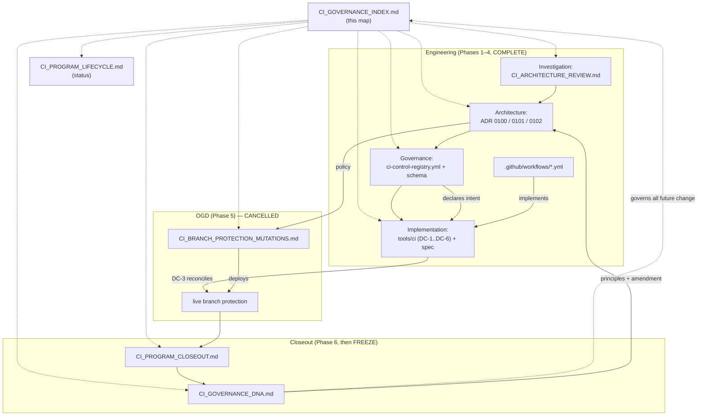

# FanOps — CI Governance System · Index

> **The permanent entry point to the CI governance system. Start here.**
> This document is **navigational, not explanatory**: it says what each artifact is, where it lives, who
> owns it, and how to change it — it never restates their content. When a section points you to a
> document, that document is authoritative; this index only routes. (Operator directive, 2026-07-16.)

## 1 · Purpose

The CI governance system exists to make one guarantee mechanically true: **the CI the repository
*declares*, the CI it *runs*, and the CI that *gates a merge* never silently diverge** — and every
check has one invariant, one owner, one classification, one reason, and one deletion test. The full
principles live in `CI_GOVERNANCE_DNA.md` (§5). This index makes the system discoverable and
maintainable so that guarantee survives its authors.

## 2 · Governance architecture (overview)

Three reconciled planes, one validator that proves they agree:

- **Intent** — `.github/ci-control-registry.yml` (what the repo declares it enforces).
- **Implementation** — `.github/workflows/*.yml` (what CI actually runs).
- **Deployed** — live GitHub branch protection (what actually gates a merge).
- **Reconciler** — `tools/ci` (DC-1..DC-6), the governed subsystem that reddens on any divergence.

Authoritative detail: **ADR-0100** (the model) and `CI_VALIDATOR_SPEC.md` (the reconciler).

## 3 · Program lifecycle

Six phases were planned: **Investigation → Architecture → Governance → Implementation → Operational
Governance Deployment (OGD) → Program Closeout.** The first four are engineering and are complete.
**OGD was CANCELLED on 2026-07-22** (operator decision, CI simplification) — the required-context set is
final at two and live branch protection is left as it stands. Closeout records and freezes; it remains
outstanding. Authoritative status: `CI_PROGRAM_LIFECYCLE.md`.

## 4 · Reading order (for a newcomer)

1. **This index** — the map.
2. `CI_PROGRAM_LIFECYCLE.md` — where the program is.
3. `docs/CI_ARCHITECTURE_REVIEW.md` — the Investigation: *why* the system exists (the intent-vs-config gap).
4. `docs/adr/0100` → `0101` → `0102` — the decisions (authority + control registry; required checks; merge strategy).
5. `CI_VALIDATOR_SPEC.md` — the enforcement subsystem.
6. `.github/ci-control-registry.yml` (+ `.schema.json`) — the control data, read against `CI_CONTROL_INVENTORY.md`.
7. `CI_BRANCH_PROTECTION_MUTATIONS.md` — the CANCELLED OGD runbook (history, no pending steps) + the closeout/DNA specs.
8. *(still outstanding)* `CI_PROGRAM_CLOSEOUT.md`, then `CI_GOVERNANCE_DNA.md` — the immutable records.

## 5 · Authority hierarchy

Highest authority first. When two documents appear to conflict, the higher one wins; the lower is
reconciled to it (or a new ADR resolves the conflict).

| Rank | Artifact | Path | Role | Status |
|------|----------|------|------|--------|
| 1 | **CI Governance DNA** | `docs/ci/CI_GOVERNANCE_DNA.md` | Non-negotiable principles + amendment process | ⏳ Phase 6 (pending) |
| 2 | **ADRs 0100–0102** | `docs/adr/010{0,1,2}-*.md` | The governing decisions | ✅ accepted (in principle); 0101 amended 2026-07-22 |
| 3 | **Validator Spec** | `docs/ci/CI_VALIDATOR_SPEC.md` | Contract of the `tools/ci` subsystem | ✅ active |
| 4 | **Control Registry** | `.github/ci-control-registry.yml` (+ `.schema.json`) | The declared intent (data) | ✅ active |
| 5 | **OGD Runbook** | `docs/ci/CI_BRANCH_PROTECTION_MUTATIONS.md` | Deployment procedure that was dropped | ⛔ CANCELLED 2026-07-22 — never executed, kept as history |
| 6 | **Program Closeout** | `docs/ci/CI_PROGRAM_CLOSEOUT.md` | Immutable historical record | ⏳ Phase 6 (pending) |
| 7 | **Supporting** | `CI_PROGRAM_LIFECYCLE.md`, `CI_CONTROL_INVENTORY.md`, `CI_REMEDIATION_SLICE_PLAN.md`, `CI_ARCHITECTURE_REVIEW.md`, `freeze/2026-07-15/` | Status, generated views, history | ✅ active/frozen |

## 6 · Ownership matrix

| Artifact | Owner | Change gate |
|----------|-------|-------------|
| ADRs 0100–0102 | **operator** (decider) | new/superseding ADR |
| CI Governance DNA | **operator** (ratifies) · ci-lane (maintains) | new program (post-freeze) |
| Control registry + schema | **ci-lane** | PR + `tools.ci static` green; policy change ⇒ ADR |
| `tools/ci` validator | **ci-lane** | `CI_VALIDATOR_SPEC.md` §6–7 (ADR-gated for authority) |
| Live branch protection | **operator** only | a repository-settings change requiring separate, explicit operator approval — no PR performs one |
| Lifecycle / Index / Inventory / Slice-plan | **ci-lane** | normal PR |
| Architecture Review · Phase-A freeze | **ci-lane** | frozen (historical) |
| Closeout | **ci-lane** (produces) · operator (ratifies freeze) | immutable once written |

## 7 · Amendment procedure

1. Classify the change with the **decision tree** (§8): is it ADR-gated, normal-PR, or a live-settings change?
2. **ADR-gated** changes (authority, policy, the DC set, the required-context set, the three-plane model)
   require a **new ADR referencing 0100/0101**, operator-accepted, before implementation.
3. **Normal-PR** changes (a new negative control, a message, a non-authority refactor, a doc) merge under
   the standard gate — `tools.ci static` must stay green.
4. **Live-settings** changes (branch protection) are operator-only and out of band: capture the pre-image, apply one mutation, re-probe, keep the rollback. OGD as a staged programme is cancelled; this is the procedure for any one-off the operator explicitly approves.
5. The full, binding procedure is defined in `CI_GOVERNANCE_DNA.md` (§ Amendment process). **After the
   freeze, every change — including a normal-PR-class one — begins a NEW governance program.**

## 8 · Decision tree for common future changes

| You want to… | Do this | Gate |
|--------------|---------|------|
| **Add a workflow / job** | Register a control (all 11 fields) so DC-2 (job↔control bijection) and DC-6 (timeout + SHA-pin) pass. If it should block merges, also §"required check". | normal PR + `static` green |
| **Add / promote a required check** | Amend ADR-0101's required set → add to `intended_required_contexts` → mirror the workflow job name (DC-1) → the operator applies the live change separately. Never code-only. The set is currently FINAL at two; growing it reopens a settled decision. | **ADR** + operator |
| **Change the validator** | Per `CI_VALIDATOR_SPEC.md` §6–7: a new/re-scoped DC or changed blocking semantics is **ADR-gated** and needs a **negative control**; a message/refactor is a normal PR. | ADR *or* normal PR |
| **Change branch protection** | Operator-only, out of band: capture pre-image, apply one mutation, re-probe, keep the rollback. A policy shift also amends ADR-0101/0102. Includes any future removal of `real-tooling E2E` from the required set. | operator + (ADR if policy) |
| **Change governance itself** (registry model, classification enum, three-plane model, validator ownership) | New ADR referencing 0100; update registry + `tools/ci` **together**. | **ADR** |
| **Anything, after the freeze** | Open a **new governance program** (new ADR + new registry revision). Do **not** edit the frozen records. | new program |

## 9 · Relationship diagram

## 10 · Current lifecycle status

Authoritative source: `CI_PROGRAM_LIFECYCLE.md`. Snapshot at this document's writing:

- **Phases 1–4 (Investigation, Architecture, Governance, Implementation): ✅ COMPLETE and merged.**
  Re-provable: `python -m tools.ci reconcile` (static clean; deployed clean) and
  `python -m tools.ci selftest` (all negative controls fire).
- **Phase 5 (OGD): ⛔ CANCELLED 2026-07-22** — the required set is final at two contexts; `intended ==
  current ==` live, so `python -m tools.ci deployed` reports no findings where it once reported three
  contexts pending deployment.
- **Phase 6 (Closeout + DNA, then freeze): ⏳ not started** — no longer blocked on OGD, but not produced
  by this change either.

## 11 · Freeze declaration

Phase 5 (OGD) is cancelled, so the freeze now turns on Phase 6 alone: when Phase 6 has produced both
`CI_PROGRAM_CLOSEOUT.md` and `CI_GOVERNANCE_DNA.md`, **this CI governance program is frozen and
immutable.** The DNA document, the
closeout, and the ADRs become read-only history. From that point, **every future CI-governance change —
a new required check, a validator change, a registry-model change, anything in §8 — begins as a NEW
governance program** (new ADR + new registry revision under the DNA amendment process), **never as an
edit or extension of this one.** Extending a frozen program is itself a governance violation. This index
is updated only to point at the successor program.
