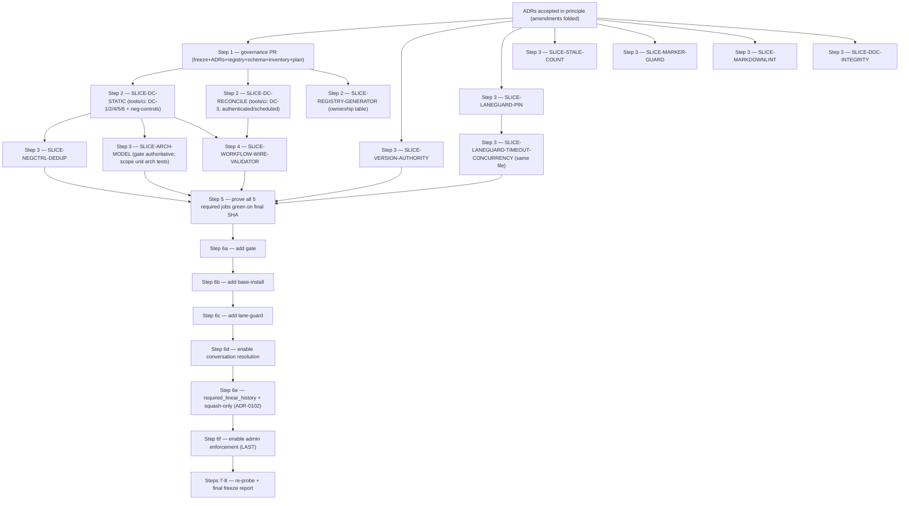

# FanOps — CI Remediation Slice Plan & Dependency Order

**Status:** accepted-in-principle (2026-07-15; operator amendments folded). **Rule:** one invariant per
slice; small, reviewable, no unrelated changes bundled. **Isolation:** parallel slices touching
different files run in separate git worktrees; same-file slices land sequentially. **No live GitHub
mutation until the `tools/ci` validator + repository-remediation PRs are green** (operator gate); all
branch-protection / repo-setting changes are Phase E, applied one at a time
(`CI_BRANCH_PROTECTION_MUTATIONS.md`). **Tests are CI-only** (ADR 0088); "failing-before" proofs are CI
checks / negative controls, never run locally.

## Execution order (operator directive, 2026-07-15)

1. **Commit** freeze evidence + ADRs + registry + schema + inventory + remediation plan (+ mutation
   list) in **one documentation/governance PR**.
2. **Build the dedicated `tools/ci` validator** + its negative-control tests (`DC-1…DC-6`).
3. **Remediate repo issues:** version authority; lane-guard pin + timeout + concurrency; markdownlint
   activate-or-delete; marker-integrity guard; stale doc anchors.
4. **Update workflows** to invoke the registry validator.
5. **Prove all proposed required jobs green** on the final SHA.
6. **Apply branch-protection mutations in this order:** add `gate` → add `base-install` → add
   `lane-guard` → enable conversation resolution → require linear history + squash-only → **enable
   admin enforcement last**.
7. **Re-probe** live protection and compare mechanically against the registry.
8. **Produce the final CI freeze report.**

## Dependency DAG

---

## Step 2 — the dedicated `tools/ci` validator (Phase C)

### SLICE-DC-STATIC
- **Invariant:** the registry, workflow job names, required set, governance prose, and generated view
  are mutually consistent — the **six registry-integrity failure conditions** (ADR-0100). The validator
  **fails** on: (1) unknown workflow job (no registry row); (2) phantom control (registry control with
  no executable implementation); (3) required-but-undeployed (required registry control absent from live
  branch protection); (4) deployed-but-unregistered (live required context absent from the registry);
  (5) renamed required context (context ⊄ workflow job names — anti-detach); (6) unjustified duplicate
  ownership (shared invariant with no `duplicate_group`).
- **Mapping:** DC-1 (5), DC-2 (1,2), DC-4 (prose↔classification), DC-5 (6 + generated-view byte-compare),
  DC-6 (workflow hygiene: timeout/SHA-pin/concurrency). DC-3 (3,4) is SLICE-DC-RECONCILE.
- **Files:** a new **`tools/ci/`** module (NOT `tools/arch`) + `tests/…` negative controls; wire the
  static checks into the `unit` lane. One registry row per new check.
- **Depends on:** the governance PR. **Expected CI effect:** new blocking checks in the required unit
  lane; each fails on an injected divergence; **each DC has a negative control**.
- **Failing-before:** rename a job → DC-1 red; drop a row → DC-2 red; float a tag → DC-6 red; hand-edit
  the table → DC-5 red; unjustified shared invariant → DC-5 red.
- **Rollback:** revert the wiring + the `tools/ci` module; registry stays inert. **BP interaction:** none.
- **One-invariant note:** land one DC at a time.

### SLICE-DC-RECONCILE
- **Invariant:** `intended_required_contexts` (the five) == **live** GitHub required contexts (DC-3),
  reported both directions; `enforce_admins` / reviews / conversation-resolution / linear-history are
  surfaced, never mutated.
- **Files:** a scheduled job (`schedule`/`workflow_dispatch`) with a scoped read token; `tools/ci` code;
  registry row. **Expected effect:** scheduled reconciliation, fails loudly on mismatch or auth error.
- **Failing-before:** feed a mismatched intent set → DC-3 red. **Rollback:** remove the scheduled job.

### SLICE-REGISTRY-GENERATOR
- **Invariant:** the ownership table is a byte-reproducible function of the registry (never hand-kept).
- **Files:** a `tools/ci` generator; `docs/ci/CI_CONTROL_INVENTORY.md` becomes generated; DC-5 byte-compare.

---

## Step 3 — repository remediation (clear code/config fixes; ∥ where files differ)

### SLICE-VERSION-AUTHORITY
- **Invariant:** exactly one authority for the package version; all consumers derive from it.
- **Proven defect:** `pyproject.toml` **0.4.0** vs `src/fanops/__init__.py` **0.3.0**; consumed by
  `cli.py:1104` (`fanops.__version__`) and `daemon.py:773-776`.
- **Root cause:** a mutable literal maintained by hand in two files; they drifted.
- **Smallest fix:** `pyproject.toml` is sole authority; `__version__` derives at runtime via
  `importlib.metadata.version("fanops")`; a regression test asserts equality.
- **Files:** `src/fanops/__init__.py`, new `tests/test_version_authority.py`.
- **Failing-before:** the test fails today (0.3.0 ≠ 0.4.0). **Rollback:** revert both. **BP:** none.

### SLICE-LANEGUARD-PIN   *(same file → land before TIMEOUT-CONCURRENCY)*
- **Invariant:** every third-party action is referenced by an immutable commit SHA.
- **Proven defect:** `lane-guard.yml:26` `checkout@v7`, `:29` `setup-python@v6` (only floating tags in
  the repo).
- **Smallest fix:** pin both to the SHAs already used elsewhere (`checkout@9c091bb…` v7.0.0,
  `setup-python@ece7cb06…` v6.3.0), recording name · SHA · source tag · update mechanism · owner.
- **Files:** `.github/workflows/lane-guard.yml`. **Failing-before:** DC-6 reds on a floating tag.
- **Rollback:** revert the two lines. **Registry:** update `LANE-GUARD` notes.

### SLICE-LANEGUARD-TIMEOUT-CONCURRENCY   *(after PIN — same file)*
- **Invariant:** every CI job has an intentional timeout; overlapping lane-guard runs cancel.
- **Proven defect:** no `timeout-minutes`, no `concurrency:` on `lane-guard.yml`.
- **Smallest fix:** `timeout-minutes` sized from a measured runtime + margin (seconds-class → e.g. 10)
  and `concurrency: { group: lane-guard-<ref>, cancel-in-progress: true }`. **No arbitrary numbers.**
- **Files:** `.github/workflows/lane-guard.yml`. **Depends on:** SLICE-LANEGUARD-PIN. **Failing-before:**
  DC-6 reds on a job with no timeout.

### SLICE-STALE-COUNT
- **Invariant:** no governance file hard-codes a mutable derived count.
- **Proven defect:** `architecture.yml:140` "21 injected defects" (rots; authoritative =
  `tools/arch/selftest.py::CONTROLS`).
- **Smallest fix:** delete the number (keep the prose); do **not** replace with a fresh number.
- **Files:** `.github/workflows/architecture.yml`. **Failing-before:** an AST/grep negative control
  reddening on a bare integer beside "injected defects/controls" (optional; primary fix = deletion).

### SLICE-NEGCTRL-DEDUP
- **Invariant:** the full negative-control suite runs in exactly **one** authoritative place per PR;
  the every-rule-has-a-firing-control guarantee is preserved.
- **Proven defect:** on an arch-relevant PR, `ARCH-CONTROLS` (`tools.arch selftest`) and
  `CI-E2E-NEGCONTROLS` both run the full `selftest.detect` (~170 s).
- **Smallest fix:** keep the full run in the **required** `CI-E2E-NEGCONTROLS`; reduce `ARCH-CONTROLS`
  to a lightweight reachability assertion. Do not weaken the guarantee.
- **Files:** `.github/workflows/architecture.yml` (`controls` job). **Depends on:** SLICE-DC-STATIC.

### SLICE-ARCH-MODEL   *(Model A — resolves the arch duplicate)*
- **Invariant:** architecture-governance drift/policy/registries has exactly **one** required owner
  (`ARCH-GATE`); the unit-lane arch tests own only **distinct** invariants.
- **Context:** ADR-0101 promotes `gate` to required. To avoid a required duplicate, scope the
  unit-collected `test_arch_governance.py` to the invariants `tools.arch ci` does **not** run —
  regeneration determinism, generated-artifacts-are-a-pure-function-of-source, rule reachability,
  field-authority — while `gate` owns drift/policy/registries.
- **Smallest fix:** analyze the test file; keep the distinct-invariant tests in the unit lane, let
  `gate` be the sole required drift/policy/registries block. If clean separation is impractical, record
  the residual overlap as an explicit `duplicate_group` justification (do **not** silently keep a
  required duplicate). Add a negative control proving the `gate` context blocks on injected drift.
- **Files:** `tests/test_arch_governance.py` and/or the arch invocation; registry `duplicate_group`.
- **Depends on:** SLICE-DC-STATIC (so the reachability guarantee is itself checked). **Rollback:** revert
  the scoping. **One-invariant note:** ownership de-duplication only; the negative controls guarantee no
  arch rule silently loses its firing control.

### SLICE-MARKER-GUARD
- **Invariant:** no test under `tests/integration/` can silently run in the unit lane.
- **Corrected premise:** `test_variation_render.py` **is** integration-marked (`@REQUIRE`); the review's
  "runs in unit lane" note is stale. Residual risk = the fragile mechanism (no module `pytestmark`).
- **Smallest fix:** a collect-time unit test asserting every item collected from `tests/integration/`
  carries the `integration` marker; optionally normalize the file to module-level `pytestmark`.
- **Files:** new `tests/test_integration_dir_marker_guard.py` (unit lane). **Failing-before:** add an
  unmarked test under `tests/integration/` → guard reds.

### SLICE-MARKDOWNLINT   *(operator sub-decision — recommend delete)*
- **Invariant:** no apparently-active config that nothing executes.
- **Proven defect:** `.markdownlint.json` exists; no reference anywhere.
- **Fix (pick one):** (a) wire + register with an owner; (b) **delete** (recommended); (c) label dormant
  with owner + reactivation condition. **Files:** `.markdownlint.json` (+ registry row if (a)).

### SLICE-DOC-INTEGRITY
- **Invariant:** governance docs carry no independently-maintained mutable fact; dormant mechanisms are
  labelled dormant; anchors are stable-symbol or validated.
- **Targets:** stale counts / line anchors / authority refs in `CONTROL-FILES.md`, `AGENTS.md` (dormant
  land-gate labelling), `tests/CLAUDE.md`, obsolete future-tense Cycle contracts. **Each sub-item is
  independently landable** (one file per commit). **Failing-before:** DC-4 reds on a doc "BLOCKING" that
  contradicts the registry.

---

## Step 4 — wire the validator into CI

### SLICE-WORKFLOW-WIRE-VALIDATOR
- **Invariant:** the static registry-integrity checks (DC-1/2/4/5/6) run on every PR as a blocking step
  inside the required `unit` lane; DC-3 runs on the scheduled reconciliation.
- **Files:** `.github/workflows/ci.yml` (add a `tools/ci` step to `unit`), `.github/workflows/architecture.yml`
  or a scheduled workflow for DC-3; registry rows for the new checks.
- **Depends on:** SLICE-DC-STATIC + SLICE-DC-RECONCILE. **Failing-before:** the negative controls.
- **Rollback:** revert the workflow steps. **BP interaction:** none (adds a step inside an already-required job).

---

## Step 6 — live branch-protection / repo-setting reconciliation *(operator-approved, one at a time, ONLY after Steps 2-5 green)*

Full specs (before/after/reason/rollback/risk) in `CI_BRANCH_PROTECTION_MUTATIONS.md`. Operator order:

1. **M1 · add `gate (drift + policy + registries)`** to required contexts.
2. **M2 · add `base install (no extras) refuses smart-framing`.**
3. **M3 · add `lane file-ownership + cross-PR collision`** (after SLICE-LANEGUARD-* + observation).
4. **M4 · enable `required_conversation_resolution`.**
5. **M5 · `required_linear_history=true` + squash-only merge method + auto-delete-branch** (ADR-0102).
6. **M6 · enable `enforce_admins` LAST** — only after all five required checks are proven stable on the
   remediation PR; a governed break-glass replaces the standing bypass (ADR-0101 §4 / ADR-0102 §9).

Each requires DC-1 + DC-3 live first, so a promotion is reconciled and cannot silently detach.

---

## Decided — no change (evidenced non-goals; do NOT "fix")

| Program item | Decision | Why |
|---|---|---|
| Coverage floor | **No numeric floor.** Prefer invariant-specific test mapping. | A decorative % was removed (MOL-199); restoring it is cargo-culting. |
| Platform matrix | **No OS/Python matrix.** Ubuntu + CPython 3.12. | Add a dimension only for a real compatibility claim; none exists. |
| ruff scopes | **Keep all four.** | Deliberate scope-tiering (`duplicate_groups.ruff-scopes`). |
| pip-audit | **Advisory/nightly until its failure policy is separately approved.** | Promoting a security scan to blocking is a distinct risk decision. |
| Dormant land-gate / `(Unit:<slug>)` | **Stays dormant.** | Disabled by operator decision (0096); reviving needs a separate ADR. |

## Per-slice discipline (every slice)

Each landing PR carries: observed defect · invariant violated · root cause · smallest correct fix ·
files changed · expected CI effect · failing-before test/negative-control · passing-after CI evidence ·
rollback · branch-protection interaction · ADR + registry updates · proof unrelated controls are
unchanged (the DC suite + arch drift gate provide that once live). Parallel slices use isolated
worktrees; derived-file conflicts are resolved by regeneration, never hand-merge (ADR-0102).
