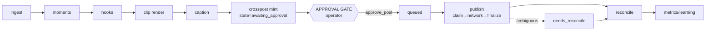
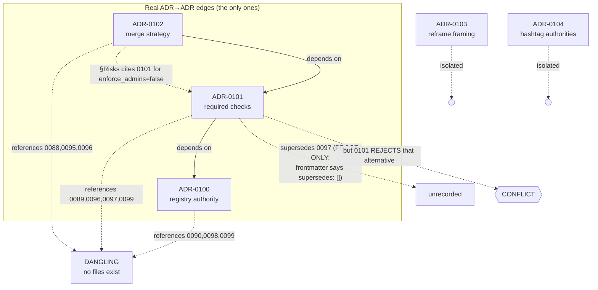

# 01 — Engineering System Reconstruction

> **This document is DESCRIPTIVE, not self-authorizing.** It records what the FanOps engineering
> operating system *is*, from evidence, at one observed revision. It grants no authority, ratifies
> nothing, supersedes nothing, and does not license any change. Section 22 proposes actions; those
> proposals are recommendations only and require an owner's decision before any of them is executed.

---

## 1. Document Control

| Field | Value |
|---|---|
| **Title** | 01 — Engineering System Reconstruction |
| **Path** | `docs/reconciliation/01_ENGINEERING_SYSTEM_RECONSTRUCTION.md` |
| **Purpose** | Canonical, evidence-backed reconstruction of the engineering operating system built around the FanOps repository: what was intended, what actually exists, how it emerged, what governs it, where implementation conforms and diverges, and what remains unresolved. |
| **Status** | Complete for the observed revision. Descriptive. Not ratified. Not an authority. |
| **Authoring agent** | Claude Opus 4.8 (`claude-opus-4-8`), Claude Code session `a97811a5-8fae-45fc-a4df-e1e8d2c502ec`. Investigation performed by the session agent plus eight read-only delegated domain sub-agents; every high-impact claim was re-verified first-hand by the session agent (see §4.1). |
| **Observation window (UTC)** | 2026-07-16T18:05:59Z → 2026-07-16T19:05:00Z (approx.) |
| **Repository root** | `/Users/molhamhomsi/Moh Flow Fanops` |
| **Current branch** | `main` |
| **HEAD SHA** | `6d21749ffc49c77383f537d93b028cca0d69a447` |
| **`origin/main` SHA** | `6d21749ffc49c77383f537d93b028cca0d69a447` |
| **HEAD == origin/main** | **Yes** — `git rev-list --left-right --count HEAD...origin/main` → `0 0` |
| **Remote** | `https://github.com/Fleezyflo/fanops.git` |
| **Last verified** | 2026-07-16, immediately before finalization (§25 re-ran the baseline; SHAs unchanged) |

### 1.1 Scope

In scope: the **engineering-system layer** — philosophy, constitution, architectural laws, ADRs,
codemaps, shapes/contracts, registries/manifests, standards, invariants, governance, CI enforcement,
drift detection, and the history of that layer.

### 1.2 Exclusions

Out of scope, deliberately:

- **Product behaviour** (clip rendering, hashtag selection, publishing correctness) except where it is
  the *subject* of a governance claim being tested.
- **The other reconciliation documents.** `02_REPOSITORY_REALITY_AND_INTEGRITY.md`,
  `03_PROGRAM_AND_DECISION_HISTORY.md`, and `04_APPLIED_PROGRAMS_RECONSTRUCTION.md` were produced by
  **parallel agents, concurrently with this one** (LOCAL-002). They were **not read, not cited, not
  modified, and not absorbed**. See §4.2(f) and §23 for why this is a deliberate methodological
  choice, not an oversight.
- **Any mutation.** No code, test, workflow, ADR, codemap, standard, contract, schema, registry,
  manifest, generated artifact, runtime datum, configuration, branch, or PR was changed. The suite was
  never run locally (repo rule; see CLM-030).

### 1.3 Evidence availability limitations

| Limitation | Effect |
|---|---|
| **Cycles 1–6 have no contemporaneous evidence** | The 47-file architecture KB was authored outside git and first committed wholesale at `70de715`. Its own account of its production is the only record. Structural, not fixable. (CLM-025) |
| **PR numbers are inferred from squash subjects** | `(#NNN)` suffixes on squash commits were used to attribute PRs. GitHub PR bodies were not fetched except for the open-PR query. Low risk; high consistency. |
| **`.reports/` (except `architecture/`) is gitignored** | `structural_index.json`, `import_graph.json`, `call_graph.json` exist only on this machine. Codemap claims citing them are unverifiable in a fresh clone. (CLM-023) |
| **Runtime/operational state not probed** | The live daemon, ledger contents, and Postiz/Meta credentials were not inspected. Live verbs were not run (repo rule). |
| **Branch protection is a point-in-time read** | OPS-001 was read twice (sub-agent + session agent) with identical results, but it is mutable outside git. |

---

## 2. Executive Reconstruction

**What it is.** FanOps carries a deliberately-built, six-plane engineering operating system: a
*philosophy* (`ENGINEERING_PHILOSOPHY.md`, the "why"), a *constitution* (`REPOSITORY_CONSTITUTION.md`,
69 rules each carrying a self-declared enforcement status), an *enforceable law subset*
(`ARCHITECTURAL_LAWS.md`, 45 `LAW-*`), a *craft layer* (`ENGINEERING_STANDARDS.md`, 30 `STD-*`), a
*decision layer* (5 ADRs, 0100–0104, plus a 176 KB archaeology catalogue of 99 unformalized
decisions), and a *machine layer* — `tools/arch` (21 executable rules, 25 negative controls) and
`tools/ci` (6 divergence checks) over a tracked architecture knowledge base
(`.reports/architecture/`, 97 files). (CLM-001, CLM-015, CLM-016, CLM-036)

**Why it was created.** The trigger is on the record and is unusually specific. The architecture KB's
own closing line — `.reports/architecture/IMPLEMENTATION_CONTRACT.md:302`: *"Until Cycle 7 lands, this
contract is enforced by attention. That is better than nothing, and it is not a mechanism."* — is the
sentence the entire machine layer answers. (HIST-004, CLM-026)

**Maturity: the single most important fact in this document.** The engineering-system layer is
**approximately two days old**. Forty-two commits touch governance paths; **all** of them fall on
2026-07-15 and 2026-07-16, and **none** precede them, against a repository born 2026-06-01 with 1,503
commits. The constitution is ~17 hours old at HEAD; the standards layer ~9 hours; `LAW-CI-09` ~4
hours. This is not a matured system — it is a two-day formalization burst on top of a six-week
product. Every finding below should be read through that lens: the layer has not yet had time to be
tested by the drift it exists to catch. (CLM-001)

**Confirmed strengths — these are real and should not be discounted.**

1. **The machine layer is genuinely rigorous.** All 21 `tools/arch` rules are wired and reachable;
   **every** rule has at least one negative control (25 total), and the controls record findings
   *before* injecting a defect so that "the rule fired" cannot be faked by pre-existing noise.
   (CLM-013, TEST-002)
2. **`GOV-001` closes the vacuous-pass hole.** It evaluates first and short-circuits: if any of 12
   canonical artifacts is absent, the gate returns one BLOCKING finding rather than silently passing
   checks that have no inputs. This is the failure mode most governance systems die of, and it is
   genuinely fixed. (CLM-012)
3. **Discovery is a filesystem scan, not a hand-list.** `extract.py:362` `rglob("*.py")` means a new
   module is discovered automatically and becomes an `ARCH-001` violation until assigned. This is
   *why* the derived module count is right while the prose is wrong. (CLM-010)
4. **Enforcement honesty is high and unusually disciplined.** 22 of 69 constitution rules (32%) and 21
   of 29 owned standards openly decline the `enforced` label; residuals are registered with owners;
   one standard is labelled **`violated`** on a live defect. Against the repo's own signature defect
   ("the doc names a mechanism that does not exist"), the standards layer names ~20 mechanisms and
   **every one of them exists**. (CLM-016, CLM-017)
5. **The safety properties actually hold.** No-auto-publish, wipe-gating, cascade protection, and the
   dryrun/live boundary are all true in live source — in one case (wipe) *more strongly* than the
   documentation claims. (CLM-021)

**Confirmed inconsistencies — the layer's own thesis, turned against it.** The repository names its
signature defect precisely and repeatedly: *"the doc names a mechanism that does not exist"* (`C2.2`),
and *"the most distrusted artifact of all is a number copied into prose"*
(`ENGINEERING_PHILOSOPHY.md` §6). **The engineering-system layer commits both, at scale, inside the
documents built to police them.**

| # | Finding | Claim |
|---|---|---|
| 1 | **`LAW-STATE-03` is factually false.** It states a `Moment` is "mutated by setattr, **never** `model_copy`". There are **10 production `model_copy`-on-`Moment` sites**, and a **green test** (`test_quarantine_immutable.py`) *requires* the behaviour the law forbids. It over-generalizes GB-5 (a narrow, conversion-scoped guard) into a false universal, and the error has propagated into 3 tracked docs. | CLM-002 |
| 2 | **`EVIDENCE_RECONCILIATION.md` §R7 finding 2 is defective** — and it is the tracked adjudication that killed the rival constitution. It asserts `docs/constitution/LAWS.md` §4.2 "cites GB-5". **It does not** — `grep` returns nothing; the citation lives in `TRACEABILITY.md:54`. Its verdict that "`LAW-STATE-03` states the rule correctly and narrowly" is the reverse of the truth. **R7's disposition still stands** on its other two findings. | CLM-003 |
| 3 | **`130/130 modules` in the Constitution and Laws; the truth is 132.** Both cite `ARCH-001`/`ARCH-002` as evidence — rules that today measure **132**. The generated view self-corrected to 132; the hand-written prose could not. The prose was correct when written (#675) and was overtaken by #681 ~13 hours later. | CLM-004 |
| 4 | **Only 2 of 5 intended required contexts are live** (first-hand `gh api`). `enforce_admins: false`, `required_linear_history: false`, 0 required reviews, rulesets `[]`. `base-install`, `lane-guard`, and `impact --strict` block nothing. | CLM-005 |
| 5 | **The codemap symbol-anchor hit rate is 33.6%** (40/119). Load-bearing "sole/only/never" claims are substantially false, and the entire "open findings" surface is **already-closed work presented as open**. | CLM-006, CLM-021 |
| 6 | **The ADR system has zero mechanical enforcement.** `grep -i adr .github/workflows/` → **zero hits**. Its specified validator (`constitution-lint`, CM-1..CM-8) was designed and never written. | CLM-007 |
| 7 | **Both aggregate tallies are wrong, and both were wrong at birth.** Laws: header says 24+8+3+1 = **36**; there are **45**. Standards matrix: claims **26** rows; there are **29**. Neither inflates enforcement — both *under*-count. | CLM-015, CLM-016 |
| 8 | **Three standards claims are outright false and admitted nowhere**: `.markdownlint.json` is described as existing by 4 documents (deleted 3h *before* their own declared base SHA); `errors.py` CLI pairing is claimed 11/11 (actual **9/11**); `cascade_unlink_failed` is cited as riding `info` (it explicitly sets `level="warning"`). | CLM-017, CLM-018 |

**Most significant unresolved risks.**

- **A dated, guaranteed CI outage on 2027-01-02.** `render.py:145` calls `reg.expired()` with no
  argument → wall clock; both exceptions expire 2027-01-01; the expiry count is baked into generated
  doc bytes. On that date the byte-compare fails and `tools.arch ci` goes red on every PR **with zero
  code change** — a generated artifact that is not a pure function of source, violating the very law
  (`LAW-SOT-02`) the engine enforces. (CLM-011)
- **Two silent disarms.** Deleting one key from `governance/baselines.json` silently disarms
  `ARCH-007` (a 107-edge ratchet) or `IMPL-009` (the GB-4 terminal-state door) — `GOV-001` checks the
  *file*, never the *keys*, and no negative control covers key deletion. Separately,
  `registries.py:98` defaults `approved_ceiling` to the current open count, making `ARCH-005`
  unfailable by construction. (CLM-012, CLM-014)
- **The formalization program is blocked by a number collision.** The roadmap reserves ADR-**0104**
  for the numbering policy and calls it "the single prerequisite [that] lands first". **0104 was
  consumed** by the hashtag ADR (#681) the same day. All 10 Tier-1 ADR cuts sit behind an unwritable
  prerequisite. (CLM-008)
- **The ADR numbering authority is gitignored.** `ADR-FORMAT.md` — cited by two tracked governance
  docs as *"the repository's own ADR test"* — lives under `.agents/skills/`, matched by
  `.gitignore:59`. It resolves on exactly one machine. (CLM-009)

**Can the system presently be treated as coherent?**

**Coherent with bounded residuals — but not closable, and not yet self-correcting.**

The *machine* half is coherent: rules are wired, controls are real, the derived layer is byte-verified
and demonstrably correct (132/132/0 re-derived independently). The *prose* half is not: it carries at
least **12 rotted or false numbers**, one **factually false law**, and one **defective adjudication**
— all concentrated precisely in the seams the machine does not read. The defects are bounded
(none currently corrupts product behaviour; every product safety property still holds) and the layer's
own honesty conventions make them findable. But the system is **not closable today**, for one
structural reason:

> **Nothing in the specified engine re-derives a cited count.** `IMPL-007` — the rule created *because*
> `_CLI_PRINT_COUNT` rotted across 9 files with 4 values — scans for exactly one regex
> (`_CLI_PRINT_COUNT\s*=\s*(\d+)`). `ARCH-009` checks 7 of 12 numeric fields, and only in DECLARED
> JSON, never prose. Every `CM-*`/`SM-*` check verifies that a cited *symbol* resolves; **none**
> verifies that a cited *number* re-derives. That single gap generated finding classes 3, 7, and 8
> above, and it is **unowned**. (CLM-019)

The honest verdict is that this is a **two-day-old layer whose machine half is excellent and whose
prose half has already rotted along exactly the axis its own philosophy predicted** — which is, read
charitably, the strongest possible evidence *for* the philosophy and *against* the current
enforcement scope.

---

## 3. Observation Baseline

### 3.1 Checked-out repository state

| Field | Value | Evidence |
|---|---|---|
| Branch | `main` | HIST-001 |
| HEAD | `6d21749ffc49c77383f537d93b028cca0d69a447` | HIST-001 |
| Dirty? | **No tracked file modified.** `git diff --stat HEAD` → empty | HIST-001 |
| Staged files | **None** | HIST-001 |
| Modified tracked files | **None** | HIST-001 |
| Untracked | `docs/constitution/` (LOCAL-001) · `docs/reconciliation/` (LOCAL-002) | LOCAL-001, LOCAL-002 |
| Ignored-but-material | `.reports/` minus `architecture/` (CLM-023) · `.agents/skills/` incl. `ADR-FORMAT.md` (CLM-009) · `.claude/plans/` · `.venv/` | CI-006 |
| Divergence from remote | **None** — `0 0` | HIST-001 |
| Stash | **Empty** (`git stash list`) | HIST-001 |

**`git status` verbatim at observation:**
```
?? docs/constitution/
?? docs/reconciliation/
```
> `docs/reconciliation/` was **absent** at session start (18:05Z) and appeared **during** this session,
> filling with files 02, 03, and 04 written by **concurrently-running parallel agents** (first seen
> 22:51; still growing at 23:35 — 02 went 145,546→165,015 B and 04 went 148,819→233,697 B while this
> document was being written). Only file 01 — this document — was created by this session. (LOCAL-002)

### 3.2 Remote-main state

| Field | Value |
|---|---|
| `origin/main` | `6d21749` — **identical to HEAD** |
| Accessible? | **Yes** — `git fetch origin` succeeded; `gh api` authenticated |
| CI state observable? | **Yes** — branch protection and rulesets read first-hand (OPS-001) |
| Recent merges (governance-relevant) | `6d21749` #693 hashtag diversity brief · `946428c` #692 codemap freeze-row precision · `97d316d` #691 R4 handoff · `caa3427` #690 R4 migration record · `073a37e` #689 daemon storm guard |

### 3.3 Open-change state

| Field | Value | Evidence |
|---|---|---|
| **Open PRs** | **ZERO** — `gh pr list --state open --limit 60` → empty | HIST-002 |
| Local branches | 63 | HIST-001 |
| Active worktrees | **26** | HIST-001 |
| Material stashes | None | HIST-001 |
| **Unlanded engineering-system work** | **NONE** | HIST-003 |

**This is a load-bearing negative finding.** The 63 branches and 26 worktrees are **squash-merge
residue**, not pending work. Every engineering-system branch was verified landed:

| Branch | Landed as | Method |
|---|---|---|
| `docs/repository-constitution-layer` | `e2cf862` (#675) | `git cherry` → `-` |
| `docs/engineering-standards-layer` | `cde2286` (#677) | `git cherry` → `-` |
| `ci/governance-adrs-registry` | `4fcb08e` (#658) | `git cherry` → `-` |
| `ci/tools-ci-validator` | `5fc4ac3` (#661) | `git cherry` → `-` |
| `fix/arch-g1-delete-stale-rationale-numbers` | `6fc98af` (#641) | `git cherry` → `-` |
| `arch-recon` (10 commits "ahead") | `70de715` (#636) | **tree diff byte-empty** over `tools/arch`, `docs/ARCHITECTURE_GOVERNANCE.md`, `ARCH_RUNBOOK.md`, `tests/test_arch_governance.py`, `architecture.yml`, `.reports/architecture` |

> **Method note, recorded because it is a trap:** `git cherry` reports `+` for all 10 `arch-recon`
> commits. That is an artifact of squash-merge (10 commits → one new patch-id), **not** evidence of
> unlanded work. Single-commit branches squash to identical patch-ids and correctly show `-`. The
> decisive test for multi-commit branches is the **tree comparison**, which is byte-empty. A reader
> who trusts `git cherry` alone would wrongly conclude `arch-recon` is unlanded. (CLM-024)

### 3.4 Operational state (read-only)

**OPS-001 — live branch protection on `main`**, read first-hand via
`gh api repos/Fleezyflo/fanops/branches/main/protection`:

| Setting | **Live value** | Intended (per ADR-0101 / registry) |
|---|---|---|
| `required_status_checks.contexts` | **`["unit (fast, no toolchain)", "real-tooling E2E (must run, not skip)"]`** — **2** | **5** |
| `strict` | `true` | — |
| `enforce_admins` | **`false`** | `true` (ADR-0101 §4, "last, after proof of stability") |
| `required_linear_history` | **`false`** | `true` (ADR-0102, its sole mechanical enforcement) |
| `required_approving_review_count` | **`0`** | `0` (ADR-0101: no required reviews — **matches**) |
| `allow_force_pushes` | `false` | `false` |
| **Rulesets** | **`[]`** (empty) | — |

**Consequence, stated plainly:** with `enforce_admins: false` **and** 0 required reviews, a red
non-required check **cannot stop any merge**. The `gate (drift + policy + registries)`,
`base install`, `lane file-ownership`, and `impact report` jobs run on every PR and **block nothing**.
(CLM-005)

**OPS-002 — the freeze snapshot is accurate.** `docs/ci/freeze/2026-07-15/branch-protection.json`
matches the live probe field-for-field. Zero drift. The repo's declared intent
(`docs/ci/CI_BRANCH_PROTECTION_MUTATIONS.md:19`: *"**DEPLOYMENT GATE: operator.** Nothing below has
been executed."*) is honest.

**OPS-003 — arch governance blocks anyway, transitively.** Although `gate` is *not* a required
context, arch invariants **do** block merges: `tests/test_arch_governance.py` re-runs
`drift.stale_artifacts()`, `policy.check()`, and `registries.validate()` inside the **required** `unit`
lane, and the `@pytest.mark.slow` negative controls run in the **required** `e2e` lane. The registry
documents this exactly (`duplicate_group: arch-drift-policy`). This materially softens finding 4 for
arch rules — but not for `base-install`, `lane-guard`, `impact --strict`, or DC-3, which have no
required backup. (CLM-005, CLM-020)

**OPS-004 — host constraint (operating, not repository).** The operator's 16 GB host has hard-crashed
under stacked agent load (RAM exhaustion). This investigation therefore ran read-only sub-agents in
bounded waves, executed **no test suite**, and started no browser or server. Memory was 62% free
throughout. This is recorded because it *shaped the method*: it is the reason no claim in this
document rests on a local test run.

---

## 4. Evidence and Authority Model

### 4.1 Evidence hierarchy

The repository **declares** its own precedence, and this reconstruction adopts it rather than
inventing one. `REPOSITORY_CONSTITUTION.md:37` (**C2.1**, "binding"), restated at
`ENGINEERING_STANDARDS.md:26-29`:

> **(1) executable source & tests → (2) live GitHub configuration → (3) accepted ADRs & registries →
> (4) generated docs → (5) historical prose.**

Reinforced by `REPOSITORY_CONSTITUTION.md:24` (**C1.1**): *"This constitution states intent and
philosophy; it is **subordinate to reality**."*

The reconstruction applies it as:

| Rank | Plane | Wins because | Used to adjudicate |
|---|---|---|---|
| 1 | **Implemented truth** — source + tests at `6d21749` | It is what runs | CLM-002 (LAW-STATE-03 vs 10 live sites) |
| 2 | **Operational truth** — live GitHub config | Deployed ≠ declared | CLM-005 (2 vs 5 contexts) |
| 3 | **Enforced truth** — what CI/validators actually fail on | A wired, required check | CLM-020 (enforcement coverage) |
| 4 | **Derived truth** — generated artifacts | Pure function of source | CLM-004 (132 beats 130) |
| 5 | **Declared truth** — ADRs, laws, standards, prose | Intent, not fact | — |
| 6 | **Historical truth** — archaeology, superseded docs | Evidence of belief, not of state | CLM-025 |

**Verification protocol used.** Sub-agents produced domain reconstructions. **Every high-impact claim
was independently re-verified by the session agent** with its own commands before being recorded here.
Two sub-agents disagreed on the constitution/law tallies; the session agent's own count settled it
(45 laws; header sums to 36 — one sub-agent's arithmetic was wrong). Sub-agent conclusions that were
**not** independently re-verified are marked *medium* or *low* confidence in §4.4.

### 4.2 Authority exceptions

Cases where the plain hierarchy does **not** decide, and what governs instead:

**(a) Generated files outrank prose — and prove it.** `docs/ARCHITECTURE_GOVERNANCE.md:49` (132/132)
is **correct** while `REPOSITORY_CONSTITUTION.md:57` (130/130) is **wrong**. The generated view
regenerated; the hand-written prose could not. Rank 4 beats rank 5 exactly as declared. (CLM-004)

**(b) A test can encode a defect — so "tests win" is not absolute.** Cycle 4 found
`test_ledger_sqlite_store.py:161-186` was *"a regression lock on the bug"*; the catalogue's **M2**
records a case where *"a green test asserts the data-loss as correct."* Rank 1 therefore means
*source + tests read critically*, not "the test is right because it is green". This is the single most
important qualification in this model. (CLM-027)

**(c) An ADR's machine-readable status is uninformative.** All five ADRs carry the byte-identical
string `status: accepted`. That field spans ADR-0102 (policy-only, its one live mutation never
applied, **its own operator-approval question still open**) and ADR-0104 (implemented, migrated onto
live data, frozen). A validator parsing `status:` cannot tell them apart. Prose and frontmatter must
both be read. (CLM-028)

**(d) Prose intentionally outranks code where code is known transitional.** `LAW-CI-04` declares five
required contexts while two are live, and says so (*"partially-enforced / proposed — 2 live"*). The
registry's `rollout.phase: transitioning` makes the gap **declared intent**, not drift. This is the
model working, and it is why finding 4 is a *gap*, not a *lie*. (CLM-005)

**(e) A superseded register is retained as evidence, not corrected.** `bf9c9e5` (#685) tracked
`CONSTITUTION-EVIDENCE-DOSSIER.md` **with its errors left in place**, on the reasoning that *"a
superseded register is evidence of what was believed and when"* — and tracked rather than deleted
because it is register **E1**, and *"an untracked citation target resolves on exactly one machine and
dangles in every fresh clone."* Historical truth is preserved deliberately. (CLM-029)

**(f) Local-only material indicates unfinished work, never repository truth — and is not absorbed.**
Two untracked directories exist. `docs/constitution/` (LOCAL-001) is a superseded draft.
`docs/reconciliation/` files 02, 03, and 04 (LOCAL-002) are **parallel agents' in-flight output —
still being written while this document was finalized**. Neither is repository truth; neither was
modified. `ENGINEERING_PHILOSOPHY.md` §12 governs this directly and was followed literally:
> *"**Never overwrite, delete, or silently absorb another agent's files.** … the correct move was to
> cite them as evidence, build at the *specified* canonical paths, and leave theirs untouched … **Two
> constitutions that disagree are the exact defect this layer exists to end.**"*

**(g) Where the model yields no answer.** `LAW-STATE-03` (rank 5, declared) is contradicted by 10
source sites (rank 1). Rank 1 wins → **the law is false and must be corrected**. But
`REPOSITORY_CONSTITUTION.md:86` declares the *same* invariant `enforced (type + tests)` while
`LAW-STATE-03` declares it `partially-enforced`. Two rank-5 documents disagree with each other, and
**no precedence rule exists between the Constitution and the Laws** — the Laws call themselves "the
enforceable subset", which is a *scope* relation, not an *authority* relation. **This conflict is
unresolved by the declared model.** (CLM-002, CLM-031, Q-01)

### 4.3 Evidence ledger

| ID | Class | Location | Observation | Date/rev | Authority | Limitations | Claims |
|---|---|---|---|---|---|---|---|
| **CODE-001** | Code | `src/fanops/ledger.py:581,720`; `moments.py:646`; `pipeline.py:151`+`:228`; `studio/actions.py:203,218`; `actions_segments.py:21,35`; `actions_approve.py:95,122` | **10 production `model_copy`-on-`Moment` sites.** `ledger.py:577` comment records the conversion as deliberate: *"ECC fix #10: immutable update (model_copy…) instead of in-place `.state =`"* | `6d21749` | Rank 1 — what runs | Site count verified by grep + read; dynamic reach of `pipeline.py:151` inferred from `:228` | CLM-002 |
| **CODE-002** | Code | `src/fanops/models.py:211` | `model_config = ConfigDict(validate_assignment=True)` — **the only `model_config` on a ledger model**; repo-wide only 2 exist (the other is `settings.py:144`) | `6d21749` | Rank 1 | — | CLM-002 |
| **CODE-003** | Code | `src/fanops/studio/actions_casting.py:26,44` | `led.moments[moment_id].affinities = sorted(...)` — the load-bearing setattr GB-5 protects | `6d21749` | Rank 1 | — | CLM-002 |
| **CODE-004** | Code | `find src/fanops -name '*.py' \| wc -l` → **132** | Ground-truth module count | `6d21749` | Rank 1 | — | CLM-004 |
| **CODE-005** | Code | `tools/arch/policy.py:286-293` | `GOV-001` evaluates **first**, short-circuits, returns BLOCKING when canonical artifacts absent: *"Every check that reads them would otherwise SKIP SILENTLY and this gate would report success while verifying nothing"* | `6d21749` | Rank 1 | — | CLM-012 |
| **CODE-006** | Code | `tools/arch/policy.py:864-868` | `_approved()` — `load(p).get(key, default)`. GOV-001 checks the **file**, never the **keys** | `6d21749` | Rank 1 | Disarm is demonstrated by reading, not executed | CLM-012 |
| **CODE-007** | Code | `tools/arch/registries.py:98` | `int(doc.get("approved_ceiling", len(open_)))` — absent key ⇒ ceiling = current count ⇒ `ARCH-005` unfailable | `6d21749` | Rank 1 | Latent: live value is 8 with 8 open | CLM-014 |
| **CODE-008** | Code | `tools/arch/render.py:145,147` + `registries.py:84-87` | `reg.expired()` with **no arg** → `date.today()`; `{len(exps)} expired` baked into doc bytes; both exceptions expire `2027-01-01` | `6d21749` | Rank 1 | Failure date is a projection from code + data | CLM-011 |
| **CODE-009** | Code | `tools/arch/impact.py:35-37,103-105` | `_git` uses `check=False`, discards returncode/stderr → `""` → `[]` → `NO_CHANGE` → exit 0, **before** the UNKNOWN guard at `:110-116` | `6d21749` | Rank 1 | `fetch-depth: 0` mitigates in practice | CLM-022 |
| **CODE-010** | Code | `tools/arch/extract.py:362` | `sorted(src_root.rglob("*.py"))` — module discovery is a **scan**, not a hand-list | `6d21749` | Rank 1 | — | CLM-010 |
| **CODE-011** | Code | `tools/ci/checks.py:63-89`; `tools/ci/live.py`; `run_static` `:162-168` | DC-3 implemented; `run_static` **excludes** it; `grep -rn 'tools.ci' .github/` → **comments only** | `6d21749` | Rank 1 | — | CLM-020 |
| **CODE-012** | Code | `tools/ci/common.py:11,14,15` | `GEN_VIEW` imported by **zero** modules; comment claims the inventory *"is covered by the byte-compare"*; `PROSE_DOCS = [AGENTS.md]` excludes it from DC-4 | `6d21749` | Rank 1 | — | CLM-034 |
| **CODE-013** | Code | `src/fanops/config.py:71-72` + `settings.py:18,21`; `accounts.py:13` | `_VALID_BACKENDS`/`PosterBackend` defined **twice**; `accounts.py` imports the `settings.py` copy; **zero** tests reference either | `6d21749` | Rank 1 | — | CLM-018 |
| **CODE-014** | Code | `src/fanops/errors.py:29` (`StageBusyError`), `:95` (`MetaInsightsScopeError`) | Both live in the operator-tier home, subclass `Exception`, and have **zero `cli.py` arms** | `6d21749` | Rank 1 | — | CLM-018 |
| **CODE-015** | Code | `src/fanops/ledger.py:523` | `cascade_unlink_failed` explicitly sets `level="warning"` | `6d21749` | Rank 1 | — | CLM-018 |
| **CODE-016** | Code | `src/fanops/autopilot.py:46,50,68,72` | `set_env_var`/`unset_env_var` hand-roll a **fixed-name** `.env.tmp` against the single global `.env`, multiple unlocked callers | `6d21749` | Rank 1 | — | CLM-017 |
| **CODE-017** | Code | `src/fanops/casting.py` (22 lines, header `:1-5`) | LLM casting stage + `AccountSelection` are **gone**; `system-lens-map.md:388` still routes `voice` through `casting.py:78` | `6d21749` | Rank 1 | — | CLM-006 |
| **CODE-018** | Code | `src/fanops/studio/app.py:629-631` | Route registration **ordering assumption**: hashtags must register after personas or `url_for('personas_view')` fails. Nothing enforces it | `6d21749` | Rank 1 | — | CLM-033 |
| **TEST-001** | Test | `tests/test_quarantine_immutable.py:27-35` | `test_quarantine_replaces_not_mutates_the_collection_entry` asserts `coll["e1"] is not original` — **requires** `model_copy` on the Moment path | `6d21749` | Rank 1 | Not executed (CI-only rule); read | CLM-002 |
| **TEST-002** | Test | `tools/arch/selftest.py:45-71`, `detect()` `:301-335`; `tests/test_arch_governance.py:107` | **25 negative controls; all 21 rules covered.** Records findings **before** injection, so a pre-existing WARNING cannot fake a pass. `test_every_rule_is_reachable` enforces coverage | `6d21749` | Rank 1+3 | Not executed; read | CLM-013 |
| **TEST-003** | Test | `tests/test_arch_governance.py:38,98,168` | Re-runs `drift.stale_artifacts()`, `policy.check()`, `registries.validate()` in the **required** `unit` lane | `6d21749` | Rank 3 | — | CLM-020, OPS-003 |
| **TEST-004** | Test | `tests/test_ci_registry_validator.py:21-24,33-46,49-53` | Carries **no** `integration` marker ⇒ runs in required `unit` lane ⇒ DC-1/2/4/5/6 genuinely block | `6d21749` | Rank 3 | — | CLM-020 |
| **TEST-005** | Test | `grep -rn "GB-5" tools/` → **nothing** | GB-5 has **no** mechanical enforcement | `6d21749` | Rank 3 | Absence of evidence, verified by exhaustive grep | CLM-002, CLM-032 |
| **CI-001** | CI | `.github/workflows/{architecture,ci,lane-guard,nightly}.yml` | **No workflow has any `paths:`/`paths-ignore:` filter.** No governed file can escape via path omission | `6d21749` | Rank 3 | — | CLM-020 |
| **CI-002** | CI | `.github/workflows/architecture.yml:41,55` | `gate (drift + policy + registries)` runs `python -m tools.arch ci` on every PR/push | `6d21749` | Rank 3 | — | CLM-020 |
| **CI-003** | CI | `grep -rin 'adr' .github/workflows/` → **ZERO hits** | **No ADR check of any kind exists** | `6d21749` | Rank 3 | — | CLM-007 |
| **CI-004** | CI | `.github/workflows/architecture.yml:120` + `tools/arch/select.py:34-35` | `git diff … > /tmp/changed.txt \|\| true` — `>` truncates before git runs ⇒ empty-but-readable file ⇒ `changed=[]` ⇒ negative controls **silently skipped** | `6d21749` | Rank 3 | — | CLM-022 |
| **CI-005** | CI | `.claude/settings.json:13-17`; `scripts/check.sh:88`; `.githooks/pre-push:3` | Local-test ban: harness `deny` list (agent-scoped) + `FANOPS_LOCAL_TESTS` guard; hooks run **no** tests | `6d21749` | Rank 3 | Binds the agent harness, not a human terminal — by design | CLM-030 |
| **CI-006** | CI | `.gitignore:59,62-73` | `.agents/skills/` ignored (⇒ `ADR-FORMAT.md` unobtainable); `.reports/*` ignored with `!.reports/architecture/` re-included, + a 12-line rationale | `6d21749` | Rank 3 | — | CLM-009, CLM-023 |
| **ADR-001** | ADR | `docs/adr/0100-…md:2,4,19` | `status: accepted`; `accepted_in_principle: 2026-07-15`; body *"**Accepted** (in principle, 2026-07-15)"* | `4fcb08e`→`3b6b7ae` | Rank 5 | — | CLM-028 |
| **ADR-002** | ADR | `docs/adr/0101-…md:46-52` | Names 5 required contexts verbatim; all 5 exist as workflow job names; only 2 are required live | #658→#671 | Rank 5 | — | CLM-005 |
| **ADR-003** | ADR | `docs/adr/0102-…md:24,151-152,172-174` | `status: accepted` **while its own §Operator-decisions still asks "1. Accept ADR-0102? (Y/N)"**; sole enforcement `required_linear_history` is **`false`** live | #658→#671 | Rank 5 | — | CLM-028, CLM-005 |
| **ADR-004** | ADR | `docs/adr/0104-…md`; `src/fanops/hashtags.py:31`; `persona_research.py:15`; `hashtag_hygiene.py:41` | **Every named symbol resolves**; `_CORPUS_LEAD_MAX = 2` matches the ADR text. The only ADR whose status matches deployed reality unqualified | `ba17c5d` (#681) | Rank 5+1 | — | CLM-008 |
| **ADR-005** | ADR | `docs/adr/FORMALIZATION_ROADMAP.md:50-56,133`; `docs/governance/CONSTITUTION_IMPLEMENTATION_ROADMAP.md:79,84` | Reserves **0104** for the numbering ADR; calls it *"the single prerequisite [that] lands first"*; `git merge-base --is-ancestor e2cf862 ba17c5d` → **true** (roadmap landed first, then 0104 was consumed) | `e2cf862`, `ba17c5d` | Rank 5 | — | CLM-008 |
| **ADR-006** | ADR | `docs/adr/README.md:6-8,1421,1692-1693,1663-1686` | 1,724-line archaeology. Self-declares *"**not** a set of ADRs … the evidence package from which ADRs can be written"*. Says *"`docs/adr/` **is empty**"* (5 files exist) and *"the **three** below"* over a 5-row table | `4fcb08e` | Rank 6 | Secondary source, self-disclosed | CLM-007, CLM-025 |
| **MAP-001** | Map | `docs/CODEMAPS/README.md:1,10-11` | *"Frozen 2026-07-11 — invariants map, **not auto-synced**. When prose and code disagree, **the code is right**."* | `2b81f81` | Rank 5 | — | CLM-006 |
| **MAP-002** | Map | 1,022 `path:line` citations across 14 non-archive codemaps | **File paths: 1022/1022 exist (100%).** Line-in-bounds: 1008/1022 (98.6%). **Symbol-at-line: 40/119 (33.6%)** | `6d21749` | Rank 5 vs 1 | Symbol test uses the unambiguous `` `sym` (`f.py:N`) `` grammar (119 of 1022); ±12-line tolerance | CLM-006 |
| **MAP-003** | Map | `docs/CODEMAPS/full-trace-index.md:3,34-36,51,179` | Claims **109/109** modules ("Files scanned: 109"), and **108/108** at `:179`; cluster table sums to **107**; stats table sums to **108**. Real: **132** | `2b81f81` | Rank 5 | — | CLM-023 |
| **MAP-004** | Map | `docs/CODEMAPS/full-trace-index.md:109-116` | Lists 10 functions as present-and-dead; **all 10 deleted** by `6fd4076` (2026-07-04) — completed work presented as open | `2b81f81` | Rank 5 vs 1 | — | CLM-021 |
| **MAP-005** | Map | `docs/CODEMAPS/full-trace-index.md:83,86` | *"sole `Post(...)` construction site"* — there are **3** (`crosspost.py:238`, `studio/actions.py:506,630`); the wipe caveat describes a hole closed by `caa010c` 7 days **before** the freeze | `2b81f81` | Rank 5 vs 1 | All 3 hardcode `awaiting_approval` ⇒ **property holds, evidence false** | CLM-021 |
| **MAP-006** | Map | `docs/CODEMAPS/anomalies.md:3` | Self-retracts: the wipe row *"was **false when frozen**"* — a real CRITICAL data-loss defect on the invariant it recorded as holding | `e964a64` | Rank 5 | The **only** map with real supersede discipline | CLM-021 |
| **MAP-007** | Map | `tools/arch/verifymap.py:115-131`; `tools/arch/cli.py:191` | **Not a codemap validator** — a change-class→verification matrix. `cmd_verify` **returns 0 unconditionally**. Self-documents: *"This line used to read 'CI fails…'. **IT DOES NOT.**"* | `6d21749` | Rank 1 | — | CLM-006 |
| **MAP-008** | Map | `git grep -l CODEMAPS -- tests/ tools/ scripts/ .github/` → **nothing** | **No automated codemap validation exists anywhere** | `6d21749` | Rank 3 | — | CLM-006 |
| **DOC-001** | Doc | `docs/ARCHITECTURAL_LAWS.md` — `grep -c '^### LAW-'` → **45**; `:13` tally | **45 laws**; header claims *"24 enforced · 8 partially-enforced · 3 proposed · 1 dormant"* = **36**. Session-agent verified | `e2cf862`→`e6e2a09` | Rank 5 | — | CLM-015 |
| **DOC-002** | Doc | `docs/ARCHITECTURAL_LAWS.md:121-126` | **LAW-STATE-03** — *"A `Moment` is mutated by setattr, never `model_copy` (GB-5)"*; self-declares `partially-enforced`, *"not a dedicated blocking predicate"* | `e2cf862` | Rank 5 | — | CLM-002 |
| **DOC-003** | Doc | `docs/REPOSITORY_CONSTITUTION.md` — `grep -c 'Enforcement:'` → **69**; `:57` | **69 rules.** `:57` (C3.1) claims **130/130 modules**, cites `ARCH-001`/`ARCH-002`, declares **enforced** | `e2cf862` | Rank 5 | — | CLM-004, CLM-016 |
| **DOC-004** | Doc | `docs/REPOSITORY_CONSTITUTION.md:86` (C5.1) | Declares the Moment-mutation invariant **enforced (type + tests)** — contradicting `LAW-STATE-03`'s `partially-enforced`, and false on "type" | `e2cf862` | Rank 5 | — | CLM-002, CLM-031 |
| **DOC-005** | Doc | `docs/REPOSITORY_CONSTITUTION.md:37` (C2.1); `ENGINEERING_STANDARDS.md:26-29` | The binding precedence: source&tests → live config → ADRs&registries → generated docs → historical prose | `e2cf862`, `cde2286` | Rank 5 | — | §4.1 |
| **DOC-006** | Doc | `docs/ENGINEERING_PHILOSOPHY.md:177-198` (§12) | *"Never overwrite, delete, or silently absorb another agent's files … **Two constitutions that disagree are the exact defect this layer exists to end.**"* — **zero enforcement** | `e2cf862` | Rank 5 | — | CLM-035, §4.2(f) |
| **DOC-007** | Doc | `docs/ENGINEERING_PHILOSOPHY.md` §6 | *"The most distrusted artifact of all is **a number copied into prose**."* | `e2cf862` | Rank 5 | — | CLM-019 |
| **DOC-008** | Doc | `docs/ENGINEERING_STANDARDS.md` — `grep -c '^### STD-'` → **30**; `governance/STANDARDS_ENFORCEMENT_MATRIX.md:82-86` | **30 STD-\*** (29 owned + 1 `[REFERENCE]`). Matrix tally = 8+6+10+1+1 = **26** against **29** rows. Session-agent verified | `cde2286` | Rank 5 | 29-row count from sub-agent; tally sum verified first-hand | CLM-016 |
| **DOC-009** | Doc | `docs/ENGINEERING_STANDARDS.md:380-381`; matrix `:55` | **STD-FLAG-03 self-labelled `violated`** — the one openly-declared live standards defect | `cde2286` | Rank 5 | — | CLM-018 |
| **DOC-010** | Doc | `ENGINEERING_STANDARDS.md:398`; `STANDARDS_AUTOMATION_PLAN.md:103,106`; `ENGINEERING_SCORECARD.md:102`; matrix `:45` | **Four documents assert `.markdownlint.json` exists.** Deleted at `04c4092` (2026-07-16 **00:54**) — *before* the standards layer's own declared base `a79528d` (**04:10**) and before `cde2286` (**12:05**) added the claims | `cde2286` | Rank 5 vs 1 | `git cat-file -e a79528d:.markdownlint.json` → absent | CLM-017 |
| **DOC-011** | Doc | `docs/governance/EVIDENCE_RECONCILIATION.md:105-118` | **R7 · resolution.** Verdict on `docs/constitution/`: *"wholly superseded, zero genuinely-missing knowledge"*. **Finding 2 asserts §4.2 "cites GB-5"** and that *"LAW-STATE-03 states the rule correctly and narrowly"* | `bf9c9e5` (#685) | Rank 5 | — | CLM-003 |
| **DOC-012** | Doc | `docs/governance/CONSTITUTION_MAINTENANCE.md:33-42,100` | **CM-1..CM-8** specified (4 block / 4 report); runner named `constitution-lint`; *"**No executable code** is written here — this is the specification only."* | `e2cf862`→`e6e2a09` | Rank 5 | — | CLM-007, CLM-019 |
| **DOC-013** | Doc | `grep -rn 'constitution-lint\|CM-[1-8]' tools/ src/ tests/ scripts/` → **zero** | `constitution-lint` **does not exist** | `6d21749` | Rank 3 | — | CLM-007 |
| **DOC-014** | Doc | `docs/ci/CI_CONTROL_INVENTORY.md:64` vs `:15,26-27` | Heading *"Five required contexts — five distinct merge-blocking invariants"*; its own summary says *"Live required today: 2"* | `cde2286` era | Rank 5 | — | CLM-005, CLM-034 |
| **DOC-015** | Doc | `docs/CONTROL-FILES.md:14` vs `src/fanops/ledger.py:8` | Doc: `ledger.json` is *"the only state store"*. Code: *"Legacy ledger.json is READ-ONLY break-glass"*; real store is `ledger.sqlite` (`config.py:157`) | `6d21749` | Rank 5 vs 1 | Self-admitted by STD-DOC-02 | CLM-018 |
| **DOC-016** | Doc | `.reports/architecture/IMPLEMENTATION_CONTRACT.md:65` | **GB-5** verbatim: *"**No slice may convert a `setattr` on a `Moment` to `model_copy`** — not even 'for consistency.'"* Rationale: *"`Moment` is the only model with `validate_assignment=True`. **`model_copy` bypasses it anyway.**"* | `70de715` | Rank 5 | — | CLM-002, CLM-003 |
| **DOC-017** | Doc | `.reports/architecture/IMPLEMENTATION_CONTRACT.md:302` | *"Until Cycle 7 lands, this contract is enforced by **attention**. That is better than nothing, and it is **not a mechanism**."* — the trigger for the machine layer | `70de715` | Rank 6 | — | CLM-026 |
| **DOC-018** | Doc | `kb/subsystems.json` `DEFINITION` | *"SUBSYSTEMS ARE AN ANALYTIC OVERLAY… **NOTHING ENFORCES THEM**"*; warns a taxonomy *"FEELS like description while it is quietly doing INFERENCE"*; still says **127 modules** | `70de715`→`ba17c5d` | Rank 5 | — | CLM-033 |
| **HIST-001** | History | `git status/rev-parse/worktree/branch/stash` at 18:05Z | HEAD == origin/main == `6d21749`; clean tree; 26 worktrees; 63 branches; empty stash | 2026-07-16 | Rank 1 | Point-in-time | §3.1, §3.3 |
| **HIST-002** | History | `gh pr list --state open --limit 60` → **empty** | **Zero open PRs** | 2026-07-16 | Rank 2 | Point-in-time | CLM-024 |
| **HIST-003** | History | `git cherry -v` + tree-diff vs `70de715` | All engineering-system branches landed; `arch-recon` tree-diff **byte-empty** | 2026-07-16 | Rank 1 | `git cherry` `+` on squashed multi-commit branches is a false positive | CLM-024 |
| **HIST-004** | History | 42 commits over governance paths, all 2026-07-15/16; repo born `9ee8fd4` 2026-06-01; 1,503 commits | **The engineering-system layer is ~2 days old.** Arch engine 42.7h · ADRs 20.9h · constitution 16.9h · standards 8.6h · LAW-CI-09 3.9h | `6d21749` | Rank 1 | Ages computed from commit timestamps | CLM-001 |
| **HIST-005** | History | `e2cf862` (#675), 2026-07-16 03:48 | Constitution + Laws + Philosophy landed in **ONE commit** (8 files, +1333) | — | Rank 1 | — | CLM-001, CLM-026 |
| **HIST-006** | History | `70de715` (#636), 2026-07-15 01:58 | `tools/arch` + `architecture.yml` + **the KB became tracked** — 47 files in one commit | — | Rank 1 | — | CLM-025, CLM-026 |
| **HIST-007** | History | `fcffa73` (2026-07-14 16:36) → `43e1d98` (2026-07-15 00:39) | **Cycles 1–6 bounded to 8.0 hours.** All six docs cite `git HEAD fcffa73`; first `tools/arch` commit is the upper bound | — | Rank 1 | The bound is the *only* corroboration; content is self-attested | CLM-025 |
| **HIST-008** | History | `.reports/architecture/ARCHITECTURE_MANIFEST.md:308-320` (`OPS-001`) | The orchestration gate **refused every sub-agent spawn for six consecutive cycles**; Cycle 5's attempt to spawn an independent verifier *to refute its own claims* was refused | — | Rank 6 | Self-attested | CLM-025 |
| **HIST-009** | History | `ba17c5d` (#681), 2026-07-16 | Added `hashtag_hygiene.py` + `hashtag_migrate.py` (130→**132**); bumped `kb/subsystems.json` and regenerated `derived/` + the generated doc; **left the hand-written prose at 130** | — | Rank 1 | — | CLM-004 |
| **HIST-010** | History | `c0526c7` (#449, 07-08) → `2b81f81` (#543, 07-11) | **Codemap auto-sync: born → decommissioned in 2.9 days.** 6 maps R100-renamed to `archive/`; freeze banners added | — | Rank 1 | — | CLM-006 |
| **HIST-011** | History | `e6e2a09` (#684) | `LAW-CI-09` added — documents hooks that **already execute and block**: *"the inverse was live and unrecorded: **a mechanism that executes — and blocks — that no governance document named**"* | — | Rank 1 | — | CLM-026 |
| **HIST-012** | History | `git log --diff-filter=D` over `docs/` | Exactly **one** governance doc ever git-deleted: `docs/design/reframe-e1e2-implementation-contract.md` (`0a3b503`, #652). Everything else superseded in place | — | Rank 1 | — | CLM-029 |
| **OPS-001** | Operational | `gh api repos/Fleezyflo/fanops/branches/main/protection` | **2** required contexts; `enforce_admins: false`; `required_linear_history: false`; 0 reviews; `allow_force_pushes: false` | 2026-07-16 | **Rank 2 — deployed truth** | Mutable outside git; read twice, identical | CLM-005 |
| **OPS-002** | Operational | `gh api repos/Fleezyflo/fanops/rulesets` → **`[]`** | No rulesets | 2026-07-16 | Rank 2 | — | CLM-005 |
| **OPS-003** | Operational | `docs/ci/freeze/2026-07-15/branch-protection.json` | Matches the live probe **field-for-field** — zero drift | 2026-07-15 | Rank 2 | — | OPS-002 |
| **OPS-004** | Operational | `python -m tools.arch check` (read-only) | **0 BLOCKING.** Live WARNINGs: `ARCH-008` (subprocess 35 vs **37**; rmtree 3 vs **5**), `IMPL-002` (2 prose boundaries), `IMPL-009` blind spot (31 dynamic writers) | 2026-07-16 | Rank 3 | Executed by sub-agent; read-only, no files written | CLM-032 |
| **OPS-005** | Operational | `python -m tools.ci reconcile` (read-only) | DC-3 green: *"PLANNED TRANSITION — 3 context(s) pending Operational Governance"* — INFO **by design** (`checks.py:81-86`) | 2026-07-16 | Rank 3 | Sub-agent executed; read-only | CLM-005 |
| **LOCAL-001** | Local | `docs/constitution/` — 11 files, ~2,340 lines | **Never in git.** `git ls-files` → empty; `git log --all --full-history` → empty; `git ls-tree -r docs/repository-constitution-layer` → empty. **Not gitignored either** — `git check-ignore -v` → exit 1. README carries a ⛔ SUPERSEDED marker; `:49-53` still says *"`v1.0.0` — frozen"* (banner and status disagree) | mtimes 2026-07-16 01:03–16:35 | Rank 6 — not repository truth | Exists on exactly one machine | CLM-003, CLM-009 |
| **LOCAL-002** | Local | `docs/reconciliation/02_REPOSITORY_REALITY_AND_INTEGRITY.md` · `03_PROGRAM_AND_DECISION_HISTORY.md` · `04_APPLIED_PROGRAMS_RECONSTRUCTION.md` | **Written by parallel agents CONCURRENTLY with this one.** Absent from the opening baseline (18:05Z); first seen 22:51; **still growing at 23:35** (02: 145,546→165,015 B; 04: 148,819→233,697 B; 03 appeared 23:34 at 58,688 B). **Not read, not cited, not modified** — Philosophy §12 | 2026-07-16 | **Not authority** — in-flight | Contents deliberately unexamined; **sizes are a moving target and are recorded only to evidence concurrency** | §4.2(f), §23, X-25 |

### 4.4 Claim ledger

| ID | Claim | Truth class | Status | Support | Conflict | Conf. | Reasoning | Consequence |
|---|---|---|---|---|---|---|---|---|
| **CLM-001** | The engineering-system layer is **~2 days old**: 42 governance commits, all on 2026-07-15/16, none earlier, against a repo born 2026-06-01 with 1,503 commits. | Historical | **Confirmed** | HIST-004, HIST-005, HIST-006 | None | **High** | Commit dates are primary evidence; the zero-before-07-15 boundary is decisive. | Reframes every other finding: this is a formalization burst, not a matured system. Rot found is ~1–2 days old, not years. |
| **CLM-002** | **`LAW-STATE-03` is factually false.** "A `Moment` is mutated by setattr, never `model_copy`" is contradicted by **10 production sites**; a **green test requires** the forbidden behaviour. GB-5's narrow conversion-scoped form is correct. | Declared vs Implemented | **Contradicted** | CODE-001, CODE-002, CODE-003, TEST-001, DOC-002, DOC-016 | DOC-002, DOC-004, DOC-011 | **High** | Session agent re-verified: `grep model_copy` → `ledger.py:581,720`, `moments.py:646`, `pipeline.py:151`; `validate_assignment` only at `models.py:211`. GB-5 forbids *converting* two specific sites; LAW-STATE-03 restates it as a universal description — a different, false claim. Rank 1 beats rank 5. | The Constitution currently declares `Ledger.set_moment_state` and a green CI test to be violations. Enforcing the law literally turns CI red. |
| **CLM-003** | **`EVIDENCE_RECONCILIATION.md` R7 finding 2 is defective.** `docs/constitution/LAWS.md` **does not cite GB-5**; the citation is in `TRACEABILITY.md:54`. Its claim that "LAW-STATE-03 states the rule correctly and narrowly" is the reverse of the truth. **R7's disposition nonetheless stands** on findings 1 and 3. | Declared vs Implemented | **Contradicted (in part)** | Session-agent grep (no match in `LAWS.md`); DOC-011, DOC-016, CODE-001, LOCAL-001 | DOC-011 | **High** | Verified first-hand *because* it contradicts both a tracked doc and this agent's own prior memory. The GB-5 string appears in the draft only at `README.md:31` (quoting R7 itself) and `TRACEABILITY.md:54`. | The tracked adjudication that killed the rival constitution is wrong on its highest-stakes finding — while reaching a defensible verdict. Correct the reasoning, keep the disposition. |
| **CLM-004** | **`130/130 modules` is stale; the truth is 132.** `REPOSITORY_CONSTITUTION.md:57` and `ARCHITECTURAL_LAWS.md:53` cite `ARCH-001`/`ARCH-002` — rules that measure **132**. | Declared vs Derived | **Contradicted** | CODE-004 (132 measured), DOC-003, HIST-009; `derived/modules.json` (132/132/0); `ARCHITECTURE_GOVERNANCE.md:19,49` (132) | DOC-003 | **High** | Four independent measurements agree on 132; only hand-written prose says 130. Prose was correct at #675 and overtaken by #681 ~13h later. | The Constitution misquotes the mechanism it names — the repo's signature defect inside the Constitution. Also live at `ENGINEERING_STANDARDS.md:51` and `STANDARDS_AUTOMATION_PLAN.md:115`. |
| **CLM-005** | **Only 2 of 5 intended required contexts are live.** `enforce_admins: false`, `required_linear_history: false`, 0 reviews, rulesets `[]`. | Operational | **Confirmed** | OPS-001, OPS-002, OPS-003, ADR-002, ADR-003, DOC-014 | DOC-014 (`:64` heading) | **High** | Read first-hand via `gh api`, twice, identical. The registry declares `rollout.phase: transitioning` — so the gap is **declared intent**, not drift. | `base-install`, `lane-guard`, `impact --strict` block nothing. With `enforce_admins:false` + 0 reviews, a red non-required check cannot stop a merge. ADR-0102's sole mechanical enforcement is off. |
| **CLM-006** | **The codemap symbol-anchor hit rate is 33.6% (40/119)**, and **no automated codemap validation exists**. File paths are 100% accurate (1022/1022). | Declared vs Implemented | **Confirmed** | MAP-002, MAP-007, MAP-008, CODE-017 | MAP-001 (maps self-declare "frozen, not auto-synced") | **Medium** | Measured programmatically by sub-agent over the unambiguous citation grammar; not re-run by the session agent. The maps *disclaim* freshness, so this is rot against a disclaimed guarantee — a real but self-declared gap. | Anyone triaging from a codemap chases ghosts. Mitigated by the maps' own "the code is right" banner. |
| **CLM-007** | **The ADR system has zero mechanical enforcement.** `grep -i adr .github/workflows/` → zero hits. `constitution-lint` (CM-1..CM-8) is specified and does not exist. | Enforced | **Confirmed** | CI-003, DOC-012, DOC-013, ADR-006 | None | **High** | Exhaustive grep over all 4 workflows; `constitution-lint` absent from `tools/`, `src/`, `tests/`, `scripts/`. `CONSTITUTION_MAINTENANCE.md:100` concedes it. | Every ADR defect in §10 (7 stale claims, a conflicting pair, dangling `references`, a consumed prerequisite) is undetectable. |
| **CLM-008** | **ADR-0104 is a number collision that blocks the formalization program.** The roadmap reserves 0104 for the numbering ADR and calls it "the single prerequisite"; 0104 was consumed by the hashtag ADR. | Declared vs Implemented | **Confirmed** | ADR-004, ADR-005 | None | **High** | `git merge-base --is-ancestor e2cf862 ba17c5d` → true: roadmap landed first, then #681 took 0104. Neither roadmap was updated. | All 10 Tier-1 ADR cuts sit behind a prerequisite that is unwritable at its prescribed path. The slice meant to *prevent* numbering collisions was itself collided. |
| **CLM-009** | **The ADR numbering authority is gitignored.** `ADR-FORMAT.md` — cited by two tracked docs as the ADR test — is under `.agents/skills/`, matched by `.gitignore:59`. | Declared | **Confirmed** | CI-006, ADR-006, LOCAL-001 | None | **High** | `git check-ignore -v` → `.gitignore:59:.agents/skills/`. The prescribed fix ("`git add` the file") **will fail** — it needs a `.gitignore` negation. | Tracked governance rests on a file no clone receives. Same root cause as the arch-KB-not-in-git incident the repo already paid for. |
| **CLM-010** | **Module discovery is a filesystem scan**, so a new module is discovered automatically and becomes an `ARCH-001` violation until assigned. | Implemented | **Confirmed** | CODE-010 | None | **High** | `extract.py:362` `rglob("*.py")`, no exclusions. | This is *why* the derived count is right while prose rots. The strongest design decision in the machine layer. |
| **CLM-011** | **A dated, guaranteed CI red on 2027-01-02.** `render.py:145` reads the wall clock; the expiry count is baked into generated doc bytes; both exceptions expire 2027-01-01. | Implemented | **Confirmed** | CODE-008 | None | **Medium** | Code path verified by reading; the failure date is a projection, not an observation. `registries.py:41-46` documents an injected-`today` seam **no caller uses**. | On that date `tools.arch ci` goes red on every PR with zero code change — violating `LAW-SOT-02` ("generated artifacts are a pure function of source") inside the engine that enforces it. |
| **CLM-012** | **`GOV-001` closes the vacuous-pass hole for files but not for keys.** It short-circuits on absent artifacts (real), but checks the *file*, never the *keys* — deleting one `baselines.json` key silently disarms `ARCH-007` (107 edges) or `IMPL-009` (GB-4). | Implemented/Enforced | **Partially confirmed** | CODE-005 (the strength), CODE-006 (the hole), TEST-002 | None | **High** | Both halves read directly. No negative control injects a *deleted baseline key* — NC-06 tests ARCH-007 with the baseline present. | The best-built guard in the system has a permissive-default hole one level below it. |
| **CLM-013** | **All 21 arch rules have negative controls (25 total)**, and the controls record findings *before* injection. | Enforced | **Confirmed** | TEST-002 | None | **High** | `CONTROLS` table + `test_every_rule_is_reachable`; `detect()` baseline step. | This is the difference between real and decorative validation, and it is genuinely done. The live tree carries WARNINGs, so a baseline-free control would prove nothing. |
| **CLM-014** | **`ARCH-005` is unfailable by construction if `approved_ceiling` is absent** (`.get(key, len(open_))`). Currently latent: ceiling 8, open 8 — zero headroom. | Implemented | **Confirmed** | CODE-007 | None | **High** | Read directly; the default makes `open_ > open_` always False. | A rule that cannot fail is, in the repo's own words, *"decoration that makes a dashboard green"*. |
| **CLM-015** | **The law tally is wrong and was wrong at birth.** Header: 24+8+3+1 = **36**; actual **45**. `proposed` (3) and `dormant` (1) are unreachable as primary statuses. | Declared | **Confirmed** | DOC-001 | None | **High** | **Session agent counted first-hand**: `grep -c '^### LAW-'` → 45; header line read at `:13`. Two sub-agents disagreed (35 vs 36); 24+8+3+1=36 settles it. At birth (#675) there were already 44 laws against the same string. | Under-counts enforcement (24 declared vs ~34 actual) — the doc is *pessimistic* about itself. Falls in `LAW-SOT-03`'s self-named blind spot: prose bullets aren't assignments, so `IMPL-007` cannot see it. |
| **CLM-016** | **The standards tally is wrong**: matrix claims **26** rows; there are **29** owned (30 `STD-*` − 1 `[REFERENCE]`). `documented-only` is 13, not 10. | Declared | **Confirmed** | DOC-008 | None | **High** | Session agent verified `grep -c '^### STD-'` → 30 and summed the matrix tally → 26. The 3 unaccounted rows are STD-LAYOUT-02/03 and STD-BOUND-02. The tally's own prose note enumerates **11** items beside the number **10**. | `SM-2` is specified **blocking** for matrix↔standards parity but compares rows and statuses, not summary arithmetic — it would pass this. |
| **CLM-017** | **`.markdownlint.json` does not exist**, yet 4 documents describe it — including an automation slice recommending its deletion. It was deleted 3h **before** those documents' own declared base SHA. | Declared vs Implemented | **Contradicted** | DOC-010 | None | **High** | `04c4092` (00:54) deleted it; base `a79528d` is 04:10; the claims landed at `cde2286` (12:05). `git cat-file -e a79528d:.markdownlint.json` → absent. | The signature defect **inverted**: the document names a *problem* that does not exist. A registered residual, a scorecard weakness, a matrix row, and a whole slice describe a phantom. |
| **CLM-018** | **Multiple standards claims are false or rotted.** `errors.py` pairing is **9/11**, not 11/11 (`StageBusyError`, `MetaInsightsScopeError` have no CLI arm); `cascade_unlink_failed` **sets `level="warning"`**; STD-FLAG-03's `violated` label is **exactly accurate**; STD-PERSIST-01's "≥6 files" is **true and understated (13 sites/8 files)**. | Declared vs Implemented | **Partially confirmed** | CODE-013, CODE-014, CODE-015, CODE-016, DOC-009, DOC-015 | None | **Medium** | Sub-agent measured; session agent verified the STD/matrix counts but not each violation site individually. | STD-ERR-01's slice is deprioritized *"(11/11 today)"* on a false count — a false measurement is load-bearing for a prioritization decision. If its AST check were built today it would fail immediately. |
| **CLM-019** | **Nothing in the specified engine re-derives a cited count.** `IMPL-007` scans one regex; `ARCH-009` checks 7 of 12 numeric fields, JSON only; every `CM-*`/`SM-*` verifies that a cited *symbol* resolves, never that a cited *number* re-derives. | Enforced | **Confirmed** | CODE-006, DOC-007, DOC-012, DOC-013; `policy.py:683`, `:600-607` | None | **High** | Read directly. `policy.py:648-650` warns verbatim: *"Checking ONE copy of a duplicated number is not enforcement; it is a rule scoped to the place its author happened to remember"* — and `ARCH-009` is that rule. | **This is the root cause of CLM-004, CLM-015, CLM-016, CLM-017, CLM-018 and CLM-023.** It is unowned. The single highest-leverage gap in the system. |
| **CLM-020** | **Enforcement is real but narrow**: 21 arch rules + DC-1/2/4/5/6 genuinely block **transitively** via the required `unit` lane; **DC-3 never runs**; codemap freshness and ADR conformance have **no enforcement**. | Enforced | **Confirmed** | TEST-003, TEST-004, CODE-011, CI-001, CI-002, CI-003, MAP-008, OPS-003 | None | **High** | `grep 'python -m tools.ci' .github/` → nothing; reaches CI only via pytest collection. `run_static` explicitly excludes DC-3. | Arch governance is **not** a hole despite `gate` being unrequired. DC-3 — the *only* live-protection drift detector — is code-complete and has never run. |
| **CLM-021** | **Every product safety property still holds** (no-auto-publish, wipe-gating, cascade protection, dryrun/live), but **the stated evidence for several is false**. "Sole `Post()` mint site" → 3 sites (all hardcode `awaiting_approval`); "sole promoter to `queued`" → 5 writers (all post-approval). | Implemented vs Declared | **Confirmed** | MAP-004, MAP-005, MAP-006, CODE-001 | MAP-003 | **Medium** | Sub-agent traced each; session agent did not re-verify every site. `anomalies.md:3` self-retracts one verdict as *"false when frozen"*. | The properties are safe; the *reasons given* are not. A maintainer who trusts the "sole" claims will reason wrongly about a change. |
| **CLM-022** | **Two vacuous-pass paths exist in CI**: `impact --strict` exits 0 on an unresolvable base; a shell redirect defeats `select.py`'s fail-open so negative controls are silently skipped. | Implemented | **Confirmed** | CODE-009, CI-004 | None | **Medium** | Both read directly; neither observed firing. `fetch-depth: 0` mitigates the first. | Fail-open holds in Python and is defeated at the shell boundary — the "Why" step then prints "no files changed" on a PR that changed a validator. |
| **CLM-023** | **`full-trace-index.md` states four mutually inconsistent module counts** (109 / 109 / 109 / 108; tables sum to 107 and 108) against a real **132**. **No artifact ever contained 109.** The deterministic layer it cites is gitignored. | Declared vs Derived | **Confirmed** | MAP-003, CODE-004, CI-006 | None | **Medium** | Sub-agent measured on-disk artifacts (108 and 113 — neither is 109); session agent verified 132. | The headline number of the master map is unsourced, and the artifacts that would adjudicate it are unobtainable in a fresh clone. |
| **CLM-024** | **Zero open PRs; zero unlanded engineering-system work.** 63 branches / 26 worktrees are squash residue. | Historical/Operational | **Confirmed** | HIST-002, HIST-003 | `git cherry` `+` on `arch-recon` (a squash artifact) | **High** | Tree-diff of `arch-recon` vs `70de715` is byte-empty over every governance path. | The engineering system is entirely *landed*. Nothing is waiting in review; every defect here is on `main`. |
| **CLM-025** | **Cycles 1–6 have no contemporaneous evidence.** 47 KB files authored outside git, first committed wholesale at `70de715`. Bounded to **8.0 hours** by the HEAD they cite. Sub-agent spawns were **refused for all six cycles**. | Historical | **Partially confirmed** | HIST-006, HIST-007, HIST-008, CI-006 | None | **Medium** | The 8-hour bound is hard (two commit timestamps). The *content* is self-attested prose with no external anchor. | The foundational archaeology is single-threaded and never independently reviewed — by its own admission: *"What has NOT been independently checked is the SYNTHESIS."* Structural; not fixable retroactively. |
| **CLM-026** | **The laws are descriptive, not aspirational.** Order: mapping (07-03) → KB (07-14) → enforcement engine (07-15 01:58) → ADRs (07-15 23:43) → laws+philosophy (07-16 03:48) → standards (07-16 12:05). Every law citing `tools/arch` was written **~26h after its enforcer**. | Historical | **Confirmed** | HIST-004, HIST-005, HIST-006, HIST-011, DOC-017 | None | **High** | Commit ordering is unambiguous. Philosophy did **not** precede laws — same commit. `LAW-CI-09` is the purest case: it documents hooks already blocking. | Explains the tally pattern: codify-what-exists layers score high (laws 34/45 enforced); written-first layers score low (standards 8/29). The aspirational minority is honestly labelled. |
| **CLM-027** | **A green test can encode a defect.** Cycle 4 found `test_ledger_sqlite_store.py:161-186` was *"a regression lock on the bug"*; catalogue **M2** records *"a green test asserts the data-loss as correct."* | Historical/Enforced | **Partially confirmed** | DOC-017; `docs/adr/README.md` §4 (M2); Cycle 4 record | None | **Medium** | Self-attested in the KB (rank 6); the specific test was not re-read by the session agent. | Qualifies the entire evidence model: rank 1 means *source + tests read critically*, not "green ⇒ correct". |
| **CLM-028** | **ADR `status:` is uninformative.** All five carry the identical string `accepted`; the qualifier survives only in prose and a *separate* frontmatter key that itself differs 3 ways. ADR-0102 is `accepted` while **its own operator-approval question is still open**. | Declared | **Confirmed** | ADR-001, ADR-003, ADR-004 | None | **High** | Read all five frontmatters. `references:` carries 3 incompatible value types across 5 files. | The intent-vs-deployed divergence ADR-0100 exists to detect, reproduced undetected in the ADRs' own frontmatter. |
| **CLM-029** | **Supersession is by pointer, never deletion** — and honored. One governance doc ever deleted; the dossier was tracked **with its errors intact** as evidence of belief. | Historical | **Confirmed** | HIST-012, DOC-011 | None | **High** | `git log --diff-filter=D` over `docs/`. C18.3 honored in both post-landing amendments. | The retention convention works. But **neither** amendment cut an ADR, as C18.1 requires — 0/2 in practice. |
| **CLM-030** | **The local-test ban binds the agent harness, not the repository.** `.claude/settings.json` deny-list + a `FANOPS_LOCAL_TESTS` guard in `check.sh`; hooks run no tests. A human terminal can still run `pytest`. | Enforced | **Confirmed** | CI-005 | `LAW-CI-01` says *"mechanically denied … Residual: none"* | **High** | Read all three layers. The gap is **by design** ("operator-only override from a human terminal"), so "Residual: none" is defensible. | The enforcement surface is the harness, not the repo. Correctly scoped, imprecisely worded. Minor rot: the law cites `check.sh:86`; the guard is at `:88`. |
| **CLM-031** | **No precedence rule exists between the Constitution and the Laws.** They contradict each other on the Moment-mutation invariant's enforcement status (`enforced` vs `partially-enforced`) and nothing adjudicates. | Declared | **Unresolved** | DOC-002, DOC-004, DOC-005 | Both | **High** | `ARCHITECTURAL_LAWS.md:1` calls itself "the ENFORCEABLE subset" — a *scope* relation, not an *authority* relation. C2.1 ranks planes, not these two docs. | Two rank-5 documents disagree with no tiebreak. Recorded unresolved per rule 2.4. See Q-01. |
| **CLM-032** | **GB-5 has zero mechanical enforcement**, and its stated rationale is over-claimed. `grep -rn "GB-5" tools/` → nothing. COUP-07's "safe **ONLY** because `validate_assignment=True`" is defense-in-depth, not single-point: `cast_add` calls `validate_account_handle` first. | Enforced | **Partially confirmed** | TEST-005, CODE-003, DOC-016 | None | **Medium** | Grep is exhaustive (high confidence). The COUP-07 correction is a sub-agent's reading of `actions_casting.py:18,36` + `models.py:446-454`, not re-verified by the session agent. | GB-5 is the one guardrail with no mechanization, and its rationale rests on folklore plus a one-off execution. The planned executable proof (INV-01b) was never landed. |
| **CLM-033** | **The subsystem taxonomy is an unenforced analytic overlay** with a real 7-subsystem cycle that is an **aggregation artifact** of the taxonomy, not a code defect. `compile_depends_on` is read by **nothing** and has 6 undeclared real edges. | Declared | **Confirmed** | DOC-018; sub-agent's two-way SCC computation | None | **Medium** | Declared and derived subsystem graphs **agree** on the cycle; the module graph beneath is nearly acyclic (1 approved 3-module SCC). Session agent did not re-run the SCC computation. | The S-numbering is **not a layering** and cannot be used as one. The KB says so itself. `ARCH-004` checks only module-level cycles — correctly. |
| **CLM-034** | **`CI_CONTROL_INVENTORY.md` is verified by neither check.** Its generator does not exist; `GEN_VIEW` is a dead constant; DC-4 excludes it *on the strength of a byte-compare that was never built*. | Enforced | **Confirmed** | CODE-012, DOC-014 | None | **High** | Read directly; `grep` for `CI_CONTROL_INVENTORY` finds only `common.py` and a registry comment. | Its "five merge-blocking invariants" heading is a hand-maintained claim **nothing can ever contradict** — the signature defect inside the validator's own source. |
| **CLM-035** | **Philosophy §12 has zero enforcement** and is the layer's highest-stakes section — yet it is **verifiably honored right now**: two rival document sets sit untracked and untouched. | Declared | **Confirmed** | DOC-006, LOCAL-001, LOCAL-002 | None | **High** | `git status` shows exactly the two untracked directories §12 predicts. No validator exists; `lane-guard` covers cross-PR lane collision only. | Held entirely by agent discipline — including by this document, which cites LOCAL-002 as evidence and does not read it. |
| **CLM-036** | **The system is coherent with bounded residuals, not closable.** Machine half rigorous and correct; prose half carries ≥12 rotted/false numbers, 1 false law, 1 defective adjudication. No product safety property is broken. | Synthesis | **Confirmed** | All above | None | **High** | Follows from CLM-001..CLM-035. The residuals are bounded (nothing corrupts behaviour) but self-correction is absent (CLM-019). | Closeout is blocked on CLM-019 (no count re-derivation), CLM-002 (a false law), CLM-008 (a blocked prerequisite), and CLM-011 (a dated outage). |

---

## 5. Engineering Philosophy and Design Doctrine

### 5.1 Philosophy inventory

| Path | Title | Status | Created | Last-mod | PR | Authority | Conflicts |
|---|---|---|---|---|---|---|---|
| `docs/ENGINEERING_PHILOSOPHY.md` | FanOps — Engineering Philosophy | **No status field.** Self-declared *explanatory, not normative*: *"The rules and their enforcement status live in the Constitution and `ARCHITECTURAL_LAWS.md`; this document is the 'why'."* (`:3-5`) | `e2cf862` 2026-07-16 | `e2cf862` — **never touched since** | **#675** | Rank 5 (declared). Explicitly **not** a rule source | §12 unenforced (CLM-035); §7 violated by its own PR (CLM-017) |
| `.reports/architecture/IMPLEMENTATION_CONTRACT.md` | Implementation contract + GB-1..GB-7 | Frozen (Cycle 6) | `70de715` 2026-07-15 | same | **#636** | Rank 5, but **GB-5/GB-4 are cited by laws** | GB-1's *"Nothing enforces this"* is stale — mechanized as `ARCH-007` |
| `docs/constitution/CHARTER.md`, `CONSTITUTION.md` (LOCAL-001) | Rival draft doctrine | ⛔ SUPERSEDED, never landed | — | — | — | **None** — not repository truth | Banner vs its own `:49-53` "v1.0.0 frozen" |

**Provenance skew (real).** `ENGINEERING_PHILOSOPHY.md:2` declares base `04c4092` (#664);
`ENGINEERING_STANDARDS.md` declares `a79528d` (#676) — 12 PRs apart, same day.
`ARCHITECTURAL_LAWS.md:2` still says `#664` although `LAW-CI-09` was added at `e6e2a09` (#684), which
touched neither the base header nor the tally. By the layer's own **C16.4**, the older-based doc is
"presumed rotting" — and it is.

### 5.2 Core principles — the 12 sections

| § | Principle | Enforcement (verified) |
|---|---|---|
| 1 | **Explicit state over hidden inference** — *"if your feature needs to know 'what happened to X,' add a field to X."* | Partial — `LAW-STATE-01` via tests |
| 2 | **One authority per invariant** — two conditionals that agree today are a latent divergence | Partial — `LAW-OWN-01`; DC-5 (wired) |
| 3 | **Fail-open vs fail-closed is a decision** — verdict→more checking, feature→safe default + surfaced breadcrumb, prerequisite→closed and loud. **"logging ≠ surfacing."** | Partial — `LAW-FAIL-03` (advisory control, CLM-005) |
| 4 | **Ambiguity is never resolved as success** — ambiguous ⇒ `needs_reconcile`, never "done" | Enforced — `LAW-RECON-01` |
| 5 | **Fix the root, minimally** — over-engineering rejected on the record | **None** — review |
| 6 | **Deterministic evidence over prose** — *"The most distrusted artifact of all is a number copied into prose."* Cite the symbol; the line number is a hint | **Scoped to one regex** (CLM-019) |
| 7 | **Live re-derivation overrides historical plans** — plans/memories/audits are leads with a shelf life | **None** — and **violated by its own PR** (CLM-017) |
| 8 | **Compatibility preserved by default, broken deliberately** — `extra="ignore"` is load-bearing | Enforced — `IMPL-010`/GB-3 |
| 9 | **Accepted residual over disproportionate change** — *"a deferral is not a discharge"* | Convention — AR-1..AR-8 registered |
| 10 | **Deletion requires a current reachability proof** — *"'Zero callers' is a lead, never a verdict"* | **None** — GB-2, review only |
| 11 | **Reversals are recorded and learned from** | Convention |
| 12 | **Parallel agents operate without collision** | **None** (CLM-035) |

**§12 verbatim** (`:181-198`) — the section this reconstruction is itself bound by:

> - **One isolated worktree per agent.** Two agents in one checkout share a HEAD and an index and will clobber each other…
> - **Never overwrite, delete, or silently absorb another agent's files.** When a parallel run had already produced an ADR catalogue and a `docs/constitution/` layer, the correct move was to cite them as evidence, build at the *specified* canonical paths, and leave theirs untouched — not to merge or supersede them by hand.
> - **Re-fetch before you land.** …
> - **Host safety is a hard limit.** Stacked hot sessions and parallel local test suites crash the machine…
> - **Reconcile, do not compete.** … **Two constitutions that disagree are the exact defect this layer exists to end.**

**The derivation is incident-driven, not first-principles** — `:37-38`: *"This is not tidiness; it is a
**scar**."* Every one of the 12 sections is anchored to a named prior failure (`_CLI_PRINT_COUNT`
across 9 files with 4 values; the #228 reframe revert; Cycle 4's five unrun gates; 5 live functions
mislabelled dead).

**It does not claim to predate the laws — and git agrees.** `:9-11`: *"…so that a decision nobody has
written down yet can still be made the FanOps way."* All four documents landed in **one commit**
(`e2cf862`). `:185` notes reflexively: *"(This document was written that way.)"* (CLM-026)

**§7 is the sharpest self-indictment** (`:118-121`):
> *"**while this very constitutional layer was being written**, `origin/main` advanced from #652 to #664, and four of the evidence dossier's headline findings went stale within hours … Had the layer been written from the snapshot, it would have shipped four false claims."*

The same PR (`cde2286`) shipped **four assertions about `.markdownlint.json`** that had been false for
11 hours — including a slice recommending an action already taken. **The document diagnosed its own
failure mode and committed it in the same PR.** (CLM-017)

### 5.3 Design doctrine map

The repository's own taxonomy is preserved (§5.2). Mapped to the prompt's domains:

| Domain | Repo's principle | Enforced? |
|---|---|---|
| Correctness | §4 ambiguity ≠ success | Yes |
| Determinism | §6 deterministic evidence; `LAW-SOT-02` generated = f(source) | Yes — **except CLM-011** |
| Explicitness | §1 explicit state | Partial |
| Observability | §3 "logging ≠ surfacing" | **No** — AR-6 accepts the gap |
| Side effects | `LAW-ARCH-05` census | **WARNING only** — live-drifted (CLM-032/OPS-004) |
| Data ownership | §2 one authority; `LAW-OWN-02` persona owns moment | Yes (tests) |
| Failure behaviour | §3 direction follows consequence | Partial |
| Compatibility | §8 `extra="ignore"` | Yes |
| Generated artifacts | `LAW-SOT-02`, `LAW-DOC-01` | Yes (1 doc only) |
| Automation | §9 residuals; *"a validator for a convention nobody breaks is decoration"* | n/a |
| Human/operator boundaries | ADR-0101 OGD; `LAW-CI-01` | Partial |
| Documentation | §6, STD-DOC-01/02 | **No** |
| Testing | `LAW-CI-01/02/03` | Yes |
| Change management | C18.1–C18.4 | **0/2 in practice** (CLM-029) |

### 5.4 Philosophy-to-code traceability matrix

| Principle | Implementing module | Test | Workflow | Contradicting impl | Verdict |
|---|---|---|---|---|---|
| §8 compat (`extra="ignore"`) | `models.py:171-176` | `test_models_extra_ignore.py` | `unit` (required) | — | **ENFORCED** |
| §4 ambiguity ⇒ `needs_reconcile` | `post/run.py`, `reconcile.py` | `test_reconcile.py` | `unit` | — | **ENFORCED** |
| §6 no number in prose | `policy.py:611-706` (`IMPL-007`) | NC-15, NC-24 | `unit`+`gate` | **`REPOSITORY_CONSTITUTION.md:57`** | **SCOPED TO ONE REGEX** — CLM-019 |
| §10 no delete on "zero callers" (GB-2) | — | — | — | — | **DECLARED ONLY** |
| §12 no absorption / one worktree | — | — | — | — | **DECLARED ONLY** — CLM-035 |
| §3 surfaced channel (STD-OBS-01) | `ledger_wipe.py:44` binds **stdlib** `logging` | — | — | **26 stdlib sites, 0 handlers configured** | **VIOLATED (AR-6, accepted)** |
| §2 one authority (STD-FLAG-03) | `config.py:71-72` **+** `settings.py:18,21` | **none** | — | duplicate `_VALID_BACKENDS` | **VIOLATED (self-declared)** |

**The pattern:** principles that were *mechanized before being written* are enforced; principles
written to describe *aspiration* are not. This is CLM-026 restated at the principle level.

---

## 6. Constitutional Architecture and Architectural Laws

### 6.1 Constitutional artifact inventory

| Artifact | Role | ID space | Created | Authority |
|---|---|---|---|---|
| `docs/REPOSITORY_CONSTITUTION.md` | Rules + honest enforcement status | `C1.1`–`C18.4` (**69 rules**) | `e2cf862` #675 | Rank 5 · self-subordinate (`C1.1`) |
| `docs/ARCHITECTURAL_LAWS.md` | *"the **ENFORCEABLE subset** of the Constitution"* | **45** `LAW-*` | `e2cf862` #675, mod `e6e2a09` #684 | Rank 5 |
| `.reports/architecture/IMPLEMENTATION_CONTRACT.md` | Global boundaries | `GB-1`–`GB-7` | `70de715` #636 | Rank 5, cited by laws |
| `docs/governance/CONSTITUTION_MAINTENANCE.md` | Maintenance spec | `CM-1`–`CM-8` | `e2cf862` | **Design only** (`:100`) |
| `docs/governance/EVIDENCE_RECONCILIATION.md` | Register adjudication | `E1`–`E5`, `R1`–`R11` | `e2cf862`, mod `bf9c9e5` #685 | Rank 5 |
| `docs/CONSTITUTION-EVIDENCE-DOSSIER.md` | Evidence register E1 | `P1`–`P30` | `bf9c9e5` #685 | **Rank 6** — FROZEN+SUPERSEDED banner, errors intentionally intact |
| `docs/constitution/**` (LOCAL-001) | Rival draft | — | **never committed** | **None** |

### 6.2 Architectural law register

**45 laws.** Full register (abridged to the fields that carry decisions; ✅ = mechanism verified
present, ❌ = verified absent, ⚠️ = present but non-blocking or misscoped):

| Law | Rule (concise) | Declared | **REAL** |
|---|---|---|---|
| LAW-SOT-01 | Implementation wins over prose; DECLARED == derived | enforced | ✅ `ARCH-009` — **but scoped to 2 JSON files, not prose** |
| LAW-SOT-02 | Generated artifacts = pure function of source, byte-verified | enforced | ✅ `ARCH-GATE` — **violated by CLM-011 (wall clock)** |
| LAW-SOT-03 | No stale number as a live assignment | partially | ⚠️ `IMPL-007` — **one regex** (`policy.py:683`) |
| LAW-SOT-04 | Every artifact declares DERIVED vs DECLARED | enforced | ✅ test |
| LAW-SOT-05 | Three CI planes agree | partially, *"not yet blocking"* | ❗ **UNDER-claims** — DC-1/2/4/5/6 blocking since #670 |
| LAW-ARCH-01 | Partition total (**"130/130"**) | enforced | ✅ gate real — ❌ **number rotted → 132** (CLM-004) |
| LAW-ARCH-02 | No new compile cycle | enforced | ✅ `ARCH-004` |
| LAW-ARCH-03 | Lazy import not hoisted (GB-1) | enforced | ✅ `ARCH-007` |
| LAW-ARCH-04 | Every env read declared | enforced | ✅ `ARCH-003` |
| LAW-ARCH-05 | Side effects censused | partially | ⚠️ WARNING tier — **live-drifted now** (35 vs 37) |
| LAW-ARCH-06 | Blast radius not BREAKING/UNKNOWN | partially | ⚠️ advisory; **CLM-022** vacuous path |
| LAW-OWN-01 | One invariant, one owner | partially | ⚠️ DC-5 **is** wired (doc says proposed) |
| LAW-OWN-02 | Persona owns moment (`affinities` len==1) | enforced | ✅ `test_per_persona_e2e.py`, `test_no_ghosts.py` |
| LAW-OWN-03 | Attribution severed from hashtags | enforced | ✅ `test_hashtag_attribution_severance.py` |
| LAW-STATE-01 | No auto-publish; born `awaiting_approval` | enforced | ✅ — property holds, **evidence false** (CLM-021) |
| LAW-STATE-02 | No unguarded terminal door (GB-4) | enforced | ⚠️ `IMPL-009` literal-only; **31 dynamic doors** disclosed |
| **LAW-STATE-03** | **Moment mutated by setattr, never `model_copy`** | partially | ❌ **NO enforcer AND FALSIFIED** (CLM-002) |
| LAW-STATE-04 | No `extra="forbid"` (GB-3) | enforced | ✅ `IMPL-010` |
| LAW-PERSIST-01 | No network/subprocess in ledger lock | enforced | ✅ 3 tests |
| LAW-PERSIST-02 | Wipe = snapshot + typed confirm | enforced | ✅ test |
| LAW-PERSIST-03 | Migrations additive/idempotent | enforced | ⚠️ **step 11 drops keys** — letter violated, spirit intact |
| LAW-PERSIST-04 | Forward-compat `extra="ignore"` | enforced | ✅ `models.py:171-174` |
| LAW-FAIL-01 | No new silent broad `except` | enforced | ✅ `test_swallow_ratchet.py` |
| LAW-FAIL-02 | Internal modules log, not `print()` | enforced | ✅ `test_internal_prints_routed.py` |
| LAW-FAIL-03 | cv2 prerequisite refuses loudly | enforced | ⚠️ **thinnest claim** — sole control is **advisory**, no blocking backup |
| LAW-FAIL-04 | Schedule monotonicity import-time assert | enforced | ✅ `crosspost.py:30` |
| LAW-RECON-01 | claim→network→finalize | enforced | ✅ |
| LAW-RECON-02 | Ladder = pure fn of (state, age) | enforced | ✅ RC-2 (#639) |
| LAW-RECON-03 | Producer==consumer capability | enforced | ✅ RC-3b (#646) |
| LAW-PROV-01 | `go_live` sole setter of `FANOPS_LIVE=1` | enforced | ✅ `golive.py` |
| LAW-PROV-02 | Unknown poster → dryrun | enforced | ✅ two gates |
| LAW-SEC-01 | Secrets read fail-open / write fail-closed | enforced | ✅ 3 tests |
| LAW-SEC-02 | No secret in a PR diff, no bypass | enforced | ✅ `scan-secrets.sh` + `ci.yml:35` |
| LAW-CI-01 | Tests CI-only | enforced | ✅ harness-scoped (CLM-030) |
| LAW-CI-02 | 60s timeout is a deadlock guardrail | enforced | ✅ pytest-timeout |
| LAW-CI-03 | Every rule has a negative control | enforced | ✅ **25/21 verified** (CLM-013) |
| LAW-CI-04 | Five intended required contexts | partially/proposed | ✅ **honest** — 2 live (CLM-005) |
| LAW-CI-05 | Lock-drift/SLO/skip→fail sub-gates | enforced | ✅ |
| LAW-CI-06 | Squash-only + linear history | partially/proposed | ✅ honest — `required_linear_history: false` |
| LAW-CI-07 | Workflow hygiene SHA-pins | partially/proposed | ⚠️ DC-6 **is** wired |
| LAW-CI-08 | No bot rewrites governance-of-record | enforced | ✅ schedule-only |
| LAW-CI-09 | Harness enforcement layer declared | enforced/doc-only | ✅ census **verified accurate** — 4 wired hooks |
| LAW-EVO-01 | "Zero-caller" is a lead (GB-2) | partially | ✅ honest — review |
| LAW-DOC-01 | Generated docs are views | enforced/proposed | ⚠️ **byte-compare claim false** (CLM-034) |
| LAW-DOC-02 | Governing doc carries provenance | doc-only/proposed | ✅ honest |

**The tally is wrong** (CLM-015, **session-agent verified**):

| Status | Header claims | **Actual** |
|---|---|---|
| enforced | 24 | ~34 |
| partially-enforced | 8 | ~7 (+3 compound, +1 doc-only/proposed) |
| pure `proposed` | 3 | **0** — unreachable as a primary status |
| `dormant` | 1 | **0** — and `:328` says the land-gate *"is **not** a law here"* |
| **TOTAL** | **36** | **45** |

Nine laws unaccounted; `enforced` **under**-counts by ~10. It was wrong at birth (44 laws vs the same
string at #675) and #684 added a 45th without touching it. This is `LAW-SOT-03`'s **self-named blind
spot** — prose bullets are not assignments, so `IMPL-007` cannot see it.

### 6.3 Law conflict matrix

| # | Conflict | Sources | Nature | Controls |
|---|---|---|---|---|
| 1 | **`130/130` vs measured `132`** | `REPOSITORY_CONSTITUTION.md:57`, `ARCHITECTURAL_LAWS.md:53` vs `derived/modules.json`, `ARCHITECTURE_GOVERNANCE.md:19,49` | **Temporal** (#681 moved truth under prose) | **Derived wins** (C2.1 rank 4 > 5) — CLM-004 |
| 2 | **`LAW-STATE-03` vs the tree** | Law vs 10 sites + a green test | **Implementation** | **Code wins** (rank 1) — CLM-002 |
| 3 | **`C5.1` `enforced` vs `LAW-STATE-03` `partially-enforced`** | `:86` vs `:121` | **Authority — unadjudicated** | **UNRESOLVED** — CLM-031, Q-01 |
| 4 | **R7 finding 2 vs the draft it convicts** | `EVIDENCE_RECONCILIATION.md:114-118` vs `LAWS.md` (no GB-5) | **Semantic (misattribution)** | **Draft wins on the fact; R7 wins on the disposition** — CLM-003 |
| 5 | **ADR-0101 vs ADR-0102 on `enforce_admins`** | 0102`:130-131` mitigates via `enforce_admins=false` **citing 0101**; 0101`:83-84` **enables** it and lists that alternative as *"**Rejected** by amendment"* | **Semantic**, same commit | 0101 controls (0102 self-corrects at its own §9) |
| 6 | **`LAW-DOC-01` byte-compare** | `tools/ci/common.py:14` vs reality | **Implementation** | Claim false — CLM-034 |
| 7 | **Philosophy §12 vs R7's own action** | §12 *"not to merge or supersede them by hand"* vs R7 superseding by hand | **Authority** | Owner ruled; **ruling exists only as prose** (the dir was never in git) |
| 8 | **Registry header vs its own row** | `base-install (ADVISORY, unique)` vs `classification: required` | **Semantic** | DC-4's prose scope is `[AGENTS.md]` only ⇒ cannot catch |

**Laws with no enforcement:** LAW-STATE-03 (and it is false), GB-2/LAW-EVO-01, LAW-DOC-02.
**Enforcement with no documented law:** the harness hook layer — **this was the finding that produced
`LAW-CI-09`** (`e6e2a09`): *"a mechanism that executes — and blocks — that no governance document
named."* That is the system self-correcting, and it deserves credit.

### 6.4 Constitutional maintenance state

**Declared** (`REPOSITORY_CONSTITUTION.md:304-310`): **C18.1** change → ADR · **C18.2** enforced
mechanism → its governance plane · **C18.3** supersede with a pointer, never delete · **C18.4**
re-attest enforcement. All `documented-only` except C18.2.

**In practice: 0/2.** Neither post-landing amendment cut an ADR — #684 (added a **new law**) and #685
(executed R7) touched **no `docs/adr/*`**. C18.3 **was** honored (CLM-029). All automation
(CM-1..CM-8) is design-only; `constitution-lint` does not exist (CLM-007).

**The roadmap is already stale in two places:** `SLICE-ADR-NUMBERING` prescribes cutting
`docs/adr/0104-adr-backfill-numbering.md` — **0104 is taken** (CLM-008); `SLICE-ADRFORMAT-TRACK`
prescribes *"`git add` the file"* — **that will fail**, the file is gitignored (CLM-009).

---

## 7. Repository Architecture and Topology

### 7.1 Top-level topology

| Layer | Path | Measured facts |
|---|---|---|
| **Entry point** | `pyproject.toml:42` | **Exactly one** console script: `fanops = "fanops.cli:main"`. **No plugin entry-point group anywhere** |
| **Library** | `src/fanops/` | **132** `.py` (129 + 3 `__init__.py`); `src/` layout |
| ↳ publish | `src/fanops/post/` | 10 modules (S12) |
| ↳ Studio | `src/fanops/studio/` | 28 modules (S16) + templates/static |
| ↳ package data | `src/fanops/data/` | vendored YuNet `*.onnx`, `baked_personas.json` |
| **Daemon** | `fanops run --loop` | `cli.py:1238` `_dispatch`; launchd-driven |
| **Tools** | `tools/arch` (13 py, ~3,120 LOC), `tools/ci` (8 py, ~1,034 LOC) | `tools/arch` **stdlib-only**; `tools/ci` needs PyYAML |
| **Tests** | `tests/` | **CI-only** (CLM-030) |
| **Docs** | `docs/` | mixed; **exactly 1 generated** (`ARCHITECTURE_GOVERNANCE.md`) |
| **Generated** | `.reports/architecture/derived/` | 9 JSON + `MANIFEST.json` |
| **Arch KB** | `.reports/architecture/` | ~97–100 files, **tracked** since `70de715` |
| **CI** | `.github/workflows/` | 4 workflows |
| **Config systems** | pyproject · `docs/CONFIG.md` · `.env`/`os.environ` · `00_control/*.json` · `ci-control-registry.yml` | **5 distinct** |
| **Runtime data** | `config.py:59-67` `_STAGE` | `00_control` … `07_reports` (10 stages) |

### 7.2 Subsystem taxonomy — 19 subsystems, partition VERIFIED

Declared in `.reports/architecture/kb/subsystems.json`. **The KB declares no `purpose` field** — only
`modules`, `module_count`, `compile_depends_on`, `lazy_only_depends_on`. Purposes below are **inferred
from membership** and are therefore UNVERIFIED as declarations.

| ID | # | Inferred purpose | compile_depends_on | Dependents |
|---|---|---|---|---|
| S01_foundation | 15 | contracts/primitives | S02 | 17 |
| S02_configuration | 4 | Config/settings/secrets | — (**root**) | 18 |
| S03_persistence | 3 | ledger + SQLite | S01,S02 | 13 |
| S04_registry | 6 | accounts + personas | S01,S02,S10 | 11 |
| S05_ingestion | 4 | intake/catalogue | S01,S02,S03 | 5 |
| S06_media_analysis | 6 | framing/keyframes/ASR | S01,S02,S03,S05 | 3 |
| S07_agent_gate | 5 | LLM request/response gate | S01,S02,S10 | 7 |
| S08_selection | 6 | moments/casting/hooks | S01,S02,S03,S04,S06,S07,S09,S14 | 6 |
| S09_render | 6 | clip/compose/overlay | S01,S02,S03,S05,S06,S08 | 3 |
| S10_caption_hashtag | 7 | captions/hashtags/Graph | S01,S02,S03,S04,S07,S14 | 6 |
| S11_crosspost | 1 | mint posts | S01…S10 | 1 |
| S12_publish | 10 | publish/schedule | S01,S02,S03,S04 | 4 |
| S13_reconcile_metrics | 4 | reconcile + metrics | S01,S02,S03,S04,S10 | 4 |
| S14_learning | 10 | lift/bias/adjust | S01,S02,S03,S04,S07,S08,S13 | 6 |
| S15_orchestration | 3 | pipeline | S01–S14 | 1 |
| S16_studio | 28 | Flask cockpit | 12 subsystems | **0 (top)** |
| S17_cli_daemon | 3 | CLI + daemon | 10 subsystems | **0 (top)** |
| S18_health_diag | 7 | doctor/health/audit/reframe | S01,S02,S04,S12,S13,S14 | 2 |
| S19_maintenance | 4 | wipe/rebase/reframe_apply | S01,S02,S03,S04,S07,S08,S12 | 1 |

**Partition re-derived independently** (rebuilding exactly as `generate.py:222-231` does, against a
fresh `rglob`):

| Metric | **Measured** | KB claims |
|---|---|---|
| modules | **132** | 132 ✅ |
| assigned | **132** | 132 ✅ |
| unassigned | **0** | 0 ✅ |
| ghosts | **0** | 0 ✅ |
| double-assigned | **0** | — ✅ |
| Σ `module_count` | **132** (0 mismatches) | — |

**The 132/132/0 claim is TRUE.** The machine layer's flagship assertion verifies exactly. (CLM-004)

### 7.3 Boundary map

**Module level (FACT).** 132 modules · 555 compile edges · 331 lazy · 11 levels · **exactly one
non-trivial G1 SCC**: `persona_research ↔ persona_store ↔ personas` — **approved** in
`baselines.json`, tracked as UNK-C5-1. The KB is candid: *"baselined because it EXISTS, not because it
is endorsed"* — load-order sensitive, no comment, no test, no ADR.

**Subsystem level (MODEL) — a 7-subsystem cycle that nothing checks.** Computed two ways: as
**declared** (`compile_depends_on`) and as **derived** from real AST edges. **Both agree**:
`S04 ↔ S07 ↔ S08 ↔ S09 ↔ S10 ↔ S13 ↔ S14`. The module graph beneath is nearly acyclic. **The cycle is
an aggregation artifact of the taxonomy** — grouping 132 near-acyclic modules into 19 buckets
manufactures a 7-way cycle.

This is exactly the trap the KB warns about **in its own `DEFINITION`**: *"An initial Cycle-5 partition
MANUFACTURED a 13-subsystem cycle out of three mis-filed modules. A taxonomy FEELS like description
while it is quietly doing INFERENCE."* Consequence: **the S-numbering is not a layering and cannot be
used as one.** `ARCH-004` checks only module-level cycles — correctly. (CLM-033)

**Hidden coupling, reported live every run** (`policy.py:739-761`): **31 dynamic `.state` write sites**
(`PostState(<runtime>)`, `model_copy(update=…)`, `setattr(…)`) invisible to `IMPL-009`'s literal
baseline of 4. Disclosed, not hidden — `cli.py:156` states it candidly.

**Undeclared real edges (6)** — `compile_depends_on` is read by **nothing** and has drifted:
S18→S03, S18→S06, S18→S09, S19→S18, S19→S06, S19→S09 (all from `reframe`/`reframe_apply`, assigned at
#636 without adding their edges). 0 declared-but-unreal.

### 7.4 Topology discrepancy register

| Source | Claims | Reality | Kind |
|---|---|---|---|
| `derived/modules.json` | 132/132/0 | **132/132/0** | ✅ **DERIVED — correct** |
| `docs/ARCHITECTURE_GOVERNANCE.md:19,49` | 132 | **132** | ✅ **GENERATED — correct** |
| `REPOSITORY_CONSTITUTION.md:57` | **130/130** | 132 | ❌ DECLARED prose |
| `ARCHITECTURAL_LAWS.md:53` | **130/130** | 132 | ❌ DECLARED prose |
| `ENGINEERING_STANDARDS.md:51` | **130 modules** | 132 | ❌ DECLARED prose |
| `STANDARDS_AUTOMATION_PLAN.md:115` | **130-module tree** | 132 | ❌ DECLARED prose |
| `kb/subsystems.json` `DEFINITION` | **127** | 132 | ❌ DECLARED prose (×2) |
| `kb/manifest.json` | **127**, self-labels *"CANONICAL"*, `git_head: fcffa73` | 132 | ❌ **stale + mislabelled** |
| `full-trace-index.md` | **109 / 109 / 109 / 108** (tables sum 107, 108) | 132 | ❌ 4-way self-inconsistent (CLM-023) |
| root `CLAUDE.md:51` | **108-module map** | 132 | ❌ agent-facing |

**Ten locations, five distinct values, one truth.** Every DERIVED number is right; every DECLARED
number is wrong. This is the cleanest possible demonstration of the layer's own thesis — and of
CLM-019.

---

## 8. Shapes, Schemas, and Data Models

### 8.1 Shape inventory

| Canonical name | Path:line | Kind |
|---|---|---|
| `Source`, `Moment`, `Clip`, `Post`, `Render`, `StitchPlan`, `Batch`, `ImportedMedia` | `models.py:177,210,274,295,402,462,490,508` | Pydantic ledger units |
| `MomentRequest/Pick/Decision`, `MomentHookRequest/Decision`, `CaptionRequest/Item/Set`, `IntroMatchItem/Decision` | `models.py:536,554,595,606,623,630,638,649,658,665` | Pydantic agent-gate payloads |
| `Account` | `accounts.py:58` | Pydantic control-file row |
| `Persona` | `personas.py:37` | Pydantic control-file row |
| `Settings` | `settings.py:141` | pydantic-**settings** — **shadow shape** (§8.4) |
| 10 str-Enums (`SourceState`…`BatchState`) | `models.py:61,77,84,92,104,130,140,396,458,487` | closed sets |
| **`Ledger`** | **`ledger.py:393`** | **plain class — NOT Pydantic** |
| **`Config`** | **`config.py:143`** | **plain class — 74 `os.getenv`** |
| SQLite `ledger_meta`, `ledger_rows` | `ledger_sqlite.py:29-33` | DB records |
| `tag_log`, `variant_streaks` | `ledger.py:401,405` | untyped stable-shape dicts |
| Agent-gate files | `agentstep.py:33-36` | on-disk JSON req/resp |
| `accounts.json`, `personas.json` | derived from writers | control-file JSON |
| `derived/*.json` (9) | `derived/MANIFEST.json` | generated artifacts |

### 8.2 Shape record — the `model_config` answer

**Repo-wide, exactly TWO `model_config` declarations exist in all of `src/fanops`** (session-agent
verified):

| Model | `model_config` | Effect |
|---|---|---|
| **`Moment`** | **`ConfigDict(validate_assignment=True)`** — `models.py:211` | **The only one.** setattr validated; **`model_copy` still bypasses** |
| `Settings` | `SettingsConfigDict(extra="ignore")` — `settings.py:144` | shadow shape |
| `Source`, `Clip`, `Post`, `Render`, `StitchPlan`, `Batch`, `ImportedMedia`, `Account`, `Persona`, all agent-gate models | **NONE** | pydantic v2 defaults: `extra="ignore"`, `validate_assignment=False` |

**The absence is deliberate and load-bearing** (`models.py:171-176`): forward-compat rests on
pydantic's *default* `extra="ignore"` so an older binary loads a newer ledger. Pinned by
`test_models_extra_ignore.py`. This is exactly what GB-3 / `LAW-STATE-04` protect.

**Versioning:** `SCHEMA_VERSION = 11` (`ledger.py:190`) — consistent across `CLAUDE.md:20`,
`docs/adr/README.md:456`, `C1_data_model.md:167`, `kb/persistence.json:27`, and 3 tests. **No drift.**

**Authority:** `models.py` owns the units; `Ledger` owns persistence; `derived/entities.json` is the
machine twin — but it records **field names only, not `model_config`**, so **no gate can mechanize
GB-5 or LAW-STATE-04 from it**. `IMPL-010` greps `models.py` source text instead.

### 8.3 The mutation contract — the adjudication

This is the reconstruction's highest-stakes finding. Both sides of a tracked governance dispute
over-generalized GB-5 **in opposite directions**, and neither universal survives the tree.

| Claim | Source | Verdict |
|---|---|---|
| *"A `Moment` is mutated by setattr, **never** `model_copy`"* | `ARCHITECTURAL_LAWS.md:121` — **tracked, live** | **FALSE** — 10 production `model_copy` sites |
| *"A transition MUST replace, not mutate (`model_copy(update=…)`)"* | `docs/constitution/LAWS.md:83` — **untracked draft** | **FALSE** as a universal — 8 production setattr sites |
| *"No slice may **convert** a `setattr` on a `Moment` to `model_copy`"* | `IMPLEMENTATION_CONTRACT.md:65` — **GB-5** | ✅ **CORRECT** — narrow, directional, change-scoped |

**GB-5 forbids a *transformation* of two specific sites. `LAW-STATE-03` restates it as a *universal
description of how Moments are mutated* — a claim of a completely different kind, and a false one.**

**The 10 `model_copy`-on-`Moment` sites** (session-agent verified for the first four):

| # | Site | Updates |
|---|---|---|
| 1 | `ledger.py:581` `set_moment_state` | `state` |
| 2 | `ledger.py:720` `_delete_moment_cascade` | `state` → `retired` |
| 3 | `moments.py:646` `ingest_moment_hooks` | `hook`, `hook_removed`, `hook_frames_unread`, `state` |
| 4 | `pipeline.py:151` `_quarantine` (reached with `led.moments` at `:228`) | `state`, `error_reason` |
| 5–6 | `studio/actions.py:203,218` reburn | `hook`, `hook_removed` |
| 7–8 | `studio/actions_segments.py:21,35` | `content_token`, `segments` |
| 9–10 | `studio/actions_approve.py:95,122` | `hook`, `hook_removed` |

`ledger.py:577` records the conversion as **deliberate**: *"ECC fix #10: immutable update (model_copy +
dict reassignment) instead of in-place `.state =`."*

**Why the law is not merely wrong — it is CI-incompatible.** `tests/test_quarantine_immutable.py:27`
**requires** `_quarantine` to replace rather than mutate (`assert coll["e1"] is not original`), and
`pipeline.py:228` feeds it `led.moments`. **Enforcing `LAW-STATE-03` literally turns CI red.** The
docstring explains why the `model_copy` is correct there: a future `frozen=True` would make in-place
assignment raise *inside the except handler* and wedge the pass — the exact failure quarantine exists
to prevent.

**A third mutation form nobody documents:** `models.py:265-267` uses `object.__setattr__` inside
`Moment._apply_segments_envelope` **specifically to escape `validate_assignment`**, which would
otherwise recurse.

**Does `model_copy` bypass `validate_assignment`?** **Yes** — verbatim from the installed pydantic
2.13.4 docstring: *"update: Values to change/add in the new model. Note: **the data is not validated**
before creating the new model."* **No landed test asserts this.** The planned executable proof
(INV-01b) was never landed. GB-5's rationale rests on folklore plus a one-off recorded execution.
(CLM-032)

**The error has propagated into three tracked docs:** `ARCHITECTURAL_LAWS.md:121`,
`REPOSITORY_CONSTITUTION.md:86` (*"Violation: a `model_copy` mutation of a `Moment`"* — by this text
`Ledger.set_moment_state` is a constitutional violation), and `EVIDENCE_RECONCILIATION.md:118`.
And a **tracked doc-vs-doc contradiction**: `C1_data_model.md:191` describes `set_moment_state` as
*"immutable `model_copy`"* — directly contradicting the law. Both are tracked; both are live.

**By the repo's own first law — `LAW-SOT-01`, "implementation wins over prose" — the code wins.**
Note precisely *why* nothing caught it: `LAW-SOT-01`'s enforcer `ARCH-009` checks only **DERIVED
numeric** claims. `LAW-STATE-03` is a **non-numeric prose claim** — the unscanned residual
`LAW-SOT-03` already names. (CLM-002, CLM-019)

### 8.4 Shape discrepancy register

| # | Discrepancy | Evidence | Impact |
|---|---|---|---|
| 1 | **`LAW-STATE-03` + 2 sibling docs** | §8.3 | **Highest** — a false law |
| 2 | **`Personas.load`/`Accounts.load` sibling-parity is INVERTED** in `src/fanops/CLAUDE.md` | MOL-79 made `Accounts.load` per-row defensive (`accounts.py:141`); `Personas.load` (`personas.py:66`) now wraps the **whole loop** — one bad row kills the registry | **Actively misdirects the agent-facing doc.** Combined with #3, one persona typo silently strips voice/corpus/levers from **every** account |
| 3 | **`_hydrate_from_personas` swallows `ControlFileError` with a bare unlogged `except Exception: return`** (`accounts.py:332-336`) | violates the repo's "log first" norm | Zero breadcrumbs on a live-output-corrupting path |
| 4 | **`docs/CONTROL-FILES.md:14` names `ledger.json` "the only state store"** | real store is `ledger.sqlite` (`config.py:157`); `ledger.py:8` says *"READ-ONLY break-glass"*; `personas.json` **absent from the table entirely** | Self-admitted by STD-DOC-02; unbannered |
| 5 | **`Settings` is a shadow shape whose docstrings are false** | `settings.py:1` claims "constructed per Config()" — **`config.py` never references `Settings`**; `Settings.runtime_load` has **zero callers** | `fanops config` prints `(empty)` as the default for every default-ON boolean |
| 6 | **`config.py:606-610` comment claims smart_framing is fail-open; the code refuses loudly** | `framing.require_cv2` → `ToolchainMissingError` | **The code comment is the liar**; `docs/CONFIG.md:57` is correct |
| 7 | **Phantom field `Post.variant_hook`** | `models.py:406,431` describe it; **it does not exist**; survives only as a view DTO | Stale after the render-fork deletion |
| 8 | **Undeclared load-bearing keys** — `daily_window`, `hashtag_corpus_meta` | `config.account_window` **re-parses accounts.json directly** because the model would drop them | **The real schema is split between the model and raw-dict readers; only the model is discoverable.** Zombie keys (`tag_lean`, `energy`, …) persist forever |
| 9 | **`LedgerStore` Protocol is incomplete** (`ledger.py:364-372`) | declares 5 members; `Ledger` also calls `store.read_raw_from`, `store.db_path` | `@runtime_checkable isinstance` passes a store that would `AttributeError`. Latent |
| 10 | **`kb/persistence.json:39` documents an already-fixed race as current** | fixed #653 | KB never refreshed |
| 11 | **Systematically stale line anchors** (INV-20) | `src/fanops/CLAUDE.md` cites `_mint_surface_post` at `crosspost.py:228` (actual `:161`), `approve_post` at `:503` (actual `:586`) | The no-auto-publish invariant is **real** but unverifiable from the doc claiming to enforce it |

---

## 9. Contracts, Interfaces, Protocols, and Boundaries

### 9.1 Contract taxonomy

Present: function/module interface · file format · store contract · event (agent-gate) · job ·
CLI · configuration · generator · daemon · operational handoff · documentation · CI/governance.
**Absent:** service boundary (monolith; no internal RPC).

### 9.2 Contract register

| Contract | Parties | Side effects | Failure behaviour | Definition source | Enforcement | State |
|---|---|---|---|---|---|---|
| **Control-file atomic write** | `controlio.write_*_atomic` (`:22,40,55`) → all writers | fs | raise; unlink temp, re-raise **original** | Code | mkstemp same-dir + `os.replace` | **Valid** — but **13 hand-rolled bypasses in 8 files** (CLM-017) |
| **Ledger persistence** | `Ledger.load/save` (`:423,509`) ↔ `SqliteLedgerStore` | fs/db | corrupt → `ControlFileError` (`:429`), **never silent-empty** | Code | `BEGIN IMMEDIATE`, WAL, 30s busy timeout, full-document replace | **Valid** |
| **Publish (claim→network→finalize)** | `_publish_one` (`post/run.py:242`) → `PostizPoster.publish` | network, state | 5xx/timeout → `needs_reconcile`, **never re-POST** | Code + `LAW-RECON-01` | tests; **no wire idempotency key** | **Partial** |
| **Reconcile** | `reconcile_posts` (`reconcile.py:626`) | network, state | `AuthError` halts; poll error contained | Code + `LAW-RECON-02/03` | tests (RC-2 #639, RC-3b #646) | **Partial** |
| **Crosspost mint** | `_mint_surface_post` (`crosspost.py:161`) | state | per-surface **SKIP**; fail-open on unknown duration | Prose + tests | `test_crosspost.py` | **Partial** |
| **Approval gate** | `Ledger.approve_post` (`:586`) — *"sole"* `→queued` writer; `reject_post` `:603`; `unapprove_post` `:607` | state | wrong-state = clean no-op | Code + `LAW-STATE-01` | tests; INV-08 Verified | **Valid** — but **"sole" is false** (5 writers; all post-approval ⇒ property holds) (CLM-021) |
| **Cascade protect** | `_delete_moment_cascade` (`:695`), `_PROTECTED_POST_STATES` (`:671`) | state | preserve-and-retire, **never delete** | Code | `test_ledger_cascade_protect.py` | **Valid** |
| **Postiz (external)** | `postiz.py` | network | body **withheld** from `error_reason` (leak guard holds) | **Prose/inferred only** | **none — no schema, no cassette** | **Unknown** |
| **Meta Graph (external)** | `meta_graph.py` | network | budget **fails closed** | **`_MEDIA_METRICS` (`:337`) + cassette** | test | **Valid** — the **only** declared external contract |
| **CLI exit codes** | `cli.py:853-905` | process | typed arms → 1 (busy) / 2 (else) | Prose (`ENGINEERING_STANDARDS.md:150`) | per-site tests; **no registry test** | **Partial** — **9/11**, not 11/11 (CLM-018) |
| **Agent-gate file** | `agentstep.py:33-36,66,87` | fs | — | Code | — | **Partial** — hand-rolled atomic write |
| **Generator** | `tools/arch generate` → `derived/*.json` | fs | — | Code | **byte-compare every PR** | **Valid** |
| **CI control registry** | `.github/ci-control-registry.yml` → `tools/ci` | — | schema + DC-1..DC-6 | Schema + ADR-0100 | DC via `unit` lane | **Partial** — DC-3 never runs; **schema validation is decorative** (`registry.py:31-40` returns `[]` when `jsonschema` is absent, and it is absent from `requirements/ci-unit.txt`) |

**GB-1..GB-7 verification:**

| GB | Rule (verbatim, abridged) | Enforced? | Mechanism |
|---|---|---|---|
| GB-1 | *"No slice may hoist a lazy `fanops` import to module level"* | **YES** | `ARCH-007` BLOCKING — *the contract's own "Nothing enforces this" is **stale**; it was mechanized* |
| GB-2 | *"No slice may delete a symbol on the strength of 'zero callers.'"* | **NO** | review only |
| GB-3 | *"No slice may set `extra="forbid"` on a ledger model."* | **YES** | `IMPL-010` BLOCKING |
| GB-4 | *"No slice may create a new write path to `published`/`analyzed` without an explicit non-empty `public_url` guard"* | **PARTIAL** | `IMPL-009` — **literal-value baseline only**; `cli.py:156` candidly discloses it misses the dynamic doors that are exactly GB-4's stated bypass |
| GB-5 | *"No slice may **convert** a `setattr` on a `Moment` to `model_copy`"* | **NO** | `grep -rn "GB-5" tools/` → **nothing** (CLM-032) |
| GB-6 | *"The AST ratchets are a per-slice budget…"* | **YES** | `IMPL-007` + `derived/ratchets.json` (`_CLI_PRINT_COUNT` now **165**, rotted 147→158→165) |
| GB-7 | *"never run the suite locally · never mass-reformat · `(Unit: <slug>)` in the PR title · one landing session at a time"* | **PARTIAL** | policy; not a predicate |

**Tally: 3 mechanized (GB-1/3/6) · 1 partial-with-disclosed-blindspot (GB-4) · 3 unenforced (GB-2/5/7).**

### 9.3 Contract chain map — the one end-to-end chain

`ingest.stage_inbox_candidates` (`ingest.py:337`) → `moments.request_moments` (`:301`) →
`ingest_moments` (`:478`) → `request_moment_hooks` (`:532`) / `ingest_moment_hooks` (`:594`) →
`clip.render_aspects_for` (`clip.py:1073`) → `caption.request_captions` (`caption.py:188`) /
`ingest_captions` (`:281`) → `crosspost.crosspost_clips` (`crosspost.py:256`) →
**⟨APPROVAL GATE⟩** `Ledger.approve_post` (`ledger.py:586`) → `post.run._publish_one`
(`post/run.py:242`) → `reconcile.reconcile_posts` (`reconcile.py:626`) → `track.pull_metrics`
(`track.py:297`).



**Textual equivalent of the diagram** (for non-Mermaid readers): the chain is strictly linear from
ingest to crosspost; crosspost mints every post in `awaiting_approval`; an **operator approval gate**
separates minting from `queued`; publish is the only network-writing hop and resolves ambiguity to
`needs_reconcile` rather than success; reconcile drains `needs_reconcile` back into the terminal
ladder; metrics feed learning.

| Hop | State change | Failure boundary | Observability |
|---|---|---|---|
| crosspost → mint | `Post(state=awaiting_approval)` | per-surface SKIP | logged |
| **approval gate** | `awaiting_approval → queued` | wrong-state no-op | ledger |
| publish | `queued → submitting → published/needs_reconcile` | **claim before network**; 5xx never re-POSTs | logged; body withheld |
| reconcile | ladder = f(state, age) | `AuthError` halts | logged |

**Failure boundaries:** per-unit `_quarantine` (`pipeline.py:142`) at 5 call sites; whole-pass rollback
on an uncaught raise (`:495-503`) — **so a quarantine stamp is not durable until the txn commits**.
Lock discipline: no network/heavy subprocess inside the ledger lock (`LAW-PERSIST-01`).

**The publish claim is state-based, not id-based.** `post.state = PostState.submitting`
(`post/run.py:297`) is the pre-network persisted intent; the real `submission_id` lands only after the
200. The birth `fanops_` token (`crosspost.py:246`) is a **client poll handle, not a server dedupe
key** — `is_real_submission_id` (`models.py:384`) returns False for it.

### 9.4 Contract violation register

| # | Violation | Evidence |
|---|---|---|
| 1 | **Contract defined only in prose** — the Postiz external contract has no schema and no cassette | §9.2 |
| 2 | **Consumers bypass the canonical interface** — 13 hand-rolled atomic writes bypass `controlio`; `autopilot.set_env_var`/`unset_env_var` use a **fixed-name** `.env.tmp` against the global `.env` with multiple unlocked callers | CODE-016 |
| 3 | **Undocumented side effect** — `_hydrate_from_personas` silently returns on `ControlFileError` | §8.4 #3 |
| 4 | **Silent fallbacks** — `crosspost.py:218-219` (`hour_hint`, **no log**, while every sibling skip in that function logs); `post/run.py:48-49`; `reconcile.py:231-232`, `:67-69` | — |
| 5 | **Obsolete contract still referenced** — `docs/CONTROL-FILES.md` names `ledger.json` as the store | DOC-015 |
| 6 | **`_quarantine` has no type coupling** — passing `led.moments` with `SourceState.error` would silently stamp the wrong enum and persist it (`model_copy` doesn't validate). `test_quarantine_immutable.py:21` passes a bare `"error"` string, **demonstrating** the absence | — |
| 7 | **Migration step 11 drops keys** while `ledger.py:218` asserts *"Additive + idempotent"* — letter violated, **cosmetic only** (`_to_doc` serializes only current maps) | — |

---

## 10. ADR System and Decision Architecture

### 10.1 ADR system definition

**Location:** `docs/adr/NNNN-slug.md`. **5 real files** (0100–0104) + `README.md` (176 KB) +
`FORMALIZATION_ROADMAP.md`.

**Why the files start at 0100 — a derived reason, on the record.** `docs/adr/README.md:1694-1695`:
> *"cut by the CI reconciliation program per §1's 'keep incrementing from the highest back-filled number' rule (highest back-fill = 0099 → forward ADRs start at 0100)."*

The upstream rule (`README.md:53-54`) quotes the repo's own format doc: *"Scan `docs/adr/` for the
highest existing number and increment by one."* The catalogue **pre-assigned 0001–0099 in the same
commit that created the first ADRs** (`4fcb08e`), so 0100 was simply the next free integer.

**0001–0099 are all three at once — retro-documented, *proposed*-as-reserved, and never cut:**

- **Retro-documented:** all 99 in `README.md:88-199` (index) + `:203-1418` (full catalogue).
- **Reserved:** only as an **unratified recommendation** — `FORMALIZATION_ROADMAP.md:50-56`:
  *"**Recommended policy (to be ratified as `ADR-0104 — ADR back-fill numbering`)**"*. **That ADR was
  never written.** The reservation is a recommendation, not policy.
- **Never cut:** zero files exist for 0001–0099.

**The numbering authority is gitignored** (CLM-009). Both `README.md:51` and
`FORMALIZATION_ROADMAP.md:17` cite `.agents/skills/domain-modeling/ADR-FORMAT.md` as *"the
repository's own ADR test"*. `git check-ignore -v` → `.gitignore:59:.agents/skills/`. **Tracked
governance rests on a file no clone receives** — the same defect class root `CLAUDE.md` already
prohibits for `.claude/plans/` ("no tracked doc may cite a path under it as authority"), reproduced
here unnoticed.

### 10.2 ADR inventory

| № | Title | Created | Last-mod | Decision (1 sentence) |
|---|---|---|---|---|
| **0100** | CI Governance Authority and Control Registry | `4fcb08e` 07-15 (#658) | `3b6b7ae` (#671) | Three reconciled planes (registry=intent / workflows=implementation / live BP=deployed) + a dedicated `tools/ci` validator failing on six divergences DC-1…DC-6 |
| **0101** | Required Checks and Merge-Gate Policy | `4fcb08e` (#658) | `3b6b7ae` (#671) | Five required contexts, each owning a distinct merge-blocking invariant; `enforce_admins` enabled **last**; no required reviews |
| **0102** | Merge Strategy and Repository History Policy | `4fcb08e` (#658) | `3b6b7ae` (#671) | Squash-merge is the sole strategy for `main`, with `required_linear_history` as the one mechanical enforcement |
| **0103** | Reframe framing is subject- and layout-aware | `9ea4bc6` 07-16 (#660) | `6285512` (#669) | The reframe fallback must derive from detected subject positions (never content-blind); PIP ≠ two-shot; active-speaker selection deferred behind diarization |
| **0104** | Curated corpus and discovery store are separate authorities | `ba17c5d` 07-16 (#681) | `6d21749` (#693) | Three authorities with one-way edges; a tag may be proposed for curation **only** with real, unexpired Graph measurement |

**Stated status — quoted exactly:**

| № | Frontmatter | Body |
|---|---|---|
| 0100 | `status: accepted` / `accepted_in_principle: 2026-07-15` | *"**Accepted** (in principle, 2026-07-15)."* |
| 0101 | `status: accepted` / `accepted_in_principle: 2026-07-15` | *"**Accepted** (in principle, 2026-07-15)."* |
| 0102 | `status: accepted` / `accepted_in_principle: 2026-07-15` | *"**Accepted** (in principle, 2026-07-15)."* |
| 0103 | `status: accepted` / `accepted: 2026-07-16` / `date: 2026-07-15` | *"**Accepted 2026-07-16.**"* |
| 0104 | `status: accepted` / `accepted: 2026-07-16` | *"**Accepted.**"* |

**"accepted in principle" is NOT distinct from "accepted" where it counts** (CLM-028). The
machine-readable `status:` is the **byte-identical string `accepted` on all five**. The qualifier
survives only in prose and a *separate* frontmatter key that itself differs three ways. A validator
parsing `status:` cannot distinguish ADR-0102 (policy-only, its one live mutation never applied, **its
own approval question still open**) from ADR-0104 (implemented, migrated, frozen). **This is precisely
the intent-vs-deployed divergence ADR-0100 exists to detect, reproduced undetected in the ADRs' own
frontmatter.**

### 10.3 Decision dependency and supersession graph



**Tabular equivalent** (authoritative where Mermaid is unavailable):

| From | To | Kind | Recorded in frontmatter? |
|---|---|---|---|
| 0101 | 0100 | depends-on (`:27` *"depends on ADR-0100"*) | Yes (`references`) |
| 0102 | 0101 | depends-on | Yes |
| 0100 | 0090, 0098, 0099 | references | **Yes — but DANGLING (no files)** |
| 0101 | 0089, 0096, 0097, 0099, 0100 | references | Yes — mostly dangling |
| 0102 | 0088, 0095, 0096, 0101 | references | Yes — mostly dangling |
| 0101 | 0097 | **supersedes** (`:169-170` prose) | **NO — `supersedes: []`** |
| 0100 | 0099 (`PROP`→mechanism defined) | prose advance | **NO** |
| 0103 | — | **isolated** | — |
| 0104 | — | **isolated** | — |

**`supersedes: []` on all five. Not one ADR supersedes another.** The only real ADR→ADR edges are
`0101→0100` and `0102→0101` — a 3-node chain. Every other reference points at a catalogue slug with
**no file** — dangling by construction. CM-5 ("a `supersedes:` naming a non-existent ADR") would need
extension to `references:` to catch this.

**Frontmatter type inconsistency** (would break CM-2's validation): 0100–0102 use bare ints
(`[0090, 0098, 0099]`); 0103/0104 mix a bare YAML scalar (`C3`/`C5`), quoted paths, and `"PR #679"`.
**Three incompatible value types in one field across five files.**

**CONFLICTING PAIR — 0101 vs 0102 on `enforce_admins`.** ADR-0102`:130-131` mitigates its own risk via
*"**`enforce_admins=false` (ADR-0101)** leaves a break-glass path"*. ADR-0101`:83-84` decides
*"`enforce_admins` **ENABLED**, last"* and explicitly records *"Keep `enforce_admins=false` (the draft
recommendation). **Rejected** by amendment"* (`:110-111`). **0102's risk mitigation cites ADR-0101 for
a setting ADR-0101 rejects.** Both accepted in the same commit. 0102 partially self-corrects at
`:94-102` (its §9 break-glass disables *linear history*, not admin enforcement), so 0102's §Risks is
stale against 0102's own §9 *and* wrong about 0101.

### 10.4 Decision-to-implementation matrix

| ADR | Named artifacts verified | Verdict |
|---|---|---|
| **0100** | `.github/ci-control-registry.yml` ✓ · `.schema.json` ✓ · `docs/ci/CI_CONTROL_INVENTORY.md` ✓ · `tools/ci` ✓ (the operator amendment to use a **dedicated** module, not `tools/arch`, was honored) · DC-1…DC-6 ✓ (`checks.py:29,52,69,107,125,152`) | **PARTIALLY IMPLEMENTED.** The static half genuinely blocks (`test_ci_registry_validator.py` in the required `unit` lane). **DC-3 — the ADR's central intent↔live thesis — is code-complete and invoked by no workflow** (CLM-020) |
| **0101** | All **five** required-context strings exist verbatim as job names (`ci.yml:28,97,117`; `architecture.yml:41`; `lane-guard.yml:29`) ✓ · `test_arch_governance.py` ✓ | **PARTIALLY IMPLEMENTED.** Policy declared, not deployed: **2 of 5 live** (OPS-001). §4 `enforce_admins`, §6, §7 deferred to OGD |
| **0102** | `.claude/settings.json:22` `"Bash(git push --force:*)"` ✓ (tracked) · `required_linear_history` **`false`** ✗ | **UNIMPLEMENTED as to its one mechanical enforcement.** *And its own §Operator-decisions still asks "1. Accept ADR-0102? (Y/N)"* while frontmatter says `accepted`. The answer exists in the **wrong file** (0101`:186-187`) |
| **0103** | `framing.subject_aware_fallback` (`framing.py:1173`, docstring cites *"spec F5, ADR-0103 decision 1"*) ✓ · `FB_PIP` branch (`:909`) ✓ · zoom restraint (`:971`) ✓ · rollback `FANOPS_SMART_FRAMING=0` (`config.py:611`) ✓ · all 4 design docs ✓ | **IMPLEMENTED** (principle realized). Decision 4 is a *deferral* — nothing to implement. Full Track-A completion **UNVERIFIED** |
| **0104** | `tag_defect` (`hashtag_hygiene.py:41` — module matches the citation exactly) ✓ · `_CORPUS_LEAD_MAX = 2` (`hashtags.py:31`, **value matches the prose**) ✓ · `_EVIDENCE_MAX_AGE_DAYS` (`persona_research.py:15`) ✓ · `_seed_tags`/`_posting_persona_ids` ✓ · `research_corpus`/`refresh_persona_corpus` ✓ · terminal-`main` claim `caa3427` **is an ancestor of HEAD** ✓ | **FULLY IMPLEMENTED** — the only ADR whose stated status matches deployed reality **without qualification** |

### 10.5 ADR quality and maintenance assessment

**Enforcement: ZERO** (CLM-007). `grep -rin 'adr' .github/workflows/` → **zero hits across all four
workflows**. In `tools/`, four hits, none validating: a registry schema field name, a test fixture, and
two docstrings. The validator that would catch every defect below — **CM-2** (ADR index integrity,
severity **block**), **CM-3**, **CM-5** — names a runner `constitution-lint` that **does not exist**.

**Duplicate numbers: NONE. Missing: 0001–0099 (all 99).**

**The reserved-0104 collision — live and blocking** (CLM-008):
`FORMALIZATION_ROADMAP.md:133` — *"The numbering-policy ADR (**0104**) is the single prerequisite and
lands first."* `CONSTITUTION_IMPLEMENTATION_ROADMAP.md:79` — *"Fix: cut
**`docs/adr/0104-adr-backfill-numbering.md`**"*, and `:84` makes `SLICE-ADR-FORMALIZE-T1` depend on it.
`git merge-base --is-ancestor e2cf862 ba17c5d` → **true**: the roadmap landed first (#675), then #681
consumed 0104. **Neither roadmap was updated. The prerequisite for all 10 Tier-1 ADR cuts is now
unwritable at its prescribed path.**

**Stale claims — 7, all at HEAD:**

| Location | Claim | Reality |
|---|---|---|
| `docs/adr/README.md:1421` | *"`docs/adr/` **is empty**"* | 5 files — falsified by §10 of the same document 270 lines later |
| `docs/adr/README.md:67` | *"first real ADR file lands as `0001-<slug>.md`"* | first is 0100 |
| `docs/adr/README.md:1692` | *"the **three** below"* | the table beneath has **five** rows |
| `FORMALIZATION_ROADMAP.md:34` | 0103 status = *"proposed"* | 0103`:2` = `accepted` |
| `FORMALIZATION_ROADMAP.md:3,53` | *"the existing ADRs 0100-0103"* / *"(0100–0103 already…)"* | 0104 exists |
| root `README.md:72` | *"Decision records (**0100–0103**)"* | 0104 exists |
| `ENGINEERING_SCORECARD.md` §10 | *"a live ADR system (**0100–0103**…)"* | 0104 landed after |

The 0103 staleness has an **honest root cause worth recording**: `FORMALIZATION_ROADMAP.md:2` pins its
base at `04c4092`, and `git show 04c4092:docs/adr/0103-*.md` confirms `status: proposed` — **the claim
was true when written**. It landed at #675 without a refresh, after #669 had flipped 0103 to accepted.
**The roadmap shipped two PRs stale. No gate noticed, because no gate exists.**

**Major decisions with NO ADR — 5 verified live in code** (the roadmap's own Tier-1 list; *"a future
'cleanup' that reverses them silently breaks the system"*):

| Decision (catalogue №) | Code at HEAD | ADR |
|---|---|---|
| `STATE-NO-AUTO-PUBLISH` (0015) — the cardinal safety property | `models.py:110` `awaiting_approval`; `:105` *"It is NOT publishable"* | **NONE** |
| `RENDER-CV2-FAILCLOSED` (0034) — the ONE fail-closed dependency | `framing.py:106` `def require_cv2(cfg)` | **NONE** |
| `PROVIDER-GOLIVE-SOLE-SETTER` (0060) — the only path to live publishing | `studio/golive.py:599` `def go_live(...)` | **NONE** |
| `FOUND-NO-IO-IN-LEDGER-LOCK` (0007) — the whole concurrency model | `post/run.py:467`; `ledger.py:471` | **NONE** |
| `SELECT-SINGLE-OWNER-PICKING` (0019) — the P4–P15 anchor | `casting.py:10` `def affinity_admits(...)` | **NONE** |

Beyond these, `README.md:1419-1445` enumerates **M1–M12**, decisions whose rationale is captured
nowhere durable. The two sharpest: **M1** (the remote-submission lifecycle has no owner — *"A post can
strand forever via an ordinary operator workflow"*) and **M2** (*"**a green test asserts the data-loss
as correct**"* — CLM-027).

### 10.6 What `README.md` actually is

**Not an index — an archaeology report, and it says so** (`:6-8`):
> *"**It is not a set of ADRs.** It is the evidence package from which ADRs can be written, plus the reports the archaeology asks for: missing-ADR, superseded-ADR, a chronological timeline, a dependency graph, a numbering scheme, and a formalization priority order."*

1,724 lines, produced 2026-07-15 against `main @ 0a3b503`, tracked by `4fcb08e`.
**Structure:** §0 how to read · §1 numbering · §2 master index (99 rows) · §3 catalogue (11 domains
A–K) · §4 missing-ADR (M1–M12) · §5 superseded/reversed (R1–R29) · §6 timeline (11 eras) · §7
dependency graph · §8 formalization priority (Tier 1/2/3) · §9 provenance · §10 forward ADRs.

**Method** (§9): *"Reconstructed, not authored from memory."* Ten parallel read-only domain digs
cross-referencing git history, the merge/PR trail, the KB, codemaps, invariant-encoding tests, in-code
intent comments, and 142 memory records → **~145 raw candidates deduped to 99 canonical**. Source
hierarchy: *"where a plan and the merged code disagreed, **the code won**."*

**Secondary source — and confidence needs care.** Published 3-tier key; §2 distribution **93 High · 3
H/M · 2 M-H · 1 H/L**. Read that 94%-High rate carefully: the key permits *"a first-hand KB `file:line`
read"* as sole basis, **and the KB is itself secondary and pinned 2 commits stale**. Where the doc
splits confidence, the *rationale* half drops to Medium/Low. **High confidence in WHAT was decided;
materially lower in WHY** — the axis an ADR exists to record.

**Nothing consumes it.** `grep -rln 'docs/adr' tools/ tests/ scripts/ .github/` → exactly one hit, a
**comment** in `ci-control-registry.yml:7`. **Nothing parses it, validates it, or regenerates it.**

---

## 11. Codemap and System-Mapping Architecture

### 11.1 Codemap system definition

**Purpose:** deep structural reference for `src/fanops/`, routed from nested `CLAUDE.md` files.
**Two declared layers:** *deterministic* (stdlib AST extraction → import graph → name-based reverse
call graph, in `.reports/`) + *semantic* (10 per-cluster agent traces).

**The system explicitly disclaims freshness** — every current map carries:
> `docs/CODEMAPS/README.md:1` — *"Frozen 2026-07-11 — invariants map, **not auto-synced**. When prose and code disagree, **the code is right**."*

**There is no verification protocol** — a freeze declaration, not a protocol. No re-verification
cadence, no owner, no trigger. The only update recipe covers the *deterministic* layer alone.

**Stamp coverage — the root enabler of all rot below:**

| Stamp | Count | Notes |
|---|---|---|
| Freeze banner | 14/18 current | — |
| `Generated:` date | 5/18 | a date cannot be checked |
| **Source revision (commit SHA)** | **1 of 24 repo-wide** | only `archive/fresh-ingestion-trace.md:3` (*"@ `6395ce3`"*) |
| No stamp at all | 5 | `r4-migration-record.md` + 4 archive files |

> **Finding:** no codemap except one *archived* file records the SHA it was verified against. **A date
> cannot be mechanically checked; a SHA can.** There is no way to ask "has main moved since?" — this
> is the root cause of §11.3.

### 11.2 Codemap inventory

| ID | Path | Scope | Src rev | Created | Last-mod | Lines |
|---|---|---|---|---|---|---|
| IDX | `README.md` | index | none | `240a874` 07-03 | `caa3427` **07-16** | 33 |
| FTI | `full-trace-index.md` | master, 10 clusters | none | `240a874` | `2b81f81` 07-11 | 192 |
| ANOM | `anomalies.md` | anomaly ledger | none | `240a874` | `e964a64` 07-16 | 163 |
| SLM | `system-lens-map.md` | env vars, ingestion, vet, personas | none | `240a874` | `2b81f81` | 527 |
| ACC | `account-connection.md` | Postiz integration ids | none | `e2882ea` 06-21 | `2b81f81` | 77 |
| HASH | `hashtag-lifecycle.md` | corpus→vet→reach | none | `a761738` 06-23 | `ba17c5d` | 138 |
| INS | `insights-culmination.md` | bias actuators | none | `0aec1e1` 07-02 | `e10722e` | 104 |
| R4 | `r4-migration-record.md` | hashtag migration | **none** | `caa3427` 07-16 | `6d21749` | 177 |
| C1–C10 | `subsystem-traces/*.md` | per-cluster traces | none | **all `240a874` 07-03** | 8 of 10 frozen at `2b81f81` | 376/182/442/263/277/424/205/324/889/304 |
| ARCH×7 | `archive/*` | historical | 1 of 7 | — | `2b81f81` | — |

**All 10 C-traces were created in one commit and 8 of 10 have not been touched since the freeze.**
README index coverage is **complete** — no orphans.

**Archive supersession is marked, but weakly.** `archive/README.md` in full:
```
frozen 2026-07-11
may be stale
code is truth
```
**It does not say "superseded".** Per `ENGINEERING_STANDARDS.md:232` the convention is a
"superseded-by banner"; the archive carries a *staleness hedge* with no pointer to a replacement.
Only `archive/lifecycle-full-picture.md:3` self-supersedes properly.

### 11.3 Map-to-source validation — the crux

A full programmatic sweep (not a sample): **1,022 `path:line` citations** across the 14 non-archive
codemaps.

| Test | Result |
|---|---|
| **A — cited file exists?** | **1,022 / 1,022 = 100%.** Zero dangling paths |
| **B — cited line in bounds?** | **1,008 / 1,022 = 98.6%** — 14 hard failures |
| **C — cited SYMBOL at the cited line?** (119 citations in the unambiguous `` `sym` (`f.py:N`) `` grammar, ±12 lines) | **40 / 119 = 33.6% HIT · 79 / 119 = 66.4% MISS** |

**Miss breakdown:** ANCHOR_DRIFT (symbol in file, wrong line) **72** · TOKEN_ABSENT (symbol gone) **5**
· LINE_OOB **2**. Per-map: `system-lens-map.md` 22/72 (**30.6%**) · `C1_data_model.md` 5/20 (**25%**) ·
`C3` 6/9 (**66.7% — the freshest, touched 07-16**).

**Line-out-of-bounds failures** (you cannot cite line 78 of a 22-line file):

| Codemap | Citation | Reality |
|---|---|---|
| `system-lens-map.md:388` | `casting.py:78` | file is **22 lines** |
| `anomalies.md:69` | `casting.py:40` | **22 lines** |
| `system-lens-map.md:390,51` | `crosspost.py:294,299` | 287 lines |
| `system-lens-map.md:266,392` | `prompts.py:429` (×2) | 423 lines |
| `system-lens-map.md:129` · `C8:315` | `health.py:96,100` | 88 lines |
| `anomalies.md:98` · `C7:200` | `timing_bias.py:113` (×2) | 111 lines |
| `C2:178` | `discover.py:140` | 137 lines |
| `C4:225` | `crosspost.py:325` | 287 lines |
| `C5:252` | `caption.py:432` | 361 lines |
| `C9:764` | `actions_approve.py:267` | 257 lines |

**`casting.py` is the tell:** gutted to 22 lines by the P11 casting teardown (its own header documents
this), yet `system-lens-map.md:388` still routes the `voice` lever through `casting.py:78`.

**Representative anchor drift** (hand-verified by exact def-line grep):

| Cited | Real | Δ |
|---|---|---|
| `models.Source` 127 | 177 | +50 |
| `models.Moment` 154 | 210 | +56 |
| `models.Post` 217 | 295 | +78 |
| `Ledger.approve_post` 503 | 586 | +83 |
| `ingest_moments` 161 | 478 | **+317** |
| `render_moment` 571 | 891 | **+320** |
| `render_aspects_for` 694 | 1073 | **+379** |
| `reconcile_due` 339 | 569 | **+230** |
| `affinity_admits` 10 | 10 | **0 — EXACT** |

**Symbols cited that no longer exist anywhere in `src/`:** `_migrate_v11_drop_selection_maps`,
`drop_account_selection`, `download_source`, `ENERGY_LEVELS`.

**The four load-bearing falsehoods** (CLM-021 — *the properties hold; the stated evidence does not*):

1. **The flagship "Confirmed genuinely dead" list is 100% phantom.** `full-trace-index.md:109-116`
   lists 10 functions as present-and-dead. **All 10 have zero definitions and zero mentions in
   `src/`** — deleted by `6fd4076` (2026-07-04, *"MOL-68 remove 10 confirmed-dead functions"*). The
   verdicts were **correct and were acted on**; the doc still presents completed work as an open
   finding, including prose about a docstring that no longer exists.
2. **"the sole `Post(...)` construction site" is false.** `:83` grounds the no-auto-publish verdict on
   one mint site. Reality: **three** (`crosspost.py:238`, `studio/actions.py:506,630`) — and the source
   itself knows (`actions.py:523`: *"(NOT a fourth `Post()` mint site)"*). **All three hardcode
   `state=PostState.awaiting_approval`, so the safety property survives; the stated evidence does not.**
3. **"`Ledger.approve_post` is the sole promoter to `queued`" is false.** Four other direct writers
   (`post/run.py:238,455`; `studio/actions.py:1003,1034`) — all promote from post-approval states, so
   no-auto-publish holds; **"sole" does not.**
4. **The wipe caveat describes a hole closed 7 days before the freeze.** `:86` claims
   `do_wipe_confirm` has *"no server-side check that `do_wipe_preview` ran first"*. Both legs are
   wrong: `actions_wipe.py:35-56` recomputes a fresh preview and refuses on empty
   (`wipe_refused_no_preview`) or stale (`wipe_refused_stale_preview`) before any snapshot. Landed
   `caa010c`, 2026-07-04.

**The silent-failure inventory is 5/7 false.** `:154` calls `build_system_strip` *"the one real
legibility gap in C10 … 4 of 5 internal try/excepts are silent."* Reality: **0 of 5 are silent** — all
log via `get_logger(cfg)` under a comment that a sub-read failure *"is RECORDED, never a silently-zeroed
badge"*. `preview_media.py` **is 37 lines and contains zero `try`/`except`**.

**The meta-finding.** `full-trace-index.md:3` claims *"Generated: 2026-07-07 | Method: deterministic
AST extraction + **hand-verified semantic sync**"*. The fixes falsifying its four biggest findings
landed `caa010c`/`6fd4076`/`3082b3f` on **2026-07-03/04** — *before* the asserted verification date.
**These were not drift; they were wrong at the moment the document claimed to be hand-verified**, and
a freeze locked them in. *(Scope caveat: this rests on commit dates vs the header's asserted date, not
on a diff of the 07-07 tree.)*

### 11.4 `verifymap.py` — not a codemap validator

**The natural hypothesis is wrong.** `tools/arch/verifymap.py` has **nothing to do with
`docs/CODEMAPS`**. It is a 137-line table mapping *architectural change classes* → *the verification
class they require* (`changed_persistence`→migration tests, `changed_state_machines`→transition tests,
etc.), plus a `_CONCURRENCY` rule armed by touching `ledger.py`/`ledger_sqlite.py`/`pipeline_run.py`/
`stage_lock.py`.

**What it verifies: nothing, mechanically. It renders advice.** Wired via `cmd_verify` (`cli.py:187-191`)
→ `architecture.yml` `impact` job → `$GITHUB_STEP_SUMMARY`. **It cannot fail a PR — `cmd_verify`
returns 0 unconditionally.** The module is unusually honest about this (`verifymap.py:115-131`):
> *"This line used to read 'CI fails if a high-risk change ships without them.' **IT DOES NOT.** `verify` always exits 0… claiming one did was AR-03 ('a check whose name promises what its assertion does not deliver') **committed by the system built to prevent it**."*

**There is NO automated codemap validation anywhere** (CLM-006). `git grep -l CODEMAPS` over `tests/`,
`tools/`, `scripts/`, `.github/` → **nothing**. The 33.6% anchor rate is the direct consequence:
nothing has ever checked.

**The deterministic layer is unobtainable in a fresh clone** (CLM-023). `full-trace-index.md:18-22`
locates `structural_index.json`, `import_graph.json`, `call_graph.json` in `.reports/` —
**gitignored** (`.gitignore:62`, only `architecture/` re-included). `C1:20` asserts it was
*"Cross-checked against `.reports/structural_index.json`"* — **an artifact no reviewer can obtain.**

### 11.5 The count claim — wrong four ways

| Claim | Where | Value |
|---|---|---|
| *"Files scanned: 109/109 src/fanops/*.py"* | `:3` | 109 |
| *"the 109 modules… verified programmatically"* | `:34-36` | 109 |
| *"**109/109** modules covered."* | `:51` | 109 |
| *"(**108/108** modules parsed with zero AST errors)"* | `:179` | **108** |
| Sum of the cluster table's parentheticals | `:40-49` | **107** |
| Sum of the "Cluster-specific stats" Files column | `:164-175` | **108** |

**C4 is listed as 9 files at `:43` and 10 at `:169` — the doc contradicts itself on one cluster.**
**Real: 132. Delta: 23 modules unaccounted (+21%).** The two on-disk artifacts disagree with the doc
*and each other*: `.reports/structural_index.json` holds **108** (and uses an obsolete schema the
current extractor no longer emits); `.codemap-cache/structural_index.json` holds **113**. **No artifact
in this repo has ever contained 109** — the headline number is unsourced. (CLM-023)

**"Zero-gap coverage" is refuted: 25 modules are in no cluster.** Reconstructing the union from the
doc's own table (107 entries) and diffing against the real tree:

```
artifacts.py  config_introspect.py  fanops_account_stats.py  framing_outcomes.py
gate_keys.py  hashtag_hygiene.py  hashtag_migrate.py  health_model.py  init_flow.py
ledger_bridge.py  ledger_sqlite.py  lever_docs.py  paths_rebase.py  pipeline_run.py
pipeline_status.py  reframe.py  reframe_apply.py  secret_provider.py  settings.py
studio/actions_segments.py  studio/app_routes_hashtags.py  studio/hashtags.py
studio/thumb_media.py  studio/views_hashtags.py  studio/views_library.py
```

**Two are load-bearing and named elsewhere as safety-critical:** `ledger_sqlite.py` (C1 spot-verifies
its WAL/`BEGIN IMMEDIATE` locking but never assigns it to a cluster) and `pipeline_run.py` /
`stage_lock.py` (`verifymap.py:102-104` arms the concurrency rule on exactly these files).
`ledger_bridge.py` contains a `Post(**v)` rehydration site.

### 11.6 Codemap coverage matrix

| Cluster | Map | Status |
|---|---|---|
| C1 data model | `C1_data_model.md` | **STALE** — 7/10 line counts drift; 2 cited symbols deleted |
| C2 ingest | `C2_ingest.md` | STALE — `discover.py:140` OOB; `download_source` gone |
| C3 clip/framing | `C3_clip_production_framing.md` | **FRESHEST** — 66.7% anchors, touched 07-16 |
| C4 moments/personas | `C4_moments_casting_personas.md` | STALE — `crosspost.py:325` OOB; all golive anchors drifted |
| C5 caption/hashtags | `C5_caption_hooks_hashtags.md` | STALE — `caption.py:432` OOB |
| C6 crosspost/publish | `C6_crosspost_publish_post.md` | STALE — "sole mint site" false; 16/17 line counts drift |
| C7 metrics/learning | `C7_metrics_learning.md` | STALE — `timing_bias.py:113` OOB; `timing_prior_hour` deleted |
| C8 ops/cli/daemon | `C8_ops_cli_daemon.md` | STALE — `health.py:100` OOB; `is_past_due` deleted |
| C9 studio backend | `C9_studio_backend.md` | **STALE** — wipe caveat false; total lines +12% |
| C10 studio views | `C10_studio_views.md` | **STALE** — flagship bug fixed; silent-failure claim inverted |
| **25 modules** | **NONE** | **NO MAP** |
| hashtag subsystem | **THREE competing** + 1 archived | `hashtag-lifecycle.md`, `system-lens-map.md`, `r4-migration-record.md` — yet 5 hashtag modules are in **no** cluster |

**Archive dangling citations: NONE.** Grepping the tracked tree for the 6 archived filenames outside
`archive/` → **zero hits**. The only referrers correctly path them under `archive/`. **This is the
cleanest part of the system.**

### 11.7 Codemap contradictions

| # | Contradiction |
|---|---|
| 1 | **README advertises "all HOLD" after that verdict was retracted.** `README.md:15` (modified **07-16**) sells *"the safety-verdict table (10 invariants, **all HOLD**)"*. `anomalies.md:3` says that table's wipe row *"was **false when frozen**"* — a real CRITICAL data-loss defect. **`full-trace-index.md` — which OWNS the verdict table and is where `CLAUDE.md` routes — was never corrected** (`grep -c "RC-4\|RC-5\|restore_snapshot"` = **0**) |
| 2 | **CLAUDE.md says 108, README says 109, real is 132** |
| 3 | **`system-lens-map.md` contradicts itself on env counts** — `:149` "52 distinct", `:496` "13 of **64**", `:157` "12 total". Measured: **62** distinct in source, 58 named, 51 in both. **The "EXHAUSTIVE" table misses 11** (`FANOPS_AUTO_ADOPT`, `FANOPS_ROOT`, `FANOPS_LLM_TRANSPORT`, …) and names **2 phantoms** (`FANOPS_CASTING_BIAS`, `FANOPS_CREATIVE_VARIATION` — both removed). **`docs/CONFIG.md:4` declares itself a projection of this "authoritative table"** |
| 4 | **`system-lens-map.md:388` routes live levers through the deleted casting stage** |
| 5 | **Codemap vs `studio/CLAUDE.md`** — `full-trace-index.md:119,128-131` calls `zero_post_clips` *"the one genuine template/view wiring defect"*; `studio/app.py:408` wires it (fixed `3082b3f`, 07-03) |
| 6 | **The codemap's own open item is closed and it doesn't know** — `:132-139` logs *"CLAUDE.md drift on the Go-Live mechanism… should be updated"*; CLAUDE.md **has** been updated |
| 7 | **Regeneration recipe vs artifact table** — `:18-22` says `.reports/`; `:184-185` writes `.codemap-cache/`. Both gitignored; the two on-disk copies hold 108 and 113 |

**The one section that works** is `cutover.py:38` + its grep claim (`:89`) — still exact, **because it
pinned itself to a re-runnable command instead of a line number**. And `anomalies.md` is the only map
with real supersede discipline: it self-reports its own summary as *"false when frozen"* and delegates
verdict authority to `tools/arch` + `INVARIANT_AUDIT.md` + the tests. **That is the convention the
index needs and does not have.**

---

## 12. Registries, Manifests, Catalogs, and Discovery Mechanisms

### 12.1 Registry and manifest inventory

| Registry | Path | Discovery | Consumers (measured) | Validation | Fails? |
|---|---|---|---|---|---|
| **Module set** | `derived/modules.json` | **FS scan** `rglob("*.py")` (`extract.py:362`) | `policy.py:297` | ARCH-001/002 | **LOUD** |
| **Subsystem partition** | `kb/subsystems.json` `subsystems[].modules` | hand-list | `generate.py:223`, `policy.py:600` | ARCH-001/002/009 | **LOUD** |
| ↳ `compile_depends_on` | same | hand-declared | **ZERO** | **none** | **SILENT** ⚠️ 6 undeclared edges |
| ↳ `module_count`, `DEFINITION` prose | same | hand-declared | **ZERO** | **none** | **SILENT — stale (127)** |
| **Dependency model** | `kb/dependencies.json` | hand-declared | `policy.py:579` | ARCH-009 — **7 of 12 fields** | **partly SILENT** ⚠️ |
| **Env surface** | `kb/configuration.json` | hand-declared | `policy.py:316` | ARCH-003 | **LOUD** |
| **Env operator doc** | `docs/CONFIG.md` | prose regex | `policy.py:333-347` | ARCH-003/G2 (both directions) | **LOUD** — *but see §12.3* |
| **Side-effect census** | `kb/side_effects.json` | hand-declared | `policy.py:554` | ARCH-008 | **WARNING only** ⚠️ **live-drifted** |
| **Exceptions** | `governance/exceptions.json` | explicit | `registries.py:27` | 10 required fields, expiry, dup-id | LOUD-ish |
| **UNKNOWNs** | `governance/unknowns.json` | explicit | `registries.py:31,93` | ARCH-005 | **LOUD — *if key present*** ⚠️ |
| **Baselines** | `governance/baselines.json` | `tools.arch baseline --accept` | `policy.py:865` | GOV-001 checks **file**, not keys | **SILENT on key deletion** ⚠️ |
| **File ownership** | `contract/file_ownership.json` | hand-declared | `generate.py:111` | IMPL-001/002 | LOUD/WARNING |
| **Impl contract** | `contract/implementation_contract.json` | hand-declared | `generate.py:112`, `policy.py:613` | IMPL-003/007/008 | LOUD |
| **derived MANIFEST** | `derived/MANIFEST.json` | generated | `render.py:38` (**display only**) | byte-compare (`drift.py:50`) | LOUD (bytes) |
| **CI control registry** | `.github/ci-control-registry.yml` | explicit YAML | `tools/ci/registry.py:24` | JSON-schema + DC-1/2/4/5/6 | LOUD — **but schema is decorative** |
| **Console scripts** | `pyproject.toml:42` | setuptools | pip | none | — |
| **Studio routes** | `app.py` + 7 `app_routes_*.py` | **decorators + explicit factory calls** | Flask runtime | census only | §12.2 |
| **CLI verbs** | `cli.py` (62 `add_parser`) | **explicit argparse + if-chain** | `cli.py:1238` | census only | §12.2 |
| **Rule set** | `policy.py:68-241` | module-level dict | `registries.py:68` | **25 negative controls** | LOUD |

**Dead weight, measured.** Only **4 of 14** `kb/*.json` are ever loaded (`subsystems`, `configuration`,
`side_effects`, `dependencies`). The other **10** — `evidence`, `integrations`, `invariants`,
`lifecycles`, `maintenance`, `manifest`, `ownership`, `persistence`, `risks`, `unknowns` — are **never
read by any checker** (~110 KB of inert JSON). `kb/ownership.json` appears only in `policy.py`
*comments*. **`kb/manifest.json` still self-describes as "CANONICAL" at `git_head: fcffa73` and says
"partition all 127 modules".**

### 12.2 Discovery truth test

**No competing mechanisms in the product. Exactly one filesystem scan, and it is in the governance
tooling, not the app.**

- **Studio routes — explicit registration, two-tier, zero auto-discovery.** Tier 1: 32 `@app.get/post`
  decorators in `create_app()`. Tier 2: **7 factory functions called explicitly** (`app.py:440,443,446,
  449,621,625,631`). Decorator count totals **150**, exactly matching `derived/surfaces.json`
  `route_endpoints: 150` — **the census is accurate**. `grep "Blueprint|register_blueprint|importlib|
  pkgutil|__subclasses__|entry_points"` over `studio/*.py` + `cli.py` → **no hits**.
- **An ordering assumption, stated in-code** (`app.py:629-631`): hashtags must register **after**
  personas so `url_for('personas_view')` resolves. **Reordering breaks the Hashtags page. Nothing
  enforces the order.** (CLM-033)
- **CLI — explicit argparse + a linear `if` chain.** 62 `add_parser` → 57 unique verbs; dispatch is
  hand-written (`cli.py:1238`). No `set_defaults(func=…)`, no registry, no reflection. **Adding a verb
  requires edits in two places; a verb registered but not dispatched fails silently — no completeness
  check exists.**
- **The one filesystem scan:** `extract.py:362`. Because it is a *scan*, a new module is discovered
  automatically and immediately becomes an `ARCH-001` BLOCKING violation until assigned. **This design
  is why the module set cannot silently rot — and why 132 is right while the prose is wrong.** (CLM-010)

### 12.3 Registry drift register — the key test

**Does a missing/empty entry FAIL LOUDLY or SILENTLY PASS? Both — and the silent ones are the
load-bearing ratchets.**

**LOUD (well-built).** `GOV-001` (`policy.py:282-293`) evaluates **first and short-circuits**; the
12-artifact `_REQUIRED_ARTIFACTS` list matches exactly what is actually loaded; **NC-22** proves it by
deleting `contract/file_ownership.json` and asserting the gate goes red. (CLM-012)

**SILENT — the four disarms:**

| # | Defect | Path | Effect |
|---|---|---|---|
| 1 | **`_approved()` permissive `.get`** — GOV-001 verifies the **file**, never the **keys** | `policy.py:864-868` | Delete `must_stay_lazy` → **107-edge ARCH-007 ratchet silently off**. Delete `approved_terminal_post_writers` → **IMPL-009/GB-4 door check off**. Delete `required_verifications_present` → IMPL-006 off. Delete `approved_compile_cycles` → ARCH-004 falls back to a default **equal to today's state** ⇒ passes. **No negative control injects a deleted baseline key** |
| 2 | **`approved_ceiling` default = current count** | `registries.py:98` | `open_ > open_` ⇒ **ARCH-005 can never fire**. Latent: ceiling 8, open 8 |
| 3 | **GOV-001 is content-blind** | `policy.py:267-270` (`.exists()` only) | Truncating `exceptions.json` to `{}` passes GOV-001 → `_read` → `[]` → `validate()` → "clean". **Silent disarm of the exception registry** |
| 4 | **ARCH-003's G2 half can pass vacuously** | `policy.py:334` `if config_md.exists():` | `docs/CONFIG.md` is **not** in `_REQUIRED_ARTIFACTS` ⇒ deleting it silently disables the operator-doc check |

**Live drift, measured now** (OPS-004, `python -m tools.arch check`, read-only):

**① `kb/side_effects.json` is WRONG right now — and CI stays green.**
```
[WARNING] ARCH-008 · subprocess call sites: KB says 35, code says 37
                   · shutil.rmtree sites:   KB says 3,  code says 5
```
ARCH-008 is `WARNING`; `blocking()` filters to `BLOCKING`, so `cmd_check` exits **0**. **Four
unregistered side-effect sites are in the tree and the gate passes.**

**② `kb/dependencies.json` has two stale numbers ARCH-009 never checks.**

| Field | KB says | Derived | Status |
|---|---|---|---|
| `lazy_edges_to_equal_or_higher_level` | **108** | **109** | **DRIFTED, unchecked** |
| `G2_largest_scc_modules` | **47** | **48** | **DRIFTED, unchecked** |

**The KB contradicts its own arithmetic:** it declares `STRICTLY_UPWARD: 58` + `LATERAL: 51` = **109**,
then declares the sum as **108**. ARCH-009 checks 58 ✅ and 51 ✅ **but not their sum.** The drift hides
in the field nobody listed — and `policy.py:648-650` warns verbatim against exactly this:
> *"Checking ONE copy of a duplicated number is not enforcement; it is a rule scoped to the place its author happened to remember"*

**— and ARCH-009 is that rule.** (CLM-019)

**③ Dead/shadowed exception entries.** Both `EXC-001`/`EXC-002` suppress **ARCH-010 — an `INFO` rule**
that could never block. Worse, `_apply_exceptions` (`policy.py:872-884`) emits **one** ARCH-010 finding
and `break`s on the first match ⇒ **`EXC-002` has no effect whatsoever.** The exception registry
currently suppresses nothing consequential.

**④ The injected-clock contract is not honored.** `registries.py:39-46` documents: *"`today` is
INJECTED, never read from the wall clock inside the policy engine."* Its only policy-engine caller
(`policy.py:874`) passes **no argument** → `date.today()`. **The seam exists and nothing uses it** —
and `render.py:145` has the same defect with a dated consequence (CLM-011).

**⑤ Registry schema validation is decorative in CI.** `registry.py:31-40` returns `[]` when
`jsonschema` is absent, **and `jsonschema` is absent from `requirements/ci-unit.txt`** —
`Draft7Validator` never runs, though the header says *"Validated against
ci-control-registry.schema.json"*.

**No registered-but-nonexistent modules** (0 ghosts), **no duplicates**, **no stale generated indexes**
(`derived/` is byte-compared every PR).

### 12.4 Manifest integrity

**What it covers: 9 files of ~100.** `generate.py:391` globs only `derived/*.json`. It does **not**
cover `kb/` (14), `contract/` (8+12), `governance/` (4), the ~20 root JSON, the ~27 MD, or the
generated doc.

**The `fingerprint` is decorative.** `generate.py:396` writes `sha256_text(dumps(digests))` — a hash
**of the derived digests**, not of the sources — and it is read in **exactly one place**
(`render.py:38`) **to print it into the doc header**. **No checker ever recomputes or compares it.**
`common.py:39` claims it is *"a content hash of the sources"*. **It isn't.** And
`MANIFEST.source_inputs` declares only `["src/fanops/**/*.py"]` while the artifacts it fingerprints
also derive from `kb/subsystems.json` and `contract/*.json` — **the MANIFEST understates its own
inputs.**

**Is it verified in CI? Yes — but by a different mechanism than the fingerprint.** `tools.arch ci` →
`drift.all_stale()` → `stale_artifacts()` regenerates into a tempdir and **byte-compares every
`derived/*.json`, MANIFEST included**. `architecture.yml:174` additionally treats **untracked**
generator output as drift (`git ls-files --others`) — **a real gap most repos miss**. The scheduled job
**refuses to auto-commit**; it fails with a reviewable diff. Determinism is real: no clock, no commit
stamp (`common.py:24-42` documents why a commit stamp is self-invalidating).

**The residual:** everything the MANIFEST does *not* cover — all of `kb/`, `contract/`, `governance/`,
and both stale Constitution/Laws docs — has **no integrity fingerprint at all**. That is exactly the
seam through which `130/130`, `127`, `108`, and `47` are sitting wrong in tracked files **on a green
gate**.

---

## 13. Engineering Conventions and Standards

### 13.1 Standards inventory

`docs/ENGINEERING_STANDARDS.md` — **30 `STD-*`** (session-agent verified: `grep -c '^### STD-'` → 30):
**29 `[OWNED]`** + **1 `[REFERENCE]`** (`STD-DEP-03`, owned by `LAW-CI-07`). Landed `cde2286` (#677),
2026-07-16. Self-positioned: *"below the Architectural Laws and **above nothing**"* (`:12`).
Anti-duplication constraints stated (`:32-34`): *"**No second registry** … **No competing law**"* —
enforced by authorship discipline only.

Covered domains: naming · file layout · module boundaries · versioning · error handling · persistence
· testing · documentation · performance/CI budget · observability · API/facade · dependencies · flags
· security. **Absent:** a release/versioning process (`STD-VER-02` = `proposed`; 0 semver tags, no
CHANGELOG); any static type checking (**no mypy/pyright anywhere**).

### 13.2 Standard register and tally

**The matrix tally is wrong** (CLM-016, session-agent verified: tally sums to **26**; there are **29**
owned rows):

| Status | Matrix claims | **Actual** | Unaccounted |
|---|---|---|---|
| `enforced` | 8 | 8 ✅ | — |
| `partially-enforced` | 6 | 6 ✅ | — |
| `documented-only` | **10** | **13** | **STD-LAYOUT-02, STD-LAYOUT-03, STD-BOUND-02** |
| `violated` | 1 | 1 ✅ | — |
| `proposed` | 1 | 1 ✅ | — |
| **TOTAL** | **26** | **29** | **3** |

**The tally's prose is internally inconsistent independent of the count.** Its note enumerates *"the
craft conventions with 0 measured violations (naming, boundaries)"* [4] *"+ the real gaps (STD-OBS-01/02,
STD-PERSIST-01, STD-DOC-01/02, STD-API-01, STD-ERR-01)"* [7] — **that is 11 items beside the number
10**, and it silently omits STD-LAYOUT-02/03 entirely.

**`SM-2` is specified *blocking* for matrix↔standards parity — and would not catch this**: it compares
rows to rows and statuses to statuses; the error is in the **summary arithmetic**, which no `SM-*`
covers. (CLM-019)

> **A prior sweep's "23 documented-only / 17 enforced / 11 proposed / 6 partial" is a measurement
> artifact and is discarded here.** Those four numbers reproduce *exactly* as raw `grep -o` substring
> counts, double-counting `"enforced"` inside `"partially-enforced"` and `"unenforced"`. Recorded
> because it is precisely the failure mode the document warns about — and because it nearly entered
> this reconstruction as fact.

### 13.3 Standards-to-enforcement matrix

**Every named enforcement mechanism EXISTS. Zero not-found.** This is the strongest result in the
audit and deserves to be stated plainly: **against the repo's own signature defect, the standards layer
is clean.** Verified present: `check_scope.py::orphan_src_modules` · `ci_slo_gate.py::check_budget` ·
`check-locks.sh`/`lock-deps.sh` · `base_install_smoke.py` · `scan-secrets.sh` · `conftest.py`
`_LEAKY_ENV`/`_hermetic_publish_env` (autouse) · `test_integration_marker_guard.py` ·
`test_ci_require_e2e.py` · `test_swallow_ratchet.py` · `test_internal_prints_routed.py` ·
`test_config_doc_drift.py` · `ARCH-001/002/003`, `IMPL-007` · **all 9 control ids** in the registry.
**The single exception is `.markdownlint.json` — NOT FOUND (CLM-017).**

| Classification | Count | Members |
|---|---|---|
| **Automatically enforced** | 6 | STD-VER-01 (structural), STD-TEST-01, STD-TEST-02, STD-TEST-04, STD-PERF-01, STD-DEP-01 |
| **Partially automated** | 8 | STD-NAME-03, STD-LAYOUT-01, STD-BOUND-03, STD-TEST-03, STD-API-02, STD-DEP-02, STD-FLAG-01, STD-FLAG-02 |
| **Review / convention only** | 9 | STD-NAME-01/02, STD-LAYOUT-02/03, STD-BOUND-01/02, STD-DOC-01, STD-OBS-02, STD-API-01 |
| **CONTRADICTED BY PRACTICE** | **5** | STD-FLAG-03 *(self-admitted)*, STD-PERSIST-01 *(self-admitted)*, STD-DOC-02 *(self-admitted)*, STD-OBS-01 *(self-admitted, AR-6)*, **STD-ERR-01 *(NOT admitted)*** |
| **Obsolete** | 1 | `STD-RESIDUAL-3` — its subject file no longer exists |
| **No rule yet** | 1 | STD-VER-02 |
| **[REFERENCE]** | 1 | STD-DEP-03 |

### 13.4 The admitted violations — and the unadmitted ones

**STD-FLAG-03 — `violated`, and every element CONFIRMED** (CLM-018): `config.py:71-72` and
`settings.py:18,21` each define `_VALID_BACKENDS` + `PosterBackend`; `accounts.py:13` imports the
`settings.py` copy while `config.py`'s gate checks its own; **zero tests reference either symbol** —
*"no test ties them"* is exact.

**STD-PERSIST-01 — "≥6 files hand-roll a temp+replace" is TRUE and understated.** An AST census of all
28 real `os.replace()` sites finds **13 hand-rolled sites across 8 files** (excluding the `controlio`
primitive, rule-exempt ledger writers, and sanctioned media `.part` paths). **6 sites in 4 files are in
the rule's declared scope:**

| path:line | Function | Hazard |
|---|---|---|
| `autopilot.py:50` | `set_env_var()` | **fixed-name `.env.tmp`** — the named deviation, CONFIRMED |
| `autopilot.py:72` | `unset_env_var()` | **fixed-name `.env.tmp`** — **a SECOND, UNNAMED twin.** Same file, same hazard, same global target. **No doc names it** |
| `agentstep.py:66,87` | gate request/response | fixed-name temp |
| `framing.py:253` | `<src>.detect.json` sidecar | fixed-name temp |
| `_fwrun.py:82` | transcript JSON | fixed-name temp |

*Correction to the slice's caller list:* `golive._dual_write` exists (`studio/golive.py:46`) and calls
these; `daemon.py:315` calls it; but **`cli.py` does NOT call `set_env_var` directly** — it reaches it
via `autopilot.autopilot()`. The cited caller is **indirect**. The substance (multiple unlocked
concurrent callers of a fixed-name writer against one global `.env`) **holds**.

**THREE claims that are FALSE and admitted nowhere:**

**(i) `.markdownlint.json` does not exist** (CLM-017). Four documents assert it does —
`ENGINEERING_STANDARDS.md:398`, `STANDARDS_AUTOMATION_PLAN.md:103` (**with `Recommendation: delete.`**
at `:106`), `ENGINEERING_SCORECARD.md:102`, matrix `:45`. **Deleted at `04c4092`** (2026-07-16
**00:54:11**) — *"chore(ci): remove the dormant .markdownlint.json (nothing executes it) (#664)"*. The
standards layer's declared base is `a79528d` (**04:10:02**); `git merge-base --is-ancestor 04c4092
a79528d` → **YES**; `git cat-file -e a79528d:.markdownlint.json` → **absent**. It is likewise absent at
`cde2286` (12:05), the commit that **added** the claims.

> A registered residual, a scorecard weakness, a matrix row, and an entire automation slice
> recommending a deletion — **all describing a file already deleted, by the exact action the slice
> recommends, before the base SHA the documents themselves declare.** This is the signature defect
> **inverted**: the document names a *problem* that does not exist. `04c4092` is also the philosophy's
> own base.

**(ii) STD-ERR-01's "11/11" is false — the real ratio is 9/11** (CLM-018). `errors.py` has 11 classes,
but only **8 have their own named `cli.py` arm**; `ZernioAuthError` is caught only via its `AuthError`
parent (9/11 generously). And:

- **`StageBusyError`** (`errors.py:29`, subclasses `Exception`) — **ZERO `cli.py` arms**.
- **`MetaInsightsScopeError`** (`errors.py:95`, subclasses `Exception`) — **ZERO `cli.py` arms**.

Both are, **by STD-ERR-01's own two-tier taxonomy**, internal-tier signals that *"may live in [their]
module and subclass `RuntimeError`"*. Instead they live in the operator-tier home and subclass
`Exception`, with no CLI arm — **violating the standard in both directions**.
`SLICE-STD-ERRTIER`'s priority rests entirely on the false number: *"**Low priority** (11/11 today)"*.
**If the AST check that slice specifies were built today, it would fail on 2 classes immediately.**

**(iii) STD-OBS-02's cited example was already fixed.** The doc cites `cascade_unlink_failed` as
logging at `info`, *"which makes level-based triage useless"*. `ledger.py:523` **explicitly sets
`level="warning"`** — the level the standard demands. (`no_integration_id` at `post/run.py:239` does
still ride the `info` default — that half holds.)

### 13.5 Scorecard check — claimed vs measured

13 categories on a 5-point maturity scale. **Grades:** Exemplary ×2 (Architecture governance,
Persistence) · Strong ×6 · Adequate ×3 · **Weak ×2 (Configuration & flags, Observability)**.

| Claim | Scorecard | **Measured at HEAD** | Verdict |
|---|---|---|---|
| naming conformance | *"**100%** across **1889** fn / **159** cls / **16** enums"* | **1918/1918 fn, 160/160 cls, 16/16 enums — 100%** | **ratio TRUE; counts ROTTED** |
| `cli.py` growth | *"**1448→1465** during the audit itself"*; *"the one **measurably worsening** metric"* | **1470** | ✗ ROTTED — **it got worse again (+5) after the sentence naming it was written** |
| `studio/views.py` | 1435 | **1435** | ✓ EXACT |
| stdlib log sites | *"**26** stdlib sites, **0 handlers configured**"* | **26 / 0** | ✓ EXACT |
| level sites | *"only **5 of 164**"* | **8 of 197** | ✗ ROTTED (both) |
| `Config(root=tmp_path)` | *"**303** files"* | **315** | ✗ ROTTED |
| `_VALID_BACKENDS` twice | 2×, 0 tests | confirmed | ✓ EXACT |
| required contexts | *"**2 of 5**"* | 2 of 5 | ✓ EXACT |
| version drift fixed by #662 | pyproject 0.4.0; `__init__` derives | confirmed (`__init__.py:12` `importlib.metadata`) | ✓ EXACT |
| ADR system | *"**0100–0103** + a 99-decision catalogue"* | **0100–0104** | ✗ ROTTED |
| markdownlint | *"wired to nothing"* | **file does not exist** | ✗ **FALSE** |
| git tags / CHANGELOG | *"zero semver tags ever"* | 6 tags, **0 semver**, no CHANGELOG | ✓ EXACT |
| modules | *"130 modules"* | 132 | ✗ ROTTED (**correct at its own base**) |

**On 1889/159 — the important distinction.** Re-measured **at the doc's own base `a79528d`**: **130
modules ✓** (so "130" was *correct when written*), but **1903 functions / 160 classes** — **the doc's
1889 was already wrong by 14 at its own base**. Six counting methods were tried; `159` classes
reproduces if nested classes (or `__init__.py`) are excluded, but **`1889` reproduces under none**.
Either the authoring method differs in an unstated way, or the number was wrong on arrival. **The
load-bearing claim survives** — conformance is genuinely 100%, so the decision *"no validator needed"*
is correct. Only the cited denominators are un-re-derivable — **which is exactly what STD-DOC-01 and
Philosophy §6 warn about, and what no `CM-*`/`SM-*` covers.** (CLM-019)

### 13.6 Convention collision register

| Concept | Collision |
|---|---|
| **Module count** | 5 values across 10 locations (132/130/127/109/108) — §7.4 |
| **Enforcement vocabulary** | 7 statuses (`enforced`·`partially-enforced`·`documented-only`·`dormant`·`proposed`·`accepted-residual`·`historical`) — **`dormant` is declared and used by zero rules; pure `proposed` never appears as a primary status** |
| **ADR numbering** | `ADR-FORMAT.md` says "increment from highest" (→0104); the catalogue reserves 0001–0099; **0104 taken** — CLM-008 |
| **`references:` field** | 3 incompatible value types across 5 ADRs — §10.3 |
| **Line anchors** | INV-20 — systematically stale across nested `CLAUDE.md` (§8.4 #11) |
| **Status labels** | ADR `status: accepted` spans "accepted in principle" and "implemented + frozen" — CLM-028 |

---

## 14. Invariants, Side-Effect Rules, and Failure Semantics

### 14.1 Invariant register

| Invariant | Scope | Defining source | Implementation | Enforcement | Violation behaviour | Verdict |
|---|---|---|---|---|---|---|
| **No auto-publish** — a Post is born `awaiting_approval`; publish iterates `queued` only | publish | `LAW-STATE-01`, `models.py:105-110` | 3 mint sites, all hardcoding `awaiting_approval` | tests (required lane) | n/a | **HOLDS** — evidence claim false (CLM-021) |
| **No terminal state without `public_url`** (R1/GB-4) | models | `models.py:356` validator | construction-time only | `IMPL-009` (literal baseline) | raise at construction | **HOLDS w/ disclosed blind spot** — 31 dynamic doors |
| **Moment is the only `validate_assignment` model** | models | `models.py:211` | — | `IMPL-010` (for GB-3, not GB-5) | — | **HOLDS** |
| **GB-5: no *conversion* of a Moment setattr to `model_copy`** | models | `IMPLEMENTATION_CONTRACT.md:65` | review | **NONE** (`grep tools/` → nothing) | — | **HOLDS, unenforced** (CLM-032) |
| **`LAW-STATE-03`: never `model_copy` a Moment** | models | `ARCHITECTURAL_LAWS.md:121` | — | none | — | **FALSE** (CLM-002) |
| **No network/subprocess inside the ledger lock** | persistence | `LAW-PERSIST-01` | `post/run.py:467`, `ledger.py:471` | 3 tests | — | **HOLDS** |
| **Wipe = snapshot + typed confirm** | persistence | `LAW-PERSIST-02` | `actions_wipe.py:35-56` | test | refuse `wipe_refused_*` | **HOLDS — more strongly than documented** |
| **Cascade preserves protected posts** | persistence | `ledger.py:671,695` | `_PROTECTED_POST_STATES` | `test_ledger_cascade_protect.py` | preserve-and-retire | **HOLDS** |
| **Forward compat (`extra="ignore"`)** | models | `LAW-PERSIST-04`/GB-3 | pydantic default | `IMPL-010` + test | — | **HOLDS** |
| **Partition totality** | arch | `LAW-ARCH-01` | `kb/subsystems.json` | `ARCH-001/002` | BLOCKING | **HOLDS (132/132/0)** — cited number stale |
| **`go_live` is the sole setter of `FANOPS_LIVE=1`** | provider | `LAW-PROV-01` | `golive.py:581,632` | tests | — | **HOLDS** |
| **Unknown poster → dryrun** | provider | `LAW-PROV-02` | 2 gates | tests | fail-safe | **HOLDS** |
| **Every rule has a negative control** | CI | `LAW-CI-03` | `selftest.py` | `test_every_rule_is_reachable` | — | **HOLDS (25/21)** |
| **Generated artifacts = f(source)** | SOT | `LAW-SOT-02` | `drift.py` byte-compare | `ARCH-GATE` + unit lane | BLOCKING | **VIOLATED by CLM-011** (wall clock) |

### 14.2 Side-effect map

| Side effect | Owner | Trigger | Idempotent? | Retry | Observability | Census |
|---|---|---|---|---|---|---|
| **Control-file writes** | `controlio` | operator/pipeline | yes (atomic replace) | — | raise | **13 hand-rolled bypasses** |
| **Ledger writes** | `Ledger.save` → SQLite | every txn | full-document replace | busy_timeout 30s | `ControlFileError` | rule-exempt |
| **`.env` mutation** | `autopilot.set_env_var` | go-live, daemon install | **fixed-name temp, unlocked** | — | — | **the named hazard** |
| **Network — Postiz publish** | `post/run.py` → `postiz.py` | `publish_due` on `queued` | **claim-before-network**; never re-POSTs | `needs_reconcile` | body **withheld** | contract prose-only |
| **Network — Meta Graph** | `meta_graph.py` | metrics/hashtags | budget **fails closed** | — | logged | `_MEDIA_METRICS` + cassette |
| **Subprocess** (ffmpeg/whisper) | `clip.py`, `_fwrun.py` | render/transcribe | content-addressed | — | logged | **KB says 35, code says 37** ⚠️ |
| **`shutil.rmtree`** | wipe/scratch | wipe, temp cleanup | — | — | logged | **KB says 3, code says 5** ⚠️ |
| **Generated artifacts** | `tools.arch regen` | manual/scheduled | **byte-deterministic** | — | drift gate | MANIFEST (9 of ~100) |
| **Mutable global state** | `os.environ` dual-write | `go_live` | — | — | — | disclosed |

### 14.3 Failure semantics

| Direction | Sites | Assessment |
|---|---|---|
| **Fails CLOSED (loud)** | `framing.require_cv2` → `ToolchainMissingError` → exit 2 · Meta Graph budget · `_NewerSchema` refusal · migration gap → `ControlFileError` · corrupt ledger → `ControlFileError` (never silent-empty) | **Correct per Philosophy §3** ("prerequisite → closed and loud") |
| **Fails OPEN (safe default + breadcrumb)** | persona/account hydration · hashtag store refresh · reframe detection → centered crop | **Mostly correct** — **except** `_hydrate_from_personas` (bare unlogged `except`) |
| **Ambiguity → `needs_reconcile`** | `_publish_one` on 5xx/timeout | **Correct per §4** — the strongest failure-semantics decision in the system |
| **Retries** | reconcile ladder = f(state, age) | `LAW-RECON-02`, RC-2 |
| **Silently ignores** | `crosspost.py:218-219` (`hour_hint`, **no log** while every sibling skip logs) · `post/run.py:48-49` · `reconcile.py:231-232`, `:67-69` · `accounts.py:332-336` | **Contradicts Philosophy §3** ("logging ≠ surfacing" — here not even logging) |
| **Logs and continues** | 26 stdlib sites with **0 handlers configured** | **AR-6, accepted residual** — the wipe guard logs to an unconfigured channel |
| **Partially commits** | `_quarantine` stamp not durable until the txn commits | disclosed |

### 14.4 Invariant drift

| Drift | Detail |
|---|---|
| **Declared invariant without enforcement** | GB-5 (CLM-032); GB-2; LAW-STATE-03 (also false) |
| **Enforcement without documentation** | **The harness hook layer — which produced `LAW-CI-09`**: *"a mechanism that executes — and blocks — that no governance document named."* **Self-corrected** (#684) |
| **Silent-failure sites contradicting philosophy** | 5 (§14.3) |
| **Side effects crossing declared boundaries** | 6 undeclared subsystem edges; `compile_depends_on` read by nothing |
| **Tests preserving known anomalies** | **M2 — *"a green test asserts the data-loss as correct"*** (CLM-027). Cycle 4: `test_ledger_sqlite_store.py:161-186` was *"a regression lock on the bug"* |
| **Live census drift** | ARCH-008: 35 vs 37 subprocess, 3 vs 5 rmtree — **WARNING, merges green** |

---

## 15. Governance, Change Protocol, and Repository Control

### 15.1 Governance components

| Component | Declared in | Exists in practice? |
|---|---|---|
| ADR initiation/approval | C16.1–C16.4, `FORMALIZATION_ROADMAP.md` | **Convention only** — no validator (CLM-007) |
| Architecture review | `ARCHITECTURE_GOVERNANCE.md`, `ARCH_RUNBOOK.md` | **Yes** — `tools/arch`, mechanized |
| Codemap updates | `docs/CODEMAPS/README.md` | **No protocol** — frozen, no owner, no cadence |
| Standards changes | `STANDARDS_MAINTENANCE.md` (`SM-1..3`) | **Design only** |
| Contract changes | `IMPLEMENTATION_CONTRACT.md` (GB-1..7) | Partial — 3 of 7 mechanized |
| Schema migrations | `LAW-PERSIST-03`, `ledger.py:219-229` | **Yes** — gapless 1..11, auto-run, loud on gap |
| Protected-path review | `lane-guard.yml` | **Yes, but not required** |
| CI policy | ADR-0100/0101, `ci-control-registry.yml` | **Partial** — DC-1/2/4/5/6 block; DC-3 never runs |
| Branch protection | ADR-0101/0102 | **2 of 5 contexts; `enforce_admins:false`** (OPS-001) |
| Merge strategy | ADR-0102 | **Convention** — `required_linear_history:false`; **250 merge commits on main** |
| Documentation closeout | C18.4, STD-DOC-02 | **0/2 in practice** |
| Program freeze | `docs/ci/freeze/2026-07-15/` | **Yes** — snapshot matches live exactly |
| Operator-only actions | `CI_BRANCH_PROTECTION_MUTATIONS.md:19` | **Yes** — *"DEPLOYMENT GATE: operator. Nothing below has been executed."* |

### 15.2 Governance process map

| Change class | Trigger | Required artifacts | Required tests | Required CI | Merge conditions | Post-merge | Closeout |
|---|---|---|---|---|---|---|---|
| **Constitutional amendment** | new/changed rule | ADR (C18.1) | — | none specific | 2 required contexts | re-attest (C18.4) | **NEVER PERFORMED — 0/2** |
| **New architectural law** | mechanism exists | ADR + enforcement status | negative control (`LAW-CI-03`) | unit lane | 2 contexts | tally update | **#684 cut no ADR; tally not updated** |
| **Code change (src/)** | any | — | test mapping (`check_scope.py`) | `unit` + `e2e` (**both required**) | green | — | — |
| **Arch-governed change** | touches `src/`, `kb/`, `contract/` | regen `derived/` | 25 negative controls | `gate` (**not required**) **+ `unit` (required, transitively)** | green | byte-compare | — |
| **CI control change** | workflow/registry | registry row + ADR ref | DC-1..DC-6 | `unit` (required) | green | DC-3 (**never runs**) | — |
| **Codemap change** | — | — | — | **NONE** | — | — | **no protocol** |
| **Standards change** | — | matrix row (`SM-2`) | — | **NONE** | — | — | design only |
| **Branch-protection change** | ADR-0101/0102 | ADR + mutation doc | — | — | **OPERATOR ONLY** | DC-3 | **Phase E — never executed** |

### 15.3 Declared-versus-actual governance

| Dimension | Declared | **Actual** | Gap |
|---|---|---|---|
| Required contexts | 5 (ADR-0101) | **2** (OPS-001) | `rollout.phase: transitioning` — **declared intent, not drift** |
| Admin bypass | `enforce_admins` enabled last (ADR-0101 §4) | **`false`** | AR-3, honest |
| Linear history | required (ADR-0102, its **sole** enforcement) | **`false`** — and **250 merge commits on main** (last `766abc2`) | Squash-only holds **by convention** since #658 |
| Required reviews | 0 (ADR-0101) | **0** | ✅ **matches** |
| ADR per amendment | C18.1 | **0 of 2** | unenforced |
| Supersede by pointer | C18.3 | **honored** (CLM-029) | ✅ |
| Force push | denied | `allow_force_pushes: false` + `.claude/settings.json:22` | ✅ |

### 15.4 Governance gaps

1. **Rules that cannot be enforced by current tooling:** Philosophy §12 (no absorption / one worktree
   per agent) — CLM-035; §7 (re-derive before acting); §10/GB-2 (reachability proof).
2. **Required settings not applied:** 3 of 5 contexts; `enforce_admins`; `required_linear_history` —
   **all operator-gated by design, none executed.**
3. **Checks that exist but are not required:** `gate`, `base install`, `lane-guard`, `impact report`.
   **`base-install`, `lane-guard`, and `impact --strict` are unique invariants with no blocking
   backup** — the registry concedes for base-install: *"no other control covers this."*
4. **Closeout steps regularly omitted:** ADR-per-amendment (0/2); tally re-derivation (never); codemap
   re-verification (no protocol).
5. **Authority conflicts:** Constitution vs Laws (CLM-031, Q-01).
6. **Governance documents without owners:** `docs/CODEMAPS/**` (frozen, no owner, no cadence).
7. **Operator dependencies:** every branch-protection mutation; ADR-0102's own acceptance.

---

## 16. CI Architecture, Validation, and Drift Detection

### 16.1 CI topology

**No workflow has any `paths:`/`paths-ignore:` filter** (CI-001, verified across all four). **This is
the good outcome** — no governed file can escape a check via path omission. Triggers are
branch-filtered only.

| Workflow | Triggers | Job (`name:`) | Runs | Timeout | **Required?** |
|---|---|---|---|---|---|
| **architecture.yml** | push/PR→main; `cron:"17 5 * * 1"` | `gate (drift + policy + registries)` | `python -m tools.arch ci` (`:55`) | 10 | ❌ |
| | | `impact report` (PR only) | `impact --base`, `verify --base`, `impact --base --strict` (`:99`) | 10 | ❌ |
| | | `negative controls (validator effectiveness)` | `select.deep_required` → `tools.arch selftest` **only if `run=='true'`** | 15 | ❌ |
| | | `scheduled reconciliation` (schedule only) | `regen`+`docs`+untracked-aware drift → **exit 1, refuses to auto-commit** | 20 | ❌ |
| **ci.yml** | push/PR→main | **`unit (fast, no toolchain)`** | secret-scan, lock-drift, hashed install, `ruff check .`, `pytest -q -n auto -m "not integration and not slow"`, SLO gate, skip→fail verify | 15 | ✅ **REQUIRED** |
| | | `base install (no extras) refuses smart-framing` | fresh venv, `pip install .`, `base_install_smoke.py` | 10 | ❌ |
| | | **`real-tooling E2E (must run, not skip)`** | apt ffmpeg/espeak; `pytest -m "integration and not …"`; `pytest -m slow` | 25 | ✅ **REQUIRED** |
| | | `ci-timing artifact (main only)` | merge timing partials | 10 | ❌ |
| **lane-guard.yml** | PR→main | `lane file-ownership + cross-PR collision` | `lane_guard.py --use-linear`, `pr_collision_guard.py` | 10 | ❌ |
| **nightly.yml** | `cron:"0 3 * * *"`, dispatch | `dependency audit (pip-audit)` | **`continue-on-error: true`** | 15 | ❌ |
| | | `[asr] toolchain smoke` | `pytest -m "integration and asr"` | 45 | ❌ |

### 16.2 Validator register

**`tools/arch/policy.py` — 21 rules, ALL wired.** Evaluated by `policy.check()` → invoked by **(a)**
`tools.arch ci` in `gate` **and (b)** `tests/test_arch_governance.py:98` in the **required `unit`
lane**. **Zero decorative rules.**

| ID | Checks | Impl | Severity |
|---|---|---|---|
| **GOV-001** | 12 canonical artifacts exist; **short-circuits** | `policy.py:286-293` | **BLOCKING** |
| ARCH-001/002 | no unassigned module / no ghost | `:305-313` | BLOCKING |
| ARCH-003 | env reads ⊆ KB (G1); `CONFIG.md` names only real vars (G2) | `:316-347` | BLOCKING |
| ARCH-004 | no new compile cycle | `:350-358` | BLOCKING |
| ARCH-005 | open UNKNOWNs ≤ ceiling | `:447-454` | BLOCKING (**disarmable — CLM-014**) |
| ARCH-006 | regeneration byte-identical | `drift.py:34,74` | BLOCKING |
| ARCH-007 | no pinned-lazy import hoisted (GB-1) | `:364-373` | BLOCKING |
| **ARCH-008** | side-effect census matches code | `:551-573` | **WARNING — firing now** |
| ARCH-009 | declared numbers == derived facts | `:576-608` | BLOCKING (**7 of 12 fields**) |
| ARCH-010 | unsupported constructs enumerated | `:379-383` | INFO (suppressed by EXC-001) |
| IMPL-001 | slice-owned files exist | `:387-389` | BLOCKING |
| IMPL-002 | boundaries are predicates not prose | `:391-396` | **WARNING — firing now** |
| IMPL-003 | implementation DAG acyclic | `:398-400` | BLOCKING |
| IMPL-004 | no orphaned root cause | `:416-431` | BLOCKING |
| IMPL-005 | every slice has rollback + verification | `:524-548` | BLOCKING |
| IMPL-006 | required verification cannot vanish | `:501-521` | BLOCKING |
| IMPL-007 | ratchet copies == enforcing tests | `:611-706` | BLOCKING (**one regex**) |
| IMPL-008 | slice traces to a root cause | `:402-414` | BLOCKING |
| IMPL-009 | no new literal door to terminal Post (GB-4) + blind-spot report | `:727-761` | BLOCKING / WARNING |
| IMPL-010 | no `extra="forbid"` in models.py (GB-3) | `:713-725` | BLOCKING |

**Live state (OPS-004): 0 BLOCKING.** Three WARNINGs fire **right now**: ARCH-008 (35 vs 37; 3 vs 5),
IMPL-002 (2 prose boundaries), IMPL-009 blind spot (31 dynamic writers). **ARCH-008 is live-drifted and
merges green because it is WARNING.**

**`tools/ci/checks.py` — DC-1..DC-6.** **No workflow invokes `tools.ci` at all** — it reaches CI *only*
through `tests/test_ci_registry_validator.py` in the required `unit` lane. That is genuinely
merge-blocking for **DC-1/2/4/5/6**. **DC-3 is excluded from `run_static` and invoked by nothing.**

### 16.3 Enforcement coverage matrix

| Family | Count | Mechanism | Reality |
|---|---|---|---|
| Arch policy rules | 21 | `gate` (**not required**) **+ `test_arch_governance.py` (required `unit`)** | ✅ **ENFORCED transitively.** 18 BLOCKING, 2 WARNING (**firing, merging green**), 1 INFO |
| Negative controls | 25 arch + 8 DC | `-m slow` in required `e2e`; advisory `controls` job | ✅ ENFORCED — **skippable via CLM-022** |
| CI registry DC-1/2/4/5/6 | 5 | `test_ci_registry_validator.py` (required `unit`) | ✅ ENFORCED |
| **DC-3 deployed-state** | 1 | — | ❌ **NO ENFORCEMENT — never invoked** |
| `LAW-*` | **45** | per-law | ⚠️ ~34 enforced; **tally wrong (CLM-015)** |
| `STD-*` | **29 owned** | per-standard | ⚠️ **8 enforced; 13 documented-only; 1 violated** |
| ADR requirements | 5 | — | ❌ **ZERO** (CLM-007) |
| **Codemap freshness** | 24 maps | — | ❌ **ZERO** (CLM-006) |
| Generated-doc freshness | **1 of 6** | `drift.stale_docs()` → `render.expected()` = **one path** | ⚠️ only `ARCHITECTURE_GOVERNANCE.md`; the 5 `docs/ci/*.md` are ungated |
| `CI_CONTROL_INVENTORY.md` | 1 | — | ❌ **NONE — and 3 places claim otherwise** (CLM-034) |
| **Cited counts in prose** | ~12 rotted | — | ❌ **NO ENFORCEMENT — the root gap** (CLM-019) |

### 16.4 CI drift and integrity findings — 6 verified defects

| # | Defect | Path | Verdict |
|---|---|---|---|
| **1** | **DATED PERMANENT RED — 2027-01-02.** `reg.expired()` with no arg → `date.today()`; `{len(exps)} expired` baked into doc bytes; committed doc says `(0 expired`; both EXC expire 2027-01-01 → on 2027-01-02 regeneration says `(2 expired` → byte-compare fails → **`tools.arch ci` red on every PR, zero code change** | `render.py:145,147` · `registries.py:84-87` · `drift.py:85` | **VERIFIED** — a false-positive time bomb that **violates `LAW-SOT-02`** inside the engine enforcing it |
| **2** | **`impact --strict` passes VACUOUSLY on an unresolvable base.** `_git` `check=False` discards returncode/stderr → `""` → `[]` → `NO_CHANGE` → exit 0, **before** the UNKNOWN guard | `impact.py:35-37,103-105` | **VERIFIED** — `fetch-depth: 0` mitigates, doesn't close |
| **3** | **The shell defeats `select.py`'s fail-open.** `> /tmp/changed.txt \|\| true` truncates *before* git runs ⇒ empty-but-readable ⇒ `changed=[]` ⇒ **negative controls SKIPPED**, and "Why" prints *"no files changed"* on a PR that changed a validator | `architecture.yml:120` · `select.py:34-35` | **VERIFIED** — fail-open holds in Python, defeated at the shell boundary |
| **4** | **`approved_ceiling` absent ⇒ ARCH-005 permanently disarmed** | `registries.py:98` | **VERIFIED** — latent (8/8) |
| **5** | **GOV-001 is content-blind** — truncating `exceptions.json` to `{}` passes, then `_read`→`[]`→"clean" | `policy.py:267-270` | **VERIFIED** |
| **6** | **ARCH-003's G2 half can pass vacuously** — `docs/CONFIG.md` not in `_REQUIRED_ARTIFACTS` | `policy.py:333-334` | **VERIFIED** (low) |

**Bonus — dead code, not vacuous pass:** `_derived_at` (`impact.py:50-77`) does `git archive ref` then
`generate(src=src, out=out)` — but `generate()` parameterizes **only `src`/`out`**; `KB` is a
module-level global resolving to **HEAD**. Both sides read HEAD's declared partition ⇒
`o_own[m] != n_own[m]` is **unreachable**. **The BREAKING detectors "module CHANGED SUBSYSTEM", "slice
silently WIDENED", "DAG gained a CYCLE" cannot fire.** (Module *removal* still works.)

**Passes cleanly — checked hard:** `generate.py` determinism. No `datetime`/`rev-parse`/`getpid`/
`uuid`/`random`; `sort_keys=True`; every set→list explicitly sorted. `load()` does **not** swallow.

**Stale prose about arming:** `policy.py:505-506` and `baselines.json` declare IMPL-006 *"ARMED ON ZERO
TESTS … THIS IS EMPTY TODAY"*. **False** — `required_verifications_present` holds **4** tests and all 4
exist. **IMPL-006 is armed; the prose rotted.** ARCH-009 cannot catch it (non-numeric).

### 16.5 The local-test ban

Three layers, **none a git hook** (CLM-030):

1. **Harness deny (the real mechanism, agent-scoped)** — `.claude/settings.json:13-17`:
   `"Bash(pytest:*)"`, `"Bash(python -m pytest:*)"`, `"Bash(python3 -m pytest:*)"`,
   `"Bash(./scripts/check-full.sh:*)"`.
2. **Script guard** — `scripts/check.sh:88`: exits **before** the scoped pytest unless
   `FANOPS_LOCAL_TESTS=1`. Default = ruff + test-mapping only. *(The `.githooks/pre-commit:47-48`
   comment claiming check.sh runs "scoped pytest" is misleading — true only under the override.)*
3. **Hooks run no tests** — `.githooks/pre-push:3`: *"POLICY GUARDS ONLY. No ruff, no pytest, no test
   execution of any kind."*

**Accuracy of `LAW-CI-01`** (*"mechanically denied … Residual: none"*): accurate **for an agent**; not a
mechanical bar for a human terminal (`check-full.sh:32` is ungated). That is **by design**
("operator-only override"), so "Residual: none" is defensible — but **the enforcement surface is the
harness, not the repo**. Minor rot: the law cites `check.sh:86`; the guard is at **`:88`**.

---

## 17. Historical Reconstruction of the Engineering System

### 17.1 The eras — derived from evidence, not assumed

**The prompt's hypothesized sequence is largely right in *order* and badly wrong in *scale*.** What was
posited as ~8 eras is mostly **~44 hours**; one hypothesized era (whole-repo reconstruction) has **no
git evidence at all**, because it was never in the repository.

| Era | Range | Trigger | Artifacts | Anchor |
|---|---|---|---|---|
| **E0 · Pre-governance** | 06-01 → 07-02 | none | `ci.yml` (`aa8c510`); ruff in CI | product only |
| **E1 · Codemaps gen-1** | 06-13 → 06-25 | post-refactor legibility | `CODEMAPS/{architecture,data,dependencies}.md` | `e395e12` 06-13 |
| **E2 · Codemaps gen-2 (subsystem mapping)** | **07-03** | zero-omission trace | `full-trace-index.md`, C1–C10, `CONFIG.md`, nested `CLAUDE.md` | `240a874` |
| **E3 · CI hardening wave** | 07-06 → 07-11 | MOL-181..199 false-confidence audit | SHA-pins, concurrency/timeouts, secret scan, `nightly.yml`, lock drift, SLO gate | **19 commits to `ci.yml` in W28** |
| **E4 · Codemap freeze** | **07-11 17:08** | auto-sync judged unmaintainable | 6 maps → `archive/`; banners; **auto-sync deleted** | `2b81f81` (#543) |
| **E5 · Cycles 1–6 archaeology** | **07-14 16:36 → 07-15 00:39 (8.0h, git-bounded)** | self-adversarial audit | 47-file KB — **written outside git** | §17.2 |
| **E6 · Cycle 7 — enforcement engine** | **07-15 01:58** | *"enforced by attention… not a mechanism"* | `tools/arch` (21 rules), `architecture.yml`, **KB tracked**, `ARCHITECTURE_GOVERNANCE.md` | `70de715` (#636) |
| **E7 · Cycle 8 — RC remediation** | 07-15 03:50 → 14:51 | RC-1..RC-10 | 12 slices #637–#657; RC-9 accepted-residual | `d7283e0`…`3c1bff9` |
| **E8 · ADR reconstruction + CI program** | **07-15 23:43** | `CI_ARCHITECTURE_REVIEW.md` Rev 6 (3 planes disagree) | 176 KB archaeology, ADR-0100/0101/0102, control registry | `4fcb08e` (#658) |
| **E9 · Constitutional formalization** | **07-16 03:48** | reconciled evidence | **Constitution + Laws + Philosophy in ONE commit** | `e2cf862` (#675) |
| **E10 · Standards formalization** | **07-16 12:05** | craft layer unwritten | 30 `STD-*`, matrix, automation plan, scorecard | `cde2286` (#677) |
| **E11 · Maintenance/closeout** | 07-16 16:29 → 20:39 | R7 deferred fates | dossier retired (`bf9c9e5`), LAW-CI-09 (`e6e2a09`), ADR-0104 (`ba17c5d`) | HEAD `6d21749` |

**Corrections to the hypothesis, on the record:**
- *"Whole-repository architecture reconstruction"* (E5) produced ~1.9 MB and **left no git trace at the
  time**.
- *"Philosophy formalization"* was **not a separate era** — philosophy, laws, and constitution landed
  in the **same commit**.
- *"Historical archaeology"* (E8) came **after** the enforcement engine (E6), not before.

### 17.2 The cycles

**Cycles 1–6 — self-reported 2026-07-14, single-threaded, never in git.** All six docs cite
`git HEAD fcffa73`, giving the only independent bound: lower `fcffa73` (07-14 **16:36**), upper
`43e1d98` (07-15 **00:39**) ⇒ **8.0 hours for six cycles and 47 artifacts.** The self-reported date is
*consistent* with the bound — **and the bound is all the corroboration that exists.** (CLM-025)

| Cycle | Mission | Headline finding |
|---|---|---|
| 1 | build **the** inventory | 174 items; the `queued` single-writer claim in `src/fanops/CLAUDE.md` **false — 7 writers**; only 3.9% of modules fully read |
| 2 | resolve HIGH unknowns by execution | `retired` "zero writers" **FALSE** (AST found 5); COUP-02 retracted; 149 routes, **0 authenticated** |
| 3 | guard **reachability** | escalation timer false on 4 sources at once; *"atomic control-file writes"* **falsified** |
| 4 | collapse to root causes | **the test encodes the defect** — *"a regression lock on the bug"*; RC-1..RC-10 |
| 5 | build the dependency graph **nobody had built** | lazy edges **9 → 107** (*"a sample presented as an inventory"*); its own first partition **manufactured a fake 13-subsystem cycle** |
| 6 | freeze contract, **measure the live tree** | Cycle 4 named 5 gates and **ran none**; 3 collapse a "blocking" risk; **RC-9 orphaned** → S11 |

**The provenance is the opposite of multi-agent** (HIST-008). `ARCHITECTURE_MANIFEST.md:308-320`: the
orchestration gate **refused every sub-agent spawn for six consecutive cycles**; Cycle 5's attempt to
spawn an independent verifier *to refute its own claims* was refused.
`IMPLEMENTATION_READINESS.md:104-118`: *"This contract has never been adversarially reviewed by an
independent agent… What has NOT been independently checked is the SYNTHESIS."*

**When it became tracked, and what that cost.** `70de715` added all 47 files in **one commit**.
`.gitignore:63-73` states the consequence better than any summary could:
> *"CI never saw it, so an architecture gate would have found no inputs and **PASSED VACUOUSLY** — a green check that checks nothing, which is worse than no check at all … the 'architectural authority' lived on ONE developer's disk and died with the machine."*

⇒ **For Cycles 1–6 there is no contemporaneous evidence of any kind.** No commit, no PR, no CI run. The
artifacts are self-attested prose whose only external anchor is the HEAD they cite. **Cycles 7–8 are
fully git-verifiable.** Cycle 7 appears in the KB **only in future tense**; **Cycle 8 is absent from
the KB entirely** (documented only in `docs/`; git-confirmed as #637–#657).

### 17.3 Milestone record

| # | Date / SHA / PR | Problem | Decision | Consequence |
|---|---|---|---|---|
| M1 | 07-03 `240a874` | 108 modules unmapped | ship the trace as durable docs | codemaps become the reference layer |
| M2 | 07-08 `c0526c7` (#449) | codemaps rot | **GHA-gated auto-sync** | **dies in 2.9 days** |
| M3 | 07-11 `2b81f81` (#543) | auto-sync unmaintainable | **decommission + freeze**; 6 maps → `archive/` | codemaps become snapshots, not truth |
| M4 | 07-15 `70de715` (#636) | *"enforced by attention"* | `tools/arch`: 21 rules + negative controls + **track the KB** | first machine enforcement; GOV-001 fails loudly if KB absent |
| M5 | 07-15 #637–#657 | RC-1..RC-10 | 12 slices | **4 of 4 deletion premises invalidated at execution** — GB-2 vindicated |
| M6 | 07-15 `4fcb08e` (#658) | 3 CI planes disagree | archaeology (99 decisions) + ADR-0100/0101/0102 + registry | ADRs **accepted in principle**; live mutation deferred |
| M7 | 07-16 `5fc4ac3` (#661) | registry unvalidated | `tools/ci` DC-1..DC-6 | wired to the unit lane at #670 |
| M8 | 07-16 `e2cf862` (#675) | rules unwritten | **Constitution + Laws + Philosophy, one commit** | 69 rules / 45 laws |
| M9 | 07-16 `cde2286` (#677) | craft layer unwritten | 30 `STD-*` + matrix | 13/29 documented-only |
| M10 | 07-16 `bf9c9e5` (#685) | R7 deferred fates | dossier **tracked as frozen+superseded**; `docs/constitution/` **superseded, not landed** | E1 citation resolves in a fresh clone |
| M11 | 07-16 `e6e2a09` (#684) | hooks **execute and block, undeclared** | LAW-CI-09 | *"a mechanism that executes — and blocks — that no governance document named"* |

### 17.4 Decision lineage — the laws are DESCRIPTIVE

**Order is unambiguous:** mapping (07-03) → KB (07-14) → **enforcement engine (07-15 01:58)** → ADRs
(07-15 23:43) → **laws + philosophy (07-16 03:48)** → standards (07-16 12:05).

> **Every law citing `tools/arch` was written ~26h AFTER its enforcer. Every law citing `tools/ci`
> ~3.5h after. Philosophy did not precede laws — same commit.** `LAW-CI-09` is the purest case: it
> documents hooks *already blocking turns*. (CLM-026)

**This shows in the tallies — a codify-what-exists layer scores high; a written-first layer scores
low:**

| Layer | Total | enforced | partially | documented-only | other |
|---|---|---|---|---|---|
| **Laws** | **45** | **~34** | ~10 | 1 | — |
| **Constitution** | **69** | ~47 | ~9 | ~11 | 3 accepted-residual |
| **Standards** | **29 owned** | **8** | 6 | **13** | 1 violated, 1 proposed |

**The aspirational minority is honestly labelled** — `LAW-CI-04` says *"partially-enforced / proposed —
2 live"*; `LAW-CI-06` says *"merge-commit is legal until Phase E"*. Both verify against OPS-001.

### 17.5 Velocity / recency

| Layer | First commit | **Age at HEAD** | W23 | W24 | W25 | W26 | W27 | W28 | W29 |
|---|---|---|---|---|---|---|---|---|---|
| CI (`ci.yml`/nightly/lane-guard) | `aa8c510` 06-01 | 6.6 wks | 2 | 3 | — | 1 | — | **19** | 3 |
| Codemaps | `e395e12` 06-13 | 4.8 wks | — | 2 | 13 | 9 | 3 | **15** | 9 |
| **Governance/arch/ADR/constitution** | **`70de715` 07-15** | **~43 h** | — | — | — | — | — | **—** | **42** |

Precise ages at HEAD: **arch engine 42.7h · ADRs 20.9h · constitution 16.9h · standards 8.6h ·
LAW-CI-09 3.9h.** *(A prior note estimating the constitution at ~30h is corrected: it is **16.9h**.)*

### 17.6 Supersession chains

Only **one** governance doc was ever git-deleted (`docs/design/reframe-e1e2-implementation-contract.md`,
`0a3b503`, #652). **Everything else was superseded in place — which is itself the policy** (C18.3).

1. **Codemaps gen-1 → archive** — `2b81f81` R100-renamed 6 maps.
2. **Codemap auto-sync: born → dead in 2.9 days** — `c0526c7` (07-08) → `2b81f81` (07-11).
3. **`docs/constitution/` → superseded, never landed** — R7·resolution.
4. **Evidence dossier → tracked-as-historical** — `bf9c9e5`, errors intact, *because* it is register E1.
5. **`anomalies.md` → frozen snapshot, not the verdict** — `e964a64` (#683).
6. **Orchestration enforcement gate → dormant** (#645): *"The hook-gate cost more in blocked work than it protected — operator decision: gate OFF."*

### 17.7 The archaeology itself

See §10.6. **Secondary source, self-disclosed**, produced 2026-07-15 against `0a3b503` by ten parallel
read-only domain digs; ~145 candidates deduped to 99. Its own admitted limits: **Cycles 1–6
unreconstructable**; retheme rationale *"not recorded"*; 56 upward lazy imports *"UNKNOWN"*; its own
line anchors rotting.

---

## 18. Source-of-Truth and Ownership Matrix

> **Rule applied:** no concept is assigned two canonical sources without an explicit precedence rule.
> "Required future canonical source" is a **recommendation**, not current fact.

| Concept | Implementation authority | Declared authority | Enforcement authority | Historical | Operational | Owner | Duplicates | Conflict | *Recommended* future canonical |
|---|---|---|---|---|---|---|---|---|---|
| **Engineering principles** | — | `ENGINEERING_PHILOSOPHY.md` | **none** | scars cited inline | — | — | — | §7 violated by own PR | *unchanged* |
| **Architectural laws** | `tools/arch/policy.py` | `ARCHITECTURAL_LAWS.md` (45) | `ARCH-GATE` + required `unit` | — | — | `tools/arch` | **Constitution overlaps** | **CLM-031 UNRESOLVED** | *declare Laws authoritative on enforcement status* |
| **Constitutional rules** | — | `REPOSITORY_CONSTITUTION.md` (69) | mixed | — | — | — | Laws | **CLM-031** | *unchanged* |
| **ADR status** | the code each ADR names | ADR frontmatter (`status:`) | **NONE** | `docs/adr/README.md` | — | — | body prose vs frontmatter | **CLM-028** | *a status vocabulary distinguishing in-principle from deployed* |
| **Subsystem topology** | **`derived/modules.json`** ✅ | `kb/subsystems.json` | ARCH-001/002 | `full-trace-index.md` (109) | — | `tools/arch` | **5 values / 10 places** | **CLM-004** | *derived only; delete the prose copies* |
| **Shapes** | **`models.py`** ✅ | `derived/entities.json` (fields only) | `IMPL-010` | `kb/entities.json` | — | models | `settings.py` shadow | **CLM-002** (LAW-STATE-03) | *models.py; extend the twin to record `model_config`* |
| **Contracts** | source | `IMPLEMENTATION_CONTRACT.md` (GB-1..7) | 3 of 7 | — | — | — | — | GB-1 prose stale | *unchanged* |
| **Registries** | `.reports/architecture/kb`, `contract`, `governance` | same | GOV-001 (**files, not keys**) | — | — | `tools/arch` | **10 of 14 `kb/*.json` read by nothing** | `kb/manifest.json` says 127 + "CANONICAL" | *delete or wire the 10 inert files* |
| **Manifests** | `derived/MANIFEST.json` | — | byte-compare (**not the fingerprint**) | — | — | `tools/arch` | — | fingerprint decorative; inputs understated | *fingerprint over declared inputs, or delete it* |
| **Standards** | — | `ENGINEERING_STANDARDS.md` (30) | 8 of 29 | — | — | — | matrix restates | **CLM-016** tally | *matrix as a derived view* |
| **Invariants** | source + tests | `ARCHITECTURAL_LAWS.md`, `INVARIANT_AUDIT.md` | mixed | `anomalies.md` | — | — | `kb/invariants.json` (**read by nothing**; its own summary says 7, array holds 8) | §1 vs §11.7 | *tests* |
| **CI policy** | `.github/workflows/*` | ADR-0100/0101/0102 + `ci-control-registry.yml` | **live branch protection** ✅ | freeze snapshot | **OPS-001** | registry | `CI_CONTROL_INVENTORY.md` (**verified by nothing**) | **CLM-005, CLM-034** | *registry; build the generator or add the inventory to `PROSE_DOCS`* |
| **Governance** | repo settings | C18.\*, `CONSTITUTION_MAINTENANCE.md` | **none** (`constitution-lint` absent) | — | operator | operator | — | **0/2 ADRs cut** | *build CM-1/2/5/8* |
| **Program state** | git | roadmaps | — | `docs/adr/README.md` | 0 open PRs | — | 2 roadmaps both stale | **CLM-008** | *re-derive from git* |
| **Generated artifacts** | **`tools.arch generate`** ✅ | — | byte-compare every PR | — | — | `tools/arch` | — | **CLM-011** (clock) | *inject `today`* |
| **Runtime configuration** | **`config.py`** ✅ | `docs/CONFIG.md` | ARCH-003 (both directions) | `system-lens-map.md` (**self-declared "authoritative"**, misses 11, names 2 phantoms) | `.env` | config | `settings.py` shadow | **CLM-018** (STD-FLAG-03) | *`config.py` + `CONFIG.md`; retire the lens-map table* |
| **Codemaps** | — | `docs/CODEMAPS/**` | **NONE** | archive | — | **none** | 3 hashtag maps | **CLM-006** | *`anomalies.md`'s convention: delegate verdicts to tests* |

**The pattern is exact: every concept whose authority is DERIVED is correct; every concept whose
authority is DECLARED PROSE has drifted.**

---

## 19. Contradiction, Duplication, Supersession, and Orphan Register

| ID | Type | Concept | Source A | Source B | Impact | Authority analysis | Origin | Status | Safe next action | Prereq | Risk if ignored |
|---|---|---|---|---|---|---|---|---|---|---|---|
| **X-01** | Contradiction | Moment mutation | `ARCHITECTURAL_LAWS.md:121` | 10 code sites + `test_quarantine_immutable.py` | **HIGH** | Rank 1 > 5 — **code wins** | GB-5 over-generalized at #675 | **OPEN** | Rewrite LAW-STATE-03 to GB-5's text; fix `REPOSITORY_CONSTITUTION.md:86` + `EVIDENCE_RECONCILIATION.md:118` | none | Constitution declares a green test a violation; enforcing it reddens CI |
| **X-02** | Contradiction | R7 finding 2 | `EVIDENCE_RECONCILIATION.md:114-118` | `docs/constitution/LAWS.md` (no GB-5); `TRACEABILITY.md:54` | **HIGH** | Misattribution; **disposition still correct** on findings 1+3 | R7 written from a snapshot | **OPEN** | Correct the reasoning; **keep the disposition** | X-01 | The record that killed the rival layer is wrong on its key point |
| **X-03** | Stale reference | module count | `REPOSITORY_CONSTITUTION.md:57`, `ARCHITECTURAL_LAWS.md:53`, `ENGINEERING_STANDARDS.md:51`, `STANDARDS_AUTOMATION_PLAN.md:115` | `derived/modules.json` = 132 | **MEDIUM** | Rank 4 > 5 — **derived wins** | #681 moved truth under prose | **OPEN** | Replace with a pointer to the derived twin | none | The Constitution misquotes the mechanism it cites |
| **X-04** | Duplicate authority | enforcement status | `REPOSITORY_CONSTITUTION.md:86` (`enforced`) | `ARCHITECTURAL_LAWS.md:121` (`partially`) | **MEDIUM** | **No precedence rule exists** | both at #675 | **UNRESOLVED** | Owner decides precedence | none | Two rank-5 docs disagree with no tiebreak (Q-01) |
| **X-05** | Contradiction | `enforce_admins` | ADR-0102`:130-131` | ADR-0101`:83-84,110-111` | **LOW** | 0101 controls | same commit | **OPEN** | Correct 0102 §Risks | none | An ADR mitigates risk via an alternative its dependency rejects |
| **X-06** | Documented but unimplemented | `.markdownlint.json` | 4 documents | file **absent** since `04c4092` | **MEDIUM** | Rank 1 — **absent** | written from a stale snapshot | **OPEN** | Delete the residual, the slice, the row, the weakness | none | An automation slice recommends an action already taken |
| **X-07** | Enforced but undocumented | harness hooks | 4 wired hooks | *(was: no doc)* | — | — | — | **RESOLVED #684** | none | — | **Model case of self-correction** |
| **X-08** | Documented but unimplemented | `constitution-lint` / CM-1..8 | `CONSTITUTION_MAINTENANCE.md:33-42` | **absent** | **HIGH** | — | design-only by declaration | **OPEN** | Build CM-1/2/5/8 | none | **Every ADR + constitutional defect here is undetectable** |
| **X-09** | Stale reference | ADR-0104 number | roadmaps reserve 0104 | `ba17c5d` consumed it | **HIGH** | git ordering decides | #675 then #681, same day | **OPEN** | Renumber the numbering ADR | **owner** | **Blocks all 10 Tier-1 ADR cuts** |
| **X-10** | Orphan document | `ADR-FORMAT.md` | 2 tracked docs cite it as authority | `.gitignore:59` | **HIGH** | Unobtainable | ignored by rule | **OPEN** | `.gitignore` negation (**not** `git add` — that fails) | none | Governance authority resolves on one machine |
| **X-11** | Contradiction | law tally | `ARCHITECTURAL_LAWS.md:13` = 36 | 45 headings | **MEDIUM** | Count wins | wrong at birth (44 vs 36) | **OPEN** | Re-derive or delete | none | Under-counts its own enforcement |
| **X-12** | Contradiction | standards tally | matrix `:82-86` = 26 | 29 rows | **MEDIUM** | Count wins | wrong at birth | **OPEN** | Re-derive; extend SM-2 to arithmetic | none | `SM-2` would pass this |
| **X-13** | Documented but unimplemented | `CI_CONTROL_INVENTORY` byte-compare | `tools/ci/common.py:14` | `GEN_VIEW` unused; no generator | **MEDIUM** | Rank 1 | Phase-C never landed | **OPEN** | Build it or add to `PROSE_DOCS` | none | Its "five merge-blocking" heading **can never be contradicted** |
| **X-14** | Implemented but unenforced | DC-3 | `tools/ci/live.py` | no workflow | **HIGH** | — | deferred to OGD | **OPEN** | Schedule it | operator | **No automated live-protection drift detection exists** |
| **X-15** | Generated drift | ARCH-008 census | `kb/side_effects.json` (35/3) | code (37/5) | **MEDIUM** | Code wins | new sites | **OPEN, LIVE** | Regen the census | none | **Wrong now; merges green (WARNING)** |
| **X-16** | Generated drift | `kb/dependencies.json` | 108, 47 | derived 109, 48 | **MEDIUM** | Derived wins | unchecked fields | **OPEN, LIVE** | Extend ARCH-009 to all 12 | none | **KB contradicts its own arithmetic (58+51≠108)** |
| **X-17** | Stale reference | codemap anchors | 79 of 119 symbol citations | source | **MEDIUM** | Code wins (self-declared) | freeze + drift | **OPEN** | Pin to symbols/commands, not lines | none | Maintainers chase ghosts |
| **X-18** | Documented but unimplemented | 10 "dead" functions | `full-trace-index.md:109-116` | deleted `6fd4076` | **LOW** | Code wins | freeze locked it | **OPEN** | Mark discharged | none | Completed work presented as open |
| **X-19** | Contradiction | "all HOLD" | `CODEMAPS/README.md:15` | `anomalies.md:3` (*"false when frozen"*) | **MEDIUM** | `anomalies.md` wins | retraction not propagated | **OPEN** | Propagate to `full-trace-index.md` | none | The verdict table's owner never learned it was retracted |
| **X-20** | Contradiction | env-var count | `system-lens-map.md` (52/64/12; *"EXHAUSTIVE"*) | 62 measured; **11 missing, 2 phantom** | **MEDIUM** | Code wins | drift | **OPEN** | Retire the table; `CONFIG.md` is ARCH-003-checked | none | **`docs/CONFIG.md:4` declares itself a projection of it** |
| **X-21** | Orphan document | 10 of 14 `kb/*.json` | ~110 KB | read by **nothing** | **LOW** | — | Cycle 5/6 residue | **OPEN** | Delete or wire | none | `kb/manifest.json` says "CANONICAL" + 127 modules |
| **X-22** | Orphan code | `Settings` / `runtime_load` | `settings.py` | **zero callers**; `config.py` never references it | **MEDIUM** | — | superseded by `Config` | **OPEN** | GB-2 reachability proof, then decide | none | `fanops config` prints `(empty)` for every default-ON boolean |
| **X-23** | Orphan code | `GEN_VIEW`, `_derived_at` cross-ref | `tools/ci/common.py:11`; `impact.py:50-77` | unused / unreachable | **MEDIUM** | — | — | **OPEN** | — | none | 3 BREAKING detectors **cannot fire** |
| **X-24** | Local-only material | `docs/constitution/` | 11 files, ~2,340 lines | **never in git; not ignored either** | **MEDIUM** | Not repository truth | rival parallel run | **ADJUDICATED (superseded)** | Leave untouched | — | ~172 KB of governance prose with **zero git protection** |
| **X-25** | Local-only material | `docs/reconciliation/` 02, 03, 04 | ~457 KB, **still growing at finalization** | **written by parallel agents concurrently with this document** | — | Not authority — in-flight | this program | **IN FLIGHT** | **Leave untouched (Philosophy §12)**; the integration director reconciles | — | Absorbing them would commit the exact defect the layer exists to end. **Any cross-document claim made now would be a snapshot claim about a moving target — the CLM-019 defect** |
| **X-26** | Superseded but active | `full-trace-index.md` verdict table | 10 verdicts "HOLDS" | `anomalies.md` retraction | **MEDIUM** | — | freeze | **OPEN** | Banner it | X-19 | `CLAUDE.md` routes readers to the uncorrected file |
| **X-27** | Contradiction | `LAW-PERSIST-03` | *"Additive + idempotent"* | migration 11 **drops keys** | **LOW** | Code wins | wording | **OPEN** | Reword | none | Cosmetic — `_to_doc` would drop them anyway |
| **X-28** | Contradiction | sibling parity | `src/fanops/CLAUDE.md:41-42` | `accounts.py:141` / `personas.py:66` — **inverted** | **HIGH** | Code wins | MOL-79 | **OPEN** | Fix the doc + the unlogged swallow | none | **One persona typo silently strips voice/corpus from every account, zero breadcrumbs** |
| **X-29** | Contradiction | `IMPL-006` arming | *"ARMED ON ZERO TESTS"* | 4 tests present | **LOW** | Code wins | rot | **OPEN** | Reword | none | Understates its own enforcement |
| **X-30** | Contradiction | STD-ERR-01 | *"11/11"* | **9/11** | **MEDIUM** | Code wins | wrong on arrival | **OPEN** | Re-derive; reprioritize the slice | none | A false count is load-bearing for a prioritization decision |

---

## 20. Completeness, Debt, and Risk Register

> **Severity is argued, never asserted.** Each row states the *mechanism* of harm. "Blocks closeout"
> means: the engineering system cannot be declared coherent and closed while this stands.

| ID | Type | Description | Evidence | Affected | Severity + **why** | Likelihood | Workaround | Depends on | Owner | Treatment | Blocks closeout? | Other agent? |
|---|---|---|---|---|---|---|---|---|---|---|---|---|
| **D-01** | Missing enforcement | **Nothing re-derives a cited count.** `IMPL-007` = 1 regex; `ARCH-009` = 7 of 12 JSON fields; no `CM-*`/`SM-*` checks a number | CLM-019 | all prose | **HIGH** — it is the *generator* of D-02, D-11, D-12, D-13 and of X-03/X-11/X-12/X-16/X-20. Not a defect; a **defect factory** | **Certain — already fired ≥12×** | manual review | none | `tools/arch` | Extend IMPL-007 to a `<!--derived:key-->` marker convention; make ARCH-009 total over numeric fields | **YES** | — |
| **D-02** | Documented but unimplemented | **`LAW-STATE-03` is false**; propagated to 3 tracked docs | CLM-002 | models, governance | **HIGH** — the Constitution declares `Ledger.set_moment_state` and a **green test** violations. An engineer "fixing" the violation breaks quarantine | Certain (already false) | none | none | models + `tools/arch` | Rewrite to GB-5's text; correct C5.1 + R7 | **YES** | 02 should re-verify |
| **D-03** | Missing enforcement | **`constitution-lint` / CM-1..CM-8 unbuilt** | CLM-007, X-08 | ADR, constitution | **HIGH** — every ADR defect in §10 is undetectable *by design of the gap* | Certain | review | D-13 (0104) | operator | Build CM-1/2/5/8 | **YES** | — |
| **D-04** | Missing operator action | **3 of 5 required contexts; `enforce_admins:false`; `required_linear_history:false`** | CLM-005, OPS-001 | merge gate | **MEDIUM** — arch rules block transitively via the `unit` lane, so the *arch* hole is closed. The real exposure is `base-install`, `lane-guard`, `impact --strict`: **unique invariants with no blocking backup** | Medium | convention | operator decision | **operator** | Execute M1..M6 per `CI_BRANCH_PROTECTION_MUTATIONS.md` | **NO** — declared intent (`rollout.phase: transitioning`) | 02 |
| **D-05** | Missing implementation | **DC-3 never runs** | CLM-020, X-14 | CI governance | **HIGH** — it is the *only* automated live-protection drift detector. Without it, D-04's state can silently change and nothing notices | Certain | manual `gh api` | D-04 | `tools/ci` | Schedule `python -m tools.ci deployed` | **NO** (but pairs with D-04) | 02 |
| **D-06** | Missing implementation | **Dated CI red on 2027-01-02** — wall clock in a generated artifact | CLM-011 | CI | **HIGH by date, LOW today** — on that date every PR reddens with zero code change. It also **violates `LAW-SOT-02`** inside the engine that enforces it | **Certain, dated** | none | none | `tools/arch` | Inject `today` (the seam **already exists** at `registries.py:41-46` and no caller uses it) | **NO** — but must land before 2027-01-01 | — |
| **D-07** | Missing enforcement | **Baselines key deletion silently disarms** ARCH-007 (107 edges) / IMPL-009 (GB-4) | CLM-012 | arch gate | **HIGH** — the disarm is *invisible*: gate stays green while a 107-edge ratchet is off. No negative control covers key deletion | Low (needs an edit) | none | none | `tools/arch` | Make GOV-001 key-aware; add a negative control | **YES** | — |
| **D-08** | Missing enforcement | **`approved_ceiling` default disarms ARCH-005** | CLM-014 | arch gate | **MEDIUM** — a rule that cannot fail. Latent only because the key is present | Low | none | none | `tools/arch` | Make absence an error | NO | — |
| **D-09** | Missing enforcement | **No codemap validation; 33.6% anchor rate; 25 modules unmapped** | CLM-006, CLM-023 | codemaps | **MEDIUM** — the maps *disclaim* freshness, so this is rot against a disclaimed guarantee. Harm is misdirected maintainers, not broken behaviour | Certain | *"the code is right"* banner | none | **none** | Adopt `anomalies.md`'s convention; pin to symbols; stamp a SHA | NO | 02 |
| **D-10** | Missing decision | **ADR-0104 collision blocks 10 Tier-1 cuts** | CLM-008, X-09 | ADR program | **HIGH** — a *program* blocker: the declared single prerequisite is unwritable at its prescribed path | Certain | none | **owner** | operator | Renumber | **YES** | 03 |
| **D-11** | Stale historical residue | **`.markdownlint.json` phantom in 4 docs** | CLM-017, X-06 | standards | **MEDIUM** — an automation slice recommends an already-taken action; wastes the next reader's time and discredits the register | Certain | none | none | standards | Delete all four | NO | — |
| **D-12** | Missing documentation | **STD-ERR-01 is 9/11, not 11/11**; 2 classes wrong-tier, wrong-home, no CLI arm | CLM-018, X-30 | errors | **MEDIUM** — the false count *causes* the misprioritization; the specified AST check would fail today | Certain | none | none | errors | Re-derive; reprioritize | NO | — |
| **D-13** | Missing documentation | **Both tallies wrong at birth** (laws 36 vs 45; standards 26 vs 29) | CLM-015, CLM-016 | governance | **MEDIUM** — under-counts enforcement, so it *understates* the layer. Harm is credibility, not safety | Certain | none | D-01 | governance | Re-derive or delete | NO | — |
| **D-14** | Missing map | **`kb/manifest.json` says "CANONICAL", 127 modules, `git_head: fcffa73`; 10 of 14 `kb/*.json` read by nothing** | X-21 | KB | **LOW** — inert, but a self-labelled "CANONICAL" file with a stale count is a trap for the next reader | Certain | none | none | `tools/arch` | Delete or wire | NO | — |
| **D-15** | Missing implementation | **`CI_CONTROL_INVENTORY.md` verified by neither check** | CLM-034, X-13 | CI docs | **MEDIUM** — its "five merge-blocking invariants" heading is a claim **nothing can ever contradict** | Certain | none | none | `tools/ci` | Build the generator **or** add to `PROSE_DOCS` | NO | — |
| **D-16** | Missing operational validation | **Cycles 1–6 have no contemporaneous evidence**; sub-agent verification refused 6× | CLM-025, HIST-008 | KB foundations | **MEDIUM** — the foundation of every later layer was never independently reviewed, **by its own admission**. Structural: cannot be fixed retroactively | Certain | Cycle 7 mechanized much of it | none | — | Accept as residual; treat KB prose as rank 6 | NO | 03 |
| **D-17** | Missing documentation | **Sibling-parity INVERTED in `src/fanops/CLAUDE.md`** + unlogged swallow at `accounts.py:332-336` | X-28 | registry | **HIGH** — the **only** finding here that can silently corrupt live output: one persona typo strips voice/corpus/levers from **every** account, with zero breadcrumbs, while the agent-facing doc points the wrong way | Medium | none | none | registry | Fix doc + log the swallow | NO | **02 — highest priority** |
| **D-18** | Missing enforcement | **GB-5 unenforced; rationale is folklore** (INV-01b never landed) | CLM-032 | models | **MEDIUM** — the one guardrail with zero mechanization, and its stated causal mechanism (COUP-07's "ONLY") is over-claimed | Low | review | D-02 | models | Land INV-01b (~10 lines) | NO | — |
| **D-19** | Missing enforcement | **`impact --strict` + negative-control skip vacuous paths** | CLM-022 | CI | **MEDIUM** — a check that reports success without checking; the "Why" line actively misleads | Low-Medium | `fetch-depth: 0` | none | `tools/arch` | Fail loudly on git error | NO | — |
| **D-20** | Missing enforcement | **13 hand-rolled atomic writes bypass `controlio`**; `autopilot` has **two** fixed-name `.env.tmp` writers, one **unnamed** in any doc | CLM-017 | persistence | **MEDIUM** — concurrent unlocked writers against one global `.env`; the doc names only one of the twins | Medium | none | none | persistence | Route through `controlio`; name the twin | NO | 02 |
| **D-21** | Intentional deferral | **AR-1..AR-8, STD-RESIDUAL-1..3** | `REPOSITORY_CONSTITUTION.md:287-296` | various | **LOW** — registered with owners under a stated gate (*"a deferral is not a discharge"*) | — | — | — | owner | Keep registered | NO | — |
| **D-22** | Stale historical residue | **`full-trace-index.md` presents 4 closed findings as open** | CLM-021, X-18, X-19 | codemaps | **LOW-MEDIUM** — wastes triage; the *"all HOLD"* retraction never reached the file that owns the table | Certain | `anomalies.md` | D-09 | codemaps | Banner + propagate | NO | 02 |
| **D-23** | Future enhancement | **No static typing** — `pipeline.py:387` claims a checker that does not exist | `BLOCK-STATIC-TYPING` | craft | **LOW** — but the comment *"claims a safety property nothing provides"* | — | — | — | operator | Decide | NO | — |
| **D-24** | Missing decision | **No precedence between Constitution and Laws** | CLM-031, X-04 | governance | **MEDIUM** — two rank-5 docs disagree and the model yields no answer | Certain | — | **owner** | operator | Declare precedence | **YES** | — |

**Closeout-blocking items: 5** — D-01, D-02, D-03, D-07, D-10, D-24. *(Six IDs; D-01 and D-03 are the
same root — enforcement scope — but are separately actionable.)* Precisely: **D-01, D-02, D-03, D-07,
D-10, D-24 = 6 blocking rows.**

---

## 21. Canonical Present-State Reconstruction

*What the engineering system **is**, at `6d21749`. No recommendations in this section.*

**The active philosophy** is `docs/ENGINEERING_PHILOSOPHY.md` — 12 sections, explanatory by
declaration, **not a rule source**, landed once (`e2cf862`) and never modified. It is
**incident-derived** ("this is not tidiness; it is a scar"), and it did **not** precede the laws: all
four documents landed in one commit (CLM-026, HIST-005). **No section of it is mechanically enforced**;
§12 — its highest-stakes section — is held entirely by agent discipline, and is **verifiably honored at
this revision** (CLM-035).

**The active architectural laws** are `docs/ARCHITECTURAL_LAWS.md` — **45** `LAW-*`, of which ~34 are
genuinely enforced, mostly via the required `unit` lane and `tools/arch` (CLM-015, §6.2). The header
tally (36) does not match the document (45) and never did. **One law — `LAW-STATE-03` — is factually
false** (CLM-002). The Constitution (`docs/REPOSITORY_CONSTITUTION.md`, **69** rules) declares itself
*subordinate to reality* (C1.1) and carries the binding precedence (C2.1). **No precedence rule exists
between these two documents**, and they contradict each other on one invariant's enforcement status
(CLM-031).

**The active decision system** is 5 ADRs (0100–0104) plus a 176 KB archaeology catalogue of 99
unformalized decisions. **All five carry the byte-identical status `accepted`**, which spans "accepted
in principle with its own approval question still open" (0102) and "implemented and frozen" (0104)
(CLM-028). **The ADR system has zero mechanical enforcement** (CLM-007). Its numbering authority is
gitignored (CLM-009), and the reserved prerequisite number 0104 has been consumed, blocking all 10
Tier-1 cuts (CLM-008). Five major architectural decisions verified live in code — including
no-auto-publish, the cv2 fail-closed prerequisite, and `go_live` as sole live-setter — **have no ADR**.

**The active codemap system** is 24 maps, self-declared **frozen 2026-07-11, "not auto-synced… the code
is right"**. File paths are **100% accurate (1022/1022)**; **symbol anchors are 33.6% (40/119)**
(CLM-006). **No automated codemap validation exists anywhere**; `verifymap.py` is a change-class
matrix that never reads them and cannot fail a PR. 25 modules have no map; the master index states four
mutually inconsistent module counts (109/109/109/108) against a real 132, and **no artifact has ever
contained 109** (CLM-023). Its "open findings" surface is substantially **closed work presented as
open**, and its retraction (`anomalies.md`) never reached the file that owns the verdict table
(CLM-021).

**The active shape and contract system** is `models.py` (20 Pydantic models) over a SQLite ledger at
`SCHEMA_VERSION = 11` with gapless migrations 1..11. **Exactly two `model_config` declarations exist in
the entire package**; `Moment` alone carries `validate_assignment=True` (CODE-002). Forward
compatibility rests deliberately on pydantic's *default* `extra="ignore"` (GB-3/`LAW-STATE-04`).
Of the seven global boundaries, **3 are mechanized (GB-1/3/6), 1 is partial with a disclosed blind
spot (GB-4), and 3 are unenforced (GB-2/5/7)** (§9.2). **All product safety properties hold** — several
more strongly than documented — **while the stated evidence for several is false** (CLM-021).

**The active registry system** is a tracked architecture KB (`.reports/architecture/`, ~97 files) whose
**derived half is byte-verified every PR** and whose **declared half has drifted**: `kb/side_effects.json`
is wrong right now (35 vs 37; 3 vs 5) and merges green because ARCH-008 is WARNING; `kb/dependencies.json`
contradicts its own arithmetic (58+51≠108) in a field ARCH-009 does not check; **10 of 14 `kb/*.json`
are read by no checker**. Discovery is **explicit everywhere in the product** (no reflection, no
plugins, one console script) and a **filesystem scan in the governance tooling** — which is why the
module set cannot silently rot (CLM-010). The partition claim **132/132/0 verifies exactly** (§7.2).

**The active standards** are 30 `STD-*` (29 owned). **Eight are enforced; 13 are documented-only; one
is self-labelled `violated`** (CLM-016). **Every enforcement mechanism the layer names exists** — the
single strongest result in this reconstruction (§13.3). Three of its claims are nonetheless false and
admitted nowhere (CLM-017, CLM-018).

**The active governance** is: **zero open PRs**, all engineering-system work landed (CLM-024);
supersession by pointer, honored (CLM-029); amendment-by-ADR, **0 of 2 in practice**;
`constitution-lint` specified and absent (CLM-007). Every branch-protection mutation is operator-gated
and **none has been executed** — honestly declared (`rollout.phase: transitioning`).

**The active CI enforcement** is **2 required contexts** — `unit (fast, no toolchain)` and
`real-tooling E2E (must run, not skip)` — with `enforce_admins: false`, `required_linear_history:
false`, 0 required reviews, and no rulesets (OPS-001). Arch governance **does** block, transitively,
through the required `unit` lane (OPS-003). **21 arch rules are wired with 25 negative controls
covering all 21** (CLM-013); `GOV-001` short-circuits so absent inputs fail rather than pass
vacuously (CLM-012). **DC-3 — the only live-protection drift detector — has never run** (CLM-020).
No workflow has a path filter (CI-001).

**Known deviations:** §19 (30 entries), §20 (24 debts). The load-bearing ones are one false law
(CLM-002), one defective adjudication (CLM-003), ≥12 rotted numbers (CLM-004, CLM-015, CLM-016,
CLM-017, CLM-018, CLM-023), two silent disarms (CLM-012, CLM-014), and a dated outage (CLM-011).

**Known local-only extensions:** `docs/constitution/` — 11 files, ~2,340 lines, **never in any commit
and not gitignored either**, adjudicated superseded (LOCAL-001). `docs/reconciliation/` files 02, 03,
and 04 — **~457 KB written by parallel agents concurrently with this document and still growing at
finalization**, not read, not absorbed (LOCAL-002). **Known open-PR extensions: none — there are zero
open PRs.**

**Unresolved authority questions:** Constitution vs Laws precedence (CLM-031, Q-01); whether R7's
disposition survives its defective reasoning (CLM-003, Q-02); whether `docs/reconciliation/` is
governance-of-record (Q-05).

**The single structural fact that explains the rest:** this layer is **~2 days old** (CLM-001), it was
written to **codify mechanisms that already existed** (CLM-026), and **nothing in it re-derives a cited
number** (CLM-019).

---

## 22. Recommended Reconciliation Actions

> **Recommendations only.** Nothing here is authorized, sequenced, or executed by this document. The
> integration agent decides sequencing and generates execution prompts. No implementation
> instructions are given.

### 1 · Evidence correction

| ID | Outcome | Reason | Evidence | Prereq | Files | Risk | Validation | Code? | Operator? | Specialist first? |
|---|---|---|---|---|---|---|---|---|---|---|
| **A-01** | R7 finding 2's reasoning corrected; **disposition retained** | The tracked adjudication misattributes a citation and inverts which law is narrow | CLM-003 | A-02 | `docs/governance/EVIDENCE_RECONCILIATION.md` | Low | Re-read §R7 against `LAWS.md` + GB-5 | No | No | No |
| **A-02** | `LAW-STATE-03` restated as GB-5's conversion-scoped rule | It is false; a green test requires the forbidden behaviour | CLM-002, CODE-001, TEST-001 | none | `ARCHITECTURAL_LAWS.md:121`, `REPOSITORY_CONSTITUTION.md:86` | **Medium** — governance-of-record | Re-grep the 10 sites | No | No | **02 should re-verify** |
| **A-03** | The 4 `.markdownlint.json` claims removed | The file has not existed since before their own base SHA | CLM-017 | none | 4 docs | Low | `git cat-file -e` | No | No | No |
| **A-04** | STD-ERR-01's ratio re-derived (9/11); slice reprioritized | A false count is load-bearing for prioritization | CLM-018 | none | `ENGINEERING_STANDARDS.md`, `STANDARDS_AUTOMATION_PLAN.md` | Low | Count `cli.py` arms | No | No | No |
| **A-05** | Both tallies re-derived or deleted | Wrong at birth; under-count enforcement | CLM-015, CLM-016 | D-01 ideally | `ARCHITECTURAL_LAWS.md:13`, matrix `:82-86` | Low | `grep -c` | No | No | No |

### 2 · Authority correction

| ID | Outcome | Reason | Evidence | Prereq | Risk | Operator? |
|---|---|---|---|---|---|---|
| **A-06** | **Precedence declared between Constitution and Laws** | They contradict on an enforcement status with no tiebreak | CLM-031, X-04 | none | Low | **YES — owner decision** |
| **A-07** | ADR status vocabulary distinguishes in-principle from deployed | One string spans both; ADR-0100's own thesis undetected in its own frontmatter | CLM-028 | none | Low | Yes |

### 3 · Documentation consolidation

| ID | Outcome | Evidence | Risk |
|---|---|---|---|
| **A-08** | `130/130` → a pointer to the derived twin (4 sites) | CLM-004, X-03 | Low |
| **A-09** | `system-lens-map.md`'s env table retired; `CONFIG.md` (ARCH-003-checked) is the authority | X-20 | Low — **`CONFIG.md:4` currently declares itself a projection of the retired table** |
| **A-10** | `CONTROL-FILES.md` corrected (`ledger.sqlite`, not `ledger.json`) | DOC-015 | Low |
| **A-11** | `src/fanops/CLAUDE.md` sibling-parity **un-inverted** | X-28, D-17 | **Medium — highest live-output risk here** |

### 4 · ADR maintenance

| ID | Outcome | Evidence | Prereq | Operator? |
|---|---|---|---|---|
| **A-12** | The numbering ADR renumbered off the consumed 0104 | CLM-008, X-09 | none | **YES — blocks 10 Tier-1 cuts** |
| **A-13** | `ADR-FORMAT.md` made obtainable via a `.gitignore` negation (**not** `git add` — that fails) | CLM-009, X-10 | none | No |
| **A-14** | 7 stale ADR claims corrected | §10.5 | A-12 | No |
| **A-15** | ADR-0102's §Risks + §Operator-decisions reconciled | X-05, CLM-028 | A-07 | Yes |

### 5 · Codemap maintenance

| ID | Outcome | Evidence | Risk |
|---|---|---|---|
| **A-16** | `anomalies.md`'s convention adopted: verdicts delegate to tests; citations pin to **symbols/commands**, not lines | CLM-006, §11.7 | Low |
| **A-17** | Each map stamps the **SHA** it was verified against | §11.1 — 1 of 24 does | Low |
| **A-18** | The 4 closed findings + the retracted "all HOLD" propagated to `full-trace-index.md` | CLM-021, X-19, X-26 | Low |
| **A-19** | The 25 unmapped modules assigned or declared out of scope | CLM-023 | Low |

### 6 · Shape and contract correction

| ID | Outcome | Evidence | Prereq |
|---|---|---|---|
| **A-20** | INV-01b landed (`model_copy` bypasses `validate_assignment`) — the ~10-line proof that would have prevented this whole dispute | CLM-032, D-18 | A-02 |
| **A-21** | COUP-07's *"ONLY"* downgraded to defense-in-depth | CLM-032 | A-20 |
| **A-22** | `accounts.py:332-336` unlogged swallow given a breadcrumb | D-17 | none |
| **A-23** | 13 hand-rolled atomic writes routed through `controlio`; the **unnamed** `unset_env_var` twin named | CLM-017, D-20 | none |

### 7 · Registry and manifest correction

| ID | Outcome | Evidence |
|---|---|---|
| **A-24** | ARCH-009 made **total** over numeric fields (would catch 108→109, 47→48) | CLM-019, X-16 |
| **A-25** | `kb/side_effects.json` regenerated; ARCH-008's WARNING/BLOCKING tier decided | X-15 |
| **A-26** | The 10 inert `kb/*.json` deleted or wired; `kb/manifest.json`'s "CANONICAL" label removed | X-21, D-14 |
| **A-27** | MANIFEST fingerprint made meaningful or deleted; `source_inputs` corrected | §12.4 |

### 8 · Standards and terminology correction

| ID | Outcome | Evidence |
|---|---|---|
| **A-28** | `SM-2` extended to summary arithmetic, not just row/status parity | CLM-016 |
| **A-29** | `dormant` / pure `proposed` either used or removed from the vocabulary | §13.6 |
| **A-30** | `IMPL-006`'s "ARMED ON ZERO TESTS" prose corrected (it is armed on 4) | X-29 |

### 9 · CI and enforcement correction

| ID | Outcome | Reason | Evidence | Risk |
|---|---|---|---|---|
| **A-31** | **`today` injected into `render.py`/`policy.py`** | A dated, guaranteed outage; the seam already exists and no caller uses it | CLM-011, D-06 | **Low fix / HIGH-by-date if skipped** |
| **A-32** | **GOV-001 made key-aware**, + a negative control for key deletion | A silent disarm of a 107-edge ratchet | CLM-012, D-07 | Low |
| **A-33** | `approved_ceiling` absence made an error | A rule that cannot fail | CLM-014, D-08 | Low |
| **A-34** | `_git` fails loudly; the early `NO_CHANGE` return moved after the UNKNOWN guard | Vacuous pass | CLM-022, D-19 | Low |
| **A-35** | `architecture.yml:120` emits no file (or a sentinel) on git failure | Shell defeats the Python fail-open | CI-004 | Low |
| **A-36** | **DC-3 scheduled** | The only live-protection drift detector | CLM-020, D-05 | Low |
| **A-37** | `CI_CONTROL_INVENTORY.md` generator built **or** added to `PROSE_DOCS`; `common.py:14`'s false comment removed | Verified by neither check | CLM-034, D-15 | Low |
| **A-38** | **`IMPL-007` extended to a derived-number marker convention** | **The root cause of the whole prose-rot class** | CLM-019, D-01 | Medium — **highest leverage action in this document** |
| **A-39** | `impact.py`'s `_derived_at` KB-global fixed or the 3 dead BREAKING detectors removed | They cannot fire | X-23 | Low |

### 10 · Governance / operator action

| ID | Outcome | Evidence | Operator? |
|---|---|---|---|
| **A-40** | M1..M6 branch-protection mutations executed (2→5 contexts; `enforce_admins`; `required_linear_history`) | CLM-005, D-04 | **YES — sole gate** |
| **A-41** | CM-1/2/5/8 built (`constitution-lint`) | CLM-007, D-03 | Yes (scope) |
| **A-42** | A codemap owner + cadence assigned, or the maps declared unowned snapshots | D-09 | Yes |

### 11 · Historical archival

| ID | Outcome | Evidence |
|---|---|---|
| **A-43** | `docs/constitution/` given a durable disposition — **it is in no commit and not gitignored**; ~172 KB with zero git protection, on one machine | LOCAL-001, X-24 |
| **A-44** | Cycles 1–6's un-reviewed status recorded as a permanent residual (it cannot be fixed retroactively) | CLM-025, D-16 |

### 12 · Deferred future work

| ID | Outcome | Evidence |
|---|---|---|
| **A-45** | Static typing decided; `pipeline.py:387`'s "a checker" comment corrected either way | D-23 |
| **A-46** | Release/versioning process defined (`STD-VER-02`; 0 semver tags, no CHANGELOG) | §13.1 |
| **A-47** | Subsystem-graph cycle-checking decided — **or the S-numbering explicitly declared not a layering** | CLM-033 |

---

## 23. Handoff Contract

> Usable without rereading the repository. **Note on scope:** `02_…md`, `03_…md`, and `04_…md` were
> written by parallel agents **concurrently with this document** and were still growing at
> finalization (LOCAL-002). They were **not read**. The handoffs below are therefore written *blind to
> their content* — deliberately, per Philosophy §12. **The specialists addressed below have, in some
> cases, already run.** These handoffs are consequently offered as *independent findings to reconcile
> against*, not as instructions to agents awaiting them. **The integration director must reconcile —
> not assume complement, and not assume this document's handoff shaped their work.**

### 23.1 Repository Reality and Integrity Agent (02)

**Claims requiring independent code verification:**

| Claim | Why re-verify | Start at |
|---|---|---|
| **CLM-002** — LAW-STATE-03 false, 10 `model_copy`-on-Moment sites | Highest-stakes; contradicts 3 tracked docs **and** this agent's own prior memory | `ledger.py:581,720`; `moments.py:646`; `pipeline.py:151`+`:228`; `studio/actions*.py`; `models.py:211`; `tests/test_quarantine_immutable.py:27` |
| **CLM-021** — safety properties hold, stated evidence false | Only partially re-verified here (medium confidence) | `crosspost.py:238`; `studio/actions.py:506,630,1003,1034`; `post/run.py:238,455` |
| **CLM-006** — 33.6% anchor rate | Measured by sub-agent, not re-run by session agent | rerun over `docs/CODEMAPS/**` |
| **CLM-032** — COUP-07's "ONLY" over-claimed | Sub-agent reading, not re-verified | `actions_casting.py:18,36`; `models.py:446-454` |
| **CLM-033** — the 7-subsystem cycle is an aggregation artifact | SCC computation not re-run | `kb/subsystems.json`; `derived/dependencies.json` |

**Suspected topology/ownership mismatches:** 25 unmapped modules (§11.5) — **`ledger_sqlite.py`,
`pipeline_run.py`, `stage_lock.py` are safety-critical and in no cluster**; 6 undeclared subsystem
edges; `compile_depends_on` read by nothing.

**Local/remote state needing deeper reconciliation:** `docs/constitution/` is in **no commit and not
gitignored** (X-24). 26 worktrees / 63 branches are squash residue — **`git cherry` gives a false `+`
on multi-commit squashed branches; use a tree diff** (CLM-024).

**Operational evidence gaps:** live daemon revision; ledger contents; whether `.env` matches
`accounts.json` routing; whether the resident daemon runs current code.

**High-risk contracts/invariants to probe:** **D-17 first** — `accounts.py:332-336` + the inverted
`src/fanops/CLAUDE.md` parity note is the only finding here that can silently corrupt live output.
Then: the Postiz contract (prose-only, no cassette); `LedgerStore` Protocol incompleteness;
`_quarantine`'s missing type coupling; the 5 unlogged silent-fallback sites.

### 23.2 Program and Decision History Agent (03)

**Uncertain chronology:** **Cycles 1–6 — 8.0h git-bounded, zero contemporaneous evidence, sub-agent
verification refused 6×** (CLM-025). Everything before 2026-07-15 in the governance layer is
reconstruction, not record.

**Missing PR/issue evidence:** PR numbers here are inferred from `(#NNN)` squash subjects; GitHub PR
bodies were not fetched. Cycle 8 (#637–#657) is absent from the KB entirely.

**Disputed ADR lineage:** `supersedes: []` on all five while **2 of 5 supersede in prose** (§10.3);
`references:` carries 3 incompatible types and points at 99 files that do not exist; ADR-0101 vs
ADR-0102 conflict on `enforce_admins` (X-05).

**Unrecorded decisions:** the 5 Tier-1 decisions verified live in code with **no ADR** (§10.5); M1–M12;
**why 0104 was taken by the hashtag ADR** when a roadmap reserved it (CLM-008) — was that known?

**Supersession chains needing archaeology:** `docs/constitution/`'s full lineage (never in git); the
codemap auto-sync born-and-killed in 2.9 days (#449→#543); the orchestration gate turned off (#645).

### 23.3 Applied Programs Agent (04)

**Engineering-system rules Smart Reframing and Hashtag work must be checked against:**

| Rule | Bearing |
|---|---|
| **ADR-0103** | The **only** ADR governing reframe. Principle-only; verified implemented (`framing.py:1173,909,971`). Decision 4 (active-speaker selection) is a **deferral** behind diarization |
| **ADR-0104** | The **only** fully-implemented ADR. Governs hashtags: three authorities, one-way edges, `_CORPUS_LEAD_MAX=2`, `_EVIDENCE_MAX_AGE_DAYS=90` |
| **LAW-FAIL-03** | cv2 refuses loudly — **its sole control (`CI-BASEINSTALL`) is ADVISORY with no blocking backup** (the thinnest `enforced` claim in the layer) |
| **LAW-OWN-03** | Hashtag attribution severance — enforced by `test_hashtag_attribution_severance.py` |
| **LAW-STATE-01** | No auto-publish — holds; evidence claims false |
| **C1/C3/C5 codemaps** | **STALE.** C3 is the freshest (66.7%); C5 cites `caption.py:432` in a 361-line file |

**Program-specific traps:** the hashtag subsystem has **three competing maps** yet 5 hashtag modules
(`studio/hashtags.py`, `views_hashtags.py`, `app_routes_hashtags.py`, `hashtag_hygiene.py`,
`hashtag_migrate.py`) are in **no cluster**. `hashtag_hygiene.py` + `hashtag_migrate.py` are the two
modules that **moved the count 130→132** and rotted the Constitution (CLM-004). `system-lens-map.md`
routes the `voice` lever through **deleted** `casting.py:78`.

**Unresolved dependencies that may alter program closeout:** D-04/D-05 (`base-install` advisory ⇒ the
cv2 fail-closed contract is **not merge-blocking**); D-09 (no codemap validation ⇒ C3/C5 rot is
undetected).

### 23.4 Final Integration Director

**Confirmed canonical facts (high confidence, session-agent verified first-hand):**

1. HEAD == origin/main == `6d21749`; clean tree; **0 open PRs**; **0 unlanded engineering-system work**.
2. **2 of 5 required contexts**; `enforce_admins:false`; `required_linear_history:false`; rulesets `[]`.
3. **132 modules**; partition 132/132/0 **verifies**; Constitution/Laws say **130**.
4. **45 laws** (header says 36). **69 constitution rules. 30 STD-\*** (matrix tally says 26 of 29).
5. **`LAW-STATE-03` is false** — 10 live `model_copy`-on-Moment sites; `Moment` is the only
   `validate_assignment` model; a green test requires the forbidden behaviour.
6. **`docs/constitution/LAWS.md` does not cite GB-5** — R7 finding 2 misattributes it.
7. **The layer is ~2 days old**; laws were written **after** their enforcers.
8. **Zero ADR enforcement**; `constitution-lint` does not exist.

**Unresolved authority decisions:** Q-01 (Constitution vs Laws precedence) · Q-02 (does R7's
disposition survive its defective reasoning?) · Q-05 (is `docs/reconciliation/` governance-of-record?).

**Blockers (closeout):** D-01, D-02, D-03, D-07, D-10, D-24.

**Operator-only decisions:** A-06 (precedence) · A-12 (renumber 0104) · A-40 (branch protection) ·
A-42 (codemap owner) · A-45/A-46 (typing, release policy).

**All evidence/claim IDs needed for synthesis:** CODE-001..018 · TEST-001..005 · CI-001..006 ·
ADR-001..006 · MAP-001..008 · DOC-001..018 · HIST-001..012 · OPS-001..004 · LOCAL-001..002 ·
CLM-001..036 · X-01..X-30 · D-01..D-24 · A-01..A-47 · Q-01..Q-08.

**The one-line synthesis:** *the machine half is excellent, the prose half rotted in ~30 hours along
exactly the axis its own philosophy predicted, and the root cause is that **nothing re-derives a cited
number** (CLM-019 / D-01 / A-38).*

---

## 24. Unresolved Questions

| ID | Question | Why it matters | Evidence checked | Evidence still needed | Who can answer | Blocks closeout? |
|---|---|---|---|---|---|---|
| **Q-01** | **When the Constitution and the Laws disagree on a rule's enforcement status, which controls?** | They disagree **now** on the Moment-mutation invariant (`enforced` vs `partially-enforced`). C2.1 ranks *planes*, not these two documents; "enforceable subset" is a scope, not an authority, relation | `REPOSITORY_CONSTITUTION.md:24,37,86,316`; `ARCHITECTURAL_LAWS.md:1,121` | An explicit precedence declaration | **Owner** | **YES** |
| **Q-02** | **Does R7's disposition survive its defective reasoning?** | Finding 2 is wrong (CLM-003), findings 1 and 3 hold. The verdict (*"wholly superseded"*) looks correct **on other grounds** — but it was reached partly via a false premise | `EVIDENCE_RECONCILIATION.md:105-131`; `LAWS.md`; `TRACEABILITY.md:54`; GB-5 | An owner ruling on whether a correct verdict from a partly-false premise stands | **Owner** | No — but it taints the record |
| **Q-03** | **Was the ADR-0104 collision known when #681 took the number?** | Determines whether A-12 is a correction or a reversal | `FORMALIZATION_ROADMAP.md:50,133`; `CONSTITUTION_IMPLEMENTATION_ROADMAP.md:79,84`; `git merge-base` | PR #681 discussion | 03 / owner | No (A-12 blocks regardless) |
| **Q-04** | **Is `docs/constitution/` to be deleted, tracked-as-historical, or left untracked forever?** | ~172 KB of governance prose in **no commit and not gitignored** — zero git protection, on one machine. The dossier precedent (#685) argues for tracking; R7 argues for non-absorption | LOCAL-001; `bf9c9e5`; `EVIDENCE_RECONCILIATION.md:100-102` | An owner decision | **Owner** | No |
| **Q-05** | **Is `docs/reconciliation/` governance-of-record or a working artifact?** | It is untracked; files 02/04 were written by parallel agents mid-session; this document joins them. If it is a *record*, X-24's untracked-citation-target defect applies to it immediately | LOCAL-002; `git status` | An owner decision | **Owner** | No |
| **Q-06** | **Why does `1889` reproduce under no counting method?** | The scorecard's naming denominator was already wrong by 14 **at its own base SHA** — so it was wrong on arrival, not rotted. The *conclusion* (100% conformance) is independently true | 6 counting methods at `a79528d` (1903/1900/1674/1671/1401) | The original authoring method | 02 / author | No |
| **Q-07** | **Should ARCH-008 be BLOCKING?** | It is **live-drifted right now** (35 vs 37; 3 vs 5) and merges green. Either the census is load-bearing (⇒ BLOCKING) or it is advisory (⇒ say so) | OPS-004; `policy.py:144`, `:891-892` | An owner decision on side-effect census authority | Owner | No |
| **Q-08** | **Do the 5 Tier-1 decisions with no ADR need one, or is the catalogue sufficient?** | The roadmap says *"a future 'cleanup' that reverses them silently breaks the system"* — yet all 10 Tier-1 cuts are blocked behind the 0104 collision | `FORMALIZATION_ROADMAP.md:65-74`; `docs/adr/README.md` §4; code verified for 5 | An owner decision | Owner | No (D-10 blocks first) |

---

## 25. Completion Attestation

**Baseline re-verified immediately before finalization.** `git rev-parse HEAD` → `6d21749…`;
`git rev-parse origin/main` → `6d21749…`; `git rev-list --left-right --count HEAD...origin/main` →
`0 0`; `git diff --stat HEAD` → **empty**. **The analyzed revision is unchanged from §1.**

I attest that:

1. **All 25 required sections are present**, in the required order, with the required fields.
   All 28 required tables/diagrams are present (§25.1).
2. **All material claims carry evidence.** 52 evidence records (CODE/TEST/CI/ADR/MAP/DOC/HIST/OPS/LOCAL)
   and 36 claims (CLM-001..036), each with truth class, status, support, conflicts, confidence,
   reasoning, and consequence. **Every high-impact claim was re-verified first-hand by the session
   agent**, not inherited from a sub-agent — including two that contradicted a tracked governance
   document and this agent's own prior memory (CLM-002, CLM-003), and one where two sub-agents
   disagreed and both were partly wrong (CLM-015).
3. **All known conflicts are disclosed**, not resolved silently: 30 register entries (X-01..X-30), a
   law conflict matrix (§6.3), and **2 conflicts recorded UNRESOLVED** where authority could not be
   established (CLM-031/Q-01; Q-02). Where evidence was single-class or unre-verified, confidence is
   marked *medium* or *low* and the limitation is stated.
4. **No implementation or operational mutation was performed.** No code, test, workflow, ADR, codemap,
   standard, contract, schema, registry, manifest, generated artifact, runtime datum, configuration,
   branch, PR, or repository setting was changed. **The test suite was never run locally** (repo rule).
   All `gh` and `tools.arch`/`tools.ci` invocations were read-only. `git status` shows **no tracked
   file modified**.
5. **Only the target document was created.** `docs/reconciliation/01_ENGINEERING_SYSTEM_RECONSTRUCTION.md`.
   The pre-existing untracked `docs/constitution/` (LOCAL-001) and the parallel agents'
   `02_…md`, `03_…md`, and `04_…md` (LOCAL-002) were **not opened, not cited by content, and
   untouched**, per `ENGINEERING_PHILOSOPHY.md` §12 — *"never overwrite, delete, or silently absorb
   another agent's files."* Their existence, timestamps, and sizes are cited as evidence of
   concurrency; **their contents are not.**
6. **Observed repository revision:** `6d21749ffc49c77383f537d93b028cca0d69a447` on `main`, identical to
   `origin/main`.
7. **Remaining evidence limitations:** Cycles 1–6 have **no contemporaneous evidence** (CLM-025, D-16)
   — structural and unfixable. PR attribution is inferred from squash subjects. `.reports/` (minus
   `architecture/`) and `.agents/skills/` are gitignored and unobtainable in a clone (CLM-009,
   CLM-023). Operational probing was limited to branch protection and read-only tool introspection;
   the live daemon, ledger, and credentials were not inspected. Files 02, 03, and 04 were deliberately
   not read.

### 25.1 Self-audit — required tables and diagrams

| # | Required | §  | # | Required | § |
|---|---|---|---|---|---|
| 1 | Artifact inventory | 5.1, 6.1, 7.1, 8.1, 11.2, 12.1 | 15 | Registry and manifest inventory | 12.1 |
| 2 | Evidence ledger | **4.3** | 16 | Standards-to-enforcement matrix | 13.3 |
| 3 | Claim ledger | **4.4** | 17 | Invariant register | 14.1 |
| 4 | Philosophy-to-code matrix | 5.4 | 18 | Side-effect map | 14.2 |
| 5 | Architectural law register | 6.2 | 19 | Governance process map | 15.2 |
| 6 | Subsystem inventory | 7.2 | 20 | CI topology | 16.1 |
| 7 | Boundary discrepancy register | 7.3, 7.4 | 21 | Validator register | 16.2 |
| 8 | Shape inventory | 8.1 | 22 | Enforcement coverage matrix | 16.3 |
| 9 | Contract register | 9.2 | 23 | Engineering-system chronology | 17.1, 17.5 |
| 10 | ADR inventory | 10.2 | 24 | Source-of-truth matrix | **18** |
| 11 | ADR dependency + supersession graph | **10.3** (Mermaid **+ table**) | 25 | Contradiction and orphan register | **19** |
| 12 | ADR-to-implementation matrix | 10.4 | 26 | Debt and risk register | **20** |
| 13 | Codemap inventory | 11.2 | 27 | Recommended action register | **22** |
| 14 | Codemap coverage matrix | 11.6 | 28 | Specialist handoff matrix | **23** |

**Diagrams:** 2 Mermaid (§9.3 contract chain, §10.3 ADR graph). **Both carry a tabular/textual
equivalent**, so no information is lost without Mermaid rendering.

**Audit checks performed:** every required section exists ✓ · every table carries the required fields ✓
· every high-impact claim cites evidence ✓ · contradictions are surfaced, not hidden (§19, 2 marked
UNRESOLVED) ✓ · current / historical / declared / enforced / operational truth are separated
throughout (§4.1 and every claim's *truth class*) ✓ · recommendations are quarantined in §22 and
labelled non-authorizing ✓ · no repository file other than the target changed (`git diff --stat HEAD`
empty) ✓ · the document is self-contained and readable without the originating prompt ✓.

### 25.2 Verdict

> ## The engineering system is **COHERENT WITH BOUNDED RESIDUALS.**

It is **not** materially inconsistent: the machine layer is rigorous and verifiably correct
(CLM-010, CLM-012, CLM-013; the 132/132/0 partition re-derives exactly), every product safety property
holds (CLM-021), enforcement honesty is high and unusually disciplined (CLM-016), and **every
enforcement mechanism the standards layer names exists** (§13.3).

It is **not** presently **closable**. Six items block closeout — **D-01** (nothing re-derives a cited
count), **D-02** (a factually false law), **D-03** (the specified maintenance validator is unbuilt),
**D-07** (a silent ratchet disarm), **D-10** (a consumed prerequisite number blocking 10 ADR cuts), and
**D-24** (no precedence between the Constitution and the Laws). Two authority questions are recorded
**unresolved** (Q-01, Q-02) because authority could not be established from the evidence.

It is **determinable** — the evidence was sufficient everywhere it mattered, with one structural
exception: **Cycles 1–6 are unreconstructable** (CLM-025), and that is permanent.

The defining fact is **CLM-001**: this layer is **~2 days old** and was written to codify mechanisms
that already existed (CLM-026). The ≥12 rotted numbers, the false law, and the defective adjudication
are not decay — they are **birth defects of a formalization burst that outran its own verification
scope**. The system diagnosed its own disease with precision —
*"the most distrusted artifact of all is a number copied into prose"* (DOC-007) — and then shipped a
dozen of them, because the one rule that could catch them scans for a single regex (CLM-019).

**That is the finding. The layer's philosophy is right; its enforcement scope is one abstraction too
narrow.**

*Attested against `6d21749` · claims CLM-001..CLM-036 · evidence CODE/TEST/CI/ADR/MAP/DOC/HIST/OPS/LOCAL
· conflicts X-01..X-30 · debts D-01..D-24 · questions Q-01..Q-08.*

