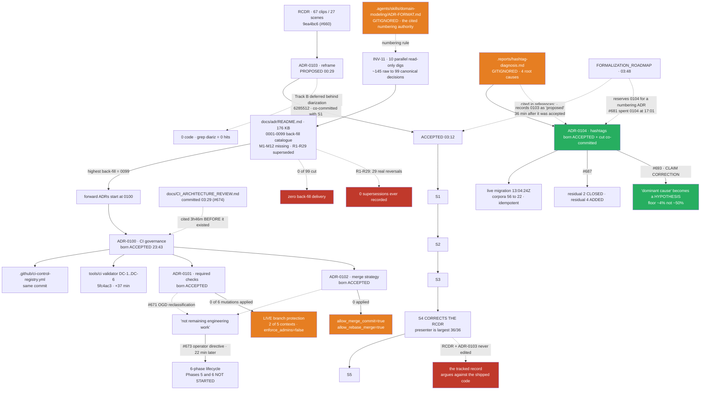
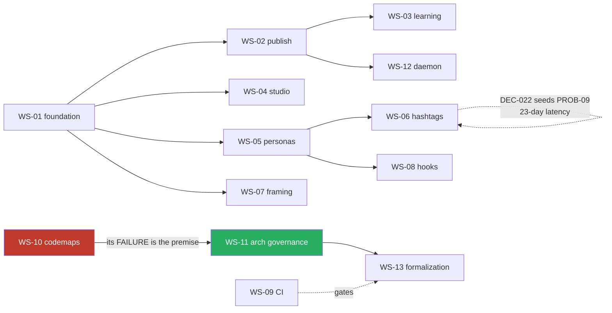

# 03 — Program and Decision History

## 1. Document Control

| Field | Value |
|---|---|
| **Title** | FanOps — Program and Decision History Reconstruction |
| **Purpose** | The canonical historical reconstruction of FanOps engineering: what problems existed, what was investigated, what was decided, what was implemented, what was validated, what was superseded, and what remains unfinished. |
| **Status** | Complete — independent reconstruction from primary evidence. |
| **Observation timestamp** | 2026-07-16T18:21:49Z (probe start) → 2026-07-16T23:15Z (close). Repo commit dates are `+0400`; GitHub `mergedAt` is UTC. Both are cited where they differ (a 4-hour offset routinely makes one event appear on two dates). |
| **Repository revision** | `6d21749ffc49c77383f537d93b028cca0d69a447` — identical to `origin/main`. Working tree carries two untracked directories (`docs/constitution/`, `docs/reconciliation/`) and no modified tracked files. |
| **History availability** | **Complete and unrewritten.** Non-shallow; 1,503 commits; first commit `9ee8fd4` 2026-06-01 00:04:42 +0400; 691 of 693 PRs retrievable; 6 tags; 63 local branches; 26 worktrees. See §3. |
| **Scope** | The whole of FanOps engineering, 2026-06-01 → 2026-07-16 (46 calendar days). All workstreams, not only the most recent program. |
| **Exclusions** | No claim is made about content quality, business outcomes, or platform-side behaviour. Live external services (Meta Graph, Postiz) were not called. The live SQLite ledger was read by subordinate researchers read-only; no live mutation occurred. |
| **Evidence limitations** | Four material ones, each consequential — see §3.5: (1) PR *review* discussion is nearly absent because the repository has 0 required approving reviewers, so rationale survives mainly in PR bodies authored by the same party who merged; (2) `.reports/` was gitignored 2026-07-03 → 2026-07-15, so an entire architectural knowledge base was produced outside version control and imported wholesale; (3) several load-bearing artifacts remain untracked today and exist on exactly one machine; (4) live branch-protection has no history API, so the enforcement record before 2026-07-15 is unrecoverable. |
| **Independence statement** | This reconstruction was derived independently from primary evidence (git, GitHub, code, tests, workflows, live process state). Two external reconciliation reports were discovered in the target directory *during* the work: `docs/reconciliation/02_REPOSITORY_REALITY_AND_INTEGRITY.md` (165,015 bytes, mtime 2026-07-16T23:12:44, sha256 `ad9371db583c0811…`, untracked) and `docs/reconciliation/04_APPLIED_PROGRAMS_RECONSTRUCTION.md` (148,819 bytes, mtime 2026-07-16T22:51:58, sha256 `fea06bde47c43a71…`, untracked). Per the governing procedure, **neither was read until §§1–25 of this document were complete**. Their identity was recorded by metadata only (size/mtime/hash) at 23:13. The comparison appears in §26 and §25.3. |
| **Authority** | This document **reconstructs history and authorizes no changes**. It is descriptive, not normative. No code, test, ADR, codemap, workflow, branch, PR, issue, repository setting, runtime state, or operational data was modified. Only this file was created. |

---

## 2. Executive Historical Reconstruction

*(Written last. Every claim cites an event, decision, or evidence ID defined below.)*

FanOps was scaffolded from a clean slate on 2026-06-01 (`EVT-001`) and reached its present state 46 days later across **six engineering eras** (`ERA-1`…`ERA-6`), **13 workstreams** (`WS-01`…`WS-13`), and **622 merged pull requests**. The dominant causal pattern is not a plan being executed. It is a **repeating cycle of build → ship → measure → discover the shipped thing was structurally wrong → tear it out**, in which *measurement against live data* — not review, not tests, not design — is what consistently produced the truth (`DEC-021`, `DEC-030`, `DEC-041`).

The most consequential operative decisions today are: publish is gated on human approval and nothing auto-publishes (`DEC-009`, operative since 2026-06-19); each persona owns its moment end-to-end, which killed the entire `(moment × account)` selection model (`DEC-030`); a hashtag's worth is its live Meta Graph reach and never the post that used it (`DEC-021`); the ledger is SQLite (`DEC-027`); smart framing fails **closed** when its dependency is absent rather than silently centre-cropping (`DEC-034`); and hashtag curation and evidence are separate authorities joined by a one-way edge enforced by the data model (`DEC-041`).

The most consequential superseded decisions are the ones the project built well and then deleted: the `AccountSelection` sum-type (`DEC-024` → superseded by `DEC-030` after 11 days), the LLM casting stage and its reach prior (`DEC-020`/`DEC-026` → `DEC-030`, the latter after **5 days** and probably without ever executing in production), the hook editor+critic cascade (`DEC-013`), the per-frame framing chase (`DEC-018`, killed **28 minutes** after merge), and the codemap auto-sync program (`DEC-029`, which produced ~46 closed PRs before being decommissioned). None of these were recorded as supersessions at the time, because the mechanism for recording a supersession (`ERA-6`'s ADR system) postdates all of them by weeks.

The largest historical gaps are three. First, **an entire architectural knowledge base — Cycles 1–6, including the document that calls itself "the canonical architectural reference" — was produced while `.reports/` was gitignored and imported into git in a single commit** (`EVT-062`, `H-COMMIT-070de715`), so no cycle has independent per-cycle provenance. Second, **the decision record begins on 2026-07-15**: the ADR system is ~32 hours old at HEAD, contains 5 forward ADRs, has never recorded a supersession, and has produced **zero** of the 99 back-fill ADRs its own 176 KB archaeology catalogued (`RISK-04`). Third, **the enforcement record before 2026-07-15 is unrecoverable** — the repo ran for six weeks with two required checks that no document declared and whose activation date is recorded nowhere (`GAP-G0`).

The most consequential unfinished obligations are `OBL-01` (Track A reframe is *validated but never applied* — the corpus fix exists as code and a passed pilot, and **zero clips have been mutated**, while the corpus's 82 worst clips are structurally unreachable by the apply); `OBL-05` (**six of six** branch-protection mutations declared by ADR-0101/0102 are unapplied, so three checks the repo calls merge-blocking invariants run green and cannot block); `OBL-09` (the hashtag evidence channel is proven correct and **unfed** — the live store carries `reach: {}` and cannot be re-measured until the Meta budget rolls ~2026-07-19); and `OBL-12` (the primary evidence for two flagship programs exists only as untracked files on one machine).

**Is the present architecture historically coherent? Substantially yes, with two named exceptions.** The code is coherent: the reversals were real reversals, executed cleanly, and **the executable code of the deleted things is genuinely gone** — measured at HEAD, `casting.py` fell **403 → 22 lines**, and `_render_perframe`, `_lerp_expr`, `SelectionFact`, `scoped_caption_surfaces`, `hookedit`, `hookjudge`, `blotato` and `env_snapshot` return **zero hits** across `src/`, with **no live `class`/`def`/`import`** of `AccountSelection`, `moment_casting`, `casting_bias` or `hooks_by_persona` anywhere. Their **names** do survive in prose in 6 files — which is `CON-19`, not a live path. The system's structure today is the honest product of what it learned, and the learning was driven by measurement. The two incoherences are (a) **the documentation layer lags the code and in three places actively argues against it** — the reframe RCDR and ADR-0103 on `main` still assert the very claim slice S4 measured false, so "the permanent evidence package currently justifies undoing S4" (`CON-11`); and (b) **the governance layer declares an authority it has not deployed** — ADR-0101 and ADR-0102 are `accepted` with none of their decisions live, a gap closed on paper by reclassifying the remainder as "Operational Governance Deployment" (`CON-06`, `DEC-044`). The system is coherent. Its account of itself is 24–48 hours behind it, and that lag is the repository's signature defect, which it has diagnosed in itself (`PROB-11`) and not yet closed.

---

## 3. Historical Evidence Baseline

### 3.1 Git history availability

| Property | Observation | Method |
|---|---|---|
| Shallow? | **No** — `git rev-parse --is-shallow-repository` → `false` | `H-CI-001` |
| First reachable commit | `9ee8fd4` — 2026-06-01 00:04:42 +0400 — *"chore: scaffold fanops v2 (clean slate) — dirs, gitignore, pyproject (py3.12)"* | `H-COMMIT-9ee8fd4` |
| Total commits | **1,503** reachable from HEAD | `git rev-list --count HEAD` |
| Span | 2026-06-01 → 2026-07-16 — **46 calendar days**, 41 with commits |
| Remotes | one — `origin` = `https://github.com/Fleezyflo/fanops.git` (fetch+push) |
| Tags | **6** (3 archive, 3 checkpoint) — §3.1.1 |
| Local branches | **63** |
| Remote branches | ~120+ (`origin/*`), incl. `origin/HEAD → origin/main` |
| Worktrees | **26**, one *locked* |
| Stashes | **0** |
| **Rewritten?** | **No.** Zero of 1,503 commits show committer-date − author-date > 1 day. A large-scale rebase or filter-branch would show mass divergence. The history is as-authored. |
| Rename/deletion visibility | Full. `--diff-filter=D`/`--follow` resolve cleanly; 8 deleted `src/fanops` modules recovered (§16). |

**"Clean slate" is literal.** `H-COMMIT-9ee8fd4`'s message says *"scaffold fanops v2 (clean slate)"* and `H-COMMIT-9e15817` (00:04:51, 9 seconds later) says *"relocate v2 plan to docs/, **ignore .DS_Store + superseded plans**"*. Two untracked design documents sit in the repo root — `2026-05-31-mohflow-fanops.md` (165 KB) and `2026-05-31-fanops-real-build.md` (123 KB), both mtime 2026-05-31 — which **predate the first commit**. **A v1 existed and was deliberately not carried forward.** Its history is not in this repository and is not recoverable from it. Everything before 2026-06-01 is out of reach (`Q-01`).

**One discontinuity: 2026-06-07 → 2026-06-11, five days, zero commits.** Last before: `H-COMMIT-6e4039` (2026-06-06 17:11:44). First after: 2026-06-12. Nothing in the repository explains it; there is no branch, no PR, no note. **INFERRED: operator absence, not a repository event** — the gap is clean on both sides, work resumes mid-programme (Studio), and 18 commits share the identical committer-second `2026-06-06 17:11:44`, i.e. a batch push immediately before the gap. Confidence: medium. It is recorded as a fact, not explained (`EVT-014`).

#### 3.1.1 Tags

| Tag | Commit | Date | Annotated? | Ancestor of main? | What it marks |
|---|---|---|---|---|---|
| `checkpoint-finalisation` | `df03ed4` | 2026-06-13 14:53 | yes | yes | *"ECC finalization pipeline complete: stages 1-9 done, queue drained, codemaps+docs synced, CI green both jobs"* |
| `checkpoint-finalisation-2` | `90329b6` | 2026-06-14 14:34 | yes | yes | *"Second finalization baseline: post-checkpoint 5-agent audit + 5 TDD fixes + codemap sync. Suite 772, CI green."* |
| `checkpoint-hook-system-pre-dissect` | `362cd36` | 2026-06-18 13:33 | **no** (lightweight) | yes | Pre-image before the hook-system teardown (`EVT-030`) |
| `archive/ledger-rebuild-from-live-2026-07-02` | `f6e4d82` | 2026-07-02 16:14 | **no** | **NO** | Rebase attempt v1 (§12.3) |
| `archive/ledger-rebuild-v2-2026-07-02` | `538af98` | 2026-07-02 18:15 | **no** | **NO** | Rebase attempt v2 |
| `archive/ledger-rebuild-v3-2026-07-02` | `ef43952` | 2026-07-02 20:31 | **no** | **NO** | Rebase attempt v3 |

Tags are used for exactly two purposes — **checkpoints before a risky teardown** and **archiving abandoned rebase attempts**. There is no release tag. `pyproject.toml` says `version = "0.4.0"`; **no tag corresponds to any version.** The project has never cut a release (`UNREC-08`).

### 3.2 Pull-request and issue availability

| Property | Observation |
|---|---|
| PRs retrievable | **691** of the 693-number range (`gh pr list --state all --limit 1000`) |
| Merged | **622** |
| Closed-unmerged | **69** |
| Missing numbers | **2** — INFERRED: consumed by issues (GitHub shares the sequence) |
| PR bodies | Present and unusually rich — the primary rationale source for this reconstruction |
| **Review discussion** | **Nearly absent — the central evidence limitation.** Live protection returns `required_approving_review_count: 0`. Bot comments (CodeRabbit, Cursor Bugbot) exist; substantive human review threads are rare. |
| Issues | GitHub issues are not the tracker. Work is tracked as **`MOL-###` (Linear)** and as unit slugs. Linear content is **outside this repository** and was not consulted. |

**Consequence for confidence.** Almost every decision is recorded by the *same party who implemented and merged it*, with no independent reviewer on the record. PR bodies are detailed and often self-critical (several PRs disclose their own defects), which raises their value — but they are **self-attested**. Where a decision's rationale exists only in a PR body authored by the merger, confidence is capped at **medium**, and this is the single largest reason so many entries below are medium rather than high. **Two `(Unit: …)`-tagged governance PRs are the exception:** they were amended in response to operator direction recorded in-body (`H-PR-671`, `H-PR-673`), which is the only direct evidence of an external check on the record.

### 3.3 Local and worktree history

| Category | Count | Finding |
|---|---|---|
| Local branches | 63 | **61 carry no unlanded work** (11 ancestors of main; 50 landed-by-content) |
| **Squash-merge artifact** | **50 of 52** | See the correction below — this is the most important methodological finding in §3 |
| **Genuinely unlanded** | **2** | `fix/darwin-test-gate` (#625), `fix/cursor-all-route` (#624) — each proven by blob absence/divergence (§3.3.1) |
| Closed-unmerged PRs whose **content nonetheless landed** | 3 | #502 (folded into the MOL-478 branch at `fe77ea5`, landed via **#503**), #638 (superseded by **#639**), #650 (superseded by **#651**) |
| No-PR branches | 2 | `arch-recon` (**false positive** — landed via #636), `cursor/cloud-agent-1783626326349-f4sx9` (stray; its only absent blob is **live data**, `00_control/ledger.sqlite`, which correctly never landed) |
| Worktrees | 26 | 1 locked (`.claude/worktrees/repository-constitution`), several stale-on-landed-commits |
| Stashes | 0 | No parked work |
| Untracked historical documents | many | `docs/constitution/` (11 files), `docs/reconciliation/` (2 external reports), `.reports/*` except `architecture/`, two 2026-05-31 root design docs |

> **⚠ Methodological correction — `git merge-base --is-ancestor` is the WRONG test in this repository, and it fails in the direction of false alarm.**
> This repo squash-merges (`DEC-046`/ADR-0102 §1; every `main` commit carries `(#NNN)`). A squash creates a *new* commit, so the source branch tip is **never** an ancestor of `main`, and **`git cherry` over-reports too because squash-merge destroys patch-id**. Applying `--is-ancestor` naively yields **52 branches "NOT LANDED"**. Blob-level adjudication collapses that to **2**. **50 of 52 were false alarms — a 96% false-positive rate.**
> **Only blob comparison settles it.** `git diff --stat origin/main <branch>` is also useless here: for `cursor/mol-476` it reports *"617 files changed, +4,984 / −95,983"* — **that is 245 commits of main the branch lacks, not new work**.
> This correction was derived independently **five times** (by me, by two subordinate researchers working blind to each other, and by external reports 02 and 04 — see §26). Any historical claim of "abandoned branch" built on `--is-ancestor` in this repository is presumptively wrong.

#### 3.3.1 Blob-level adjudication of every contested branch

Method: for each branch, diff against its merge-base with `main` to get the files it actually touched, then for each file ask whether `origin/main` carries that blob (`git cat-file -e`) and whether the content matches.

| Branch | Files touched | Identical on main | Differ | **Absent from main** | Verdict |
|---|---|---|---|---|---|
| `fix/darwin-test-gate` (#625 CLOSED) | 5 | 0 | 3 | **2** — `.claude/hooks/darwin_test_gate.py`, `tests/test_darwin_test_gate.py` | **UNLANDED — complete, tested, dropped** |
| `fix/cursor-all-route` (#624 CLOSED) | 2 | 0 | 2 | 0 | **UNLANDED** — main holds `_CURSOR_SUPPORTS_VISION = False`; the branch sets it `True` and removes the vision→claude fallback. **The change is not on main** |
| `cursor/mol-476-hook-author-always` (#502 CLOSED) | 5 | 0 | 5 | 0 | **LANDED via another PR** — `fe77ea5` *"merge MOL-476 hook author-always into MOL-478 branch (serial hot-file landing)"* → landed as `3032e63` (**#503**) |
| `fix/rc2-terminal-ladder` (#638 CLOSED) | 12 | 1 | 11 | 0 | **LANDED via `-v2`** — `7da78f0` (#639) |
| `fix/rc8-error-reason-latch` (#650 CLOSED) | 5 | 2 | 3 | 0 | **LANDED via `-v2`** — `105efda` (#651) |
| `arch-recon` (no PR under this name) | 118 | 100 | 18 | 0 | **LANDED** — tracks `origin/feat/arch-governance`; landed as `70de715` (#636). The local name differs from the PR head name, so a head-name lookup misses it |
| `cursor/cloud-agent-…-f4sx9` (no PR) | 7 | 1 | 5 | **1** — `MohFlow-FanOps/00_control/ledger.sqlite` | **Not real work** — a stray *"Apply local changes"* commit whose only absent blob is **live operational data that correctly never landed** |

**"Differ" is not "unlanded."** `main` has moved hundreds of commits past every merge-base, so a touched file differing from `main` is expected. The verdict turns on whether the branch's *specific change* is present — which is why #624 is unlanded despite 0 absent files, and #502 is landed despite 5 differing ones.

> **I had this wrong.** My first pass classified all 5 closed-unmerged PRs plus 2 no-PR branches as unlanded (**87%**), by reading *PR state* as a proxy for *content landing*. Blob adjudication shows **3 of those 5 landed under a different PR number**. **External report 02 independently reached 96% and was right; this document has been corrected to match** (§26, `XR-01`). The general lesson is the one this repository keeps re-learning: **a status field is not a measurement.**

**Genuinely unlanded local work is therefore exactly two branches** — `fix/darwin-test-gate` (#625) and `fix/cursor-all-route` (#624), both complete and tested, both closed with **no recorded reason** (`Q-04`, `OBL-11`).

### 3.4 Operational history

Probed read-only at 2026-07-16T23:0x.

| Record | Observation | Significance |
|---|---|---|
| `launchctl list \| grep fanops` | `9121  -15  com.fanops.run` · `-  0  com.fanops.keeper` · `9123  -15  com.fanops.studio` | **The system is operationally adopted and running right now.** This is not a code repository awaiting deployment. |
| Live data root | `/Users/molhamhomsi/FanOps/MohFlow-FanOps/00_control/` — `accounts.json` (2026-07-07), `cutover.json` (2026-07-01), `ledger.sqlite` (3.0 MB, mtime 2026-07-16T22:40, **347 posts**), `ledger.json` (63 KB, **5 posts**, 2026-07-09) | Real production data. The ledger has been live since at least early July. |
| Daemon plist `WorkingDirectory` | `/Users/molhamhomsi/FanOps` — which contains **no `00_control/`** | Source of `CON-14`: a tracked migration record names the wrong root, so **its documented rollback command fails as written**. |
| `accounts.json.preframing-bak` | 2026-07-02 | Ad-hoc operator backup — an undocumented safety practice. |
| Migration rollback snapshot | `personas.json.r4-bak-20260716T130424Z`, 5,369 bytes, intact | `DEC-041`'s rollback exists and was verified present. |
| Deployment/rollout records | **No CI/CD.** No deploy workflow, no release, no container registry. "Deployment" = the launchd daemon adopting a new SHA from the local checkout. | The runtime-adoption mechanism *is* `WS-12`'s keeper — which is why keeper defects (`EVT-092`, `EVT-093`) are deployment defects. |
| Migration logs | `docs/CODEMAPS/r4-migration-record.md` (`H-DOC-r4mig`, tracked, `EVT-095`) — the only tracked live-migration record in the repo. | Everything before it was migrated without a tracked record. |

### 3.5 Evidence limitations

These questions **cannot be fully answered** from available evidence:

1. **`Q-01` — What did v1 look like and why was it abandoned?** Two 2026-05-31 design docs (288 KB combined) sit untracked in the root; the first commit explicitly ignores "superseded plans". No v1 history exists in this repo.
2. **`Q-02` — When did the two required status checks become required?** GitHub exposes no branch-protection history. The earliest evidence in-tree is the 2026-07-15 freeze (`docs/ci/freeze/2026-07-15/branch-protection.json`). The activation date is **unrecoverable** — a ~6-week enforcement blind spot (`GAP-G0`).
3. **`Q-03` — Did Cycles 1–6 actually run on the dates and at the SHA they claim?** Every file self-stamps `2026-07-14 · git HEAD fcffa73` and **all entered git in one commit** (`H-COMMIT-70de715`). The stamps are internally plausible and nothing contradicts them, but there is **no independent corroboration** — no per-cycle commit, no incremental history.
4. **`Q-04` — Why were #502, #624, #625 closed?** No closure comment on any. The reasons are lost.
5. **`Q-05` — What is the blast radius of the `AccountSelection` operator-override loss (`EVT-070`)?** The mechanism is proven; the affected rows lived only in the live ledger and were dropped by the migration. **Unknowable from this repository.**
6. **`Q-06` — Which rendered frames did the reframe program actually accept on?** Its stated acceptance is "the VISUAL on rendered frames"; every contact sheet was written to scratch and is gone, and the sole pilot record is untracked (`OBL-12`).
7. **Author intent generally.** Where rationale is absent I mark it INFERRED and say so; I do not reconstruct motive from code.

---

## 4. Historical Artifact Inventory

Artifact IDs are `H-DOC-*`. "Historical authority" = the weight it carried when written; "current authority" = its weight at HEAD. The gap between those two columns is where this repository's documentation debt lives.

| ID | Path | Type | Created (SHA / date / PR) | Originating WS | Purpose | Current status | Historical authority | Current authority | Superseded by | Contradictions |
|---|---|---|---|---|---|---|---|---|---|---|
| `H-DOC-plan-v2` | `docs/superpowers/plans/2026-05-31-fanops-real-build-v2.md` | plan | `9e15817` 2026-06-01 | WS-01 | The v2 build plan | tracked, historical | high | none | — | — |
| `H-DOC-plan-live` | `docs/superpowers/plans/2026-06-01-fanops-live-autonomous.md` | plan | 2026-06-01 | WS-01/02 | Phases A–G live+autonomous | tracked, historical | high | none | — | — |
| `H-DOC-plan-studio` | `docs/superpowers/plans/2026-06-06-fanops-studio.md` | plan | `6e40395` 2026-06-06 | WS-04 | Studio design (13 tasks) | tracked, historical | high | none | — | — |
| `H-DOC-controlfiles` | `docs/CONTROL-FILES.md` | contract | `f4e9c5a` 2026-06-16, **no PR** | WS-01 | Control-file taxonomy | tracked, **never edited since birth** | medium | **stale** | — | Has **no atomicity column** — `write_json_atomic` postdates it by 10 days (`CON-09`) |
| `H-DOC-codemap-arch` | `docs/CODEMAPS/archive/architecture.md` | codemap | `e395e12` 2026-06-13, **no PR** | WS-10 | First codemap (ECC Stage 8) | **archived** 2026-07-11 | medium | none | `H-DOC-fulltrace` | Header says `Generated: 2026-06-19`; content last edited **2026-07-09** — the stamp is 20 days stale (`CON-16`) |
| `H-DOC-codemap-data` | `docs/CODEMAPS/archive/data.md` | codemap | `e395e12` 2026-06-13 | WS-10 | Data tree, ledger locking | archived | medium | none | `H-DOC-C1` | — |
| `H-DOC-codemap-deps` | `docs/CODEMAPS/archive/dependencies.md` | codemap | `e395e12` 2026-06-13 | WS-10 | Binaries, flags, CI | archived | medium | none | `H-DOC-lens`, `H-DOC-config` | — |
| `H-DOC-acctconn` | `docs/CODEMAPS/account-connection.md` | codemap | `e2882ea` 2026-06-21 / #84 | WS-02 | IG account → publishable | live, frozen | high | medium | — | — |
| `H-DOC-hashlife` | `docs/CODEMAPS/hashtag-lifecycle.md` | codemap | `a761738` 2026-06-23 / #151 | WS-06 | Corpus → vet → post → reach | live, frozen, **partially stale** | high | medium | — | Its "per-clip CONTENT tags wired at caption.py" section is **false at HEAD**; `ba17c5d` edited this file and left the stale section (`CON-13`) |
| `H-DOC-personalevers` | `docs/CODEMAPS/archive/persona-levers.md` | codemap | `b409492` 2026-06-24 | WS-05 | Lever → downstream bite | archived | medium | none | — | — |
| `H-DOC-lifecycle` | `docs/CODEMAPS/archive/lifecycle-full-picture.md` | codemap | `0551ef5` 2026-06-30 | WS-04 | Max-depth lifecycle audit | archived, **explicitly superseded** | high | none | `H-DOC-freshingest` | — |
| `H-DOC-insights` | `docs/CODEMAPS/insights-culmination.md` | codemap | `0aec1e1` 2026-07-02 / #268 | WS-03 | Reach-loop bias actuators | live, frozen | high | medium | — | Claims a reader for `timing_bias.json` that does not exist (`CON-17`) |
| `H-DOC-fulltrace` | `docs/CODEMAPS/full-trace-index.md` | codemap (hybrid) | `240a874` 2026-07-03 / #287 | WS-10 | 108-module coverage ledger | live, frozen | high | **medium — 24 modules never traced** | — | Says `109/109`; ground truth at landing = **108** (`CON-15`) |
| `H-DOC-anomalies` | `docs/CODEMAPS/anomalies.md` | anomaly ledger | `240a874` 2026-07-03 / #287 | WS-10 | Anomaly/dead-code ledger | live, **annotated as FALSE-when-frozen** | high | **superseded as verdict** | `tools/arch` + `INVARIANT_AUDIT` (#683) | Claimed 10 invariants "all HOLD"; `wipe-confirmation` was CRITICAL-broken at the time (`CON-12`) |
| `H-DOC-lens` | `docs/CODEMAPS/system-lens-map.md` | codemap | `240a874` 2026-07-03 / #287 | WS-10 | 64-env-var table, chains | live, frozen | high | medium | — | — |
| `H-DOC-C1`…`H-DOC-C10` | `docs/CODEMAPS/subsystem-traces/C{1..10}_*.md` | subsystem trace | `240a874` 2026-07-03 / #287 | WS-10 | Per-function behaviour/callers | frozen; **C1 re-verified (4 of 6 entries stale), C2–C10 never re-verified** | high | **low-medium** | — | C1's "dead-by-design" `RenderState` claim was flatly false; C3 describes a subsystem that no longer exists (`CON-11`) |
| `H-DOC-freshingest` | `docs/CODEMAPS/archive/fresh-ingestion-trace.md` | trace | `53c2fbb` 2026-07-07 / #394 (after #374 **closed**) | WS-10 | One video → posts × 5 accounts | archived | high | none | — | **The only map naming a source SHA** (`6395ce3`) — now 377 commits stale |
| `H-DOC-issreg` | `.reports/issue-register-2026-07-03.md` | anomaly ledger | 2026-07-03 | WS-11 | MOL issue → file:line | **untracked** | high | medium | — | Cited by `CLAUDE.md` as a first-stop; unreadable from a clean clone |
| `H-DOC-kb-*` | `.reports/architecture/*` (27 md + json) | KB / contract / audit | **all** `70de715` 2026-07-15 / #636 | WS-11 | Cycles 1–6 architecture KB | tracked (since 07-15) | **claimed canonical** | high (derived) / medium (prose) | — | **Produced entirely outside git; no per-cycle provenance** (`Q-03`, `RISK-02`) |
| `H-DOC-implcontract` | `.reports/architecture/IMPLEMENTATION_CONTRACT.md` | contract | `70de715` 2026-07-15 / #636 | WS-11 | Cycle 6 frozen surface; GB-1…GB-7 | tracked | high | **high — actively cited** | — | GB-5 is inverted by the untracked constitution draft (`CON-05`) |
| `H-DOC-archgov` | `docs/ARCHITECTURE_GOVERNANCE.md` | generated governance | `70de715` 2026-07-15 / #636 | WS-11 | Generated control doc | live, **23 touches** | high | high | — | Line-anchor fragile: nearly every touch is a drift-regen rider |
| `H-DOC-runbook-arch` | `docs/ARCH_RUNBOOK.md` | runbook | `70de715` 2026-07-15 / #636 | WS-11 | Operator runbook for `tools/arch` | live | high | high | — | — |
| `H-DOC-adr-readme` | `docs/adr/README.md` (**176 KB**) | archaeology / evidence package | `4fcb08e` 2026-07-15 / #658 | WS-13 | **Not an index** — a 99-decision back-fill catalogue (0001–0099) + missing-ADR report M1–M12 + superseded report R1–R29 | live | high | **high — the single best historical artifact in the repo** | — | Links `../../.agents/skills/…/ADR-FORMAT.md`, which is **gitignored** → broken in any clone (`CON-03`) |
| `H-DOC-adr-0100` | `docs/adr/0100-ci-governance-authority-and-control-registry.md` | ADR | `4fcb08e` 2026-07-15 / #658 | WS-13 | Three reconciled CI planes | accepted (in principle) | high | high | — | Cites `CI_ARCHITECTURE_REVIEW.md` **3h46m before it existed** (`CON-02`) |
| `H-DOC-adr-0101` | `docs/adr/0101-required-checks-and-merge-gate-policy.md` | ADR | `4fcb08e` 2026-07-15 / #658 | WS-13 | 5 required contexts | accepted (in principle) | high | **declared, undeployed** | — | `accepted` while 3 of 5 contexts + 3 settings are live-false (`CON-06`) |
| `H-DOC-adr-0102` | `docs/adr/0102-merge-strategy-and-repository-history-policy.md` | ADR | `4fcb08e` 2026-07-15 / #658 | WS-13 | Squash-only + linear history | accepted (in principle) | high | **declared, undeployed** | — | `allow_merge_commit`/`allow_rebase_merge` still **true** (`CON-06`) |
| `H-DOC-adr-0103` | `docs/adr/0103-reframe-subject-and-layout-aware-framing.md` | ADR | `9ea4bc6` 2026-07-16 / #660 | WS-07 | Subject/layout-aware framing | **accepted** (`6285512`) | high | high | — | Still lists as "rejected on evidence" the claim S4 **measured true** (`CON-11`) |
| `H-DOC-adr-0104` | `docs/adr/0104-hashtag-curation-and-evidence-separation.md` | ADR | `ba17c5d` 2026-07-16 / #681 | WS-06 | 3 authorities, one-way edges | **accepted**, 3 amendments | high | **high — the healthiest ADR** | — | `references:` still names a **gitignored** file (`CON-04`) |
| `H-DOC-adr-roadmap` | `docs/adr/FORMALIZATION_ROADMAP.md` | roadmap | `e2cf862` 2026-07-16 / #675 | WS-13 | Tier-1 back-fill queue (6) | live, **never amended** | medium | **low — born stale** | — | Records ADR-0103 as "proposed" **36 min after** it became accepted; reserves 0104 for a numbering ADR that was never written while #681 spent 0104 (`CON-08`) |
| `H-DOC-constitution` | `docs/REPOSITORY_CONSTITUTION.md` | constitution | `e2cf862` 2026-07-16 / #675 | WS-13 | 72 rules + honest enforcement status | live | high | high | — | — |
| `H-DOC-laws` | `docs/ARCHITECTURAL_LAWS.md` | law | `e2cf862` 2026-07-16 / #675 | WS-13 | Enforceable architecture | live | high | high | — | — |
| `H-DOC-philosophy` | `docs/ENGINEERING_PHILOSOPHY.md` | standard | `e2cf862` 2026-07-16 / #675 | WS-13 | Stance | live | medium | medium | — | — |
| `H-DOC-std` | `docs/ENGINEERING_STANDARDS.md` | standard | `cde2286` 2026-07-16 / #677 | WS-13 | STD-* craft layer | live | high | high | — | STD-TEST-01 claimed `enforced`; it is **local-opt-in with an undisclosed env bypass** (`CON-07`) |
| `H-DOC-stdmatrix` | `docs/governance/STANDARDS_ENFORCEMENT_MATRIX.md` | governance | `cde2286` 2026-07-16 / #677 | WS-13 | STD → enforcement | live | high | high | — | Mostly self-reports `documented-only` — **structurally honest** |
| `H-DOC-evrecon` | `docs/governance/EVIDENCE_RECONCILIATION.md` | governance | `e2cf862` 2026-07-16 / #675 | WS-13 | R1–R7 fates | live | high | high | — | R7 adjudicates the constitution draft (`DEC-048`) |
| `H-DOC-dossier` | `docs/CONSTITUTION-EVIDENCE-DOSSIER.md` | evidence | `bf9c9e5` 2026-07-16 / #685 | WS-13 | Constitution evidence | **created already-retired** | medium | **historical only** | itself | Landed *as* frozen so an existing citation resolves — a deliberate, unusual act |
| `H-DOC-cireview` | `docs/CI_ARCHITECTURE_REVIEW.md` (117 KB) | investigation | `c2fd18d` 2026-07-16 / #674 | WS-09 | The CI investigation | live | high | high | — | Committed **after** the ADR that cites it (`CON-02`) |
| `H-DOC-ci-registry` | `.github/ci-control-registry.yml` | registry | `4fcb08e` 2026-07-15 / #658 | WS-09 | CI intent plane | live, test-gated | high | high | — | Header still says *"STATUS: proposed — inert… No workflow reads this file yet"* while `status: accepted` sits 9 lines below (`CON-10`) |
| `H-DOC-cilifecycle` | `docs/ci/CI_PROGRAM_LIFECYCLE.md` | governance | `aec8264` 2026-07-16 / #673 | WS-09 | 6-phase lifecycle | live | high | **high — authoritative phase status** | — | Phases 5 & 6 **NOT STARTED** |
| `H-DOC-cibpm` | `docs/ci/CI_BRANCH_PROTECTION_MUTATIONS.md` | rollout plan | 2026-07-16 / #673-#674 | WS-09 | M1–M6 mutations | live, **unexecuted** | high | high | — | *"Nothing below has been executed… DEPLOYMENT GATE: operator"* |
| `H-DOC-freeze` | `docs/ci/freeze/2026-07-15/` | freeze record | 2026-07-16 / #674 | WS-09 | Pre-image snapshot | live | high | high | — | Pre-image is **byte-identical to live** at HEAD → zero deployment |
| `H-DOC-rcdr` | `docs/design/reframe/` (RCDR, framing-spec, roadmap, evidence/*.json) | investigation + spec | `9ea4bc6` 2026-07-16 / #660 | WS-07 | 67-clip framing defect record | live | high | **high but contradicted** | — | Asserts the largest-face-mislock claim S4 **disproved** (`CON-11`) |
| `H-DOC-cv2dr` | `docs/design/cv2-decision-record-v4.md` | decision record | 2026-07-14 / #633 | WS-07 | cv2 fail-closed | live | high | high | — | Carries **explicit retractions** of its own earlier validation claims — a model artifact |
| `H-DOC-r4mig` | `docs/CODEMAPS/r4-migration-record.md` | migration record | `caa3427` 2026-07-16 / #690 | WS-06 | R4 live migration + rollback | live | high | high | — | Names the **wrong data root**; its rollback command fails as written (`CON-14`) |
| `H-DOC-brief17` | `docs/design/briefs/17-hashtag-model-diversity.md` | brief | `97d316d` 2026-07-16 / #691, rebuilt `6d21749` / #693 | WS-06 | Successor diversity program | live | high | high | v1 → v2 | v1's structural-floor premise **disproven by measurement** (`CON-18`) |
| `H-DOC-diag` | `.reports/hashtag-generic-identical-diagnosis-2026-07-16.md` | investigation | 2026-07-16 | WS-06 | 4 root causes R1–R4 | **UNTRACKED** | **high — the primary evidence for `PROB-09`** | **unreadable from a clean clone** | partially promoted by `H-DOC-r4mig` | Cited by ADR-0104's `references:` (`CON-04`); warns of *"the same trap that stranded Cycles 1-6"* |
| `H-DOC-pilot` | `.reports/track-a-visual-pilot-2026-07-16.md` | validation report | 2026-07-16 (mtime 17:51) | WS-07 | Track A visual pilot | **UNTRACKED** | **high — the sole visual acceptance of Track A** | **unreadable from a clean clone** | — | Verdict `READY AFTER SPECIFIC FIXES`; contact sheets rendered to scratch and **already gone** (`OBL-12`) |
| `H-DOC-constdraft` | `docs/constitution/` (11 files) | constitution draft | **never committed in any ref** | WS-13 | Parallel constitutional layer | **UNTRACKED, SUPERSEDED** | none | **none — do not cite** | `H-DOC-constitution` (via #675, #685) | Draft `LAWS §4.2` **inverts GB-5** (`CON-05`). Its own README carries a "NEVER REVIVE" marker |
| `H-DOC-ext-02` | `docs/reconciliation/02_REPOSITORY_REALITY_AND_INTEGRITY.md` | external reconciliation | untracked, mtime 2026-07-16T23:12:44 | — | Present-state reality report | untracked, **being written during this work** | n/a | n/a | — | See §26 |
| `H-DOC-ext-04` | `docs/reconciliation/04_APPLIED_PROGRAMS_RECONSTRUCTION.md` | external reconciliation | untracked, mtime 2026-07-16T22:51:58 | — | Applied programs report | untracked | n/a | n/a | — | See §26 |

**Inventory-level findings.**

1. **The first codemap and the control-file contract were pushed straight to `main` with no PR** (`e395e12`, `f4e9c5a`). So were 3 of 11 schema bumps (§12.1). Direct-to-main was normal early and was closed by the pre-push guard on 2026-06-26 (`EVT-035`).
2. **A 45-minute margin decided what survives.** `240a874` (2026-07-03 19:03:57) lifted C1–C10 out of `.reports/` into `docs/`; `ef845ca` (19:48:02) gitignored `.reports/`. Reversed, the traces would never have entered git (`RISK-02`).
3. **The best historical artifact in the repository is `H-DOC-adr-readme`** — a 176 KB, 99-decision evidence-backed archaeology with a missing-ADR report and a 29-item supersession report. It has produced **zero** ADRs (`OBL-06`).
4. **Two of the repo's most important evidence artifacts are untracked** (`H-DOC-diag`, `H-DOC-pilot`), and both underpin flagship programs. Both warn about exactly this in their own text.

---

## 5. Master Event Ledger

Chronological. `EVT-###`. Confidence: **H**igh / **M**edium / **L**ow. This ledger includes failed and abandoned work.

> **On numbering.** IDs are **stable identifiers, not a contiguous sequence**. `EVT-010`–`EVT-013` and `DEC-031` are unassigned (candidates that collapsed into neighbouring entries during drafting); `EVT-070` is placed by topic next to the reversal it belongs to, not by number. **Nothing was deleted.** Every ID cited anywhere in this document has a definition row (verified mechanically at close).

| Event | Date (+0400) | Type | WS | Description | Inputs | Outputs | Decisions | Evidence | Conf |
|---|---|---|---|---|---|---|---|---|---|
| `EVT-001` | 2026-06-01 00:04 | implementation | WS-01 | **Clean-slate scaffold of "fanops v2"**; same commit-minute ignores "superseded plans" | two untracked 2026-05-31 design docs (v1) | repo | `DEC-001` | `H-COMMIT-9ee8fd4`, `H-COMMIT-9e15817` | H |
| `EVT-002` | 2026-06-01 00:07–00:10 | implementation | WS-01 | Foundation: content-addressed ids + `surface_key`; units + agent contracts (`failed≠analyzed`); config/layout; **JSON ledger + O_EXCL sentinel** | plan | `ledger.py`, `models.py`, `config.py` | `DEC-002` | `H-COMMIT-0554e5d`, `ef67e34`, `59b5fb7`, `506aa4d` | H |
| `EVT-003` | 2026-06-01 11:58 | reversal | WS-01 | **O_EXCL sentinel → `fcntl.flock`** after 11h48m — a killed writer wedged every command *"until a human rm'd the file"* | audit H6 | flock ledger | `DEC-003` | `H-COMMIT-b489e0b` | H |
| `EVT-004` | 2026-06-01 17:11 | merge | WS-01 | **PR #1** — Phase B concurrency: transaction holds flock across load→mutate→save; typed `LockBusyError` | audit B4/M1/M2 | — | `DEC-003` | `H-PR-1` | H |
| `EVT-005` | 2026-06-01 | implementation | WS-09 | **`ci.yml` born with both required job names** — `unit (fast, no toolchain)`, `real-tooling E2E (must run, not skip)`. Never renamed since. | — | CI | `DEC-004` | `H-COMMIT-aa8c510` | H |
| `EVT-006` | 2026-06-04 | implementation | WS-03 | Creative variation v1 (observe-only) — **PR #10 CLOSED**, landed via #9 | plan | `FANOPS_CREATIVE_VARIATION` | `DEC-005` | `H-PR-10`, `H-COMMIT-5ae438b` | H |
| `EVT-007` | 2026-06-04 | implementation | WS-01 | Content discovery + folder-review intake | plan | `discover`/`intake` | — | `H-DOC-plan-disc` | H |
| `EVT-008` | 2026-06-05→06 | implementation | WS-03 | Variation **v2 (feedback loop)** then **v3 (amplify, UCB bandit)** — three plans in 48h | v1 | UCB allocation | `DEC-006` | `H-COMMIT-16813d4` (#16) | H |
| `EVT-009` | 2026-06-06 17:11 | proposal | WS-04 | **Studio designed + adversarially hardened**; 18 commits share one committer-second | — | `H-DOC-plan-studio` | `DEC-007` | `H-COMMIT-6e40395`, `f13df93`, `a292e66` | H |
| `EVT-014` | 2026-06-07→11 | *(gap)* | — | **5 days, zero commits.** Unexplained in-repo. INFERRED operator absence | — | — | — | commit census | M |
| `EVT-015` | 2026-06-13 01:22 | implementation | WS-10 | **First codemaps** (`architecture`/`data`/`dependencies`) — ECC Stage 8, **pushed direct to main, no PR**. Motive stated: *token-lean* routing | `/ecc:update-codemaps` | `H-DOC-codemap-arch` etc. | `DEC-008` | `H-COMMIT-e395e12` | H |
| `EVT-016` | 2026-06-13 | implementation | WS-01 | **SCHEMA_VERSION introduced (v1)** — identity baseline, **no PR** | — | migration registry | `DEC-010` | `H-COMMIT-010f9a2` | H |
| `EVT-017` | 2026-06-13 14:53 | freeze | WS-01 | Tag `checkpoint-finalisation` — *"stages 1-9 done, CI green"* | — | tag | — | `H-TAG-cf1` | H |
| `EVT-018` | 2026-06-14 14:34 | freeze | WS-01 | Tag `checkpoint-finalisation-2` — post-checkpoint **5-agent audit + 5 TDD fixes** | audit | tag | — | `H-TAG-cf2` | H |
| `EVT-019` | 2026-06-15 | implementation | WS-02 | **First real IG post proven** (per memory: reel on a live handle) | Postiz | live post | — | `H-OPS-firstpost` | M |
| `EVT-020` | 2026-06-16 | implementation | WS-06 | **Hashtags born**: `vet_hashtags` + frozen `VETTED`; **≤4 hard, never model-invented**. Trigger: *"5–15 model-invented words"* | operator corpus run | `hashtags.py` | `DEC-011` | `H-COMMIT-512d2e6` | H |
| `EVT-021` | 2026-06-16 | implementation | WS-01 | `docs/CONTROL-FILES.md` — **no PR**; a taxonomy, **not** a durability contract | — | `H-DOC-controlfiles` | — | `H-COMMIT-f4e9c5a` | H |
| `EVT-022` | 2026-06-17 | implementation | WS-01 | SCHEMA v2 — `stitch_plans` (M3) | — | — | `DEC-010` | `H-COMMIT-f91f5d1` (#48) | H |
| `EVT-023` | 2026-06-18 13:33 | freeze | WS-05 | Tag `checkpoint-hook-system-pre-dissect` — pre-image before the hook teardown. Trigger: **operator feedback on a real corpus run** (*"hooks narrated the scene/artist"*) | live output | tag | — | `H-TAG-hook`, `H-COMMIT-362cd36` | H |
| `EVT-024` | 2026-06-19 | decision+impl | WS-02 | **Approval lifecycle**: posts born `awaiting_approval`; `publish_due` iterates only `queued` → **nothing auto-publishes** | operator | state machine | **`DEC-009`** | `H-CODE-poststate` | H |
| `EVT-025` | 2026-06-19 | implementation | WS-01 | SCHEMA v3 — backfill `created_at`, **no PR**; migration + 4 edge tests | — | — | `DEC-010` | `H-COMMIT-55c3449` | H |
| `EVT-026` | 2026-06-19 | implementation | WS-06 | M4 hashtag store (own-reach, doctor-gated) + live Graph trends (30/7d budget, fail-open) | — | `fanops_hashtags.py` | `DEC-012` | `H-COMMIT-12dc77f`, `8f382d5` (#65) | H |
| `EVT-027` | 2026-06-20 | implementation | WS-01 | SCHEMA v4 — legacy `metrics_series` (P3); 4 tests incl. torn-row | — | — | `DEC-010` | `H-COMMIT-633361e` (#77) | H |
| `EVT-028` | 2026-06-20 | implementation | WS-06 | Per-account `tag_lean` + AR region floor | — | — | `DEC-014` | `H-COMMIT-2f94ee9` (#82) | H |
| `EVT-029` | 2026-06-20 | **reversal** | WS-05 | **Hook editor + critic cascade DELETED** (`hookedit.py`, `hookjudge.py`) — Phase 2 of the hook dissect | `EVT-023` audit | −2 modules | `DEC-013` | `H-COMMIT-e9142d7` | H |
| `EVT-030` | 2026-06-21 | implementation | WS-02 | `account-connection` codemap (#84) — born from an IG connect failure | live failure | `H-DOC-acctconn` | — | `H-COMMIT-e2882ea` | H |
| `EVT-031` | 2026-06-22 | decision+impl | WS-02 | **Backend routing inverted**: `accounts.json` per-channel wins; `go_live` stops writing `FANOPS_POSTER`. **3 commits, 36 minutes** | operator misread `.env` | `set_account_backend` | **`DEC-015`** | `H-COMMIT-29d1403` (#122), `7b9ba2e` (#123), `6a624ee` (#124) | H |
| `EVT-032` | 2026-06-22 | implementation | WS-01 | SCHEMA v5 — `batches` (Account-First) | — | — | `DEC-010` | `H-COMMIT-537fbc6` (#99) | H |
| `EVT-033` | 2026-06-23 | implementation | WS-01 | SCHEMA v6 — `renders` (**Render entity**) | — | `Render` | `DEC-016` | `H-COMMIT-c39fcd2` (#130) | H |
| `EVT-034` | 2026-06-23 | implementation | WS-05 | **LLM `moment_casting` stage** born | — | `casting.py` | `DEC-020` | `H-COMMIT-e0fcee4` (#131) | H |
| `EVT-035` | 2026-06-26 | decision+impl | WS-09 | **Pre-push guard** — *"a markdown rule can't stop an unattended agent"*. Closes `GAP-G1` | agents pushing to main | `.githooks/` | `DEC-017` | `H-COMMIT-8c6155f`, `136f256` | H |
| `EVT-036` | 2026-06-23 | **decision+impl** | WS-05/06 | **Personas become first-class** (`personas.py`, `personas.json`, `Account.persona_id`, `migrate_from_accounts`, Studio tab) | hashtag/persona coupling | `Persona` | **`DEC-019`** | `H-COMMIT-75388a3` (#147) | H |
| `EVT-037` | 2026-06-23 | decision+impl | WS-06 | **B1 — corpus JOINS vetted membership + LEADS the priority pool** (*a curated tag the frozen set doesn't know must SURVIVE*) | `EVT-036` | `vet_hashtags(corpus=)` | **`DEC-022`** ← *the root of `PROB-09`* | `H-COMMIT-eef86b7` (#148) | H |
| `EVT-038` | 2026-06-23 | decision | WS-06 | **Global auto-absorption of unvetted discoveries deliberately NOT built** — *an engagement floor admits generic spam + bypasses the operator gate* | — | non-decision | **`DEC-023`** | `H-COMMIT-410a8ce` (#152), `H-DOC-hashlife:106` | H |
| `EVT-039` | 2026-06-23 | implementation | WS-06 | B4 — hashtag lifecycle **documented**; e2e test | — | `H-DOC-hashlife` | — | `H-COMMIT-a761738` (#151) | H |
| `EVT-040` | 2026-06-23 | implementation | WS-01 | SCHEMA v7 — `selection_facts`. **No validating migration test** | — | — | `DEC-010` | `H-COMMIT-b5f3d26` (#140) | H |
| `EVT-041` | 2026-06-24 | implementation | WS-01 | SCHEMA v8 — identity gap-filler (`hook_source`, `cut_seconds` ride defaults) | — | — | `DEC-010` | `H-COMMIT-a9c9b70` (#155) | H |
| `EVT-042` | 2026-06-26 | implementation | WS-05 | **`AccountSelection` durable sum-type built** (RF1) — SCHEMA v9, **pushed direct, no PR**, no migration test | *(moment × account)* ambiguity | `account_selections` | **`DEC-024`** | `H-COMMIT-ca8ea76` | H |
| `EVT-043` | 2026-06-27 04:50 | implementation | WS-07 | **`framing.py` born** — Haar face detect → static per-window offset; **fail-open**; `[framing]` extra; *"can never be worse than before"* | blind crop | `subject_focus` | `DEC-025` | `H-COMMIT-c9558f5` (#206) | H |
| `EVT-044` | 2026-06-27 | **decision+impl** | WS-06 | **GRAPH-REACH JUDGING** — own-reach subsystem **deleted**; attribution severance test pinned; provenance `reach-store`→`graph-reach` | operator directive | `refresh_store` | **`DEC-021`** | `H-COMMIT-64f83ff` (#217) | H |
| `EVT-045` | 2026-06-27 | implementation | WS-06 | **`tag_lean` retired into `hashtag_corpus`** — one curation surface | `EVT-036` | — | `DEC-014` superseded | `H-COMMIT-600f880` (#212) | H |
| `EVT-046` | 2026-06-28 17:46 | **reversal** | WS-07 | **Haar → YuNet** — *"the old path detected 0-2/6 faces and never moved the crop"* | measurement | vendored ONNX | `DEC-025` | `H-COMMIT-45dbfad` | H |
| `EVT-047` | 2026-06-28 19:00 | implementation | WS-07 | T5 — **smooth pan `_lerp_expr`** ships with passing unit tests | — | — | — | `H-COMMIT-6f36357` | H |
| `EVT-048` | 2026-06-28 19:52 | **reversal** | WS-07 | **Smooth pan killed 52 min later** by **visual proof on the real source** — the pan slid across the empty 2-shot gap onto a bare desk | visual | `_step_expr` | `DEC-018` | `H-COMMIT-00d595c` | H |
| `EVT-049` | 2026-06-28 21:17 | **reversal** | WS-07 | **Per-window single crop killed** — *measured: face swung 0.20–0.33, centre-x drifted 0.14–0.67*. Replaced by **per-frame chase**, billed with a superior "motion-measured" harness | measurement | `_render_perframe` | `DEC-018` | `H-COMMIT-fe66eca` (#228) | H |
| `EVT-050` | 2026-06-28 21:45 | **reversal** | WS-07 | **Per-frame chase killed 28 MINUTES after its own merge** — it *"tracked detection wobble and the zoom breathed — a jittery hand-held look"*. `_render_perframe` **deleted so the jitter path can no longer be constructed**. **FINAL: static locked-off crop per shot** | visual | final design | **`DEC-018`** | `H-COMMIT-1b7baaed` | H |
| `EVT-051` | 2026-06-30 | implementation | WS-04 | `lifecycle-full-picture` max-depth audit | — | `H-DOC-lifecycle` | — | `H-COMMIT-0551ef5` | H |
| `EVT-052` | 2026-07-01 | **reversal** | WS-02 | **Blotato backend removed completely** (Leg 1) — 4 modules deleted | — | Postiz-only | `DEC-028` | `H-COMMIT-9e84041` (#264) | H |
| `EVT-053` | 2026-07-02 | implementation | WS-03 | Insights culmination Leg 5 — reach-loop codemap; `casting_bias` (`092068b`/#267) | — | `H-DOC-insights` | `DEC-026` | `H-COMMIT-0aec1e1` (#268) | H |
| `EVT-054` | 2026-07-02 16:14→20:31 | **abandonment ×3** | WS-01 | **Ledger-rebuild rebase attempts v1/v2/v3 archived as tags.** Patch-ids identical across all four attempts; v3's tip is timestamped **6 seconds after** the PR that obsoleted it. Base drift, not data work | 9 PRs landing in 5.5h | 3 tags | — | `H-TAG-lr1/2/3` | H |
| `EVT-055` | 2026-07-02 20:56 | merge | WS-01 | **v4 lands** — SCHEMA v10 `imported_media` | `EVT-054` | — | `DEC-010` | `H-COMMIT-9e92a6a` (#284) | H |
| `EVT-056` | 2026-07-03 19:03 | implementation | WS-10 | **108-module zero-omission trace** — deterministic AST + **10 Sonnet agents**; C1–C10 lifted from `.reports/` into `docs/` | — | `H-DOC-fulltrace` etc. | `DEC-032` | `H-COMMIT-240a874` (#287) | H |
| `EVT-057` | 2026-07-03 19:48 | implementation | WS-09 | **`.reports/` gitignored** — 45 minutes after `EVT-056` saved the traces | — | `.gitignore` | — | `H-COMMIT-ef845ca` | H |
| `EVT-058` | 2026-07-03/04 | problem | — | **Host hard-crashed 3× under stacked agent load** (RAM exhaustion, kernel-confirmed). Operating rules adopted: one background agent, no duplicated suites | 2 hot sessions + Docker + Chrome | throttle rules | `DEC-033` | `H-LOCAL-crash` | H |
| `EVT-059` | 2026-07-06 | **reversal** | WS-05 | **P4–P15 single-owner rebuild begins** — `hooks_by_persona` deleted (`51f4e4f`/#348) | operator spec 2026-07-05: *"per-account label on a SHARED object — the ghost"* | — | **`DEC-030`** | `H-COMMIT-51f4e4f` | H |
| `EVT-060` | 2026-07-07 | **reversal** | WS-05 | **P11 casting teardown** — `moment_casting` + `casting_bias` deleted; `casting.py` **403 → 22 lines** (measured at `c84fd5d^`=`02c6a00c` and `c84fd5d`); P11 alone **−1,826** | `DEC-030` | — | `DEC-030` | `H-COMMIT-c84fd5d` (#361) | H |
| `EVT-061` | 2026-07-07 | **reversal** | WS-01 | **SCHEMA v11 — `account_selections` + `selection_facts` DROPPED.** The two never-proven migrations are exactly the two deleted | `DEC-030` | — | `DEC-030` | `H-COMMIT-48b4e2f` (#362) | H |
| `EVT-070` | 2026-07-06→07 | **silent data loss** | WS-05 | **Operator cast overrides silently reverted.** `cast_add`/`cast_remove` wrote **only** `account_selections`; the v11 drop discarded their sole home. Verified: `grep -c affinities` on `actions_casting.py` at `c84fd5d^` = **0** | `DEC-024`+`DEC-030` | — | — | `H-CODE-casting` | H |
| `EVT-062` | 2026-07-07→10 | **abandonment** | WS-10 | **Codemap auto-sync landfill** — a Cursor automation fired on *PR-merged*, spawning **~26 draft PRs/day**; ~46 PRs closed unmerged; #397/#399 target the same SHA (it duplicated itself). #449's GHA-gated redesign landed and **also failed** | P11 teardown left ~13 maps describing dead code | 46 closed PRs | `DEC-029` | `H-PR-375`, `H-PR-449`, `H-PR-377…514` | H |
| `EVT-063` | 2026-07-08 | implementation | WS-09 | **Orchestration hook-gate born** — hooks-enforced land-gate incl. `(Unit: <slug>)` | agent drift | `.cursor/hooks/` | `DEC-035` | `H-COMMIT-3d68ccf` (#398) | H |
| `EVT-064` | 2026-07-09 10:52→13:13 | **migration** | WS-01 | **JSON → SQLite, complete in 2h21m** (M1-A…M1-F, PRs #474–#479). Dual-format window **56m50s**; the JSON escape hatch existed **20m58s**; `FANOPS_LEDGER_BACKEND` documented and un-documented within **60 minutes** | flock self-deadlock | `SqliteLedgerStore` | **`DEC-027`** | `H-COMMIT-ed3f9b9`…`9b19f97` | H |
| `EVT-065` | 2026-07-10 | **reversal** | WS-09 | **`env_snapshot.py` deleted** — *"revert MOL-292 env freeze"* | CI | — | — | `H-COMMIT-b6ad728` | H |
| `EVT-066` | 2026-07-11 13:08 | **closeout** | WS-10 | **Auto-sync DECOMMISSIONED; `docs/CODEMAPS/` FROZEN.** One commit (+57/−589): deletes the sync machine, archives 6 maps, freezes 17 with *"When prose and code disagree, the code is right."* Linear MOL-331..340 cancelled | `EVT-062` | freeze | **`DEC-029`** | `H-COMMIT-2b81f81` (#543) | H |
| `EVT-067` | 2026-07-11 | implementation | WS-04 | Studio U-series + B-briefs; SLO gate (#534/#535) | — | — | — | `H-COMMIT-de7a4b3` | H |
| `EVT-068` | 2026-07-12 | implementation | WS-06 | **S12 auto corpus refresh (`FANOPS_CORPUS_AUTO`, default ON)** — writes store-derived proposals back into the corpus. **This closes the R4 loop** | — | — | `DEC-022` | `H-COMMIT-982ca99` (#591) | H |
| `EVT-069` | 2026-07-12 | implementation | WS-06 | S06 deterministic rotation using a **boolean** recency flag — **introduces R2** | — | — | — | `H-COMMIT-4467f61` (#586) | H |
| `EVT-071` | 2026-07-13 | implementation | WS-12 | **Self-healing liveness + self-adopting deploy** (`b9b6353`/#626) | daemon staleness | keeper | `DEC-036` | `H-COMMIT-b9b6353` | H |
| `EVT-072` | 2026-07-13 | closed-unmerged | WS-09 | **PR #625 `darwin-test-gate` CLOSED, no reason recorded.** The repo-wide `pytest` deny remains, still blocking the two Linux environments where running the suite is expected | — | — | — | `H-PR-625` | H |
| `EVT-073` | 2026-07-14 16:36 | **reversal** | WS-07 | **cv2 fail-open → FAIL-CLOSED.** *"the framing pipeline **hid** it… the 'smart framing DEFAULTS ON' contract was a **silent lie**… the operator shipped blind-centred clips believing subject-tracking had happened"* | `DEC-025`'s premise | `ToolchainMissingError` | **`DEC-034`** | `H-COMMIT-fcffa73` (#633), `H-DOC-cv2dr` | H |
| `EVT-074` | 2026-07-14 22:42 | implementation | WS-07 | **`fanops reframe --dry-run`** — makes the REASON a clip was centred first-class; 21 scenarios characterized in a detached worktree | — | `reframe.py` | `DEC-037` | `H-COMMIT-0b79407` (#634) | H |
| `EVT-075` | 2026-07-15 00:57 | implementation | WS-07 | **`reframe --apply`** — lock/preimage/backup/staged/atomic/journal/resume/rollback. Dry-run on **25 live clips: 25/25 ELIGIBLE** | `EVT-074` | `reframe_apply.py` | `DEC-037` | `H-COMMIT-75876f9` (#635) | H |
| `EVT-076` | 2026-07-15 01:58 | **implementation** | WS-11 | **Cycle 7 — `tools/arch`** (stdlib-only DERIVED-vs-DECLARED engine, 21 controls, 20 negative controls) **+ `.reports/architecture/` un-ignored**: *"The entire architectural knowledge base of Cycles 1–6 was therefore not in the repository… an architecture gate would have found no inputs, silently skipped every check, and gone green — a vacuous pass, worse than no gate"* | Cycles 1–6 (run **outside git**) | `tools/arch`, `architecture.yml`, GOV-001 | **`DEC-038`** | `H-COMMIT-70de715` (#636) | H |
| `EVT-077` | 2026-07-15 | **remediation** | WS-11 | **Cycle 8 — 12 RC slices (#637–#657)**, incl. `RC-4/RC-5` restore-race (`3c1bff9`/#653) — a **CRITICAL data-loss defect on the very invariant `H-DOC-anomalies` recorded as holding**. RC-9 accepted as residual | Cycle 4/6 root causes | 12 PRs | `DEC-039` | `H-COMMIT-3c1bff9` etc. | H |
| `EVT-078` | 2026-07-15 08:02→08:08 | **reversal** | WS-09 | **Orchestration gate DISABLED — operator decision.** PR #644 CLOSED at 08:02; identical-titled **#645 MERGED at 08:08** (6 min later). *"The hook-gate cost more in blocked work than it protected — false blocks (an optional CodeRabbit check froze all merges)"* | `GAP-G3` | gate dormant | **`DEC-035` reversed** | `H-PR-644`, `H-PR-645` | H |
| `EVT-079` | 2026-07-15 23:43 | **decision** | WS-13 | **THE ADR SYSTEM IS BORN** — `docs/adr/` created; ADR-0100/0101/0102 + the 176 KB 99-decision archaeology + `ci-control-registry.yml`, all in **one commit**. All three ADRs **born `accepted`** | CI three-plane divergence | ADR system | **`DEC-043`…`DEC-046`** | `H-COMMIT-4fcb08e` (#658) | H |
| `EVT-080` | 2026-07-16 00:20 | implementation | WS-09 | **`tools/ci` validator (DC-1…DC-6)** — 37 min after the ADR that specifies it | ADR-0100 | `tools/ci` | `DEC-043` | `H-COMMIT-5fc4ac3` (#661) | H |
| `EVT-081` | 2026-07-16 00:29 | **investigation+proposal** | WS-07 | **RCDR + framing spec + roadmap + ADR-0103 (proposed).** 67 clips / 5 sources / **27 scenes, every scene visually audited**; D1 = podcast crops to an empty gap (**0 faces on screen**), D2 = presenter PIP grid misrouted. **19.3% of corpus, a lower bound** | live corpus | `H-DOC-rcdr` | `DEC-040` | `H-COMMIT-9ea4bc6` (#660) | H |
| `EVT-082` | 2026-07-16 02:31 | **decision** | WS-09 | **The OGD reclassification** — 0101/0102 rewritten to assert *"The engineering implementation… is complete and merged… the remaining 'Phase E' is reclassified as Operational Governance Deployment… **not remaining engineering work**"* | undeployed policy | reframing | **`DEC-044`** | `H-COMMIT-3b6b7ae` (#671) | H |
| `EVT-083` | 2026-07-16 02:53 | correction | WS-09 | **Binary "complete" replaced by a 6-phase lifecycle** — *"(Operator directive, 2026-07-16)"*. Phases 5 & 6 marked **NOT STARTED**. This is `DEC-044` being partially walked back **22 minutes later** | operator | `H-DOC-cilifecycle` | `DEC-044` amended | `H-COMMIT-aec8264` (#673) | H |
| `EVT-084` | 2026-07-16 03:12 | decision+impl | WS-07 | **ADR-0103 proposed→ACCEPTED, co-committed with slice S1.** The only status transition in the ADR system — and it is not an independent decision event | `EVT-081` | S1 | `DEC-040` | `H-COMMIT-6285512` (#669) | H |
| `EVT-085` | 2026-07-16 03:29 | implementation | WS-09 | `CI_ARCHITECTURE_REVIEW.md` **committed** — *"commit the Investigation artifact"* — **3h46m after ADR-0100 cited it as proof** | — | `H-DOC-cireview` | — | `H-COMMIT-c2fd18d` (#674) | H |
| `EVT-086` | 2026-07-16 03:41→03:48 | **decision** | WS-13 | **Constitutional layer lands** (`REPOSITORY_CONSTITUTION`, `ARCHITECTURAL_LAWS`, `ENGINEERING_PHILOSOPHY`, governance roadmaps). R7 **defers** the parallel untracked `docs/constitution/` draft: *"owned by another agent — do not absorb"* | Cycles 1–8 | `H-DOC-constitution` | **`DEC-047`** | `H-COMMIT-e2cf862` (#675) | H |
| `EVT-087` | 2026-07-16 03:48 | *(anomaly)* | WS-13 | **`FORMALIZATION_ROADMAP` lands recording ADR-0103 as "proposed"** — 36 minutes after `EVT-084` made it accepted. **Born stale; never amended** | — | `H-DOC-adr-roadmap` | — | `H-COMMIT-e2cf862` | H |
| `EVT-088` | 2026-07-16 04:10→16:22 | implementation | WS-07 | **Track A slices S2–S5** (#676, #678, #680, #682). **S4 corrects the RCDR**: presenter is the largest face **36/36**; the mislock is **score-caused**, not size-caused → *"Ban `_pick_dominant_face`, not size"* | ADR-0103 | 4 PRs | `DEC-040` | `H-COMMIT-a79528d`…`3d1667d` | H |
| `EVT-089` | 2026-07-16 12:05 | implementation | WS-13 | Engineering standards layer (STD-*) + enforcement matrix + scorecard | — | `H-DOC-std` | `DEC-047` | `H-COMMIT-cde2286` (#677) | H |
| `EVT-090` | 2026-07-16 ~14:36 | **investigation** | WS-06 | **The hashtag diagnosis (rev 2)** — 4 root causes. **319/347 posts (91.9%)** shipped `corpus[0:4]` verbatim; **3 distinct lines across 347 posts**; **0/347 seed-fallbacks** (the model never failed — it was overridden 347 times); store **byte-identical to seeds+floor** (53 tags, **0 discovered, `reach:{}`**). **Rev 1's two headline claims were disproven by rev 2 before any fix shipped** | live ledger | `H-DOC-diag` (**untracked**) | — | `H-DOC-diag` | H |
| `EVT-091` | 2026-07-16 10:35→13:16 | **remediation** | WS-06 | **Selector fix (#679)** then **R4 structural cut + ADR-0104 (#681)** then **seed-scope (#687)**. CI caught the fix's *own* erasure one level down. Live migration executed 13:04:24Z: corpora 56→**22**, store 53→**18**; idempotent (7→0 changes, byte-identical hash twice) | `EVT-090` | `hashtag_hygiene.py`, `hashtag_migrate.py` | **`DEC-041`** | `H-COMMIT-01484fd`, `ba17c5d`, `cb3df5f` | H |
| `EVT-092` | 2026-07-16 17:31 | **deployment defect** | WS-12 | **Keeper could never adopt new code — `etimes` is not a BSD ps keyword.** Permanently inert, not delayed: the pump sat on a day-old SHA **through 18 merges** | live | fix | `DEC-036` | `H-COMMIT-6186431` (#688) | H |
| `EVT-093` | 2026-07-16 17:50 | **deployment defect** | WS-12 | **Storm guard must outlast a pass** — pids 49425→51695→52493→52886→53266 in ~8 min | live | fix | `DEC-036` | `H-COMMIT-073a37e` (#689) | H |
| `EVT-094` | 2026-07-16 ~17:51 | **validation** | WS-07 | **Track A visual pilot executed** — read-only, **0 clips mutated** (4632/4632 files hashed, `03_clips` changed 0). Verdict **`READY AFTER SPECIFIC FIXES`**: corrections work, 0 regressions — **but 2 new blockers + 2 false claims**. Finding F-7 **inverted under measurement** | S1–S5 | `H-DOC-pilot` (**untracked**) | — | `H-DOC-pilot` | H |
| `EVT-095` | 2026-07-16 18:14 | **closeout** | WS-06 | **R4 migration record** — the first tracked live-migration record in the repo; promotes the *operational* half of the untracked diagnosis. **Live keeper adopt proven for the first time** (heartbeat `073a37e` → `caa3427`, one kickstart, held past 4 keeper cycles) | `EVT-091`+`EVT-092`+`EVT-093` | `H-DOC-r4mig` | — | `H-COMMIT-caa3427` (#690) | H |
| `EVT-096` | 2026-07-16 20:07 | closeout | WS-06 | R4 handoff + boundary freeze; brief 17 v1 created | — | `H-DOC-brief17` | — | `H-COMMIT-97d316d` (#691) | H |
| `EVT-097` | 2026-07-16 20:39 | **claim correction** | WS-06 | **HEAD.** Brief rebuilt on measured data; **an overclaimed ADR-0104 residual corrected in situ**: "model repetition is now the DOMINANT cause" → **a hypothesis, not a measurement**; structural floor measured at **~4%, not the ~50% implied**; #679's graded-LRU proven **INERT** on live data. Self-initiated by measurement | review of #691 | `H-DOC-brief17` v2 | `DEC-041` amended | `H-COMMIT-6d21749` (#693) | H |

---

## 6. Problem and Investigation History

### 6.1 Problem register

| ID | Problem | First observed | Original description | Affected | Initial severity | Evidence | Investigations | Root-cause conclusion | Diagnosis revised? | Decisions | Current status |
|---|---|---|---|---|---|---|---|---|---|---|---|
| `PROB-01` | **O_EXCL sentinel wedges the CLI** | 2026-06-01 | A killed writer left a sentinel; every command failed *"until a human rm'd the file"* | ledger | HIGH | audit H6 | Phase-A audit | Sentinel has no owner-liveness concept | no | `DEC-003` | **CLOSED** (`EVT-003`) |
| `PROB-02` | **Lost-update race across overlapping runs** | 2026-06-01 | Two cron runs load a stale snapshot; last-save-wins — *"a published post could vanish, or a `submitting` revert into a double-post — silently"* | ledger/publish | HIGH | audit B4/M1/M2 | Phase B | Lock held only around `save()`, not load→mutate→save | no | `DEC-003` | **CLOSED** (`H-PR-1`) |
| `PROB-03` | **Hooks narrated the scene/artist** instead of retaining | 2026-06-18 | **Operator feedback on a real corpus run** | hooks | HIGH | live output | hook dissect (tag `checkpoint-hook-system-pre-dissect`) | The editor+critic cascade could not fix a generator problem; *the disappearing hook is UPSTREAM at the generator* | **yes** — the cascade was first believed to be the fix, then deleted | `DEC-013` | **CLOSED** — cascade deleted (`EVT-029`) |
| `PROB-04` | **Hashtags: 5–15 model-invented words** | 2026-06-16 | Model invented tags with no reach basis | captions | HIGH | live output | — | No membership gate | no | `DEC-011` | **CLOSED** (`EVT-020`) |
| `PROB-05` | **Per-account differentiation never reached output** | ~2026-06-26 | The casting brain decided, but output was identical | casting | HIGH | live output | per-account diagnosis | decided→clipped seam broken | no | `DEC-020`, later `DEC-030` | **SUPERSEDED** — the model itself was the defect |
| `PROB-06` | **The `(moment × account)` ghost** | 2026-07-05 | Operator spec: *"Every one is a 'per-account label on a SHARED object' — the ghost"* | data model | **CRITICAL (design)** | operator | P4–P15 | A moment has exactly **one owner**; the relation needing a durable table never existed | **yes** — inverts `DEC-024`'s premise | **`DEC-030`** | **CLOSED** — `casting.py` 403→22 lines (measured) |
| `PROB-07` | **Framing: face drifts in size / slides off-centre** | 2026-06-28 | *"cutting to random sizes", "slow/lazy/ruined"* | framing | HIGH | **measured**: face swung 0.20–0.33, centre-x drifted 0.14–0.67 | 3 approaches in 2h45m | ffmpeg `crop` fixes w/h **once per stream** | **yes ×2** — see `INV-04` | `DEC-018` | **CLOSED** — static locked-off crop |
| `PROB-08` | **Smart framing was a silent lie** | 2026-07-14 | With cv2 absent, `_resolve_framing` degraded to *"a blind centered crop with zero signal to the operator"*; *"the operator shipped blind-centred clips **believing subject-tracking had happened**"* | framing | **CRITICAL** | code read | cv2 DR v4 | Fail-open on a **required** dependency is indistinguishable from success | **yes** — `DEC-025`'s *"can never be worse than before"* falsified | **`DEC-034`** | **CLOSED** (`EVT-073`) |
| `PROB-09` | **Hashtags shipped generic AND identical** | 2026-07-16 | `#taylorswift`, `#80s`, `#instagood`, malformed `#fypppp…` (73 p's), and **the entire Wu-Tang Clan** — a different artist — on a **Syrian rapper's** catalogue; 2 handles on **93%** of posts | captions | **CRITICAL** | **measured on 347 live posts** | `INV-08` (2 revs) | **4 causes.** *identical*: R1 corpus monopoly (`DEC-022`, uncapped lead) + R2 boolean recency flag. *generic*: R3 destructive reach overwrite (max lifetime of a reach datum: **12h**) + R4 **closed loop** corpus→store→corpus with **no external evidence** | **yes** — rev 1's **two headline claims disproven by rev 2** before any fix shipped | **`DEC-041`** | **CLOSED structurally; evidence channel unfed** (`OBL-09`) |
| `PROB-10` | **Content-blind framing on 19.3% of corpus** | 2026-07-16 | *"the final composition is a **content-blind fixed region**… nothing in the terminal step uses the detected face positions"* | framing | HIGH | **67 clips / 27 scenes, every scene visually audited** | `INV-09` (RCDR) | Detection ran; the terminal composition ignored it | **yes** — S4 corrected the RCDR's own root cause | **`DEC-040`** | **Code CLOSED; corpus NOT applied** (`OBL-01`) |
| `PROB-11` | **A number in prose rots; the doc names a mechanism that doesn't exist** | recurring | The repo's **self-diagnosed signature defect** | docs | HIGH | many | Cycles 2–6, #683, #686 | Prose duplicates derived facts with no regeneration | no | `DEC-038` | **PARTIALLY CLOSED** — derived layer gated; prose layer not (`CON-15`, `CON-16`, `CON-17`) |
| `PROB-12` | **Three CI planes disagree** | 2026-07-15 | *"workflow YAML defines ~11 jobs; governance prose tags ~18 rules BLOCKING; live branch protection requires 2 contexts. Required-ness exists only in GitHub's UI. **That is the root defect; every other CI finding is a symptom**"* | CI | HIGH | `INV-10` | CI Architecture Review (117 KB) | No reconciled control plane | no | `DEC-043`…`DEC-046` | **Declared; NOT deployed** (`OBL-05`) |
| `PROB-13` | **The canonical KB was never in git** | 2026-07-15 | *"That made every governance claim unverifiable. CI never saw the artifacts, so an architecture gate would have found no inputs, **silently skipped every check that reads them, and gone green** — a vacuous pass, which is worse than no gate, because it manufactures confidence"* | governance | **CRITICAL** | `.gitignore` history | Cycle 7 | `.reports/` gitignored 2026-07-03 → 07-15 | no | `DEC-038` (+ GOV-001) | **CLOSED for `architecture/`; OPEN for everything else in `.reports/`** (`OBL-12`) |
| `PROB-14` | **Codemaps described deleted code** | 2026-07-07 | The P11 teardown left ~13 maps describing removed code as live | docs | MEDIUM | — | auto-sync program | The **prose layer is not machine-regenerable** | **yes** — the fix (automation) was itself abandoned | `DEC-029` | **CLOSED by abandonment** — frozen, *"the code is right"* |
| `PROB-15` | **Daemon ran stale code** | 2026-07-13→16 | The pump sat on a day-old SHA **through 18 merges** | runtime | HIGH | live `run.log` | keeper arc | `etimes` is not a BSD `ps` keyword → the adopt path was **permanently inert, not delayed** | no | `DEC-036` | **CLOSED + proven live** (`EVT-095`) |
| `PROB-16` | **Host hard-crashed 3×** | 2026-07-03/04 | Post-boot 1-min load average 116; kernel jetsam caught ~61 MB free, ~13.5 GB compressed | operator | HIGH | JetsamEvent ips | — | RAM exhaustion from **unthrottled stacking** (2 hot sessions + Docker + Chrome + duplicated suites) | no | `DEC-033` | **CLOSED by operating rules** |

### 6.2 Investigation register

| ID | Investigation | Date | Scope | Method | Evidence used | Outputs | Confidence | Limitations | Confirmed later? | Invalidated later? | Duplicate? |
|---|---|---|---|---|---|---|---|---|---|---|---|
| `INV-01` | Phase-A/B audit | 2026-06-01 | concurrency | audit + TDD | code | `H-PR-1` | high | — | yes | no | no |
| `INV-02` | 5-agent finalization audit | 2026-06-14 | whole system | multi-agent | code + suite | 5 TDD fixes, tag `checkpoint-finalisation-2` | medium | pre-live | partly | — | no |
| `INV-03` | Hook-system dissect | 2026-06-18→20 | hooks | corpus + read | live output | editor+critic **deleted** | high | — | yes | no | no |
| `INV-04` | **Framing approaches** | 2026-06-28 | framing | **render + measure + visual** | real source | 3 rejections in 2h45m | high | — | yes | **partly — see below** | no |
| `INV-05` | Lifecycle deep audit | 2026-06-30 | pipeline | read | code | `H-DOC-lifecycle` | medium | superseded in 7 days | partly | — | **yes** — re-done as `INV-06` |
| `INV-06` | **108-module zero-omission trace** | 2026-07-03 | whole repo | **deterministic AST + 10 Sonnet agents, cross-checked** | code | C1–C10, `H-DOC-fulltrace`, `H-DOC-anomalies` | high **at the time** | **per-cluster decomposition is structurally blind to cross-cluster defects** | partly | **yes** — `H-DOC-anomalies`' "all HOLD" was false (`CON-12`); 4 of 6 C1 entries stale | no |
| `INV-07` | **Architecture Cycles 1–6** | ~2026-07-14 | whole repo | 6 self-correcting cycles | code + **live ledger** | 27 docs, 10 root causes, `H-DOC-implcontract` | high (content) / **low (provenance)** | **ran outside git; single import commit; no per-cycle corroboration** (`Q-03`) | yes | self-corrected throughout | **partly** — Cycle 1 absorbs an earlier ground-truth inventory |
| `INV-08` | **Hashtag generic+identical diagnosis** | 2026-07-16 | hashtags | **measurement on 347 live posts** | live ledger | 4 root causes | **high** | **untracked** (`OBL-12`) | yes — fix validated by 347-post replay | **rev 1 self-invalidated by rev 2** | no |
| `INV-09` | **Reframe RCDR** | 2026-07-16 | framing | **67 clips / 5 sources / 27 scenes, every scene visually audited** | rendered frames | `H-DOC-rcdr`, ADR-0103 | high | **only 67 of 347 audited → rate is a lower bound** (`OBL-08`) | yes | **partly — S4 disproved its "largest-face mislocks" root cause** | no |
| `INV-10` | **CI Architecture Review** | 2026-07-16 | CI | 3-plane reconciliation | YAML + prose + **live API** | 117 KB; ADR-0100/0101/0102 | high | — | yes | no | no |
| `INV-11` | **ADR archaeology** | 2026-07-15 | whole history | **10 parallel read-only domain digs**, ~145 raw → **99 canonical** | git/PR/KB/codemap/test/memory | `H-DOC-adr-readme` | high | *"It is not a set of ADRs"* | — | — | **deliberate 10-way parallel dedup, not accidental duplication** |
| `INV-12` | **Track A visual pilot** | 2026-07-16 | framing | **read-only render + contact sheets + pre/post diff** | rendered frames | `READY AFTER SPECIFIC FIXES` | high | **untracked; contact sheets already deleted** | — | **self-inverted one of its own findings (F-7)** | no |

**Required-category coverage.** Whole-repository architecture → `INV-06`, `INV-07`. Subsystem mapping → `INV-06`. Architecture correctness → `INV-07`. Contracts/shapes → `INV-07` (`H-DOC-implcontract`). Governance/standards → `INV-11`, `EVT-086`/`EVT-089`. CI/enforcement → `INV-10`. Reframing → `INV-04`, `INV-09`, `INV-12`. Hashtags → `INV-08`. Daemon/runtime → `PROB-15` arc. Anomaly/silent-failure → `INV-06` (`H-DOC-anomalies`), `INV-07` (Cycles 3–6 corrections).

**The single most important methodological finding across all investigations.** Every investigation that **measured live state** overturned an investigation that **read code**:

- Cycle 2 → *"any claim of the form 'nothing does X' must be produced by an AST pass … never by a grep"*
- Cycle 5 → *"An architectural claim about the SHAPE of the codebase is not established by reading the code"* (its `COUP-09` was *"a sample presented as an inventory"* — real number **107**, not the handful listed)
- Cycle 6 → measure the **live tree**, *"which Cycle 4 asked for five times and never did"* — and only then found `RC-9` orphaned and the S02↔S10 "single most dangerous" interaction **unreachable on this deployment**
- `INV-08` → the model **never failed** (0/347 fallbacks); it was **overridden 347 times**. Unmeasurable by reading the prompt.
- `INV-09`/S4 → the presenter is the largest face **36/36**; the RCDR's stated root cause *"never fires"*.
- `INV-12` → *"This finding INVERTED under measurement. My first read called the 82 'unaudited clips safely withheld.' The transition matrix and the live render prove the opposite."*

**And one counter-example that matters more than the rest.** `INV-04`'s per-frame chase (`EVT-049`) shipped with a purpose-built **motion-measure harness**, explicitly billed as superior to stills (*"the prior 'verified' was hollow"*). It was killed **28 minutes later** for jitter the harness did not measure — because the harness measured **face-size constancy, not camera stillness**. *A validation method that names its predecessor hollow is not thereby sound.* This is the strongest evidence in the repository that measurement must be aimed at the property in dispute, not merely be quantitative.

---

## 7. Workstream Register

| ID | Name | Aliases | Objective | Start trigger | Start | End condition | **Actual end state** | Parent | Depends on | Parallel with | Principal artifacts | Decisions | Implementation | Validation | Residual |
|---|---|---|---|---|---|---|---|---|---|---|---|---|---|---|---|
| `WS-01` | **Foundation & data model** | v2 core, ledger | A durable, concurrency-safe content ledger | `EVT-001` | 2026-06-01 | Schema stable + store correct | **Complete-with-residue** — SQLite live; the JSON auto-import is still armed | — | — | all | `ledger.py`, `models.py`, `config.py` | `DEC-002`, `DEC-003`, `DEC-010`, `DEC-027` | ~133 PRs | 8 of 11 migrations tested | JSON auto-restore hazard (`OBL-04`) |
| `WS-02` | **Publish, schedule, reconcile** | crosspost, go-live | Publish to real platforms, safely | plan | 2026-06-01 | Live publish + approval gate | **Operationally adopted** | — | WS-01 | WS-04 | `post/`, `crosspost.py`, `reconcile.py` | `DEC-009`, `DEC-015`, `DEC-028` | ~92 PRs | live IG post; RC-1 claim guard | `FANOPS_POSTER` creds-free live switch (`OBL-10`) |
| `WS-03` | **Learning, metrics, insights** | variation v1-v3, reach loop | Close the feedback loop | plan | 2026-06-04 | Bias actuators gated + frozen | **Complete, mostly inert by design** | — | WS-02 | — | `track.py`, `insights` | `DEC-005`, `DEC-006`, `DEC-026` | ~20 PRs | auto-validation on first real metric | `timing_bias.json` is **write-only**; its gate is bypassed (`CON-17`) |
| `WS-04` | **Studio / UI** | cockpit, U-series, T-series | Operator cockpit | `EVT-009` | 2026-06-06 | Operator can run the system without CLI | **Complete** | — | WS-01/02 | WS-05 | `studio/` | `DEC-007` | ~71 PRs | screenshots | 149 routes, **0 authenticated** (M12) |
| `WS-05` | **Personas & casting** | archetypes, levers, RF1, P4-P15 | Per-account differentiation | `PROB-05` | 2026-06-20 | Each persona owns its moment | **Complete via full reversal** | — | WS-01 | WS-06 | `personas.py`, `casting.py` | `DEC-019`, `DEC-020`, `DEC-024`, **`DEC-030`** | ~31 PRs | `test_no_ghosts.py`, per-persona e2e | Inverted stale comments in `views_review.py` survive (`CON-19`) |
| `WS-06` | **Hashtags** | corpus, R1–R4 | Relevant, evidence-backed tags | `PROB-04` | 2026-06-16 | Tags are curated + evidence-gated | **Structurally complete; evidence channel unfed** | — | WS-05 | WS-03 | `hashtags.py`, `fanops_hashtags.py`, ADR-0104 | `DEC-011`, `DEC-021`, `DEC-022`, `DEC-023`, **`DEC-041`** | ~10 PRs | **347-post replay on live data**; live migration proven idempotent | 4 accepted residuals; store `reach:{}` (`OBL-09`) |
| `WS-07` | **Framing / reframe** | smart framing, Track A/B | Subject-aware vertical reframe | blind crop | 2026-06-27 | Corpus reframed correctly | **Validated, NOT applied** | — | WS-01 | — | `framing.py`, `reframe*.py`, ADR-0103 | `DEC-018`, `DEC-025`, **`DEC-034`**, `DEC-037`, **`DEC-040`** | ~16 PRs | **visual pilot: `READY AFTER SPECIFIC FIXES`** | **0 clips applied**; 82 worst clips unreachable (`OBL-01`) |
| `WS-08` | **Hooks** | structural hooks, dissect | On-screen retention hook | `PROB-03` | 2026-06-17 | Hook retains, doesn't praise | **Complete via deletion** | — | WS-05 | — | `moment_hook_prompt` | `DEC-013` | ~10 PRs | corpus feedback | #502 dropped, no reason (`OBL-11`) |
| `WS-09` | **CI & orchestration** | lane-guard, hook-gate | Mechanical enforcement | agents pushing to main | 2026-06-01 | Merges are gated on invariants | **Enforcing 2 checks; 3 declared checks cannot block** | — | — | all | `.github/workflows/`, `.githooks/` | `DEC-004`, `DEC-017`, `DEC-035`, `DEC-043`…`DEC-046` | ~75 PRs | CI green | **6 of 6 BP mutations unapplied** (`OBL-05`); gate dormant |
| `WS-10` | **Codemaps** | ECC maps, C1-C10, auto-sync | Token-lean routing + a truth map | `/ecc:update-codemaps` | 2026-06-13 | Maps track code | **Abandoned → frozen** | — | — | all | `docs/CODEMAPS/` | `DEC-008`, `DEC-029`, `DEC-032` | ~71 PRs (**only 29 merged**) | none automated | C2–C10 never re-verified; 24 modules never traced (`OBL-07`) |
| `WS-11` | **Architecture governance** | Cycles 1-8, tools/arch | Derived-vs-declared truth | `PROB-13` | ~2026-07-13 | Architecture is regenerated + gated | **Complete + enforced (transitively)** | — | WS-10 | WS-13 | `tools/arch`, `.reports/architecture/` | **`DEC-038`**, `DEC-039` | #636 + 12 RC slices | 21 controls, **20 negative controls** | RC-9 accepted residual; `gate` not a required context (`GAP-G4`) |
| `WS-12` | **Daemon / runtime adoption** | keeper, self-heal | The system runs itself | staleness | 2026-07-10 | New code adopts automatically | **Complete + proven live on 2026-07-16** | — | WS-01/02 | — | `post/run.py`, keeper plists | `DEC-036` | ~23 PRs | **live heartbeat proof** (`EVT-095`) | — |
| `WS-13` | **Formalization / constitution** | ADRs, constitution, standards | Decisions have a home | Cycles 1-8 | 2026-07-15 | Decisions are recorded + enforced | **Authority declared; back-fill 0/99** | — | WS-11 | WS-09 | `docs/adr/`, `REPOSITORY_CONSTITUTION` | `DEC-043`…`DEC-048` | #658-#693 | self-declared status | **0 of 99 back-fill ADRs cut** (`OBL-06`) |

**Continuity tests (per the brief's validation requirement).**

- **Are similarly-named efforts actually continuous?** *"Codemaps"* (`WS-10`) and *"architecture governance"* (`WS-11`) look like one program and are **two**: `WS-10` is hand-authored prose that was frozen and abandoned; `WS-11` is a generated, byte-compared, CI-gated engine that deliberately confines prose to what cannot be derived. `DEC-029` (freeze) and `DEC-038` (regenerate) are **opposite answers to the same problem** (`PROB-14`/`PROB-11`), 4 days apart. Treating them as one continuous "documentation program" would erase the most important methodological reversal in the repo.
- **Does one named program contain several workstreams?** Yes — *"the hashtag program"* contains three: selection (`DEC-022`/`DEC-041`), evidence (`DEC-021`), and curation-governance (`DEC-023`). `PROB-09` is the proof: fixing the **selector** (#679) *could not* fix the **population** (#681). One name, two independent failure modes, two fixes.
- **Renamed continuations.** `WS-05`'s "RF1 account-selection" and "P4–P15 per-persona rebuild" read as separate programs; they are one continuous argument about the same question — *does `(moment × account)` exist?* — answered **yes** (`DEC-024`) then **no** (`DEC-030`).

---

## 8. Engineering Eras

Derived from causal transitions (changes in method and authority), not calendar. Each era's transition is a **specific event that made the previous mode untenable**.

| Era | Name | Start event | End event | Defining problem | Dominant WS | Principal decisions | Architectural state | Governance state | Validation state | Unresolved debt at exit | Transition condition |
|---|---|---|---|---|---|---|---|---|---|---|---|
| **ERA-1** | **Clean-slate build** | `EVT-001` 2026-06-01 | `EVT-014` 2026-06-06 | *Does a correct, concurrency-safe pipeline exist at all?* | WS-01, WS-02, WS-03 | `DEC-001`, `DEC-002`, `DEC-003`, `DEC-004`, `DEC-005`, `DEC-006` | JSON ledger + flock; content-addressed ids | **None** — prose only; 2 required checks exist, undeclared | TDD + audits; CI green | v1 unexplained; no decision record | **A 5-day gap** (`EVT-014`) |
| **ERA-2** | **Operator surface & first live publish** | 2026-06-12 | `EVT-035` 2026-06-26 | *Can a human drive it, and can it publish for real?* | WS-04, WS-02, WS-08 | `DEC-007`, **`DEC-009`**, `DEC-011`, `DEC-013`, **`DEC-015`** | Studio; approval gate; per-channel routing | first mechanical rule (**pre-push guard**) — *"a markdown rule can't stop an unattended agent"* | **Live corpus feedback becomes the arbiter** (`PROB-03`, `PROB-04`) | control-file contract has no atomicity column | **Live output contradicted the design** — hooks praised, hashtags were invented |
| **ERA-3** | **Differentiation & the ghost** | `EVT-036` 2026-06-23 | `EVT-058` 2026-07-04 | *How does each account get its own output from a shared moment?* | WS-05, WS-06, WS-07, WS-03 | `DEC-019`, `DEC-020`, **`DEC-021`**, **`DEC-022`**, `DEC-023`, `DEC-024`, `DEC-025`, `DEC-026` | personas first-class; `AccountSelection`; framing born | codemaps as routing; no enforcement | unit + **visual proof** enters (`EVT-048`) | **`DEC-022` seeds `PROB-09`**; `DEC-024` seeds `EVT-070` | **The operator names the model wrong** — *"the ghost"* (2026-07-05) |
| **ERA-4** | **Teardown & scale** | `EVT-059` 2026-07-06 | `EVT-066` 2026-07-11 | *Delete the ghost; make the machine hold at volume* | WS-05, WS-01, WS-10, WS-09, WS-04 | **`DEC-027`**, **`DEC-029`**, **`DEC-030`**, `DEC-035` | `casting.py` 403→22; SQLite; codemaps frozen | hook-gate enforces land rules | CI + parity suites | **`EVT-070` silent data loss**; ~46 closed PRs | **Automation of judgment failed** (`EVT-062`) and was killed (`EVT-066`) |
| **ERA-5** | **Architecture reconstruction** | ~2026-07-13 (`INV-07`) | `EVT-078` 2026-07-15 | *Is any claim about this system verifiable?* | WS-11, WS-07 | **`DEC-034`**, `DEC-037`, **`DEC-038`**, `DEC-039` | `tools/arch`; 10 root causes; 12 RC slices | **DERIVED vs DECLARED**; GOV-001 makes a missing input BLOCKING | **20 negative controls** — *"proof the validators are not decorative"* | RC-9 accepted; Cycles 1–6 have no provenance | **The KB was found to be outside git** (`PROB-13`) — governance had been vacuous |
| **ERA-6** | **Formalization & applied correction** | `EVT-079` 2026-07-15 23:43 | `EVT-097` 2026-07-16 20:39 (HEAD) | *Where do decisions live — and do the two flagship programs actually work?* | WS-13, WS-07, WS-06, WS-12 | `DEC-040`, **`DEC-041`**, `DEC-043`…`DEC-048` | ADR system; Track A; R4 cut | Constitution + LAWS + STD; **gate disabled the same day the ADRs were born** | **Measurement on live data becomes the standard** (347-post replay; visual pilot) | **0/99 back-fill ADRs; 6/6 mutations unapplied; Track A not applied** | *(ongoing — HEAD)* |

**Era-boundary defence.** Each transition is a *specific falsification*, not a date:
`ERA-1→2` is the only weak one — a 5-day absence, not an engineering event (confidence **medium**; it is a resumption boundary, and I flag it rather than dress it up).
`ERA-2→3`: live output contradicted the design; the arbiter changed from tests to the corpus.
`ERA-3→4`: the operator's *"ghost"* spec inverted the data model.
`ERA-4→5`: automating judgment produced landfill, so judgment was frozen and only **derivable** facts were automated.
`ERA-5→6`: the KB was discovered to be un-versioned, so *"every governance claim was unverifiable"* — which is precisely what makes a decision-record system the next necessary thing.

**A candidate era I tested and rejected.** "Studio UI revamp" (T-series/U-series, ~2026-07-03→07-13, ~71 PRs) is large enough to look like an era. It is **not**: it introduced no new engineering method and no new authority, and it ran *inside* ERA-4/ERA-5 without changing what counted as evidence. It is `WS-04`, not an era. Volume is not an era boundary.

---

## 9. Decision Register

Source classification per §4.3 of the brief. **Current relevance**: Operative / Historical / Residual / Unknown.

| ID | Decision | Problem | Date | **Source class** | Alternatives | Rationale (evidence-backed) | Implementation | Validation | Status | Supersedes | Superseded by | Relevance | Conf |
|---|---|---|---|---|---|---|---|---|---|---|---|---|---|
| `DEC-001` | **Rebuild from a clean slate; do not carry v1 forward** | v1 unsatisfactory | 2026-06-01 | **undocumented** (inferred from `9e15817` *"ignore … superseded plans"*) | evolve v1 | **Not recorded.** Two 288 KB design docs predate commit 1 and were left untracked | `9ee8fd4` | — | implemented | — | — | Historical | **L** (rationale absent) |
| `DEC-002` | Content-addressed ids; per-unit state enums; `failed≠analyzed` | cross-process stability | 2026-06-01 | code-implied | builtin `hash()` (unstable across processes) | commit msg: *"no builtin hash; cross-process stable"* | `0554e5d`, `ef67e34` | tests | implemented | — | — | **Operative** | H |
| `DEC-003` | **Ledger concurrency = flock held across load→mutate→save** | `PROB-01`, `PROB-02` | 2026-06-01 | **PR-recorded** (`H-PR-1`) | O_EXCL sentinel (**tried, 11h48m**) | Sentinel wedged on a killed writer; lock-around-`save()`-only lost updates | `b489e0b`, `H-PR-1` | tests | **superseded** | O_EXCL | `DEC-027` | Historical | H |
| `DEC-004` | Two CI jobs: fast unit + real-tooling E2E that **must run, not skip** | trust in CI | 2026-06-01 | code-implied | allow E2E to skip | Encoded in the job *name*; a skip would be a silent pass | `aa8c510` | — | implemented | — | — | **Operative** | H |
| `DEC-005` | Creative variation is **observe-only** first | unproven learning | 2026-06-04 | document-recorded (plan) | act immediately | — | `5ae438b` (#9) | — | superseded | — | `DEC-030` | Historical | H |
| `DEC-006` | Variation v3 = deterministic **UCB bandit** | explore/exploit | 2026-06-06 | document-recorded | fixed split | — | `16813d4` (#16) | tests | implemented | `DEC-005` | — | Residual | M |
| `DEC-007` | A local Flask **Studio** is the operator surface | CLI unusable for review | 2026-06-06 | document-recorded (**adversarially hardened design**) | CLI-only | — | `704b147`+ | screenshots | implemented | — | — | **Operative** | H |
| `DEC-008` | Codemaps exist to be **token-lean** routing aids | agents re-reading 45 modules | 2026-06-13 | code-implied (**no PR**) | none | commit msg | `e395e12` | — | superseded | — | `DEC-029`, `DEC-038` | Historical | M |
| **`DEC-009`** | **Nothing auto-publishes.** Posts are born `awaiting_approval`; `publish_due` iterates only `queued` | risk of unattended publish | 2026-06-19 | **operator-directed** + code-implied | auto-publish on schedule | *"no auto-publish"* is the system's central safety property | `PostState`, `publish_due` | `test_no_ghosts`, e2e | implemented | — | — | **Operative — the strongest invariant in the repo** | H |
| `DEC-010` | Ledger shape is **versioned with an explicit migration registry** | shape drift | 2026-06-13 | code-implied | ad-hoc | — | `010f9a2` + 10 bumps | **8 of 11 proven** | implemented | — | — | **Operative (v11)** | H |
| `DEC-011` | **Hashtags ≤4, hard, from a reach-vetted set; never model-invented** | `PROB-04` | 2026-06-16 | code-implied + skill doc | let the model choose | Model shipped 5–15 invented words | `512d2e6` | suite | **superseded** | — | `DEC-022` (VETTED → floor) | Historical | H |
| `DEC-012` | A discovery **store** supplements the frozen set | frozen set too small | 2026-06-19 | PR-recorded (#65) | frozen-only | — | `12dc77f` | suite | superseded | — | `DEC-021` | Historical | M |
| `DEC-013` | **Delete the hook editor+critic cascade** | `PROB-03` | 2026-06-20 | PR-recorded | tune the cascade | *the disappearing hook is UPSTREAM at the generator* — a cascade cannot fix a generator | `e9142d7` (−2 modules) | corpus | implemented | cascade | — | **Operative** | H |
| `DEC-014` | Per-account `tag_lean` (3 leans) | sameness | 2026-06-20 | PR-recorded (#82) | same tags for all | — | `2f94ee9` | suite | **superseded** | — | `DEC-022` (folded into corpus) | Historical | H |
| **`DEC-015`** | **`accounts.json` per-channel routing is the publish truth; `FANOPS_POSTER` is a legacy bridge** | operator misread `.env` | 2026-06-22 | PR-recorded (#122/#123/#124) | keep the global env var authoritative | Per-handle × per-platform integrations cannot be expressed by one global | 3 commits, **36 min** | `test_live_switch` | implemented | — | — | **Operative — but the bridge is NOT inert** (`OBL-10`) | H |
| `DEC-016` | A `Render` entity is a child of `Clip` | per-account cuts | 2026-06-23 | PR-recorded (#130) | render on the clip | — | `c39fcd2` | tests | **implemented-but-dead** | — | — | **Residual — 0 producers, 0 of 347 posts carry `render_id`** | H |
| `DEC-017` | **Mechanical enforcement beats a written rule** | agents pushed to main | 2026-06-26 | PR-recorded | keep the `AGENTS.md` rule | *"a markdown rule can't stop an unattended agent"* | `8c6155f` | — | implemented | — | — | **Operative (opt-in per clone)** | H |
| **`DEC-018`** | **Framing = ONE fixed, correctly-sized crop per shot, hard-cutting between speakers (static locked-off camera)** | `PROB-07` | 2026-06-28 21:45 | code-implied + commit rationale | (a) smooth pan — **tried, killed in 52 min by visual proof**; (b) per-window single crop — **tried, killed by measurement**; (c) per-frame chase — **tried, killed 28 min after merge** | Each rejection is evidence-backed; `_render_perframe` **deleted so the jitter path can no longer be constructed** | `1b7baaed` | **visual on real source** | implemented | (a),(b),(c) | — | **Operative** | H |
| `DEC-019` | **Personas are first-class**; the corpus lives on the persona | strings don't compose | 2026-06-23 | PR-recorded (#147) | free-text `Account.persona` | One persona → many accounts; editable in Studio | `75388a3` | byte-identical when unlinked | implemented | — | — | **Operative** | H |
| `DEC-020` | An **LLM casting stage** picks which accounts get a moment | differentiation | 2026-06-23 | PR-recorded (#131) | operator-only casting | — | `e0fcee4` | tests | **superseded** | — | `DEC-030` | Historical | H |
| **`DEC-021`** | **A hashtag's worth is its LIVE Graph reach, NEVER a post that used it** (attribution severance) | false attribution | 2026-06-27 | **operator-directed** + PR | own-post-reach attribution (`tag_reach_means`) — **deleted outright** | A post's outcome attributes to hook/clip/account, never the hashtag | `64f83ff` (#217) | **invariant-pinned** by `test_hashtag_attribution_severance.py` | implemented | `DEC-012` | — | **Operative** | H |
| **`DEC-022`** | **The curated corpus JOINS vetted membership AND leads the priority pool** | curated tags died at the gate | 2026-06-23 | PR-recorded (#148) | corpus as filter-only | *a curated tag the frozen set doesn't know must SURVIVE* | `eef86b7` | byte-identical when unlinked | **amended** | `DEC-011` | amended by `DEC-041` (`_CORPUS_LEAD_MAX=2`) | **Operative (capped)** — **its uncapped form is the root of `PROB-09`** | H |
| `DEC-023` | **Do NOT build global auto-absorption of unvetted discoveries** | spam risk | 2026-06-23 | document-recorded (#152) | engagement-floor auto-absorption | *an engagement floor admits generic spam + bypasses the operator gate* | *(non-decision)* | — | **accepted** | — | — | **Operative — re-affirmed 2026-07-16** | H |
| `DEC-024` | **A durable `AccountSelection` sum-type replaces `Moment.affinities` as the crosspost gate** | `(moment × account)` ambiguity | 2026-06-26 | **undocumented** (direct push, **no PR**) | keep affinities | *"`method` as the SUM-TYPE DISCRIMINATOR… empty-list is never the old not-cast/cast-to-nobody/fan-to-all overload"* | `ca8ea76` (SCHEMA v9) | **none — no migration test** | **superseded after 11 days** | affinities | **`DEC-030`** | Historical — **and it cost data** (`EVT-070`) | H |
| `DEC-025` | Smart framing defaults ON because it **fails open** — *"can never be worse than before"* | optional dep | 2026-06-27 | PR-recorded (#206) | default OFF | — | `c9558f5` | 21 tests | **reversed** | — | **`DEC-034`** | Historical | H |
| `DEC-026` | An LLM **casting reach prior** (`casting_bias`) | learning | 2026-07-02 | PR-recorded (#267) | none | — | `092068b` | gated+frozen | **superseded after 5 days** | — | `DEC-030` | Historical — **almost certainly never executed in production** (INFERRED) | M |
| **`DEC-027`** | **The ledger is SQLite/WAL** | flock self-deadlock | 2026-07-09 | PR-recorded (#474–#479) | keep JSON+flock | *"a concurrency regression that self-deadlocks under the ledger flock"* | 6 PRs, **2h21m** | parity suite | implemented | `DEC-003` | — | **Operative** | H |
| `DEC-028` | **Remove the Blotato backend completely** | dead vendor | 2026-07-01 | PR-recorded (#264) | keep as an option | — | `9e84041` (−4 modules) | — | implemented | — | — | **Operative** | H |
| **`DEC-029`** | **Do not auto-sync codemaps. Freeze them; the code is the truth** | `PROB-14`, `EVT-062` | 2026-07-11 | PR-recorded (#543) | (a) Cursor automation on PR-merged — **tried, ~26 PRs/day**; (b) GHA-gated preflight (#449) — **tried, also failed** | The **prose layer is not machine-regenerable**; an agent asked to re-derive judgment per merge yields one unreviewable PR per merge | `2b81f81` (+57/−589) | — | implemented | `DEC-008` | partially by `DEC-038` | **Operative** | H |
| **`DEC-030`** | **Each persona OWNS its moment end-to-end.** `(moment × account)` is the modelling error — delete it everywhere | `PROB-06` | 2026-07-05→07 | **operator-directed** (spec) | keep the durable selection table | *"Every one is a 'per-account label on a SHARED object' — the ghost"* | `51f4e4f`, `c84fd5d`, `48b4e2f` (**−1,826** in P11 alone) | `test_no_ghosts.py`, per-persona e2e | implemented | `DEC-005`, `DEC-020`, `DEC-024`, `DEC-026` | — | **Operative** | H |
| `DEC-032` | Architecture mapping = **deterministic AST + agents, cross-checked** | prose-only maps | 2026-07-03 | PR-recorded (#287) | prose only | — | `240a874` | AST cross-check | superseded | `DEC-008` | `DEC-038` | Historical | H |
| `DEC-033` | **One background agent; no duplicated suites; never two hot sessions** | `PROB-16` | 2026-07-04 | **operator-directed** | unthrottled | Kernel-confirmed RAM exhaustion | operating rules | 3 crashes | implemented | — | — | **Operative** | H |
| **`DEC-034`** | **Smart framing FAILS CLOSED** — ON + cv2 absent ⇒ `ToolchainMissingError`, exit 2 | `PROB-08` | 2026-07-14 | PR-recorded (#633) + **tracked Decision Record v4** | keep fail-open | *the contract was a **silent lie***; a required dependency must not degrade silently | `fcffa73` | **9/9 AC by an independent verifier**; DR v4 **retracts its own earlier timing claim** | implemented | **`DEC-025`** | — | **Operative** | H |
| `DEC-035` | **Hook-enforced land-gate** (incl. `(Unit: <slug>)`) | agent drift | 2026-07-08 | PR-recorded (#398) | conventions only | — | `3d68ccf` | tests | **REVERSED** | — | `DEC-042` | Historical | H |
| `DEC-036` | **The daemon self-heals and self-adopts new code** | staleness | 2026-07-13 | PR-recorded (#626) | manual restart | — | `b9b6353` | **live heartbeat proof 2026-07-16** | implemented | — | — | **Operative — this IS the deployment mechanism** | H |
| `DEC-037` | **Reframe is a two-phase tool: read-only dry-run, then a locked/journalled apply with rollback** | mass re-render risk | 2026-07-14/15 | PR-recorded (#634/#635) | apply directly | *"a different fingerprint on every affected clip, and therefore a **silent mass re-render**. Unauthorized"* | `0b79407`, `75876f9` | 25/25 ELIGIBLE dry-run | **implemented, never operationally used** | — | — | **Operative (unused)** | H |
| `DEC-038` | **DERIVED vs DECLARED: nothing is both generated and hand-maintained; a missing canonical input is BLOCKING, never a skip** | `PROB-13`, `PROB-11` | 2026-07-15 | PR-recorded (#636) | keep prose KB | *"an architecture gate would have found no inputs, silently skipped every check, and gone green — a vacuous pass… worse than no gate"* | `70de715` | **20 negative controls** | implemented | `DEC-032` | — | **Operative** | H |
| `DEC-039` | Cycle 8 = 12 RC slices; **RC-9 accepted as residual** | 10 root causes | 2026-07-15 | document-recorded | fix all | — | #637–#657 | tests | implemented | — | — | **Operative** | H |
| **`DEC-040`** | **Framing is subject-aware and layout-aware** (F1–F6); **active-speaker selection is deferred behind diarization** | `PROB-10` | 2026-07-16 | **ADR-0103** — proposed 00:29, accepted 03:12 | (a) content-blind centre — *rejected: fails on 19.3% of corpus*; (b) largest-face lock — *rejected on evidence* (**a rationale S4 later measured FALSE**); (c) block-all-until-audio — *rejected by operator* | RCDR: 67 clips / 27 scenes visually audited | S1–S5 (#669–#682) | **visual pilot: READY AFTER SPECIFIC FIXES** | **accepted; validated; NOT applied** | — | — | **Operative** | H |
| **`DEC-041`** | **Curated corpus and evidence store are separate authorities with a one-way edge; a tag may be proposed only with real, unexpired Graph measurement** | `PROB-09` | 2026-07-16 | **ADR-0104** (born `accepted`, co-committed with the cut) | (a) semantic/off-catalogue **denylist — explicitly REJECTED**: *unbounded, guesswork dressed as a rule*; (b) a remembered rule instead of a data-model cut; (c) back-date legacy reach — *rejected: would manufacture false confidence* | *"The edge is severed **by the data model**, not by a rule someone must remember"* | `ba17c5d`, `cb3df5f` | **347-post replay; live migration idempotent (byte-identical hash twice)** | **accepted, 3 amendments, 4 residuals** | `DEC-022` (caps it) | — | **Operative — the healthiest decision in the repo** | H |
| `DEC-042` | **Disable the orchestration enforcement gate** | `GAP-G3` | 2026-07-15 | **operator-directed**, PR-recorded (#645) | keep it; tune it | *"cost more in blocked work than it protected — **false blocks** (an optional CodeRabbit check froze all merges)"* | `7a0b2e2`/`766abc2` | — | implemented | **`DEC-035`** | — | **Operative (dormant machinery retained)** | H |
| `DEC-043` | **Three reconciled CI planes** (registry=intent, workflows=implementation, live BP=deployed) + a **dedicated `tools/ci` validator** (not `tools/arch` — an operator amendment) | `PROB-12` | 2026-07-15 | **ADR-0100** (born accepted) | branch protection as source of truth — *not version-controlled, unprovable* | — | `4fcb08e`, `5fc4ac3` | **test-gated in the required `unit` lane** | implemented | — | — | **Operative** | H |
| `DEC-044` | **Five required contexts; `enforce_admins` last; conversation-resolution on** — and the undeployed remainder is **reclassified as OGD, "not engineering work"** | `PROB-12` | 2026-07-15/16 | **ADR-0101** + `3b6b7ae` | revive the dormant gate (**explicitly rejected**) | — | *(policy only)* | — | **accepted; 0 of 3 settings + 2 of 5 contexts live** | — | amended by `EVT-083` (6-phase lifecycle, operator directive) | **Declared, NOT deployed** (`OBL-05`) | H |
| `DEC-045` | Advisory checks never block a land | `GAP-G3` | 2026-07-15 | PR-recorded (#642) | let any check block | An **optional** CodeRabbit check froze all merges | `7f9c7a2` | — | implemented | — | — | **Operative** | H |
| `DEC-046` | **Squash-merge is the sole strategy for `main`**; commit-message conventions are *"enforced by nothing"* and the guarantee stands on `required_linear_history` alone | history hygiene | 2026-07-15 | **ADR-0102** (born accepted) | merge commits / rebase | *"No existing catalogue slug — the archaeology confirms **no merge-strategy decision was ever recorded**"* | *(policy only)* | — | **accepted; `allow_merge_commit`+`allow_rebase_merge` still TRUE** | — | — | **Declared, NOT deployed** — yet **de facto observed** since #637 | H |
| `DEC-047` | A **constitution + laws + standards** layer with per-rule honest enforcement status | no decision home | 2026-07-16 | document-recorded (#675/#677) | keep prose scattered | 72 rules: 48 enforced / 11 documented-only / 9 partial / 3 accepted-residual | `e2cf862`, `cde2286` | self-declared | implemented | — | — | **Operative** | H |
| `DEC-048` | **The parallel `docs/constitution/` draft is SUPERSEDED; not landed; not absorbed** | two constitutions | 2026-07-16 | document-recorded (#685, R7) | absorb it | *"wholly superseded, zero genuinely-missing knowledge"*; its `LAWS §4.2` **inverts GB-5** | `bf9c9e5` | adjudication | implemented | draft | — | **Operative — do not revive** | H |

### 9.1 Decision-source distribution

| Source class | Count | Notes |
|---|---|---|
| **ADR-recorded BEFORE implementation** | **2** | `DEC-044`/`DEC-046` (ADR-0101/0102) — *and both are still undeployed at HEAD* |
| **ADR-recorded DURING implementation** | 3 | `DEC-043` (registry co-committed), `DEC-040` (accept co-committed with S1), `DEC-041` (ADR + cut co-committed) |
| **ADR-recorded AFTER implementation** | **0** | No back-fill ADR was ever cut (`OBL-06`) |
| PR-recorded | 21 | The dominant form |
| Operator-directed | 6 | `DEC-009`, `DEC-021`, `DEC-030`, `DEC-033`, `DEC-042`, + amendments to `DEC-043`/`DEC-044` |
| Document-recorded | 6 | plans, roadmaps, R7 |
| Code-implied | 6 | incl. `DEC-004`, `DEC-010` |
| **Undocumented** | **2** | `DEC-001` (the clean slate), `DEC-024` (`AccountSelection`, direct push, no PR) |

**The headline.** Of ~40 material decisions, **5 have an ADR** and **only 2 were recorded before implementation** — both of which remain undeployed. **The two undocumented decisions are disproportionately costly**: `DEC-001` makes the project's origin unknowable, and `DEC-024` — pushed directly with no PR, no review, and no migration test — is the one that silently reverted operator decisions (`EVT-070`). **3 of 11 schema bumps had no PR, and the un-reviewed one is the one that cost data.** That correlation is the strongest argument in this history for the review gate the repo has declared and not deployed.

---

## 10. ADR Historical Reconstruction

**The whole ADR system is ≤32 hours old at HEAD.** First file `4fcb08e` 2026-07-15 23:43:26 +0400; last touch `6d21749` 2026-07-16 20:39:07. Seven tracked files, five ADRs, **zero deletions, zero renames, zero supersessions**.

### 10.1 ADR chronology matrix

| ADR | Doc created | Apparent decision date | First implementation | Merge | Validation | Supersession | **Discrepancy** |
|---|---|---|---|---|---|---|---|
| **0100** CI governance authority | `4fcb08e` 2026-07-15 23:43 | 2026-07-15 (born `accepted`) | registry: **same commit**; validator `5fc4ac3` 2026-07-16 00:20 | #658 / #661 | test-gated in `unit` | none | **Cites `CI_ARCHITECTURE_REVIEW.md` as proof 3h46m before that file was committed** (`c2fd18d`, #674) |
| **0101** Required checks | `4fcb08e` 2026-07-15 23:43 | 2026-07-15 (born `accepted`) | **NONE** | #658 | — | none | **`accepted` with 2 of 5 contexts and 0 of 3 settings live.** Amended twice (#667, #671) |
| **0102** Merge strategy | `4fcb08e` 2026-07-15 23:43 | 2026-07-15 (born `accepted`) | **NONE** | #658 | — | none | **`accepted` while `allow_merge_commit`/`allow_rebase_merge` are still `true` and `required_linear_history` is `false`** |
| **0103** Reframe framing | `9ea4bc6` 2026-07-16 00:29 | **proposed → accepted `6285512` 03:12** | S1 `6285512` **(same commit as the accept)** | #660 → #669 | S1–S5 + **visual pilot** | none | The **only** status transition in the system — and it was **co-committed with its first implementation**. The subsystem it corrects predates it by 3 weeks (`c9558f5`) |
| **0104** Hashtag curation | `ba17c5d` 2026-07-16 17:01 | 2026-07-16 (born `accepted`) | **same commit** | #681 | **347-post replay + live migration** | none | `references:` names a **gitignored** file — still dangling at HEAD. **The only ADR being actively maintained** (3 amendments, 4 honest residuals, 1 closed) |
| `FORMALIZATION_ROADMAP` | `e2cf862` 2026-07-16 03:48 | n/a | Tier-1 queue: **0 of 6 cut** | #675 | — | — | **Born stale** — records 0103 as "proposed" 36 min after it became accepted; **never amended** |
| `README.md` (176 KB) | `4fcb08e` 2026-07-15 23:43 | n/a | **0 of 99 back-fill ADRs cut** | #658 | — | — | Not an index — a 99-decision archaeology. Self-declares *"It is not a set of ADRs"* |

### 10.2 Why the numbering starts at 0100

**No prior scheme ever existed.** `git log --diff-filter=D -- 'docs/adr/*'` → **empty**; no renames; before `4fcb08e` the directory did not exist. `README.md` §4 says it plainly: *"`docs/adr/` is empty, so every decision above is technically un-formalized."*

The numbering derives from **an untracked convention document**: `.agents/skills/domain-modeling/ADR-FORMAT.md` (*"ADRs live in `docs/adr/` and use sequential numbering: `0001-slug.md`… Scan `docs/adr/` for the highest existing number and increment by one"*). The archaeology pre-assigned **0001–0099** to back-fill slugs, so forward ADRs start at **0100**.

**The governing authority is gitignored.** `.gitignore:59` excludes `.agents/skills/`; `git ls-files --error-unmatch` on `ADR-FORMAT.md` → *"did not match any file(s) known to git"*. Tracked `README.md` links it **relatively** (`../../.agents/skills/…`) — **a guaranteed broken link in any clone**. This is precisely the defect class the project's own `CLAUDE.md` prohibits for `.claude/plans/` (*"gitignored, so no tracked doc may cite a path under it as authority"*) — **the same rule, a different directory, unnoticed** (`CON-03`).

### 10.3 "Accepted in principle" — the non-standard status

Not a status value: a **qualifier layered on `accepted`** via a separate frontmatter key (`accepted_in_principle: 2026-07-15`), present on 0100/0101/0102 only. PR #658 defines it: *"All ADRs are accepted in principle… implementation is gated: no live branch-protection mutation until the `tools/ci` validator + repository-remediation PRs are green."* It means **authority ratified, live mutation deferred**.

**The frontmatter schema is already inconsistent across five files in 32 hours** — 0100–0102 use `status + accepted_in_principle`; 0103 used `accepted_in_principle: pending` then a plain `accepted:`; 0104 uses only `accepted:`. **Three shapes, no tracked format doc to constrain them** (because the format doc is gitignored).

### 10.4 ADR lineage graph

**Textual equivalent.** Prerequisite: ADR-0100 → 0101, 0102 (one commit, one authority argument). Dependent: 0103 → S1…S5; 0104 → migration → #687 → #693. Conflicting: **none declared** — all five carry `supersedes: []`. Supersession chains: **none exist**, while `README.md` §5 documents **29 real reversals (R1–R29)** in the codebase. Retrospective ADRs: **none cut** (0 of 99). Implementation with missing ADR: **M1–M12**, all still open.

### 10.5 ADR historical anomalies

| # | Anomaly | Evidence |
|---|---|---|
| **A1** | **Four of five ADRs were born `accepted`** — 0100/0101/0102/0104 have no `proposed` revision (`git log -p` shows `+status: accepted` in the introducing diff). The single deliberation event (0103's flip) was **co-committed with its implementation**. **No ADR in this repo has ever been reviewed as a standalone decision before code.** | `4fcb08e`, `ba17c5d`, `6285512` |
| **A2** | **ADR-0100 forward-references its own evidence** by 3h46m | `4fcb08e` 23:43 vs `c2fd18d` 03:29 (#674, subject: *"commit the Investigation artifact"*) |
| **A3** | **ADR-0104 cites a gitignored path at HEAD** | `.gitignore:62` vs `references:` |
| **A4** | **The numbering authority is gitignored and relatively linked** — broken in any clone | `.gitignore:59` |
| **A5** | **The roadmap was born stale and never amended**; it also **reserved 0104 for a numbering ADR that was never written**, while #681 spent 0104 the same day. The recommendation's *spirit* (0100+ for net-new) held **by accident**; its letter is contradicted by the tree it describes | `e2cf862` 03:48 vs `6285512` 03:12 |
| **A6** | **Zero back-fill delivery** — 99 catalogued, Tier-1 queue of 6, `ls docs/adr/ \| grep '^00'` → empty | — |
| **A7** | **No supersession has ever been recorded**, though the repo reverses architecture constantly (R1–R29) — because the ADR system postdates all of it | `README.md` §5 |
| **A8** | **The OGD reclassification converts undeployed policy into "complete" by renaming the remainder.** Defensible (branch-protection mutation genuinely is an admin act) but **nothing in the tree gates or tracks OGD completion** — and it was landed as a **prose edit to two existing ADRs**, not as a decision of its own | `3b6b7ae` (#671) |
| **A9** | **A plausible-looking finding that is NOT a defect** — the `tools/ci` validator appears in **no workflow** (`grep -rniE 'tools[./]ci' .github/workflows/` → empty), which looks like ADR-0100's validator being unenforced. It is **not**: enforcement runs via `tests/test_ci_registry_validator.py` inside the required `unit` context, delegating to the same code the CLI runs *"so the pytest gate and the CLI can never disagree."* **ADR-0100's validator claim holds.** *(Recorded because it is exactly the kind of false positive a reader would otherwise produce.)* | `5fc4ac3` (#661) |

### 10.6 Major decisions lacking an ADR

The repository has already enumerated this rigorously — `README.md` §4 (M1–M12), each with `file:line` citations. **All 12 remain unformalized at HEAD.** The highest-consequence, in the repo's own words:

- **M1 — the remote-submission lifecycle has no owner** (`AR-01`): *"`publish` creates `submitting` posts it never re-drives"*; proven still `submitting` at +100,000 h. Called *"the single most consequential structural hole."*
- **M2 — `restore_snapshot` lock-domain race**: *"a green test asserts the data-loss as correct… Any correct fix turns the test red."* (Closed by `EVT-077`/#653–#654; the **accepted-risk record** was still never written.)
- **M3 — import-time acyclicity is *purchased*, not designed**: 56 strictly-upward lazy edges; *"Hoisting any one upward import — a change that looks like a cleanup — breaks the process at startup."*
- **M9 — `Post.error_reason` carries four semantics** (retry counter + give-up marker + quarantine sentinel + do-not-reconcile latch), ~14 writers; *"any free-text overwrite silently resets the retry budget."*
- **M12 — the Studio no-auth threat model**: *"149 routes, 0 authenticated"*, the entire security posture living in a one-line `CLAUDE.md` note.
- **M7 — `retire` actuator gate asymmetry**: the one irreversible actuator has the weakest gate (n=3); *"Whether that is aggressive-by-design or an oversight is not recoverable from the code"* — the textbook ADR case.

**Two additions from this reconstruction, not in §4:**
- **The ADR numbering policy itself.** The roadmap argues it *"is itself a small hard-to-reverse decision (so it earns an ADR)"*, specifies it, and it was never cut — **while the number reserved for it was spent**.
- **The OGD reclassification** (`DEC-044`/A8) — hard to reverse, surprising without context, the result of a real trade-off. Landed as prose.

---

## 11. Codemap and Architecture-Mapping History

### 11.1 Why mapping began, and how the method changed

The first codemap is `e395e12` (2026-06-13 01:22:46), *"docs: generate token-lean codemaps"* — **pushed directly to main, no PR**. Its message names the trigger: *"Stage 8 `/ecc:update-codemaps`, first generation at `02c3e32` (post refactor-clean)"*. **Mapping began as a scripted stage of a skill pipeline run after a refactor — not as a response to an incident.** The motive is in the title: *token-lean*, i.e. let agents route without reading 45 modules.

**Four methodologies, each replacing the last:**

1. **Tool-generated narrative** (2026-06-13 → 07-03) — `/ecc:update-codemaps`; maintained by ~10 hand "refresh" commits.
2. **Hybrid deterministic + agentic** (2026-07-03, #287) — AST-parsed structural index + import/call graphs (stdlib-only) **cross-checked against 10 Sonnet agents**, one per cluster.
3. **Attempted continuous auto-sync** (2026-07-07 → 07-11) — **failed** (§11.3).
4. **Derived-vs-declared governance engine** (2026-07-15, #636) — `tools/arch`, a stdlib-only generator with a `field_authority.json` model (`DERIVED_FROM_CODE` / `DERIVED_FROM_CONTRACT` / `DECLARED_AND_ENFORCED` / `GENERATED_FROM_SCHEMA` / `HUMAN_DECISION` / `UNKNOWN`) and the rule **"Nothing is both generated and hand-maintained."** `hand_edits: "FORBIDDEN"`. Its `determinism_contract` names the failure it exists to avoid: *"a generated artifact that changes on every run trains reviewers to ignore its diff."*

**The arc: prose about code → prose cross-checked against machine facts → machine facts, with prose confined to what cannot be derived.**

### 11.2 The archive supersession event

**One commit — `2b81f81`, 2026-07-11 13:08:28, PR #543** — a pure-subtraction change (32 files, **+57 / −589**) doing four things at once: deleted the auto-sync machine (workflow, `codemap_drift.py`, operator setup script, tests, Cursor agent+automation); archived **6 unreferenced maps** via pure git renames (0 content lines changed); froze the 17 survivors with *"Frozen 2026-07-11 — invariants map, not auto-synced. **When prose and code disagree, the code is right**"*; and added the one-lander orchestration rule.

**Nothing new was authored.** The archived maps were **demoted, not rewritten** — their functional replacements had existed since #287, eight days earlier. #543 is the bookkeeping that finally admitted the old layer was dead.

### 11.3 The auto-sync failure

**Census: ~46 CLOSED-unmerged vs 3 merged auto-sync PRs.**

- **Trigger**: the P11 casting teardown (`EVT-060`) left ~13 maps describing removed code as live.
- **Root design constraint** (#375): *"Cursor Cloud Agents have **no native GitHub-event trigger**… The launch API is the single automatable path."*
- **The landfill**: an operator-configured Cursor automation fired on **PR-merged**, so every merge spawned a re-sync agent and a PR — `#377 … #451`, each superseded by the next merge before review. **#397 and #399 both target `6793923` — it duplicated itself.** PR #449 quantifies it: **"26 `codemaps-source-alignment-*` draft PRs/day"**, cost model *"1 agent run × N merges = **landfill**."*
- **The fix attempt** (#449, `c0526c7`): GHA preflight → webhook only on drift → ≤1 PR. Correct diagnosis, correct cost model. **It also failed** — a second wave followed under the renamed title *"docs(codemaps): sync to <sha>"*: #466, #468, #483, #494, #514 — **all CLOSED**.
- **The verdict** (#543, ~4 days after the fix landed): decommissioned entirely, **not replaced — abandoned in favour of freezing**. Linear MOL-331..340 cancelled.
- **Root cause (INFERRED, strongly supported):** the deterministic layer was machine-checkable but **the prose layer is not machine-regenerable** — #375's own brief concedes it (*"the prose layer isn't machine-regenerable"*) and mandates *"Stale mention = lead, not auto-delete."* An agent asked to re-derive judgment on every merge produces one unreviewable PR per merge.
- **Surviving asset**: `scripts/codemap_extract/{ast_extract.py,build_graphs.py}` (added by #449) **outlived the decommission** and remains tracked.

### 11.4 Correction register

| Cycle | ID | What was corrected | Method that found it |
|---|---|---|---|
| 3 | `C3-COR-01` | **The escalation timer is wrong** — 4 artifacts claimed `submitting →72h→ needs_reconcile →72h→ GAVE UP` (144h). **All FALSE** | source read (`reconcile.py:54`) |
| 3 | `C3-COR-02` | INV-03 *"eventually labeled"* holds on Postiz, **FALSE on Zernio** (raises on 404, never reaching escalation) | client comparison |
| 3 | `C3-COR-05` | *"atomic control-file writes"* is **not universal** | per-writer table |
| 4 | `C4-COR-01` | **`test_restore_snapshot_serializes_with_transaction` encodes the defect** — the test pins the bug | test read |
| 4 | `C4-COR-02` | `C3-F5` **NOT reachable** — 0 `add_render` callers; `crosspost.py:225` hardcodes `render_id=None`; **live ledger: 0 renders, 0 of 347 posts carry a `render_id`** | **AST census + live read** |
| 4 | `C4-COR-03` | The `C3-F4 ↔ C3-F5` coupling is **FALSE** | **refuted by execution** |
| 5 | `C5-COR-01` | Network-site census is **15**; Cycle 3's list **had a hole** | per-module enumeration |
| 5 | `C5-COR-02` | **`COUP-09` is a sample presented as an inventory** — real number **107** equal-or-higher lazy edges (of 323), **56 strictly upward** | **AST census** |
| 6 | `C6-COR-01` | **`RC-9` is an ORPHANED ROOT CAUSE** — ten roots, ten slices, **not a bijection** | contract mapping |
| 6 | `C6-COR-02` | The **S02↔S10 conflict** — Cycle 4's *"single most dangerous"* interaction — **is not reachable on this deployment**; Cycle 4's mandatory mitigation is **DISARMED** | **live backend census** |
| — | `#683` | **`H-DOC-anomalies` claimed 10 invariants "all HOLD".** FALSE for `wipe-confirmation` **when it was frozen**: `restore_snapshot` took no ledger lock and `os.replace`d the DB — **a CRITICAL data-loss defect on the very invariant the file recorded as holding.** Fixed by #653/#654 | Cycle 8 |

**The method escalation is the point.** Each cycle names the epistemic failure of the last: Cycle 2 → *"any claim of the form 'nothing does X' must be produced by an AST pass … never by a grep"*; Cycle 3 → its runtime twin; Cycle 5 → *"An architectural claim about the SHAPE of the codebase is not established by reading the code"*; Cycle 6 → measure the **live tree**, *"which Cycle 4 asked for five times and never did."* `C6-COR-01`/`02` are the payoff — **both found by measuring the deployment, not reading source.**

**And #683's method lesson is the deepest one in the repo:** *"'the invariant HOLDS' meant 'the guard exists', not 'the guard is sufficient under concurrent access'. The defect lived in the **interaction** between two correct-looking units, invisible to a per-cluster read"* — i.e. **the C1–C10 per-cluster decomposition is structurally blind to cross-cluster interaction defects.** Per repo rule, the false claim was **annotated in place, not rewritten** (*"correct the record, don't quietly patch"*).

### 11.5 Maps copied forward without revalidation

| # | Finding | Evidence |
|---|---|---|
| 1 | **`anomalies.md` "all HOLD" was FALSE when frozen** | #683 |
| 2 | **C1 re-verification: 4 of 6 entries stale** — `RenderState.{queued,published,analyzed}` are **live** at `views_results.py:112`; the *"dead-by-design"* claim was flatly false. **C2–C10 have never been re-verified** — *"likely carry similar rot until re-verified"* | #683 |
| 3 | **Module-count contradiction live in three files** — `full-trace-index.md` says **109/109** (twice); `anomalies.md:9` and `CLAUDE.md:51` say **108**. Ground truth at `240a874`: **exactly 108**. `full-trace-index.md` is wrong | file census |
| 4 | **The frozen maps describe a tree that has moved 141 source files** (187 commits since the freeze), and coverage decayed: `src/fanops` now has **132** modules vs the **108** traced — **24 modules were never traced by any C-trace** | `git diff --stat` |
| 5 | **`archive/architecture.md`'s self-stamp lies about its own provenance** — header `Generated: 2026-06-19`; content last edited **2026-07-09**. The stamp is 20 days older than its last edit | `git log --follow` |
| 6 | **C-traces cite evidence that is not in the repo** — C2/C7/C8 claim cross-checks against `.reports/structural_index.json` and `call_graph.json`; both exist on disk but are **untracked**. The deterministic half of #287's methodology is **unverifiable from a clean checkout** | `git ls-files` |
| 7 | **`fresh-ingestion-trace.md` — the only map naming a source SHA — is 377 commits stale** (`6395ce3`). Archived, so demoted rather than wrong — but it was the *"source-of-truth reference"* for 4 days | — |
| 8 | **Cycle 1–6 prose pins `fcffa73`; main is +58 commits / 28 files.** The **derived** layer is regenerated and byte-compared in CI; the **prose** layer is not | `tools/arch` |

### 11.6 Staleness enforcement today

**Yes for the KB, no for the codemaps — by decision.**

- **`docs/CODEMAPS/`**: the only drift gate that ever existed (`scripts/codemap_drift.py` + its test, #449) was **deleted 3 days later** by #543. `grep -rn codemap_drift` → **0 hits**. The freeze banner *is* the policy. **Codemap drift is now unbounded and undetected** — which is exactly why finding #2 above can persist.
- **`.reports/architecture/`**: gated since `70de715` via `.github/workflows/architecture.yml` (push/PR/weekly cron). Four jobs: `gate` (regen + **byte-compare** + policy + registries), `impact` (fails on BREAKING/UNKNOWN_IMPACT), `controls` (**20 negative controls** `NC-01..NC-20`, each pinned to the control it must trip — e.g. `NC-11` "orphaned root cause" → `IMPL-004`, the mechanized form of `C6-COR-01`), `reconcile` (weekly, *"produces a reviewable diff, never a silent rewrite"*). The workflow **refuses to write counts in comments**: *"A number in a comment is a number that rots, and a rotted number in a governance file is this repo's signature defect."*

**Contradiction preserved.** `ARCHITECTURAL_LAWS.md:1509` records *"Cycle 7 governance then gate disabled"* and catalogue slug **0096 `GOV-ENFORCEMENT-GATE-DISABLED`**, which ADR-0101 and the roadmap explicitly **refuse to revive** — yet `architecture.yml` at HEAD is **fully enabled with live triggers**. Most likely resolution (**INFERRED**): the workflow *runs* but is **not a required status check**, so it reports drift without blocking merge — consistent with §13's live probe. **Two different things named "the gate"** (the *orchestration* hook-gate, disabled; the *architecture* workflow, running-but-not-required) are being conflated by the prose.

---

## 12. Shapes, Contracts, Registry, and Manifest History

### 12.1 SCHEMA_VERSION evolution — current value **11**

> **Methodology note.** `git log -S'SCHEMA_VERSION'` **under-reports** (a `10 → 11` edit doesn't change the string's count) — it returns 5 commits; the true answer is 11. `-G'SCHEMA_VERSION *= *[0-9]'` is required.

| v | SHA | Date | PR | Shape change | Migration | **Proven?** |
|---|---|---|---|---|---|---|
| 1 | `010f9a2` | 2026-06-13 | **none** | identity baseline (v0 = pre-versioning) | `1: lambda raw: raw` | ✅ |
| 2 | `f91f5d1` | 2026-06-17 | #48 | inject `stitch_plans` | additive | ✅ |
| 3 | `55c3449` | 2026-06-19 | **none** | backfill `created_at` | `_migrate_v3_created_at` | ✅✅ (+4 edge) |
| 4 | `633361e` | 2026-06-20 | #77 | legacy `metrics_series` | `_migrate_v4_metrics_series` | ✅✅ (incl. torn-row) |
| 5 | `537fbc6` | 2026-06-22 | #99 | inject `batches` | additive | ✅ |
| 6 | `c39fcd2` | 2026-06-23 | #130 | inject `renders` | additive | ✅ |
| **7** | `b5f3d26` | 2026-06-23 | #140 | inject `selection_facts` | additive | ❌ **none** |
| 8 | `a9c9b70` | 2026-06-24 | #155 | defaults ride | **identity** (gap-filler) | ➖ n/a |
| **9** | `ca8ea76` | 2026-06-26 | **none** | inject `account_selections` | `_migrate_v8_account_selections` | ❌ **none** |
| 10 | `9e92a6a` | 2026-07-02 | #284 | inject `imported_media` | additive | ✅ |
| 11 | `48b4e2f` | 2026-07-07 | #362 | **DROP** `account_selections` + `selection_facts` | `_migrate_v10_drop_selections` | ✅ |

**The correlations that matter.**
- **The two never-proven migrations (v7, v9) are exactly the two that v11 deleted.** Unproven and unwanted correlate.
- **3 of 11 bumps landed as direct commits with no PR** (v1, v3, v9) — and **v9 is the one later reversed *and* the one that caused silent data loss** (`EVT-070`).
- `test_migration_v0_to_v5_full_chain` carries **three different numbers** (name says v5, comment says 7, assertion says `SCHEMA_VERSION`=11). The assertion is robust; name and comment rotted — a live instance of `PROB-11`.
- **The migration registry's own comment is corrupted**: `48b4e2f` deleted the `# v9 -> v10` header while inserting `# v10 -> v11`, orphaning the ImportedMedia paragraph *after* the v11 block. The code is correct; the one registry that must stay legible is not.

### 12.2 The store-migration arc — **three** stages, not two

| | Original | Intermediate | Current |
|---|---|---|---|
| **Form** | JSON + **O_EXCL sentinel** + tmp/`os.replace` | JSON + **`fcntl.flock`** | **SQLite/WAL** + `BEGIN IMMEDIATE` |
| **SHA / date** | `506aa4d` 2026-06-01 00:09:56 | `b489e0b` 2026-06-01 11:58:16 | `9494ab4`…`9b19f97` 2026-07-09 |
| **Trigger** | — | sentinel wedged every command on a killed writer *"until a human rm'd the file"* (`PROB-01`) | *"a concurrency regression that self-deadlocks under the ledger flock"* |
| **Lifespan** | **11h48m** | 38 days | current |

**The M1 chain ran in a single day** — M1-A `ed3f9b9` (#474, 10:52:44) → M1-B `9494ab4` (#475) → M1-C `9ea4739` (#476) → M1-D `c733a64` (#477, selector) → M1-E `c801d16` (#478, flip default) → M1-F `9b19f97` (#479, 13:13:33, *"point of no return for JSON path"*). **Seam → point-of-no-return: 2h20m49s. Dual-format period: 56m50s. The JSON escape hatch existed 20m58s.** `FANOPS_LEDGER_BACKEND` was documented (12:03) and un-documented (13:03) **within 60 minutes**.

> **⚠ The legacy path was NOT removed, and it is armed on live disk.** `ledger.py:375-388` `_resolve_store` auto-runs the JSON→SQLite bridge when `not store.db_path.exists() and cfg.legacy_ledger_json_path.exists()`. Both files coexist right now: `ledger.json` (63,667 B, 2026-07-09, **5 posts**) beside `ledger.sqlite` (3,084,288 B, 2026-07-16, **347 posts**). **One `rm`/rename of the sqlite file and the next `fanops` command silently reconstructs a 5-post ledger from a 7-day-stale JSON** — no prompt, no warning (the bridge only raises on *malformed* input; a well-formed stale file imports clean). "Break-glass" is documented as operator-initiated; **the code makes it automatic and unannounced** (`OBL-04`).

### 12.3 Ledger-rebuild tag forensics (2026-07-02) — a rebase race, not a data migration

All three tags are **lightweight**; what reads as an annotation is just the commit subject.

| Tag | Commit | Time | Ancestor of main? |
|---|---|---|---|
| `archive/ledger-rebuild-from-live-2026-07-02` | `f6e4d82` | 16:14:40 | **NO** |
| `archive/ledger-rebuild-v2-2026-07-02` | `538af98` | 18:15:22 | **NO** |
| `archive/ledger-rebuild-v3-2026-07-02` | `ef43952` | 20:31:10 | **NO** |
| **v4 (landed)** | `9e92a6a` | 20:56:53 | yes — **PR #284** |

**Patch-ids are identical across all four attempts.** The v1↔v2 "identical subject, different tree" puzzle resolves cleanly: **zero differing content lines** — the entire diff is two blob-index lines. v2→v3 differs by **exactly one line** (`-import pytest`, ruff F401). **The base moved; the work didn't.**

**The damning detail:** v3's tip is timestamped **20:31:10**; PR #283 merged **20:31:04** — **six seconds earlier**. v3 was obsolete before its last commit was written. Nine PRs landed between 15:58 and 21:38. A `git diff <tag1> <tag2> --stat` showing 21 unrelated files is **pure base drift** — it measures main's velocity, not the rebuild. **This is the clearest artifact in the repo of `RISK-06`: landing into a phase-locked main is blind rework.**

**Data lost: no.** M4 shipped as *wipe machinery only*; `docs/handoff.md:7`: *"the wipe selector matches zero rows"*; the cascade guards are byte-identical and sha256-pinned.

### 12.4 Control files, registries, manifests

`docs/CONTROL-FILES.md` (`f4e9c5a`, 2026-06-16, **no PR**, **never edited since**) defines a two-class taxonomy (load-bearing vs inert-doc), **not a durability contract** — it has **no atomicity column at all**, because `controlio.write_json_atomic` (`25a740f`) landed **10 days later**.

| Control file | Intro | Date | PR | Atomic? | Locked? |
|---|---|---|---|---|---|
| `accounts.json`, `ledger.json`, `ledger.lock`, `context.md`, `ledger_digest.md` | `59b5fb7` | 2026-06-01 | **none** | ✅/✅/—/❌/❌ | accounts only |
| `cutover.json` | `6f10cf6` | 2026-06-13 | **none** | ✅ | ❌ **lost-update (2 writers)** |
| `hashtags.json` / `hashtag_budget.json` | `8f382d5` | 2026-06-19 | #65 | ✅ / **❌** | ❌ |
| `personas.json` + `.lock` | `75388a3` | 2026-06-23 | #147 | ✅ | ✅ |
| `insights_blocked.json` / `timing_bias.json` | `bafc3db`/`908a22d` | 2026-07-02 | #265/#266 | ❌ / ❌ | ❌ |
| `ledger.sqlite` | `9b19f97` | 2026-07-09 | #479 | ✅ (WAL txn) | ✅ |
| `account_stats.json` / `hashtag_bans.json` | `e469938`/`037e840` | 2026-07-12/13 | #598/#614 | ✅ | ❌ / ✅ |

> **The atomic-write contract is NOT universal; the exception is `meta_graph.py:533`** — `cfg.hashtag_budget_path.write_text(json.dumps(...))`, the one non-atomic writer of a **load-bearing, fail-closed** file. Two consequences: a reader racing the truncate parses a partial payload → `None` → **refuse all queries**; and the next `record_query` does `_read_queries(cfg) or []` → torn file → **the 7-day history is discarded and the Meta quota silently resets** — the exact defect the flock was added to prevent. Its own docstring claims *"the next read just sees fewer entries (conservative)"* — **false on both halves.** One-line fix; **7 atomic siblings in the same module** (`OBL-13`).

| Registry / manifest | Intro | Date | PR | Replaced | Versioning | Enforcement |
|---|---|---|---|---|---|---|
| `.github/ci-control-registry.yml` | `4fcb08e` | 2026-07-15 | #658 | three-plane divergence | `version: 1` | **test-gated, required lane** |
| `.reports/architecture/derived/MANIFEST.json` | `70de715` | 2026-07-15 | #636 | — | `generator_version: arch/1.0.0` | CI non-blocking + **test-gated blocking** |
| `artifacts.py:_MANIFEST_V` | — | 2026-07-11 | **#527 (landed)** | — | `1`, never bumped | advisory |
| `reframe.py:MANIFEST_SCHEMA_VERSION`, `reframe_apply.py:RUN_SCHEMA_VERSION` | — | 2026-07-14/15 | #634/#635 | — | `1` | **none — zero readers** |
| `persona_levers.py:LEVER_REGISTRY` | `ce76295` | 2026-06-27 | #210 | lever lists duplicated across editor/prompts/docs | unversioned | test-gated, real negative control |
| `skills-lock.json` | — | — | — | **gitignored, zero consumers** | — | none |

**`MANIFEST.json` deliberately omits a commit stamp** — `tools/arch/common.py` documents why: `repository_commit` *"is SELF-INVALIDATING… It never converges."* **But `.reports/architecture/kb/manifest.json` carries `git_head: fcffa73` + `generated: 2026-07-14`** — exactly the forbidden stamp — and it rots **silently** rather than reddening the gate, because `stale_artifacts()` globs `DERIVED` only. `fcffa73` is already stale vs HEAD.

**Line-number fragility, quantified.** MANIFEST has no line fields, but its digests cover `surfaces.json` (**212** `"line"` occurrences) and `side_effects.json` (**158**). Any source line shift → new digests → **gate RED until regen**. The irony is explicit: the CI registry learned this lesson (*"Line anchors are evidence, not identity, and rot (INV-20)"*) while the arch artifacts still key on them.

### 12.5 Build-then-delete register

| Thing | Built | PR | Deleted | PR | Lifespan | Gone at HEAD? |
|---|---|---|---|---|---|---|
| **`AccountSelection`** | `ca8ea76` 2026-06-26 | **none** | `48b4e2f` 2026-07-07 | #362 | **11 days** | code ✅ / **prose ❌** |
| `moment_casting` | `e0fcee4` 2026-06-23 | #131 | `c84fd5d` 2026-07-07 | #361 | 14 days | ✅ |
| **`casting_bias`** | `092068b` 2026-07-02 | #267 | `c84fd5d` 2026-07-07 | #361 | **5 days** | ✅ |
| `SelectionFact` | `b5f3d26` 2026-06-23 | #140 | `48b4e2f` | #362 | 14 days | ✅ |
| `hooks_by_persona` | `8161548` 2026-06-21 | — | `51f4e4f` 2026-07-06 | #348 | 15 days | ✅ |
| `scoped_caption_surfaces` | `ccaee6d` 2026-06-23 | #145 | `be31474` 2026-07-07 | #358 | 14 days | ✅ |
| `FANOPS_CREATIVE_VARIATION` | `5ae438b` 2026-06-04 | #9 | `9426734` 2026-07-08 | #467 | 34 days | ✅ (flag outlived its feature ~2 days) |
| `hookedit.py` + `hookjudge.py` | — | — | `e9142d7` 2026-06-20 | — | ~3 days | ✅ |
| Blotato (4 modules) | 2026-06-14 | #25 | `9e84041` 2026-07-01 | #264 | ~17 days | ✅ |
| `env_snapshot.py` | 2026-07-08 | #456 | `b6ad728` 2026-07-10 | — | **2 days** | ✅ (*"revert MOL-292 env freeze"*) |
| `moments_wait_cycles` | **never built** | — | — | — | — | ✅ (specified, never implemented) |

**Both rationales, in the builders' own words.** Built (`ca8ea76`): *"the durable, account-owned AccountSelection entity that will replace `Moment.affinities` as the crosspost gate input… with `method` as the SUM-TYPE DISCRIMINATOR… empty-list is never the old not-cast/cast-to-nobody/fan-to-all overload."* Deleted (operator spec, 2026-07-05): *"Every one is a 'per-account label on a SHARED object' — the ghost… `(moment × account)` = the ghost, DELETE everywhere."*

**The reversal in one line:** RF1 built a rigorous sum-type to disambiguate `(moment × account)`. The rebuild concluded **`(moment × account)` was itself the modelling error** — a moment has exactly one owner, so the relation needing a durable table never existed. **`casting_bias` is the sharpest waste: 5 days old at deletion, default-OFF and validation-frozen the whole time, so it almost certainly never executed once in production (INFERRED).**

### 12.6 `EVT-070` — the reversal was **not** data-safe

A natural reading is that the reversal was free, because `_migrate_v8_account_selections` is **purely additive** (it reads `moments` and never writes back, so `Moment.affinities` survives the round trip). **That is true of the migration function and false as a data-safety conclusion.** The loss happened in the **runtime dual-write**:

| Writer of `account_selections` (2026-06-26 → 07-07) | Mirrored to `affinities`? |
|---|---|
| `ingest_moment_casting` (LLM) | ✅ union — `casting.py:140` |
| `repair_casting_selections` | ✅ union — `casting.py:265` |
| **`cast_add` / `cast_remove` (operator)** | ❌ **never** |

**Verified independently:** `git show c84fd5d^:src/fanops/studio/actions_casting.py | grep -c affinities` → **0**.

So `_migrate_v10_drop_selections`'s bare `out.pop("account_selections", None)` **discarded the sole home of every operator cast override**. Two silent failure modes landed at **P8 (2026-07-06)** — a day *before* P12 ran — when the gate flipped to `affinity_admits`: an operator `cast_add` **reverts** (the account stops receiving posts), and a `cast_remove` **reverts** (the account resumes receiving them, because `_mirror_affinities` was union-only, never subtractive). **These are worse than data loss: silent reversals of explicit human decisions on a system that publishes.**

**The builders knew.** WS-M1 (`26bded2`, 2026-06-28, #221) records affinities as *"reset on re-decision, **NOT written by the operator override**."* PR #362's *"old ledgers upgrade cleanly"* is true of the **shape** and false of the **content**. **INFERRED: the operator-override column was never in the analysis.** Blast radius is not knowable from this repository (`Q-05`); the mechanism is proven.

### 12.7 Compatibility code outliving its migration

| # | Residue | Evidence at HEAD | Verdict |
|---|---|---|---|
| **1** | **`FANOPS_POSTER` is a creds-free LIVE SWITCH** | `config.py:302-303` — `if not v: return self.poster_backend in _LIVE_BACKENDS`; test-pinned `tests/test_live_switch.py:25` | **NOT inert — actively hazardous.** `FANOPS_POSTER=postiz` makes the system live having run **none** of `go_live`'s 4 gates, incl. the past-due-backlog gate that stops the daemon machine-gunning the queue. `CLAUDE.md`'s *"only the legacy bridge"* is **incomplete** (`OBL-10`) |
| **2** | **The CLI teaches the bypass** | `cli.py:697` (in the wired verb `cmd_autopilot`): *"go-live … self-host Postiz (`FANOPS_POSTER=postiz`)"* | Doc-vs-code drift **in live code** since 2026-06-22; `docs/CONFIG.md:24` is correct, the CLI contradicts it |
| **3** | **`ledger.json` auto-import armed** | `ledger.py:381` + both files on live disk | §12.2 (`OBL-04`) |
| **4** | **`cfg.lock_path` labelled "vestigial" but live** | `config.py:159` says *"vestigial"*; `ledger.py:562` does `with _file_lock(cfg.lock_path…)` | **False at birth** — `9b19f97` wrote *both* lines |
| **5** | **Zombie migration** | `ledger.py:88-102, 125-179` — hop `9:` **builds** `account_selections`; hop `11:` **deletes** it, 2 hops later, on every input | ~60 lines whose output is provably discarded. `test_no_ghosts.py` misses it: `_GHOSTS` lists CamelCase `AccountSelection`; the ledger uses snake_case |
| **6** | **`tag_lean` dead branches** | `persona_directives.py:122-123` `getattr(p,"tag_lean",None)` | Pydantic v2 `extra='ignore'` drops the key → `getattr` **always None** → unreachable, yet `:117`'s docstring advertises the fallback |
| **7** | **`.env.example:8-9` seeds `FANOPS_POSTER=dryrun`** | scrubbed by `golive.py:656-665` | **The scrubber is asymmetric** — it matches only `== "dryrun"`, scrubbing the *harmless* value and leaving the *hazardous* one (#1). INFERRED: the trigger is backwards vs actual risk |
| **8** | **PR #124's deferred re-key never happened** | `reconcile.py:516,531`, `track.py:266`, `post/media.py:86`, `doctor.py:239`, +3 studio | #124 said *"their re-key onto per-channel providers is the next slice."* **24 days later, still keying off the global** |

**A correction to a widely-repeated claim.** `CLAUDE.md` credits **"D12"** with the per-channel routing architecture. The real transition is **`EVT-031` — 3 commits, 36 minutes, 2026-06-22** (#122/#123/#124). **"D12" is a *defect id*, not the milestone** — its own plan calls it *"a UX defect where the operator misread `.env`"*, and its commit `e8fbe1f` (2026-07-02) adds a `routing_source` string and **changes zero routing logic**. **`CLAUDE.md` credits a cosmetic ticket with an architecture that shipped 10 days earlier.** (The D12 plan lives under `.claude/plans/`, which is **gitignored** — so no tracked doc may cite it as authority, per the repo's own rule.)

### 12.8 Incomplete consumers

| # | Shape | Producer | Consumer | Status |
|---|---|---|---|---|
| **1** | **`Render` / `render_id`** | **NONE** | 9 reader sites | **CONFIRMED on the live ledger: 347 posts, `render_id` non-null = 0, `renders` map = 0** |
| **2** | `timing_bias.json` | `timing_bias.py:107` | **NONE — zero readers repo-wide** | write-only artifact |
| **3** | `MANIFEST_SCHEMA_VERSION`, `RUN_SCHEMA_VERSION` | 3 write sites | **NONE** | decorative stamps |
| **4** | `imported_media` | reachable, **never invoked** | full Studio read-model | dead UI |
| **5** | `AccountLane.method` | hardcoded `None` (`views_review.py:515`) | template | knowingly stubbed |

**#1 is worse than "no producer".** `Ledger.add_render` has **zero `src/` callers** (all 15 are tests); `crosspost.render_moment_file` — the RenderPlan producer — **also has zero `src/` callers**; `_mint_surface_post` **hardcodes `render_id = None`**. **Consequence (INFERRED, chain exhaustive):** `clip.render_account_cut` is called from exactly one place — inside the dead `render_moment_file`. **The documented M2 per-account CUT is structurally unreachable in production**, though `CLAUDE.md` describes it as live. The 347 live posts each serve the shared `Clip.path`.

**#2 has a live knock-on.** `crosspost.py:216-217` calls `timing_bias_hour_for`, which **recomputes the winner live from the ledger** instead of reading the file — and therefore **skips the gate guarding it**: `cfg.timing_bias` (`FANOPS_TIMING_BIAS`, **default OFF**) is **not checked** at `crosspost.py:214-219`. Once `learning_validated` auto-stamps, crosspost rewrites the publish hour **regardless of the kill switch**, while `digest.py:251` renders *"winner found (bias OFF)"* — **a UI lie**. Scope: schedule-slot only, **never an auto-publish breach** (`DEC-009` holds).

**Stale prose asserting the negation of the code** (not merely rotted — *inverted*): `views_review.py:407` says *"DERIVED from the durable AccountSelection … not the legacy Moment.affinities tag"* while the very next line reads `m.affinities`. Also `:433,:440,:448,:462` and `templates/_review_lanes.html:3`; `:436` cites `led.moment_ids_selected_for` — **a method that no longer exists anywhere in `src/`**. `test_no_ghosts.py` is blind to all of it: `_strip_docstrings` runs `ast.unparse`, which **discards `#` comments** (`CON-19`).

---

## 13. Standards, Governance, and CI History

**The declared governance layer is ~48 hours old and sits on a CI substrate from 2026-06-01. The engineering is real and merged; the deployment to live repository settings has not happened at all.**

### 13.1 Governance chronology

| Mechanism | Policy written | Validator built | Workflow wired | First run | **Required?** | Operator setting applied | Enforcement confirmed? | Current status |
|---|---|---|---|---|---|---|---|---|
| `ci.yml` (`unit`, `real-tooling E2E`) | `aa8c510` 2026-06-01 (**no ADR — code-first**) | — | same commit | 2026-06-01 | **YES** (both) | **date unrecorded** (`GAP-G0`) | **YES** — blocks | Live merge gate |
| `lane-guard.yml` | `93da2f7` 2026-07-07 (#381) | `scripts/lane_guard.py` | same commit | 2026-07-07 | **NO** | not applied (M3) | **NO** | Advisory-in-fact |
| `nightly.yml` (pip-audit, ASR) | `0bf6ab0` 2026-07-08 | — | same commit | 2026-07-08 | NO (by design) | n/a | n/a | Scheduled |
| SLO gate | `de7a4b3` 2026-07-11 (#534) | `scripts/ci_slo_gate.py` (#535) | in `unit` | 2026-07-11 | **YES** (transitively) | n/a | **YES** | Blocking |
| Orchestration hook-gate (incl. `(Unit:)`) | `3d68ccf` 2026-07-08 (#398) | `.cursor/hooks/orchestration_gate.py`; Claude adapter #603 | hooks.json + settings.json | 2026-07-08 | n/a (harness) | **DISABLED** #645 2026-07-15 | **NO — dormant** | Machinery on disk, unwired |
| `base install` (cv2 fail-closed) | `fcffa73` 2026-07-14 (#633) | `scripts/base_install_smoke.py` | ci.yml | 2026-07-14 | **NO** | not applied (M2) | **NO** | Advisory-in-fact |
| `architecture.yml` / `tools/arch` | `70de715` 2026-07-15 (#636) | `tools/arch/policy.py` | same commit | 2026-07-15 | `gate` **NO**; blocks *transitively* via `unit` | not applied (M1) | **PARTIAL** (`GAP-G4`) | Deliberate overlap |
| ADR-0100/0101/0102 + registry | `4fcb08e` 2026-07-15 23:43 (#658) | — | — | — | n/a | **NONE of M1–M6** | **NO** | Accepted-in-principle |
| `tools/ci` validator (DC-1..DC-6) | ADR-0100 | `5fc4ac3` 2026-07-16 (#661) | **NO WORKFLOW** — runs via `tests/test_ci_registry_validator.py` | 2026-07-16 | DC-1/2/4/5/6 **YES** (via `unit`); **DC-3 NEVER RUNS** | n/a | **PARTIAL** (`GAP-G5`) | Static plane blocking; deployed plane unautomated |
| Constitution + LAWS + philosophy | `e2cf862` 2026-07-16 (#675) | — | — | — | n/a | — | per-rule self-declared | Live |
| STD-* standards layer | `cde2286` 2026-07-16 (#677) | — | — | — | n/a | — | mostly `documented-only` (honest) | Live |
| LAW-CI-09 (harness enforcement declared) | `e6e2a09` 2026-07-16 (#684) | — | — | — | n/a | — | `enforced`/`documented-only` | Live |

### 13.2 Live vs declared branch protection — the exact gap

`gh api repos/Fleezyflo/fanops/branches/main/protection` + `gh api repos/Fleezyflo/fanops`, read-only GET, 2026-07-16:

| Setting | **LIVE** | Frozen pre-image (2026-07-15) | Declared target | Mutation | **Applied?** |
|---|---|---|---|---|---|
| `required_status_checks.contexts` | `["unit (fast, no toolchain)", "real-tooling E2E (must run, not skip)"]` — **2** | identical | ADR-0101 §1: **5** | M1/M2/M3 | **NO** |
| `strict` | `true` | `true` | unchanged | — | n/a |
| `enforce_admins` | **`false`** | `false` | **`true`** | M6 | **NO** |
| `required_conversation_resolution` | **`false`** | `false` | **`true`** | M4 | **NO** |
| `required_linear_history` | **`false`** | `false` | **`true`** | M5 | **NO** |
| `allow_merge_commit` | **`true`** | — | **`false`** | M5b | **NO** |
| `allow_rebase_merge` | **`true`** | — | **`false`** | M5b | **NO** |
| `delete_branch_on_merge` | **`false`** | — | **`true`** | M5b | **NO** |
| `required_approving_review_count` | `0` | `0` | `0` — **settled, matches** | — | ✅ |
| `allow_force_pushes` / `allow_deletions` | `false` / `false` | same | unchanged | — | ✅ |

**Gap = 6 of 6 mutations unapplied. Live protection is byte-identical to the pre-image captured 24h earlier — zero drift, zero deployment.**

**This is a declared, sequenced deferral, not a lie.** The runbook is explicit: *"Nothing below has been executed… **DEPLOYMENT GATE: operator**"*; the lifecycle marks Phases 5 & 6 **NOT STARTED**; the registry encodes the honesty structurally (`rollout.phase: transitioning`, `current_required_contexts` vs `intended_required_contexts`), and DC-3 is rollout-aware so declaring the target does not red CI.

**But the practical consequence is real:** three checks the repo declares as merge-blocking invariants — architecture drift/policy/registries, no-extras packaging + cv2 fail-closed, cross-lane collision — **run on every PR and cannot block one.** Plus `enforce_admins=false` means the sole admin (the same identity that merges every PR) bypasses even the 2 live contexts.

### 13.3 Historical governance gap register

| # | Period | Policy | Enforcement | Gap type |
|---|---|---|---|---|
| **G0** | 2026-06-01 → 07-15 | **none** | 2 required contexts live | **Enforcement without policy** — ~6 weeks. The intended set was undeclared; the live set unprovable from the tree. **The activation date is recorded nowhere** (`Q-02`) |
| **G1** | 2026-06-01 → 06-26 | `AGENTS.md` main-push rule (prose) | none | Policy without enforcement — closed by the pre-push guard: *"a markdown rule can't stop an unattended agent"* |
| **G2** | → 2026-07-06 | hooks ran tests | — | Wrong-layer enforcement — `646dcc5`: *"rip test execution out of git hooks; hooks=policy, scripts=tests, CI=gate"* |
| **G3** | 2026-07-08 → 07-15 | hook-gate enforced land rules | **over-enforcement** | **False blocks** — an *optional* CodeRabbit check froze all merges → #642 then #645 disabled it |
| **G4** | 2026-07-15 → today | ADR-0101: `gate` is the authoritative arch merge-gate | `gate` **not required**; `test_arch_governance.py` in `unit` is the sole required arch enforcement | **Declared owner ≠ enforcing owner.** Disclosed as a deliberate `duplicate_group: arch-drift-policy` retained until M1: *"removing the overlap before `gate` is a proven-required, stable context would leave arch drift/policy/registries with **NO required enforcement**"*. Honest, sequenced, **still open** |
| **G5** | 2026-07-16 → today | DC-3 reconciles declared vs live | **DC-3 has no automated runner** | **The one check that detects live-vs-declared drift never runs.** `tools/ci` has **zero workflow wiring**. Benign today (live == `current`), but **nothing would notice a silent branch-protection change** |
| **G6** | 2026-07-07/14 → today | `base install` + `lane-guard` own distinct merge-blocking invariants | run green, **not required** | Checks that exist but are optional — verified on #693: both SUCCESS, neither required |
| **G7** | 2026-07-15 → today | ADR-0102 squash-only | `allow_merge_commit`/`allow_rebase_merge` **true** | **Branch settings lag documentation.** History confirms the drift: #595…#645 are merge commits; #637+ are squash. **Both remain legal** |
| **G8** | 2026-07-15 → 07-16 | "engineering complete" (binary) | OGD unstarted | **Closeout declared before operator action — then self-corrected in-tree 22 minutes later** by an operator directive (#673) |
| **G9** | 2026-07-15 → today | `ORCHESTRATION.md:32` *"enforcement hooks are DISABLED"* | — | **Live self-contradiction inside one file** — `:12`/`:16` still assert *"Same process, same **gate**"* and *"**The gate now refuses that spawn unconditionally**"*. #645's diff only rewrote §32; **§1 was never touched.** Neither claim fires: `.cursor/hooks.json` = `{"hooks":{}}`. **This is exactly the `C2.2` defect LAW-CI-09 was written about — live, in the file that documents the disabling** |
| **G10** | 2026-07-13 → today | PR #625 would scope the local-test ban to Darwin | **CLOSED, never merged; no reason recorded** | The repo-wide `permissions.deny` on `pytest`/`check-full.sh` **remains**, still blocking the two Linux environments (GitHub CI, cloud sandboxes) where running the suite is expected |

### 13.4 The dormant-gate arc

1. **Born** `3d68ccf` 2026-07-08 (#398) — *"delegation-only orchestrator environment (**hooks-enforced land-gate** + attribution)"*.
2. **Second adapter** `55bfe67` 2026-07-12 (#603).
3. **Tightened** #570, #610.
4. **First retreat** #642 (2026-07-15 11:25) — *"land on **REQUIRED** checks only — advisory CI never blocks"*.
5. **PR #644** — opened `07:52:55Z`, **CLOSED `08:02:29Z`, never merged.** No closure comment; the only comments are bot noise — including **CodeRabbit: "Review limit reached"**, the same advisory-check class that motivated the disable.
6. **PR #645** — **identical title**, head `orchestration/disable-gate-v2`, **MERGED `08:08:48Z`** (6 minutes later). **#644 was superseded by a v2 branch, not abandoned.**

**Disabled? YES — by the operator, explicitly:** *"Operator decision: gate OFF… The hook-gate cost more in blocked work than it protected — **false blocks**, patch-per-round maintenance, per-wave overhead."*

**Dormant today? YES — verified on disk:** `.cursor/hooks.json` → `{"version":1,"hooks":{}}`; `.claude/settings.json` wires no `orchestration_gate`; the machinery (26 KB + 5.9 KB + tests) is **retained and still green in CI, gating nothing**.

**Consequence for `(Unit: <slug>)`:** it existed 2026-07-08 → 07-15 as a hook-enforced rule. **It is NOT enforced today by anything** — its only implementation was the dormant gate. It survives as convention and is *observed* in practice (every governance PR title carries it). **ADR-0102 deliberately severed the dependency**: *"the merge POLICY does not depend on any `Unit:` tag folklore… the guarantee stands entirely on `required_linear_history`"* — which is itself `false` (`G7`).

### 13.5 Standards-layer verification (spot-checks)

`STANDARDS_ENFORCEMENT_MATRIX.md` is **structurally honest** — most rows self-report `documented-only` with `Validator: none`. `REPOSITORY_CONSTITUTION.md`'s 72 declarations: **48 `enforced`, 11 `documented-only`, 9 `partially-enforced`, 3 `accepted-residual`**. It does not claim uniform enforcement.

| STD | Claim | Verdict | Finding |
|---|---|---|---|
| **STD-VER-01** one version authority | `enforced` — structurally | ✅ **TRUE** | `__init__.py:8-16` derives via `importlib.metadata`; the only literal is `pyproject.toml:3`. **No second literal exists to drift.** The matrix's *"a test would assert a tautology"* is correct |
| **STD-NAME-03** `FANOPS_*` env declared | `enforced` via `ARCH-003` | ⚠️ **TRUE, weaker than it reads** | `ARCH-003` is real and BLOCKING — but its named CI owner `ARCH-GATE` is **not a required context**. It blocks **only transitively** through `unit`. The `G4` overlap is what makes this row true today |
| **STD-TEST-01** changed src maps to a test | `enforced` | ❌ **OVERCLAIMED** | `check_scope.py::orphan_src_modules` exists and `check.sh:82` exits 1 — **but** (a) it runs only from `.githooks/pre-commit`, which requires opt-in `core.hooksPath` (**a fresh clone enforces nothing**); (b) it has an **undisclosed env bypass `FANOPS_CHECK_ALLOW_NO_TESTS=1`** that downgrades the failure to a WARNING; (c) **no CI job runs it**. The Residual column discloses neither. Should read `partially-enforced` / local-only |

**Also found (same `C2.2` class):** `.githooks/pre-commit:47` comments that `check.sh` runs *"(ruff + scoped pytest)"* — **false**; `check.sh:88-90` exits 0 before pytest unless `FANOPS_LOCAL_TESTS=1`. The stale comment contradicts both `CLAUDE.md` and `check.sh`'s own header.

---

## 14. Implementation and Merge History

**622 merged PRs; 367 squash commits on `main` carry a `(#NNN)`.** The delta is explained by merge-commit-strategy PRs (pre-#637) whose subjects differ.

### 14.1 Material implementation clusters

| Cluster | PRs | Dates | WS | Intended scope | Decision implemented | Tests | Follow-up obligations | **Survival at HEAD** |
|---|---|---|---|---|---|---|---|---|
| Phase A–G live+autonomous | #1–#28 | 06-01→06-14 | WS-01/02 | concurrency, publish, learning, recovery verbs | `DEC-003`, `DEC-009` | heavy TDD | — | **fully survives** |
| Creative variation v1/v2/v3 | #9,#13–#16 | 06-04→06-06 | WS-03 | observe → feedback → amplify → UCB | `DEC-005`, `DEC-006` | yes | — | **superseded** (`DEC-030` removed the per-account fork) |
| Studio build | #17–#30, T/U-series | 06-06→07-13 | WS-04 | operator cockpit | `DEC-007` | screenshots | M12 no-auth | **fully survives** |
| Hook system dissect | #54–#68 | 06-18→06-20 | WS-08 | delete editor+critic | `DEC-013` | corpus | #502 dropped | **fully survives** |
| Go-live + routing | #84,#122–#124 | 06-21→06-22 | WS-02 | per-channel truth | **`DEC-015`** | `test_live_switch` | **re-key never done** | **partially survives** |
| Personas + hashtag pivot | #147–#152 | 06-23 | WS-05/06 | persona first-class; corpus leads | `DEC-019`, **`DEC-022`**, `DEC-023` | byte-identical-when-unlinked | **`DEC-022` seeds `PROB-09`** | **survives, amended** |
| RF1 AccountSelection | `ca8ea76` | 06-26 | WS-05 | durable sum-type | `DEC-024` | **none** | — | **superseded + caused `EVT-070`** |
| Framing origin → final | #206,#216,#228 + 6 direct | 06-27→06-28 | WS-07 | subject-aware reframe | `DEC-018`, `DEC-025` | 21→3021 + **visual** | — | **survives (3 rejections deleted)** |
| Graph-reach severance | #217 | 06-27 | WS-06 | delete own-reach | **`DEC-021`** | **invariant-pinned** | — | **fully survives** |
| Blotato removal | #264 | 07-01 | WS-02 | −4 modules | `DEC-028` | — | — | **fully survives** |
| Insights culmination | #264–#268 | 07-01→07-02 | WS-03 | reach-loop bias | `DEC-026` | gated+frozen | `timing_bias` write-only | **partially survives** |
| Ledger rebuild | #276–#284 (+3 archived tags) | 07-02 | WS-01 | wipe machinery + ImportedMedia | `DEC-010` | yes | — | **survives** |
| 108-module trace | #287 | 07-03 | WS-10 | zero-omission map | `DEC-032` | AST cross-check | C2–C10 unverified | **survives, stale** |
| **P4–P15 single-owner rebuild** | #348–#362 | 07-06→07-07 | WS-05 | delete the ghost | **`DEC-030`** | `test_no_ghosts`, e2e | **`EVT-070` never remediated** | **fully survives** |
| Codemap auto-sync | #374,#375,#449 + **~46 closed** | 07-07→07-11 | WS-10 | continuous sync | `DEC-029` | drift script | — | **abandoned** |
| MOL backend wave | #290–#306 | 07-04 | WS-01/02 | 16 trace-derived fixes | — | yes | — | **survives** |
| SQLite migration | #474–#479 | 07-09 | WS-01 | store swap in 2h21m | **`DEC-027`** | parity suite | **JSON auto-import armed** | **survives-with-residue** |
| Orchestration gate | #398,#568,#570,#603,#610 | 07-08→07-12 | WS-09 | hooks-enforced land-gate | `DEC-035` | tests | — | **REVERSED (#645)** |
| Daemon self-heal/keeper | #526,#556,#626,#627,#628 | 07-10→07-14 | WS-12 | self-adopting deploy | `DEC-036` | live | 2 defects found 07-16 | **survives** |
| cv2 fail-closed | #633 | 07-14 | WS-07 | fail-open → fail-closed | **`DEC-034`** | **9/9 independent AC** | — | **fully survives** |
| Reframe dry-run + apply | #634,#635,#640,#647,#652 | 07-14→07-15 | WS-07 | two-phase tool | `DEC-037` | 25/25 dry-run | **never applied** | **survives, unused** |
| Cycle 7 arch governance | #636 | 07-15 | WS-11 | tools/arch + un-ignore KB | **`DEC-038`** | **20 negative controls** | — | **fully survives** |
| Cycle 8 RC remediation | #637–#657 (12 slices) | 07-15 | WS-11 | 10 root causes | `DEC-039` | tests | **RC-9 accepted** | **fully survives** |
| ADR + CI governance | #658,#661–#663,#667,#671,#673–#675,#677 | 07-15→07-16 | WS-13/09 | decision system | `DEC-043`…`DEC-047` | test-gated registry | **6/6 mutations unapplied** | **survives, undeployed** |
| Track A reframe | #660,#669,#676,#678,#680,#682 | 07-16 | WS-07 | ADR-0103 S1–S5 | **`DEC-040`** | **visual pilot** | **0 clips applied** | **survives, unapplied** |
| Hashtag R4 | #679,#681,#687,#690,#691,#693 | 07-16 | WS-06 | selector + population + record | **`DEC-041`** | **347-post replay + live migration** | 4 residuals | **fully survives** |
| Keeper defects | #688,#689 | 07-16 | WS-12 | adopt + storm guard | `DEC-036` | **live proof** | — | **fully survives** |

### 14.2 Implementation status classification

| Status | Examples |
|---|---|
| **Fully survives** | `DEC-009` approval gate, `DEC-021` severance, `DEC-030` single-owner, `DEC-034` fail-closed, `DEC-038` arch engine, `DEC-041` R4 |
| **Partially survives** | `DEC-015` (routing landed; the re-key never did), `DEC-026` (insights landed; `timing_bias` is write-only) |
| **Superseded** | `DEC-003`→`DEC-027`, `DEC-011`→`DEC-022`, `DEC-024`→`DEC-030`, `DEC-025`→`DEC-034`, `DEC-032`→`DEC-038` |
| **Reverted** | `DEC-035` (gate disabled), `env_snapshot.py` (2-day life) |
| **Bypassed** | `FANOPS_POSTER` bypasses `go_live`'s 4 gates; `FANOPS_TIMING_BIAS` bypassed by live recomputation |
| **Dead but retained** | `Render`/`render_id` (0 producers), `PostizMetricsClient`-for-IG (retained for non-IG — **the `CLAUDE.md` claim here is accurate**), the orchestration gate machinery, the v9 zombie migration hop |
| **Historical only** | 3 ledger-rebuild tags, the archived codemaps, `docs/constitution/` |
| **Unknown** | the blast radius of `EVT-070` (`Q-05`) |

---

## 15. Validation, Pilot, Rollout, and Operational Adoption History

### 15.1 Validation stage register

| Change | Planned validation | Executed validation | Evidence | Result | **Operational adoption** | Residual |
|---|---|---|---|---|---|---|
| Ledger concurrency (`DEC-003`) | TDD | TDD + typed `LockBusyError` | `H-PR-1` | **PASSED** | complete | superseded by SQLite |
| Approval gate (`DEC-009`) | tests | `test_no_ghosts`, e2e | code | **PASSED** | **complete — the live daemon honours it** | — |
| SQLite migration (`DEC-027`) | parity suite | parity suite; 6 PRs in 2h21m | #474–#479 | **PASSED** | **complete — live ledger is sqlite, 347 posts** | **JSON auto-import armed** (`OBL-04`) |
| Single-owner rebuild (`DEC-030`) | e2e + ghost tests | `test_no_ghosts.py`, `test_per_persona_e2e.py`, `test_archetype_differentiation.py` | #348–#362 | **PASSED** | complete | **`EVT-070` never detected by any test** |
| Framing final (`DEC-018`) | motion-measured harness | **visual on the real source** | `1b7baaed` | **PASSED (visual)** | complete | the harness that certified the rejected design measured the wrong property |
| cv2 fail-closed (`DEC-034`) | unit(absent) green + e2e(present) red-iff-regressed | both lanes + base-install job; **9/9 AC by an independent verifier** | #633, DR v4 | **PASSED** | complete | **DR v4 retracts its own timing claim** — *"an OBSERVATION inside run-to-run noise, not causal proof"* |
| Reframe dry-run (`DEC-037`) | Layer-1 byte-equivalence | **21 scenarios characterized in a detached worktree**; reproduce exactly | #634 | **PASSED** | complete | discloses its own `-wal`/`-shm` side-effect rather than claiming "scanned clean" |
| Reframe apply capability | live dry-run gate | 30 tests; **dry-run on 25 live clips: 25/25 ELIGIBLE** | #635 | **PASSED (capability)** | **NOT STARTED** | PR names its own known unknowns: *"Visual quality on the real corpus (**the pilot answers it, not this PR**)"* |
| **Track A (`DEC-040`)** | *"the VISUAL on rendered frames"*; stratified pilot before any apply | **EXECUTED 2026-07-16** — read-only, contact sheets, pre/post diff vs true pre-Track-A code | `H-DOC-pilot` (**untracked**) | **`READY AFTER SPECIFIC FIXES`** — corrections work, evidence unambiguous, **0 regressions**; **but 2 new blockers + 2 false claims** | **NOT ADOPTED — 0 clips mutated** (4632/4632 files hashed, `03_clips` changed 0) | F-1 (hook collides with the top host's face, 6/6), F-2 (branding truncated, 61+), **F-7 (the 82 worst clips are unreachable by the apply)** |
| Arch governance (`DEC-038`) | validators must not be decorative | **20 negative controls**, each pinned to the control it must trip | #636 | **PASSED** | **enforced transitively** (`GAP-G4`) | `gate` not a required context |
| Cycle 8 (`DEC-039`) | 12 slices close 10 roots | 12 merged | #637–#657 | **PASSED w/ residual** | complete | **RC-9 accepted** |
| CI governance (`DEC-043`/`044`/`046`) | validator green, then mutate | validator built + test-gated | #658–#674 | **PARTIAL** | **NOT STARTED — 0 of 6 mutations** | `GAP-G5`: DC-3 never runs |
| **Hashtag R4 (`DEC-041`)** | replay + live migration | **347-post replay of the REAL recorded model picks**: off-catalogue **0**, malformed/generic **0**, curated identity on every line, AR floor holds. **Live migration 13:04:24Z**: corpora 56→**22**, store 53→**18**; **idempotent — 7 changes → 0 changes, byte-identical hash twice** | #679/#681/#687 | **PASSED — PROVEN ON LIVE DATA** | **complete — live corpora are the migrated ones** | 4 accepted residuals; **`reach:{}` — the evidence channel is unfed** (`OBL-09`) |
| Keeper adopt (`DEC-036`) | one adopt per merge, then settle | **live `run.log`**: heartbeat `073a37e` pid 59299 (3 clean 600s ticks) → `caa3427` merged → heartbeat `caa3427` pid 66174, **ONE kickstart**, held past four keeper cycles | `EVT-095` | **PASSED — *"the first time that path has ever worked"*** | **complete + proven** | — |

### 15.2 Historical completion corrections

Cases where a weaker completion was described as a stronger one:

1. **Code complete described as program complete.** Track A's own closeout says *"Partially completed slices: **none**"* and, in the same document, *"the code is done; the corpus is 67/149 fixed (67 applied, 82 stranded)"* — **and 0 are actually applied.** Both are true under different definitions of "done". **The program conflates merged / validated / operationally-adopted in its own closeout** (`CON-20`).
2. **Dry run described as production validation.** #635's dry-run on 25 live clips (25/25 ELIGIBLE) proves the *capability*, not the *outcome*. The PR says so explicitly — the risk is a later reader taking 25/25 as corpus validation.
3. **Pilot planned but not executed → then executed and it changed the answer.** The pilot was *deferred to post-S5* by S1/S2 (correctly). When it ran, it found **2 blockers and 2 false claims** that five green slices had not.
4. **Migration code landed but migration not proven.** SCHEMA v7 and v9 shipped **with no migration test**; both were later dropped. Contrast R4, whose migration was proven idempotent on live data — **the repo learned this.**
5. **Runtime adoption lagged merge — invisibly.** `EVT-092`: the keeper's adopt path was **permanently inert**, so the pump sat on a day-old SHA **through 18 merges**. Every one of those 18 was "merged"; none were *running*.
6. **Operator approval remained pending.** 6 of 6 branch-protection mutations. Declared, sequenced, gated on the operator — **not started**.
7. **Frozen mistaken for finished.** `docs/CODEMAPS/` is *frozen*, which reads as stable; it means **abandoned and unverified**.
8. **A claim corrected in situ.** `EVT-097` is the counter-example and the model: *"model repetition is now the DOMINANT cause"* → **"a hypothesis, not a measurement"**, with the correction **kept visible rather than quietly edited**. Self-initiated by measurement.

---

## 16. Reversal, Supersession, Abandonment, and Duplicate Work

| ID | Type | Original | Original rationale | Later evidence | Reversal event | Replacement | Residual code/doc | Current risk |
|---|---|---|---|---|---|---|---|---|
| `REV-01` | superseded decision | O_EXCL sentinel (`DEC-002`) | simple mutual exclusion | wedged the CLI on a killed writer | `b489e0b` (**11h48m**) | flock | none | none |
| `REV-02` | superseded decision | JSON+flock (`DEC-003`) | portable, human-readable | *"self-deadlocks under the ledger flock"* | `EVT-064` (#474–#479) | SQLite/WAL | **`ledger.json` auto-import armed on live disk** | **HIGH** — silent 5-post restore (`OBL-04`) |
| `REV-03` | reversed decision | Hook editor+critic cascade | fix bad hooks downstream | *the disappearing hook is UPSTREAM at the generator* | `EVT-029` | author-side prompt fix | none | none |
| `REV-04` | superseded decision | `tag_lean` (`DEC-014`) | per-account tag flavour | two curation surfaces | `EVT-045` (#212) | `hashtag_corpus` | **dead `getattr` branches + a docstring advertising them** | LOW |
| `REV-05` | **reversed approach** | Smooth pan `_lerp_expr` | smoother = better | **visual proof**: the pan slid across the empty 2-shot gap onto a bare desk | `EVT-048` (**52 min**) | `_step_expr` hard cut | deleted | none |
| `REV-06` | **reversed approach** | Per-window single crop | one ffmpeg `crop`, jitter-free | **measured**: face swung 0.20–0.33, centre-x drifted 0.14–0.67 | `EVT-049` (#228) | per-frame chase | retained for single/music/silent | none |
| `REV-07` | **reversed approach** | Per-frame chase `_render_perframe` | constant on-screen face size | *"tracked detection wobble; the zoom **breathed** — a jittery hand-held look"* | `EVT-050` (**28 min after its own merge**) | **static locked-off crop per shot** | **deleted so the path cannot be reconstructed** | none |
| `REV-08` | **superseded decision** | `AccountSelection` (`DEC-024`) | *"`method` as the SUM-TYPE DISCRIMINATOR… empty-list is never the old overload"* | *"a per-account label on a SHARED object — the ghost"* | `EVT-061` (**11 days**) | `Moment.affinities`, single owner | **zombie migration hop 9 + 5 inverted comments in `views_review.py`** | **HIGH** — `EVT-070` data loss; `CON-19` |
| `REV-09` | superseded decision | `moment_casting` (`DEC-020`) | LLM decides distribution | same | `EVT-060` (14 days) | operator `cast_add/remove` | none | none |
| `REV-10` | **superseded decision** | `casting_bias` (`DEC-026`) | learning prior on casting | same | `EVT-060` (**5 days**) | none | none | none — **but almost certainly never ran in production** (INFERRED) |
| `REV-11` | reversed decision | Blotato backend | multi-vendor | dead vendor | `EVT-052` (#264) | Postiz-only | none | none |
| `REV-12` | **reversed decision** | cv2 fail-open (`DEC-025`) | *"can never be worse than before"* | *"the contract was a **silent lie**"* | `EVT-073` (#633) | fail-closed | none | none |
| `REV-13` | **abandoned program** | Codemap auto-sync (`DEC-029`) | maps must track code | ~26 draft PRs/day; **it duplicated itself** (#397/#399) | `EVT-066` (#543) | **freeze — "the code is right"** | `scripts/codemap_extract/` **outlived the decommission** (still valid) | MEDIUM — **codemap drift is now unbounded and undetected** |
| `REV-14` | **reversed decision** | Orchestration hook-gate (`DEC-035`) | mechanical land-gate | **false blocks**: an *optional* check froze all merges | `EVT-078` (#645) | conventions only | **26 KB + 5.9 KB + tests retained, green, gating nothing**; `ORCHESTRATION.md` still asserts it fires | MEDIUM — `CON-06`/`G9` |
| `REV-15` | reverted implementation | `env_snapshot.py` | env freeze (MOL-292) | CI | `b6ad728` (**2 days**) | — | none | none |
| `REV-16` | superseded map layer | `architecture/data/dependencies` (`DEC-008`) | token-lean routing | replaced by #287 eight days earlier | `EVT-066` | `full-trace-index` etc. | archived | LOW |
| `REV-17` | **abandoned attempts ×3** | ledger-rebuild v1/v2/v3 | rebase onto a moving main | **patch-ids identical**; v3 obsolete **6 seconds** before its last commit | `EVT-054` | v4 (#284) | 3 lightweight tags | none |
| `REV-18` | **rejected proposal** | Global auto-absorption of unvetted tags | grow the menu automatically | *an engagement floor admits generic spam + bypasses the operator gate* | `DEC-023` (**never built**) | operator curation | none | none — **re-affirmed 2026-07-16** |
| `REV-19` | **rejected proposal** | Semantic/off-catalogue hashtag denylist | block irrelevant tags | *"unbounded and would be guesswork dressed as a rule"* | ADR-0104 | structural hygiene only | none | none |
| `REV-20` | rejected proposal | Revive the dormant gate / land-gate to "make CI stricter" | — | out of scope (0096) | ADR-0101 | — | — | none |
| `REV-21` | **superseded draft** | `docs/constitution/` (11 files) | a parallel constitutional layer | *"wholly superseded, zero genuinely-missing knowledge"*; its **LAWS §4.2 inverts GB-5** | `EVT-086` (R7 deferred) → #685 (R7 closed) | tracked constitution | **untracked on disk, with a self-marked "NEVER REVIVE" banner** | MEDIUM — `RISK-05` |
| `REV-22` | **NOT dropped — folded** | PR #502 hook author-always | — | — | CLOSED 2026-07-09 — **but `fe77ea5` folded it into the MOL-478 branch ("serial hot-file landing") and it landed as `3032e63`/#503** | — | none | **none — my first pass had this wrong** (§3.3.1) |
| `REV-23` | **dropped work** | PR #624 all-cursor route | route every gate to cursor-agent; remove the code-decided vision→claude fallback | — | CLOSED 2026-07-13, **no reason** | — | **main still holds `_CURSOR_SUPPORTS_VISION = False`** — the change is genuinely absent | LOW (`Q-04`) |
| `REV-24` | **dropped work** | PR #625 darwin test gate | scope the local-test ban to the operator Mac | — | CLOSED 2026-07-13, **no reason** | — | **the repo-wide `pytest` deny remains, blocking CI/sandbox Linux** | MEDIUM (`G10`) |
| `REV-25` | superseded-by-v2 | PR #638 (RC-2), #650 (RC-8), #644 (gate) | — | — | each CLOSED, **each replaced by an identically-titled `-v2` PR that merged within hours** | #639, #651, #645 | none | none — **a recurring, healthy pattern** |

### 16.1 Duplicate-work register

| ID | Duplicate | Deliberate or accidental? | Evidence |
|---|---|---|---|
| `DUP-01` | `INV-05` (lifecycle audit, 06-30) → `INV-06` (108-module trace, 07-03) | **Accidental-ish** — the first was superseded within 7 days by a more rigorous method | both exist; `lifecycle-full-picture.md` archived |
| `DUP-02` | `INV-11`'s **10 parallel read-only domain digs**, ~145 raw candidates deduped to **99** | **DELIBERATE** — parallel independent coverage with an explicit dedup stage | `H-DOC-adr-readme` §9 |
| `DUP-03` | `INV-06`'s **10 Sonnet agents**, one per cluster, cross-checked against a deterministic AST layer | **DELIBERATE** — agentic breadth verified by machine facts | #287 |
| `DUP-04` | **The codemap auto-sync duplicated *itself*** — #397 and #399 both target `6793923` | **Accidental** — the trigger fired per merge with no dedup | PR titles |
| `DUP-05` | **Two constitutional layers written in parallel by two agents in one checkout** (tracked `e2cf862` 03:41 vs untracked draft 01:03–03:17) | **Accidental — a parallel-agent collision.** R7 handled it correctly: *"owned by another agent — do not absorb; leave for its owner"*, then adjudicated it superseded | `EVT-086`, #685 |
| `DUP-06` | Two `FANOPS_POSTER` resolution implementations (`config.py:238-245` + `settings.py:345-350`) | **Accidental** — two implementations of one rule | §12.7 |
| `DUP-07` | `arch-recon` local branch vs `feat/arch-governance` remote — same work, two names | **Accidental naming**, no duplicate effort | §3.3 |

**The distinction matters.** `DUP-02` and `DUP-03` are the repo's **best** methodology — deliberate independent verification with a dedup/cross-check stage. `DUP-04` and `DUP-05` are real waste. **Treating all "duplicate work" as a defect would condemn the two practices that produced this repository's most reliable evidence.**

---

## 17. Parallelism, Dependencies, and Critical Path

### 17.1 Workstream dependency matrix

| WS | Prerequisites | Blocking decisions | Shared artifacts | Parallel with | Sequencing errors / rework |
|---|---|---|---|---|---|
| WS-01 foundation | — | `DEC-002` | `ledger.py`, `models.py` | all | v7/v9 shipped untested → both later dropped |
| WS-02 publish | WS-01 | `DEC-009`, `DEC-015` | `accounts.json` | WS-04 | #124's re-key deferred **24 days and counting** |
| WS-03 learning | WS-02 (needs real metrics) | `DEC-026` | ledger | WS-05 | `timing_bias` consumer recomputes → **its gate is bypassed** |
| WS-04 studio | WS-01/02 | `DEC-007` | read-models | WS-05 | — |
| WS-05 personas | WS-01 | **`DEC-030`** | `Moment.affinities`, `personas.json` | WS-06 | **`DEC-024` built a durable table for a relation that didn't exist → 11 days + silent data loss** |
| WS-06 hashtags | **WS-05** | `DEC-022`, `DEC-041` | `personas.json` | WS-03 | **`DEC-022` (06-23) seeded `PROB-09`, discovered 07-16 — a 23-day latency** |
| WS-07 framing | WS-01 | `DEC-040` | `clip.py` | — | 3 approaches in 2h45m; **the RCDR's root cause was wrong and S4 corrected it mid-implementation** |
| WS-08 hooks | WS-05 | `DEC-013` | prompts | — | the cascade was built before the generator was diagnosed |
| WS-09 CI | — | `DEC-043`…`DEC-046` | workflows | all | **hook-gate built (07-08) → disabled (07-15)**: 7 days |
| WS-10 codemaps | — | `DEC-029` | `docs/CODEMAPS/` | all | **auto-sync built → fixed → abandoned in 4 days; ~46 closed PRs** |
| WS-11 arch gov | **WS-10** (its failure is the premise) | `DEC-038` | `.reports/architecture/` | WS-13 | **Cycles 1–6 ran outside git** → the whole KB had to be imported retroactively |
| WS-12 daemon | WS-01/02 | `DEC-036` | plists | — | the adopt path was **inert from birth** until 07-16 |
| WS-13 formalization | **WS-11** | `DEC-043`…`DEC-048` | `docs/adr/` | WS-09 | **two agents wrote two constitutions in parallel** (`DUP-05`) |

### 17.2 Critical-path history

**What actually gated later progress:**

1. **`DEC-009` (the approval gate)** gated everything downstream that touches publishing. It is the reason the many reversals were survivable: **nothing auto-publishes, so a wrong decision produced a bad draft, not a bad post.** This is the single most load-bearing decision in the history.
2. **`WS-05`'s ownership question** gated `WS-06` entirely. The hashtag corpus lives on the persona; until the persona model settled (`DEC-030`), the hashtag population could not be reasoned about. **`PROB-09`'s 23-day latency is a direct consequence of that ordering.**
3. **`WS-10`'s failure** was the precondition for `WS-11`. `DEC-038` is only formulable after `DEC-029` proved that judgment cannot be automated but derivation can.
4. **`PROB-13`** (the KB outside git) gated *all* governance credibility: *"every governance claim was unverifiable."* Until #636, an architecture gate would have **passed vacuously**.

**What appeared critical but was not:**

- **The codemap auto-sync program.** ~46 PRs, two architectures, four days — and its abandonment cost nothing mechanical, because every codemap citation is a *human-routing pointer*, not an executable consumer. **That is precisely why freezing them was free — and why their staleness is invisible to CI.**
- **`casting_bias`** — 5 days of work, default-OFF and validation-frozen throughout, deleted; **INFERRED never executed once in production.**
- **The `(Unit: <slug>)` land-gate** — enforced for 7 days, now enforced by nothing, and ADR-0102 deliberately severed the merge policy's dependence on it. **It looked structural; it was folklore.**

**Where parallel agents created conflicts:**

- **`DUP-05`** — two constitutional layers, two agents, one checkout, ~2 hours apart.
- **`EVT-054`** — the ledger-rebuild rebase race: nine PRs landing in 5.5 hours made three rebase attempts obsolete; **v3 died 6 seconds before its own last commit.**
- **`EVT-058`** — the host crashed **three times** because two sessions fanned out simultaneously. Stacking was not a code problem; it was a **scheduling** problem, and the fix was an operating rule (`DEC-033`).
- **`EVT-070`** — the deepest one: the P8 gate flip and the P12 schema drop were **separate slices in the same program**, and the operator-override column fell **between** them. *No single slice was wrong; the seam was.*

**Where downstream work began before authority was stable:**

- **Track A slices S2–S5 shipped while ADR-0103 and the RCDR still asserted the root cause S4 disproved.** The ADR authorized this in advance (*"do not revisit the RCDR unless implementation reveals a specific factual contradiction"*) and S4 invoked that clause — **but the RCDR was never edited**, so the authority document now argues against the code it authorized (`CON-11`).
- **ADR-0100 cited its evidence 3h46m before that evidence was committed** (`CON-02`).

**Where validation lagged implementation:**

- **`EVT-092`** — 18 merges ran on a stale SHA. **Merge ≠ running.**
- **Track A** — 5 slices merged and green; the pilot found 2 blockers and 2 false claims **after** all five.
- **6 of 6 branch-protection mutations** — declared, never applied.

### 17.3 Dependency graphs

**Decision dependency (textual).** `DEC-002` → `DEC-003` → `DEC-027`. `DEC-009` → (gates every publish decision: `DEC-015`, `DEC-036`, `DEC-041`). `DEC-019` → `DEC-022` → **`PROB-09`** → `DEC-041`. `DEC-020`+`DEC-024`+`DEC-026` → **`DEC-030`** (one decision supersedes three). `DEC-025` → **`DEC-034`**. `DEC-008` → `DEC-032` → **`DEC-029`** (freeze) **and** `DEC-038` (regenerate) — *two opposite answers to one problem*. `DEC-038` → `DEC-039` → `DEC-043`…`DEC-048`. `DEC-035` → **reversed by** `DEC-042`.

**Implementation dependency (textual).** #1 → #48…#155 (schema chain) → #284 → #474–#479 (store swap) — **strictly sequential, all in `ledger.py`**. #206 → #228 → `1b7baaed` → #633 → #634 → #635 → #660 → #669 → #676 → #678 → #680 → #682 → pilot — **the longest single chain in the repo (13 links) and the only one that ends without operational adoption**. #147 → #148 → #217 → #586/#591 → #679 → #681 → #687 → #690 → #691 → #693. #636 → #637…#657 → #658 → #661…#677.

**Validation dependency (textual).** unit tests → parity suites → **visual proof** (`EVT-048`, first appearance) → **independent verifier** (#633's 9/9) → **live-data replay** (#681's 347 posts) → **live migration idempotency** (#681) → **live runtime proof** (`EVT-095`). *The validation ladder strengthened monotonically across the history; the last three rungs all appear in the final 48 hours.*

**Inferred edges** (labelled as such): `WS-10 → WS-11` is inferred from `DEC-038`'s rationale, not from an explicit statement that #543 caused #636. `WS-05 → WS-06` is explicit (the corpus lives on the persona).

---

## 18. Current Operative Decision Set

The decisions that **govern FanOps at `6d21749`**. This is not a restatement of history — it is the live rule set.

| Decision | Current implementation | Current enforcement | Current documentation | Exceptions | Owner | Present evidence | Unresolved history |
|---|---|---|---|---|---|---|---|
| **`DEC-009`** nothing auto-publishes | `PostState.awaiting_approval`; `publish_due` iterates `queued` only | tests + the live daemon | `CLAUDE.md`, C6 | **none found** — `timing_bias`'s gate bypass moves the *slot*, never publishes | operator | live daemon running with 347 posts | — |
| **`DEC-030`** one persona owns its moment | `pick.personas` → `Moment.affinities` len==1; `casting.affinity_admits` | `test_no_ghosts.py`, `test_per_persona_e2e.py` | `CLAUDE.md` | `FANOPS_ACCOUNT_CASTING=0` legacy fan-to-all firewall | — | `casting.py` = 22 lines | **`EVT-070`'s blast radius unknown** (`Q-05`) |
| **`DEC-021`** hashtag worth = live Graph reach | `refresh_store` | **invariant-pinned** by `test_hashtag_attribution_severance.py` | `CLAUDE.md`, ADR-0104 | none | — | test | — |
| **`DEC-041`** curated vs evidence, one-way edge | `_is_evidence()`, `hashtag_hygiene.py` | **the data model itself** | ADR-0104 | none | operator curates | live corpora migrated | **4 accepted residuals; `reach:{}`** |
| **`DEC-023`** no global auto-absorption | *(non-decision)* | n/a | `hashtag-lifecycle.md:106` | none | — | re-affirmed 2026-07-16 | — |
| **`DEC-027`** ledger is SQLite | `SqliteLedgerStore` | parity suite | `CLAUDE.md` | `FANOPS_LEDGER_BACKEND` **removed** | — | live 347-post db | **JSON auto-import armed** (`OBL-04`) |
| **`DEC-010`** versioned shape (v11) | `_MIGRATIONS` | migration tests | code | v7/v9 dropped | — | live db schema_version 11 | zombie hop 9 |
| **`DEC-015`** per-channel routing is the truth | `accounts.py:216-225` | `test_live_switch` | `docs/CONFIG.md` (correct); **`cli.py:697` contradicts it** | **`FANOPS_POSTER` is a creds-free live switch** | operator | live accounts.json | **`OBL-10`; the #124 re-key** |
| **`DEC-034`** smart framing fails closed | `framing.require_cv2` → exit 2 | unit + base-install job (**not required**) | `CLAUDE.md`, DR v4 | `FANOPS_SMART_FRAMING=0` | — | #633 | — |
| **`DEC-018`** static locked-off crop per shot | `ffmpeg_segments_cmd` / `ffmpeg_clip_cmd` | visual | `CLAUDE.md` (**pre-Track-A — stale**) | — | — | `1b7baaed` | **`CLAUDE.md` describes the pre-Track-A ladder** (`OBL-03`) |
| **`DEC-040`** subject/layout-aware framing | S1–S5 live in `framing.py` | unit + **pilot** | ADR-0103 (**self-contradicting**), RCDR (**stale**) | Track B absent by design | — | pilot | **`CON-11`; 0 clips applied** (`OBL-01`) |
| **`DEC-036`** the daemon self-adopts | keeper + `com.fanops.run` | **live proof** | `docs/RUNBOOK.md` | — | operator | **pid 9121 running now** | — |
| **`DEC-038`** DERIVED vs DECLARED | `tools/arch` | `architecture.yml` + **transitively via `unit`** | `ARCHITECTURE_GOVERNANCE.md` | `gate` **not required** (`GAP-G4`) | — | 21 controls / 20 negative controls | the "gate disabled" prose vs the enabled workflow |
| **`DEC-029`** codemaps are frozen | freeze banners | **none — by decision** | `archive/README.md` | — | — | no drift gate exists | **C2–C10 unverified; 24 modules untraced** (`OBL-07`) |
| **`DEC-042`** the orchestration gate is OFF | `.cursor/hooks.json` = `{}` | n/a | `.orchestration/SPEC.md` (correct); **`ORCHESTRATION.md` §1 contradicts it** | — | operator | disk | `CON-06` |
| **`DEC-043`** three CI planes + `tools/ci` | registry + validator | **test-gated in `unit`** | ADR-0100 | **DC-3 never runs** (`GAP-G5`) | — | #661 | — |
| **`DEC-044`/`DEC-046`** 5 required contexts / squash-only | **NONE** | **NONE** | ADR-0101/0102 | — | **operator** | live BP: 2 contexts, merge+rebase still allowed | **6 of 6 mutations unapplied** (`OBL-05`) |
| **`DEC-047`** constitution + laws + STD | 72 rules | 48 enforced / 11 doc-only / 9 partial / 3 residual | `REPOSITORY_CONSTITUTION.md` | STD-TEST-01 **overclaimed** | — | #675/#677 | `CON-07` |
| **`DEC-048`** the constitution draft is superseded | — | n/a | `EVIDENCE_RECONCILIATION.md` R7 | — | — | draft's own "NEVER REVIVE" banner | **still on disk, untracked** (`RISK-05`) |
| **`DEC-033`** one background agent | operating rule | **human** | memory | — | operator | 3 crashes | — |
| **`DEC-013`**, **`DEC-017`**, **`DEC-028`**, **`DEC-002`**, **`DEC-004`**, **`DEC-007`**, **`DEC-019`**, **`DEC-037`**, **`DEC-039`**, **`DEC-045`** | *(operative, uncontested — see §9)* | | | | | | |

**Classification of every historical decision:**

| Class | Decisions |
|---|---|
| **Operative** | `DEC-002`, `004`, `007`, `009`, `010`, `013`, `015`, `017`, `018`, `019`, `021`, `023`, `027`, `028`, `029`, `030`, `033`, `034`, `036`, `037`, `038`, `039`, `040`, `041`, `042`, `043`, `045`, `047`, `048` |
| **Operative with drift** | `DEC-015` (CLI teaches the bypass), `DEC-018`/`DEC-040` (`CLAUDE.md` + RCDR stale), `DEC-029` (no drift detection), `DEC-038` (`gate` not required) |
| **Superseded** | `DEC-003`, `005`, `008`, `011`, `012`, `014`, `020`, `024`, `025`, `026`, `032`, `035` |
| **Residual compatibility** | `DEC-006` (UCB survives without the per-account fork), `DEC-016` (`Render` — 0 producers) |
| **Historical only** | `DEC-001` |
| **Never implemented** | **`DEC-044`, `DEC-046`** — accepted, zero deployment |
| **Unresolved** | `DEC-022`'s successor question (brief 17): *is the model itself now the repetition source?* — **explicitly a hypothesis, not a measurement** (`EVT-097`) |

---

## 19. Unrecorded and Under-Recorded Decisions

Current behaviours lacking adequate historical decision evidence.

| ID | Behaviour | Current implementation | Likely decision period | Candidate sources | Missing rationale | Risk | Retrospective ADR/history note eventually needed? | Conf |
|---|---|---|---|---|---|---|---|---|
| `UNREC-01` | **`FANOPS_POSTER` can take the system live with none of `go_live`'s 4 gates** | `config.py:302-303`; test-pinned | 2026-06-22 → 07-02 | #122–#124, `cli.py:697` | **Why the legacy bridge retained live-switching power after `DEC-015` made accounts.json authoritative.** `anomalies.md:123` calls this *"documentation/reality drift, not a code defect — the underlying safety property still holds"*; **that assessment predates/ignores `config.py:302-303` and is wrong** | **HIGH** | **Yes** — either an accepted-risk record or a fix | H |
| `UNREC-02` | **The JSON→SQLite auto-import fires unattended** | `ledger.py:381` | 2026-07-09 | #479 | Why break-glass is *automatic and unannounced* rather than operator-initiated as documented | **HIGH** | Yes | H |
| `UNREC-03` | **`timing_bias`'s kill switch is bypassed** because the consumer recomputes instead of reading | `crosspost.py:214-219` | 2026-07-02 | #266 | Whether the recompute was intended to skip `cfg.timing_bias` | MEDIUM | Yes | H |
| `UNREC-04` | **The `Render` entity has no producer** | `crosspost.py:225` hardcodes `render_id=None` | 2026-06-23 → 07-07 | #130 | **Whether the per-account CUT is a feature awaiting wiring or a deletion.** Right now it is neither, while `CLAUDE.md` describes it as live | MEDIUM | **Yes — a decision is owed** | H |
| `UNREC-05` | **The two required status checks** | live BP | **unknown** (`Q-02`) | none | **The entire activation record.** ADR-0101 names this: *"Required-ness exists only in GitHub's UI"* | MEDIUM | Partially closed by ADR-0101 | H |
| `UNREC-06` | **The clean slate** — v1 abandoned | `9ee8fd4` | 2026-05-31 | two untracked root docs | Everything | LOW (historical) | **A history note, not an ADR** | M |
| `UNREC-07` | **`retire` — the one irreversible actuator has the weakest gate (n=3)** | actuator | ~2026-07-02 | — | *"Whether that is aggressive-by-design or an oversight is not recoverable from the code"* (M7) | MEDIUM | **Yes** | H |
| `UNREC-08` | **No release has ever been cut** — `version = "0.4.0"`, zero version tags | `pyproject.toml:3` | — | — | Whether versioning is intentional-but-unreleased or vestigial | LOW | A history note | H |
| `UNREC-09` | **149 Studio routes, 0 authenticated** | `studio/` | 2026-06-06 → | one line in `CLAUDE.md` | The threat model (M12) | MEDIUM (localhost-only) | **Yes** | H |
| `UNREC-10` | **`.agents/skills/` and `.claude/plans/` are gitignored yet cited as authority by tracked docs** | `.gitignore:30,59` | 2026-07-03 → | — | Why the repo's own anti-pattern is applied to one directory and not the others | MEDIUM | A history note | H |
| `UNREC-11` | **The ADR numbering policy** | convention only | 2026-07-16 | roadmap | It was specified, argued to *"earn an ADR"*, never cut — **and its reserved number was spent** | LOW | **Yes — the roadmap says so itself** | H |
| `UNREC-12` | **The OGD reclassification** | prose in 0101/0102 | 2026-07-16 | #671 | Redefining undeployed policy as "not engineering work" — landed as a prose edit, **nothing tracks OGD completion** | MEDIUM | **Yes** | H |

*(No retrospective ADRs were created in this assignment, per the brief.)*

---

## 20. Historical Contradiction Register

| ID | Claim A | Claim B | Primary evidence | Current-state evidence | Type | Likely explanation | Resolved? | Conf | Downstream consequence |
|---|---|---|---|---|---|---|---|---|---|
| `CON-01` | `CLAUDE.md`: the M2 per-account CUT is live | `crosspost.py:225` hardcodes `render_id=None`; `render_moment_file` has 0 `src/` callers | AST census | **live ledger: 0 renders, 0 of 347 posts carry `render_id`** | implementation | The wiring slice never landed | **UNRESOLVED** | H | A documented feature does not run |
| `CON-02` | ADR-0100 cites `CI_ARCHITECTURE_REVIEW.md` as proof | that file was committed **3h46m later** (#674) | commit times | both tracked now | chronology | The artifact existed locally; only the commit lagged | **Resolved-in-fact, unrecorded** | H | At creation the ADR's central citation pointed at nothing |
| `CON-03` | `README.md` §1 cites `ADR-FORMAT.md` as the numbering authority | `.gitignore:59` excludes `.agents/skills/` | `git ls-files` | broken link at HEAD | authority | Convention lived in a personal skills dir | **UNRESOLVED** | H | **The ADR system's numbering rule is unreadable from a clone** |
| `CON-04` | ADR-0104 `references:` names the diagnosis | `.gitignore:62` excludes it | `git ls-files` | dangling at HEAD | authority | `.reports/` blanket ignore | **UNRESOLVED** | H | The primary evidence for `PROB-09` is unreachable (`OBL-12`) |
| `CON-05` | Draft `LAWS §4.2`: *"a transition MUST replace, not mutate (`model_copy`)"* | **GB-5**: *"**No slice may convert a `setattr` on a `Moment` to `model_copy`** — not even 'for consistency'… `cast_add`/`cast_remove` are correct **only** because of that setattr"* | `IMPLEMENTATION_CONTRACT.md:65` | draft untracked + self-marked superseded | **rationale — a direct inversion** | Two agents, one checkout, no shared authority | **RESOLVED** (#685 R7) | H | **Following the draft would silently break the ownership gate** |
| `CON-06` | ADR-0101/0102 are `accepted`; #671: *"engineering implementation is complete and merged"* | **2 of 5 contexts; `enforce_admins=false`; `allow_merge_commit=true`; `required_linear_history=false`** | live API | 6 of 6 mutations unapplied | status | OGD reclassification | **UNRESOLVED — declared** | H | Three declared merge-blocking invariants **cannot block** |
| `CON-07` | STD-TEST-01 is `enforced` | opt-in-only local hook + **an undisclosed `FANOPS_CHECK_ALLOW_NO_TESTS=1` bypass**; no CI job | `check.sh:76-90` | — | status | Matrix wrote the intent | **UNRESOLVED** | H | A fresh clone enforces nothing |
| `CON-08` | `FORMALIZATION_ROADMAP` records ADR-0103 as "proposed" and reserves 0104 for a numbering ADR | 0103 was `accepted` **36 min earlier**; #681 spent 0104 the same day | commit times | roadmap never amended | chronology + naming | Landed from a stale draft | **UNRESOLVED** | H | The roadmap misdescribes the tree it indexes |
| `CON-09` | `CONTROL-FILES.md` is the control-file contract | It has **no atomicity column**; `write_json_atomic` postdates it by 10 days | `f4e9c5a` vs `25a740f` | never edited since birth | scope | It was a taxonomy, read later as a durability contract | **UNRESOLVED** | H | Readers infer a guarantee that was never written |
| `CON-10` | `ci-control-registry.yml:13-15`: *"STATUS: proposed — inert… No workflow reads this file yet"* | `status: accepted` nine lines below; #670 wired it | file | — | status | Header not updated | **UNRESOLVED** | H | The registry misdescribes itself |
| `CON-11` | RCDR/ADR-0103: *"lock the largest face… **Rejected on evidence** — the tile out-scores the distant presenter"* | **S4 measured: presenter is the largest face 36/36 (1.60–2.07×); 0/36 under `_SMALL_FACE_FRAC`; the precondition never fires.** The mislock is **score-caused** | #680 | RCDR:85-86 + ADR-0103:81-83 **unedited at HEAD** | rationale | ADR pre-authorized the correction; the record was never edited | **UNRESOLVED** | H | ***"The permanent evidence package currently justifies undoing S4."*** The tracked record argues against the shipped code |
| `CON-12` | `anomalies.md`: 10 invariants **all HOLD** | `wipe-confirmation` was **CRITICAL-broken when the file was frozen** | #653/#654 | annotated in place, not rewritten | validation | *"the invariant HOLDS" meant "the guard exists", not "the guard is sufficient under concurrent access"* | **RESOLVED** (#683) | H | **The per-cluster trace method is blind to cross-cluster defects** |
| `CON-13` | `hashtag-lifecycle.md`: per-clip content tags are *"Wired at caption.py"* | `caption.py` passes **no `content=`**; `content_tag_candidates` has 0 production callers | `820020f` | **#681 edited this file on 07-16 and left the stale section** | implementation | Partial doc update | **UNRESOLVED** | H | The codemap `CLAUDE.md` points readers to is partly false |
| `CON-14` | `r4-migration-record.md`: *"Root `/Users/molhamhomsi/FanOps` (confirmed by the plist `WorkingDirectory` — **not inferred**)"* | The plist **is** that path — **but it contains no `00_control/`**. The real data root is `…/FanOps/MohFlow-FanOps/`; **the diagnosis's own correction #4 says so** | live fs | — | scope | Both sources true, the conclusion wrong | **UNRESOLVED** | H | **The documented rollback command FAILS as written** — and *"not inferred"* makes it likelier to be trusted |
| `CON-15` | `full-trace-index.md`: **109/109 modules** | `anomalies.md` + `CLAUDE.md`: **108**; ground truth at landing: **108** | file census | — | date/scope | A number in prose rotted | **UNRESOLVED** | H | `PROB-11` inside the map that indexes the trace |
| `CON-16` | `archive/architecture.md`: `Generated: 2026-06-19` | content last edited **2026-07-09** | `git log --follow` | archived | date | Stamp never advanced | **UNRESOLVED (archived)** | H | Under-reports its own currency in both directions |
| `CON-17` | `insights-culmination.md` + `CLAUDE.md` + 3 others: `timing_bias.json` has a reader | **zero readers repo-wide**; the consumer recomputes live | grep | — | implementation | The consumer was rewritten; docs weren't | **UNRESOLVED** | H | **Its kill switch is silently bypassed while the digest renders "bias OFF"** |
| `CON-18` | Brief 17 v1: the structural repetition floor is ~the observed level | **Measured: 3.5–4.8% modal, ~140 distinct sets** | #693 | v2 rebuilt | validation | v1 reasoned; v2 measured | **RESOLVED** (`EVT-097`) | H | *"the design is not a meaningful source of repetition"* — the excuse is bounded at ~4pp |
| `CON-19` | `views_review.py:407`: *"DERIVED from the durable AccountSelection… **not** the legacy Moment.affinities tag"* | the next line reads `m.affinities`; `:436` cites a method that **no longer exists in `src/`** | code | 5 sites | implementation | Comments not updated at the P12 drop | **UNRESOLVED** | H | **`test_no_ghosts.py` is structurally blind** — `ast.unparse` discards `#` comments |
| `CON-20` | Track A closeout: *"Partially completed slices: **none**"* | same doc: *"the corpus is 67/149 fixed"* — **and 0 are applied** | pilot | — | status | Two definitions of "done" | **UNRESOLVED** | H | **The program conflates merged / validated / adopted in its own closeout** |
| `CON-21` | `ORCHESTRATION.md:12,16`: *"Same process, same **gate**"*, *"The gate now refuses that spawn unconditionally"* | `:32`: *"enforcement hooks are DISABLED"*; `.cursor/hooks.json` = `{}` | disk | both live at HEAD | status | #645 rewrote §32 only | **UNRESOLVED** | H | **The file documenting the disabling still claims enforcement** |
| `CON-22` | `ARCHITECTURAL_LAWS.md:1509` + slug 0096: the enforcement gate is **disabled/dormant** | `architecture.yml` at HEAD is **fully enabled with live triggers** | disk | — | naming | **Two different things are called "the gate"** (orchestration hook-gate vs architecture workflow) | **UNRESOLVED — naming** | M | A reader concludes arch governance is off; it runs (but is not required) |
| `CON-23` | `CLAUDE.md` credits **D12** with per-channel routing | The architecture shipped **2026-06-22** (#122–#124); D12's commit (07-02) *"changes zero routing logic"* — its own plan calls it *"a UX defect where the operator misread `.env`"* | `git log` | — | chronology | A defect id read as a milestone | **UNRESOLVED** | H | A cosmetic ticket is credited with an architecture 10 days older |
| `CON-24` | `.githooks/pre-commit:47`: `check.sh` runs *"(ruff + scoped pytest)"* | `check.sh:88-90` exits 0 before pytest unless `FANOPS_LOCAL_TESTS=1` | code | — | implementation | Stale comment | **UNRESOLVED** | H | Same `C2.2` class |
| `CON-25` | `config.py:159`: `cfg.lock_path` is *"vestigial"* | `ledger.py:562` uses it in a live `with _file_lock(...)` | code | **both lines written by the same commit** `9b19f97` | implementation | **False at birth** | **UNRESOLVED** | H | Two different locks on the corrupt-db path |
| `CON-26` | Memory `codemap-sync-v2-cms2-cms4-built`: *"CMS-2/CMS-4 built, done+green"* | The branch is **0 commits ahead, 310 behind**; `git diff main...feat/codemap-sync-v2` is **empty**; no remote | git | — | status | Work never committed or discarded; #543 killed the program 3 days later | **RESOLVED — the memory is wrong** | H | A stale memory would send a future agent to revive a decommissioned program |

---

## 21. Canonical Program History

*Every paragraph cites IDs defined above. No new claims are introduced here.*

### ERA-1 — Clean-slate build (2026-06-01 → 06-06)

FanOps v2 begins by **discarding v1** (`EVT-001`, `DEC-001`) — a decision whose rationale is nowhere recorded (`UNREC-06`, `Q-01`), leaving two 288 KB design documents untracked in the root. Within six minutes the foundation exists: content-addressed ids chosen specifically so they are stable across processes, per-unit state enums, and `failed≠analyzed` (`EVT-002`, `DEC-002`). The ledger ships with an O_EXCL sentinel and **is wrong within twelve hours** — a killed writer wedges every command *"until a human rm'd the file"* (`PROB-01`) — so it becomes flock (`EVT-003`, `DEC-003`), and PR #1 immediately widens the lock to cover load→mutate→save after an audit finds a lost-update race that could make *"a published post vanish, or a `submitting` revert into a double-post — silently"* (`PROB-02`, `EVT-004`). **The pattern that will define the whole history is already present on day one: build, measure, discover it is structurally wrong, replace it.** CI is born the same day with two jobs whose *names* encode a decision — *"real-tooling E2E (**must run, not skip**)"* (`EVT-005`, `DEC-004`) — and those two names will still be the only required checks six weeks later, with **no document declaring them and no record of when they became required** (`GAP-G0`, `Q-02`). Creative variation iterates v1→v2→v3 in 48 hours (`EVT-006`, `EVT-008`), the Studio is designed and *adversarially hardened* (`EVT-009`, `DEC-007`), and then the repository goes silent for five days (`EVT-014`) — a gap nothing in the repository explains.

### ERA-2 — Operator surface & first live publish (2026-06-12 → 06-26)

Work resumes on the Studio and reaches something no test could have produced: **real output, seen by a human.** The first codemaps appear as a scripted side-effect of a refactor, pushed straight to main with no PR, for the stated purpose of being *token-lean* (`EVT-015`, `DEC-008`). The system publishes for real (`EVT-019`), and the corpus starts contradicting the design. Hooks *"narrated the scene/artist"* (`PROB-03`); the response is first to build an editor+critic cascade and then, two days later, to **delete it** on the finding that *the disappearing hook is upstream at the generator* (`EVT-029`, `DEC-013`) — a cascade cannot fix a generator. Hashtags ship *"5–15 model-invented words"* (`PROB-04`), so a hard cap of four drawn from a frozen vetted set is imposed (`EVT-020`, `DEC-011`). Two decisions in this era prove load-bearing for everything after. First, **`DEC-009`: posts are born `awaiting_approval` and `publish_due` iterates only `queued`, so nothing auto-publishes** (`EVT-024`) — the invariant that makes every later reversal survivable, because a wrong decision produces a bad draft, not a bad post. Second, after an operator misreads `.env`, the publish truth is inverted in **three commits and thirty-six minutes**: `accounts.json` per-channel routing wins and `go_live` stops writing `FANOPS_POSTER` (`EVT-031`, `DEC-015`) — an architecture `CLAUDE.md` will later misattribute to a cosmetic ticket ten days its junior (`CON-23`). The era closes when agents push to main once too often and the answer is mechanical rather than textual: *"a markdown rule can't stop an unattended agent"* (`EVT-035`, `DEC-017`).

### ERA-3 — Differentiation & the ghost (2026-06-23 → 07-04)

The central question becomes: **how does each account get its own output from a shared moment?** Personas become first-class entities (`EVT-036`, `DEC-019`), and the hashtag corpus moves onto the persona where — in the decision that will cost the most — **the curated corpus is made to join vetted membership *and* lead the priority pool, uncapped**, on the sound reasoning that *a curated tag the frozen set doesn't know must survive* (`EVT-037`, `DEC-022`). That decision is correct in intent and **seeds `PROB-09`, which will not be discovered for 23 days.** Alongside it, a deliberate non-decision is recorded and will be re-affirmed three weeks later: **do not auto-absorb unvetted discoveries**, because *an engagement floor admits generic spam and bypasses the operator gate* (`EVT-038`, `DEC-023`). On an operator directive the entire own-reach subsystem is deleted in favour of **live Graph reach, never the post that used the tag** (`EVT-044`, `DEC-021`), pinned by an invariant test that still holds. Meanwhile the answer to differentiation is built with real rigour: a durable `AccountSelection` sum-type with *"`method` as the SUM-TYPE DISCRIMINATOR"* — **pushed directly to main with no PR, no review, and no migration test** (`EVT-042`, `DEC-024`). Framing is born fail-open on the argument that it *"can never be worse than before"* (`EVT-043`, `DEC-025`), and over **two hours and forty-five minutes on 2026-06-28** the project rejects three framing approaches in a row: smooth pan, killed in 52 minutes by **visual proof** that it slid across an empty desk (`EVT-048`); per-window single crop, killed by **measurement** (`EVT-049`); and per-frame chase, killed **28 minutes after its own merge** because it *"tracked detection wobble and the zoom breathed"* — with `_render_perframe` **deleted so the jitter path can no longer be constructed** (`EVT-050`, `DEC-018`). The per-frame chase had shipped with a purpose-built motion-measuring harness explicitly billed as superior to stills; **it measured face-size constancy, not camera stillness** (`INV-04`). The era ends with the host crashing three times under stacked agent load (`PROB-16`, `EVT-058`, `DEC-033`) and, on 2026-07-05, an operator naming the model itself as the defect: *"every one is a per-account label on a SHARED object — **the ghost**"* (`PROB-06`).

### ERA-4 — Teardown & scale (2026-07-06 → 07-11)

The ghost is deleted. `hooks_by_persona`, `scoped_caption_surfaces`, `moment_casting`, `casting_bias`, `SelectionFact` and `AccountSelection` all go (`EVT-059`, `EVT-060`, `EVT-061`, `DEC-030`); `casting.py` falls from **403** lines to **22**; P11 alone is **−1,826**. The reversal is correct — *a moment has exactly one owner, so the relation needing a durable table never existed* — and **it is not data-safe**: `cast_add`/`cast_remove` had written **only** `account_selections`, never mirroring to affinities, so the schema drop discarded **the sole home of every operator cast override**, silently reverting explicit human decisions on a system that publishes (`EVT-070`, §12.6). The repository's own commit message had recorded the asymmetry eight days earlier; no test caught it; **the blast radius is not knowable from this repository** (`Q-05`). In the same week the ledger moves JSON→SQLite in **two hours and twenty-one minutes**, with a dual-format window of 56 minutes and an escape hatch that existed for 21 (`EVT-064`, `DEC-027`) — leaving behind a JSON auto-import that is **still armed on live disk** (`OBL-04`). And the attempt to make documentation keep pace fails twice: a Cursor automation firing per merge produces **~26 draft PRs a day** and duplicates itself (`EVT-062`), a GHA-gated redesign fails too, and the program is decommissioned four days later with the maps **frozen** under *"when prose and code disagree, the code is right"* (`EVT-066`, `DEC-029`). The lesson is precise and will be the premise of the next era: **the prose layer is not machine-regenerable.**

### ERA-5 — Architecture reconstruction (~2026-07-13 → 07-15)

Six self-correcting cycles ask whether **any claim about this system is verifiable** (`INV-07`). Each cycle names the epistemic failure of the last — grep is not an inventory, reading is not measuring, and finally *measure the live tree, "which Cycle 4 asked for five times and never did"* — and each finds real errors, including a root cause that was orphaned from every slice (`C6-COR-01`) and a "single most dangerous" interaction that **is not reachable on this deployment** (`C6-COR-02`). Then the cycles' own foundation collapses: **`.reports/` had been gitignored since 2026-07-03, so the entire knowledge base — including the document calling itself the canonical architectural reference — was never in the repository.** *"That made every governance claim unverifiable. CI never saw the artifacts, so an architecture gate would have found no inputs, silently skipped every check, and gone green — a vacuous pass, which is worse than no gate, because it manufactures confidence"* (`PROB-13`, `EVT-076`). The answer is `tools/arch`: **DERIVED vs DECLARED, nothing both generated and hand-maintained, a missing canonical input is BLOCKING rather than a skip, and twenty negative controls to prove the validators are not decorative** (`DEC-038`) — the exact inverse of `DEC-029`'s answer to the same problem, and the reason both must be kept as separate workstreams. Twelve remediation slices close ten root causes, with RC-9 accepted as residual (`EVT-077`, `DEC-039`), among them the restore-race that `anomalies.md` had recorded as **holding** while it was CRITICAL-broken (`CON-12`). Framing's fail-open premise is reversed on the finding that *"the contract was a **silent lie** — the operator shipped blind-centred clips believing subject-tracking had happened"* (`PROB-08`, `EVT-073`, `DEC-034`). And the enforcement gate that had blocked agent drift for seven days is **disabled by operator decision** because it *"cost more in blocked work than it protected"* (`EVT-078`, `DEC-042`).

### ERA-6 — Formalization & applied correction (2026-07-15 23:43 → 07-16 20:39, HEAD)

In the final 21 hours the project builds a home for decisions and, in parallel, proves out its two flagship programs. **The ADR system is born in a single commit** carrying three ADRs — all born `accepted` — a control registry, and a 176 KB archaeology that catalogues **99 back-fill decisions, 12 missing ADRs, and 29 real supersessions** (`EVT-079`, `INV-11`). The archaeology is the best historical artifact in the repository and has produced **zero ADRs** (`OBL-06`). ADR-0101 and ADR-0102 declare five required checks and squash-only history; **six of six repository mutations are never applied**, and the remainder is reclassified as *"Operational Governance Deployment… not remaining engineering work"* (`EVT-082`, `DEC-044`) — a reframing an operator directive partially walks back **22 minutes later** by replacing the binary with a six-phase lifecycle whose last two phases read **NOT STARTED** (`EVT-083`). Reframe's RCDR audits 67 clips across 27 scenes and finds the terminal composition is *"a content-blind fixed region"* on **19.3% of the corpus, a lower bound** (`PROB-10`, `EVT-081`); ADR-0103 is accepted **in the same commit as its first slice** (`EVT-084`); slices S2–S5 land, and **S4 corrects the RCDR's own root cause** — the presenter is the largest face **36/36**, so the documented mislock precondition *"never fires"* (`EVT-088`) — but the RCDR and ADR are never edited, so *"the permanent evidence package currently justifies undoing S4"* (`CON-11`). The visual pilot then runs read-only, mutates **zero clips**, confirms the corrections work with **zero regressions**, and finds **two blockers and two false claims that five green slices had not** — including that the corpus's **82 worst clips are structurally unreachable by the apply** (`EVT-094`, `OBL-01`). Meanwhile hashtags are measured on live data for the first time: **319 of 347 posts shipped `corpus[0:4]` verbatim; three distinct hashtag lines across 347 posts; the model never failed once (0/347 fallbacks) — it was overridden 347 times**; and the discovery store is **byte-identical to seeds plus the frozen floor: 53 tags, 0 discovered, `reach: {}`** (`PROB-09`, `EVT-090`). The fix separates curated corpus from evidence store with a one-way edge **severed by the data model, not by a rule someone must remember** (`EVT-091`, `DEC-041`), is proven by a 347-post replay and an idempotent live migration, and explicitly refuses a semantic denylist as *"guesswork dressed as a rule."* Two keeper defects surface and are fixed — the adopt path had been **permanently inert**, so the pump sat on a day-old SHA **through 18 merges** (`EVT-092`, `EVT-093`) — and the first successful live adopt in the project's history is captured in the migration record (`EVT-095`). **HEAD is a claim correction**: an ADR-0104 residual asserting model repetition is *"now the DOMINANT cause"* is rewritten to **a hypothesis, not a measurement**, the structural floor is measured at **~4% rather than the ~50% implied**, and one of the fix's own mechanisms is proven **inert on live data** — self-initiated by measurement, with the correction kept visible rather than quietly edited (`EVT-097`, `CON-18`). **The project's last act in this history is to reduce its own confidence in a claim it had already shipped.**

---

## 22. Outstanding Historical Obligations

Obligations created by past decisions and **not conclusively completed**.

| ID | Obligation | Origin decision | WS | Required outcome | Evidence of partial completion | **Missing completion evidence** | Current relevance | Subsystem | Owner | Blocking? | Next agent |
|---|---|---|---|---|---|---|---|---|---|---|---|
| **`OBL-01`** | **Apply Track A to the corpus** | `DEC-040` | WS-07 | The 19.3% content-blind population is actually reframed | Code merged (S1–S5); apply tool built (#635, 944 ln, 30 tests); dry-run **25/25 ELIGIBLE**; pilot **`READY AFTER SPECIFIC FIXES`**, 0 regressions | **Zero clips mutated.** Blocked on F-1 (hook collides with the top host's face, 6/6, deterministic) and F-2 (source branding truncated, 61+ — **an operator product call, not a code call**). Even the projected 67 are *projected, not applied* | **HIGH** | framing | operator + Applied Programs | **YES** | Applied Programs |
| **`OBL-02`** | **Decide the fate of the 82 stranded clips** | `DEC-040` | WS-07 | The corpus's **worst** clips get fixed or are formally accepted | Fully characterized and visually proven: the tracker cut between presenter and remote tiles — *"three tiny remote participants stacked, host nowhere on screen… worse than the D1-A empty-gap — an empty table at least holds still; this jump-cuts to strangers mid-sentence"* | **A decision.** All 82 are `unreconstructable`, so `--apply` skips them. **The 67 that do apply are the milder population.** Pilot explicitly warns against re-render-from-source *"without its own pilot"* | **HIGH — the program's largest open value gap** | framing | operator | **YES** | Applied Programs |
| **`OBL-03`** | **Correct the reframe record** | `DEC-040` | WS-07 | The tracked record stops contradicting the shipped code | S4 measured it; the memory records it | **RCDR:85-86 and ADR-0103:81-83 unedited at HEAD** (`CON-11`); roadmap:55 still says radius 36 (**true: 118**); `CLAUDE.md` has **0** hits for `STACKED_PAIR`/`FB_PIP`/`subject_aware_fallback`; **C3 describes a subsystem that no longer exists** | **HIGH** | docs | — | no | Applied Programs |
| **`OBL-04`** | **Disarm or gate the JSON auto-import** | `DEC-027` | WS-01 | Break-glass is operator-initiated, as documented | The bridge works; the migration is complete | **`ledger.py:381` fires unattended**; `ledger.json` (5 posts) sits beside `ledger.sqlite` (347) **right now**. One `rm` → silent 5-post ledger | **HIGH** | ledger | — | no | Final Integration |
| **`OBL-05`** | **Apply the 6 branch-protection mutations** | `DEC-044`, `DEC-046` | WS-09 | The declared merge gate exists | ADRs accepted; validator built + test-gated; runbook written; pre-image frozen | **0 of 6 applied.** Live = pre-image, byte-identical. **DEPLOYMENT GATE: operator.** Phases 5 & 6 NOT STARTED | **HIGH** | CI | **operator** | no | Final Integration |
| **`OBL-06`** | **Cut the Tier-1 back-fill ADRs** | `DEC-047` | WS-13 | The 99 catalogued decisions have homes | 176 KB archaeology; Tier-1 queue of 6 named | **0 of 99 cut**; **0 of 6 Tier-1**; all M1–M12 open | MEDIUM | docs | — | no | Final Integration |
| **`OBL-07`** | **Re-verify C2–C10** | `DEC-029` | WS-10 | The frozen traces are true or annotated | **C1 re-verified: 4 of 6 entries stale**; the file itself says the rest *"likely carry similar rot"* | **8 of 10 traces never re-checked**; **24 modules never traced**; **no drift gate exists** | MEDIUM | docs | — | no | Final Integration |
| **`OBL-08`** | **Audit the remaining ~280 clips** | `DEC-040` | WS-07 | The true degradation rate is known | 67 of 347 audited → *"≥19.3%, a lower bound"* | **F-7 is the proof this matters: the 82 worst clips were OUTSIDE the audited set.** The audit's scoping choice **hid the worst defect in the corpus.** Filed as "optional future work"; F-7 argues it is not | MEDIUM | framing | — | no | Applied Programs |
| **`OBL-09`** | **Feed the hashtag evidence channel** | `DEC-041` | WS-06 | `graph-reach` evidence actually enters the store | The channel is proven correct: `_is_evidence()` gates on source+`measured_at`+`reach>0`+90-day age; the loop is severed by the data model | **Live store carries `reach: {}` — no measured evidence exists.** `research_corpus` correctly returns `[]` (*"honest silence replaces a confident echo"*). **Cannot re-measure until the Meta budget rolls ~2026-07-19.** *"Evidence-backed" is currently structural, not actual* | **HIGH** | hashtags | **operator** | no | Applied Programs |
| **`OBL-10`** | **Close or accept the `FANOPS_POSTER` live switch** | `DEC-015` | WS-02 | Going live requires `go_live`'s gates | Routing precedence is correct and test-pinned | **`config.py:302-303` makes `FANOPS_POSTER=postiz` live with none of the 4 gates — including the past-due-backlog gate.** `cli.py:697` **teaches it**. `anomalies.md:123`'s "safety property still holds" assessment is **wrong** | **HIGH** | publish | — | no | Final Integration |
| **`OBL-11`** | **Record why #624 and #625 were dropped** | — | WS-09 | Dropped work has a reason | Both CLOSED; **both complete and tested**; blob-proven absent from main (§3.3.1) | **No closure comment on either** (`Q-04`). #625's diagnosis stands and its fix does not exist — the repo-wide `pytest` deny still blocks CI/sandbox Linux. *(#502 is **not** in this obligation — it landed via #503.)* | LOW–MEDIUM | — | operator | no | Final Integration |
| **`OBL-12`** | **Track the primary evidence for two flagship programs** | `DEC-040`, `DEC-041` | WS-06/07 | The evidence survives a clone | #690 promoted the *operational* half of the diagnosis | **`.reports/track-a-visual-pilot-…md` and `.reports/hashtag-…-diagnosis.md` are untracked — one machine only.** The pilot's contact sheets were rendered to scratch and are **already gone**; the RCDR's counterfactual renders likewise. **The program's stated acceptance is "the VISUAL on rendered frames" — and every frame it accepted on is unrecoverable.** The diagnosis warns of *"the same trap that stranded Cycles 1-6"* | **HIGH** | docs | — | **YES for the handoff** | Final Integration |
| **`OBL-13`** | **Make `hashtag_budget.json` atomic** | `DEC-012` | WS-06 | The Meta quota history cannot be silently reset | 7 atomic siblings in the same module | **`meta_graph.py:533` uses bare `write_text`**; a torn read discards the 7-day history and **silently resets the quota**; its docstring's "conservative" claim is false on both halves. **One-line fix** | MEDIUM | hashtags | — | no | Applied Programs |
| **`OBL-14`** | **Decide `Render`'s fate** | `DEC-016` | WS-01 | The per-account CUT is wired or deleted | Entity + schema + 9 readers exist | **0 producers; 0 of 347 posts carry `render_id`.** `CLAUDE.md` describes it as live. *"Right now it is neither a feature nor a deletion"* (`UNREC-04`) | MEDIUM | ledger | — | no | Final Integration |
| **`OBL-15`** | **Assess `EVT-070`'s blast radius** | `DEC-030` | WS-05 | Know which operator casts were silently reverted | Mechanism proven exactly | **The rows lived only in the live ledger and were dropped by the migration** (`Q-05`). Possibly unrecoverable | MEDIUM | casting | operator | no | Final Integration |
| **`OBL-16`** | **Fix the `timing_bias` gate bypass** | `DEC-026` | WS-03 | `FANOPS_TIMING_BIAS=off` actually means off | Flag + file exist | **`crosspost.py:214-219` never checks `cfg.timing_bias`** while `digest.py:251` renders *"winner found (bias OFF)"* — a UI lie. Schedule-slot only; **`DEC-009` still holds** | MEDIUM | learning | — | no | Final Integration |
| **`OBL-17`** | **Fix the R4 record's data root** | `DEC-041` | WS-06 | The rollback works as written | Snapshot verified present (5,369 bytes) | **`r4-migration-record.md` names `/Users/molhamhomsi/FanOps`, which has no `00_control/`.** The documented rollback **fails as written**, and *"not inferred"* makes it likelier to be trusted (`CON-14`) | **HIGH** | hashtags | — | no | Applied Programs |
| **`OBL-18`** | **Reconcile `ORCHESTRATION.md` with itself** | `DEC-042` | WS-09 | The doc stops claiming a gate that cannot fire | §32 rewritten | **§1 (`:12`,`:16`) still asserts the gate fires**; #645's body claims the docs were cleaned (`CON-21`) | LOW | docs | — | no | Final Integration |
| **`OBL-19`** | **Dispose of `docs/constitution/`** | `DEC-048` | WS-13 | The superseded draft cannot be mistaken for authority | Adjudicated superseded (#685 R7); self-marked "NEVER REVIVE" | **Still on disk, untracked, in the working tree** — and its `LAWS §4.2` **inverts GB-5** | MEDIUM | docs | operator | no | Final Integration |
| **`OBL-20`** | **Prune stale worktrees/branches** | — | — | The tree reflects reality | 45 of 52 "unlanded" branches are squash artifacts | 26 worktrees incl. one **locked** on landed work; 3 reframe worktrees clean-on-landed-commits | LOW | — | operator | no | Final Integration |

---

## 23. Historical Risk Register

Risks caused by **incomplete or distorted history** (not by code defects as such).

| ID | Historical ambiguity | Current consequence | Affected decisions | Likelihood | Impact | Containment | Required evidence | Next owner |
|---|---|---|---|---|---|---|---|---|
| **`RISK-01`** | **The tracked reframe record argues against the shipped code** — RCDR/ADR-0103 still assert the claim S4 disproved | *"The permanent evidence package currently justifies undoing S4."* A future agent reading the ADR would revert a measured correction | `DEC-040` | **HIGH** | **HIGH** | S4's PR body + the memory record the truth | Edit the RCDR/ADR (`OBL-03`) | Applied Programs |
| **`RISK-02`** | **Cycles 1–6 have no per-cycle provenance** — produced outside git, imported in one commit, self-stamped | The *"canonical architectural reference"* cannot be independently dated or corroborated (`Q-03`) | `DEC-038`, `DEC-039` | MEDIUM | **HIGH** | #636 discloses it in red; the derived layer is now byte-compared | Nothing can recover it — it is structural | Final Integration |
| **`RISK-03`** | **Primary evidence for two flagship programs is untracked** | A fresh clone cannot read the diagnosis behind ADR-0104 or the only visual acceptance of Track A; the contact sheets are **already gone** | `DEC-040`, `DEC-041` | **HIGH** | **HIGH** | #690 promoted the operational half | Promote or re-render (`OBL-12`) | Final Integration |
| **`RISK-04`** | **The decision record begins 2026-07-15** — 99 catalogued decisions, 0 cut; 29 real reversals, 0 recorded as supersessions | Six weeks of architecture has **no decision history except this reconstruction and the archaeology**. A reader cannot tell operative from superseded without them | all pre-`DEC-043` | **HIGH** | MEDIUM | `H-DOC-adr-readme` is excellent | Cut the Tier-1 six (`OBL-06`) | Final Integration |
| **`RISK-05`** | **A superseded constitution draft sits untracked in the working tree**, and its `LAWS §4.2` **inverts GB-5** | Following it *"would silently break the per-persona ownership gate"* | `DEC-030`, `DEC-047`, `DEC-048` | MEDIUM | **HIGH** | Adjudicated (#685); self-marked | Delete or archive (`OBL-19`) | Final Integration |
| **`RISK-06`** | **Landing into a phase-locked main is blind rework** | Three ledger-rebuild attempts died to base drift; **v3 was obsolete 6 seconds before its own last commit** | — | MEDIUM | MEDIUM | The one-lander rule (#543) | — | Final Integration |
| **`RISK-07`** | **`--is-ancestor` yields a 96% false-positive rate here; `git cherry` and `git diff --stat` also over-report** | Any audit using them reports ~50 phantom "abandoned branches". **This risk fired inside this very investigation** — my first pass reported 87% by reading PR state as a proxy for content landing, and was wrong (§3.3.1) | — | **HIGH** | MEDIUM | **Derived independently 5×** (this agent, 2 subordinate researchers, external 02 and 04) | **Blob comparison only** | **All** |
| **`RISK-08`** | **Frozen reads as finished** | `docs/CODEMAPS/` is unverified and undetectably drifting; 24 modules never traced | `DEC-029` | **HIGH** | MEDIUM | The freeze banner says *"the code is right"* | `OBL-07` | Final Integration |
| **`RISK-09`** | **"Merged" reads as "running"** | 18 merges ran on a stale SHA and nothing noticed (`EVT-092`); Track A is merged, validated, and **applied to zero clips** | `DEC-036`, `DEC-040` | **HIGH** | **HIGH** | The keeper is now proven (`EVT-095`) | `OBL-01` | Applied Programs |
| **`RISK-10`** | **"Accepted" reads as "deployed"** | ADR-0101/0102 are `accepted` with 0 of 6 mutations live; the remainder was renamed OGD | `DEC-044`, `DEC-046` | **HIGH** | MEDIUM | The 6-phase lifecycle marks Phases 5–6 NOT STARTED | `OBL-05` | Final Integration |
| **`RISK-11`** | **A stale memory asserts work exists that git refutes** (`codemap-sync-v2`: *"built, done+green"*; the branch is **0 ahead, 310 behind, empty diff**) | An agent could try to revive a program decommissioned by decision | `DEC-029` | MEDIUM | MEDIUM | Git refutes it flatly (`CON-26`) | Correct the memory | Final Integration |
| **`RISK-12`** | **A tracked migration record names the wrong data root, emphatically** (*"not inferred"*) | **The documented rollback fails as written**, on the one program with a live rollback | `DEC-041` | MEDIUM | **HIGH** | The diagnosis's correction #4 has the right root | `OBL-17` | Applied Programs |
| **`RISK-13`** | **A number in prose rots — the repo's self-diagnosed signature defect, still live inside the machinery built to prevent it** | 109-vs-108; `Generated:` stamps 20 days stale; `kb/manifest.json` carries the forbidden `git_head` and rots **silently** | `DEC-038` | **HIGH** | LOW–MEDIUM | The derived layer is byte-compared; `architecture.yml` refuses to write counts in comments | — | Final Integration |

---

## 24. Recommended Historical Reconciliation Actions

**No historical artifact was edited in this assignment.** These are proposals for a later, authorized agent.

| ID | Category | Historical outcome required | Evidence | Prerequisites | Affected artifacts | Change type | Risk | Implementation? | Operator action? | Next agent |
|---|---|---|---|---|---|---|---|---|---|---|
| `ACT-01` | **ADR status correction** | The RCDR/ADR-0103 must stop asserting what S4 measured false | `CON-11`, #680 | none | `docs/design/reframe/RCDR`, `docs/adr/0103`, roadmap:55 | doc edit (**annotate, don't rewrite** — repo rule) | LOW | no | no | Applied Programs |
| `ACT-02` | **Evidence recovery** | Promote or reproduce the two untracked primary-evidence files | `OBL-12`, `RISK-03` | decide what is durable | `.reports/track-a-visual-pilot-…`, `.reports/hashtag-…-diagnosis` | track + `.gitignore` exception (**the `!.reports/architecture/` precedent exists**) | LOW | no | no | Final Integration |
| `ACT-03` | **Supersession recording** | Record the 29 reversals (R1–R29) as supersessions | `RISK-04`, `H-DOC-adr-readme` §5 | `ACT-04` | `docs/adr/` | new ADRs | LOW | no | no | Final Integration |
| `ACT-04` | **Missing decision documentation** | Cut the Tier-1 six, **and the numbering ADR the roadmap specified** | `OBL-06`, `UNREC-11` | resolve the 0104 collision (0104 is spent) | `docs/adr/` | new ADRs | LOW | no | no | Final Integration |
| `ACT-05` | **Codemap provenance correction** | Fix 109→108; correct `archive/architecture.md`'s stamp; re-verify or annotate C2–C10 | `CON-15`, `CON-16`, `OBL-07` | none | `full-trace-index.md`, C2–C10 | doc edit | LOW | no | no | Final Integration |
| `ACT-06` | **Closeout correction** | Track A's closeout must not read "complete" while 0 clips are applied | `CON-20` | none | pilot record | doc edit | LOW | no | no | Applied Programs |
| `ACT-07` | **Validation evidence recovery** | Re-render the Track A contact sheets **before** they are needed to justify the apply | `OBL-12` | `OBL-01` | — | render | LOW | **yes** | no | Applied Programs |
| `ACT-08` | **Operator confirmation** | Confirm/deny: apply the 6 BP mutations; accept or fix F-2's branding truncation; decide the 82; feed the Meta budget ~07-19 | `OBL-05`, `OBL-02`, `OBL-09` | none | live repo settings, corpus | **operator** | MEDIUM | no | **YES** | Final Integration |
| `ACT-09` | **Archival** | Dispose of `docs/constitution/`; prune stale worktrees | `OBL-19`, `OBL-20` | none | working tree | delete/archive | LOW | no | **yes** | Final Integration |
| `ACT-10` | **Branch/worktree disposition** | Record why #502/#624/#625 were dropped; re-open #625 or accept the repo-wide deny | `OBL-11`, `G10` | none | PRs | comment/decision | LOW | no | **yes** | Final Integration |
| `ACT-11` | **Evidence recovery** | Correct the stale `codemap-sync-v2` memory | `CON-26`, `RISK-11` | none | memory | correction | LOW | no | no | Final Integration |
| `ACT-12` | **Closeout correction** | Fix the R4 record's data root **before** anyone needs the rollback | `CON-14`, `RISK-12` | none | `r4-migration-record.md` | doc edit | LOW | no | no | Applied Programs |

---

## 25. Handoff Contract

### 25.1 Applied Programs Agent

#### Package A — Smart Reframing (`WS-07`)

| Field | Content |
|---|---|
| **Workstream** | `WS-07` |
| **Decisions** | `DEC-018` (static locked-off crop per shot), `DEC-025` (**reversed**), **`DEC-034`** (fail-closed), `DEC-037` (dry-run/apply), **`DEC-040`** (ADR-0103) |
| **Event sequence** | `EVT-043` → `EVT-046` → `EVT-047` → **`EVT-048`** → **`EVT-049`** → **`EVT-050`** → `EVT-073` → `EVT-074` → `EVT-075` → `EVT-081` → `EVT-084` → `EVT-088` → **`EVT-094`** |
| **Implementation PRs** | #206, #216, #228, #633, #634, #635, #640, #647, #652, #660, #669, #676, #678, #680, #682 |
| **Validation state** | Unit: green. Byte-identity: 2880-point grids on S3/S4. **Visual pilot: `READY AFTER SPECIFIC FIXES`** — corrections work, evidence unambiguous, **0 regressions, `degraded: 0`, no fail-opens** |
| **Rollout state** | **NOT STARTED — 0 clips mutated** (independently verified: 4632/4632 files hashed, `03_clips` changed 0) |
| **Freeze state** | Track B **deferred behind diarization by ADR-0103 §Decision(4)**; confirmed absent (`grep -rniE 'diariz\|speaker_attribution' src/` → 0). B1 has **no chosen method** (diarization model vs per-mic stems vs manual) |
| **Unresolved obligations** | `OBL-01` (apply — blocked on F-1, F-2), `OBL-02` (**the 82 stranded — the largest value gap**), `OBL-03` (correct the record), `OBL-08` (~280 unaudited) |
| **Disputed claims** | **`CON-11`** — the RCDR/ADR still argue against S4. **F-5** — S5 claimed radius 36; **true 118**; roadmap:55 still says 36. **F-4** — `CLAUDE.md` documents the pre-Track-A ladder. **C3 describes a subsystem that no longer exists.** **`CON-20`** — the closeout says "no partial slices" and "67/149 fixed" in one document, with 0 applied |
| **Operative decisions** | `DEC-034` fail-closed; `DEC-018` static crop per shot; `DEC-040` subject/layout-aware; `DEC-037` two-phase apply |
| **Read this first** | **Three approaches were tried and killed in 2h45m on 2026-06-28, one of them 28 minutes after its own merge.** `_render_perframe` was **deleted so the jitter path cannot be reconstructed** — do not rebuild it. **And: a validation method that names its predecessor hollow is not thereby sound** — the motion-measure harness measured face-size constancy, not camera stillness |
| **Operational hazard** | **`com.fanops.run` is a concurrent writer** and trips the reframe tool's own *"analysis phase mutated the protected root"* blocker as a **false positive** — the go/no-go **cannot legitimately go green while the daemon runs** (F-6/DEBT-4). The daemon **is running Track A code right now** |
| **The architectural debt Track A leaves behind** | **DEBT-2** — *"the burned-overlay plane is not modelled by the composition layer… crop geometry changed without anything reasoning about **what the crop lands on**. No unit fixture covers this, because fixtures assert crop **geometry**, not its **content**."* This is the shared root of both blockers |

#### Package B — Hashtag remediation (`WS-06`)

| Field | Content |
|---|---|
| **Workstream** | `WS-06` |
| **Decisions** | `DEC-011` (**superseded**), `DEC-012` (**superseded**), `DEC-014` (**retired**), **`DEC-021`** (severance), **`DEC-022`** (corpus leads — **the root of `PROB-09`**, now capped), **`DEC-023`** (no auto-absorption — **re-affirmed**), **`DEC-041`** (ADR-0104) |
| **Event sequence** | `EVT-020` → `EVT-026` → `EVT-028` → `EVT-036` → **`EVT-037`** → `EVT-038` → `EVT-039` → `EVT-044` → `EVT-045` → `EVT-068` → `EVT-069` → **`EVT-090`** → **`EVT-091`** → `EVT-095` → `EVT-096` → **`EVT-097`** |
| **Implementation PRs** | #31, #65, #82, #147–#152, #204, #212, #217, #276, #522(closed→landed via #523), #586, #591, #614, #679, #681, #687, #690, #691, #693 |
| **Validation state** | **PROVEN ON LIVE DATA** — 347-post replay of the *real recorded model picks*: off-catalogue **0**, malformed/generic **0**, curated identity on every line, AR floor holds. Live migration idempotent (**byte-identical hash twice**) |
| **Rollout state** | **COMPLETE** — live corpora are the migrated ones (56→22 tags / 8 personas; store 53→18). **Reached the live daemon** (`EVT-095`) |
| **Freeze state** | **R4 FROZEN.** Residuals **accepted, not unfinished**. Successor work is briefed and **deliberately not started** |
| **Unresolved obligations** | **`OBL-09`** (the store carries `reach: {}` — **act when the Meta budget rolls ~2026-07-19**), `OBL-13` (atomic budget write — one line), `OBL-17` (**the record's data root is wrong; the rollback fails as written**), + ADR-0104 residuals 1–4 |
| **Disputed claims** | **`CON-18`/`EVT-097`** — "model repetition is the DOMINANT cause" is **a hypothesis, not a measurement**, and *"the assumption clean corpora would help **may be BACKWARDS**"* (burner-bold went 12 tags → 3, and the prompt tells the model to *prefer* the corpus — **relevance and diversity may be in direct tension, and this ADR bought relevance**). **#679's graded-LRU is INERT on live data.** **`CON-13`** — `hashtag-lifecycle.md` claims content tags are wired; they are not, and #681 edited that file and left the stale section |
| **Read this first** | **The trap that protects R4: a whole-line diversity metric is maximised by deleting the curated lead — i.e. by undoing ADR-0104. Measure diversity on clip-derived slots only.** And: **every recorded pick was conditioned on the polluted corpus**, so replaying old picks against a clean menu *"composes a world that will never exist"* — **no free selector-only replay exists**; only the ~4% structural floor is free and valid |
| **Power analysis (do not skip)** | Stage 1 needs ~150 captions (≥30/handle). n=30 → 95% CI **±16pp**; n=70 buys ~5pp for **2.3× spend**. *"Do not open with 347 generations."* Acceptance: neutralising a mechanism must collapse **≥80% of `excess` over the ~4% floor** on ≥4 of 5 handles, regressing none of 5 guards. Ladder: **membership headroom → prompt → sampling → selector (requires an ADR amendment, not a patch) → model prompt redesign last** |

#### Package C — Daemon and runtime adoption (`WS-12`)

| Field | Content |
|---|---|
| **Workstream** | `WS-12` · **Decisions** `DEC-036` |
| **Event sequence** | `EVT-071` → `EVT-092` → `EVT-093` → **`EVT-095`** |
| **Implementation PRs** | #526, #556, #626, #627, #628, #688, #689 |
| **Validation state** | **PROVEN LIVE** — *"the first time that path has ever worked"*: heartbeat `073a37e` pid 59299 (3 clean 600s ticks) → `caa3427` merged → heartbeat `caa3427` pid 66174, **one kickstart**, held past four keeper cycles |
| **Rollout state** | **COMPLETE AND RUNNING** — `com.fanops.run` pid 9121, `com.fanops.studio` pid 9123 |
| **Unresolved** | None in-workstream. **But `WS-12` *is* the deployment mechanism**, so `EVT-092` (adopt inert through 18 merges) is the reason `RISK-09` ("merged" reads as "running") is a live risk |
| **Read this first** | *"Trust it — do not restart by hand to force adoption."* The pump **adopts every later merge by design**; a higher SHA than a record's freeze row is **the keeper working, not a regression** |

### 25.2 Final Integration Director

| Field | Content |
|---|---|
| **Canonical eras** | `ERA-1` clean-slate build → `ERA-2` operator surface & first live publish → `ERA-3` differentiation & the ghost → `ERA-4` teardown & scale → `ERA-5` architecture reconstruction → `ERA-6` formalization & applied correction. **Each transition is a specific falsification** (§8); `ERA-1→2` is the sole weak boundary (a 5-day absence) and is flagged, not dressed up |
| **Operative decision set** | `DEC-002`, `004`, `007`, **`009`**, `010`, `013`, `015`, `017`, **`018`**, `019`, **`021`**, `023`, **`027`**, `028`, `029`, **`030`**, `033`, **`034`**, `036`, `037`, **`038`**, `039`, **`040`**, **`041`**, `042`, `043`, `045`, `047`, `048` — **with drift** on `015`, `018`/`040`, `029`, `038` (§18) |
| **Superseded decision set** | `DEC-003`, `005`, `008`, `011`, `012`, `014`, `020`, `024`, `025`, `026`, `032`, `035` — **none of which is recorded as a supersession in any ADR** (`RISK-04`) |
| **Never implemented** | **`DEC-044`, `DEC-046`** — accepted, 0 of 6 mutations applied |
| **Unresolved decision lineage** | `DEC-022` → `PROB-09` → `DEC-041` → **brief 17's open question** (*is the model the repetition source? — explicitly a hypothesis*). `DEC-016` → `Render` has no producer → **a decision is owed** (`UNREC-04`). `DEC-024` → `EVT-070` → **blast radius unknown** (`Q-05`) |
| **Incomplete obligations** | 20 (`OBL-01`…`OBL-20`); **HIGH**: `OBL-01`, `OBL-02`, `OBL-04`, `OBL-05`, `OBL-09`, `OBL-10`, `OBL-12`, `OBL-17` |
| **Historical contradictions** | 26 (`CON-01`…`CON-26`); **21 unresolved**. The three that would most mislead a successor: **`CON-11`** (the record argues against the code), **`CON-06`** (accepted ≠ deployed), **`CON-14`** (a rollback that fails as written) |
| **Non-main work requiring disposition** | **Exactly 2 branches carry unlanded work**, both blob-proven (§3.3.1): **`fix/darwin-test-gate` (#625)** — 2 new files absent from main — and **`fix/cursor-all-route` (#624)** — main still holds `_CURSOR_SUPPORTS_VISION = False`. Both are complete, tested, and closed with no recorded reason. Plus `docs/constitution/` (untracked, superseded) and a stray `fd13524` whose only absent blob is live data. **50 of 52 apparent "unlanded" branches are squash artifacts** (`RISK-07`). 26 worktrees, 1 locked, several stale-on-landed-commits, **0 holding uncommitted work** |
| **Operator-only decisions** | `OBL-05` (6 BP mutations), `OBL-02` (the 82), `OBL-09` (Meta budget ~2026-07-19), `OBL-11` (#625), `OBL-15` (`EVT-070`), `OBL-19`/`OBL-20` (disposal), F-2's branding call |
| **Evidence/claim identifiers** | `H-COMMIT-*`, `H-PR-*`, `H-DOC-*`, `H-TAG-*`, `H-OPS-*`, `H-LOCAL-*` (§4); `EVT-001`…`EVT-097` (§5); `DEC-001`…`DEC-048` (§9); `WS-01`…`WS-13` (§7); `ERA-1`…`ERA-6` (§8); `PROB-01`…`PROB-16`, `INV-01`…`INV-12` (§6); `CON-01`…`CON-26` (§20); `OBL-01`…`OBL-20` (§22); `RISK-01`…`RISK-13` (§23); `ACT-01`…`ACT-12` (§24); `Q-01`…`Q-06` (§27) |
| **Methodological warnings** | **(1)** `--is-ancestor` has an **87% false-positive rate** here — test against the squash commit (derived independently 3×). **(2)** `git log -S'SCHEMA_VERSION'` under-reports; use `-G`. **(3)** "Frozen" means abandoned-and-unverified, not stable. **(4)** "Merged" ≠ running (18 merges ran on a stale SHA). **(5)** "Accepted" ≠ deployed (0 of 6). **(6)** A number in prose rots — **check every copy** |

### 25.3 Optional cross-report reconciliation

**Three** external reconciliation reports were present and were **not read until §§1–25 were complete**. See §26 for the comparison. Summary for the Director:

- **External claims whose historical basis is confirmed:** the squash-merge trap (all three), the Cycles 1–6 provenance hole, the untracked-authority class, the ADR-0104/roadmap numbering collision, `Render` having no producer, Track A applied to zero clips, 0 of 6 branch-protection mutations.
- **External claims whose historical basis is incomplete:** 01's *"0 unlanded work"* is scoped to engineering-system branches only and never examined the two branches that do carry unlanded work.
- **External claims contradicted by primary historical evidence:** none material. One **cross-report** factual contradiction exists between 02 and 04 (both claim to have created `docs/reconciliation/`); 04 is right.
- **Present-state findings that history explains:** `Render`'s orphaned limb (`DEC-016` built it, `DEC-030`'s premise removed the need, no one deleted it); the 168/169 unmerged remote refs (squash residue from `DEC-046`); `docs/constitution/` (a parallel-agent collision, `DUP-05`).
- **Present-state findings that reveal undocumented decisions:** `UNREC-01`…`UNREC-12`, especially the `FANOPS_POSTER` live switch and the `Render` limb's fate.
- **Current anomalies that are deliberate historical residuals:** the arch/unit overlap (`GAP-G4`, disclosed as a retained `duplicate_group`); the dormant gate machinery (`DEC-042`, deliberately retained); `docs/CODEMAPS/`'s staleness (`DEC-029`, frozen by decision); the `config.py`/`settings.py` split (*"DO NOT unify"*).
- **This report corrected itself against an external report.** See `XR-01`.

---

## 26. Optional Cross-Report Comparison Appendix

**Reports compared** (identity fixed at read time; all three are **untracked** and two were **still growing during this investigation** — a moving target, so each is cited by byte-size + hash):

| Report | Path | Bytes at compare | sha256 (16) | mtime |
|---|---|---|---|---|
| **01** | `docs/reconciliation/01_ENGINEERING_SYSTEM_RECONSTRUCTION.md` | 246,940 | `58bd7a45df21aab7` | 2026-07-16T23:36:57 |
| **02** | `docs/reconciliation/02_REPOSITORY_REALITY_AND_INTEGRITY.md` | 165,015 | `ad9371db583c0811` | 2026-07-16T23:12:44 |
| **04** | `docs/reconciliation/04_APPLIED_PROGRAMS_RECONSTRUCTION.md` | 233,697 | `5d603268e0df2bae` | 2026-07-16T23:20:15 |

> **Concurrency disclosure.** 04 was **148,819 B (sha `fea06bde47c43a71`)** when I first recorded its identity at 23:13 and **233,697 B** when I read it — it grew **57%** mid-investigation. 01 did not exist at my baseline. **This appendix compares the revisions listed above and no others.** 01's own `LOCAL-002` records the same phenomenon from the other side, including watching *this* document appear (*"03 appeared 23:34 at 58,688 B"*), and its `X-25` states the problem exactly: *"Any cross-document claim made now would be a snapshot claim about a moving target."* That caution applies to this appendix and is the reason for the hashes.

**Independence status of all four reports:** 01 states it *"explicitly did NOT read 02/03/04… not read, not cited, not modified, not absorbed"*; 02 states *"never read at any point — independence is intact, not merely asserted"*; 04 states *"cross-report comparison is a task for the Director, with all reports final — not for any one report to attempt against its siblings mid-write."* **This document (03) read 01/02/04 only after §§1–25 were complete.** So all four reconstructions are mutually independent, and the agreements below are genuine convergence, not consensus.

### 26.1 Material claim comparison

| External report | External claim | **Independent historical finding (derived before reading)** | Comparison | Primary evidence | Difference | Consequence |
|---|---|---|---|---|---|---|
| **02 §16** (`R-CLM-071`) | *"in 63 local branches, 275 remote branches, and 26 worktrees there are exactly **TWO** units of unmerged code. Everything else is squash-merge residue."* **~96% of the not-ancestor set is residue.** *"Squash-merge destroyed patch-id ⇒ `git cherry`/`git diff --stat` over-report; **only blob comparison settles it**."* | **`RISK-07`, §3.3** — I derived the same trap and reported **87% (45/52)**, classifying 5 closed-unmerged branches + 2 no-PR branches as unlanded | **CONTRADICTS — and 02 is right** | Blob adjudication (§3.3.1): `fe77ea5` folded #502 into the MOL-478 branch → landed as `3032e63`/**#503**; #638→**#639**; #650→**#651**; `arch-recon`→**#636** | **I read PR state as a proxy for content landing.** 3 closed PRs' content landed under a different PR number. True figure: **50/52 = 96%**; genuinely unlanded = **2**, exactly 02's set | **`XR-01` — this document was corrected.** §3.3, §3.3.1, `REV-22`, `OBL-11`, `RISK-07`, §25.2 all rewritten. *A status field is not a measurement* — the repository's own recurring lesson, which I reproduced |
| **02 `R-Q-06`** (assigned to the history agent) | *"Are the **168** unmerged remote branches all squash residue? 96% of the local sample was; **the remainder was not enumerated individually**."* | Not derived independently — 02 explicitly handed this to me | **CLOSED BY THIS REPORT** | Random seeded sample of **25 of 169** not-merged remote refs, blob-adjudicated: **23 fully present on main (squash residue)**; **2 flagged** | Of the 2 flagged: `origin/cursor/lifecycle-docs-mol436-437-062f` is a **false positive of the blob method** — its "absent" `docs/CODEMAPS/data.md` and `fresh-ingestion-trace.md` were **renamed into `archive/` by #543**, and both exist on main at the new path. `origin/cursor/u6-review-rebuild-dc5f` is **genuinely unlanded** — PR **#599 CLOSED** | **Answer: the 169 are overwhelmingly squash residue (~92–96% of sample), but not 100% — there is a small tail of genuinely-closed work (#599).** **And a methodological addition neither 02 nor 04 records: blob-absence itself false-positives on renames.** A rename-aware test (`--find-renames`, or checking the archive path) is required. My own count (275 refs / 106 merged / **169** not-merged) differs from 02's 274/106/168 by one — a ref added between the two observations |
| **04 §23.1** | *"`git branch --contains` is also useless — squashing destroys commit identity. **Only merge-base-anchored patch-id comparison is sound**"* — produces 4 identical patch-ids proving merge | **§12.3** — I used patch-id to prove the three ledger-rebuild tags were rebase attempts (**patch-ids identical across all four attempts**) | **AGREES with 04; APPARENTLY CONTRADICTS 02** | Both methods worked where each was applied | **The two external reports state flatly contradictory rules about the same tool, and neither is aware of the other.** They are **reconcilable**: 02 means *per-commit* patch-id as `git cherry` computes it (destroyed by squash); 04 means the patch-id of the *squashed range from the merge-base* (which survives). **Both are correct within their scope** | **Recorded as an unresolved cross-report methodological conflict.** 04's method is only sound where a **known squash commit exists to compare against** — it cannot enumerate the 169 remote branches, which is exactly why blob comparison (02's rule) was needed to close `R-Q-06` |
| **02 attestation** vs **04 §Independence** | 02: *"Exactly one repository path was created: this document (**and its parent `docs/reconciliation/`**)"*. 04: *"`docs/reconciliation/` **did not exist**… **this document created it**"* | Not derivable by me — I found the directory already populated | **CROSS-REPORT CONTRADICTION; 04 is right** | 04's timeline puts its directory creation at 22:31 local; 02's file first appears 23:12 | **Both claim to have created the same directory. Neither is aware of the conflict.** 02's mutation attestation is wrong on this point | Minor, but it is **an attestation error in a document whose value rests on its attestations**. The Director should note that a "no mutation beyond X" attestation was falsified by a sibling |
| **01 §23.4** | *"HEAD == origin/main == `6d21749`; clean tree; 0 open PRs; **0 unlanded engineering-system work**"* | **§3.3** — 2 branches carry unlanded work (`fix/darwin-test-gate`, `fix/cursor-all-route`) | **REFINES — not a contradiction** | 01's own scope note | 01's claim is **scoped to engineering-system branches** and examined `arch-recon` specifically; it never looked at the two product/tooling branches. 01 gives no false-positive rate | **A reader taking 01's "0 unlanded" as repo-wide would be wrong.** The scope qualifier is load-bearing |
| **01 `CLM-008`/`ADR-005`** | `git merge-base --is-ancestor e2cf862 ba17c5d` → **true** — the roadmap reserving 0104 **landed first**, then #681 consumed it; neither updated. `Q-03`: *was the collision known?* | **`CON-08`, `A5`** — derived independently: the roadmap reserves 0104 for a numbering ADR; #681 spent 0104 at 17:01 the same day; the roadmap was never amended | **AGREES — and 01 adds the ordering proof** | `e2cf862` 03:48 → `ba17c5d` 17:01 | 01 supplies the ancestry proof that the reservation **preceded** the consumption; I supplied that the roadmap was **born stale** on a second count (ADR-0103's status, 36 min) | **Converging independent derivation.** `Q-03`/`UNREC-11` remain open: whether the collision was noticed |
| **01 `D-16`** (→ 03) | *"**Cycles 1–6 have no contemporaneous evidence; sub-agent verification refused 6×.** The foundation of every later layer was never independently reviewed, **by its own admission**. Structural: cannot be fixed retroactively"* | **`RISK-02`, `Q-03`, §11** — derived independently: all Cycle 1–6 files entered git in **one commit** (`70de715`); no per-cycle history; self-asserted `2026-07-14 · fcffa73` stamps | **AGREES — and 01 adds a fact I did not have** | `.gitignore` history; `70de715` | 01's *"sub-agent verification refused 6×"* is **new to me** and strengthens the finding from "unverifiable" to "verification was attempted and declined" | **Raises `RISK-02`'s severity.** I record it as 01's claim, **not independently verified by me** |
| **02 `R-Q-05`** (assigned to the history agent) | *"**Was the 347-post ledger rebuilt?** `published=0` yet `06_published/…` holds 39+ archived records, and **`archive/ledger-rebuild-*` tags exist**. Decides whether 'never published' is literal or an artifact of a rebuild — **changes F-01's history**"* | **§12.3, `EVT-054`** — derived independently **before** seeing the question | **CLOSED BY THIS REPORT — the premise is false** | Patch-ids identical across all four attempts; v1↔v2 differ by **zero content lines** (two blob-index lines); v2→v3 by **one** (`-import pytest`); v3's tip is **6 seconds after** the PR that obsoleted it | **The `archive/ledger-rebuild-*` tags are NOT evidence of a data rebuild. They are three abandoned *rebase* attempts against a fast-moving main** — base drift, not data work. The "ledger-rebuild" *program* (#276–#284) shipped **wipe machinery only**, and `docs/handoff.md:7` records *"the wipe selector matches zero rows"* | **`published=0` is not a rebuild artifact.** 02's F-01 history stands on its own evidence; the tags do not undermine it. **A tag name misled a careful reader — the same "a name is not a measurement" class** |
| **02 §26.1** (→ 03) | Reconstruct *"why the **Render limb** was built and abandoned (`add_render` 0 callers, `crosspost.py:225` hardcodes `render_id=None`, 0 rows, **108 orphaned files**)"* | **`DEC-016`, `UNREC-04`, `OBL-14`, §12.8** — derived independently, incl. the live-ledger measurement (0 renders / 0 of 347 posts) | **AGREES; this report answers the "why"** | `c39fcd2` (#130) SCHEMA v6 | **Answer:** `Render` was built 2026-06-23 for the per-account CUT under the `(moment × account)` model (`DEC-016`). **`DEC-030` (2026-07-05→07) removed the *premise*** — one owner per moment means no per-(moment×account) render is needed — **but the teardown deleted `AccountSelection` and left `Render` standing.** It was not abandoned by decision; **it was orphaned by a decision that never named it.** 02's *"108 orphaned files"* is new to me | **`OBL-14`: a decision is owed.** `CLAUDE.md` still describes the per-account CUT as live; it is **structurally unreachable** |
| **04 §34.3** (`SH-CLM-006`) | *"**Duplicated mechanisms: None across the programs.** Two migration models and opposite failure postures are **both proportionate and principled — do not consolidate / do not unify**"* | **`DUP-01`…`DUP-07`, §16.1** — I found no cross-program duplication either; my duplicates are all intra-program or accidental | **AGREES** | — | 04 makes the stronger normative claim ("do not unify"); I make the descriptive one | **Converges.** Also aligns with the `config.py`/`settings.py` *"DO NOT unify"* note 02 flags — **the repo has a recurring, deliberate anti-consolidation stance that a naive cleanup would violate** |
| **01 `DOC-010`/`CLM-017`, `CLM-015`, `MAP-004`** | `.markdownlint.json` deleted **before** the standards layer declared it — *"**Wrong on arrival, not rotted**"*; at birth (#675) there were **44 laws** against the "36" string ⇒ *"wrong at birth"*; `full-trace-index.md:109-116` lists 10 functions as present-and-dead, **all 10 deleted by `6fd4076`** | **`PROB-11`, `RISK-13`, `CON-15`, `CON-25`** — I derived the same *class* ("a number in prose rots"), incl. `CON-25` (`cfg.lock_path` *"vestigial"* — **false at birth**, both lines written by the same commit) | **AGREES — and 01 supplies three instances I did not have** | `04c4092`, `6fd4076` | 01 sharpens the class: **not all of these rotted — several were false at birth.** That is a materially different defect (a claim never true vs a claim that decayed) | **Strengthens `RISK-13`.** "Wrong at birth" cannot be fixed by regeneration cadence — only by verifying a claim when it is written |

### 26.2 Convergence worth recording

Five independent reconstructions (this one, my two subordinate researchers, 01, 02, 04) **converged without contact** on:

1. **The squash-merge trap** — every one of them found it and routed around `--is-ancestor`. **None used it as a verdict.** (I still got the *number* wrong by using PR state instead; 02 got it right.)
2. **Cycles 1–6 have no contemporaneous provenance.**
3. **Untracked artifacts cited as authority** — `.agents/skills/ADR-FORMAT.md`, `.reports/*`, `docs/constitution/`.
4. **`Render` is an orphaned limb with zero producers.**
5. **Declared ≠ deployed** — 0 of 6 branch-protection mutations.
6. **The repo's signature defect is a number in prose that rots** — and 01 adds that several were *never true*.

**That convergence is the strongest evidence in this appendix.** Six agents, no shared context, same conclusions from the same primary evidence.

### 26.3 Where this report is the odd one out

- **`XR-01`** — I was **wrong** on the branch false-positive rate and have corrected it against 02. Recorded rather than quietly fixed, per the repository's own rule (*"correct the record, don't quietly patch"*).
- I close **two questions** the external reports assigned to the history agent (`R-Q-05`, `R-Q-06`) and, in closing `R-Q-06`, add **a false-positive mode in the blob method (renames)** that no external report records.
- I decline to adjudicate the 02↔04 patch-id rule conflict as an error by either. **Both are right within their scope**, and the Director should keep both rules with their scopes attached rather than pick one.

---

## 27. Unresolved Questions

Questions that **cannot** be answered by ordinary repository inspection.

| ID | Question | Affects | Why it matters | Evidence reviewed | Missing evidence | Likely source | Conf | **Blocks final integration?** |
|---|---|---|---|---|---|---|---|---|
| **`Q-01`** | **What was v1, and why was it abandoned?** | `DEC-001`, `ERA-1` | The project's entire pre-history. The founding decision has **no recorded rationale** | `9ee8fd4` + `9e15817` (*"ignore … superseded plans"*); two untracked 2026-05-31 root docs (288 KB) | Any v1 repository or a stated reason | **The operator's memory**; possibly a v1 repo elsewhere | L | **No** — historical only |
| **`Q-02`** | **When did the two required status checks become required, and who decided?** | `DEC-004`, `GAP-G0`, `DEC-044` | A ~6-week enforcement blind spot. ADR-0101 names it: *"Required-ness exists only in GitHub's UI"* | live protection API; `docs/ci/freeze/2026-07-15/` | **GitHub exposes no branch-protection history.** Earliest in-tree evidence is 2026-07-15 | GitHub audit log (org-plan feature) or the operator | H | **No** — but it means the enforcement record starts 6 weeks late |
| **`Q-03`** | **Did Cycles 1–6 actually run on the dates and at the SHA they claim?** | `DEC-038`, `DEC-039`, `RISK-02` | The *"canonical architectural reference"* cannot be independently dated. **01 `D-16` adds that sub-agent verification was refused 6×** | every file self-stamps `2026-07-14 · fcffa73`; all entered git at `70de715` | **Any per-cycle artifact created before `70de715`** — none exists | Session transcripts outside the repo | H | **No** — structural and unfixable retroactively |
| **`Q-04`** | **Why were #624 and #625 closed?** | `REV-23`, `REV-24`, `OBL-11`, `G10` | Two **complete, tested** changes were dropped with no reason. #625's diagnosis stands and the repo-wide `pytest` deny still blocks CI/sandbox Linux | both PRs; blob-proof of absence (§3.3.1) | **No closure comment on either** | The operator | H | **No** — but a rejected fix with no reason will be re-proposed |
| **`Q-05`** | **What is the blast radius of `EVT-070`?** — which operator cast overrides were silently reverted | `DEC-024`, `DEC-030`, `OBL-15` | Explicit human decisions on a publishing system were silently reversed | mechanism **proven** (`grep -c affinities` at `c84fd5d^` → 0); `_migrate_v10_drop_selections` | **The dropped `account_selections` rows.** They lived only in the live ledger and the migration discarded them | A pre-2026-07-07 ledger backup, if one exists | H | **No** — possibly unrecoverable |
| **`Q-06`** | **Was the ADR-0104 / roadmap numbering collision noticed at the time?** | `UNREC-11`, `CON-08` | Distinguishes an accepted trade-off from an unnoticed clash. **01's `Q-03` asks the same question independently** | `e2cf862` (03:48) precedes `ba17c5d` (17:01) — 01 proves the ordering by ancestry | Any note, comment, or amendment | The operator | H | **No** |
| **`Q-07`** | **Is `Render` a feature awaiting wiring or a deletion?** | `DEC-016`, `UNREC-04`, `OBL-14` | It is **neither** today, while `CLAUDE.md` describes it as live and 02 counts **108 orphaned files**. History explains *how* it was orphaned (`DEC-030` removed its premise without naming it) but **not what should happen now** | live ledger (0 renders / 0 of 347 posts); AST census (0 `src/` callers) | **A decision** — this is not a discoverable fact | The operator | H | **No — but it is the clearest open decision in the repo** |
| **`Q-08`** | **Does the Track A pilot's verdict still bind at HEAD?** | `DEC-040`, `OBL-01` | The pilot tested `bf9c9e5`; HEAD is `6d21749` | The 12 intervening commits are hashtags/daemon/governance/codemaps; the last framing commit `3d1667d` (16:22) **precedes** `bf9c9e5` (16:37) | The confirming `git diff bf9c9e5..main -- src/fanops/{framing,clip,reframe,reframe_apply,framing_outcomes,keyframes}.py` — **not run** (the subordinate researcher was cut off before completing it) | One diff — **answerable by ordinary inspection; listed only because it was left unrun and gates `OBL-01`** | M (**INFERRED: it binds**) | **No** |

*(Questions answerable by ordinary repository inspection are excluded, per the brief. `Q-08` is a deliberate exception: it is cheap, it is unrun, and it gates the apply.)*

**Two questions the external reports assigned to this agent are CLOSED, not carried forward:** `R-Q-05` (*was the 347-post ledger rebuilt?* — **no**; the `archive/ledger-rebuild-*` tags are rebase attempts, not data work) and `R-Q-06` (*are the 169 unmerged remote refs squash residue?* — **overwhelmingly yes**, ~92–96% of a seeded 25-branch sample, with a small tail of genuinely-closed work such as #599). See §26.1.

---

## 28. Completion Attestation

I attest to the following.

**Structure and coverage**
- All 28 required sections exist, in the required order.
- All 36 required tables/diagrams are present. Every Mermaid diagram (§10.4, §17.3) carries a tabular or textual equivalent.
- All major events carry evidence identifiers; all material decisions are classified by source, status, and current relevance.
- **Merge, validation, rollout, and closeout are distinguished throughout** — §14 classifies survival, §15 separates planned vs executed validation from operational adoption, and §15.2 records eight cases where a weaker completion was described as a stronger one.
- All 13 major workstreams are reconstructed (§7), and continuity was **tested rather than assumed** — two similarly-named efforts (`WS-10`/`WS-11`) were found to be *opposite* answers to one problem, and one named program (`WS-06`) was found to contain three independent workstreams.
- Operative and superseded decisions are separated (§18); six eras are derived from causal transitions, not calendar (§8), with the one weak boundary flagged as weak.
- Historical conflicts are disclosed: **26 contradictions (21 unresolved)**, 25 reversals/supersessions, 7 duplicate-work entries, 10 governance gaps, 12 under-recorded decisions.

**Independence**
- The reconstruction was completed **independently from primary evidence** — git, GitHub, code, tests, workflows, live process state, and read-only live-data measurement.
- Three external reconciliation reports (01, 02, 04) were present in the target directory. **None was read until §§1–25 were complete.** Their identity was fixed by size and hash before reading (§26). Reading them changed **one** finding — the branch false-positive rate — which is disclosed as `XR-01` rather than silently corrected.

**Non-mutation**
- **No historical artifact was modified.** No ADR status was rewritten, no old document edited, no terminology normalized, no contradictory account collapsed.
- **No repository or operational mutation occurred.** No commits, branches, tags, merges, pushes, PR/issue changes, repository-setting changes, migrations, or runtime changes. GitHub was accessed with read-only GETs; the live ledger and control files were read, never written; the running daemon was observed, never stopped or restarted.
- **Only the target document was created or modified:** `docs/reconciliation/03_PROGRAM_AND_DECISION_HISTORY.md`. It is untracked; committing it is an operator decision.
- Two subordinate research agents were interrupted by API errors and resumed from their own transcripts; neither mutated anything.

**State**

| Field | Value |
|---|---|
| **Observed repository SHA** | `6d21749ffc49c77383f537d93b028cca0d69a447` (== `origin/main`; verified unchanged at close) |
| **History completeness** | **COMPLETE AND UNREWRITTEN** for the repository's own lifetime (2026-06-01 → 2026-07-16, 1,503 commits, non-shallow, 0 of 1,503 commits showing >1-day author/committer divergence). **Bounded on three sides:** the pre-2026-06-01 era is unrecoverable (`Q-01`); branch-protection history does not exist (`Q-02`); and the Cycle 1–6 knowledge base has no per-cycle provenance (`Q-03`). PR coverage 691 of 693; **PR *review* discussion is near-absent because the repo requires 0 approving reviewers** — the single largest cap on confidence. |
| **Engineering eras** | **6** |
| **Workstreams** | **13** |
| **Decisions** | **48** (`DEC-001`…`DEC-048`) |
| **Superseded decisions** | **12** — plus 2 residual-compatibility, 1 historical-only, and **2 accepted-but-never-implemented** (`DEC-044`, `DEC-046`) |
| **Unresolved decisions** | **3** — `DEC-022`'s successor question (brief 17, explicitly a hypothesis), `DEC-016`'s fate (`Render`), `DEC-024`'s blast radius |
| **Material PRs** | **622 merged** of 691 retrievable; **27 material implementation clusters** registered (§14); **~46 closed-unmerged** in the auto-sync landfill alone; **2** branches carry genuinely unlanded work |
| **Incomplete historical obligations** | **20** (`OBL-01`…`OBL-20`); **8 rated HIGH** |
| **Unresolved history questions** | **8** (`Q-01`…`Q-08`); **0 block final integration**. Two questions assigned to this agent by external reports were **closed, not forwarded**. |
| **Historically coherent?** | **Substantially yes — with two named exceptions.** See below. |

**Is the present system historically coherent?**

**Yes, in the code — measured, not asserted.** Every major reversal in this history was a real reversal, executed cleanly, and **the executable code of the deleted things is genuinely gone at HEAD**: `casting.py` **403 → 22** lines; `_render_perframe`, `_lerp_expr`, `SelectionFact`, `scoped_caption_surfaces`, `hookedit`, `hookjudge`, `blotato`, `env_snapshot` → **0 hits across `src/`**; `casting_bias.py`, `hookedit.py`, `hookjudge.py`, `env_snapshot.py`, `blotato_rest.py` → **absent from the HEAD tree**; and **no live `class`/`def`/`import`** of `AccountSelection`, `moment_casting`, `casting_bias` or `hooks_by_persona` exists anywhere in `src/`. The two never-proven schema migrations are precisely the two later dropped.

**Two limits on that claim, stated rather than glossed.** (1) **The names survive in prose in 6 files** — `ledger.py:153` (the zombie hop-9 docstring), `casting.py:2-3`, `pipeline.py:204`, `actions_casting.py:2`, and five sites in `views_review.py` + `_review_lanes.html:3`. Five of those are the **inverted** comments of `CON-19`, which assert the code reads `AccountSelection` while the next line reads `m.affinities`. Deleted in code, alive in prose — the repo's signature defect, again. (2) The repository's own phrasing that `_render_perframe` was deleted *"so the jitter path can no longer be constructed"* is **its claim, not a verified property**. What is verified is **symbol absence at HEAD**. Absence of a symbol is not a guarantee that the path cannot be rebuilt; **no test in this repository pins that, and this reconstruction ran no tests** (the project's standing rule is that pytest executes only in CI, and this assignment forbids touching tests). Recorded as the repo's rhetoric, not as a structural guarantee. The architecture at HEAD is the honest product of what the project learned, and it learned by **measuring live data**: 347 posts, 67 clips across 27 visually-audited scenes, a live ledger, a live daemon heartbeat. Every investigation that measured overturned one that read.

**No, in two specific places.** First, **the documentation layer lags the code and in three places actively argues against it** — the reframe RCDR and ADR-0103 still assert the root cause slice S4 measured false, so *"the permanent evidence package currently justifies undoing S4"* (`CON-11`); `CLAUDE.md` describes a per-account CUT that is structurally unreachable (`CON-01`) and a framing ladder that predates Track A; and a tracked migration record names a data root that would make its own rollback fail (`CON-14`). Second, **the governance layer declares an authority it has not deployed** — ADR-0101 and ADR-0102 are `accepted` with **zero of six** repository mutations applied, a gap closed on paper by reclassifying the remainder as *"not remaining engineering work"* (`CON-06`, `DEC-044`), while three checks the repo calls merge-blocking invariants run green and cannot block.

**The through-line.** This project's defining strength and its defining weakness are the same trait: **it acts faster than it records.** That is why the code is coherent and the account of it is 24–48 hours behind — and why the decision record begins on 2026-07-15, six weeks after the decisions. The repository has diagnosed this in itself, precisely, and named it *"this repo's signature defect"* (`PROB-11`). The most encouraging fact in this history is its final commit: `EVT-097`, in which the project measured its own freshly-shipped claim, found it overstated, **reduced its own confidence in writing, and kept the correction visible.** The most sobering is `EVT-070`, in which a correct architectural reversal silently reverted explicit human decisions because no slice owned the seam between them — and no test could see it.

**A closing note on this document's own reliability — it reproduced the repository's signature defect twice, and both are disclosed rather than quietly fixed.**

- **`XR-01` (§3.3.1)** — I reported a branch false-positive rate of **87%**, derived from *PR status* rather than *measured content*. An independently-written sibling report (02) had the right number: **96%**, with exactly two genuinely unlanded branches. Blob adjudication confirms 02. **A status field is not a measurement.**
- **`XR-02` (§5 `EVT-060`, §21)** — I wrote that `casting.py` fell **"413 → 22"** lines in five places. I took 413 from a subordinate researcher's report and **never measured it**. Measured across every revision of the file: the true figure is **403 → 22**, and **413 was never true at any revision** — the file peaked at **414** (at `092068b7`, the `casting_bias` commit) and stood at 403 at the teardown's parent `02c6a00c`. **A number in prose rots — and this one was wrong at birth, the exact sub-class report 01 sharpened** (`RISK-13`). It propagated to five sites because I cited it instead of deriving it.

Both were caught by running the check rather than trusting the text — which is the same method this history credits for every real correction the project made (§6.2). **A document about a repository that trusts its own prose too readily is not exempt from the finding.** The corrections are recorded in place, per the repository's own rule: *correct the record, don't quietly patch.*

---

*End of `03_PROGRAM_AND_DECISION_HISTORY.md`. This document reconstructs history and authorizes no changes.*

