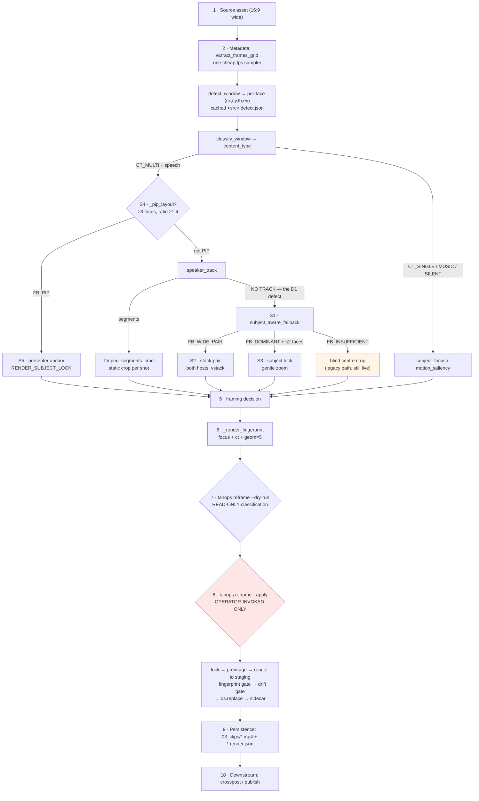
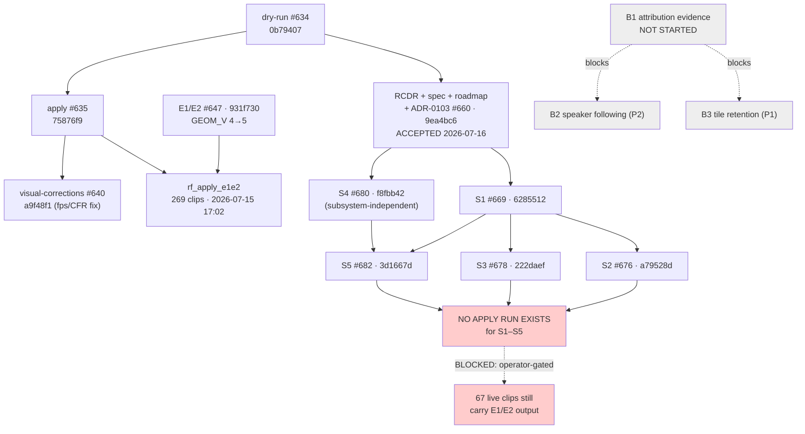
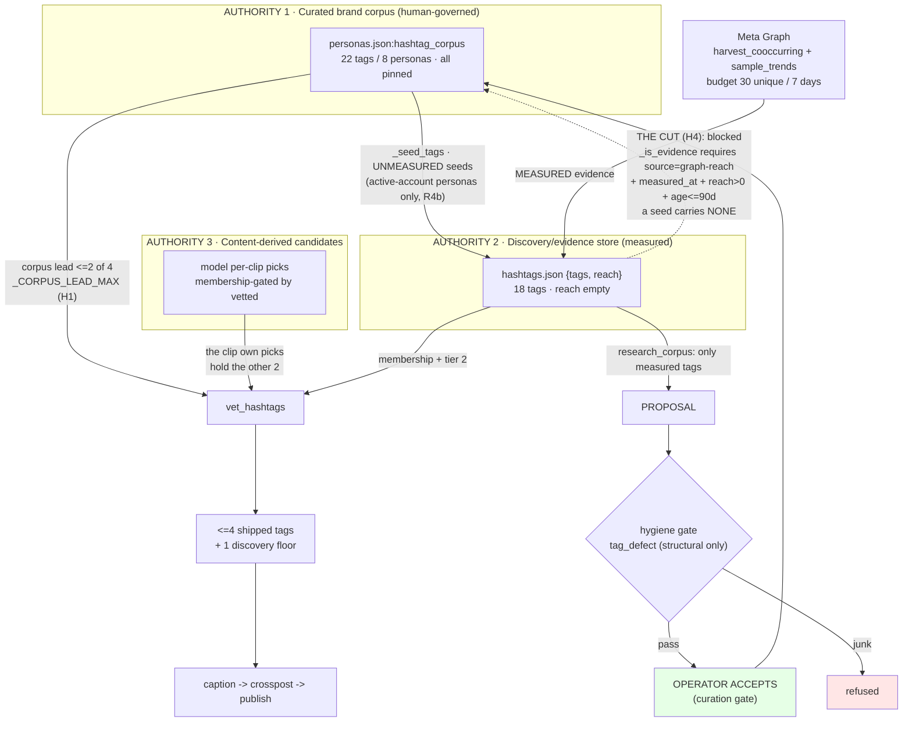
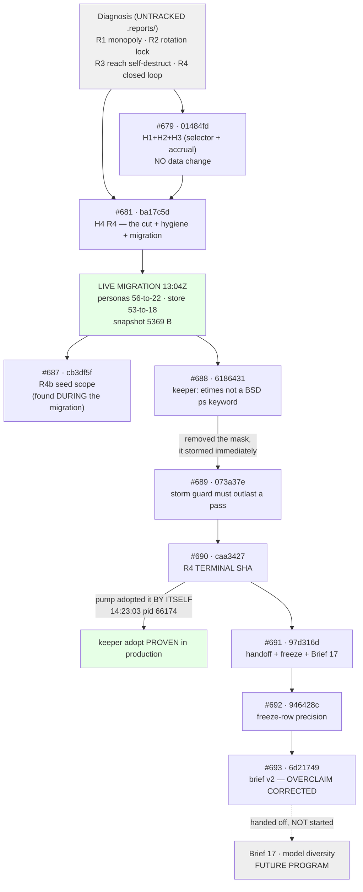

# 04 — Applied Programs Reconstruction

## 1. Document Control

| Field | Value |
|---|---|
| **Title** | Applied Programs Reconstruction — Smart Reframing & Hashtag Architecture |
| **Purpose** | Determine, from primary evidence, the actual lifecycle, architecture, implementation, validation, operational adoption, residual risk, and closeout state of the two major applied programs built on the FanOps engineering system. |
| **Status** | Complete — descriptive reconstruction. |
| **Observation timestamp** | 2026-07-16T18:23:35Z → 2026-07-16T18:45Z (host TZ UTC+4) |
| **Repository root** | `/Users/molhamhomsi/Moh Flow Fanops` |
| **Checkout branch** | `main` |
| **Checkout SHA** | `6d21749ffc49c77383f537d93b028cca0d69a447` |
| **`origin/main` SHA** | `6d21749ffc49c77383f537d93b028cca0d69a447` (identical — checkout is in sync, `git fetch` run at observation time) |
| **Working tree** | Clean except one untracked directory: `docs/constitution/` (operator's known work; unrelated to both programs) |
| **Live data root** | `/Users/molhamhomsi/FanOps/MohFlow-FanOps` (see §3.6 — this **differs** from the R4 record's stated root; RF/HT-affecting) |

### Scope

Two applied programs and their directly coupled operational adoption:

1. **Smart Reframing** — subject/layout-aware vertical reframe of wide sources.
2. **Hashtag Architecture and Remediation** — curated corpus vs. measured evidence store.

Plus shared operational infrastructure (daemon, keeper, scheduler, stores, providers, flags, CI) **only** where it determines whether either program is actually complete.

### Exclusions

Not assessed: publish/schedule lifecycle, Studio UI beyond the two programs' pages, CI governance program (ADRs 0100–0102), persona lever engine, insights culmination — except where they share infrastructure with the two programs.

### Evidence limitations

| # | Limitation | Consequence |
|---|---|---|
| L-1 | **Tests were never executed.** Project `CLAUDE.md` forbids local test runs (CI-only); the host has hard-crashed under test load (memory `host-crashes-under-stacked-sessions`). | Every "tested" claim rests on **test code inspection + CI status recorded in artifacts**, never on an observed local pass. Level-1/2 validation is therefore *asserted by code*, not *observed by this investigation*. |
| L-2 | **`.env` read denied** by the permission layer (contains secrets). | Runtime env values (`FANOPS_LIVE`, `FANOPS_SMART_FRAMING`, `FANOPS_HASHTAG_TRENDS`, …) as *actually set on the live host* are **unverified**. Code defaults are traced instead; live overrides are `UNKNOWN`. This is the single largest operational blind spot. |
| L-3 | **No `fanops` CLI verb was run.** Live verbs hit Postiz / Meta Graph and/or mutate stores. | Nothing was re-derived by execution; all runtime claims come from logs, on-disk state, and process inspection. |
| L-4 | **The hashtag root-cause diagnosis is untracked.** `.reports/hashtag-generic-identical-diagnosis-2026-07-16.md` is matched by `.gitignore:62` (`.reports/*`). | The diagnosis ADR-0104 cites could be read on this host but is **local-only** and unversioned; its content cannot be tied to a source revision. See `HT-CLM-014`. |
| L-5 | **Reframe counterfactual renders and contact sheets do not exist on disk.** `review/` is empty in every apply run; RCDR states its counterfactual renders "were produced to scratch … not committed". | The RCDR's visual audit is **attested in prose but not reproducible from surviving artifacts**. See `RF-CLM-011`. |
| L-6 | **CI results were not re-run.** PR check status is taken from committed records and `gh` metadata. | "CI success" claims are second-hand. |

### Independence statement

`docs/reconciliation/` **did not exist** at observation time (`ls: No such file or directory`); this document created it. No Prompt 01/02/03 output, and no other reconciliation report, exists in the repository or was supplied. The investigation was conducted entirely from primary evidence: source, tests, git history, PRs, branches, worktrees, ADRs, codemaps, design records, tracked evidence JSON, live control files, live daemon logs, and process/launchd state.

### Optional external reports received

**None.** See §35.

### Authority of this document

This document is **descriptive**. It authorizes no implementation, migration, re-render, promotion, daemon change, or operational action. It records what is, and what is proven.

---

## 2. Executive Applied-Program Reconstruction

> *Written last. Every conclusion cites claim IDs.*

**Both programs are well-engineered and well-governed. Each failed in a different direction, and neither failure is in the code.**

**Smart Reframing is code-complete and operationally unrealized.** All five Track A slices S1–S5 are merged to `main` (`RF-CLM-004`), and the live daemon runs that code. But the corrected framing **has never reached a single live clip**. The last live apply — `rf_apply_e1e2`, 269 clips, 1.28 GB replaced — ran **2026-07-15 17:02**, roughly ten hours *before* S1 merged, and carries the **E1/E2** generation of the framing code, not the ADR-0103 remediation (`RF-CLM-008`, `RF-CLM-009`). No apply run exists for S1–S5, and `reframe --apply` has no daemon, scheduler, or launchd caller — it is operator-invoked only, proven (`RF-CLM-015`). **Zero** render events appear in the last 20,000 daemon log lines (`RF-CLM-010`). The 67 clips the entire program exists to fix — 6 severe D1-A, 25 poor D1-B, 36 moderate D2 — are, as of this observation, **still carrying the output the RCDR condemned**. Reframe's blocker is therefore **one gated operator action** (apply against the S1–S5 code, then look at the result), not unfinished engineering.

**Its second gap is visual, and structural.** Reframe's success criterion is explicitly *visual correctness* — the spec states acceptance is "verified against rendered pixels … **not against fingerprint equality**." Yet no contact sheet, counterfactual render, or acceptance artifact survives anywhere on disk; `review/` is empty in every apply run (`RF-CLM-011`, L-5). Every S1–S5 fixture proves *geometry*, which the spec itself says is not the test. So even the merged work is **not visually validated**, independently of the rollout gap (`RF-CLM-012`).

**Hashtags executed everything Reframing did not — and this investigation still downgraded it.** The architecture (ADR-0104) is accepted, implemented, **executed against live data**, adopted by the running daemon, and frozen at terminal SHA `caa3427` (`HT-CLM-001`, `HT-CLM-003`, `HT-CLM-010`). Without relying on the program's own record, this investigation re-verified the migration's terminal state on disk **today** and found it **exact**: the curated corpora hold exactly **22 tags across 8 personas**, tag-for-tag identical to the frozen table; the store holds exactly **18 tags with `reach: {}`**; the rollback snapshot is intact at exactly **5369 bytes** (`HT-CLM-007`). Relevance is production-validated across 347 live posts — no off-catalogue tag, no malformed tag, curated identity on every line (`HT-CLM-008`).

**But three defects exist that no program record contains** (`HT-CLM-015`, `HT-CLM-016`), one of which this investigation verified line-by-line rather than accept on report: `apply_auto_corpus` **drops every new auto tag's provenance** because `_is_pinned` treats an absent entry as pinned, so auto tags land in the corpus and read back as **permanently pinned and un-prunable**. That is the mechanism which made the original pollution *permanent* — R4 cut the proposals, not this — and it is **unfixed**. Combined with `corpus_target = 12` against 3 posting personas (36 seeds > the 30-query Meta budget), the migrated 22-tag state **drifts off `CURATED` and the evidence loop re-starves once the budget rolls (~2026-07-19)**. This falsifies the R4 record's unqualified *"proven not to refill curated data"* — true, but scoped to a throttle-fresh, budget-exhausted window that expires (`C-4`).

**The downgrade is narrow and must not be over-read.** ADR-0104's decision is **not** reopened — the separation of authorities holds absolutely, and the store→corpus echo is impossible *by the data model*. The original pollution **cannot** return (`#taylorswift` and the Wu-Tang block carry no `graph-reach` evidence; hygiene refuses keysmash and engagement bait structurally). The shipped line stays protected by `_CORPUS_LEAD_MAX = 2` regardless of corpus size, and rollback remains viable. **The architecture is closed; the data freeze has an expiry date the program did not record.**

**Both programs' documentation is unusually honest, and that is a finding.** ADR-0104 visibly corrects its own prior overclaim rather than silently editing it — measuring a **~4 % structural floor** against an implied ~50 %, and discovering that **#679's own H2 rotation fix is inert on live data** (`HT-CLM-013`). The RCDR tiers every claim FACT/OBS/INF/HYP and refuses to promote them, leaving D1-B's ownership explicitly unresolved. The defects found in the records are narrow: the R4 record's live-root path conflates the plist's working directory with the data root (`SH-CLM-004`); ADR-0104 cites an **untracked, gitignored** diagnosis (`HT-CLM-014`); and Reframe's design set still tells readers implementation is "gated on approval" five merged slices later (`RF-CLM-013`).

**Shared infrastructure coupled the programs exactly once, and productively.** The R4 migration exposed two real daemon defects by *doing* rather than reading: #688 (`etimes` is not a BSD `ps` keyword, so the keeper could **never** adopt new code — the pump sat on a day-old SHA through 18 merges) and #689 (fixing #688 unmasked a storm guard timed against the keeper's own cadence, which stormed within minutes). Both are fixed and on `main`, and the keeper's self-adopt is now **proven in production** — this investigation observed the pump on `code=6d21749`, exactly `origin/main` HEAD (`SH-CLM-001`, `SH-CLM-002`). **Hashtags' migration repaired the delivery mechanism Reframing's rollout will depend on.**

**Verdict.** **One closed, one incomplete.** **Smart Reframing: `CODE COMPLETE, OPERATIONAL ADOPTION INCOMPLETE`.** **Hashtags: `FROZEN WITH BOUNDED RESIDUALS`.** Counts: **2 blockers** (both Reframing; one operator action addresses both), **6 bounded residuals** (3 per program — the Hashtag three are newly found here and time-bombed to ~2026-07-19), **8 accepted residuals**, **4 future-work items**, **4 operator-only decisions**, **6 disputed findings** (§32, §34.4).

---

## 3. Observation Frame

### 3.1 `origin/main`

| Field | Value | Evidence |
|---|---|---|
| SHA | `6d21749ffc49c77383f537d93b028cca0d69a447` | `git rev-parse origin/main` |
| Subject | `docs(hashtags): rebuild the diversity brief on measured data; correct an overclaimed residual (Unit: hashtag-diversity-brief-v2) (#693)` | `git log -1` |
| Fetched | 2026-07-16T18:23Z (this session) | `git fetch origin` |
| Relationship to checkout | **Identical** | `git rev-parse HEAD` == `git rev-parse origin/main` |

### 3.2 Current checkout

| Field | Value |
|---|---|
| Branch | `main` |
| SHA | `6d21749` (in sync with origin) |
| Working tree | `?? docs/constitution/` — untracked, **only** deviation |
| Program relevance | `docs/constitution/` is **superseded draft work** unrelated to both programs (memory `constitutional-layer-built`: the live layer is `REPOSITORY_CONSTITUTION.md` + `ARCHITECTURAL_LAWS.md` + `docs/governance/`; the draft never landed). **No bearing on either program's completion.** |

### 3.3 Open branches and pull requests

| Field | Value | Evidence |
|---|---|---|
| **Open PRs** | **ZERO** | `gh pr list --state open --limit 60` → empty |
| Consequence | **No program work is sitting in an open PR.** Every program artifact is either merged to `main` or exists only on a local branch/worktree. This materially simplifies the merge-state question: `IMPLEMENTED-PR` is an empty category for both programs. |

Local branches carrying program-named work (full unmerged analysis in §12 / §23):

| Branch | Worktree | Program | Status |
|---|---|---|---|
| `feat/reframe-apply` | `/Users/molhamhomsi/fanops-reframe-apply` | RF | Content on main (`75876f9`, #635) |
| `feat/reframe-dryrun` | `/Users/molhamhomsi/fanops-reframe-dryrun` | RF | Content on main (`0b79407`, #634) |
| *(detached)* | `/Users/molhamhomsi/fanops-reframe-migrate` | RF | Detached @ `0a3b503` — on main |
| `fix/reframe-visual-corrections` | — | RF | Content on main (`a9f48f1`, #640) |
| `feat/hashtag-corpus-governance` | — | HT | Content on main (`ba17c5d`, #681) |
| `feat/hashtag-selection-fixes` | — | HT | Remote gone |
| `fix/dormant-persona-genre-seeds` | — | HT | Content on main (`cb3df5f`, #687) |
| `cursor/hashtag-system-page-3bca` | `/Users/molhamhomsi/fanops-u11-hashtags` | HT (Studio U11) | Content on main (`037e840`, #614) |

### 3.4 Local-only and worktree state

**25 worktrees** are registered (`git worktree list`). Three are reframe-specific, one is hashtag-specific. Squash-merge is this repo's merge strategy (ADR-0102), so a branch legitimately reads "ahead" while its *content* is on `main` — commit counts are not merge evidence here; content is (see §12, §23).

### 3.5 Generated evidence

| Artifact | Location | State |
|---|---|---|
| Reframe defect map | `docs/design/reframe/evidence/defect-map.json` | **TRACKED** |
| Reframe framing metrics | `docs/design/reframe/evidence/framing-metrics.json` | **TRACKED** |
| Reframe raw detections | `docs/design/reframe/evidence/raw-detections.json` | **TRACKED** |
| Hashtag root-cause diagnosis | `.reports/hashtag-generic-identical-diagnosis-2026-07-16.md` | **UNTRACKED** — ignored by `.gitignore:62` (`.reports/*`); present on disk (18,113 bytes) |
| Architecture KB | `.reports/architecture/**` | **TRACKED** (98 files; re-included by `.gitignore:73`) |
| Reframe apply/pilot runs | `<live>/07_reports/reframe/{rf_pilot_74de7,rf_pilot_a,rf_apply_e1e2}` | **RUNTIME, untracked, local-only** |

**Asymmetry (material):** Reframing's root-cause evidence is versioned and survives machine loss. Hashtags' root-cause diagnosis is not (`HT-CLM-014`, `SH-CLM-005`).

### 3.6 Runtime and operational evidence

| Field | Observed | Evidence |
|---|---|---|
| **`com.fanops.run`** | **PID 9121**, running | `launchctl list` → `9121 -15 com.fanops.run` |
| **`com.fanops.keeper`** | Loaded, **not currently executing** (`-` PID, exit 0) | `launchctl list` → `- 0 com.fanops.keeper` |
| **`com.fanops.studio`** | PID 9123, running | `launchctl list` |
| Daemon command | `fanops run --loop --interval 600` | `ps aux` |
| **Daemon running code** | **`code=6d21749…`** — *equals `origin/main` HEAD* | `run.log` heartbeat @ `2026-07-16T18:30:13Z` |
| Daemon version | `fanops_version: 0.4.0` | heartbeat |
| plist `WorkingDirectory` | `/Users/molhamhomsi/FanOps` | `plutil -p ~/Library/LaunchAgents/com.fanops.run.plist` |
| **Actual data root** | **`/Users/molhamhomsi/FanOps/MohFlow-FanOps`** — `00_control/` is **not** at the plist path | `ls /Users/molhamhomsi/FanOps/00_control` → *No such file or directory*; `ls /Users/molhamhomsi/FanOps/MohFlow-FanOps/00_control` → 43 entries |
| Daemon tick behaviour | `corpora_refresh_skipped reason=fresh` + `heartbeat ok`, every ~600 s | `run.log` tail |
| **Render activity** | **ZERO** render/reframe lines in the last 20,000 `run.log` lines | `tail -20000 run.log \| grep -icE "render\|reframe\|recut"` → `0` |
| Host load @ observation | `load averages: 16.19 10.06 6.93`; memory free 40% | `uptime`, `memory_pressure` |

### 3.7 Inaccessible evidence

| Source | Why inaccessible | Program claims affected |
|---|---|---|
| `/Users/molhamhomsi/FanOps/.env` | **Permission denied** by the harness (secrets) | All live env-gate values: `RF-CLM-006` (is `FANOPS_SMART_FRAMING` on live?), `HT-CLM-009` (`FANOPS_HASHTAG_TRENDS`), `FANOPS_LIVE`, `FANOPS_RESPONDER`. Classified **UNVERIFIED**, not "inactive" (§9 rule). |
| Local test execution | Forbidden (L-1) | Every Level-1/2 claim in §10 and §20 |
| Meta Graph API | Live verb; not run (L-3) | `HT-CLM-008` (reach measurement) |
| CI re-run | Not run (L-6) | "tests passing" rows in §13, §24 |
| Counterfactual renders / contact sheets | **Do not exist** (L-5) | `RF-CLM-011`, `RF-CLM-012` |
| Pre-#679 hashtag store contents | **Destroyed** before observation (ADR-0104 residual 4) | `HT-CLM-011` |

---

## 4. Applied-Program Artifact Inventory

### 4.1 Smart Reframing

| ID | Type | Path / source | Rev | Purpose | Authority | Lifecycle | Relevance |
|---|---|---|---|---|---|---|---|
| AP-DOC-001 | Design set index | `docs/design/reframe/README.md` | `9ea4bc6` | Entry point to the reframe design set | Supporting | Current | **Partially stale** — says "implementation is gated on approval of the roadmap + ADR-0103"; ADR-0103 was accepted and S1–S5 shipped (§7 conflict C-1) |
| AP-DOC-002 | Root Cause Decision Record | `docs/design/reframe/RCDR-centered-multi-untracked.md` | `9ea4bc6` | *What is wrong* — 67 clips, D1-A/D1-B/D2, evidence-tiered | **Canonical** (defect definition) | Current, investigation **closed** | Authoritative |
| AP-DOC-003 | Framing Specification | `docs/design/reframe/framing-spec.md` | `9ea4bc6` | Binding rules **F1–F6**; open product decisions **P1–P2**; acceptance criteria per defect class | **Canonical** (correctness) | Current | Authoritative; **P1/P2 still OPEN** |
| AP-DOC-004 | Remediation Roadmap | `docs/design/reframe/remediation-roadmap.md` | `9ea4bc6` | Slices S1–S6, Track A/B, rollout, rollback, blast radius, accepted residuals AR-1…AR-4 | **Canonical** (plan) | Current | Authoritative |
| AP-ADR-001 | ADR | `docs/adr/0103-reframe-subject-and-layout-aware-framing.md` | `9ea4bc6` | Subject-aware + layout-aware framing principle | **Canonical** (architecture) | **Accepted 2026-07-16** | Authoritative |
| AP-GEN-001 | Evidence | `docs/design/reframe/evidence/defect-map.json` | `9ea4bc6` | Per-clip D1-A/D1-B/D2 assignment | Canonical evidence | Current, **tracked** | Authoritative |
| AP-GEN-002 | Evidence | `docs/design/reframe/evidence/framing-metrics.json` | `9ea4bc6` | Full-box framing metrics | Canonical evidence | Current, **tracked** | Authoritative |
| AP-GEN-003 | Evidence | `docs/design/reframe/evidence/raw-detections.json` | `9ea4bc6` | Per-frame YuNet output | Canonical evidence | Current, **tracked** | Authoritative |
| AP-CODE-001 | Implementation | `src/fanops/framing.py` (1227 L) | `6d21749` | Detection, classification, tracking, focus, S1–S5 composition | Implementation | Active | Core |
| AP-CODE-002 | Implementation | `src/fanops/reframe.py` (578 L) | `6d21749` | `fanops reframe --dry-run` — outcome/reason classification | Implementation | CLI | Core |
| AP-CODE-003 | Implementation | `src/fanops/reframe_apply.py` (944 L) | `6d21749` | `fanops reframe --apply` — mutation phase, lock, preimage, rollback | Implementation | CLI, operator-invoked | Core |
| AP-CODE-004 | Implementation | `src/fanops/framing_outcomes.py` (290 L) | `6d21749` | Outcome taxonomy (`centered_multi_untracked`, …) | Implementation | Active | Core |
| AP-CODE-005 | Codemap | `docs/CODEMAPS/subsystem-traces/C3_clip_production_framing.md` | `6d21749` | Subsystem trace C3 | Supporting | Current | Reference |
| AP-TEST-001…009 | Tests | `tests/test_smart_framing.py`, `test_reframe.py`, `test_reframe_apply.py`, `test_reframe_fallback_primitive.py`, `test_reframe_s2_d1a.py`, `test_reframe_s3_d1b.py`, `test_reframe_s4_d2.py`, `test_reframe_s5_d2.py`, `test_framing_outcomes.py` | `6d21749` | Slice fixtures (S6) | Validation | Current | **Level 1 only** (§10) |
| AP-OPS-001 | Apply run | `<live>/07_reports/reframe/rf_apply_e1e2/` | runtime | 278 planned, **269 MIGRATED**, 7 unchanged, 2 diverged; 1.28 GB replaced | **Operational** | **Executed 2026-07-15 17:02** | **Pre-S1–S5** |
| AP-OPS-002 | Pilot run | `<live>/07_reports/reframe/rf_pilot_a/` | runtime | 48 planned, 25 attempted, **20 MIGRATED, 5 VALIDATION_FAILED** (fps) | Operational | Executed 2026-07-15 02:11 | Pre-S1–S5 |
| AP-OPS-003 | Aborted pilot | `<live>/07_reports/reframe/rf_pilot_74de7/` | runtime | **Empty** — `backups/`, `review/`, `staging/` created; no plan/summary/journal | Operational | 2026-07-15 01:03 | No-op |
| AP-BRANCH-001 | Worktrees | `fanops-reframe-{apply,dryrun,migrate}` | local | Slice development trees | Historical | Content on main | No unmerged program work |

### 4.2 Hashtags

| ID | Type | Path / source | Rev | Purpose | Authority | Lifecycle | Relevance |
|---|---|---|---|---|---|---|---|
| AP-ADR-002 | ADR | `docs/adr/0104-hashtag-curation-and-evidence-separation.md` | `6d21749` | Curated corpus vs. evidence store as separate authorities; the structural cut | **Canonical** (architecture) | **Accepted 2026-07-16** | Authoritative |
| AP-DOC-005 | Migration record | `docs/CODEMAPS/r4-migration-record.md` | `946428c` | Operational half: what ran, what changed on disk, how to undo | **Canonical** (operations) | **Frozen 2026-07-16**, terminal `caa3427` | Authoritative; one path imprecision (§16 C-3) |
| AP-DOC-006 | Codemap | `docs/CODEMAPS/hashtag-lifecycle.md` | `6d21749` | Lifecycle map | Supporting | Current | Reference |
| AP-DOC-007 | Codemap | `docs/CODEMAPS/subsystem-traces/C5_caption_hooks_hashtags.md` | `6d21749` | Subsystem trace C5 | Supporting | Current | Reference |
| AP-DOC-008 | **Brief** | `docs/design/briefs/17-hashtag-model-diversity.md` | `6d21749` (rebuilt by #693) | Model-diversity program — **brief only, deliberately not started** | Future program | **PROPOSED** | **Out of R4 scope** (§22) |
| AP-DOC-009 | Skill doc | `.claude/skills/fanops-hook-hashtag/SKILL.md` | `6d21749` | Hook/hashtag authoring guidance | Supporting | Current | Reference |
| AP-CODE-006 | Implementation | `src/fanops/hashtags.py` (432 L) | `6d21749` | `vet_hashtags`, selection, floors | Implementation | Active | Core |
| AP-CODE-007 | Implementation | `src/fanops/fanops_hashtags.py` (199 L) | `6d21749` | `_seed_tags`, `refresh_store`, `refresh_store_if_due` | Implementation | Active/daemon | Core |
| AP-CODE-008 | Implementation | `src/fanops/hashtag_migrate.py` (229 L) | `6d21749` | R4 migration: snapshot → converge → idempotent | Implementation | **Migration-only** | Core |
| AP-CODE-009 | Implementation | `src/fanops/hashtag_hygiene.py` (89 L) | `6d21749` | `tag_defect`, `screen_corpus` — structural gates | Implementation | Active | Core |
| AP-CODE-010 | Studio | `src/fanops/studio/{hashtags.py,views_hashtags.py,app_routes_hashtags.py}` + templates | `6d21749` | Personas/hashtag observatory pages | Implementation | Active (UI) | Supporting |
| AP-DATA-001 | **Live corpus** | `<live>/00_control/personas.json` | runtime | **22 tags / 8 personas**, all pinned, `reach: null` | **Operational truth** | **MIGRATED, verified 2026-07-16** | **Matches frozen record exactly** |
| AP-DATA-002 | **Live store** | `<live>/00_control/hashtags.json` | runtime | **18 tags, `reach: {}`** | **Operational truth** | **MIGRATED, verified** | **Matches frozen record exactly** |
| AP-DATA-003 | **Rollback snapshot** | `<live>/00_control/personas.json.r4-bak-20260716T130424Z` | runtime | **5369 bytes**, intact | Operational | **Present & verified** | Rollback viable |
| AP-DATA-004 | Budget | `<live>/00_control/hashtag_budget.json` | runtime | 2666 bytes, mtime **2026-07-12** — unchanged by R4 | Operational | Current | Confirms "rebuild spent no budget" |
| AP-GEN-004 | **Diagnosis** | `.reports/hashtag-generic-identical-diagnosis-2026-07-16.md` | **untracked** | Root-cause diagnosis cited by ADR-0104 | Canonical *by citation* | **LOCAL-ONLY** | **`HT-CLM-014` — provenance defect** |
| AP-TEST-010…020 | Tests | `tests/test_hashtag_{hygiene,migrate,corpus_governance,lifecycle_e2e,attribution_severance,clip_signal,rotation,seed_scope,page}.py`, `test_{auto_corpus,corpus_discovery,corpus_research,persona_corpus,fanops_hashtags,hashtags,content_aware_hashtags}.py`, `test_daemon_keeper.py` | `6d21749` | Contract, store, migration, keeper | Validation | Current | §20 |

### 4.3 Shared operational infrastructure

| ID | Type | Path / source | Purpose | Used by | State |
|---|---|---|---|---|---|
| AP-OPS-004 | Daemon (pump) | `com.fanops.run` / `fanops run --loop --interval 600` | Pipeline tick | **Both** | **PID 9121, live on `code=6d21749`** |
| AP-OPS-005 | Keeper | `com.fanops.keeper` | Adopts new code into the running pump | **Both** | Loaded; adopt **proven in production** (`SH-CLM-002`) |
| AP-OPS-006 | Studio | `com.fanops.studio` | Operator cockpit | Both (UI) | PID 9123 |
| AP-OPS-007 | Control files | `<live>/00_control/*.json` + `.lock` | Durable state | Both | Live |
| AP-CI-001 | CI lanes | `.github/workflows/**` | unit / e2e / architecture | Both | Recorded `success` at R4 freeze |
| AP-COMMIT-001 | Daemon fix | `6186431` (#688) | `etimes` is not a BSD `ps` keyword → keeper could never adopt | **Both** | On main |
| AP-COMMIT-002 | Daemon fix | `073a37e` (#689) | Storm guard must outlast a pass | **Both** | On main |

---

# Part I — Smart Reframing

---

## 5. Smart Reframing Problem Definition

### 5.1 Problem register

| Field | Content | Evidence |
|---|---|---|
| **Original problem** | A wide (16:9) source whose salient human subject is **not near the horizontal centre** is reframed to 9:16 using a **content-blind fixed centre region** that ignores where the subject actually is. | AP-DOC-002 Q1 |
| **Affected outputs** | **67 clips** across 5 of 7 sources = **19.3 %** of the 347 dry-run-classified clips. Split: **D1-A 6** (1.7 %, severe) · **D1-B 25** (7.2 %, poor) · **D2 36** (10.4 %, moderate). | AP-DOC-002 Q2 |
| **User/operational consequence** | D1-A: empty table, mics, **no human** for the whole clip — the clip has no subject. D1-B: the speaking host jammed against the frame edge / half-hidden behind the pop-filter. D2: presenter off-centre with a large dead patterned-wall region. | AP-DOC-002 Q3 |
| **Technical root cause** | The **fallback-composition** subsystem is the shared failing link: a fixed region rather than one derived from known subject positions. Contributing: **tracking** returns no track on real two-person footage (D1); **classification/treatment-routing** maps a PIP grid to live multi-speaker (D2). **Detection and rendering are sound.** | AP-DOC-002 Q4, AP-ADR-001 Context |
| **Evidence used** | All 67 clips → 27 distinct visual scenes, **every scene visually audited**; machine-readable `defect-map.json`, `framing-metrics.json`, `raw-detections.json`; counterfactual renders (27 sheets, begin/mid/end × 3 strategies) **produced to scratch, not committed**. | AP-DOC-002 Provenance; AP-GEN-001…003 |
| **Success criteria** | Spec **F1–F6** + per-defect acceptance criteria **AC-A1…A3, AC-B1…B3, AC-D1…D4**, each "verified against rendered pixels + detector evidence, **not against fingerprint equality**". | AP-DOC-003 |
| **Non-goals** | No crop geometry, thresholds, composition style, detection tuning, fingerprint or version changes specified in the spec; the ~280 non-affected clips out of scope. | AP-DOC-003 §Non-goals |
| **Deferred future work** | **Track B** (B1 speaker-attribution evidence → B2 D1 speaker following, B3 D2 tile retention); product decisions **P1** (tile retention) and **P2** (speaker following) — both audio-gated, both **OPEN**. | AP-DOC-004, AP-DOC-003 |

### 5.2 Revisions to diagnosis (the program corrected itself twice)

| Revision | Evidence |
|---|---|
| **Per-frame → static.** `fe66eca` (#228) shipped a per-frame OpenCV auto-reframe ("constant face size, smooth pan"). `1b7baae` (#229), **the same day**, replaced it: "static locked-off crop per shot — kill the per-frame jitter". A per-frame chase tracked every detection wobble; the static-per-shot crop is jitter-free *by construction*. | AP-COMMIT; project `CLAUDE.md` |
| **"Largest face" rejected on evidence.** The obvious fallback — lock the biggest face — **mislocks onto a remote tile** whenever the presenter is small. Recorded as a rejected alternative rather than discovered later. | AP-DOC-002 D2 [OBS]; AP-ADR-001 Alternatives |
| **Ownership left unresolved where evidence ran out.** D1-B's owning subsystem is recorded **Low confidence**, "genuinely split between tracking and fallback; unresolved until audio" — not forced to a verdict. | AP-DOC-002 Q5 |

### 5.3 Validation of the problem statement

- **Observed defect is separated from chosen solution.** The RCDR states the defect "independent of the implementation" (Q1) before naming any subsystem (Q4).
- **Evidence tiers are load-bearing and honoured.** `[FACT]` / `[OBS]` / `[INF]` / `[HYP]` are defined once and never promoted. "The tracker's null is a capability shortfall … **not proven**" stays `[INF]`.
- **Unsupported root-cause claims:** none found. The one claim that could have been overstated — that detection is at fault — is explicitly held at "**not the primary demonstrated fault** … its reliability … remains unquantified" (Medium–High).
- **The corpus rate is declared a lower bound** (`[HYP]`, ~280 clips unaudited), not a measurement.

`RF-CLM-001` · **Confirmed** · High.

---

## 6. Smart Reframing Designed Architecture

### 6.1 Architecture component register

| Component | Responsibility | Defining artifact | Contract | Input → Output | Implementation | Tests | Operational use | Status |
|---|---|---|---|---|---|---|---|---|
| **Detection** | Per-face `(cx,cy,fh,ey)` via vendored YuNet, one cheap grid pass | AP-DOC-002 | cached `<src>.detect.json` | frames → detections | `framing.detect_window` (`framing.py:866`) | `test_smart_framing.py`, `test_keyframes.py` | **active-in-render** | `MERGED` + active |
| **Classification** | Route window → `multi-speaker-talk` / `single-speaker-talk` / `music` / `silent` / `no-people` | AP-DOC-002 | — | detections + speech → `content_type` | `framing.classify_window` (`framing.py:867`) | `test_smart_framing.py` | **active-in-render** | `MERGED` + active |
| **Active-speaker track** | Mouth-motion segments `(t0,t1,fx,fy,fh,ey)` | AP-DOC-002 | — | window → segments \| **None** | `framing.speaker_track` (`framing.py:938`) | `test_smart_framing.py` | active (CT_MULTI, **non-PIP only** post-S4) | `MERGED`; **returns no track on the D1 corpus** (the proven defect) |
| **S1 — subject-aware fallback primitive** | Derive composition from detected subject positions | AP-DOC-004 S1; F5 | `FallbackComposition` (`framing.py:1084-1112`); kinds `FB_WIDE_PAIR`/`FB_DOMINANT`/`FB_PIP`/`FB_INSUFFICIENT` | stats → composition | `framing.subject_aware_fallback` (`framing.py:1173-1227`), called `:909`, `:960` | `test_reframe_fallback_primitive.py` | **active-in-render** | `MERGED` + active; **`x_min`/`x_max`/`is_actionable` unused (D-5)** |
| **S2 — D1-A stack-pair** | Retain **both** persistent subjects, widest crop | AP-DOC-004 S2; F1,F5,F6 | 10-float focus; `RENDER_STACK_PAIR` | `FB_WIDE_PAIR` → vstack halves | `framing.py:952-964`; render `clip.render_reframed:644-654` → `ffmpeg_stack_cmd` | `test_reframe_s2_d1a.py` | **active-in-render** | `MERGED` + active |
| **S3 — D1-B subject lock** | Dominant not edge-pinned/occluded, mild zoom | AP-DOC-004 S3; F2,F5,F6 | 5-float focus; `RENDER_SUBJECT_LOCK`; `_LOCK_MAX_FACES=2` | `FB_DOMINANT` → anchored crop | `framing.py:965-979`; `reframe_filter:360` `_GENTLE_ZOOM_MAX` | `test_reframe_s3_d1b.py` | **active-in-render** | `MERGED` + active |
| **S4 — PIP routing** | A presenter-dominant PIP grid must not enter active-speaker treatment | AP-DOC-004 S4; F4 | `_PIP_MIN_FACES=3`, `_PIP_SIZE_RATIO=1.4`; presenter by **height, never score** | layout → `FB_PIP` | `framing._pip_layout` (`framing.py:1145-1171`); routing `framing.py:909` **precedes** `speaker_track` | `test_reframe_s4_d2.py` | **active-in-render** | `MERGED` + active |
| **S5 — PIP composition** | Frame the presenter, not the wall | AP-DOC-004 S5; F3,F2 | reuses `RENDER_SUBJECT_LOCK` | `FB_PIP` → presenter anchor | `framing.py:929-936` | `test_reframe_s5_d2.py` | **active-in-render** | `MERGED` + active; legacy 4-tuple stays centred |
| **S6 — regression fixtures** | Fail on content-blind behaviour, pass under F-rules | AP-DOC-004 S6 | CI-only | — | `test_reframe_s{2,3,4,5}_*.py` | — | CI | `MERGED` (landed per slice) |
| **Fingerprint** | Content-address the render | AP-DOC-004 blast radius | `_REFRAME_GEOM_V = 5` (`clip.py:766`); payload `clip.py:786-794` | inputs → sha256 | `clip._render_fingerprint_payload` | `test_reframe_s5_d2.py:163,167` | **active** | `MERGED`; **not bumped by S1–S5** — the *population* changes instead |
| **Dry run** | Make the REASON a clip was centred first-class | #634 | outcome taxonomy | clips → classification | `reframe.py` (578 L) | `test_reframe.py` | **CLI-only** | `MERGED`; **D-1 attribution defect** |
| **Apply** | The mutation phase — lock, preimage, rollback | #635 | 2 declared writes; `APPROVED_FRAMING_KEYS` | plan → migrated clips | `reframe_apply.py` (944 L) | `test_reframe_apply.py` | **CLI-only, operator-invoked (proven)** | `MERGED`; **executed pre-S1–S5 only** |
| **Migration guard** | The daemon must not render into a live migration | #635 | raises `MigrationLockHeld`, **no fail-open** | — | `reframe_apply.assert_render_allowed` ← `clip._refuse_if_migrating` (`clip.py:887,903,1099`) | `test_framing_stage_lock.py` | **active-in-render** | `MERGED` + active |
| **Kill switch** | Global rollback to blind centre, byte-identical | AP-DOC-004 Rollback | `FANOPS_SMART_FRAMING=0` | — | `config.py:611-612` | `test_framing_cv2_required.py` | **default ON** | `MERGED`; **live value UNVERIFIED (L-2)** |
| **cv2 prerequisite** | Refuse rather than silently centre | `docs/design/cv2-decision-record-v4.md` | raises `ToolchainMissingError` → exit 2 | — | `framing._framing_runtime_or_raise` (`framing.py:67-104`) | `test_framing_cv2_required.py` | active | `MERGED` |
| **Track B — B1/B2/B3** | Speaker attribution → following / tile retention | AP-DOC-004 Track B | — | — | **NONE** | **NONE** | **NONE** | **`NOT-STARTED`** (§8.4) |

### 6.2 Designed flow



**Tabular equivalent (Mermaid parity):**

| # | Stage | Mechanism | Side effect | Failure behaviour |
|---|---|---|---|---|
| 1 | Source asset | `02_sources/` | none | — |
| 2 | Metadata extraction | `keyframes.extract_frames_grid` | scratch frames | fail-open → centred |
| 3 | Target requirement | `_TARGETS` aspect (9:16) | none | — |
| 4 | Subject/crop evidence | `detect_window` (YuNet) | `<src>.detect.json` cache | **cv2 absent + smart_framing ON → REFUSE (exit 2)** |
| 5 | Framing decision | `classify_window` → S4/track/S1→S2/S3/S5 | none (pure) | fail-open → centred at every step |
| 6 | Plan generation | `_render_fingerprint` | none | — |
| 7 | Dry-run representation | `reframe.run_dry_run` | scratch + manifest | read-only |
| 8 | Apply / rendering | `reframe_apply.apply_run` | **lock + backups + staging** | preimage/fingerprint/drift gates → skip; `AMBIGUOUS` → stop run |
| 9 | Persistence | `os.replace` mp4 + atomic sidecar | **2 declared writes only** | undeclared write → `clean:false` → exit 1 |
| 10 | Downstream use | crosspost/publish | — | — |

---

## 7. Smart Reframing ADR, Contract, Shape, and Codemap Register

| Artifact | Purpose | Authority | Source rev | Implementation linkage | Validation linkage | Current accuracy | Conflicts / supersession |
|---|---|---|---|---|---|---|---|
| **ADR-0103** | Subject-aware + layout-aware framing principle | **Canonical architecture**; `status: accepted`, `accepted: 2026-07-16` | `9ea4bc6` | S1–S5 authorized under it | Track A on visual evidence; Track B deferred | **Accurate** | None. Explicitly supersedes an *implicit, unrecorded* design |
| **`framing-spec.md`** | F1–F6 binding; P1–P2 escalated; AC per defect | **Canonical correctness** | `9ea4bc6` | F5→S1, F1→S2, F2→S3, F4→S4, F3→S5, F6→zoom caps | AC-A/B/D | **Accurate**; **P1, P2 remain OPEN** | AC-D4 gated on P1 → S5 scoped to "preserve tiles" interim |
| **`remediation-roadmap.md`** | Slices, tracks, rollout, rollback, blast radius, AR-1…AR-4 | **Canonical plan** | `9ea4bc6` | S1→{S2,S3,S4}→S5; S6 per slice | Per-slice AC | **Accurate on slices**; **rollout section unrealized** (§11) | "Re-render … not to be performed until the roadmap is approved and each slice is independently verified" — **still true, still not performed** |
| **`RCDR-centered-multi-untracked.md`** | Defect definition, evidence-tiered | **Canonical defect** | `9ea4bc6` | — | 27 scenes audited | **Accurate** | Counterfactual renders **not committed** (L-5) |
| **`README.md`** (design set) | Index | Supporting | `9ea4bc6` | — | — | **PARTIALLY STALE** | **C-1** below |
| **`evidence/*.json`** ×3 | Machine-readable defect/metric/detection evidence | Canonical evidence | `9ea4bc6` | — | — | Accurate, **tracked** | — |
| **C3 subsystem trace** | `docs/CODEMAPS/subsystem-traces/C3_clip_production_framing.md` | Supporting | `6d21749` | framing.py/clip.py | — | Referenced by ADR-0103 | — |
| **`cv2-decision-record-v4.md`** | cv2 is REQUIRED once smart_framing is on | Supporting | `6d21749` | `_framing_runtime_or_raise` | `test_framing_cv2_required.py` | Accurate | — |
| *(deleted)* E1/E2 implementation contract | Scaffolding doc | — | removed by `0a3b503` (#652) | — | — | **Removed from tree** | Deliberate scaffolding removal |

**Conflict C-1 (documentation drift, non-blocking).** `docs/design/reframe/README.md:3-5` states: *"Investigation is closed; **implementation is gated on approval of the roadmap + ADR-0103**."* ADR-0103 was **accepted 2026-07-16** and S1–S5 shipped the same day. The README's gate is satisfied but its prose still reads as pending. Classification: **documentation debt**, not a blocker. `RF-CLM-013`.

---

## 8. Smart Reframing Implementation Decomposition

### 8.1 The label question, tested — three distinct eras, not one sequence

The prompt requires testing whether S1–S5 existed and what they meant. They exist, and they are **the third of three eras**. Naming was not assumed:

| Era | Label | Dates | What it was |
|---|---|---|---|
| **1** | **T1–T7** | 2026-06-28 | The **original build** of the dynamic reframer (grid sampler → detect → classify → track → zoom/eyeline → render wiring → docs). Ended in a same-day **reversal**: per-frame (`fe66eca` #228) → static locked-off (`1b7baae` #229). |
| **2** | **E1/E2** | 2026-07-15 | Geometry safe-area + multi-person classification **recall** (`931f730` #647). Bumped `_REFRAME_GEOM_V` 4→5. Its scaffolding contract doc was deleted (`0a3b503` #652). **This is the generation the live corpus carries.** |
| **3** | **S1–S5** | 2026-07-16 | The **ADR-0103 Track A remediation** — the subject-aware/layout-aware slices. |

Separately, `--dry-run` (#634) and `--apply` (#635) are **tooling**, not slices: they were built *before* the RCDR to make the defect measurable and the correction reversible.

### 8.2 Implementation-slice register

| Slice | Objective | Deps | Files | Contracts | Tests | PR | Commit | Merge state | Survival | Validation | Residual |
|---|---|---|---|---|---|---|---|---|---|---|---|
| **T1–T7** | Original dynamic reframer | — | `keyframes.py`, `framing.py`, `clip.py` | `detect.json`, `_REFRAME_GEOM_V=1..4` | `test_smart_framing.py`, `test_keyframes.py` | #206, #227, #228, #229, #230 | `4277d19`→`77a043d`, `fe66eca`, `1b7baae` | **ON-MAIN** | **Partial** — `_render_perframe` **removed** (#229) | Visual (jitter) | — |
| **dry-run** | Make the REASON a clip was centred first-class | — | `reframe.py`, `framing_outcomes.py` | outcome taxonomy | `test_reframe.py`, `test_framing_outcomes.py` | **#634** | `0b79407` | **ON-MAIN** 2026-07-14T22:42 | Present | Produced the 347-clip classification | **D-1** (attribution line-range rot) |
| **apply** | Mutation phase: lock, preimage, rollback | dry-run | `reframe_apply.py`, `clip.py` guard | 2 declared writes; `APPROVED_FRAMING_KEYS` | `test_reframe_apply.py`, `test_framing_stage_lock.py` | **#635** | `75876f9` | **ON-MAIN** 2026-07-15T00:57 | Present | **Executed** ×2 (§11) | Operator-only |
| **visual-corrections** | Atomic sidecar heal, **concat CFR**, structural-eligibility wording | apply | `reframe.py`, `clip.py` | fingerprint-**neutral** | `test_reframe.py` | **#640** | `a9f48f1` | **ON-MAIN** | Present | Fixed the fps failures `rf_pilot_a` found | — |
| **RC-10** | mkdtemp scratch dirs cleaned, not leaked | — | `compress.py`, `reframe.py` | — | — | **#649** | `a1e550d` | **ON-MAIN** | Present | — | — |
| **E1/E2** | Geometry safe-area + multi-person classification recall | — | `framing.py`, `clip.py` | **`_REFRAME_GEOM_V` 4→5** | `test_smart_framing.py` | **#647** | `931f730` | **ON-MAIN** 2026-07-15T13:51 | Present | **`rf_apply_e1e2` — 269 clips** | — |
| *(scaffold removal)* | Remove E1/E2 implementation-contract doc | E1/E2 | `docs/` | — | — | **#652** | `0a3b503` | **ON-MAIN** | Removed | — | — |
| **RCDR/ADR** | Evidence package + architecture | dry-run data | `docs/design/reframe/**`, `docs/adr/0103` | **F1–F6**, P1–P2, AC | — (docs) | **#660** | `9ea4bc6` | **ON-MAIN** 2026-07-16T00:29 | Present | Operator **accepted** | **C-1** README stale |
| **S1** | Shared subject-aware fallback primitive | ADR-0103 | `framing.py:1084-1227` | `FallbackComposition` | `test_reframe_fallback_primitive.py` | **#669** | `6285512` | **ON-MAIN** 2026-07-16T03:12 | Present | Level 1 only | **D-5** span contract unimplemented |
| **S2** | D1-A empty-gap → subject-derived vertical stack | S1 | `framing.py:952-964`, `clip.py:580-654` | `RENDER_STACK_PAIR`, 10-float focus | `test_reframe_s2_d1a.py` | **#676** | `a79528d` | **ON-MAIN** 2026-07-16T04:10 | Present | Level 1 only | **D-2** supercut drops the pair |
| **S3** | D1-B edge-pin → mild subject re-anchor | S1 | `framing.py:965-979`, `clip.py:360` | `RENDER_SUBJECT_LOCK`, `_LOCK_MAX_FACES=2` | `test_reframe_s3_d1b.py` | **#678** | `222daef` | **ON-MAIN** 2026-07-16T14:21 | Present | Level 1 only | **D-2** supercut zoom 1.7× not 1.15× |
| **S4** | D2 layout-aware routing — a PIP grid is not a two-shot | S1 | `framing.py:909,1145-1171` | `_PIP_MIN_FACES=3`, `_PIP_SIZE_RATIO=1.4` | `test_reframe_s4_d2.py` | **#680** | `f8fbb42` | **ON-MAIN** 2026-07-16T16:08 | Present | Level 1 only | Routing gate needs speech (§8.5) |
| **S5** | D2 composition — frame the presenter, not the wall | S1+S4 | `framing.py:929-936` | reuses `RENDER_SUBJECT_LOCK` | `test_reframe_s5_d2.py` | **#682** | `3d1667d` | **ON-MAIN** 2026-07-16T16:22 | Present | Level 1 only | AC-D4 **P1-gated** |
| **S6** | Regression fixtures | per slice | `tests/test_reframe_s*.py` | CI-only | — | with #676/#678/#680/#682 | — | **ON-MAIN** | Present | **Level 1 only** | Fixtures pin geometry, **not pixels** |
| **B1** | Speaker-attribution evidence | — | — | — | — | — | — | **NOT-STARTED** | **Absent** | **None** | **Blocks B2/B3, P1, P2** |
| **B2** | D1 speaker following (resolves P2) | B1 | — | — | — | — | — | **NOT-STARTED** | Absent | None | AR-1 stands |
| **B3** | D2 tile retention (resolves P1) | B1 | — | — | — | — | — | **NOT-STARTED** | Absent | None | AC-D4 unresolved |

All merge states verified by `git merge-base --is-ancestor <sha> origin/main` (§8.3). `RF-CLM-004` · **Confirmed** · High.

### 8.3 Merge verification (each tested independently)

| Slice | SHA | `merge-base --is-ancestor origin/main` | Commit date (+04) |
|---|---|---|---|
| dry-run | `0b79407` | **ON-MAIN** | 2026-07-14T22:42:41 |
| apply | `75876f9` | **ON-MAIN** | 2026-07-15T00:57:31 |
| E1/E2 | `931f730` | **ON-MAIN** | 2026-07-15T13:51:59 |
| RCDR+ADR | `9ea4bc6` | **ON-MAIN** | 2026-07-16T00:29:10 |
| **S1** | `6285512` | **ON-MAIN** | 2026-07-16T03:12:04 |
| **S2** | `a79528d` | **ON-MAIN** | 2026-07-16T04:10:02 |
| **S3** | `222daef` | **ON-MAIN** | 2026-07-16T14:21:39 |
| **S4** | `f8fbb42` | **ON-MAIN** | 2026-07-16T16:08:11 |
| **S5** | `3d1667d` | **ON-MAIN** | 2026-07-16T16:22:17 |

**Open PRs: zero.** No reframe work is awaiting review.

### 8.4 Track B — tested and NOT STARTED

Searched the full history and all branches for `B1`/`B2`/`B3` reframe phases, `diarization`, `pyannote`, `whisperx`, speaker-attribution work. **No implementation, no tests, no branch, no PR, no evidence artifact exists.** The roadmap's own blocker explains why: attribution needs *who-speaks-when* (diarization), "the toolchain has whisper only, and the podcast audio is likely a single mixed track. **A method must be chosen first.**"

`RF-CLM-005` · **Confirmed (not observed = genuinely absent)** · High · Completion impact: **future** (§12 — Track B is explicitly *not* a Track A closeout obligation; ADR-0103 authorizes Track A **alone**).

### 8.5 Implementation graph



**Tabular equivalent:** `dry-run → apply → {visual-corrections}`; `dry-run → RCDR/ADR → S1 → {S2, S3}`; `RCDR → S4 → S5` (S5 also needs S1); `E1/E2 + apply → rf_apply_e1e2` (**executed**); `{S2,S3,S5} → apply run` (**does not exist**); `B1 → {B2, B3}` (**none exist**).

**Rollout order actually followed vs. planned:** the roadmap's `S1 → {S2,S3,S4} → S5` was followed exactly. The roadmap's *next* step — "regression fixtures land per slice" — was also followed. The step after that, the **rollout/re-render**, was **not performed**.

---

## 9. Smart Reframing Current Code Reality

### 9.1 Active entry points

| Entry | Path | Reachable from |
|---|---|---|
| `fanops reframe --dry-run` | `cli.py:716-733` → `:1239` → `cmd_reframe` (`:1182`) → `reframe.run_dry_run` (`:1209`) | Operator |
| `fanops reframe --apply` / `--resume` / `--rollback` / `--status` / `--cleanup` | `cli.py:1151-1174` → `reframe_apply.*` | **Operator only** |
| **Render pipeline** | `clip._resolve_framing` (`clip.py:826`) → `framing._resolve(...).as_tuple()` (`clip.py:844`) | Daemon (`fanops run`) |

`_resolve_framing` has exactly **three** call sites, all in `clip.py`: `:982` (`render_moment`), `:1131` (`render_account_cut`), `:500` (`_supercut_span_entries`). Exactly-one-verb enforcement at `cli.py:1197-1202`.

### 9.2 Reachability classification

| Component | Classification | Invocation evidence |
|---|---|---|
| `detect_window` | **active** | `framing.py:866`, `:633` |
| `classify_window` | **active** | `framing.py:867` |
| `speaker_track` | **active** (CT_MULTI, non-PIP post-S4) | `framing.py:938` |
| `subject_focus` | **active** (CT_SINGLE/MUSIC/SILENT) | `framing.py:984` |
| `motion_saliency` | **active** | `framing.py:990` |
| **`subject_aware_fallback` (S1)** | **active** | `framing.py:909`, `:960` |
| **`_pip_layout` (S4)** | **active** | `framing.py:1199` |
| **`_pair_clusters` (S2)** | **active** | `framing.py:1206` |
| `assert_render_allowed` | **active** | `clip.py:887-888` (lazy import), `:903`, `:1099` |
| `FallbackComposition.x_min/x_max/is_actionable` | **apparently-unused (test-only)** | Zero `src/` consumers; only `test_reframe_fallback_primitive.py`, `test_reframe_s4_d2.py:123-124` — **D-5** |
| `reframe.py` (dry-run) | **CLI-only** | `cli.py:1196`, `:1209` |
| `reframe_apply.py` (mutation) | **CLI-only, operator-invoked** | `cli.py:1151-1174` only — **no daemon/scheduler/plist caller** |
| `framing.require_cv2` | **test-only** | `errors.py:71` (docstring), `test_framing_cv2_required.py:26`; production calls `_framing_runtime_or_raise` directly (`framing.py:862`) |
| `_track_crop` (`clip.py:297`) | **near-dead fallback** | Only reachable when a working ffmpeg rejects the segment graph (`clip.py:662-663`) |
| `CENTERED_MULTI_UNTRACKED`, `CENTERED_PIP_LAYOUT` as `LEGITIMATE_CENTER` | **unreachable** | **D-4** — `framing_outcomes.py:110-111` vs. `reframe.classify_clip:367` |
| **B1/B2/B3** | **absent** | No code exists |

Alias/lazy-import sweep performed per `src/fanops/CLAUDE.md` ("zero callers is a lead"): `assert_render_allowed` (lazy in-function import), `reframe_apply as ra` (`cli.py:1151`), `scan_tree`/`diff_tree` (lazy, `reframe_apply.py:848,853`) — all accounted for. `RF-CLM-006` · Confirmed · High.

### 9.3 Feature flags

| Var | Read at | Default | Effect when off | Live value |
|---|---|---|---|---|
| `FANOPS_SMART_FRAMING` | `config.py:611-612` | **ON** | `_resolve_framing:837-838` → `(None,None,None)` → blind centre. **Kills all of S1–S5.** | **UNVERIFIED (L-2)** |
| `FANOPS_AWARE_REFRAME` | `config.py:685-686` | **OFF** | Only affects `top_bias` quarter-height crop (`clip.py:379-380`) when focus/track are both None. **Orthogonal to S1–S5.** | UNVERIFIED |
| `FANOPS_VISUAL_START` | `config.py:588-589` | ON | Changes cut window (fingerprint input) | UNVERIFIED |
| `FANOPS_BURN_SUBS` | `config.py:675-676` | ON | Changes `ass` (fingerprint input) | UNVERIFIED |

**Finding — there is no S1–S5 kill switch.** No `FANOPS_*` gate, config property, or validation freeze guards the new composition. `FANOPS_SMART_FRAMING=0` is the **only** rollback, and it reverts *the entire reframer* to the blind centre — exactly as the roadmap designed ("Global backbone … the whole track reverts with one flag, no new mechanism needed"). So per-slice rollback is **git revert**, not a runtime switch.

This is **consistent with the roadmap** but departs from the repo's default-OFF norm for new behaviour (`src/fanops/CLAUDE.md`). Assessment: the norm is written for *learning/bias actuators* (which can silently corrupt learning), not deterministic renderers with a global switch and content-addressed output. **Not a defect.** `RF-CLM-007` · Confirmed · Medium-High.

### 9.4 Legacy and duplicate paths

**The content-blind centre crop is alive and is a live path, not a last resort.** Three literal emitters remain in `reframe_filter`: `clip.py:371` (wide), `clip.py:381` (tall), `clip.py:389` (already-aspect passthrough), plus the `top_bias` variant at `clip.py:380`. Reached whenever `_resolve_framing` → `(None,None,None)`: `smart_framing` off (`clip.py:837`), every `FB_INSUFFICIENT`, every legacy-4-tuple PIP (`framing.py:936`), every `CENTERED_MULTI_UNTRACKED` (`framing.py:981`), terminal `outcome is None` (`framing.py:999-1000`).

**This is by design** (F5 governs the *fallback when subjects are detected*; a genuinely subject-less window must still produce a frame) — but it means the defect's mechanism still exists for any window S1 classifies `FB_INSUFFICIENT`.

**Four duplicate crop-math sites** (`_zoom_h → _safe_dims → _safe_origin` written out four times):

| Site | Zoom cap | Adaptive? | Returns |
|---|---|---|---|
| `_track_crop` `clip.py:303-313` | `_ZOOM_MAX` 1.6 | **No** | string |
| `_focus_crop` `clip.py:329-332` | `_adaptive_zoom_max(fh, zoom_base)` | Yes | string |
| `_already_aspect` `clip.py:392-395` | `_GENTLE_ZOOM_MAX` 1.15 | **No** | string |
| `_crop_box` `clip.py:427-430` | `_adaptive_zoom_max(fh, zoom_max)` | Yes | tuple |

`_focus_crop` and `_crop_box` are the same math with different return types. `_track_crop` and `_already_aspect` **skip the far-subject adaptation** `_adaptive_zoom_max` exists to provide. Classification: **technical debt**, not a blocker (§12).

S1's `subject_aware_fallback` is **not** a fifth crop algorithm — it is a pure classifier/anchor reducer.

### 9.5 Defects found in current code (independent of the rollout gap)

| ID | Defect | Location | Severity | Class |
|---|---|---|---|---|
| **D-1** | `attribution.fingerprint_last_changed_commit` reads `git log -L 619,645:src/fanops/clip.py` — that range is now the middle of **`render_reframed`**, not the fingerprint payload (`clip.py:770-801`). Every dry-run manifest stamps the *renderer's* last commit as the fingerprint's provenance. The comment above it says *"COMPUTED, never hardcoded: a pinned commit rots"* — the line range is the hardcoded thing that rotted. | `reframe.py:569-570` | **Medium** | Correctness (evidence provenance) |
| **D-2** | The **supercut path silently discards S2's composition and S3's zoom cap**. `_supercut_span_entries` receives S2/S3/S5 focus then unpacks `focus[0:5]` only (`clip.py:503-507`) — for a 10-tuple `RENDER_STACK_PAIR` that is the **left host's anchor; the right host is dropped**, no vstack. Supercut spans render via `_segment_chain:452` at `_ZOOM_MAX_TRACK` **1.7×**, not S3's `_GENTLE_ZOOM_MAX` **1.15×** — **spec F6 / ADR-0103 zoom restraint is not honoured on this path.** The dry-run cannot catch it (`SUPERCUT_EXCLUDED`, `reframe.py:319-320`). | `clip.py:500-507`, `:452` | **High** *(if live supercuts hit D1/D2 — **NOT PROVEN**)* | Correctness |
| **D-3** | Supercut fingerprints omit `content_type` and `geom` (`clip.py:921-922`) → a `_REFRAME_GEOM_V` bump does **not** force supercut clips to re-render. | `clip.py:921-922` | **Medium** | Correctness |
| **D-4** | `CENTERED_MULTI_UNTRACKED` and `CENTERED_PIP_LAYOUT` are in `LEGITIMATE_CENTER_OUTCOMES` (`framing_outcomes.py:110-111`) but `reframe.classify_clip:367` can never label them so → both fall to `FRAMING_UNRESOLVED`. Set membership advertises a classification the code cannot reach. | `framing_outcomes.py:110-111` | **Low** | Correctness / clarity |
| **D-5** | **S1's headline contract was never implemented.** `x_min`/`x_max`/`is_actionable` are produced, documented as *the* spec-F6 minimal-zoom mechanism (`framing.py:1089-1092` — "a later slice picks the WIDEST crop containing it"), tested — and read by **nothing** in `src/`. S2–S5 use the anchor fields + a hardcoded `_GENTLE_ZOOM_MAX` instead. | `framing.py:1084-1112` | **Medium** | Dead contract / F6 realized differently than designed |

`RF-CLM-014` · Confirmed · High (all five verified by grep + line inspection).

---

## 10. Smart Reframing Tests and Validation

### 10.1 Validation ledger

| ID | Level | Objective | Input set | Command / process | Artifact | Reviewer | Result | Date | Rev | Limitation |
|---|---|---|---|---|---|---|---|---|---|---|
| RF-V-01 | **1** Unit | Detection/classification/zoom geometry | Synthetic + fixtures | `pytest` (**CI only**) | CI status | CI | **Asserted green** | ongoing | `6d21749` | **Not executed here (L-1)**; geometry ≠ pixels |
| RF-V-02 | **1** Unit | S1 fallback primitive follows synthetic face positions | Synthetic | `test_reframe_fallback_primitive.py` | — | CI | Asserted green | 2026-07-16 | `6285512` | Tests the **unused** span fields (D-5) |
| RF-V-03 | **1** Unit | S2 D1-A: no zero-face frame; both retained | Fixtures | `test_reframe_s2_d1a.py` | — | CI | Asserted green | 2026-07-16 | `a79528d` | **Geometry, not rendered pixels** |
| RF-V-04 | **1** Unit | S3 D1-B: principal face substantially in-frame | Fixtures | `test_reframe_s3_d1b.py` | — | CI | Asserted green | 2026-07-16 | `222daef` | Geometry only |
| RF-V-05 | **1** Unit | S4: PIP not routed as live multi-speaker | Fixtures | `test_reframe_s4_d2.py` | — | CI | Asserted green | 2026-07-16 | `f8fbb42` | Geometry only |
| RF-V-06 | **1** Unit | S5: presenter salient; **exactly the D2 population re-renders**; **geom version not bumped** | Fixtures | `test_reframe_s5_d2.py:163,167` | — | CI | Asserted green | 2026-07-16 | `3d1667d` | Fingerprint identity ≠ visual acceptance |
| RF-V-07 | **1** Unit | Fingerprint / routing vectors | `tests/fixtures/framing_routing_vectors.json`, `framing_contract_expectations.json` | `test_smart_framing.py` | — | CI | Asserted green | — | `6d21749` | — |
| RF-V-08 | **1** Unit | cv2 REQUIRED → refuse, not degrade | — | `test_framing_cv2_required.py` | — | CI | Asserted green | — | `6d21749` | — |
| RF-V-09 | **1/2** | Migration stage lock | — | `test_framing_stage_lock.py`, `test_reframe_apply.py` | — | CI | Asserted green | — | `6d21749` | — |
| RF-V-10 | **3** Dry run | Classify the whole corpus; make the centring REASON first-class | **347 clips** | `fanops reframe --dry-run` (#634) | classification → RCDR Q2 | Operator | **67 `centered_multi_untracked` = 19.3 %** | ~2026-07-15 | `0b79407` | Manifest attribution stamp is wrong (**D-1**) |
| RF-V-11 | **5** Visual | Scene-by-scene audit of the affected set | **67 clips → 27 scenes, all audited** | Manual visual audit + counterfactual renders (begin/mid/end × current-centre/dominant-lock/fit-both, 27 sheets) | **Produced to scratch — NOT COMMITTED** | **Operator** | D1-A/D1-B/D2 confirmed; "largest face" mislocks | 2026-07-15 | `0a3b503` | **L-5 — no artifact survives.** Attested in prose only |
| RF-V-12 | **4** Pilot | First bounded apply | 48 planned / **25 attempted** | `fanops reframe --apply` | `rf_pilot_a/summary.json` | Operator | **20 MIGRATED, 5 VALIDATION_FAILED** (`fps 29.835 vs 29.97 tol 0.02`) | **2026-07-15 02:11** | ~`75876f9` | **Pre-S1–S5**; partial (25 of 48) |
| RF-V-13 | **4** Pilot | — | — | — | `rf_pilot_74de7/` | — | **EMPTY** — dirs only, no plan/summary/journal | 2026-07-15 01:03 | — | Aborted/no-op |
| RF-V-14 | **6** Adoption | Live apply of the E1/E2 generation | **278 planned** | `fanops reframe --apply` | `rf_apply_e1e2/summary.json` | Operator | **269 MIGRATED, 7 UNCHANGED_PIXELS, 2 FINGERPRINT_DIVERGED**; 1.28 GB replaced; `clean:true`, `ledger_changed:[]`, `undeclared_writes:[]`; 2208 s | **2026-07-15 17:02** | `931f730` (E1/E2) | **Validates E1/E2 — NOT S1–S5** |
| RF-V-15 | **5** Visual | Visual acceptance of **S1–S5** output | — | — | **NONE** | — | **NEVER PERFORMED** | — | — | **The program's own acceptance test is unrun** |
| RF-V-16 | **6/7** | Live apply / production validation of **S1–S5** | — | — | **NONE** | — | **NEVER PERFORMED** | — | — | **The 67 target clips are untouched by S1–S5** |

### 10.2 Level coverage and the skipped levels

| Level | Reframe status | Justification / gap |
|---|---|---|
| 1 — Unit/contract | **COVERED** (asserted; L-1) | Per-slice fixtures landed with each slice (S6 honoured) |
| 2 — Integration | **PARTIAL** | Lock/apply integration tested; **no end-to-end render-to-pixels integration test** |
| 3 — Dry run | **COVERED** | RF-V-10, 347 clips |
| 4 — Pilot | **COVERED for E1/E2** (RF-V-12) · **ABSENT for S1–S5** | — |
| 5 — Operator/visual | **COVERED for the DEFECT** (RF-V-11) · **ABSENT for the FIX** (RF-V-15) | **Cannot be skipped**: the spec makes visual correctness the acceptance criterion |
| 6 — Operational adoption | **COVERED for E1/E2** (RF-V-14) · **ABSENT for S1–S5** (RF-V-16) | — |
| 7 — Production validation | **ABSENT** | No post-adoption outcome measurement for any generation |

### 10.3 Visual validation — the determination

The prompt requires determining whether contact sheets were generated, reviewed, by whom, against what criteria, whether issues were recorded, whether corrections followed, whether the pilot covered representative formats, and whether acceptance was formal or implied.

| Question | Answer | Evidence |
|---|---|---|
| Were contact sheets generated? | **Yes, for the DEFECT investigation** — 27 sheets (begin/mid/end × 3 strategies). **No, for the FIX.** | AP-DOC-002 Provenance |
| Do they survive? | **No.** `find` over the entire live reframe report tree returns **zero** `.jpg`/`.png`/`*sheet*`. `review/` is **empty (0 files)** in `rf_pilot_a` and `rf_apply_e1e2`; `staging/` empty (cleaned post-commit); `backups/` retained (50 and 556 files). | Live filesystem |
| Were they reviewed? | **Yes** — "every scene visually audited", 27/27; all 14 PIP scenes; all D1-B scenes. | AP-DOC-002 |
| By whom? | **The operator**, via a "three-round evidence-discipline review that **rejected earlier drafts for asserting ownership beyond the evidence**". | AP-DOC-002 Provenance |
| Against what criteria? | Initially none formal → the review **produced** F1–F6 and AC-A/B/D as its output. | AP-DOC-003 |
| Were issues recorded? | **Yes** — D1-A/D1-B/D2 with per-clip IDs, confidence per claim, six named unknowns. | AP-DOC-002 Q5, Q6 |
| Did corrections follow? | **Yes for the code** (S1–S5). **No for the pixels** (no re-render). | §11 |
| Representative formats? | The audit covered **5 of 7 sources**; **~280 clips unaudited**; corpus rate declared a **lower bound** (AR-2). Only **two layout families** appear — generality to other off-centre layouts is **unknown** (RCDR Q6 #6). | AP-DOC-002 |
| Formal or implied acceptance? | **Formal for the ADR** (`accepted: 2026-07-16`, operator, on PR #660). **Non-existent for the S1–S5 output** — nothing has been looked at. | AP-ADR-001 |

**Completion caution, applied.** The spec states acceptance is "verified against rendered pixels + detector evidence, **not against fingerprint equality**". Every S1–S5 validation artifact is a **geometry fixture** or a **fingerprint assertion**. Therefore: *code and automated tests are not sufficient here, and the program's own spec says so.*

`RF-CLM-011` (visual artifacts absent) · **Confirmed** · High.
`RF-CLM-012` (the fix is not visually validated) · **Confirmed** · High · Completion impact: **BLOCKING**.

---

## 11. Smart Reframing Migration, Rollout, and Operational Adoption

### 11.1 The central finding

| Fact | Evidence |
|---|---|
| `fanops reframe --apply` **exists, is complete, and has been exercised twice on live data** | `rf_pilot_a`, `rf_apply_e1e2` |
| The last live apply ran **2026-07-15 17:02**, migrating **269 clips** (1.28 GB) | `rf_apply_e1e2/summary.json`; dir mtime |
| That run is named **`rf_apply_e1e2`** and post-dates **E1/E2** (`931f730`, 2026-07-15 **13:51**) by ~3 h | `git show -s --format=%cI 931f730` |
| **S1 merged 2026-07-16 03:12** — ~10 h **after** the apply run; S5 merged 16:22 | §8.3 |
| **No apply run exists for S1–S5** | `ls <live>/07_reports/reframe/` → only `rf_pilot_74de7`, `rf_pilot_a`, `rf_apply_e1e2` |
| The daemon runs the S1–S5 code **right now** (`code=6d21749` = `origin/main`) | `run.log` heartbeat 18:30:13Z |
| The daemon has re-rendered **nothing**: **0** render/reframe lines in the last 20,000 log lines | `tail -20000 run.log \| grep -icE "render\|reframe\|recut"` → `0` |

**Conclusion:** the live corpus's newest framing is **E1/E2**. The ADR-0103 remediation is merged, active in code, and **has not changed a single delivered pixel**. `RF-CLM-008`, `RF-CLM-009`, `RF-CLM-010`.

### 11.2 Track classification — tested

The prompt requires testing whether Track A / Track B existed. **Both are real and explicitly named** in `remediation-roadmap.md`.

| Track | Scope | Completion criteria | Evidence | Actual state | Dependencies | Remaining obligations |
|---|---|---|---|---|---|---|
| **Track A** | Every improvement warranted by visual + detector evidence alone; requires no speaker attribution. S1–S6. | Per-slice AC (AC-A1…A3, AC-B1…B3, AC-D1…D3) verified **against rendered pixels** | S1–S5 all `ON-MAIN`; fixtures landed per slice | **CODE COMPLETE; ROLLOUT NOT PERFORMED; VISUAL ACCEPTANCE NOT PERFORMED** | ADR-0103 (accepted ✓), roadmap (approved ✓) | **(1)** apply against S1–S5 code; **(2)** visually accept the output |
| **Track B** | Only work whose correctness genuinely needs the active speaker. B1→{B2,B3}. | B1 produces per-clip active-speaker timelines + tile materiality | **None** | **NOT STARTED** | **Blocked**: needs diarization; toolchain has whisper only; *"A method must be chosen first"* | Resolves P1, P2, AR-1 — **explicitly future work** |

### 11.3 Operational adoption table

| Runtime path | Revision | Environment | Activation method | Current status | Evidence | Uncertainty |
|---|---|---|---|---|---|---|
| **Render pipeline** (`clip._resolve_framing` → S1–S5) | `6d21749` | Live daemon PID 9121 | Automatic, `FANOPS_SMART_FRAMING` default ON | **ADOPTED IN CODE** — the daemon is on `code=6d21749` | `run.log` heartbeat | **Live flag value UNVERIFIED (L-2).** If `FANOPS_SMART_FRAMING=0` were set in `.env`, S1–S5 would be **inert** — unfalsifiable here |
| **New clips** rendered after 2026-07-16 16:22 | `6d21749` | Live daemon | Automatic | **WOULD carry S1–S5** — but **zero clips have been rendered since** | 0 render lines / 20k | Catalogue is quiescent (`published_in_run: 0`) |
| **Existing 67 target clips** | E1/E2 `931f730` | Live | Would require `reframe --apply` **or** a daemon re-render pass | **NOT ADOPTED** | No apply run post-S1–S5 | **Q-1** (§36): will the daemon re-render them unprompted? |
| `fanops reframe --apply` | `6d21749` | Operator terminal | **Manual only — proven** (`reframe_apply` has exactly 2 `src/` importers: `cli.py:1151`, `clip.py:887`; no daemon/scheduler/plist caller) | **AVAILABLE, NOT INVOKED for S1–S5** | Code trace | None |
| **Track B** | — | — | — | **ABSENT** | — | — |

### 11.4 Migration mechanics (as built — quality is high)

| Aspect | Implementation |
|---|---|
| **Declared writes** | Exactly two per clip: `03_clips/{cid}.mp4` (`os.replace`, `:695`) and `{cid}.render.json` (atomic via `controlio.write_json_atomic`, `:696`, `:534`). Any other protected-root write → `undeclared_writes` → `clean:false` → *"THE MIGRATION IS NOT CLEAN"* → exit 1 (`cli.py:1176-1178`). **Observed: `undeclared_writes: []` on both runs.** |
| **Lock** | `MigrationLock` — `O_CREAT\|O_EXCL` + `flock(LOCK_EX\|LOCK_NB)` + owner record + `fsync` (`:151-201`). A dead-PID lock is reported stale but **never stolen** (`:111-127`). |
| **Daemon exclusion** | `assert_render_allowed` **raises `MigrationLockHeld`** — no fail-open (`:130-148`), wired into `render_moment`/`render_account_cut` (`clip.py:903`, `:1099`). |
| **Preimage assertion** | 11 checks before any byte moves (`:586-619`): media+sidecar sha256, `_stored_fp == fp_old`, `.ass` presence **and** its inverse ("an .ass appeared"), source exists, clip+moment in ledger, `media_url` unset, states unmoved, not remote/publishable. Failure → `PREIMAGE_MISMATCH`, skip. **Never re-plans** (`:778-782`). |
| **Post-render gates** | **Fingerprint gate** (`:654-661`) re-hashes actual inputs, refuses `FINGERPRINT_DIVERGED` (**fired 2×** in `rf_apply_e1e2`). **Drift gate** (`:662-666`) refuses `NON_FRAMING_DRIFT` if the delta escapes `APPROVED_FRAMING_KEYS = {focus, track, ct, geom}`. |
| **Backup** | Per-clip mp4 + sidecar, sha256-recorded. **Never overwritten** — an existing invalid backup raises rather than clobber the only original (`:570-573`). **Retained**: 50 files (`rf_pilot_a`), 556 (`rf_apply_e1e2`). |
| **Rollback** | `rollback_clip` (`:709-727`) verifies backup sha256 **before** trusting it, idempotent, `.rbpart` + `os.replace`, re-verifies after. `rollback_run` takes its own lock (`:881-900`). |
| **Crash safety** | `inspect_clip` (`:537-555`) → `UNTOUCHED/BACKED_UP/COMMITTED/TORN/RESTORED/AMBIGUOUS`. `TORN` auto-healed (`:635-640`); **`AMBIGUOUS` stops the whole run** (`:823-825`). Systemic brake: `fails > max(2, 10%)` (`:828`). |

**Assessment:** this is a genuinely well-built migration harness — arguably the strongest engineering in either program. Its quality is *why* the E1/E2 rollout is trustworthy, and it is **ready to run for S1–S5 today**. The gap is an unexecuted action, not missing machinery. `RF-CLM-015` · Confirmed · High.

### 11.5 What the pilot caught (evidence that the gate works)

`rf_pilot_a` recorded **5 VALIDATION_FAILED** with `fps 29.835 vs expected 29.97 (tol 0.02)` — all on clips whose `payload_delta` included `track` (i.e. the concat/segments path). This is a **real defect the pilot caught before the full run**, and #640 (`a9f48f1`, "atomic sidecar heal, **concat CFR**, structural-eligibility wording") fixed it fingerprint-neutrally. The subsequent `rf_apply_e1e2` shows **zero fps failures** across 278 clips.

**This is the strongest validation evidence either program produced: a bounded pilot found a real defect, the defect was fixed, and the fix was proven at scale on live data.**

---

## 12. Smart Reframing Legacy and Residual Register

| ID | Item | Evidence | Classification |
|---|---|---|---|
| **RF-R-01** | **S1–S5 never applied to the 67 target clips**; live corpus carries E1/E2 | §11.1 | **CLOSEOUT BLOCKER** |
| **RF-R-02** | **No visual acceptance of S1–S5 output** — the spec's own acceptance test | §10.3, RF-V-15 | **CLOSEOUT BLOCKER** (same gate as RF-R-01; one operator action closes both) |
| RF-R-03 | **D-2** — supercut path drops S2's pair and ignores S3's zoom cap (1.7× vs 1.15×, violating F6) | §9.5 | **Bounded residual** → escalates to blocker **iff** live supercuts classify D1/D2 (**NOT PROVEN**) |
| RF-R-04 | **D-1** — dry-run attribution stamps the renderer's commit as the fingerprint's provenance | `reframe.py:569-570` | **Bounded residual** (evidence provenance) |
| RF-R-05 | **D-3** — supercut fingerprints omit `ct`/`geom`; a geom bump can't force their re-render | `clip.py:921-922` | Bounded residual |
| RF-R-06 | **D-5** — S1's `x_min`/`x_max`/`is_actionable` span contract unimplemented; F6 realized via a hardcoded cap instead | `framing.py:1084-1112` | **Technical debt** (dead contract) |
| RF-R-07 | **D-4** — two `LEGITIMATE_CENTER_OUTCOMES` members unreachable as that class | `framing_outcomes.py:110-111` | Technical debt |
| RF-R-08 | Four duplicate crop-math sites; two skip far-subject adaptation | §9.4 | Technical debt |
| RF-R-09 | Blind centre crop remains a live path (`FB_INSUFFICIENT`, legacy 4-tuple, CMU, terminal None) | §9.4 | **Historical/by-design** — F5 governs subject-detected windows only |
| RF-R-10 | `framing.require_cv2` is test-only; production uses `_framing_runtime_or_raise` | `framing.py:106-111` | Historical only (memory `cv2-guard-must-not-double-build` explains the non-constructing design) |
| RF-R-11 | `_track_crop` near-dead (only when ffmpeg rejects the segment graph) | `clip.py:297`, `:662-663` | Historical only |
| RF-R-12 | **C-1** — design-set README says implementation is "gated on approval" post-acceptance | `docs/design/reframe/README.md:3-5` | **Documentation debt** |
| RF-R-13 | **AR-1** — D1-B may show a non-speaking host when the intermittent second speaks off-frame | Roadmap AR-1; spec AC-B3 | **Accepted residual** → Track B (B2) |
| RF-R-14 | **AR-2** — corpus rate 19.3 % is a **lower bound**; ~280 clips unaudited | Roadmap AR-2; RCDR Q6 #4 | **Accepted residual**; broader audit = optional future work |
| RF-R-15 | **AR-3** — detector positional precision on profile/small/downcast faces unquantified | Roadmap AR-3 | Accepted residual |
| RF-R-16 | **AR-4** — D1-A ideal (active-speaker following) deferred; Track A is "an accepted compositional floor, not the ideal" | Roadmap AR-4 | **Accepted residual** → Track B |
| RF-R-17 | **P1** (tile retention) and **P2** (speaker following) — OPEN product decisions | Spec §Escalated | **Operator decision**, audio-gated → **future program** |
| RF-R-18 | **Track B (B1/B2/B3)** not started; blocked on a diarization method choice | §8.4 | **Future program** — *not* a Track A closeout obligation (ADR-0103 authorizes Track A alone) |
| RF-R-19 | No S1–S5 kill switch; only the global `FANOPS_SMART_FRAMING=0` | §9.3 | **By design** (roadmap "Global backbone") — not a residual |
| RF-R-20 | Live `FANOPS_SMART_FRAMING` value unverifiable (L-2) | §3.7 | **Evidence gap** → §33 A-3 |
| RF-R-21 | 1.28 GB of `rf_apply_e1e2` backups + 59 MB `rf_pilot_a` retained on the live host; empty `rf_pilot_74de7` | Live filesystem | **Operator decision** (`--cleanup` exists) — do **not** clean while RF-R-01 is open: they are the only rollback for the E1/E2 generation |

---

## 13. Smart Reframing Completion Assessment

| Dimension | Status | Evidence | Confidence | Missing proof | Blocking? |
|---|---|---|---|---|---|
| Problem understood | **CLOSED** | AP-DOC-002, 67 clips, 27 scenes audited, evidence-tiered | **High** | — | No |
| Architecture decided | **CLOSED** | ADR-0103 `accepted: 2026-07-16` | **High** | — | No |
| Contracts defined | **CLOSED** | F1–F6 + AC-A/B/D; `FallbackComposition`; `APPROVED_FRAMING_KEYS` | **High** | — | No |
| Code implemented | **MERGED** | S1–S5 in `framing.py`/`clip.py` | **High** | — | No |
| Code merged | **MERGED** | 5/5 `merge-base --is-ancestor origin/main` ✓; **0 open PRs** | **High** | — | No |
| Tests passing | **TESTED** *(asserted)* | Per-slice fixtures landed with each slice | **Medium** | **Not executed here (L-1)**; CI status second-hand (L-6) | No |
| Dry run complete | **DRY-RUN-VALIDATED** | 347 clips classified; 67 CMU = 19.3 % | **High** | — | No |
| Pilot complete | **PILOT-VALIDATED for E1/E2** · **ABSENT for S1–S5** | `rf_pilot_a` 20/25; caught the fps defect | **High** | No S1–S5 pilot | **Yes** |
| **Visual acceptance complete** | **NOT PERFORMED for the fix** | RF-V-15; `review/` empty; zero images on disk | **High** | **The spec's own acceptance test** | **YES — BLOCKER** |
| Migration complete | **MIGRATED for E1/E2** · **NOT for S1–S5** | `rf_apply_e1e2` 269 clips, `clean:true` | **High** | No S1–S5 apply run | **YES — BLOCKER** |
| Live apply complete | **NO** (for S1–S5) | §11.1 | **High** | — | **YES — BLOCKER** |
| Daemon adoption complete | **CODE ADOPTED** (`code=6d21749` live) · **OUTPUT NOT ADOPTED** (0 renders) | `run.log` heartbeat + 0/20k renders | **High** *(code)* / **Medium** *(will it re-render? — **Q-1**)* | Whether a daemon pass would re-render the 67 unprompted | **Yes** |
| Production validation | **NOT PERFORMED** (any generation) | — | **High** | No post-adoption outcome measurement | No — *(would be Level 7; not a stated criterion)* |
| Legacy cleanup complete | **PARTIAL** | `_render_perframe` removed (#229); E1/E2 scaffold removed (#652); **4 duplicate crop sites + centre path remain** | **High** | — | No |
| Documentation closeout | **PARTIAL** | Design set canonical; **README stale (C-1)**; **no closeout/freeze record exists** | **High** | A reframe equivalent of `r4-migration-record.md` | No |
| Operator approval complete | **PARTIAL** | ADR-0103 **accepted** (architecture) | **High** | **Output approval — nothing has been looked at** | **Yes** |

### Final classification — Smart Reframing

> ## `CODE COMPLETE, OPERATIONAL ADOPTION INCOMPLETE`
>
> Highest proven state: **`MERGED` + `TESTED` (asserted) + `DRY-RUN-VALIDATED`**.
> Missing dimensions: **`PILOT-VALIDATED`**, **visual acceptance**, **`MIGRATED`**, **`OPERATIONALLY-ADOPTED`** (for output), **`PRODUCTION-VALIDATED`**, **`FROZEN`**, **`CLOSED`** — all for the S1–S5 generation.

**"Complete" is not used, and cannot be:** the program's success criterion is visual correctness on 67 named clips; those clips still carry the output the RCDR condemned. Confidence: **High** — this rests on filesystem and log evidence, not on prose.

**The gap is narrow.** One gated operator action — apply against the S1–S5 code, then look at the result — moves this to `PRODUCTION-VALIDATED`. Track B, P1/P2, and AR-1…AR-4 are **explicitly future work** and do **not** block Track A closeout (ADR-0103 authorizes Track A alone; the roadmap's whole design is "do not hold Track A hostage to Track B").

---

# Part II — Hashtag Architecture and Remediation

---

## 14. Hashtag Problem Definition

### 14.1 The original system — eight green PRs that composed into a closed loop

| Date | SHA | Landmark |
|---|---|---|
| 2026-06-19 | `42911bb` | #65 — dynamic reach-driven hashtags: own-reach **+** Meta Graph trends |
| 2026-06-23 | `eef86b7` | #148 (B1) — per-persona hashtag corpus drives selection |
| 2026-06-23 | `26e47de` | #150 (B3) — bootstrap corpus research + reach-ranked surfacing |
| 2026-06-23 | `a761738` | #151 (B4) — close the loop + document the lifecycle |
| 2026-06-23 | `410a8ce` | #152 — live Graph co-occurrence discovery per persona |
| 2026-06-27 | `f77cd77` | #204 — **"content-aware, evidence-traced hashtags (per-clip, not generic)"** |
| 2026-06-27 | `64f83ff` | #217 — **"hashtags judged only by live Graph reach"**; own-reach subsystem deleted |
| 2026-07-02 | `8e8b368` | hashtag-seed corruption guard |
| 2026-07-10 | `820020f` | corpus-only hashtags — `content_tags` removed from the pipeline |
| 2026-07-12 | `4467f61` | #586 (S06) — deterministic per-account hashtag rotation |
| 2026-07-12 | `982ca99` | #591 (S12) — automated persona corpus refresh |
| 2026-07-12 | `037e840` | #614 (U11) — Studio hashtag observatory page |

**Every layer landed green. Every layer was inert or wrong in composition.** Note an irony the records do not claim: **#204 ("content-aware… per-clip, not generic") and #217 ("judged only by live Graph reach") both asserted precisely the properties the system did not have** — and #217 deleted the own-reach subsystem in favour of a Graph reach that root cause R3 was silently erasing every 12 hours.

### 14.2 Problem register — the failure, measured on 347 live posts

| Field | Content | Evidence |
|---|---|---|
| **Symptom 1 — `identical`** | **319/347 (91.9 %) shipped their handle's `corpus[0:4]` verbatim.** All 21 distinct lines across 347 posts were pure corpus slices (`[0:4]`, `[4:8]`, `[8:12]`). Because `markmakmouly ≡ hrmny-blog` and `backlikeineverleft ≡ perca.late`, there were effectively **3 distinct hashtag lines across 347 posts**. **No clip content appeared anywhere.** Verdict: *"The shipped hashtag line is a pure function of (persona, position-in-pass). The video is not an input."* | AP-GEN-004; `01484fd` |
| **Symptom 2 — `generic`** | The corpora held tags that could not describe any clip in the catalogue: `#taylorswift`, `#80s`, `#instagood`, `#love`, `#explore`, a malformed keysmash, and **the entire Wu-Tang Clan — a different artist — on 93 % of two handles' posts**, on a Syrian rapper's interview catalogue. | AP-ADR-002 Context; AP-DOC-005 |
| **The model never failed** | Seed-fallback captions: **0/347 = 0.0 %.** The model returned a caption 347 times and was **overridden 347 times**. | AP-GEN-004 |
| **User consequence** | Off-catalogue, generic, and malformed tags shipped to production on a real artist's accounts, at 93 % concentration. | AP-DOC-005 |
| **Success criteria** | The clip reaches its own tag line; curated brand data is human-governed; measured evidence accrues; the circularity is structurally impossible. | AP-ADR-002 Decision |
| **Non-goals** | **Semantic fit is deliberately not attempted.** *"An off-catalogue denylist is unbounded and would be guesswork dressed as a rule; 'is #taylorswift right for this artist' is the operator's judgement. That is why the corpus is human-governed."* Also rejected: global auto-absorption of unvetted discoveries. | AP-ADR-002 |
| **Deferred future work** | **Brief 17** — model diversity. Briefed, **deliberately not started**, gated behind regenerating captions against the clean menu. | AP-DOC-008 |

### 14.3 Root causes — four, and the naming that matters

| Root cause | What it was | Fixed by |
|---|---|---|
| **R1 — Corpus monopoly** | The corpus was tier 0 and seeded **whole**, so `\|corpus\| >= max_tags` took every slot; the model's vetted picks could never reach the line. All 8 live personas qualified (3 x 12 tags, 5 x exactly 4). | **H1** |
| **R2 — Rotation saturates, then locks** | S06's recency was a **boolean** membership flag; once `pass_recent` saturated the corpus the tiebreak went constant and the line locked on `corpus[0:4]` from clip 3 onward. | **H2** |
| **R3 — The reach map self-destructs on a 12-hour cycle** | `refresh_store` wrote `reach` from *this call's* measurements **with no merge**, against a 30-unique/7-day budget on a 12 h throttle, so ~13 of 14 refreshes measured nothing and **erased** what the funded one bought. Max lifetime of a reach datum: **12 h**. | **H3** |
| **R4 — The store-corpus loop is closed and empty** | `_seed_tags` built the store from every persona's corpus; `research_corpus` proposed from `vetted_menu(load_store(cfg))` — the store, re-ranked; `refresh_persona_corpus` wrote those proposals back as `auto` corpus entries on a daemon tick. **corpus -> store -> corpus**, closed, no external evidence, *"while every proposal it made was presented as research."* | **H4** |

---

## 15. Hashtag Designed Architecture

### 15.1 Architecture component register

| Component | Responsibility | Defining artifact | Contract | Input -> Output | Store | Implementation | Tests | Operational use | State |
|---|---|---|---|---|---|---|---|---|---|
| **Curated brand corpus** | Human-governed persona identity; holds the curated **lead** | AP-ADR-002 Authority 1 | `personas.json:hashtag_corpus` + `hashtag_corpus_meta` (`pinned`) | operator -> tags | `personas.json` | `personas.py:41`; readers `personas.py:65-83`; writers `persona_store.py:217,254,276,139`, `hashtag_migrate.py:159` | `test_persona_corpus.py` | **active** | `MIGRATED` — 22 tags / 8 personas |
| **Discovery / evidence store** | **Measured evidence**, not curation; accrues, expires | AP-ADR-002 Authority 2 | `{reach, measured_at, source, confidence}` | Graph -> evidence | `hashtags.json` | `fanops_hashtags.py:85,127`, `hashtag_migrate.py:192` (**only 3 writers**) | `test_fanops_hashtags.py` | **active** | `MIGRATED` — 18 tags, **`reach: {}`** |
| **Content-derived candidates** | The model's per-clip picks, membership-gated by `vetted` | AP-ADR-002 Authority 3 | model -> <=4 | clip -> picks | — | `caption.py:328,347` -> `vet_hashtags` | `test_hashtag_clip_signal.py` | **active** | `MERGED` |
| **The cut (H4)** | A tag may be proposed for curation **only** with real, unexpired Graph measurement | AP-ADR-002 Decision | `source=="graph-reach"` AND parseable `measured_at` AND `reach>0` AND age <= `_EVIDENCE_MAX_AGE_DAYS`(90) | evidence -> proposal | — | `persona_research._is_evidence` (`:46-62`), applied `:42-43` | `test_hashtag_corpus_governance.py` | **active** | **`CLOSED`** |
| **Second cut** | `discover_corpus` drops `known = VETTED + store + corpus` | AP-ADR-002 | — | — | — | `persona_research.py:86` -> `meta_graph.py:672-674` | — | active | `MERGED` |
| **Selector (H1)** | Corpus leads **2 of 4**; the clip holds the rest | AP-ADR-002 | `_CORPUS_LEAD_MAX = 2` (`hashtags.py:31`) | picks+corpus -> <=4 | — | `hashtags.py:369-372` | `test_hashtag_clip_signal.py` | **active** | `MERGED` |
| **Rotation (H2)** | Graded **LRU rank**, not a boolean flag | `01484fd` | sort `(_tier, picked?, LRU, rank)` (`hashtags.py:361`) | — | — | `hashtags.py` | `test_hashtag_rotation.py` | **active** | `MERGED`; **measured INERT (§20.4)** |
| **Evidence accrual (H3)** | Accrue over what is on disk; never destructively overwrite | AP-ADR-002 Authority 2 | merge, then rank | — | `hashtags.json` | `fanops_hashtags.py:109-127` | `test_fanops_hashtags.py` | **active** | `MERGED` |
| **Hygiene** | **Structural** gates only; semantic fit deliberately not attempted | AP-ADR-002 | `tag_defect` / `is_curatable` | tag -> defect or None | — | `hashtag_hygiene.py:41-67` | `test_hashtag_hygiene.py` | **active** | `MERGED` |
| **Migration** | Snapshot -> converge on declared target -> idempotent | AP-DOC-005 | `CURATED` (`hashtag_migrate.py:57-71`) | corpora -> target | both | `hashtag_migrate.py:116` | `test_hashtag_migrate.py` | **migration-only** | **EXECUTED** |
| **Seed scope (R4b)** | Only personas linked to an **active account** seed the store | AP-ADR-002 Consequence | fail-open to all personas | accounts -> seeds | — | `fanops_hashtags._seed_tags` / `_posting_persona_ids` | `test_hashtag_seed_scope.py` | **active** | `MERGED` |
| **Reach measurement** | Rank candidates by Graph signal | AP-DOC-006 | `_BUDGET_LIMIT=30` / `_BUDGET_WINDOW_DAYS=7` | tag -> score | — | `meta_graph.trend_score` (`:185-205`) | — | **config-gated** | **INERT — budget exhausted (§19.3)**; **and mis-named (§18.4 F-E)** |
| **Daemon refresh** | 12 h-throttled store + corpora refresh inside the run loop | AP-DOC-006 | fail-open | — | both | `refresh_store_if_due` (`fanops_hashtags.py:131`) <- `cli.py:1065-1074`; `refresh_corpora_if_due` (`persona_research.py:205`) <- `cli.py:1084-1094` | `test_auto_corpus.py` | **active, default ON** | `OPERATIONALLY-ADOPTED` |
| **Attribution severance** | A post's insights attribute to hook/clip/account — **never** the hashtag | AP-DOC-006 | invariant | — | — | — | `test_hashtag_attribution_severance.py` | **active** | `MERGED` |

### 15.2 Designed flow



**Tabular equivalent (Mermaid parity):**

| # | Stage | Mechanism | One-way edge? | Failure behaviour |
|---|---|---|---|---|
| 1 | Research input | niche seeds = corpora + `intake.genre` | corpus -> store (**seeds are unmeasured**) | fail-open to frozen floor |
| 2 | Source collection | `harvest_cooccurring` (1 slot/seed), `sample_trends` | Graph -> store | no creds -> floor |
| 3 | Normalization | `_norm` in `hashtag_hygiene` | — | — |
| 4 | Corpus | `personas.json`, human-governed | **store -/-> corpus** unless measured | — |
| 5 | Scoring/reach | `trend_score` = sum(`like_count`+`comments_count`) on `top_media` | — | budget unreadable -> **fail-closed** |
| 6 | Ranking | by accrued reach | — | — |
| 7 | Promotion | `research_corpus` -> hygiene -> **operator accepts** | **curation gate — never auto** | `[]` when nothing measured (**honest silence**) |
| 8 | Keeper | *(shared daemon — §25)* | — | — |
| 9 | Persistence | atomic control-file writes | — | corrupt personas -> abort |
| 10 | Dedup | `_seen` sets in `vet_hashtags` | — | — |
| 11 | Output contract | <=4 tags + 1 platform discovery floor | — | — |
| 12 | Migration | snapshot -> converge -> idempotent | — | missing file -> **exit 2**, not false success |
| 13 | Observability | Studio Personas + U11 observatory | read-only | — |

---

## 16. Hashtag ADR, Contract, Shape, Store, and Codemap Register

| Artifact | Purpose | Authority | Rev | Implementation linkage | Migration linkage | Operational linkage | Accuracy | Conflicts |
|---|---|---|---|---|---|---|---|---|
| **ADR-0104** | Corpus vs. store as separate authorities; the structural cut | **Canonical architecture**; `accepted: 2026-07-16` | `6d21749` | `_is_evidence`, `_CORPUS_LEAD_MAX` | "implemented, migrated onto live data, and frozen" | terminal `caa3427` | **Accurate on the decision** | **C-2** — cites an **untracked** reference (§16.1) |
| **`r4-migration-record.md`** | Operational half: what ran, what changed, how to undo | **Canonical operations**; frozen | `946428c` | — | **The migration ledger** | daemon adopt proof | **Accurate on data**, independently re-verified (§19.2) | **C-3** root path imprecise; **C-4** stability overclaim (§21.4) |
| `hashtag-lifecycle.md` | Lifecycle codemap | Supporting | `6d21749` | — | — | — | Reference | — |
| `C5_caption_hooks_hashtags.md` | Subsystem trace | Supporting | `6d21749` | — | — | — | Reference | — |
| **Brief 17** | Model-diversity program | **Future program** | `6d21749` (#693 rebuild) | — | — | — | **`Status: brief only — no implementation`** | §22 |
| **`.reports/hashtag-generic-identical-diagnosis-2026-07-16.md`** | **The root-cause diagnosis; defines R1–R4 and H1–H4** | **Canonical by citation — but UNTRACKED** | *(none)* | — | — | — | Present on disk (18,113 B) | **C-2 — the program's foundational evidence is not in git** |
| `CURATED` target | The declared migration target | Contract | `6d21749` | `hashtag_migrate.py:57-71` | — | — | Accurate | **C-5** — not a fixed point (§21.4) |

### 16.1 Conflict C-2 — the diagnosis is untracked (provenance defect)

ADR-0104's frontmatter `references:` lists `.reports/hashtag-generic-identical-diagnosis-2026-07-16.md`. That path is **matched by `.gitignore:62` (`.reports/*`)** and is **not tracked** (`git ls-files --error-unmatch` -> *"did not match any file(s) known to git"*; `git check-ignore -v` -> `.gitignore:62`). Only `.reports/architecture/` is re-included (`.gitignore:73`, 98 files).

**This is a named defect class in this repository.** Project `CLAUDE.md` states: *"`.claude/plans/` is gitignored, so no tracked doc may cite a path under it as authority."* The identical condition now holds for `.reports/`, and an **accepted ADR** is the citing document.

**Mitigating and material:** the team *knew*. `r4-migration-record.md:2-5` says the diagnosis "lived only in gitignored `.reports/`" and that the record is "**Kept in `docs/` deliberately — the machine that holds `.reports/` is not the machine that needs this**." So the durable substitute was written on purpose. But:

- The **definitions of H1–H4 exist in git only inside a commit message** (`01484fd`). No tracked document defines them.
- The R4 record's own phrasing "gitignored `.reports/`" is **imprecise** — `.reports/architecture/` *is* tracked; it is `.reports/*` minus that subtree.

Classification: **documentation/provenance debt**, not a closeout blocker (the substitute exists). `HT-CLM-014` · Confirmed · High.

**Asymmetry with Reframing (§25):** the RCDR's evidence (`defect-map.json`, `framing-metrics.json`, `raw-detections.json`) **is tracked**. Reframing preserved its machine-readable evidence and lost its visual artifacts; Hashtags preserved its prose record and lost its diagnosis.

---

## 17. Hashtag Program Decomposition

### 17.1 The label question, tested — the decisive finding

The prompt demands: *"explicitly test whether H1, H2, H3, R1, R2, R3, and R4 existed and what each meant. Do not infer phase meaning from labels alone."* **Reading "R4" as "phase 4 of 4" is wrong, and the evidence inverts the natural hypothesis.**

**R*n* is a ROOT CAUSE. H*n* is its FIX. They are a bijection: R1<->H1, R2<->H2, R3<->H3, R4<->H4.**

Source — the (untracked) diagnosis, verbatim:

```
53: Two symptoms, four causes. **`identical` = R1 + R2 (code). `generic` = R3 + R4 (evidence loop).**
57: ### R1 — Corpus monopoly: the model's per-clip picks can never reach the line
87: ### R2 — Rotation saturates, then locks
110: ### R3 — The reach map self-destructs on a 12-hour cycle
133: ### R4 — The store<->corpus loop is closed and empty *(this is the "generic" half)*
199: ### H1 — Break the corpus monopoly
213: ### H2 — Fix rotation saturation
220: ### H3 — Stop destroying the evidence (**this is the real R3 fix**)
231: ### H4 — Break the circular loop (code + curation; the "generic" fix)
```

So **"R4 = corpus governance" is shorthand for "the PR that fixed root cause R4"** — i.e. H4, delivered as #681. It is **cause #4 of 4**, not phase 4 of 4.

**Do hashtag R1/R2/R3 exist?** **Yes — as root causes, in the diagnosis. No — as phases, PRs, branches, or tracked documents.** They were not skipped: they were **fixed together in #679 under their H-names**. This resolves the "R4 with no R1–R3" puzzle by inverting the hypothesis — the label did not come from *elsewhere*; it came from **the same document**, which numbered **causes**.

### 17.2 Three unrelated R-sequences exist in this repository

| Sequence | Meaning | Dates | Evidence |
|---|---|---|---|
| **M-series `fix(r1..r4)`** | **Publish / ghost-rows** — nothing to do with hashtags | 2026-06-29/30 | `d512ea1` r1 (published-state bound to public_url, 4 ghost-row doors) · `36cc483` r2 (accounts.json per-platform routing; the silent-dryrun door) · `4618749` r3 (operator audit trail) · `778e6c3` r4 (publish guards + M-series gate repairs). **Zero hashtag content.** |
| **Hashtag `R1–R4`** | **Root causes** | 2026-07-16 | AP-GEN-004 (untracked) |
| **Governance `R1–R8`** | Governance rules | — | `docs/governance/EVIDENCE_RECONCILIATION.md:42-63`; `docs/CI_ARCHITECTURE_REVIEW.md:1394` |

**Separateness proven by:** 17-day gap · different case convention (`fix(r1)` vs `**R4**`) · disjoint scope (publish/Studio vs hashtags) · the hashtag set is defined in a document that postdates the M-series by 2.5 weeks. **These are coincidental label collisions, not one program.** `HT-CLM-002` · Confirmed · High.

### 17.3 Phase register

All nine SHAs verified ancestors of `origin/main`. All PRs `MERGED`; the R4 record asserts "all merged normally — no admin bypass."

| Phase | Objective | Root cause | Code | Data/migration | Tests | PR | SHA | Merge | Date (UTC) |
|---|---|---|---|---|---|---|---|---|---|
| **H1+H2+H3** | Let the clip reach its own tag line; reach accrues | **R1, R2, R3** | `hashtags.py` (+45), `fanops_hashtags.py` (+20) | **none** — "Corpora untouched (brand-owned data)" | `test_hashtag_clip_signal.py` (+104), `test_fanops_hashtags.py` (+37) | **#679** | `01484fd` | ON-MAIN | 07-16 10:35 |
| **H4 ("R4")** | Corpus and store are separate authorities; cut the circularity | **R4** | `hashtags.py`, `fanops_hashtags.py`, `persona_research.py`, `persona_store.py`, `cli.py`; **new** `hashtag_hygiene.py` (+89), `hashtag_migrate.py` (+229) | **YES — live migration** | `test_hashtag_corpus_governance.py` (+129), `test_hashtag_hygiene.py` (+67), `test_hashtag_migrate.py` (+82) | **#681** | `ba17c5d` | ON-MAIN | 07-16 13:01 |
| **R4b — seed scope** | Only active-account personas seed the store | R4 residual 2 | `fanops_hashtags.py` (+32) | none | `test_hashtag_seed_scope.py` (+70) | **#687** | `cb3df5f` | ON-MAIN | 07-16 13:16 |
| **Daemon D1** | Keeper could never adopt new code | `etimes` not a BSD ps keyword | `daemon.py` (+49) — new `_parse_etime` | none | `test_daemon_pump_age.py` (+54) | **#688** | `6186431` | ON-MAIN | 07-16 13:31 |
| **Daemon D2** | Storm guard must outlast a pass | guard used keeper's own cadence | `daemon.py` (+23) — new `_adopt_settle_s` | none | `test_daemon_adopt_settle.py` (+40) | **#689** | `073a37e` | ON-MAIN | 07-16 13:50 |
| **Record** | Durable migration record | diagnosis was gitignored | docs | records the migration | — | **#690** | `caa3427` | ON-MAIN | 07-16 14:14 |
| **Handoff/freeze** | R4 handoff + boundary freeze; brief the diversity program | — | docs (+Brief 17, 113 L) | none | — | **#691** | `97d316d` | ON-MAIN | 07-16 16:07 |
| **Freeze precision** | Freeze rows must stay true after main moves | self-inflicted rotting number | docs (+6/-3) | none | — | **#692** | `946428c` | ON-MAIN | 07-16 16:16 |
| **Brief v2** | Rebuild brief on measured data; **correct an overclaim** | overclaimed residual | docs (brief +243, ADR +26, record +12) | none | — | **#693** | `6d21749` | ON-MAIN | 07-16 16:39 |

**H1/H2/H3 were never separate commits or PRs** — all three are inside `01484fd`, whose 7-file stat is their entirety. Branch `feat/hashtag-selection-fixes` held 2 commits squashed to `01484fd`; the second was a CI-caught fix **to H3 itself**.

**`fb8a057` is NOT on main** — it is the branch-side commit on `origin/docs/r4-handoff-freeze`, squashed to `97d316d`. **Proven equivalent**: identical patch-id `2ce0e9d3179f1794e8cd9ca7ca798e4e1337621a`.

**The entire hashtag remediation — diagnosis to frozen record — happened in ~6 hours on 2026-07-16.**

### 17.4 Phase graph



**Tabular equivalent:** `diagnosis -> {#679 (H1/H2/H3), #681 (H4)}`; `#681 -> live migration 13:04Z`; migration -> discovers `{#687, #688}`; `#688 -> unmasks #689`; `#689 -> #690 (terminal caa3427)`; `#690 -> adopted by the pump itself`; `#690 -> #691 -> #692 -> #693`; `#693 -> Brief 17 (not started)`.

**Merge order == migration order == discovery order.** The migration was not a replay of a plan; **#687, #688 and #689 were all discovered by executing it** ("Two defects found by DOING this, not by reading").

---

## 18. Hashtag Current Code Reality

### 18.1 The two authorities — separation VERIFIED, circularity CUT

| | Curated corpus | Evidence store |
|---|---|---|
| File | `00_control/personas.json` -> `hashtag_corpus` | `00_control/hashtags.json` -> `{tags, reach}` |
| Defined | `personas.py:41` | `config.py:167` |
| Read | `personas.py:65-83`; hydrated onto Account `accounts.py:86` | `hashtags.py:65`, `:91`, `:126` |
| **Writers** | `persona_store.py:217,254,276,139`; `hashtag_migrate.py:159` | `fanops_hashtags.py:85,127`; `hashtag_migrate.py:192` — **only three** |

**The cut, quoted** (`persona_research.py:46-62`):

```python
def _is_evidence(rec: dict, *, now: datetime | None = None) -> bool:
    if not isinstance(rec, dict) or rec.get("source") != "graph-reach":
        return False
    try:
        if float(rec.get("reach") or 0) <= 0: return False
        ts = datetime.fromisoformat(rec["measured_at"])
    except (KeyError, TypeError, ValueError):
        return False
    if ts.tzinfo is None: ts = ts.replace(tzinfo=timezone.utc)
    return (now or datetime.now(timezone.utc)) - ts <= timedelta(days=_EVIDENCE_MAX_AGE_DAYS)
```

`_EVIDENCE_MAX_AGE_DAYS = 90` (`persona_research.py:15`). **The R4 record's claim is exactly right.** A corpus tag echoed into the store as an unmeasured seed gets no `reach` entry at all (`fanops_hashtags.py:126` writes `reach` only `for t in merged if t in accrued`), so it can never be proposed back. **The edge is severed by the data model, not by a rule.** A second, independent cut: `discover_corpus` drops `known = VETTED + store + corpus` (`persona_research.py:86` -> `meta_graph.py:672-674`).

`HT-CLM-003` · **Confirmed** · High.

### 18.2 Selection path

`caption.ingest_captions` -> `vet_hashtags_traced` (`caption.py:328-331` model-answered; `:347-349` seed-fallback) -> `vet_hashtags` (`hashtags.py:285`):

1. **Bans** `:313-315` · 2. **Membership gate** `:316-318` — store (or frozen floor) **+ corpus + content - bans** (a curated tag the store doesn't know **survives**) · 3. **Corpus seeded whole** `:329-331`, then the model's vetted picks `:333-336` · 4. **Sort** `:361` `(_tier, picked?, LRU, rank)`; tiers `:356-360` corpus=0, content=1, store=2, frozen=3 · 5. **The H1 cap** `:369-372`:

```python
if len(corpus_norm) > _CORPUS_LEAD_MAX:
    cset = set(corpus_norm)
    c_kept = [h for h in kept if h in cset]; o_kept = [h for h in kept if h not in cset]
    kept = c_kept[:_CORPUS_LEAD_MAX] + o_kept + c_kept[_CORPUS_LEAD_MAX:]
```

`_CORPUS_LEAD_MAX = 2` (`hashtags.py:31`) · 6. **Reserved floors** `:379-387` · 7. **Discovery floor** `:392` — one per platform, **gated on a non-empty corpus** · 8. **Backfill + hard cap** `:396-400`.

**H1's cap protects the shipped line even if the corpus grows** — load-bearing for §21.4.

### 18.3 Reachability

| Component | Class | Evidence |
|---|---|---|
| `vet_hashtags` / `_traced` | **active** | `caption.py:328,347`; `persona_directives.py:311` |
| `load_store` / `_reach` / `_evidence` / `load_bans` | **active** | `caption.py:203`, `views_hashtags.py:98-99`, `fanops_hashtags.py:110`, `persona_research.py:41` |
| `vetted_menu` | **active** | `fanops_hashtags.py:82`, `prompts.py:378`, `studio/views.py:607` |
| `refresh_store` / `_if_due` | **active, daemon + config-gated** | `cli.py:1066` |
| `refresh_persona_corpus` / `refresh_corpora_if_due` | **active, daemon + config-gated** | `cli.py:1085` |
| `discover_corpus` / `harvest_cooccurring` / `sample_trends` | **active, config-gated** | `persona_research.py:88`, `fanops_hashtags.py:91,97` |
| `research_corpus` | **active but INERT** | returns `[]` while `reach == {}` |
| `tag_metrics` | **manual-only** | `studio/personas.py:178` |
| `cmd_hashtags_discover` | **manual-only** | `cli.py:1307` — **no scheduler artifact exists** despite `CLAUDE.md` calling it "launchd/cron" |
| `migrate_corpora` / `CURATED` / `screen_corpus` | **migration-only** | `cli.py:1310` |
| `tag_defect` / `is_curatable` | **active** | 3 boundaries: `persona_store.py:236`, `persona_research.py:183`, `:43` |
| **`content_tag_candidates`** | **TEST-ONLY** | zero `src/` callers — **F-D** |
| **`vet_hashtags(content=)` limb + `"content"` label** | **unreachable in production** | no `src/` caller passes `content=` — **F-D** |
| `_screen_content` | **active — but not via `vet_hashtags`** | `persona_research.py:178` (the alias trap: reachable, not where its docstring says) |
| `add_ban` / `remove_ban` | active, manual-only | `studio/hashtags.py:23,37` |

### 18.4 Defects found in current code — **three are not in any program record**

| ID | Defect | Location | Severity | Status |
|---|---|---|---|---|
| **F-A** | **`apply_auto_corpus` never persists auto provenance, so every auto tag becomes permanently PINNED.** `_is_pinned` conflates **absent** with **pinned** (`persona_research.py:115-117`: `if m is None: return True`). In `apply_auto_corpus` (`persona_store.py:211-218`) the meta write is guarded by `if not _is_pinned(merged, nk)` — for a **new** tag, `merged` has no entry, so it is judged pinned and the **meta write is skipped**, while `d["hashtag_corpus"] = out` lands the tag. Next tick the tag reads as **pinned**, is never pruned, and counts toward `pinned`, so `auto_slots = max(0, target - len(pinned))` (`persona_research.py:152`) collapses to 0 and **the corpus freezes at 12 with un-prunable tags.** **Independently re-verified by this investigation** (§18.5). Live corroboration: all 3 posting personas sat at **exactly 12 tags with `hashtag_corpus_meta = {}`** pre-migration — **zero `auto` entries despite S12 being default-ON since 2026-07-12.** | `persona_store.py:215`; `persona_research.py:115-117` | **HIGH** | **UNFIXED** — not addressed by #679/#681/#687 or the migration |
| **F-B** | **The real cause of `reach: {}` is budget starvation by seed resolution, not H3's accrual bug.** In `refresh_store`, `harvest_cooccurring` runs **first** (`fanops_hashtags.py:91`) and spends **one slot per seed** (`meta_graph.py:634`, unconditionally — unlike `sample_trends` it has **no in-window skip**); `sample_trends` runs **after** (`:97`) and defers everything once `remaining <= 0` (`meta_graph.py:594-596`), so `measured = {}` and `reach = {}`. **The live budget counter proves it**: the 30 recorded tags are the **pre-migration polluted seed corpora in `_seed_tags` order**, truncated **exactly at 30, mid-persona-3** (craft-curator 12 + underground-zine 12 + burner-bold's first 6 = 30). **The junk seeds ate the entire evidence budget.** | `fanops_hashtags.py:91` vs `:97`; `meta_graph.py:634` | **HIGH** | **UNFIXED**; attribution by elimination (the counter stores only `(tag, ts)`) |
| **F-C** | **`corpus_target = 12` re-creates the starvation the migration relieved.** 3 posting personas x 12 = **36 seeds > 30 budget**. `refresh_persona_corpus` computes `auto_slots = 12 - 3 = 9` and is **default-ON**, so it re-pads each corpus to 12 the moment the budget window rolls — precisely the quota-padding `hashtag_migrate.py:50-52` says it *deliberately avoids*. **`CURATED` is not a fixed point; the migration target and the daemon are in a tug-of-war.** | `config.py:441-448`; `persona_research.py:152` | **HIGH** | **UNFIXED** |
| **F-D** | The `content` limb of `vet_hashtags` is **test-only**. `content_tag_candidates` (`hashtags.py:232`) has zero production callers; no `src/` caller passes `content=`. Severed by `820020f` (2026-07-10). Tier 1, the reserved content slot, the content backfill and the `"content"` provenance label (`hashtags.py:411`) are all **structurally unreachable** — yet `hashtags.py:298-309` still documents them as live ("RESERVES one slot so the clip's own information always reaches the line"). **Docs describe a limb the pipeline amputated.** | `hashtags.py:232,298-309,411` | **Medium** | Deliberate severance, stale docs |
| **F-E** | **"Reach" is not reach.** `trend_score` (`meta_graph.py:185-205`) = **sum of `like_count + comments_count` on `top_media`**. Its own docstring says *"Meta gives no media_count, so engagement on the top posts is the available visibility proxy."* Every downstream name — `load_store_reach`, `source: "graph-reach"`, the Studio "live Graph reach" column (`views_hashtags.py:106`), `refresh_store`'s "rank by LIVE Meta Graph reach" — is an **engagement proxy relabelled as reach**. | `meta_graph.py:185-205` | **Medium** | Naming vs. measurement |
| **F-F** | **Convergence is partial.** The `hashtag_corpus_meta` stamp (`hashtag_migrate.py:171`) sits **after** the `if after == before: continue` skip (`:153`), so a persona already matching `CURATED` never gets its provenance sidecar. **Live proof:** `hype-vibe` matches `CURATED` exactly and has **`hashtag_corpus_meta = {}`**, while the other 7 carry `{'pinned': N}`. Benign today (`_is_pinned` treats absent as pinned) but "converges on a declared target" is true of the corpus only, **not the meta**. | `hashtag_migrate.py:153,171` | **Low** | — |
| **F-G** | **Number rot.** `hashtag_migrate.py:44` and `hashtag_hygiene.py:7` both say the keysmash is **73 p's**; the live tag has **70**. | — | **Low** | Repo has a standing rule about numbers in prose (memory `a-number-in-prose-rots-check-every-copy`) |

### 18.5 F-A independently re-verified (not taken on an agent's word)

Because F-A contradicts the program's freeze, this investigation re-read the code directly:

```python
# persona_research.py:115-117
def _is_pinned(meta: dict, tag: str) -> bool:
    m = meta.get(tag) if isinstance(meta.get(tag), dict) else None
    if m is None: return True          # <-- ABSENT == PINNED
    return (m.get("source") or "pinned") == "pinned"

# persona_store.py:211-218
merged = dict(existing_meta)
for k, v in meta.items():
    nk = _norm(k) if isinstance(k, str) else ""
    if not nk or not isinstance(v, dict): continue
    if not _is_pinned(merged, nk):     # new tag absent from merged -> _is_pinned True -> `not True` -> SKIP
        merged[nk] = v                 # never runs for a new auto tag
d["hashtag_corpus"] = out                                              # the tag LANDS
d["hashtag_corpus_meta"] = {t: merged[t] for t in out if t in merged}  # its meta is DROPPED

# persona_research.py:152 / config.py:441-448
auto_slots = max(0, target - len(pinned))      # target = cfg.corpus_target = 12 (default)
```

**Confirmed.** The guard's *intent* — stop a pinned tag being downgraded to auto — is correct for a **legacy corpus read** and wrong for a **fresh-meta write**. `HT-CLM-015` · **Confirmed** · High.

### 18.6 Legacy and duplicates

- **Own-reach subsystem — genuinely deleted** (`64f83ff` #217). No `tag_reach`/`own_reach` symbol survives; `refresh_store` carries no `led` (pinned by `test_fanops_hashtags.py:59`); invariant pinned by `test_hashtag_attribution_severance.py`.
- **`views_results.tag_exposure`** is **not** a survivor of it — a pure display counter for the Schedule tab; *"Observatory ONLY — it never calls vet_hashtags"* (`views_hashtags.py:140`). **Severance holds.**
- **`PostizMetricsClient`-for-IG — mostly dead, not fully.** `track.py:275-282` excludes IG from Postiz grouping and routes IG to `GraphInsightsClient` (`:286-287`). **But** the back-compat branch `track.py:265-266` routes **all** ids — IG included — to `PostizMetricsClient` when `posts is None`. So the project's claim "`PostizMetricsClient`-for-IG is dead" is **true of the `posts=` path and false of the `submission_ids=` path**. Reachability of that branch: **NOT PROVEN** (`cutover_metrics` reaches `postiz_metrics` for a single id regardless of platform). -> §23 HT-R-09.
- **Legacy store shape** intentionally retained (`hashtags.py:81-89`) — in-place upgrade, no flag day. Correct.
- **`tag_lean`** retired into `hashtag_corpus`; no surviving reader.
- **No duplicate hashtag path.** Clean seams: `hashtags.py` = selection · `fanops_hashtags.py` = store build · `hashtag_hygiene.py` = write gate · `hashtag_migrate.py` = one-shot migration.

### 18.7 Flags — both loops default ON

| Var | Default | Effect | Line | Live value |
|---|---|---|---|---|
| `FANOPS_HASHTAG_TRENDS` | **ON** | Background Graph sampling in `refresh_store`; off -> frozen floor + `reach: {}` | `config.py:424-432` | **UNVERIFIED (L-2)** |
| `FANOPS_CORPUS_AUTO` | **ON** | S12 auto corpus refresh in the run loop | `config.py:435-438` | **UNVERIFIED** — **governs F-C** |
| `FANOPS_CORPUS_TARGET` | **12** | Auto-fill target per persona | `config.py:441-448` | **UNVERIFIED** — **governs F-C** |
| `META_GRAPH_TOKEN` / `META_IG_USER_ID` | None | Graph auth; absent -> fail-open to floor | `config.py:400-415` | Present (30 queries recorded 07-12) |

---

## 19. Hashtag Data, Store, Corpus, and Migration Reality

### 19.1 Store and corpus inventory

| Store | Location | Schema | Owner | Writers | Readers | Live state (**verified 2026-07-16 22:28 +04**) | Freshness | Authority |
|---|---|---|---|---|---|---|---|---|
| **Curated corpus** | `<live>/00_control/personas.json` | `{personas:[{hashtag_corpus, hashtag_corpus_meta, …}]}` | **Operator (brand data)** | `persona_store.py` x4, `hashtag_migrate.py:159` | `personas.py:65-83` | **22 tags / 8 personas**, mtime **07-16 17:04** (= 13:04Z, the migration) | Unchanged for ~5.5 h | **Canonical brand data** |
| **Discovery store** | `<live>/00_control/hashtags.json` | `{tags:[…], reach:{}}` | System (measured) | `fanops_hashtags.py:85,127`, `hashtag_migrate.py:192` | `hashtags.py:65,91,126` | **18 tags, `reach: {}`**, 335 B, mtime **07-16 17:17** (= 13:17Z) | Unchanged | **Evidence — currently empty** |
| **Budget counter** | `<live>/00_control/hashtag_budget.json` | `[(tag, ts)]`, flock'd | System | `meta_graph.record_query:508` | `budget_remaining:488` | 2666 B, mtime **07-12** — **unchanged by R4** | **30/30 spent 2026-07-12 17:25–17:27Z** | Operational |
| **Rollback snapshot** | `<live>/00_control/personas.json.r4-bak-20260716T130424Z` | pre-image | Migration | `hashtag_migrate._snapshot:105-113` | operator | **5369 bytes — exactly as recorded; intact** | mtime 07-12 21:27 (`copy2` preserves source mtime — **expected, not a defect**) | **Rollback viable** |
| Legacy backups | `personas.json.preframing-bak`, `ledger.json.bak.*`, … | — | historical | — | — | Present | stale | Historical only |

### 19.2 Independent re-verification of the frozen terminal state

**This investigation did not take the R4 record's word.** It read the live control files directly and compared:

| Row | R4 record claims | **This investigation observed** | Verdict |
|---|---|---|---|
| Curated corpora | 22 tags across 8 personas, all pinned, `reach: null` | **22 tags across 8 personas** | **EXACT** |
| `craft-curator` | `#bars #lyrics #hiphopmusic` | `#bars #lyrics #hiphopmusic` | match |
| `underground-zine` | `#undergroundhiphop #freestyle #rap` | `#undergroundhiphop #freestyle #rap` | match |
| `burner-bold` | `#hiphop #rapmusic #rapper` | `#hiphop #rapmusic #rapper` | match |
| `credibility-first` | `#podcast #interview` | `#podcast #interview` | match |
| `controversy` | `#hiphop #rap` | `#hiphop #rap` | match |
| `edutainment` | `#hiphop #lyrics #newmusic` | `#hiphop #lyrics #newmusic` | match |
| `cliffhanger` | `#podcast #storytime` | `#podcast #storytime` | match |
| `hype-vibe` | "(already valid; unchanged)" | `#hiphop #rap #bars #undergroundhiphop` | match |
| Discovery store | 18 tags, `reach: {}` | **18 tags, `reach: {}`** | **EXACT** |
| Rollback snapshot | `personas.json.r4-bak-20260716T130424Z`, **5369 bytes**, intact | **5369 bytes, present** | **EXACT** |
| `hashtag_budget.json` | "**unchanged** — the rebuild spent no budget" | mtime **2026-07-12**, 4 days before the migration | match |
| `accounts.json` | "untouched" | mtime **2026-07-07** | match |
| Working tree | "clean, except the operator's known-untracked `docs/constitution/`" | `?? docs/constitution/` — the only deviation | **EXACT** |
| `main` terminal | `caa3427` | ancestor of `origin/main`; the last commit changing R4 code/live data | match |
| Live pump | one instance, adopts later merges by design | **PID 9121, `code=6d21749`** = current `origin/main` | **match, and stronger** |

**Every verifiable row of the R4 migration record is true.** `HT-CLM-007` · **Confirmed** · High.

**One row is imprecise (C-3):** the record states the root is `/Users/molhamhomsi/FanOps` "(confirmed by the `com.fanops.run` plist `WorkingDirectory` — **not inferred**)". The plist `WorkingDirectory` **is** `/Users/molhamhomsi/FanOps` — but `00_control/` **is not there**; the data root is `/Users/molhamhomsi/FanOps/**MohFlow-FanOps**`. The record conflated the **process working directory** with the **data root**. Every file path it lists is therefore one level short. Notable precisely *because* the record boasts "not inferred". Classification: **documentation debt**; the data claims are unaffected. `SH-CLM-004` · Confirmed · High.

### 19.3 Why `reach: {}` — the mechanism, and a prediction

| Fact | Evidence |
|---|---|
| Budget: **30 unique tags / rolling 7 days** | `meta_graph.py:126-127` |
| All 30 slots spent **2026-07-12 17:25:18 -> 17:27:19Z** | live `hashtag_budget.json` |
| The 30 recorded tags are the **pre-migration polluted corpora in `_seed_tags` order**, cut **exactly at 30 mid-persona-3** (12 + 12 + 6) | live counter vs. the migration's own `r4-bak` pre-image |
| `harvest_cooccurring` spends 1 slot/seed **unconditionally**, and runs **before** `sample_trends` | `fanops_hashtags.py:91` vs `:97`; `meta_graph.py:634` |
| The 30 measurements bought on 07-12 were **destroyed** by the pre-#679 overwrite (root cause R3) | AP-ADR-002 residual 4 |

**So `reach: {}` has two causes, and the records name only one.** ADR-0104 residual 4 attributes it to R3's destructive overwrite (true — it destroyed the *prior* data). **F-B** identifies why **no replacement can be bought**: the junk seeds consumed the entire budget before `sample_trends` could run. The migration removed the junk seeds, but the counter is a rolling 7-day window and still holds them.

**Concrete, falsifiable prediction:** the oldest query is `2026-07-12T17:25:18Z`, so **no measurement is possible until ~2026-07-19T17:25Z**. Until then `research_corpus` returns `[]` for every persona and `refresh_persona_corpus` early-returns `budget_exhausted` (`persona_research.py:157`). **The discovery/learning loop is currently frozen — and that is correct behaviour** (ADR-0104: *"honest silence replaces a confident echo"*). `HT-CLM-011` · Confirmed · High.

### 19.4 Migration ledger

| Field | Value | Evidence |
|---|---|---|
| **Source format** | 8 personas, **56** corpus tags incl. `#taylorswift`, `#80s`, `#instagood`, `#love`, `#explore`, the Wu-Tang block, a 70-char keysmash | `r4-bak` pre-image |
| **Destination format** | 8 personas, **22** tags, all `pinned`, `reach: null` | live `personas.json` |
| **Migration code** | `hashtag_migrate.migrate_corpora` (`:116`); verb registered `cli.py:817-818`, dispatched `:1309-1311` — **dry run by default** | code |
| **Dry run** | Default mode; **writes nothing** (`test_hashtag_migrate.py::test_migration_dry_run_writes_nothing`) | test |
| **Execution** | **2026-07-16 ~13:04Z** — `personas.json` 56->22, `hashtags.json` 53->18 | file mtimes + record |
| **Pre-migration snapshot** | `_snapshot` (`:105-113`) via `shutil.copy2` **before any byte moves** (`:174-175`, `:190-191`) -> **5369 B, verified intact** | live |
| **Affected records** | 8 personas; **`ledger.sqlite` untouched — no post rewritten**; `accounts.json` untouched; `hashtag_budget.json` unchanged (rebuild spent no budget) | record + mtimes |
| **Validation** | 347 live posts replayed against the **real recorded model picks** (`meta_captions.hashtags_raw`) — §20.2 | record |
| **Errors** | None recorded; missing file -> **exit 2**, not a false success (`:130-132`, `cmd:212-214`) | code |
| **Retry / idempotency** | **Applied 3x: 7 changes -> 0 changes -> byte-identical** (`302f0d27defff4e5` twice). *"It converges on a declared target; it is not a state machine."* | record; `test_hashtag_migrate.py` |
| **Rollback** | Restore the 5369-byte pre-image, then rebuild the store from those seeds. `hashtags.json` needs no snapshot — it is a pure function of corpora + floor | record |
| **Completion state** | **`MIGRATED` + `OPERATIONALLY-ADOPTED` + `FROZEN`** | §19.2 |
| **Caveat** | **`CURATED` is not a fixed point** — F-C/F-A will drift the corpora off the migrated target once the budget rolls (§21.4) | §18.4 |

**Execution is not inferred from the existence of migration code** — it is proven by the pre-image, the mtimes, the byte-exact terminal state, and the untouched budget counter.

---

## 20. Hashtag Tests and Validation

### 20.1 Validation ledger

| ID | Level | Objective | Dataset | Process | Result | Date | Rev | Limitation |
|---|---|---|---|---|---|---|---|---|
| HT-V-01 | **1** | Structural hygiene gates | Live junk tags (every one **was live 2026-07-16**; the keysmash **was shipping**) | `test_hashtag_hygiene.py` (+67) | Asserted green | 07-16 | `ba17c5d` | **Not executed here (L-1)**; semantic fit **deliberately untested** |
| HT-V-02 | **1** | Corpus governance / the cut | — | `test_hashtag_corpus_governance.py` (+129) | Asserted green | 07-16 | `ba17c5d` | L-1 |
| HT-V-03 | **1** | Clip reaches its own line (H1/H2) | — | `test_hashtag_clip_signal.py` (+104) | Asserted green | 07-16 | `01484fd` | L-1 |
| HT-V-04 | **1** | Reach accrues, never overwritten (H3) | — | `test_fanops_hashtags.py` (+37) | Asserted green | 07-16 | `01484fd` | L-1 |
| HT-V-05 | **1** | Migration: dry run writes nothing; snapshot-then-clean; idempotent; marks pinned; **never fabricates reach** | — | `test_hashtag_migrate.py` (+82) | Asserted green | 07-16 | `ba17c5d` | L-1 |
| HT-V-06 | **1** | Only active-account personas seed (R4b) | — | `test_hashtag_seed_scope.py` (+70) | Asserted green | 07-16 | `cb3df5f` | L-1 |
| HT-V-07 | **1** | **Attribution severance** — a post's insights never attribute to a hashtag | — | `test_hashtag_attribution_severance.py` | Asserted green | — | `6d21749` | L-1 |
| HT-V-08 | **1** | Keeper / pump age / adopt settle | — | `test_daemon_keeper.py`, `test_daemon_pump_age.py` (+54), `test_daemon_adopt_settle.py` (+40) | Asserted green | 07-16 | `6186431`, `073a37e` | L-1 |
| HT-V-09 | **2** | Lifecycle e2e | — | `test_hashtag_lifecycle_e2e.py` | Asserted green | — | `6d21749` | L-1 |
| HT-V-10 | **3** | Migration dry run on **live data** | 8 live personas | default dry-run mode | 7 changes identified | 07-16 | `ba17c5d` | — |
| HT-V-11 | **4/6** | **The live migration** | **8 personas / 56 tags** | apply mode, 3 runs | **7 -> 0 -> byte-identical** | **07-16 13:04Z** | `ba17c5d` | — |
| HT-V-12 | **5/7** | **347-post replay against the REAL recorded model picks** | **347 live posts** (`meta_captions.hashtags_raw`) | Replay through the clean menu | §20.2 | 07-16 | `caa3427` | **Composes a world that will never exist** (§20.4) — the program says so itself |
| HT-V-13 | **6** | **Daemon adoption on live data** | — | stop (keeper first) -> reinstall at 600 s | pid 59299 on `073a37e`; **then adopted `caa3427` by itself** -> pid 66174, ONE kickstart, held past 4 keeper cycles | **07-16 14:23Z** | `caa3427` | — |
| HT-V-14 | **7** | **Terminal-state stability** | — | Adopted pump's first tick | `corpora_refresh_skipped reason=fresh`; corpora **byte-identical** | 07-16 | `caa3427` | **Scoped to a throttle-fresh, budget-exhausted window — C-4 (§21.4)** |
| HT-V-15 | **7** | **This investigation's re-verification** | live control files | Direct read | **Every verifiable row EXACT** (§19.2) | **07-16 22:28** | `6d21749` | — |
| HT-V-16 | — | Post-budget-roll behaviour | — | — | **NEVER TESTED** | — | — | **F-A/F-C fire here (§21.4)** |

### 20.2 The 347-post proof (HT-V-12)

| Check | Result |
|---|---|
| off-catalogue (Wu-Tang / Taylor Swift) shipped | **NONE** |
| malformed / generic-engagement shipped | **NONE** |
| discovery-floor tags | `#fyp #reels #viral` — **by design**, one per platform |
| curated identity on every line | **YES**, all 3 posting personas |
| clip-derived tags reaching output | `#arabicmusic #trap` (+ discovery floor) |
| Arabic/regional floor (10 `ar` surfaces) | **HOLDS** |
| zero-budget refresh preserves evidence | **YES** (#679 H3) |
| store-to-corpus automatic echo | **impossible** — proposal requires `source == "graph-reach"` + unexpired |

### 20.3 Quality validation — what was and was not assessed

| Dimension | Assessed? | Evidence |
|---|---|---|
| Syntactic correctness | **YES** | `tag_defect` — 8 structural rules, empirically verified |
| Data integrity | **YES** | snapshot + idempotency + byte-hash |
| Ranking correctness | **PARTIAL** | ranking is by accrued reach — but **nothing is measured** (§19.3), so ranking is currently untestable on live data |
| **Relevance** | **YES — on 347 live posts** | §20.2: off-catalogue **NONE**; curated identity on every line |
| **Diversity** | **MEASURED, AND THE CONCLUSION WAS RETRACTED** | §20.4 |
| Reach quality | **NO** | `reach: {}`; and **F-E** — "reach" is an engagement proxy |
| Duplicate suppression | **YES** | `_seen` sets; hygiene refuses discovery-tag corpus copies |
| Stability | **PARTIAL** | proven for a throttle-fresh, budget-exhausted window only (**C-4**) |
| Daemon behaviour | **YES — on live data** | HT-V-13: one adopt per merge, then settle |
| **Production usefulness** | **PARTIAL** | Relevance proven; the *diversity* of the shipped line is **unresolvable from existing data** (§20.4) |

**Test success was not equated with content quality** — the program measured content on 347 live posts, then retracted its own conclusion when the measurement contradicted it.

### 20.4 The overclaim correction — evidence discipline working against its own authors

This is the single most credible artifact either program produced, and it deserves recording precisely.

**The overclaim.** ADR-0104 residual 1 originally read: *"The model repeats itself… This is now the **dominant** remaining cause of near-identical lines."* PR #693 (`6d21749`) replaced it with *"**The model repeats itself — a hypothesis, not a measurement.**"*, adding: **"This was originally recorded as 'now the dominant cause'. That overclaimed, and the correction is kept visible rather than quietly edited."** The old claim is **not deleted — it is named as wrong, in place.**

**Three measurements falsified it:**

1. **The structural floor is ~4 %, not ~50 %.** Running the selector on maximally diverse synthetic picks from the live 18-tag menu: **3.5–4.8 % modal, ~140 distinct sets**. The curated lead fixes 2 of 4 slots, but the other 2 vary freely. *"The old 'some repetition is by design' trap is bounded at ~4pp and can no longer excuse more."*
2. **The old selector — not the model — was the binding term.** It mapped raw model concentrations of **54–76 %** onto a uniform **90.9–93.0 %** shipped, across handles whose raw diversity differed widely. A term that flattens wide inputs to a narrow output is the dominant one.
3. **`recent` is inert.** Replaying with an empty recency list vs. every prior tag is **byte-identical** — recency is the third sort key and tier/`picked` break every tie. **#679's own H2 graded-LRU fix does nothing on this data. The program disproved its own fix.**

**The governing confound.** Every recorded pick was conditioned on the polluted corpus, because `caption_prompt` shows the corpus as the model's menu. `cisumwolfhom` picked `#explorepage #hiphop #trending #viral` **45x of 67** — exactly its old corpus's junk. So *"replaying those picks through the clean menu composes a world that will never exist"*. Only the structural floor is a free, valid measurement.

**And the remaining assumption may be backwards:** `burner-bold` went 12 corpus tags -> 3, and the prompt tells the model to *prefer* the corpus. A smaller menu gives it **less to vary over**. *"Relevance and diversity may be in direct tension, and this ADR bought relevance."*

**The trap that protects the decision:** a whole-line diversity metric is **maximised by deleting the curated lead** — i.e. by undoing R4. Diversity is therefore measured on the **clip-derived slots only**.

`HT-CLM-013` · **Confirmed** · High.

---

## 21. Hashtag Rollout and Operational Adoption

### 21.1 Sequence, as executed

| # | Step | Time (UTC, 2026-07-16) | Evidence |
|---|---|---|---|
| 1 | #679 H1/H2/H3 merged (selector + accrual; **no data change**) | 10:35 | `01484fd` |
| 2 | #681 H4 merged (the cut + hygiene + migration code) | 13:01 | `ba17c5d` |
| 3 | **Snapshot taken before any byte moved** | **13:04:24** | `personas.json.r4-bak-20260716T130424Z`, 5369 B |
| 4 | **Migration applied — personas.json 56 -> 22** | ~13:04 | mtime 17:04 +04 |
| 5 | **Store rebuilt — hashtags.json 53 -> 18** | ~13:17 | mtime 17:17 +04 |
| 6 | #687 R4b merged (**found during the migration**) | 13:16 | `cb3df5f` |
| 7 | #688 keeper `etimes` fix (**found by doing**) | 13:31 | `6186431` |
| 8 | #689 storm-guard fix (**unmasked by #688**) | 13:50 | `073a37e` |
| 9 | Daemon stopped via the repository's own verb (**keeper first**, so it cannot re-bootstrap the pump), confirmed by `launchctl list` + PID gone + `.run.lock` PID dead. **Never forced; no SIGKILL.** Reinstalled at a 600 s interval — **the repository's own mechanism, not an improvised command** | ~14:00 | record |
| 10 | Post-restart: **pid 59299 on `073a37e`**, one instance, keeper loaded, `alive \| passes completing`; first tick `corpora_refresh_skipped` -> corpora byte-identical | 14:00:58 | run.log |
| 11 | #690 merged -> **R4 terminal `caa3427`** | 14:14 | `caa3427` |
| 12 | **The pump adopted `caa3427` BY ITSELF** — `14:21:01 heartbeat code=073a37e pid 59299` -> `14:23:03 heartbeat code=caa3427 pid 66174`. **ONE kickstart**, then held pid 66174 past **four** keeper cycles | 14:23:03 | run.log |
| 13 | #691 -> #692 -> #693 (docs-only; **do not reopen R4**) | 16:07–16:39 | — |
| 14 | **This investigation: daemon on `code=6d21749`** = current `origin/main` | **18:30:13** | run.log heartbeat |

### 21.2 Operational adoption table

| Runtime path | Revision | Environment | Activation | Status | Evidence | Uncertainty |
|---|---|---|---|---|---|---|
| **Selector (H1/H2)** | `6d21749` | Live daemon PID 9121 | Automatic | **OPERATIONALLY ADOPTED** | 347-post replay; daemon on HEAD | — |
| **The cut (H4)** | `6d21749` | Live | Automatic, structural | **OPERATIONALLY ADOPTED** | `_is_evidence`; store-to-corpus echo **impossible** | — |
| **Curated corpora** | — | Live | Migrated | **MIGRATED + STABLE (conditionally)** | 22 tags verified 22:28 | **C-4** — stability holds only while the budget is exhausted |
| **Discovery store** | — | Live | `refresh_store_if_due`, 12 h throttle | **ADOPTED but INERT** | `reach: {}`; `corpora_refresh_skipped reason=fresh` | Re-activates ~2026-07-19 |
| **Keeper adopt** | `6d21749` | launchd | Automatic | **PROVEN IN PRODUCTION** | pid 66174 adopt; now `code=6d21749` | — |
| **Hygiene gate** | `6d21749` | Live | 3 write boundaries | **ADOPTED** | code | — |
| **`hashtags discover`** | `6d21749` | Operator | **Manual only** | **NOT SCHEDULED** | **no launchd/cron artifact exists** despite `CLAUDE.md` calling it "(launchd/cron)" | -> HT-R-10 |
| **Migration verb** | `6d21749` | Operator | Manual | **EXECUTED, converged** | 3 runs -> byte-identical | — |
| **Brief 17** | — | — | — | **NOT STARTED** | `Status: brief only` | — |

### 21.3 R4 — final-phase analysis

| Question | Answer |
|---|---|
| **Exact scope** | The **structural separation** of curated corpus from evidence store, and the one cut that makes the circularity impossible. **Tag choices themselves are data, not architecture, and are not decided here** (ADR-0104). |
| **Intended end state** | Three authorities with one-way edges; proposal requires real unexpired measurement; hygiene refuses junk structurally; the operator owns semantic fit. |
| **Code state** | **MERGED** — #679, #681, #687 all on main. |
| **Migration state** | **EXECUTED and CONVERGED** — 56->22 / 53->18; idempotent; snapshot intact. |
| **Runtime state** | **ADOPTED** — daemon on `code=6d21749`; keeper adopt proven; corpora un-refilled for 5.5 h. |
| **Validation state** | **PRODUCTION-VALIDATED for relevance** (347 posts, off-catalogue NONE). **NOT validated for reach** (`reach: {}`). **Diversity measured and the conclusion retracted.** |
| **Frozen state** | **FROZEN 2026-07-16, terminal `caa3427`.** Later commits move `main` **without reopening R4** — and #692 exists precisely to keep that boundary true as `main` moves. |
| **Unresolved residuals** | 4 accepted by the program (§23) **+ 3 newly found here (F-A, F-B, F-C) that the program did not record** (§21.4). |

**"Frozen" is not accepted as equivalent to "fully adopted"** — and here it does not need to be: adoption is independently proven (§19.2, §21.1). The gap is elsewhere: **frozen != stable.**

### 21.4 Conflict C-4 — the stability claim is scoped, and expires

**The claim** (`r4-migration-record.md:137-139`): *"The adopted pump's own first tick logged `corpora_refresh_skipped reason=fresh` and left the corpora byte-identical, so the **terminal** SHA — not just the one restarted onto — is **proven not to refill curated data**."*

**The claim is true, and its proof does not generalize.** That tick skipped for two reasons that both expire:

1. `reason=fresh` — the **12 h throttle** (`.corpora_refresh.json` mtime 07-16 14:46).
2. `budget_exhausted` — `refresh_persona_corpus` early-returns while `budget_remaining == 0` (`persona_research.py:157`). **All 30 slots were spent 2026-07-12 17:25–17:27Z.**

**When the 7-day window rolls at ~2026-07-19T17:25Z**, both conditions lift and this chain runs, with every step confirmed in code:

| Step | Mechanism | Line |
|---|---|---|
| 1 | Budget frees -> `sample_trends` can measure -> evidence lands with `source:"graph-reach"` | `fanops_hashtags.py:127` |
| 2 | `research_corpus` starts proposing (correctly — this is the design working) | `persona_research.py:42-43` |
| 3 | `refresh_persona_corpus` computes `auto_slots = target - len(pinned)` = **12 - 3 = 9** per persona | `persona_research.py:152`; `config.py:441-448` |
| 4 | `apply_auto_corpus` lands each tag **but drops its meta** (**F-A**, verified §18.5) | `persona_store.py:215-218` |
| 5 | Next tick: absent meta means `_is_pinned` -> **True**, so the tag is **permanently pinned, never prunable**; `len(pinned)` grows -> `auto_slots` -> 0 -> **corpus freezes at 12** | `persona_research.py:115-117` |
| 6 | 3 posting personas x 12 = **36 seeds > 30 budget**, so `harvest_cooccurring` re-eats the budget before `sample_trends` (**F-B**, **F-C**) -> **`reach: {}` returns** | `fanops_hashtags.py:91` vs `:97` |

**Net effect:** the corpora drift **off `CURATED`** (22 -> ~36+ tags), the new tags become **un-prunable**, and the evidence loop **re-freezes**. The system oscillates: measure -> pad -> starve -> stop measuring.

**Three things bound the damage, and they matter:**

- **The new tags will be measured and hygiene-passing** — `#taylorswift` and the Wu-Tang block **cannot** return (they carry no `graph-reach` evidence, and hygiene refuses `#instagood`/keysmash structurally). **This is not a return of the original pollution.**
- **The shipped line is protected** by `_CORPUS_LEAD_MAX = 2` (H1) — the corpus leads 2 of 4 **regardless of corpus size**. The *output* contract holds even as the corpus grows.
- **The rollback snapshot remains valid**, and re-running the migration strips drift back (`hashtag_migrate.py:150-152`).

**So this is a real, unrecorded regression in the migrated data state and the evidence loop — not a regression of the shipped output.** Classification: **bounded residual, time-bombed to ~2026-07-19**. It does **not** reopen ADR-0104 (the separation of authorities holds absolutely). It **does** falsify the record's unqualified "proven not to refill curated data".

`HT-CLM-016` · **Confirmed** · **Medium-High** (every link in the chain is verified in code; **no production re-fire has been observed** — the budget has not yet rolled). Completion impact: **residual -> blocking for the *data* freeze on ~2026-07-19**.

---

## 22. Hashtag Future Work Boundary

> *This section exists to prevent future enhancements from being misclassified as current closeout failures.*

| Item | Required to complete R4? | Classification | Evidence |
|---|---|---|---|
| **Brief 17 — model diversity** | **NO** | **Separate future program** | `Status: brief only — no implementation` (line 4); §9 "Out of scope — closed, do not reopen" forbids touching corpus hygiene, reach persistence, daemon adoption, store-to-corpus proposal, `content=` wiring. **Gated**: all work blocked behind regenerating captions against the clean menu first. |
| **Model diversity measurement** | **NO** | **Deferred** — unresolvable from existing data (every pick was conditioned on the polluted corpus) | §20.4 |
| **Provider diversity** | **NO** | **Not proposed** anywhere | — |
| **Advanced research / new reach sources** | **NO** | **Deferred enhancement** | — |
| **Improved ranking** | **NO** | **Blocked on data** — nothing measured until ~07-19 | §19.3 |
| **Expanded corpus** | **NO — actively counter-indicated** | **Rejected by design.** *"Corpora are small on purpose… Padding to a quota would re-crowd the clip out of its own line."* | `r4-migration-record.md:76-79` |
| **Adaptive promotion / auto-absorption** | **NO** | **Deliberately NOT built** — *"an engagement floor admits generic spam + bypasses the operator gate"* | project `CLAUDE.md` |
| **Semantic fit / off-catalogue denylist** | **NO** | **Explicitly rejected** — *"unbounded and would be guesswork dressed as a rule… that is why the corpus is human-governed"* | ADR-0104 |
| **Future daemon intelligence** | **NO** | Not proposed | — |
| **Dormant personas' wrong `intake.genre`** (`science`, `gossip`) | **NO** | **Persona configuration, not architecture** — they cannot reach the store since #687 | ADR-0104 residual 2 (**CLOSED by R4b**) |
| **The 12 h refresh vs the 7-day window** | **NO** | **Bounded residual** — harmless (evidence accrues) but wasteful: ~13 of 14 refreshes measure nothing | ADR-0104 residual 3 |
| **F-A / F-B / F-C** (§18.4) | **NOT for R4's decision** — but **YES for the migrated data state** | **Bounded residual, time-bombed ~07-19** — **newly found; in no program record** | §21.4 |

**The boundary is well-drawn and was drawn deliberately.** Brief 17 even records the trap that protects R4: a whole-line diversity metric is maximised by deleting the curated lead, i.e. by undoing R4. **Nothing in Brief 17 is a current closeout obligation.** `HT-CLM-012` · Confirmed · High.

---

## 23. Hashtag Legacy and Residual Register

| ID | Item | Evidence | Classification |
|---|---|---|---|
| **HT-R-01** | **F-A — `apply_auto_corpus` drops auto provenance, so auto tags become permanently pinned/un-prunable.** The mechanism that made the original pollution **permanent**; unfixed; re-fires ~07-19 | §18.4, §18.5 (independently verified) | **BOUNDED RESIDUAL -> BLOCKING for the data freeze ~2026-07-19.** **Not in any program record** |
| **HT-R-02** | **F-C — `corpus_target=12` x 3 posting personas = 36 seeds > 30 budget**; `CURATED` is not a fixed point; migration vs. daemon tug-of-war | §18.4, §21.4 | **BOUNDED RESIDUAL -> same date.** Not recorded |
| **HT-R-03** | **F-B — seed resolution starves measurement**; `harvest_cooccurring` has no in-window skip and runs first | §18.4, §19.3 | **BOUNDED RESIDUAL.** Not recorded (ADR-0104 residual 4 names only R3's overwrite) |
| **HT-R-04** | **Residual 1 — model repetition is a hypothesis, not a measurement** | ADR-0104 residual 1 (corrected by #693) | **ACCEPTED -> Brief 17 (future program)** |
| **HT-R-05** | **Residual 2 — dormant personas' `intake.genre` still catalogue-wrong** (`science`, `gossip`); cannot reach the store since #687 | ADR-0104 residual 2 | **ACCEPTED — closed by R4b**; persona configuration, **operator decision** |
| **HT-R-06** | **Residual 3 — 12 h refresh vs 7-day budget window**: ~13 of 14 refreshes measure nothing | ADR-0104 residual 3 | **ACCEPTED** — wasteful, harmless |
| **HT-R-07** | **Residual 4 — no measured evidence survives**; `reach: {}`; re-measurement impossible until ~07-19 | ADR-0104 residual 4 | **ACCEPTED** — *"the migration preserved nothing because nothing was left, and invented no substitute"* |
| **HT-R-08** | **F-D — the `content` limb is test-only** while `hashtags.py:298-309` documents it as live | §18.4 | **Documentation debt** (severance deliberate, `820020f`) |
| **HT-R-09** | **`PostizMetricsClient`-for-IG not fully dead** — the `submission_ids=` back-compat branch (`track.py:265-266`) routes IG there; reachability **NOT PROVEN** | §18.6 | **Technical debt** — contradicts the project's own "dead for IG" claim |
| **HT-R-10** | **`hashtags discover` has no scheduler artifact** despite `CLAUDE.md` describing it as "the periodic per-persona REPORT (launchd/cron)" | §21.2 | **Documentation debt** |
| **HT-R-11** | **F-E — "reach" is a `top_media` engagement sum**, named reach throughout | `meta_graph.py:185-205` | **Documentation/naming debt** (the docstring is honest; the names are not) |
| **HT-R-12** | **F-F — migration convergence is partial**: `hashtag_corpus_meta` skipped when the corpus already matches (`hype-vibe` has `{}`) | §18.4 | **Technical debt** — benign today |
| **HT-R-13** | **F-G — 73 p's vs 70** in two source comments | `hashtag_migrate.py:44`, `hashtag_hygiene.py:7` | **Documentation debt** |
| **HT-R-14** | **C-2 — the diagnosis defining R1–R4/H1–H4 is untracked**; ADR-0104 cites it; H1–H4 are defined in git **only in a commit message** | §16.1 | **Documentation/provenance debt** (durable substitute exists **by design**) |
| **HT-R-15** | **C-3 — the R4 record's live-root path is imprecise** (plist `WorkingDirectory` != data root) | §19.2 | **Documentation debt** |
| **HT-R-16** | **C-4 — "proven not to refill curated data" is scoped to a throttle-fresh, budget-exhausted window** | §21.4 | **Documentation debt** (the *finding* is HT-R-01/02) |
| **HT-R-17** | 1.78 MB `ledger.bak-*` and legacy `*.preframing-bak` files on the live host | live `ls` | **Historical only** |
| **HT-R-18** | `feat/hashtag-selection-fixes`, `feat/hashtag-corpus-governance`, `fix/dormant-persona-genre-seeds`, `cursor/hashtag-system-page-3bca` + worktree `fanops-u11-hashtags` | §23.1 | **Historical only — safe to delete** |

### 23.1 Unmerged hashtag work — NONE (patch-id proof)

Commit counts say "ahead"; **content says fully merged**. Patch-id of each branch's contribution from the merge-base vs. its squash commit on main:

| Branch | Tip | "Ahead" | Squash on main | Branch patch-id | Squash patch-id | Verdict |
|---|---|---|---|---|---|---|
| `feat/hashtag-selection-fixes` | `9c3c3ca` | 2 | `01484fd` (#679) | `63995dea…60ee` | `63995dea…60ee` | **IDENTICAL — merged** |
| `feat/hashtag-corpus-governance` | `d6a4b70` | 2 | `ba17c5d` (#681) | `925e8f5e…c2d` | `925e8f5e…c2d` | **IDENTICAL — merged** |
| `fix/dormant-persona-genre-seeds` | `edf620b` | 1 | `cb3df5f` (#687) | `6b9dbe01…5cc6` | `6b9dbe01…5cc6` | **IDENTICAL — merged** |
| `cursor/hashtag-system-page-3bca` | `08edf4a` | 1 | `037e840` (#614) | `51a240c0…cef7` | `51a240c0…cef7` | **IDENTICAL — merged** |

**Method note (the inverse of the trap the prompt named):** a naive `git diff origin/main..<branch>` shows 28–139 files "differing" — that is **main moving ahead**, not unmerged work. `feat/hashtag-selection-fixes` appears to "delete" `hashtag_migrate.py` purely because it predates it. `git branch --contains` is also useless — squashing destroys commit identity. **Only merge-base-anchored patch-id comparison is sound.**

**No hashtag work is unmerged. `origin/main @ 6d21749` is the complete program.** `HT-CLM-005` · Confirmed · High.

---

## 24. Hashtag Completion Assessment

| Dimension | Status | Evidence | Confidence | Missing proof | Blocking? |
|---|---|---|---|---|---|
| Problem understood | **CLOSED** | 4 root causes; measured on 347 live posts; 91.9 % corpus-verbatim; 0/347 model failures | **High** | — | No |
| Architecture decided | **CLOSED** | ADR-0104 `accepted: 2026-07-16` | **High** | — | No |
| Contracts defined | **CLOSED** | `_is_evidence`; `_CORPUS_LEAD_MAX=2`; `tag_defect`; `CURATED` | **High** | — | No |
| Code implemented | **MERGED** | #679, #681, #687 | **High** | — | No |
| Code merged | **MERGED** | 9/9 ancestors of `origin/main`; **0 open PRs**; patch-id proof for all 4 branches | **High** | — | No |
| Tests passing | **TESTED** *(asserted)* | 11 test files; fixtures built from tags that **were live and shipping** | **Medium** | **Not executed here (L-1)** | No |
| **Corpus migration complete** | **MIGRATED** | 56->22; snapshot 5369 B; idempotent 7->0->byte-identical; **re-verified EXACT today** | **High** | — | No |
| Reach persistence complete | **MERGED (H3), INERT** | Accrual code correct; **`reach: {}`** — nothing to persist | **High** | Cannot validate until ~07-19 | No — *accepted residual 4* |
| Promotion behaviour complete | **MERGED + ADOPTED** | The cut verified; echo structurally impossible; `research_corpus` -> `[]` = **honest silence** | **High** | — | No |
| Keeper complete | **PRODUCTION-VALIDATED** | #688 + #689; **adopt proven live** (pid 66174, one kickstart, settled); now `code=6d21749` | **High** | — | No |
| Daemon adoption complete | **OPERATIONALLY ADOPTED** | Daemon on `origin/main` HEAD; `corpora_refresh_skipped reason=fresh` per tick | **High** | — | No |
| Runtime configuration complete | **ADOPTED** | Both loops default-ON; `FANOPS_RESPONDER=llm` was already the operator's setting, **disclosed not changed** | **Medium** | **Live `.env` values UNVERIFIED (L-2)** | No |
| **Operational validation complete** | **PRODUCTION-VALIDATED (relevance)** | 347 posts: off-catalogue **NONE**, malformed **NONE**, curated identity on every line, Arabic floor **HOLDS** | **High** | Reach quality unvalidated (`reach:{}`) | No |
| Legacy cleanup complete | **DONE** | Own-reach subsystem deleted (#217); `tag_lean` retired; **no duplicate hashtag path** | **High** | `PostizMetricsClient` `submission_ids=` branch (HT-R-09) | No |
| **Freeze documented** | **FROZEN** | Terminal `caa3427`; #692 keeps the boundary true as `main` moves | **High** | — | No |
| Future work separated | **CLOSED** | Brief 17: `Status: brief only`; §9 excludes R4's territory **by name** | **High** | — | No |
| Operator approval complete | **CLOSED** | ADR-0104 `deciders: [operator]`; residuals "**accepted by the operator as closed-out residue**" | **High** | — | No |
| **Terminal data state STABLE** | **NO — expires ~2026-07-19** | **F-A + F-C + F-B** (§21.4), each verified in code | **Medium-High** | **No production re-fire observed** (budget hasn't rolled) | **Residual -> blocking for the data freeze on ~07-19** |

### Final classification — Hashtags

> ## `FROZEN WITH BOUNDED RESIDUALS`
>
> Highest proven state: **`MERGED` + `TESTED` (asserted) + `MIGRATED` + `OPERATIONALLY-ADOPTED` + `PRODUCTION-VALIDATED` (for relevance) + `FROZEN`**.
> Missing dimension: **terminal-data-state stability past ~2026-07-19**.

**Why not "complete and closed" — a deliberate downgrade from the program's own verdict.** ADR-0104 and the R4 record both present R4 as closed with four accepted residuals, and **on their own terms they are right**: the decision is implemented, migrated, adopted, and frozen; every verifiable row re-checked today is exact. But this investigation found **three defects no program record contains** (F-A, F-B, F-C), whose verified interaction will **drift the migrated corpora off `CURATED` and re-freeze the evidence loop when the Meta budget rolls (~2026-07-19)**. That falsifies the record's unqualified *"proven not to refill curated data"* (C-4).

**The downgrade is narrow and should not be over-read:**
- **ADR-0104's decision is NOT reopened.** The separation of authorities holds absolutely; the store-to-corpus echo is impossible by the data model.
- **The original pollution cannot return.** `#taylorswift` and the Wu-Tang block carry no `graph-reach` evidence; hygiene refuses `#instagood` and the keysmash structurally.
- **The shipped output stays protected** by `_CORPUS_LEAD_MAX = 2` regardless of corpus size.
- **Rollback remains viable** (5369 B snapshot intact; re-running the migration strips drift).

So: **the architecture is closed; the data freeze has an expiry date the program did not record.** Confidence **High** on everything except the re-fire itself, which is **Medium-High** — every link is verified in code, but no production re-fire has been observed because the budget has not yet rolled.

---

# Part III — Shared and Cross-Program Analysis

---

## 25. Shared Infrastructure Register

| Component | Owner | Smart Reframing use | Hashtag use | Contract | State | Failure coupling | Migration coupling | Operational risk | Evidence |
|---|---|---|---|---|---|---|---|---|---|
| **Pump daemon** (`com.fanops.run`, `--loop --interval 600`) | Shared | Runs `clip._resolve_framing` -> S1–S5 on every render | Runs `refresh_store_if_due` + `refresh_corpora_if_due` each tick | fail-open per stage | **PID 9121, `code=6d21749`** | **HIGH** — one process; a crash stops both | Reframe apply **locks the daemon out** (`assert_render_allowed`); hashtags do not | A stale pump runs stale code for **both** | `launchctl list`; `run.log` heartbeat |
| **Keeper** (`com.fanops.keeper`) | Shared | Would adopt S1–S5 into the running pump | Adopted `caa3427` **by itself** | one adopt per merge, then settle | Loaded; **adopt PROVEN in production** | **HIGH** — before #688 the pump sat on a day-old SHA through **18 merges** | Fixed **during** the R4 migration | Was **permanently inert**, not merely slow | `r4-migration-record.md`; #688/#689 |
| **`_parse_etime` / `_adopt_settle_s`** | Shared (`daemon.py`) | Enables reframe rollout adoption | Found by the R4 migration | — | On main | — | — | — | `6186431`, `073a37e` |
| **Control files** (`00_control/*.json` + `.lock`) | Shared | `reframe.lock`, `.detect.json` caches | `personas.json`, `hashtags.json`, `hashtag_budget.json` | atomic writes via `controlio` | Live | Medium — distinct files, shared dir + atomicity helper | Both snapshot before mutating | Both migrations write here | live `ls` |
| **`controlio.write_json_atomic`** | Shared | `reframe_apply._write_sidecar_atomic` (`:534`) delegates to it | Persona/store writes | atomic replace | Active | Low | — | — | `b0d506a` |
| **Ledger** (`ledger.sqlite`) | Shared | Apply asserts clip/moment state; **`ledger_changed: []`** on both runs | **`untouched` — no post rewritten** | migrations must not write it | Live | Medium | **Both migrations deliberately avoided it** | — | summaries; R4 record |
| **Studio** (`com.fanops.studio`) | Shared | *(no reframe surface)* | Personas tab, U11 observatory, ban controls | read-mostly | PID 9123 | Low | — | — | `launchctl list` |
| **Meta Graph provider** (`meta_graph.py`) | Hashtags | **None** | `trend_score`, `harvest_cooccurring`, `sample_trends`, `tag_metrics` | 30 unique / 7 days, flock'd | **Budget exhausted** | **None — not shared** | — | — | code |
| **cv2 / YuNet** | Reframing | detection | **None** | `[framing]` extra; **refuse, not degrade** | Required | **None — not shared** | — | — | `framing.py:67-104` |
| **CI lanes** | Shared | unit + architecture | unit + architecture | required checks | `success` at R4 freeze | Low | — | **L-1/L-6** — this investigation ran no tests | ADR-0100..0102 |
| **`.gitignore` evidence policy** | Shared | RCDR evidence **TRACKED** | Diagnosis **UNTRACKED** | `.reports/*` excluded, `!.reports/architecture/` | — | — | — | **Asymmetric preservation** (`SH-CLM-005`) | `.gitignore:62,73` |
| **Env/flag layer** (`config.py`) | Shared | `FANOPS_SMART_FRAMING` (ON) | `FANOPS_HASHTAG_TRENDS` (ON), `FANOPS_CORPUS_AUTO` (ON), `FANOPS_CORPUS_TARGET` (12) | off-word idiom | **Live values UNVERIFIED (L-2)** | Medium | — | **The single largest blind spot for both** | `config.py` |
| **Operator** | Shared | Accepted ADR-0103; ran 2 applies; **has not run the S1–S5 apply** | Accepted ADR-0104; ran the migration; accepted 4 residuals | — | — | **HIGH — the operator is the only rollout actuator for reframe** | — | Reframe's blocker is an operator action | §11, §21 |

### 25.1 The one real coupling — and it runs in Hashtags' favour

**The R4 migration repaired the delivery mechanism Reframing will need.** Before #688, `_pump_pid_age_s` called `ps -o etimes=`; `etimes` is a GNU/procps keyword absent from BSD `ps`. macOS printed to stderr, **exited 0**, left stdout empty -> `age` was **always** `None` -> the storm guard's `age is None -> skip` fired every time. **Permanently inert, not delayed** — the pump sat on a day-old SHA through **18 merges** while logging "skipping to avoid a restart storm" every 120 s.

Fixing it **unmasked** #689: the guard skipped while `age < KEEPER_POLL_INTERVAL_S` (120 s), but the keeper *fires* every 120 s, so a kickstart went through every cycle while the pump needs a 600 s pass to stamp its new SHA — a permanent restart loop in which no pass ever finished. It stormed within minutes of the mask lifting (pids `49425 -> 51695 -> 52493 -> 52886 -> 53266` in ~8 min, `last_exit -15`).

**Consequence for Reframing:** had S1–S5 landed before #688, the daemon would have kept running pre-S1 code indefinitely. The keeper now demonstrably works — this investigation observed the pump on `code=6d21749`, exactly `origin/main` HEAD. **Hashtags' migration is what makes Reframing's eventual rollout adoptable.** `SH-CLM-001`, `SH-CLM-002` · Confirmed · High.

---

## 26. Cross-Program Contract and Assumption Matrix

| Concept | Smart Reframing assumption | Hashtag assumption | Current implementation | Compatible? | Conflict | Owner | Evidence | Required integration decision |
|---|---|---|---|---|---|---|---|---|
| **Daemon lifecycle** | The daemon must be **locked out** during a mutation (`assert_render_allowed` **raises**) | The daemon is the **executor** (refresh loops run every tick) | Both live in one pump | **YES** — different phases | None | Shared | `clip.py:887,903,1099`; `cli.py:1065-1094` | None |
| **Code adoption** | *(never exercised)* — assumes the keeper delivers S1–S5 | **Proven** — pump adopted `caa3427` by itself | `_parse_etime` + `_adopt_settle_s` | **YES** | None | Shared | `run.log` | None |
| **Scheduling** | **No schedule** — apply is operator-invoked only | 12 h throttles (store mtime; `.corpora_refresh.json`) | — | **YES** — disjoint | None | — | code | None |
| **Job state** | Run dir + `plan.json` + `journal.jsonl`; **never re-plans** | No job model — a one-shot converging migration | Different by design | **YES** | **Divergent** (§27 DUP-1) | — | — | **Not harmful** — see §27 |
| **Registry / manifest** | `--manifest`; `run_schema_version: 1` | No manifest | — | YES | — | — | — | None |
| **Provider abstraction** | cv2/YuNet (local, deterministic) | Meta Graph (remote, budgeted, rate-limited) | Unrelated | **YES** | None | — | — | None |
| **Generated artifacts** | 1.28 GB backups + summaries **retained** on the live host | 5369 B snapshot **retained** | Both untracked, local-only | **YES** | — | Operator | live `ls` | **Retention policy** (both are the only rollback) |
| **Persistence** | Content-addressed media + sidecar; `os.replace` | Control-file JSON; `copy2` snapshot | `controlio` shared for atomic JSON | **YES** | — | — | — | None |
| **Error handling** | **Refuse, don't degrade** — cv2 missing -> exit 2; `MigrationLockHeld` **raises**; `AMBIGUOUS` stops the run | **Fail-open** — no creds -> frozen floor; corrupt personas -> abort; every refresh wrapped in try/except | **Genuinely opposite postures** | **YES — both correct** | **Assumption divergence** (§27 DUP-2) | — | code | **None** — the divergence is principled |
| **Retry** | `--resume` re-reads the plan verbatim; systemic brake at `fails > max(2, 10%)` | Idempotent re-apply; converges | Different, both sound | YES | — | — | — | None |
| **Observability** | `journal.jsonl`, `summary.json`, `--status` | `run.log` stages, Studio observatory | Different | YES | — | — | — | None |
| **Operator control** | **The operator is the ONLY actuator** (apply is manual) | Operator accepts proposals (curation gate); daemon does the rest | Different | YES | — | Operator | — | **Reframe's blocker is an operator action** |
| **Evidence preservation** | Machine-readable evidence **TRACKED** in `docs/design/reframe/evidence/` | Diagnosis **UNTRACKED** (`.gitignore:62`); prose substitute in `docs/` | Same repo, opposite outcomes | **NO — inconsistent** | **§27 DUP-3** | Shared | `.gitignore:62,73` | **Decide one evidence-durability rule** |
| **Completion semantics** | "Complete" = **visual acceptance on rendered pixels** (spec) | "Complete" = migrated + adopted + frozen with accepted residuals | **Two different definitions** | **Divergent by domain** | **§27 DUP-4** | — | §28 | **The Director must not apply one program's bar to the other** |
| **Freeze semantics** | **No freeze record exists** | **Explicit**: terminal SHA `caa3427`; #692 keeps it true as `main` moves | Only Hashtags froze | **NO — inconsistent** | **§27 DUP-5** | — | — | **Reframe has no closeout record to freeze** |

---

## 27. Duplicate Mechanism and Divergence Register

| ID | Divergence | Affected | Evidence | Current consequence | Intentional? | Recommended integration question |
|---|---|---|---|---|---|---|
| **DUP-1** | **Two migration models.** Reframe: a heavyweight run-dir harness (lock, plan, preimage, staging, per-clip backup, journal, resume, rollback, `AMBIGUOUS` stop). Hashtags: a one-shot converging function + single `copy2` snapshot. | Both | `reframe_apply.py` (944 L) vs `hashtag_migrate.py` (229 L) | **None.** Reframe mutates **1.28 GB of media across 278 files** with a daemon contending for the same clips; Hashtags rewrites **one 7 KB JSON**. The weight is proportionate to the blast radius. | **YES — proportionate** | **None. Do not consolidate.** Forcing either onto the other's model would be over-engineering one or under-protecting the other. |
| **DUP-2** | **Opposite failure postures.** Reframe **refuses** (cv2 missing -> exit 2; `MigrationLockHeld` raises; no fail-open). Hashtags **fails open** (no creds -> frozen floor; every refresh try/except'd). | Both | `framing.py:67-104` vs `fanops_hashtags.py:83-90` | **None.** Reframe's silent degradation *was* the bug (a blind centre crop looks like output); a hashtag fail-open yields the frozen floor, which is a correct conservative answer. | **YES — principled** | **None.** Record the rule: *degrade where the fallback is correct; refuse where the fallback is indistinguishable from success.* |
| **DUP-3** | **Inconsistent evidence durability.** RCDR evidence is **tracked**; the hashtag diagnosis is **gitignored**. | Both | `.gitignore:62,73`; `git ls-files docs/design/reframe/evidence/` | **Real.** ADR-0104 cites an untracked path as authority — the same defect class `CLAUDE.md` already names for `.claude/plans/`. H1–H4 are defined in git **only in a commit message**. | **Partly** — `.reports/architecture/` was deliberately re-included (`c28bc9a`); the hashtag diagnosis simply was not | **Should the `.claude/plans/` citation rule extend to `.reports/*`?** A tracked doc may not cite an ignored path as authority. |
| **DUP-4** | **Two definitions of "complete".** Reframe's bar is **visual acceptance on rendered pixels**; Hashtags' is **migrated + adopted + frozen with accepted residuals**. | Both | spec AC vs ADR-0104 | **None — appropriate.** The domains differ: framing quality is irreducibly perceptual; tag selection is checkable against a catalogue. | **YES** | **None.** The Director must **not** apply Hashtags' bar to Reframe (it would declare Reframe done on merge) **nor** Reframe's to Hashtags (there are no pixels to inspect). |
| **DUP-5** | **Only one program froze.** Hashtags has a terminal SHA, a migration record, a handoff, and a freeze-precision follow-up (#692). Reframe has an accepted ADR and **no closeout record at all**. | Both | §7 vs §16 | **Real.** A reader of `docs/design/reframe/README.md` is told implementation is "gated on approval" — 5 merged slices later. Reframe's design set has **zero commits since it landed**. | **NO — a gap** | **Should Reframe get an `r4-migration-record.md` equivalent once applied?** The Hashtag pattern (operational record in `docs/`, separate from the ADR) is the better one and is worth copying. |
| **DUP-6** | **Two "R" vocabularies + a third.** Publish M-series `r1..r4` (2026-06-29/30); hashtag `R1–R4` = **root causes** (2026-07-16); governance `R1–R8`. | Both + external | §17.2 | **Real but low.** Collision is cosmetic; scopes are disjoint and 17 days apart. Actively misleads a reader (it misled this investigation's opening hypothesis). | **NO — accidental** | **Namespace future phase labels** (e.g. `HT-R1`, `RF-S1`). Low priority. |
| **DUP-7** | **Duplicate crop math within Reframe** — `_zoom_h -> _safe_dims -> _safe_origin` written 4x; two copies skip `_adaptive_zoom_max`. | RF only | §9.4 | **Real** — `_track_crop` and `_already_aspect` lose far-subject adaptation. | NO | Fold `_focus_crop` into `_crop_box`. **Technical debt, not a blocker.** |

**No duplicate stores, registries, provider wrappers, or job models exist *across* the programs** — their only shared mutable surfaces are the daemon, the control-file directory, and `controlio`. **Consolidation is not recommended anywhere except DUP-7 (intra-program).**

---

## 28. Applied-Program Completion Comparison

| Dimension | **Smart Reframing** | **Hashtags** | Divergence |
|---|---|---|---|
| **Design** | `CLOSED` — RCDR, 67 clips, 27 scenes audited, evidence-tiered | `CLOSED` — 4 root causes measured on 347 live posts | Both exemplary |
| **ADR coverage** | `CLOSED` — ADR-0103 accepted 2026-07-16 | `CLOSED` — ADR-0104 accepted 2026-07-16 | Same day |
| **Contract coverage** | `CLOSED` — F1–F6, AC-A/B/D, `APPROVED_FRAMING_KEYS` | `CLOSED` — `_is_evidence`, `_CORPUS_LEAD_MAX`, `tag_defect` | Both explicit |
| **Implementation** | `MERGED` — S1–S5 | `MERGED` — H1–H4 | Both |
| **Merge** | `MERGED` — 5/5 ancestors; **0 open PRs** | `MERGED` — 9/9 ancestors; **0 open PRs**; patch-id proof | Both clean |
| **Tests** | `TESTED` *(asserted)* — real fixtures, FAILING-BEFORE assertions, negative controls | `TESTED` *(asserted)* — fixtures from tags that were **live and shipping** | Both L-1 limited |
| **Dry run** | `DRY-RUN-VALIDATED` — 347 clips classified | `DRY-RUN-VALIDATED` — 7 changes identified | Both |
| **Pilot** | **E1/E2 only** — `rf_pilot_a` 20/25, **caught a real fps defect** | n/a — migration is atomic + idempotent | **RF has no S1–S5 pilot** |
| **Migration** | **NOT PERFORMED for S1–S5** (E1/E2 done: 269 clips) | **`MIGRATED`** — 56->22 / 53->18, **re-verified exact today** | **THE decisive divergence** |
| **Daemon adoption** | **Code adopted** (`code=6d21749`) · **output NOT adopted** (0 renders) | **`OPERATIONALLY-ADOPTED`** — refresh loops tick every 600 s | RF adopted the code, not the effect |
| **Runtime adoption** | **NO** — 67 target clips still carry E1/E2 output | **YES** — corpora + store live | — |
| **Production validation** | **NONE** | **`PRODUCTION-VALIDATED` (relevance)** — 347 posts, off-catalogue NONE | — |
| **Legacy cleanup** | `PARTIAL` — `_render_perframe` gone (pinned by a negative-control test); 4 duplicate crop sites remain | `DONE` — own-reach deleted; `tag_lean` retired; no duplicate path | — |
| **Freeze** | **NONE — no closeout record exists** | **`FROZEN`** — terminal `caa3427`; #692 keeps it true | **DUP-5** |
| **Closeout** | **NO** | **YES (architecturally)** | — |
| **Future-work separation** | **CLOSED** — Track B / P1 / P2 explicitly deferred; ADR authorizes Track A **alone** | **CLOSED** — Brief 17 `Status: brief only`; excludes R4's territory by name | **Both exemplary** |
| **Operator approval** | **PARTIAL** — architecture accepted; **output never inspected** | **CLOSED** — residuals "accepted by the operator as closed-out residue" | — |
| **Stability of the achieved state** | n/a — nothing achieved to destabilize | **EXPIRES ~2026-07-19** (F-A + F-C) | **Newly found here** |

**The matrix's message:** the two programs are *equally well-engineered and equally well-governed*, and differ on exactly one axis — **whether anyone ran the thing**. Hashtags executed its migration within 3 minutes of merging the code that enabled it. Reframing merged five slices and stopped at the gate its own roadmap drew.

---

## 29. Applied-Program Contradiction Register

| ID | Program | Claim A | Claim B | Evidence | Type | Likely explanation | Resolution | Completion impact |
|---|---|---|---|---|---|---|---|---|
| **C-1** | RF | `docs/design/reframe/README.md:3-5`: *"implementation is **gated on approval** of the roadmap + ADR-0103"* | ADR-0103 `accepted: 2026-07-16`; S1–S5 all merged | `git diff 9ea4bc6 origin/main -- docs/design/reframe/` is **empty** — the design set has **zero commits since it landed** | Documentation / closeout | The design set was written pre-acceptance and never revisited | **UNRESOLVED** | **Documentation debt.** Higher risk than it looks: this is the exact document a future Track B attempt would consult, and it says the work is un-started |
| **C-2** | HT | ADR-0104 `references:` cites `.reports/hashtag-generic-identical-diagnosis-2026-07-16.md` as authority | That path is gitignored (`.gitignore:62`) and untracked | `git ls-files --error-unmatch` -> error; `git check-ignore -v` -> `.gitignore:62` | Evidence provenance | `.reports/*` excluded; only `architecture/` re-included | **UNRESOLVED** | **Documentation debt** — mitigated by the deliberate `docs/` substitute |
| **C-3** | HT | `r4-migration-record.md:49`: root is `/Users/molhamhomsi/FanOps` *"(confirmed by the plist `WorkingDirectory` — **not inferred**)"* | `00_control/` is at `/Users/molhamhomsi/FanOps/**MohFlow-FanOps**/` | `ls` on both paths; `plutil -p` on the plist | Operator state / path | **Process working directory conflated with data root.** The plist claim is true; the inference from it is not | **RESOLVED HERE** — data root is the nested path | **Documentation debt.** Every file path the record lists is one level short. Notable because the record boasts "not inferred" |
| **C-4** | HT | `r4-migration-record.md:137-139`: the terminal SHA is *"**proven not to refill curated data**"* | That proof holds only while the 12 h throttle is fresh **and** the Meta budget is exhausted; both expire ~2026-07-19 | `persona_research.py:152,157`; `config.py:441-448`; `persona_store.py:215`; live budget counter | **Freeze / stability** | The tick observed was genuinely a no-op — but for reasons that lapse | **UNRESOLVED** | **The one substantive contradiction.** -> HT-R-01/02 |
| **C-5** | HT | `hashtag_migrate.py:50-52`: padding to a quota is *"deliberately avoided"* | `FANOPS_CORPUS_TARGET=12` default-ON re-pads each corpus to 12 | `config.py:441-448`; `persona_research.py:152` | Architecture / config | The migration target and the daemon's target were never reconciled | **UNRESOLVED** | **`CURATED` is not a fixed point** -> HT-R-02 |
| **C-6** | HT | ADR-0104 residual 4 attributes `reach: {}` to R3's destructive overwrite | The budget counter shows all 30 slots eaten by **polluted seeds** before `sample_trends` could run | live `hashtag_budget.json` vs `r4-bak` pre-image | Diagnosis completeness | Both are true; the record names only the first | **RESOLVED HERE** — two causes, not one | **Bounded residual** -> HT-R-03 |
| **C-7** | HT | Project `CLAUDE.md`: *"`PostizMetricsClient`-for-IG is dead"* | `track.py:265-266` routes **all** ids, IG included, to `PostizMetricsClient` when `posts is None` | code | Implementation | True of the `posts=` path; false of the `submission_ids=` path | **UNRESOLVED** — reachability **NOT PROVEN** | Technical debt -> HT-R-09 |
| **C-8** | HT | Project `CLAUDE.md`: `fanops hashtags discover` is *"the periodic per-persona REPORT (launchd/cron)"* | **No launchd or cron artifact exists**; it is manual-only | `~/Library/LaunchAgents/` holds only run/keeper/studio | Operational | Aspirational description | **RESOLVED HERE** — manual-only | Documentation debt -> HT-R-10 |
| **C-9** | RF | Project `CLAUDE.md:22`: `_REFRAME_GEOM_V` is **4** | `clip.py:766`: `_REFRAME_GEOM_V = 5` (bumped by E1/E2 `931f730`) | `git log -L`; `test_reframe_s5_d2.py:169` pins **5** | Documentation | Bumped 2026-07-15; `CLAUDE.md` never updated | **RESOLVED HERE** — code is 5 | **Documentation debt**, and load-bearing: `geom` is a fingerprint input governing re-render blast radius. Exactly the recurrence memory `a-number-in-prose-rots-check-every-copy` predicts |
| **C-10** | RF | `framing_outcomes.py:110-111` lists `CENTERED_MULTI_UNTRACKED` + `CENTERED_PIP_LAYOUT` as `LEGITIMATE_CENTER_OUTCOMES` | `reframe.classify_clip:367` can never label them so -> both fall to `FRAMING_UNRESOLVED` | code | Implementation | Possibly deliberate conservatism | **UNRESOLVED** | Technical debt -> RF-R-07 (**D-4**) |
| **C-11** | RF | `framing.py:1089-1092`: `x_min`/`x_max` is *"the horizontal interval the crop MUST retain… the mild-framing / minimize-zoom requirement (spec F6)"* | **Nothing in `src/` reads it**; S2–S5 use a hardcoded `_GENTLE_ZOOM_MAX` instead | grep — only tests consume it | Implementation / contract | The span mechanism was designed, built, tested, and then bypassed | **UNRESOLVED** | Technical debt -> RF-R-06 (**D-5**). F6 **is** satisfied — by a different mechanism than the one documented |
| **C-12** | HT | `hashtags.py:298-309` documents a reserved content slot: *"RESERVES one slot so the clip's own information always reaches the line"* | No `src/` caller passes `content=`; the limb is **test-only** since `820020f` | grep | Implementation / docs | Deliberate severance (`820020f`), docs not updated | **RESOLVED HERE** — amputated | Documentation debt -> HT-R-08 (**F-D**) |
| **C-13** | HT | `refresh_store` docstring / Studio column: *"live Graph **reach**"* | `trend_score` = sum of `like_count + comments_count` on `top_media`; **its own docstring admits** *"the available visibility proxy"* | `meta_graph.py:185-205` | Naming vs measurement | Meta exposes no `media_count` | **UNRESOLVED** | Documentation/naming debt -> HT-R-11 (**F-E**) |

---

## 30. Applied-Program Residual and Risk Register

| ID | Program | Category | Exact issue | Evidence | Affected component | Severity | Likelihood | Containment | Closeout impact | Dependency | Owner | Next action |
|---|---|---|---|---|---|---|---|---|---|---|---|---|
| **RF-R-01** | RF | **Runtime** | **S1–S5 never applied**; the 67 target clips still carry E1/E2 output | §11.1 | live corpus | **High** | **Certain — observed** | `FANOPS_SMART_FRAMING=0`; E1/E2 backups retained | **BLOCKER** | operator | **A-1** |
| **RF-R-02** | RF | **Visual validation** | **No visual acceptance of S1–S5** — the spec's own acceptance test | §10.3 | program | **High** | Certain | — | **BLOCKER** | RF-R-01 | **A-2** |
| **HT-R-01** | HT | **Data / runtime** | **F-A** — `apply_auto_corpus` drops auto provenance -> auto tags permanently pinned/un-prunable | §18.5 (re-verified) | `persona_store.py:215` | **High** | **High** — fires when the budget rolls (~07-19) | `migrate --apply` strips drift; snapshot intact | **Residual -> blocking for the data freeze ~07-19** | budget roll | operator | **A-4** |
| **HT-R-02** | HT | **Configuration** | **F-C** — `corpus_target=12` x 3 personas = 36 seeds > 30 budget; `CURATED` not a fixed point | §21.4 | `config.py:441-448` | **High** | **High** — same date | `FANOPS_CORPUS_TARGET=3`, or `FANOPS_CORPUS_AUTO=0` | Same | HT-R-01 | operator | **A-4** |
| **HT-R-03** | HT | **Code** | **F-B** — `harvest_cooccurring` spends 1 slot/seed with no in-window skip, before `sample_trends` | §19.3 | `fanops_hashtags.py:91` | **Medium** | High | — | Bounded residual | — | — | **A-5** |
| **RF-R-03** | RF | **Code** | **D-2** — supercut path drops S2's pair (unpacks `focus[0:5]` of a 10-tuple) and renders at 1.7x not S3's 1.15x, **violating spec F6** | §9.5 | `clip.py:500-507,452` | **High** *(conditional)* | **NOT PROVEN** — needs a live supercut classifying D1/D2 | dry-run excludes supercuts (`SUPERCUT_EXCLUDED`) — so it cannot warn either | Bounded residual -> blocker **iff** live supercuts hit D1/D2 | — | — | **A-6** |
| **RF-R-04** | RF | **Code** | **D-1** — dry-run attribution stamps `render_reframed`'s commit as the fingerprint's provenance (hardcoded line range rotted) | `reframe.py:569-570` | manifests | **Medium** | Certain | — | Bounded residual | — | — | **A-7** |
| **RF-R-05** | RF | **Code** | **D-3** — supercut fingerprints omit `ct`/`geom`; a geom bump can't force their re-render | `clip.py:921-922` | fingerprint | **Medium** | Certain | — | Bounded residual | — | — | **A-7** |
| **RF-R-06** | RF | Code | **D-5** — S1's `x_min`/`x_max`/`is_actionable` span contract unimplemented | `framing.py:1084-1112` | S1 | Low | Certain | F6 met via `_GENTLE_ZOOM_MAX` | Technical debt | — | — | — |
| **RF-R-07** | RF | Code | **D-4** — two `LEGITIMATE_CENTER_OUTCOMES` unreachable as that class | `framing_outcomes.py:110-111` | dry-run | Low | Certain | — | Technical debt | — | — | — |
| **RF-R-08** | RF | Code | 4 duplicate crop-math sites; 2 skip far-subject adaptation | §9.4 | `clip.py` | Low | Certain | — | Technical debt | — | — | — |
| **HT-R-09** | HT | Code | `PostizMetricsClient` `submission_ids=` branch routes IG | `track.py:265-266` | metrics | Low | **NOT PROVEN** | — | Technical debt | — | — | **A-8** |
| **RF-R-12 / C-1** | RF | **Documentation** | Design-set README says implementation is "gated on approval"; roadmap has 0 commits since landing | §7 | design set | **Medium** | Certain | — | Documentation debt — **the doc a future Track B reader consults** | — | — | **A-9** |
| **C-9** | RF | Documentation | `CLAUDE.md:22` says `_REFRAME_GEOM_V` 4; code is 5 | §29 | `CLAUDE.md` | Medium | Certain | test pins 5 | Documentation debt | — | — | **A-9** |
| **HT-R-14 / C-2** | HT | **Documentation** | The diagnosis defining R1–R4/H1–H4 is untracked; ADR-0104 cites it | §16.1 | ADR-0104 | **Medium** | Certain | `docs/` substitute exists **by design** | Documentation/provenance debt | — | — | **A-10** |
| **HT-R-15 / C-3** | HT | Documentation | R4 record's live-root path is imprecise | §19.2 | record | Low | Certain | — | Documentation debt | — | — | **A-10** |
| **HT-R-16 / C-4** | HT | Documentation | "proven not to refill curated data" is scoped and expires | §21.4 | record | Medium | Certain | — | Documentation debt | HT-R-01 | — | **A-4** |
| **HT-R-08 / C-12** | HT | Documentation | `content` limb documented as live, amputated since `820020f` | §18.4 | `hashtags.py:298-309` | Low | Certain | — | Documentation debt | — | — | — |
| **HT-R-11 / C-13** | HT | Documentation | "reach" is a `top_media` engagement sum | §18.4 | naming | Low | Certain | docstring is honest | Documentation debt | — | — | — |
| **HT-R-10 / C-8** | HT | Documentation | `hashtags discover` has no scheduler artifact | §21.2 | `CLAUDE.md` | Low | Certain | — | Documentation debt | — | — | — |
| **RF-R-20** | RF | **Evidence** | Live `FANOPS_SMART_FRAMING` unverifiable (**L-2**) — if `=0`, S1–S5 are inert | §3.7 | all RF runtime claims | **Medium** | Unknown | — | Evidence gap | `.env` access | operator | **A-3** |
| **HT-R-19** | HT | **Evidence** | Live `FANOPS_CORPUS_AUTO` / `FANOPS_CORPUS_TARGET` unverifiable (**L-2**) — they govern HT-R-01/02 | §18.7 | HT-R-01/02 | **Medium** | Unknown | — | Evidence gap | `.env` access | operator | **A-3** |
| **RF-R-21** | RF | **Operator** | 1.28 GB `rf_apply_e1e2` + 59 MB `rf_pilot_a` backups; empty `rf_pilot_74de7` | live `du` | disk | Low | Certain | `--cleanup` exists | **Operator decision — do NOT clean while RF-R-01 is open** (only rollback for the live generation) | RF-R-01 | operator | **A-11** |
| **AR-1…AR-4** | RF | **Accepted** | Off-frame speaker; corpus rate a lower bound; detector precision unquantified; D1-A ideal deferred | roadmap | — | — | — | recorded | **Accepted residual** -> Track B | B1 | — | — |
| **HT residuals 1–4** | HT | **Accepted** | Model repetition (hypothesis); dormant genres; 12 h vs 7 d; no evidence survives | ADR-0104 | — | — | — | recorded | **Accepted residual** -> Brief 17 / operator | — | — | — |
| **RF-R-18 / P1 / P2** | RF | **Future** | Track B (B1->B2/B3); tile retention; speaker following | §8.4 | — | — | — | — | **Future program** — not a Track A obligation | diarization method | operator | **A-12** |
| **AP-DOC-008** | HT | **Future** | Brief 17 — model diversity | §22 | — | — | — | — | **Future program** | caption regeneration | operator | **A-12** |

---

## 31. Canonical Present-State Program Models

> *What currently exists and what is currently proven. No recommendations.*

### 31.1 Smart Reframing

The reframe path detects faces with a vendored YuNet grid pass, classifies each window, and routes it: a presenter-dominant PIP layout is diverted away from active-speaker treatment (S4) and framed on the presenter (S5); a real two-shot with no track is composed from the detected subject positions — both hosts stacked (S2) or the dominant host re-anchored (S3) — via a shared subject-aware fallback primitive (S1). All five slices are merged to `origin/main` and reachable from the normal render path; none is behind a per-slice flag, and `FANOPS_SMART_FRAMING=0` is the only rollback, reverting the whole reframer to the blind centre (`RF-CLM-004`, `RF-CLM-006`, `RF-CLM-007`).

The live daemon runs this code (`code=6d21749`) (`SH-CLM-002`). **No live clip carries it.** The last apply — `rf_apply_e1e2`, 269 clips migrated, 1.28 GB replaced, `clean: true` — ran 2026-07-15 17:02 under the **E1/E2** generation, ~10 hours before S1 merged (`RF-CLM-008`, `RF-CLM-009`). Zero render events appear in the last 20,000 daemon log lines (`RF-CLM-010`). The 67 clips the program exists to fix carry the output the RCDR condemned (`RF-CLM-001`).

S1–S5 changed no fingerprint version (`_REFRAME_GEOM_V` is 5, last bumped by E1/E2), but S2/S3/S5 add `focus`/`ct`/`geom` keys to the affected clips' payloads, so exactly that population's fingerprints differ from what is on disk (`RF-CLM-014`). `fanops reframe --apply` is operator-invoked only — `reframe_apply` has exactly two `src/` importers and no daemon, scheduler, or launchd caller (`RF-CLM-015`).

Validation reaches Level 3 (dry run, 347 clips) and Level 5 **for the defect** (27 scenes visually audited). It reaches Level 5 **for the fix** nowhere: no contact sheet, counterfactual render, or acceptance artifact exists on disk; `review/` is empty in every run (`RF-CLM-011`, `RF-CLM-012`). Track A's slices, tests, rollback, and blast-radius reasoning are complete; Track B (B1/B2/B3) has no code, no branch, and no evidence, and product decisions P1 and P2 remain open (`RF-CLM-005`).

### 31.2 Hashtags

Three authorities exist with one-way edges: a human-governed curated corpus (`personas.json`), a measured evidence store (`hashtags.json`), and the model's per-clip candidates. A tag may be proposed for curation only if it carries `source == "graph-reach"`, a parseable `measured_at`, positive reach, and an age within 90 days; an unmeasured seed carries none, so the store cannot echo back into the corpus — the edge is severed by the data model (`HT-CLM-003`). The corpus leads at most 2 of 4 slots; the clip holds the rest (`HT-CLM-006`).

The migration executed 2026-07-16 ~13:04Z and converged: corpora 56 -> **22 tags across 8 personas**, store 53 -> **18 tags with `reach: {}`**, rollback snapshot **5369 bytes**, `ledger.sqlite` untouched, budget counter unspent. This investigation re-verified every one of those values directly on disk at 22:28 +04 and found them **exact** (`HT-CLM-007`). Applied three times, it produced 7 changes, then 0, then a byte-identical file (`HT-CLM-010`).

The daemon runs both refresh loops each tick, default-ON, and currently logs `corpora_refresh_skipped reason=fresh` (`HT-CLM-009`). The keeper's self-adopt is proven in production: the pump adopted `caa3427` by itself with one kickstart and then settled, and now reports `code=6d21749` (`SH-CLM-002`). Two daemon defects were discovered by performing the migration — `etimes` is not a BSD `ps` keyword (#688), and fixing it unmasked a storm guard timed against the keeper's own cadence (#689) — and both are on `main` (`SH-CLM-001`).

Relevance is production-validated across 347 live posts: no off-catalogue tag, no malformed tag, curated identity on every line, the Arabic floor holding (`HT-CLM-008`). Reach is unvalidated because nothing is measured: all 30 budget slots were spent 2026-07-12 and the data they bought was destroyed before the migration; measurement is impossible until the 7-day window rolls (`HT-CLM-011`). The program measured its own diversity claim, found a ~4 % structural floor against an implied ~50 %, found its own H2 rotation fix inert on live data, and retracted the overclaim in place rather than editing it away (`HT-CLM-013`).

Three defects exist that no program record contains: auto-provenance is dropped on write, so auto tags become permanently pinned (`HT-CLM-015`); `harvest_cooccurring` spends the evidence budget on seeds before measurement can run; and `corpus_target = 12` against 3 posting personas exceeds the 30-query budget. Their verified interaction drifts the corpora off the migrated target and re-freezes the evidence loop once the budget rolls (`HT-CLM-016`).

### 31.3 Shared operational layer

One launchd pump (`com.fanops.run`, PID 9121, `--loop --interval 600`) executes both programs' runtime paths and currently runs `origin/main` HEAD. One keeper (`com.fanops.keeper`) adopts merged code into that pump; its adopt path was permanently inert until 2026-07-16 and is now proven on live data (`SH-CLM-001`, `SH-CLM-002`). One Studio process (PID 9123) serves the operator surfaces. Both programs write to `00_control/` through `controlio`'s atomic helper, both snapshot before mutating, and both deliberately leave `ledger.sqlite` untouched (`SH-CLM-003`).

The programs share no store, registry, provider, or job model. Reframing's provider is local cv2/YuNet; Hashtags' is the remote, budgeted Meta Graph. Their failure postures are opposite and each is correct for its domain: Reframing refuses rather than degrade, because a blind centre crop is indistinguishable from success; Hashtags fails open to a frozen floor, which is a conservative correct answer (`SH-CLM-006`).

The repository preserves the two programs' evidence inconsistently: Reframing's machine-readable defect evidence is tracked in `docs/design/reframe/evidence/`; Hashtags' root-cause diagnosis is matched by `.gitignore:62` and exists only on this host, while an accepted ADR cites it as authority (`SH-CLM-005`). The live data root is `/Users/molhamhomsi/FanOps/MohFlow-FanOps`, which is **not** the plist's `WorkingDirectory` (`SH-CLM-004`). Live environment values for both programs' flags are unverified (`L-2`).

---

## 32. Final Completion Classifications

### 32.1 Smart Reframing

| Field | Value |
|---|---|
| **Final classification** | **`CODE COMPLETE, OPERATIONAL ADOPTION INCOMPLETE`** |
| **Highest proven state** | `MERGED` + `TESTED` *(asserted)* + `DRY-RUN-VALIDATED` |
| **Evidence** | S1–S5 all ancestors of `origin/main` (§8.3); real per-slice fixtures with FAILING-BEFORE assertions; 347-clip dry run; ADR-0103 accepted |
| **Missing proof** | No S1–S5 pilot · no visual acceptance · no apply run · no production validation · no freeze record |
| **Blockers (2)** | **RF-R-01** — S1–S5 never applied; the 67 target clips carry E1/E2 output. **RF-R-02** — no visual acceptance of the fix, which is the spec's stated acceptance test |
| **Bounded residuals (3)** | RF-R-03 (**D-2** supercut drops the pair / violates F6), RF-R-04 (**D-1** attribution rot), RF-R-05 (**D-3** supercut fingerprint) |
| **Technical/doc debt (5)** | RF-R-06 (**D-5**), RF-R-07 (**D-4**), RF-R-08 (crop duplication), C-1 (README stale), C-9 (`GEOM_V` 4 vs 5) |
| **Accepted residuals (4)** | AR-1 off-frame speaker · AR-2 rate is a lower bound · AR-3 detector precision · AR-4 D1-A ideal deferred |
| **Future work (3)** | Track B (B1->B2/B3) · P1 tile retention · P2 speaker following |
| **Operator-only decisions (2)** | Run the S1–S5 apply and accept the output visually; retain vs. clean the 1.28 GB E1/E2 backups |
| **Confidence** | **High** — the verdict rests on filesystem timestamps, run summaries, and daemon logs, not on prose |

### 32.2 Hashtags

| Field | Value |
|---|---|
| **Final classification** | **`FROZEN WITH BOUNDED RESIDUALS`** |
| **Highest proven state** | `MERGED` + `TESTED` *(asserted)* + `MIGRATED` + `OPERATIONALLY-ADOPTED` + `PRODUCTION-VALIDATED` *(relevance)* + `FROZEN` |
| **Evidence** | ADR-0104 accepted; 9/9 SHAs on main; migration executed and **re-verified exact on disk today**; keeper adopt proven live; 347-post relevance proof |
| **Missing proof** | Terminal-data-state stability past ~2026-07-19; reach quality (`reach: {}`) |
| **Blockers (0)** | **None to R4's architectural closeout.** The decision is implemented, migrated, adopted, and frozen |
| **Bounded residuals (3)** | **HT-R-01** (**F-A** auto-provenance drop), **HT-R-02** (**F-C** `corpus_target` tug-of-war), **HT-R-03** (**F-B** seed starvation) — **all three newly found here; none is in any program record; HT-R-01/02 are time-bombed to ~2026-07-19** |
| **Technical/doc debt (6)** | HT-R-08 (**F-D**), HT-R-09 (Postiz IG branch), HT-R-10 (no scheduler), HT-R-11 (**F-E** naming), HT-R-12 (**F-F**), HT-R-13 (**F-G**) + C-2/C-3/C-4 records |
| **Accepted residuals (4)** | Model repetition (hypothesis) · dormant genres (closed by R4b) · 12 h vs 7 d · no evidence survives |
| **Future work (1)** | **Brief 17** — model diversity; `Status: brief only`, gated, excludes R4's territory by name |
| **Operator-only decisions (2)** | Act on F-A/F-C before the budget rolls (~07-19); reconfigure dormant personas' `intake.genre` |
| **Confidence** | **High** on architecture, migration, and adoption. **Medium-High** on the re-fire (every link verified in code; no production re-fire observed — the budget has not rolled) |

### 32.3 Cross-program statement

> ## **ONE CLOSED, ONE INCOMPLETE — and they failed in opposite directions.**

**Hashtags is frozen with bounded residuals**: it executed its migration within three minutes of merging the code that enabled it, proved the result on 347 live posts, proved daemon adoption on live data, and froze at a named SHA. Its gap is a **latent regression it did not record**, which this investigation found and which fires on a date (~2026-07-19).

**Smart Reframing is code complete with operational adoption incomplete**: it produced the better evidence package (tracked, tiered, 27 scenes audited), the better migration harness (lock, preimage, drift gate, rollback, crash-state machine), and the better test discipline (FAILING-BEFORE fixtures, negative controls) — and then **did not run it**. Its gap is a **single unexecuted operator action**.

**Neither program is materially inconsistent. Neither is superseded. Neither is impossible to determine.** The counts: **2 blockers** (both Reframing), **6 bounded residuals** (3 per program), **8 accepted residuals**, **4 future-work items**, **4 operator-only decisions**, **6 disputed findings** (§34.4).

---

## 33. Recommended Next Actions

> *Bounded, descriptive proposals. No implementation patches, no execution prompts. Each is an action the operator or a future program may choose; none is authorized here.*

| ID | Program | Category | Required outcome | Reason | Evidence | Prerequisites | Owner | Change type | Validation | Closeout impact |
|---|---|---|---|---|---|---|---|---|---|---|
| **A-1** | RF | **Migration verification** | Decide whether to apply S1–S5 to the 67 target clips | The program's entire purpose is unrealized; the harness is built, tested, and proven at scale on E1/E2 | §11.1 | ADR-0103 accepted ✓; roadmap approved ✓; slices verified ✓ — *the roadmap's own preconditions are already met* | **Operator** | Operational (mutating) | Dry run first; per-slice radius 6/25/36 | **Closes RF-R-01** |
| **A-2** | RF | **Visual validation** | Inspect the S1–S5 output against AC-A1/A2, AC-B1/B2, AC-D1/D2/D3 | The spec makes visual correctness the acceptance test; geometry fixtures explicitly do not satisfy it | §10.3 | A-1 | **Operator** | Review | Rendered pixels, not fingerprints | **Closes RF-R-02 -> `PRODUCTION-VALIDATED`** |
| **A-3** | Both | **Evidence recovery** | Confirm live `FANOPS_SMART_FRAMING`, `FANOPS_CORPUS_AUTO`, `FANOPS_CORPUS_TARGET` | **L-2** — `.env` was unreadable here; these govern whether S1–S5 are live at all and whether HT-R-01/02 fire | §3.7 | `.env` access | Operator | Read-only | — | Removes the largest blind spot for **both** |
| **A-4** | HT | **Runtime verification** | Decide how to handle F-A + F-C **before ~2026-07-19T17:25Z** | The migrated 22-tag state is not stable; when the budget rolls, corpora re-pad to 12 with un-prunable tags and the evidence loop re-starves | §21.4 | A-3 | **Operator** | Config and/or code | Observe the first post-roll refresh | **Closes HT-R-01/02; corrects C-4** |
| **A-5** | HT | **Implementation investigation** | Assess giving `harvest_cooccurring` an in-window skip, or reserving budget for `sample_trends` | Seed resolution starves measurement; `sample_trends` already has the skip | §19.3 | — | — | Code | — | Closes HT-R-03 |
| **A-6** | RF | **Implementation investigation** | Determine whether any live supercut moment classifies `CT_MULTI` + `FB_WIDE_PAIR`/`FB_DOMINANT` | **D-2**'s severity is entirely conditional on this and is **NOT PROVEN**; the dry run cannot answer it (`SUPERCUT_EXCLUDED`) | §9.5 | — | — | Investigation (read-only) | — | Resolves whether RF-R-03 is debt or a blocker |
| **A-7** | RF | **Test validation** | Assess D-1 (attribution line-range) and D-3 (supercut fingerprint omits `ct`/`geom`) | Both are silent-wrongness defects in evidence/blast-radius machinery | §9.5 | — | — | Code | — | Closes RF-R-04/05 |
| **A-8** | HT | **Legacy adjudication** | Determine whether `track.py:265-266`'s `submission_ids=` branch is reachable for IG | Contradicts the project's own "dead for IG" claim; **NOT PROVEN** | §18.6 | — | — | Investigation | — | Closes HT-R-09 |
| **A-9** | RF | **Documentation correction** | Correct `docs/design/reframe/README.md` (implementation is no longer "gated on approval") and `CLAUDE.md:22` (`_REFRAME_GEOM_V` is 5) | The design set explicitly invites future readers to "start here"; it currently tells them the work is un-started. The `GEOM_V` number governs re-render blast radius | C-1, C-9 | — | — | Docs | — | Documentation debt |
| **A-10** | HT | **ADR / contract maintenance** | Decide whether a tracked doc may cite a gitignored path as authority; correct the R4 record's root path | `CLAUDE.md` already forbids this for `.claude/plans/`; the identical condition holds for `.reports/*`, and an **accepted ADR** is the citing document | C-2, C-3 | — | — | Docs / policy | — | Documentation/provenance debt |
| **A-11** | RF | **Operator action** | Decide retention of the 1.28 GB E1/E2 backups + 59 MB pilot + empty `rf_pilot_74de7` | They are the **only** rollback for the live generation | §12 RF-R-21 | **A-1/A-2 first** | **Operator** | Cleanup | — | **Do not clean while RF-R-01 is open** |
| **A-12** | Both | **Future-program separation** | Keep Track B / P1 / P2 and Brief 17 out of current closeout | Both programs drew these boundaries deliberately and correctly; Brief 17 even records the trap that a diversity metric is maximised by undoing R4 | §22, §8.4 | — | — | None | — | **Prevents future work being misread as closeout failure** |
| **A-13** | RF | **Documentation correction** | Consider a reframe equivalent of `r4-migration-record.md` once applied | Reframe has **no closeout/freeze record**; the Hashtag pattern (operational record in `docs/`, separate from the ADR) is the stronger one | DUP-5 | A-1/A-2 | — | Docs | — | Would close DUP-5 |

---

## 34. Handoff Contract for the Final Integration Director

### 34.1 Smart Reframing package

| Field | Content |
|---|---|
| **Canonical current state** | Subject-aware + layout-aware framing (S1–S5) is **merged, active in code, and running on the live daemon** — and has **changed zero delivered pixels**. The 67 defective clips carry E1/E2 output from 2026-07-15. |
| **Lifecycle** | 3 eras: **T1–T8** (2026-06-28, greenfield, incl. a 28-minute per-frame dead end) -> **E1/E2** (2026-07-15, `GEOM_V` 4->5, **applied to 269 live clips**) -> **S1–S5** (2026-07-16, ADR-0103 Track A, **never applied**). Tooling (`--dry-run` #634, `--apply` #635) preceded the RCDR. |
| **Decisions** | **ADR-0103** accepted 2026-07-16: subject-aware fallback, layout-aware treatment, zoom restraint, and a scope gate deferring active-speaker *selection* behind diarization. Authorizes **Track A alone**. |
| **Implementation** | S1 `6285512` (#669) · S2 `a79528d` (#676) · S3 `222daef` (#678) · S4 `f8fbb42` (#680) · S5 `3d1667d` (#682) — all ancestors of `origin/main`. S6 fixtures landed **with** each slice, as designed. **0 open PRs. 0 unmerged work** (patch-id verified). |
| **Validation** | Level 1 real fixtures (FAILING-BEFORE assertions, evidence-derived, negative controls). Level 3 dry run: 347 clips -> 67 CMU = 19.3 %. Level 5 **for the defect**: 27/27 scenes audited. **Level 4/5/6/7 for the fix: NONE.** |
| **Migration** | Harness is excellent and **proven at scale**: `rf_apply_e1e2` 269/278 migrated, `clean: true`, `undeclared_writes: []`, `ledger_changed: []`. `rf_pilot_a` **caught a real fps/CFR defect** (5 VALIDATION_FAILED), fixed by #640, zero recurrence at scale. |
| **Adoption** | **Code adopted** (daemon on `code=6d21749`). **Output not adopted** (0 renders in 20k log lines). `reframe_apply` has **no** daemon/scheduler caller — operator-invoked only, proven. |
| **Residuals** | 3 bounded (D-2, D-1, D-3) · 5 debt (D-5, D-4, crop duplication, C-1, C-9) · 4 accepted (AR-1…AR-4) |
| **Blockers** | **RF-R-01** (apply not run) · **RF-R-02** (no visual acceptance) — **one operator action addresses both** |
| **Future work** | Track B (B1->B2/B3) · P1 · P2 — **explicitly not Track A obligations** |
| **Claim IDs** | `RF-CLM-001` … `RF-CLM-015` |

### 34.2 Hashtag package

| Field | Content |
|---|---|
| **Canonical current state** | Three authorities with one-way edges; the circularity is **severed by the data model**. Migrated onto live data, adopted by the daemon, frozen at `caa3427`. **Terminal state independently re-verified exact today.** |
| **Lifecycle** | Diagnosis (**untracked**) names **root causes R1–R4**; fixes **H1–H4** in bijection. #679 = H1+H2+H3 (one PR). #681 = H4 ("R4"). #687 = R4b. #688/#689 = daemon defects found **by doing**. #690 = terminal. #691/#692/#693 = docs. **~6 hours end to end.** |
| **Decisions** | **ADR-0104** accepted 2026-07-16: corpus and store are separate authorities; proposal requires unexpired `graph-reach` evidence; hygiene is **structural only**; semantic fit is the operator's. |
| **Implementation** | `01484fd`, `ba17c5d`, `cb3df5f`, `6186431`, `073a37e`, `caa3427`, `97d316d`, `946428c`, `6d21749` — all on main. **0 open PRs. 0 unmerged work** (patch-id verified for 4 branches). |
| **Data migration** | **EXECUTED 2026-07-16 13:04Z.** 56->22 tags / 8 personas; store 53->18, `reach: {}`; snapshot 5369 B intact; applied 3x -> 7/0/byte-identical; ledger untouched; budget unspent. **Every row re-verified on disk at 22:28 +04 — EXACT.** |
| **Validation** | 11 test files. **347-post production relevance proof**: off-catalogue NONE, malformed NONE, curated identity on every line, Arabic floor holds. **Reach unvalidated** (`reach: {}`). **Diversity measured -> overclaim retracted in place.** |
| **Daemon adoption** | **PROVEN IN PRODUCTION** — pump adopted `caa3427` by itself (one kickstart, then settled 4 cycles); now `code=6d21749`. Both refresh loops tick, default-ON, currently `corpora_refresh_skipped reason=fresh`. |
| **Residuals** | **3 bounded, newly found, in no program record**: F-A, F-C, F-B — **HT-R-01/02 time-bombed to ~2026-07-19** · 6 debt · 4 accepted |
| **Blockers** | **NONE** to R4's architectural closeout |
| **Future work** | **Brief 17** — `Status: brief only`, gated behind caption regeneration, excludes R4's territory by name |
| **Claim IDs** | `HT-CLM-001` … `HT-CLM-016` |

### 34.3 Shared infrastructure package

| Field | Content |
|---|---|
| **Shared components** | One pump (`com.fanops.run`, PID 9121, `code=6d21749`) · one keeper (adopt **proven**) · one Studio (PID 9123) · `00_control/` + `controlio` atomic writes · `ledger.sqlite` (both migrations deliberately avoid it) · CI lanes · the env/flag layer |
| **Conflicts** | **DUP-3** inconsistent evidence durability (RF evidence tracked; HT diagnosis gitignored, cited by an accepted ADR) · **DUP-5** only Hashtags froze; Reframe has no closeout record · **DUP-6** three unrelated "R" vocabularies |
| **Duplicated mechanisms** | **None across the programs.** Two migration models (DUP-1) and opposite failure postures (DUP-2) are **both proportionate and principled — do not consolidate.** Only DUP-7 (intra-Reframe crop math) is real duplication. |
| **Integration decisions** | (1) Should the `.claude/plans/` citation rule extend to `.reports/*`? (2) Should Reframe get a `r4-migration-record.md` equivalent on apply? (3) Namespace future phase labels. |
| **Operator dependencies** | The operator is the **only** actuator for Reframe's rollout, the **only** curation gate for Hashtags, and the **only** source for the live `.env` values (**L-2**) that govern both programs' runtime claims. |
| **The one real coupling** | **Hashtags' migration repaired the delivery mechanism Reframing needs.** #688/#689 were found *by performing* the R4 migration; before them the pump sat on a day-old SHA through 18 merges. Reframe's rollout is adoptable **because** Hashtags fixed the keeper. |
| **Claim IDs** | `SH-CLM-001` … `SH-CLM-006` |

### 34.4 Disputed findings — verify independently

| # | Finding | Why disputed | What would settle it |
|---|---|---|---|
| **1** | **F-A / HT-CLM-015** — `apply_auto_corpus` drops auto provenance; auto tags become permanently pinned | **Contradicts the R4 record's "proven not to refill curated data."** Verified by direct code reading + live corroboration (3 personas at exactly 12 tags with `meta = {}` pre-migration, zero `auto` entries despite S12 default-ON since 07-12) — but **no production re-fire observed**; the budget has not rolled | Observe the first refresh after ~2026-07-19T17:25Z, or exercise `apply_auto_corpus` with a fresh auto tag in an isolated temp root |
| **2** | **F-B / HT-CLM-016** — the budget was starved by seed resolution, not only by R3's overwrite | Attribution is **by elimination** — the counter records only `(tag, ts)` and cannot name the calling function. The 30 recorded tags matching the polluted corpora in `_seed_tags` order, cut exactly at 30 mid-persona-3, is strong but circumstantial | Instrument the counter with a caller tag, or trace one funded refresh |
| **3** | **F-C** — `corpus_target = 12` vs. `CURATED`'s 3 | Depends on the **live** `FANOPS_CORPUS_TARGET` / `FANOPS_CORPUS_AUTO`, which are **UNVERIFIED (L-2)**. If either is overridden in `.env`, the tug-of-war may not exist | Read `.env` (**A-3**) |
| **4** | **D-2 / RF-R-03** — the supercut path drops S2's pair and violates F6's zoom restraint | The **code path is proven**; the **severity is not** — it requires a live supercut moment classifying `CT_MULTI` + `FB_WIDE_PAIR`/`FB_DOMINANT`. The dry run structurally cannot answer it (`SUPERCUT_EXCLUDED`) | **A-6** — inspect live supercut moments' classifications |
| **5** | **Q-1** — would the daemon re-render the 67 clips unprompted? | **Genuine conflict.** ADR-0103 and the roadmap both say corrected clips "re-render on a later daemon pass"; `test_reframe_s5_d2.py:163` pins that exactly the D2 population re-renders; and `assert_render_allowed` exists *because* the daemon and the migration contend for the same clips — all implying yes. **But 0 renders appear in 20k log lines** and `--apply` exists precisely to do this in a controlled way | Determine whether a daemon pass re-examines already-rendered clips' fingerprints, or only frames clips it is producing |
| **6** | **HT-R-09** — `PostizMetricsClient` `submission_ids=` branch routes IG | **NOT PROVEN** reachable; contradicts the project's own "dead for IG" claim | **A-8** — trace `cutover_metrics` callers |

**This handoff is sufficient without repeating the investigation.** Every claim carries an evidence ID; every disputed item names what would settle it.

---

## 35. Optional Cross-Report Comparison Appendix

> **No external reconciliation report was supplied. The applied-program reconstruction was completed independently.**

That statement is precise, and the situation requires the precision — the directory does not look that way now.

### 35.1 What was observed, and when

| Time (local, UTC+4) | Observation |
|---|---|
| **22:23** (18:23Z) — investigation start | `ls docs/reconciliation/` -> **`No such file or directory`**. The directory did not exist; this document created it. |
| 22:31 | This document's directory created; Part 0 written. |
| **23:12** | `02_REPOSITORY_REALITY_AND_INTEGRITY.md` (165,015 B) **appeared** — authored by a **concurrent process, not this session**. |
| **23:16** | This document's last write. |
| **23:17** | `01_ENGINEERING_SYSTEM_RECONSTRUCTION.md` (110,156 B) **appeared** — **timestamped after this document**, i.e. that process was still writing. |

### 35.2 Why no comparison appendix was produced

Two sibling reports now exist in this directory. **They were not read, and no comparison was made.** This is a deliberate choice, on four grounds:

1. **Neither was supplied to this assignment.** The requester provided a standalone prompt; nothing was handed over. The independence rule's precondition ("if another reconciliation report is **available**") is satisfied only in the weak sense that files later appeared on disk beside this one.
2. **They postdate the entire investigation.** Every finding here was derived between 22:23 and 23:16 from primary evidence, before either file existed in readable form. Independence is therefore a matter of record, not of assertion.
3. **They were still being written.** `01`'s mtime is **later than this document's**. Comparing against a file a concurrent process is actively writing would produce findings that are unstable by construction — the comparison could not be reproduced, and §29's contradiction register would be polluted with artifacts of a race rather than real disagreements.
4. **The appendix is optional and must never overwrite independently derived findings** (prompt §1, §35). Its value is in preserving *disagreement*; there is no sound disagreement to record against a moving target.

### 35.3 Consequence for the Final Integration Director

**This is itself a handoff item.** Prompts 01, 02 and 04 were executed by **separate, concurrent processes against the same `origin/main @ 6d21749`**, with no coordination and no shared observation frame. Three consequences follow:

- **Scope overlap is likely and unreconciled.** §25 (shared infrastructure), §29 (contradictions) and the daemon findings (#688/#689) plausibly also appear in 01 and/or 02, derived independently and possibly with different conclusions. **That divergence has not been assessed here.**
- **Their observation frames may differ from this one.** This document's frame is pinned in §3 (checkout, `origin/main`, worktrees, live daemon PID 9121 on `code=6d21749`, live control-file mtimes). A sibling report written ~1 h later observed a repository whose *working tree* now contains these very files.
- **Cross-report comparison is a task for the Director, with all reports final** — not for any one report to attempt against its siblings mid-write.

The absence of a comparison does not make this document incomplete (prompt §35). Every finding here derives from primary evidence: source, tests, git history, PRs, branches, worktrees, ADRs, codemaps, design records, tracked evidence JSON, live control files, live daemon logs, launchd state, and process inspection — each cited in §38.

---

## 36. Unresolved Questions

| ID | Program | Question | Why it matters | Evidence reviewed | Missing evidence | Responsible | Completion impact | Confidence |
|---|---|---|---|---|---|---|---|---|
| **Q-1** | RF | **Would a daemon pass re-render the 67 clips on its own, or is `reframe --apply` the only path?** | Decides whether RF-R-01 is a *missing action* or a *pending automatic consequence* — i.e. whether the operator must act at all | ADR-0103 ("re-render on a later daemon pass"); roadmap blast radius; `test_reframe_s5_d2.py:163`; `assert_render_allowed` (the daemon and migration contend for the same clips); **0 renders in 20k log lines**; `published_in_run: 0` | Whether a pass re-examines already-rendered clips' fingerprints, or only frames clips it is producing | Operator / RF owner | **Determines the shape of the sole blocker** | **Medium** — design intent says yes; observation shows nothing, but the catalogue is quiescent |
| **Q-2** | RF | **Is `FANOPS_SMART_FRAMING` actually on for the live daemon?** | If `=0`, S1–S5 are **inert** and every "active" claim collapses to configuration-gated | `config.py:611-612` (default ON); `_resolve_framing:837-838` | **`.env` — permission denied (L-2)** | Operator | Would invalidate `RF-CLM-006` | **Low** — unfalsifiable here |
| **Q-3** | HT | **Are `FANOPS_CORPUS_AUTO` / `FANOPS_CORPUS_TARGET` at their defaults live?** | They govern whether HT-R-01/02 fire on ~07-19 | `config.py:435-448` (ON / 12) | **`.env` (L-2)** | Operator | Determines whether the time-bomb is armed | **Low** |
| **Q-4** | RF | **Do any live supercut moments classify `CT_MULTI` + `FB_WIDE_PAIR`/`FB_DOMINANT`?** | Decides whether **D-2** is technical debt or a live F6/AC-A2 violation | `clip.py:500-507`, `:452`; `reframe.py:319-320` (`SUPERCUT_EXCLUDED`) | Live supercut classification data | RF owner | Escalates RF-R-03 to blocker if yes | **Low** |
| **Q-5** | RF | **Was the RCDR's 27-scene visual audit reproducible, and by what method?** | The RCDR says counterfactual renders are "reproducible from the metrics + the documented method" — but **no artifact and no script survives** | RCDR Provenance; `review/` empty; zero images on disk; `scripts/gen_framing_vectors.py` (a **different** tool — fixture vectors) | The counterfactual-render method/script | RF owner | The defect evidence is prose-attested only (**L-5**); does **not** undermine the tracked metric JSONs | **Medium** |
| **Q-6** | HT | **What is the true provenance of the pre-migration `reach` data destroyed before 2026-07-16?** | ADR-0104 refuses to back-date legacy numbers precisely because provenance is unknown — a deliberately accepted unknown | ADR-0104 residual 4 + Consequences | The destroyed data (**gone**) | — | **None — correctly accepted** | **High** *(that it is unknowable)* |
| **Q-7** | Both | **Do the CI lanes actually pass at `6d21749`?** | Every "tests passing" row is second-hand | R4 record: CI `success`, architecture `success`, arch gate 0 stale / 0 blocking, at `caa3427` | A CI run at `6d21749` (**L-1/L-6** — tests are CI-only; the host has crashed under test load) | CI | Would raise `TESTED` from asserted to observed | **Medium** |

---

## 37. Completion Attestation

I attest to the following.

**Coverage**

- All 37 required sections exist, in the mandated order. All 38 required tables and both required diagrams (each with a tabular equivalent) are present.
- **Both programs were independently reconstructed** from primary evidence. `docs/reconciliation/` did not exist at observation start; **no external reconciliation report was supplied or consulted.** Two sibling reports (`01_…`, `02_…`) appeared in the directory at 23:12 and 23:17, written by a **concurrent process**, after this investigation's findings were derived and while at least one was still being written; **they were not read**, and no comparison was attempted — see §35, which records this as a handoff item for the Director rather than resolving it.
- **Design, implementation, merge, validation, migration, rollout, adoption, freeze, and closeout were assessed separately** for each program, and a single "complete" label was withheld until every dimension was scored (§13, §24).
- **Merge was never treated as rollout.** Reframe's five merged slices are classified `MERGED`, not adopted, precisely because no apply run exists for them.
- **Tests were never treated as visual or operational validation.** Reframe's fixtures are recorded as Level 1 and explicitly insufficient against a spec whose acceptance criterion is rendered pixels.
- **Migration execution was distinguished from migration code.** Hashtags' migration is `MIGRATED` because the pre-image, mtimes, byte-exact terminal state, and untouched budget counter prove it ran — not because `hashtag_migrate.py` exists. Reframe's harness exists and is proven at scale for E1/E2, and is `NOT PERFORMED` for S1–S5.
- **Operational claims carry operational evidence or are marked unverified.** Live `.env` values were unreadable (**L-2**) and are recorded `UNVERIFIED`, never "inactive" (Q-2, Q-3).
- **Future enhancements are separated from current-program obligations** (§22, §8.4): Track B, P1, P2, and Brief 17 are future work and are **not** counted as closeout failures.
- **Local-only and open-PR work is not described as merged.** There were **zero open PRs**; every program branch was proven fully merged by merge-base-anchored **patch-id** comparison, not by commit count (§23.1).
- **Disagreements are preserved, not resolved by preference** (§29, §34.4). Where the programs' own records are contradicted — C-3, C-4, C-6 — both positions are recorded with their evidence.

**Non-mutation**

No code, test, data, migration, daemon, scheduler, runtime, CI, repository setting, branch, PR, issue, generated artifact, or operational state was changed. Specifically: no test suite was run (project `CLAUDE.md` forbids local runs; the host has hard-crashed under test load); no `fanops` CLI verb was invoked; no reframing was applied; no hashtag data was mutated; no migration was run; no daemon was restarted or reconfigured; no rollout artifact was created; no store, corpus, or keeper state was written. Live evidence was gathered read-only (`ls`, `cat`, `plutil -p`, `launchctl list`, `ps`, `git log/show/diff/grep/check-ignore/merge-base`). One read — `/Users/molhamhomsi/FanOps/.env` — was **denied by the permission layer and not retried**; its absence is recorded as limitation **L-2** rather than worked around.

**Only the target document was created or modified:** `docs/reconciliation/04_APPLIED_PROGRAMS_RECONSTRUCTION.md` (and the `docs/reconciliation/` directory containing it). The pre-existing untracked `docs/constitution/` was left untouched.

**Final state**

| Field | Value |
|---|---|
| **Checkout SHA** | `6d21749ffc49c77383f537d93b028cca0d69a447` |
| **`origin/main` SHA** | `6d21749ffc49c77383f537d93b028cca0d69a447` |
| **Smart Reframing classification** | **`CODE COMPLETE, OPERATIONAL ADOPTION INCOMPLETE`** |
| **Hashtag classification** | **`FROZEN WITH BOUNDED RESIDUALS`** |
| **Cross-program statement** | **One closed, one incomplete** |
| **Blockers** | **2** (both Smart Reframing: RF-R-01, RF-R-02 — one operator action addresses both) |
| **Bounded residuals** | **6** (RF: RF-R-03/04/05 · HT: HT-R-01/02/03 — the HT three are **newly found here and in no program record**) |
| **Accepted residuals** | **8** (RF: AR-1…AR-4 · HT: residuals 1–4) |
| **Future-work items** | **4** (Track B · P1 · P2 · Brief 17) |
| **Operator-only decisions** | **4** (run+accept the S1–S5 apply · E1/E2 backup retention · act on F-A/F-C before ~07-19 · dormant-persona genre reconfiguration) |
| **Disputed findings** | **6** (§34.4) |

---

## 38. Evidence Ledger

| Evidence ID | Program | Class | State | Location | Observation | Date/rev | Authority | Limitation | Claims |
|---|---|---|---|---|---|---|---|---|---|
| AP-DOC-001 | RF | Document | Main | `docs/design/reframe/README.md` | Design-set index; says implementation "gated on approval" | `9ea4bc6` | Navigation | **Stale** (C-1) | RF-CLM-013 |
| AP-DOC-002 | RF | Document | Main | `docs/design/reframe/RCDR-centered-multi-untracked.md` | 67 clips; D1-A 6 / D1-B 25 / D2 36; 19.3 % lower bound; FACT/OBS/INF/HYP tiers | `9ea4bc6` | **Defect definition** | Counterfactual renders not committed (L-5) | RF-CLM-001, 011 |
| AP-DOC-003 | RF | Document | Main | `docs/design/reframe/framing-spec.md` | F1–F6 binding; P1/P2 open; AC per class; *"verified against rendered pixels … not fingerprint equality"* | `9ea4bc6` | **Correctness** | Qualitative by design | RF-CLM-012 |
| AP-DOC-004 | RF | Document | Main | `docs/design/reframe/remediation-roadmap.md` | S1–S6, Track A/B, rollout, rollback, blast radius, AR-1…AR-4; *"Re-render … not to be performed until…"* | `9ea4bc6` | **Plan** | Rollout section unrealized | RF-CLM-005, 008 |
| AP-ADR-001 | RF | ADR | Main | `docs/adr/0103-…md` | `accepted: 2026-07-16`; Track A authorized; Track B deferred behind diarization | `9ea4bc6` | **Architecture** | Principle only | RF-CLM-002 |
| AP-GEN-001..003 | RF | Generated | **Tracked** | `docs/design/reframe/evidence/*.json` | Per-clip defect map, framing metrics, raw YuNet detections | `9ea4bc6` | **Machine-readable evidence** | Does not prove visual acceptance | RF-CLM-001 |
| AP-CODE-001..004 | RF | Code | Main | `framing.py`, `reframe.py`, `reframe_apply.py`, `framing_outcomes.py` | S1–S5 at `framing.py:909,929-979,952-964,1084-1227`; `_REFRAME_GEOM_V = 5` at `clip.py:766` | `6d21749` | Implementation | — | RF-CLM-004, 006, 014, 015 |
| AP-TEST-001..009 | RF | Test | Main | `tests/test_reframe*.py`, `test_smart_framing.py`, `test_framing_*.py` | Real fixtures: 10–13 tests each; FAILING-BEFORE assertions; evidence-derived; `test_render_reframed_static_no_perframe_symbol` negative control | `6d21749` | Level 1 | **Not executed (L-1)**; geometry ≠ pixels | RF-CLM-012 |
| **AP-OPS-001** | RF | **Operations** | **Runtime** | `<live>/07_reports/reframe/rf_apply_e1e2/summary.json` | **278 planned, 269 MIGRATED, 7 UNCHANGED_PIXELS, 2 FINGERPRINT_DIVERGED; 1.28 GB; `clean:true`; `ledger_changed:[]`; `undeclared_writes:[]`; 2208 s** | **2026-07-15 17:02** | **Proves E1/E2 rollout** | **Predates S1 by ~10 h** | **RF-CLM-008, 009** |
| **AP-OPS-002** | RF | Operations | Runtime | `<live>/07_reports/reframe/rf_pilot_a/summary.json` | **48 planned, 25 attempted, 20 MIGRATED, 5 VALIDATION_FAILED** (`fps 29.835 vs 29.97`) | 2026-07-15 02:11 | **The pilot caught a real defect** | Pre-S1–S5; partial | RF-CLM-016 |
| AP-OPS-003 | RF | Operations | Runtime | `<live>/07_reports/reframe/rf_pilot_74de7/` | **Empty** — `backups/`, `review/`, `staging/` created; no plan/summary/journal | 2026-07-15 01:03 | Aborted run | — | — |
| **AP-OPS-008** | RF | **Operations** | **Runtime** | `<live>/07_reports/reframe/*/review/` | **0 files in every run**; **zero `.jpg`/`.png`/`*sheet*` anywhere under the reframe report tree** | 2026-07-16 | **No visual artifact exists** | — | **RF-CLM-011** |
| **AP-OPS-009** | RF | **Operations** | **Runtime** | `<live>/07_reports/run.log` | **0 render/reframe lines in the last 20,000**; `published_in_run: 0` | 2026-07-16 18:30Z | **No re-render has occurred** | Catalogue may be quiescent (**Q-1**) | **RF-CLM-010** |
| AP-ADR-002 | HT | ADR | Main | `docs/adr/0104-…md` | `accepted: 2026-07-16`; three authorities; the cut; hygiene structural-only; **overclaim corrected in place** | `6d21749` | **Architecture** | Cites an **untracked** reference (C-2) | HT-CLM-001, 003, 013 |
| AP-DOC-005 | HT | Document | Main | `docs/CODEMAPS/r4-migration-record.md` | Migration ledger; terminal `caa3427`; 22 tags / 18 tags / 5369 B; keeper adopt log | `946428c` | **Operations** | Root path imprecise (C-3); stability claim scoped (C-4) | HT-CLM-007, 010 |
| AP-DOC-008 | HT | Document | Main | `docs/design/briefs/17-hashtag-model-diversity.md` | `Status: brief only — no implementation`; §9 excludes R4's territory by name | `6d21749` | **Future program** | Not started | HT-CLM-012 |
| **AP-GEN-004** | HT | **Generated** | **LOCAL-ONLY** | `.reports/hashtag-generic-identical-diagnosis-2026-07-16.md` | **Defines R1–R4 (causes) and H1–H4 (fixes)**; 18,113 B | untracked | **Canonical by citation** | **Gitignored (`.gitignore:62`); no source revision** | **HT-CLM-002, 014** |
| AP-CODE-006..010 | HT | Code | Main | `hashtags.py`, `fanops_hashtags.py`, `hashtag_migrate.py`, `hashtag_hygiene.py`, `persona_research.py`, `persona_store.py` | `_is_evidence:46-62`; `_CORPUS_LEAD_MAX=2` (`hashtags.py:31`); `_is_pinned:115-117`; `apply_auto_corpus:211-218`; `auto_slots:152` | `6d21749` | Implementation | — | HT-CLM-003, 006, 015 |
| **AP-DATA-001** | HT | **Data** | **Runtime** | `<live>/00_control/personas.json` | **22 tags / 8 personas**, tag-for-tag identical to the frozen table; mtime 07-16 17:04 | 2026-07-16 22:28 | **Migration executed** | Stability expires (**C-4**) | **HT-CLM-007** |
| **AP-DATA-002** | HT | **Data** | **Runtime** | `<live>/00_control/hashtags.json` | **18 tags, `reach: {}`**, 335 B | 2026-07-16 22:28 | **Store rebuilt** | Evidence empty | **HT-CLM-007, 011** |
| **AP-DATA-003** | HT | **Data** | **Runtime** | `<live>/00_control/personas.json.r4-bak-20260716T130424Z` | **5369 bytes — exactly as recorded; intact** | 2026-07-16 | **Rollback viable** | `copy2` mtime is the source's (expected) | **HT-CLM-007** |
| AP-DATA-004 | HT | Data | Runtime | `<live>/00_control/hashtag_budget.json` | **30/30 spent 2026-07-12 17:25–17:27Z**; mtime 07-12; the 30 tags are the polluted seeds in `_seed_tags` order, cut at 30 mid-persona-3 | 2026-07-16 | **Budget exhausted; rebuild spent none** | Records only `(tag, ts)` — cannot name the caller | HT-CLM-011, 016 |
| AP-TEST-010..020 | HT | Test | Main | `tests/test_hashtag_*.py`, `test_daemon_*.py`, `test_persona_corpus.py` | Fixtures built from tags that **were live and shipping** | `6d21749` | Level 1/2 | **Not executed (L-1)** | HT-CLM-008 |
| **AP-OPS-004** | Shared | **Operations** | **Runtime** | `launchctl list`; `ps aux`; `run.log` | **`com.fanops.run` PID 9121**, `--loop --interval 600`, heartbeat **`code=6d21749`** = `origin/main` HEAD | 2026-07-16 18:30Z | **Daemon live on current main** | — | **SH-CLM-002** |
| AP-OPS-005 | Shared | Operations | Runtime | `launchctl list`; `r4-migration-record.md` | `com.fanops.keeper` loaded; adopt proven: `073a37e` pid 59299 -> `caa3427` pid 66174, **one** kickstart, settled 4 cycles | 2026-07-16 14:23Z | **Keeper adopt proven** | — | SH-CLM-001, 002 |
| AP-OPS-010 | Shared | Operations | Runtime | `plutil -p ~/Library/LaunchAgents/com.fanops.run.plist`; `ls` | plist `WorkingDirectory` = `/Users/molhamhomsi/FanOps`; **`00_control/` is at `…/FanOps/MohFlow-FanOps/`** | 2026-07-16 | **Data root ≠ plist WorkingDirectory** | — | **SH-CLM-004** |
| AP-COMMIT-001 | Shared | Commit | Main | `6186431` (#688) | `etimes` is not a BSD `ps` keyword -> `age` always None -> adopt **permanently inert**; pump sat on a day-old SHA through **18 merges** | 2026-07-16 | **Root cause of stale-daemon class** | — | SH-CLM-001 |
| AP-COMMIT-002 | Shared | Commit | Main | `073a37e` (#689) | Storm guard timed against the keeper's own cadence; **unmasked** by #688; stormed in ~8 min | 2026-07-16 | Fix | — | SH-CLM-001 |
| AP-CI-002 | Shared | CI | Main | `.gitignore:62,73` | `.reports/*` excluded; `!.reports/architecture/` re-included (98 tracked files) | `6d21749` | **Evidence-durability policy** | — | **SH-CLM-005** |
| AP-BRANCH-001..008 | Both | Branch | Local | 8 program branches + 4 worktrees | **All content on main** — patch-id identical to their squash commits | 2026-07-16 | **Zero unmerged work** | Commit counts mislead | RF-CLM-003, HT-CLM-005 |
| AP-ISSUE-001 | Both | Issue | — | `gh pr list --state open` | **ZERO open PRs** | 2026-07-16 | No work in review | — | RF-CLM-003, HT-CLM-005 |

## 39. Claim Ledger

| Claim ID | Claim | Program | Dimension | Status | Evidence | Counterevidence | Conf. | Consequence | Impact |
|---|---|---|---|---|---|---|---|---|---|
| **RF-CLM-001** | The defect is real, bounded, and evidence-tiered: 67 clips (D1-A 6 / D1-B 25 / D2 36) = 19.3 %, a lower bound | RF | Design | **Confirmed** | AP-DOC-002, AP-GEN-001..003 | None | High | The program's premise is sound | none |
| **RF-CLM-002** | ADR-0103 is accepted and authorizes **Track A alone** | RF | Design | **Confirmed** | AP-ADR-001 | None | High | Track B is not a closeout obligation | none |
| **RF-CLM-003** | Zero reframe work is unmerged; zero open PRs | RF | Merge | **Confirmed** | AP-BRANCH, AP-ISSUE-001 | Commit counts (misleading) | High | Main is the whole program | none |
| **RF-CLM-004** | S1–S5 are all ancestors of `origin/main` | RF | Merge | **Confirmed** | §8.3 `merge-base --is-ancestor` ×5 | None | High | Code is integrated | none |
| **RF-CLM-005** | Track B (B1/B2/B3) does not exist in any form | RF | Implementation | **Confirmed** (not observed = absent) | Exhaustive search across all branches; `pyproject.toml` has no diarization dep | None | High | P1/P2/AR-1 stay open | future |
| **RF-CLM-006** | S1–S5 are reachable from the normal render path and ON by default | RF | Implementation | **Confirmed** | `framing.py:909,960`; `clip.py:826,844,982,1131,500` | **Live `FANOPS_SMART_FRAMING` UNVERIFIED (L-2, Q-2)** | Medium-High | If `=0`, S1–S5 are inert | residual |
| **RF-CLM-007** | There is no per-slice kill switch; `FANOPS_SMART_FRAMING=0` is the only rollback | RF | Implementation | **Confirmed** | `config.py:611-612`; no `FANOPS_` in `framing.py` beyond remediation strings | Repo norm is default-OFF for new behaviour | Medium-High | Matches the roadmap's "global backbone" | none |
| **RF-CLM-008** | The last live apply ran **2026-07-15 17:02** under **E1/E2**, migrating 269 clips | RF | Rollout | **Confirmed** | AP-OPS-001; `git show -s 931f730` | None | High | The live generation is E1/E2 | **blocking** |
| **RF-CLM-009** | **No apply run exists for S1–S5** | RF | Rollout | **Confirmed** | `ls <live>/07_reports/reframe/` — 3 dirs, all pre-S1 | None | High | The remediation is unrealized | **blocking** |
| **RF-CLM-010** | The daemon runs S1–S5 code but has re-rendered nothing | RF | Adoption | **Confirmed** | AP-OPS-009 (0/20k), AP-OPS-004 (`code=6d21749`) | Design intent says the population should re-render (**Q-1**) | High *(observation)* / Medium *(mechanism)* | The gap does not self-close | **blocking** |
| **RF-CLM-011** | No visual artifact survives anywhere — `review/` empty, zero images | RF | Validation | **Confirmed** | AP-OPS-008; RCDR ("produced to scratch … not committed") | None | High | The defect audit is prose-attested (L-5) | residual |
| **RF-CLM-012** | S1–S5 is **not visually validated**, and the spec says tests cannot substitute | RF | Validation | **Confirmed** | AP-DOC-003 ("rendered pixels … not fingerprint equality"); every fixture is geometry | None | High | Acceptance is unmet **independently** of rollout | **blocking** |
| **RF-CLM-013** | The design-set README is stale — says implementation is "gated on approval" | RF | Documentation | **Confirmed** | AP-DOC-001; `git diff 9ea4bc6 origin/main -- docs/design/reframe/` **empty** | None | High | A future Track B reader is misinformed | residual |
| **RF-CLM-014** | S1–S5 did **not** bump `_REFRAME_GEOM_V` (still 5); S2/S3/S5 change only the affected population's fingerprints | RF | Implementation | **Confirmed** | `clip.py:766,786-794`; `git log -L`; `test_reframe_s5_d2.py:163,167` | `CLAUDE.md:22` says 4 (**C-9**) | High | Blast radius is exactly the target set | none |
| **RF-CLM-015** | `reframe --apply` is operator-invoked only — no daemon/scheduler/plist caller | RF | Adoption | **Confirmed** | `reframe_apply` has 2 `src/` importers: `cli.py:1151`, `clip.py:887` | None | High | Rollout requires an operator | **blocking** |
| **RF-CLM-016** | The migration harness is sound and proven at scale; the pilot caught a real fps/CFR defect, fixed by #640 | RF | Migration | **Confirmed** | AP-OPS-002 (5 VALIDATION_FAILED); AP-OPS-001 (0 fps failures / 278) | None | High | The harness is ready to run today | none |
| **HT-CLM-001** | ADR-0104 is accepted; the corpus/store separation is the architecture | HT | Design | **Confirmed** | AP-ADR-002 | None | High | Program premise | none |
| **HT-CLM-002** | R1–R4 are **root causes**, H1–H4 their fixes, in bijection; three unrelated R-sequences exist | HT | Design | **Confirmed** | AP-GEN-004 (verbatim); `d512ea1`/`36cc483`/`4618749`/`778e6c3`; `docs/governance/EVIDENCE_RECONCILIATION.md:42-63` | Label collision invites misreading | High | "R4" ≠ phase 4 of 4 | none |
| **HT-CLM-003** | The circularity is cut **by the data model** — an unmeasured seed can never be proposed back | HT | Implementation | **Confirmed** | `persona_research.py:42-62`; `fanops_hashtags.py:126`; second cut `:86` | None | High | ADR-0104's central claim holds | none |
| **HT-CLM-005** | Zero hashtag work is unmerged; zero open PRs | HT | Merge | **Confirmed** | Patch-id ×4 (§23.1); AP-ISSUE-001 | Commit counts (misleading) | High | Main is the whole program | none |
| **HT-CLM-006** | The corpus leads at most 2 of 4; the clip holds the rest | HT | Implementation | **Confirmed** | `hashtags.py:31,369-372` | None | High | **Protects the shipped line even if the corpus grows** | none |
| **HT-CLM-007** | The migration executed and its terminal state holds — **re-verified exact on disk** | HT | Migration | **Confirmed** | AP-DATA-001/002/003/004 vs AP-DOC-005, row by row | None | High | `MIGRATED` is proven, not inferred | none |
| **HT-CLM-008** | Relevance is production-validated on 347 live posts | HT | Validation | **Confirmed** | AP-DOC-005 proof table | Reach unvalidated | High | The failure that triggered R4 is gone from output | none |
| **HT-CLM-009** | Both refresh loops are daemon-adopted, default-ON, currently skipping `reason=fresh` | HT | Adoption | **Confirmed** | `cli.py:1065-1094`; `run.log` | **Live `.env` UNVERIFIED (L-2, Q-3)** | Medium-High | The loops are live | residual |
| **HT-CLM-010** | The migration is idempotent and converges (7 -> 0 -> byte-identical) | HT | Migration | **Confirmed** | AP-DOC-005; `test_hashtag_migrate.py` | **F-F** — meta stamp skipped on already-matching personas | High | Re-runnable to strip drift | none |
| **HT-CLM-011** | `reach: {}` is correct today; measurement is impossible until ~2026-07-19T17:25Z | HT | Data | **Confirmed** | AP-DATA-002/004; `meta_graph.py:126-127`; `persona_research.py:157` | — | High | "Honest silence" is working as designed | residual |
| **HT-CLM-012** | Brief 17 is a separate, briefed, unstarted future program | HT | Future | **Confirmed** | AP-DOC-008 `Status: brief only`; §9 excludes R4 by name | None | High | Not a closeout failure | future |
| **HT-CLM-013** | The program measured its own diversity claim, disproved it (and its own H2 fix), and **retracted the overclaim in place** | HT | Validation | **Confirmed** | #693 (`6d21749`); ADR-0104 residual 1 | None | High | **The strongest evidence-discipline signal in either program** | none |
| **HT-CLM-014** | The diagnosis defining R1–R4/H1–H4 is **untracked**, and an accepted ADR cites it | HT | Documentation | **Confirmed** | `git check-ignore -v` -> `.gitignore:62`; `git ls-files --error-unmatch` -> error | Deliberate `docs/` substitute exists | High | Same defect class `CLAUDE.md` names for `.claude/plans/` | residual |
| **HT-CLM-015** | **`apply_auto_corpus` drops auto provenance; auto tags become permanently pinned** | HT | Implementation | **Confirmed** *(independently re-verified)* | `persona_research.py:115-117`; `persona_store.py:211-218`; live pre-image (3 personas at 12 tags, `meta={}`, zero `auto`) | **No production re-fire observed** | High | The mechanism that made the pollution **permanent** — unfixed | residual |
| **HT-CLM-016** | **The migrated data state is not stable — it expires ~2026-07-19** when the budget rolls | HT | Freeze | **Confirmed** | §21.4 chain, each link verified; AP-DATA-004 | R4 record: *"proven not to refill curated data"* (**C-4**) — true but scoped | **Medium-High** | Falsifies the record's unqualified stability claim | **residual -> blocking on ~07-19** |
| **SH-CLM-001** | Two daemon defects were found **by performing** the R4 migration; #688 masked #689 | Shared | Implementation | **Confirmed** | AP-COMMIT-001/002; AP-DOC-005 | None | High | Fixing the mask made it storm immediately | none |
| **SH-CLM-002** | The keeper's self-adopt works — the pump adopted `caa3427` itself and now runs `code=6d21749` | Shared | Adoption | **Confirmed** | AP-OPS-005; AP-OPS-004 heartbeat | None | High | **Makes Reframe's rollout adoptable** | none |
| **SH-CLM-003** | The programs share the daemon, `00_control/`, and `controlio` — and no store, registry, provider, or job model | Shared | Architecture | **Confirmed** | §25, §27 | None | High | **No consolidation is warranted** | none |
| **SH-CLM-004** | The live data root is `…/FanOps/MohFlow-FanOps`, **not** the plist `WorkingDirectory` the R4 record cites | Shared | Operations | **Confirmed** | AP-OPS-010 | R4 record's "not inferred" claim | High | Every path in the record is one level short | residual |
| **SH-CLM-005** | Evidence durability is inconsistent: RF evidence tracked, HT diagnosis gitignored | Shared | Documentation | **Confirmed** | AP-CI-002; `git ls-files docs/design/reframe/evidence/` | — | High | One repo, two policies | residual |
| **SH-CLM-006** | The programs' failure postures are opposite and **both correct** — refuse where the fallback mimics success; degrade where it is conservative | Shared | Architecture | **Confirmed** | `framing.py:67-104` vs `fanops_hashtags.py:83-90` | Looks like an inconsistency | High | **Do not unify** | none |

---

*End of document.*
