# 05 — Final Integration and Closeout

> **This document is the final reconciliation control record for FanOps. It authorizes no mutation.**
> It adjudicates conflicting claims, assigns canonical authority, classifies completion, disposes of
> non-main state, and specifies the ordered path to closure. Executing any `ACT-###` below requires a
> separate authorization. Nothing here has been implemented, merged, closed, or applied.

---

## 1. Document Control

| Field | Value |
|---|---|
| **Title** | 05 — Final Integration and Closeout |
| **Path** | `docs/reconciliation/05_FINAL_INTEGRATION_AND_CLOSEOUT.md` |
| **Purpose** | The single canonical reconciliation, adjudication, disposition, and execution-control record for FanOps: what it is, what governs it, what is real, what conflicts, what is done, what is not, and the minimum ordered path to a coherent close. |
| **Document status** | Complete for the observed frame. **Descriptive and directive-by-specification only. Not self-authorizing.** |
| **Observation timestamp** | **2026-07-16T20:19:20Z** (frame open) → **2026-07-16T21:05Z** (frame close). Host TZ = **UTC+04**; repo commit dates are `+0400`, GitHub/ledger timestamps are UTC. Both are cited wherever they differ — a 4-hour offset routinely makes one event appear on two dates. |
| **Repository root** | `/Users/molhamhomsi/Moh Flow Fanops` |
| **Checkout branch / SHA** | `main` @ **`6d21749ffc49c77383f537d93b028cca0d69a447`** |
| **`origin/main` SHA** | **`6d21749ffc49c77383f537d93b028cca0d69a447`** — verified by `git ls-remote origin refs/heads/main` at 20:19Z (a pure remote read; **no `git fetch` was run**, so no ref was mutated) |
| **Merge base** | `6d21749…` — **0 ahead / 0 behind** (`git rev-list --left-right --count origin/main...HEAD` → `0 0`) |
| **Working tree** | Clean except **two untracked directories**: `docs/constitution/` (11 files) and `docs/reconciliation/` (4 files). **No modified tracked files. No stashes.** |
| **Remote** | `https://github.com/Fleezyflo/fanops` — **PUBLIC**, owner `Fleezyflo`, default branch `main` |
| **Scope** | The whole of FanOps: engineering system and authority; repository and runtime reality; program and decision history; the two applied programs (Smart Reframing, Hashtags); shared infrastructure; all non-main state; conflicts; completion; closeout. |
| **Exclusions** | Business outcomes and content quality. Platform-side behaviour. No live external service was called. No test suite was run (project rule: CI only). No `fanops` verb was invoked. |
| **Optional reports received** | **All four.** `01_ENGINEERING_SYSTEM_RECONSTRUCTION.md`, `02_REPOSITORY_REALITY_AND_INTEGRITY.md`, `03_PROGRAM_AND_DECISION_HISTORY.md`, `04_APPLIED_PROGRAMS_RECONSTRUCTION.md` — see §3.3. |
| **Missing reports** | None. **No Direct Evidence Substitute was required** (§3.4 records why, and what was built anyway). |
| **Authority of this document** | It is the canonical **reconciliation record**. It does not amend an ADR, a law, a codemap, or a contract; those remain their own authorities until an `ACT-###` changes them under separate authorization. |

### 1.1 Evidence limitations

| Limitation | Effect | ID |
|---|---|---|
| **`.env` is permission-denied** | The live values of `FANOPS_LIVE`, `FANOPS_POSTER`, `FANOPS_SMART_FRAMING`, `FANOPS_CORPUS_AUTO`, `FANOPS_CORPUS_TARGET`, `ZERNIO_URL` were **not read directly**. Denial independently reproduced by this integrator and by two sub-agents; report 02 and report 04 record the same denial. Compensated by secondary evidence (process env, `accounts.json`, the dryrun-impossibility argument at `CAN-021`). | `Q-02`, `Q-03` |
| **Tests were never executed** | Project rule (`CLAUDE.md`) forbids local runs. Every "tested" claim is **collection/static inspection + recorded CI status**, never an observed local pass. | `Q-07` |
| **Cycles 1–6 have no contemporaneous evidence** | The 47-file architecture KB was authored outside git and committed wholesale at `70de715`. Structural; **not fixable retroactively**. | `CAN-046` |
| **Branch protection is a point-in-time read** | Mutable outside git. Read once at 20:19Z by this integrator; matches ADR-0101's own 2026-07-15 probe **byte for byte**. | `FI-EXT-001` |
| **The 405 response body is withheld by design** | `zernio.py:161` discards it, and the failure branch does not log — so no traceback exists anywhere. Root cause between "endpoint moved" and "stale `ZERNIO_URL`" is **undetermined**. | `Q-01` |
| **Four sub-agents died mid-run on transient API errors** | Relaunched with chunked reads; all recovered. One consequence: some report-claim extraction is second-hand. Every claim promoted to `CAN-###` **high** confidence below was verified first-hand by this integrator. | — |

### 1.2 State drift observed during the assignment

**The repository did not change. The runtime did.**

| What | Frame open (20:19Z) | Frame close (21:05Z) | Affected sections |
|---|---|---|---|
| `HEAD` / `origin/main` | `6d21749` | `6d21749` — re-verified | none |
| Working tree | 2 untracked dirs | unchanged | none |
| Open PRs | 0 | 0 | none |
| **Live ledger** | — | **`queued` 67 · `failed` 3** at 20:31Z. Report 02 measured **68 / 2** at ~18:47Z. | §8.10, §11, `CON-004` |

That single-post delta is not a discrepancy between observers — **it is the failure progressing**. See `CAN-023`. This is the only moving fact in the frame, and it moves again at **2026-07-16T21:27Z**.

---

## 2. Executive Final Reconciliation

*(Written last. Every factual statement cites a canonical claim ID.)*

**FanOps is a live, single-operator, intelligent clip-and-cross-post engine** — a pure-Python `src/` layout of **132 modules**, one console script, a 149-route Flask cockpit, and a launchd-resident daemon that cuts a Syrian rapper's interview catalogue into per-persona social posts across **5 accounts** on a **40 GB** data root `CAN-001`.

**The repository is coherent. Its account of itself lags it by 24–48 hours. Its runtime is failing to deliver.** Those three facts, in that order, are the whole finding.

**Is the engineering system coherent?** **Substantially yes — and it is ~2 days old.** All 42 governance commits land on 2026-07-15/16 against a repo born 2026-06-01 `CAN-040`. The machine half is rigorous: 21 architecture rules, all wired, **all with negative controls** `CAN-034`. The prose half carries **≥12 rotted or false numbers, one false law, and one defective adjudication** `CAN-036`. The single generative defect is that **nothing in the engine re-derives a number cited in prose** — `IMPL-007` scans exactly one regex `CAN-035`. That is not a defect; it is a defect factory, and it has already fired at least twelve times.

**Does repository reality match declared architecture?** **On the machine planes, yes.** The three CI planes agree; the arch gate is green; the derived artifacts are byte-reproducible. **The enforcement story is a misattribution, not a hole** — arch drift, policy, and registries genuinely block merges, via unmarked tests inside the *required* `unit` lane, not via the `ARCH-GATE` the docs credit `CAN-031`. But **three named guards cannot fire while being asserted as working**: `check-locks.sh:12` `CAN-032`, ARCH-006's *generated-doc* byte-compare `CAN-033`, and `field_authority.json:87` `CAN-037`. And the detector that would catch that whole class — **CM-8 — is specified and unbuilt** `CAN-038`.

**Does history support the current authority model?** **Only just.** The decision record **begins on 2026-07-15**. The ADR system is ~32 hours old at HEAD, holds 5 ADRs, has recorded **zero supersessions** against **29 real documented reversals**, and has produced **0 of the 99 back-fill ADRs** its own archaeology catalogued `CAN-043`. Six weeks of architecture has no decision history except reconstruction.

**Smart Reframing: `CODE COMPLETE, OPERATIONAL ADOPTION INCOMPLETE`.** All five Track A slices (S1–S5) are merged, tested, and active in code `CAN-010`. **Not one delivered pixel has changed.** The live corpus's newest framing is the **E1/E2** generation, applied 2026-07-15 17:02 by run `rf_apply_e1e2` — **269 clips, 1.28 GB replaced, `clean: true`** `CAN-011`. Every S-slice merged **after** that run; the earliest by ~10 hours `CAN-012`. No S1–S5 apply run exists, no daemon can perform one `CAN-013`, and **nothing has been looked at** — the acceptance criterion is explicitly "the VISUAL on rendered frames", and the contact sheets the program accepted on **no longer exist on disk** `CAN-015`.

**Hashtags: `FROZEN WITH BOUNDED RESIDUALS — and the freeze has an expiry date`.** R4 is closed at terminal SHA `caa3427`; the live migration is verified **exact** against control data — 22 curated tags across 8 personas, an 18-tag store, a 5,369-byte rollback snapshot intact `CAN-016`. The circularity is severed **by the data model**, not by a rule `CAN-017`. But the evidence channel is **unfed**: the store carries `reach: {}` `CAN-018`, because the Meta budget is **0 of 30 remaining** — all 30 unique slots burned in a two-minute window on 2026-07-12, the last one on a malformed 73-`p` keysmash `CAN-019`. **The entire budget refills at 2026-07-19T17:27Z**, and when it does, a verified chain of three unfixed defects re-pads the corpora off `CURATED`, pins every new tag permanently, and re-starves the measurement `CAN-020`. The freeze is proven only while the budget stays empty.

**The major live divergence is the publish funnel, and it is burning right now.** `FANOPS_LIVE` is on `CAN-021`. **0 of 347 posts in the current ledger have ever published** `CAN-022`. Three have failed today — 13:31Z, 16:03Z, 18:57Z — every one `Zernio upload failed (405)` `CAN-023`. **67 remain queued**, all TikTok, all on one handle, **none past due**; the next fires at **2026-07-16T21:27Z** and, on all current evidence, will become the fourth failure. The backlog burns at roughly one post per 2.5 hours through **2026-07-23T17:16Z** `CAN-024`. The 405 is **not a never-worked integration — it is a dated regression**: the same upload worked from 2026-06-29 to 2026-07-05, and the archive proves it with 55 real live URLs `CAN-025`. The client's own docstring says the contract was "**DISCOVERED LIVE 2026-06-29**" `CAN-026` — a reverse-engineered vendor contract that drifted server-side. **And the failure is invisible**: `_publish_one`'s terminal branch sets `error_reason` and breaks **without logging**, which is why no 405 appears in 7.5 MB of `daemon.err` `CAN-027`.

**One correction to the record, and it matters.** "0 posts have ever published" is true of the **current ledger** and **misleading as a description of the system**. `06_published` holds **73 archived records — 37 with `published_at`, 55 with real live permalinks** `CAN-025`. FanOps has published. It is not publishing now.

**The most dangerous single artifact is a document, not a defect.** At HEAD, `RCDR:85-86` still asserts — as a measured `[OBS]`, rated **High** at `:148` — that locking the largest face "mislocks onto a remote tile … whenever the presenter's face is small." Slice S4 **measured that false 36/36** and said so in its own commit: "the presenter is NEVER small: 0/36 … **the stated precondition never fires**" `CAN-014`. The RCDR carries **no retraction**. **The permanent evidence package currently justifies undoing S4.**

**Is FanOps closable?** **No.** **7 mandatory blockers**, of which **5 require operator authority** and **1 is dated** (it must be resolved before 2026-07-19T17:27Z). Non-main state is clean and disposable — 0 open PRs, 0 stashes, and **exactly 2** of ~63 branches carry genuinely unlanded work `CAN-028`.

**Minimum path to closure:** resolve the live publish regression (`ACT-01`) and disarm the dated hashtag refill (`ACT-02`) — both operator, both time-critical; then retract the reframe record's falsified claim (`ACT-03`) and apply + visually accept Track A (`ACT-04`/`ACT-05`); then correct the one false law (`ACT-06`) and rule on the one missing precedence (`ACT-07`); then archive the untracked primary evidence (`ACT-08`). Everything else is cleanup, a bounded residual, or future work — and none of it blocks.

**Final classification: `CODE COHERENT, OPERATIONAL VERIFICATION INCOMPLETE`** (§30).

---

## 3. Observation Frame and Input Register

### 3.1 Repository state

| Property | Value | Evidence |
|---|---|---|
| Checkout branch / SHA | `main` @ `6d21749ffc49c77383f537d93b028cca0d69a447` | `FI-LOCAL-001` |
| `origin/main` SHA | `6d21749…` — identical, confirmed via `git ls-remote` (no fetch) | `FI-LOCAL-001` |
| Ahead / behind | **0 / 0** | `FI-LOCAL-001` |
| HEAD subject | `docs(hashtags): rebuild the diversity brief on measured data… (#693)` | `FI-HIST-001` |
| HEAD commit time | `2026-07-16T20:39:07+04:00` = **16:39:07Z** | `FI-HIST-001` |
| Modified tracked files | **0** | `FI-LOCAL-001` |
| Untracked | `docs/constitution/` (11 files, ~172 KB), `docs/reconciliation/` (4 files, ~920 KB). **Neither is gitignored** (`git check-ignore` → exit 1). | `FI-LOCAL-002` |
| Local branches | **~63** | `FI-LOCAL-003` |
| Worktrees | **26**, one **locked** (`.claude/worktrees/repository-constitution`) | `FI-LOCAL-003` |
| Stashes | **0** | `FI-LOCAL-003` |
| Tags | **6** — 3 `archive/*` (**none on main**), 3 `checkpoint-*` (**all on main**) | `FI-LOCAL-004` |
| Open PRs | **0** | `FI-EXT-002` |
| Repo visibility | **PUBLIC** (`Fleezyflo/fanops`) | `FI-EXT-003` |
| Last `git fetch` | 2026-07-16 23:12 local (= 19:12Z), i.e. ~1 h before the frame; freshness re-proven by `ls-remote` | `FI-LOCAL-001` |

### 3.2 Operational state

| Property | Value | Evidence |
|---|---|---|
| Daemon | `com.fanops.run` **PID 9121**, `fanops run --loop --interval 600`, started **16:49:48Z** | `FI-OPS-001` |
| Keeper | `com.fanops.keeper` **loaded, not resident — by design** (`StartInterval 120`, no `KeepAlive`; exits 0 each fire). Not-running is the healthy state. | `FI-OPS-001` |
| Studio | `com.fanops.studio` **PID 9123**, `127.0.0.1:8787` | `FI-OPS-001` |
| **Runtime code revision** | Heartbeat self-attests `"code":"6d21749ffc49c77383f537d93b028cca0d69a447"` == HEAD. **Zero drift.** Adopted **16:49:50Z — 10.7 min after the commit**. 16 SHA transitions since 07-13; keeper `kickstart_stale_code` ×9. | `FI-OPS-002` |
| Data root | `/Users/molhamhomsi/FanOps/MohFlow-FanOps` — **40 GB**. The plist sets `WorkingDirectory=/Users/molhamhomsi/FanOps` and **no `FANOPS_ROOT`**, so the root resolves by the **cwd fallback** (`config.py:145-154`). | `FI-OPS-003` |
| Ledger | `00_control/ledger.sqlite`, `schema_version 11`, key-value document store (`ledger_meta`, `ledger_rows`); 1,063 rows: **posts 347 · clips 347 · moments 347 · tag_log 10 · sources 7 · batches 5** | `FI-OPS-004` |
| Post states | **`awaiting_approval` 277 · `queued` 67 · `failed` 3** | `FI-OPS-004` |
| Ever published (current ledger) | **0 of 347** | `FI-OPS-004` |
| Published archive | `06_published/{2026-06-29,2026-06-30}` — **73 records, 37 `published_at`, 55 real live `public_url`** | `FI-OPS-010` |
| Accounts | **5** — `markmakmouly`, `perca.late`, `cisumwolfhom` (instagram → postiz); `backlikeineverleft`, `hrmny-blog` (tiktok → **zernio**). All `status: active`. | `FI-OPS-006` |
| Meta budget | **0 of 30 remaining**; refills **2026-07-19T17:27:19Z** | `FI-OPS-008` |

*(A read-only **copy** of the live ledger was taken to the session scratchpad — outside the repo — and queried with `mode=ro`, so no WAL lock was taken on the live database. Copying out is not a repository mutation.)*

### 3.3 Specialist report register

All four are **untracked, local-only**, and were written by **parallel agents concurrently against the same SHA with no shared observation frame**. Each asserts independence. That independence is the reason their agreements are worth something — §4.7 governs how their claims are used.

| ID | Path | Scope | Revision analyzed | Observation window | Freshness vs main | Status | Accepted use | Limitations |
|---|---|---|---|---|---|---|---|---|
| `FI-REPORT-001` | `01_ENGINEERING_SYSTEM_RECONSTRUCTION.md` (2,662 L, 247 KB) | Engineering-system layer only | `6d21749` | 18:05Z→19:05Z (self-stated; internally cites later observations to 23:35) | **Current** — same SHA | Complete; **descriptive, not ratified** | Claim set on governance/authority/CI. Its `CLM-019` root-cause thesis is **accepted** (`CAN-035`). | Did **not** read 02/03/04 (deliberate). 10 claims self-marked **medium** (sub-agent measured, not re-run). Runtime **not probed**. |
| `FI-REPORT-002` | `02_REPOSITORY_REALITY_AND_INTEGRITY.md` (1,230 L, 165 KB) | Repository + runtime reality | `6d21749` | 18:19:32Z → 18:47Z | **Current on main; runtime counts STALE by ~1.75 h** | Complete | Topology, CI, runtime. Its enforcement adjudications are **accepted with scope corrections** (`CAN-031`/`CAN-033`). | `.env` denied. Its `queued 68 / failed 2` is superseded by `CAN-023` — **not an error, a timestamp**. |
| `FI-REPORT-003` | `03_PROGRAM_AND_DECISION_HISTORY.md` (1,563 L, 274 KB) | History 2026-06-01→07-16, all workstreams | `6d21749` | 18:21:49Z → 23:15Z | **Current** | Complete | Eras, decisions, supersessions, obligations. **The strongest artifact of the four.** | Discovered 02/04 mid-work; **read neither until §§1–25 were complete**; comparison confined to §26. PR *review* rationale nearly absent (0 required reviewers) → most decisions capped **medium**. Self-discloses `XR-02` (wrote "413→22"; true **403→22**). |
| `FI-REPORT-004` | `04_APPLIED_PROGRAMS_RECONSTRUCTION.md` (1,897 L, 234 KB) | Smart Reframing + Hashtags + shared infra | `6d21749` | 18:23:35Z → 18:45Z | **Current** | Complete | Both programs' completion matrices. Its reframe crux and hashtag time-bomb are **accepted and independently re-verified** (`CAN-011`, `CAN-020`). | `.env` denied (its "single largest blind spot"). Tests not executed. Contact sheets **do not exist**. Two internal inconsistencies self-flagged. |

**Cross-report conflicts adjudicated in §14:** `CON-004` (02's runtime counts vs mine), `CON-005` (02's "0 ever published" vs the archive), `CON-006` (01's "0 unlanded" vs 03's "exactly 2"), `CON-007` (02 vs 04 on patch-id method), `CON-008` (02 vs 04 on who created `docs/reconciliation/`).

**A convergence worth recording.** Five independent reconstructions, with no contact, agreed on: the squash-merge false-positive trap; Cycles 1–6 have no provenance; untracked artifacts are cited as authority; `Render` is an orphaned limb; **declared ≠ deployed** (0 of 6 branch-protection mutations); and *a number in prose rots*. Report 01 sharpens the last one materially: several numbers were **wrong at birth**, not rotted — a different defect that no regeneration cadence can fix.

### 3.4 Direct Evidence Substitutes

**None was required** — all four optional reports exist and are current. Per §1.2 of the governing prompt, a substitute is built only for a **missing** domain.

However, the prompt's independence rule (§1.3) forbids resting canonical conclusions on report reasoning. This integrator therefore built **first-hand primary evidence** across all four required substitute domains anyway, and every `CAN-###` at **high** confidence below rests on that evidence, not on a report:

| Required domain | First-hand evidence built | Result |
|---|---|---|
| **1 · Engineering system and authority** | Read `ci.yml:28,61`; `architecture.yml:41,55`; `test_arch_governance.py:32-43,98,107-119`; `drift.py:34,74,204`; `docs/adr/*` frontmatter; ADR-0101 §1; `gh api …/protection`. | Confirmed the required lane executes the arch tests (`CAN-031`); **found the precise scope of the ARCH-006 hole myself** (`CAN-033`) — `stale_docs()` vs `stale_artifacts()`, which no report stated at this resolution. |
| **2 · Repository reality and integrity** | Counted 132 modules, 374 test files, 4 workflows, 25 codemaps, 98 tracked `.reports/architecture` files; `git check-ignore` on `.reports/`, `.claude/plans/`, `docs/constitution/`. | Confirmed `CAN-001`, `CAN-041`, `CAN-047`. |
| **3 · Program and decision history** | `git log` on `framing.py`/`clip.py`; the five S-slice SHAs and merge times; `git show` of S4's message; `git log -S'_REFRAME_GEOM_V = 5'`; tag ancestry. | Established `CAN-012`, `CAN-014`, `CAN-030` **independently of report 03**. |
| **4 · Reframing + Hashtag program state** | `rf_apply_e1e2/summary.json`; the three run dirs; live `personas.json`/`hashtags.json`/`hashtag_budget.json`; recomputed the budget the way `meta_graph.py` does; ledger SQL; `accounts.json`; `06_published`. | Established `CAN-011`, `CAN-016`, `CAN-018`, `CAN-019`, `CAN-022`–`CAN-025` **first-hand**. |

**This document stands alone.** Every canonical conclusion is reachable from the evidence cited here plus the authority rules in §4, without reading reports 01–04.

---

## 4. Evidence, Authority, and Adjudication Model

### 4.1 Truth classes

Every canonical claim declares one or more:

1. **Implemented** — current code behaviour.
2. **Enforced** — tests, CI, validators, repository controls, runtime guards.
3. **Declared** — current ADRs, codemaps, standards, contracts, governing documents.
4. **Historical** — prior intent, decisions, transitions, supersession, abandoned work.
5. **Operational** — deployed, scheduled, daemon, store, migration, operator-applied state.
6. **Local-change** — checkout, untracked file, branch, worktree, stash, open-PR state.

**These are never merged without stating the relationship.** The single most common error in this repository's own documents is collapsing *implemented* into *operational* — "merged" read as "running" — and *declared* into *enforced* — "accepted" read as "deployed".

### 4.2 Authority hierarchy

This integrator **adopts the repository's own precedence rule** rather than inventing one. `REPOSITORY_CONSTITUTION.md:37` (C2.1, "binding"), restated at `ENGINEERING_STANDARDS.md:26-29`:

> **(1) executable source & tests → (2) live GitHub configuration → (3) accepted ADRs & registries → (4) generated docs → (5) historical prose.**

Reinforced by C1.1 (`:24`): *"This constitution … is **subordinate to reality**."*

Applied here as six ranks: **1 Implemented · 2 Operational · 3 Enforced · 4 Derived · 5 Declared · 6 Historical.**

### 4.3 Named exceptions to the hierarchy

The hierarchy is not applied mechanically. Six exceptions govern:

- **(a) Generated beats prose, and proves it.** A byte-compare is evidence; a sentence is a claim.
- **(b) A test can encode a defect.** "Tests win" is not absolute. `test_quarantine_immutable.py:27` is green **and requires** the behaviour `LAW-STATE-03` forbids (`CAN-036`); Cycle 4 found a test that was "a regression lock on the bug." Rank 1 means *source and tests read critically*, not *tests are always right*.
- **(c) An ADR's machine-readable `status:` is uninformative here.** All five carry byte-identical `accepted`, spanning a policy-only ADR with none of its decisions live and an ADR that is implemented and frozen (`CAN-042`).
- **(d) Prose intentionally outranks code where code is known transitional.** The control registry encodes this structurally (`rollout.phase: transitioning`, `current_required_contexts` vs `intended_required_contexts`). This is what makes `CAN-030` a *declared, sequenced deferral* rather than drift.
- **(e) A superseded register is retained as evidence, not corrected.** The repo's C18.3 rule — supersede with a pointer, never delete — is **honoured**: exactly one governance doc has ever been git-deleted.
- **(f) Local-only material is never repository truth.** `docs/constitution/` and `docs/reconciliation/` are evidence about the working tree, not authority over it.

And one place where the model **yields no answer**:

- **(g) Constitution vs Laws.** They contradict on the Moment-mutation invariant — `REPOSITORY_CONSTITUTION.md:86` says `enforced (type + tests)`; `ARCHITECTURAL_LAWS.md:121` says `partially-enforced`. Both are rank-5 Declared. **No precedence rule exists between them.** C2.1 ranks *planes*, not these two documents. → `CAN-039`, `OPD-04`, `ACT-07`.

### 4.4 Temporal precedence

Later evidence supersedes earlier evidence **about the same fact**, but a later *document* does not supersede an earlier *measurement*. The decisive case: report 02 measured `queued 68 / failed 2` at 18:47Z; this integrator measured `67 / 3` at 20:31Z. **Neither is wrong.** The delta is the system failing (`CON-004`). Recording it as a contradiction would be the error.

### 4.5 Generated-artifact rules

A generated artifact's authority derives from its generator plus a byte-compare. Where the byte-compare does not run in a blocking lane, the artifact is **declared, not enforced** — this is exactly the ARCH-006 scope split at `CAN-033`. A generated artifact containing a **wall-clock read** is not a pure function of source and is self-invalidating (`CAN-044`).

### 4.6 Local-state and operational-state rules

- Local state is dispositioned, never promoted to authority (§15).
- Operational state **outranks declared state** for questions of *what is happening* and is **subordinate** for questions of *what should happen*. The daemon running `6d21749` is operational truth about adoption; it says nothing about whether adoption was correct.

### 4.7 Report-claim rules

Reports are **claim sets, not authority**. For each material claim: identify it → identify its evidence → identify its observation revision → test freshness → compare against other reports → spot-check primary evidence → classify → record acceptance. **Agreement between reports raises priority for spot-checking; it never substitutes for it.** Five reports agreeing that a number is wrong is five agents reading the same wrong number.

### 4.8 Conflict-adjudication rules

Every material conflict receives exactly one disposition from §3.4 of the governing prompt. Disagreement is never hidden in prose. An unresolved conflict is stated as unresolved, with the missing evidence named.

### 4.9 Confidence rules

**High** — current primary evidence, state distinctions resolved, conflicts adjudicated, no material gap. **Medium** — likely, but a runtime/operator/historical source is missing, or it rests on bounded inference. **Low** — authority unclear, live state inaccessible, or reports disagree without sufficient primary evidence. No percentages.

### 4.10 The four ledgers

| Ledger | Location | Contents |
|---|---|---|
| **Evidence ledger** | **Appendix A** | 43 records — `FI-SRC/TEST/CI/DOC/HIST/OPS/LOCAL/REPORT/GEN/EXT-###`, each with class, state, location, observation, revision, authority, limitations |
| **Canonical claim ledger** | **Appendix B** | 50 claims — `CAN-###`, each with statement, truth class, status, evidence, counter-evidence, confidence |
| **Conflict ledger** | **§14** | 28 conflicts — `CON-###`, each with positions, type, adjudication, canonical outcome, closeout impact |
| **Integration decision ledger** | **§19** | 14 decisions — `INT-DEC-###`, each with options, selection, evidence, rationale, downstream |

### 4.10 Model validation — applied to five material conflicts

The prompt requires the model be shown to produce consistent outcomes. Applied:

| # | Conflict | Rule applied | Outcome | Consistent? |
|---|---|---|---|---|
| 1 | `CON-001` — RCDR says largest-face mislocks; S4 measured it false | Rank 1 (implemented+enforced) > rank 5 (declared prose) | **Code wins.** The RCDR must be annotated, not the code reverted. | ✅ |
| 2 | `CON-002` — `CLAUDE.md:22` says `_REFRAME_GEOM_V` 4; code says 5 | Rank 1 > rank 5 | **Code wins**; doc is stale. Same rule, same direction. | ✅ |
| 3 | `CON-003` — codemap says 109/109 modules; tree holds 132 | Rank 4 (derived) > rank 5 (declared), and rank 1 over both | **Code wins.** The codemap's own banner already says so ("when prose and code disagree, the code is right") — the defect is the unretracted *completeness* claim, not the currency. | ✅ |
| 4 | `CON-004` — 02's `68/2` vs my `67/3` | §4.4 temporal: later measurement of a *moving* fact | **Not a contradiction.** Both correct at their instants; the delta *is* the finding. | ✅ — the model correctly declines to call this a conflict |
| 5 | `CON-009` — Constitution `enforced` vs Laws `partially-enforced` | Both rank 5; §4.3(g) | **UNRESOLVED — operator ruling required.** The model correctly returns *no answer* rather than inventing one. | ✅ — a model that always answers is not a model |

Cases 1–3 apply one rule and get one direction. Case 4 shows the model refusing a false conflict. Case 5 shows it refusing a false resolution. **The model is consistent, and it is honest about its own limit.**

---

## 5. Terminology and Concept Crosswalk

Aliases are preserved, never renamed at source. The canonical term is used only in this document's integrated model.

| Canonical term | Aliases / historical names | Related but **distinct** | Sources | Final definition | Scope | Ambiguity risk |
|---|---|---|---|---|---|---|
| **The arch gate** | `ARCH-GATE`, `gate`, `tools.arch ci` | **`CI-UNIT-ARCHGOV`** — the *required* enforcement | `architecture.yml:41`; registry `:279` | The `gate (drift + policy + registries)` **job**, which is **not a required context**. | CI | **HIGH.** ~13 docs credit `ARCH-GATE` with blocking. It does not block; `CI-UNIT-ARCHGOV` does. Outcome right, mechanism misattributed → `CAN-031`. |
| **"the gate"** (orchestration) | hook-gate, land-gate, `GOV-ENFORCEMENT-GATE-DISABLED` (0096) | The arch gate (above) | `ORCHESTRATION.md`; `.cursor/hooks.json` | The orchestration enforcement hook — **disabled**, `hooks: {}`. | Orchestration | **HIGH.** Two different things are called "the gate": one disabled, one running-but-not-required. A reader concludes arch governance is off; it runs → `CON-014`. |
| **ARCH-006** | "generated artifacts are never hand-edited" | **Two halves with different lanes** | `policy.py:119-127`; `drift.py:34,74` | Scopes `derived/**` **and** `docs/ARCHITECTURE_GOVERNANCE.md`. | Governance | **HIGH.** The `derived/**` half is **required** (`stale_artifacts()` in the unit lane). The **doc** half (`stale_docs()`) is **not** → `CAN-033`. Conflating them yields opposite verdicts. |
| **R1–R4** | — | Publish M-series `fix(r1..r4)` (2026-06-29/30, zero hashtag content); governance `R1–R8` | `r4-migration-record.md`; ADR-0104 | **Root causes 1–4** of the hashtag defect. `R4` = **cause #4**, *not* phase 4. Bijection R*n*↔H*n*. | Hashtags | **HIGH.** Three unrelated "R" vocabularies. Misled at least one prior investigation's opening hypothesis. |
| **Track A** | S1–S6, the remediation | **E1/E2** — the *prior* generation | `remediation-roadmap.md`; ADR-0103 | Reframe work justified by visual+detector evidence alone. | Reframe | **HIGH.** The live corpus carries **E1/E2**, not Track A. Collapsing them produces the false claim "reframe is applied" → `CAN-011`. |
| **Applied / migrated** (reframe) | "rolled out", "done" | **Merged** | `rf_apply_e1e2/summary.json` | A `fanops reframe --apply` run mutated clip bytes. | Reframe | **HIGH.** "Merged" reads as "running". Track A is merged and applied to **zero** clips. |
| **Frozen** (hashtags) | closed, terminal | **Finished** | `r4-migration-record.md` | R4's code+data boundary at `caa3427`. Later commits move `main` without reopening it. | Hashtags | MED. "Frozen" reads as finished; the freeze is **conditional on an empty Meta budget** → `CAN-020`. |
| **Frozen** (codemaps) | — | Frozen (hashtags) | `full-trace-index.md:1` | Abandoned-and-unverified, with a correct precedence rule. | Codemaps | MED. Same word, opposite meaning: hashtags' freeze is an achievement; the codemaps' is a deferral. |
| **Accepted** (ADR) | `status: accepted`, "accepted in principle" | **Deployed** | `docs/adr/*` frontmatter | Authority ratified. **Says nothing about deployment.** | ADRs | **HIGH.** ADR-0101/0102 are `accepted` with **0 of 6** decisions live → `CAN-030`. |
| **Reach** (hashtags) | "live Graph reach" | Actual impressions | `meta_graph.trend_score:185-205` | **Sum of `like_count + comments_count`** over `top_media` — an engagement proxy. Its own docstring concedes "the available visibility proxy". | Hashtags | MED. The docstring is honest; the name is not. |
| **Data root** | `FANOPS_ROOT`, "the plist WorkingDirectory" | The **process** working directory | `config.py:145-154`; plist | `/Users/molhamhomsi/FanOps/**MohFlow-FanOps**` = `root / "MohFlow-FanOps"`. | Runtime | **HIGH.** `r4-migration-record.md` names `/Users/molhamhomsi/FanOps` "**not inferred**" — one level short. **Its rollback command fails as written** → `CON-013`. |
| **Manifest** | `derived/MANIFEST.json`; artifact manifest | `ARCHITECTURE_MANIFEST.md`; the reframe run manifest | `tools/arch/generate.py:396` | The derived digest index + determinism contract. | Governance | MED. Three unrelated "manifests". |
| **Registry** | `.reports/architecture/kb/*`; `ci-control-registry.yml` | `registries.py` (the validator) | both | Two distinct declared stores + one validator module. | Governance | MED. |
| **Validation** (reframe) | tests passing | **Visual acceptance on rendered pixels** | `framing-spec.md` AC-* | The spec's acceptance is explicitly *"verified against rendered pixels + detector evidence, **not against fingerprint equality**"*. | Reframe | **HIGH.** All reframe tests are geometry/fingerprint fixtures — **Level 1**, which the spec says do **not** satisfy acceptance → `CAN-015`. |
| **Complete** | done, closed | — | both programs | **Never used unqualified in this document.** §16 forces a per-dimension answer. | All | **HIGH** — this is the ambiguity §16 exists to kill. |

---

## 6. Canonical Artifact Inventory

| ID | Name | Type | Path | State | Authority | Freshness | Consumers | Conflicts | Supersession | **Final disposition** | Evidence |
|---|---|---|---|---|---|---|---|---|---|---|---|
| `A-01` | Repository Constitution | Constitution | `docs/REPOSITORY_CONSTITUTION.md` | main | **Declared**, 69 rules; C2.1 = the binding precedence | Current; `:57` cites stale `130/130` | agents, humans | `CON-009`, `CON-011` | supersedes `A-24` | **Update** — fix `:86` + `:57` (`ACT-06`, `ACT-11`) | `FI-DOC-010` |
| `A-02` | Architectural Laws | Laws | `docs/ARCHITECTURAL_LAWS.md` | main | **Declared**; "the enforceable subset" | 45 rows; header `:13` claims **36** | agents | `CON-009`, `CON-010` | — | **Update** (`ACT-06`, `ACT-11`) | `FI-DOC-011` |
| `A-03` | Engineering Philosophy | Doctrine | `docs/ENGINEERING_PHILOSOPHY.md` | main | **Declared, self-declared non-normative** | Current | humans | §7 violated by its own PR | — | **Retain** | `FI-DOC-012` |
| `A-04` | ADR-0100 CI governance | ADR | `docs/adr/0100-*.md` | main | Declared `accepted` | Born accepted | — | `CON-012` | — | **Retain** | `FI-DOC-005` |
| `A-05` | ADR-0101 required checks | ADR | `docs/adr/0101-*.md` | main | Declared `accepted` — **5 contexts, enforce_admins, conv-resolution, auto-delete** | **0 of 6 decisions live** | operator | `CON-011` | — | **Retain**; deployment is `OPD-01` | `FI-DOC-005` |
| `A-06` | ADR-0102 merge strategy | ADR | `docs/adr/0102-*.md` | main | Declared `accepted` — squash-only | Not deployed; merge+rebase still legal | — | `CON-011` | — | **Retain** | `FI-DOC-013` |
| `A-07` | **ADR-0103 reframe** | ADR | `docs/adr/0103-*.md` | main | Declared `accepted: 2026-07-16` | **`:81-83` partially contradicted by S4** | agents | **`CON-001`** | — | **Update — annotate, do not rewrite** (`ACT-03`) | `FI-DOC-004` |
| `A-08` | **ADR-0104 hashtags** | ADR | `docs/adr/0104-*.md` | main | Declared `accepted: 2026-07-16` | Current; `references:` cites a **gitignored** path | agents | `CON-016` | — | **Retain**; fix the dangling ref (`ACT-08`) | `FI-DOC-014` |
| `A-09` | **RCDR** | Design/evidence | `docs/design/reframe/RCDR-centered-multi-untracked.md` | main | **Declared — the reframe evidence package** | **`:85-86` + `:148` FALSIFIED, unretracted** | agents | **`CON-001`** | — | **Update — annotate (`ACT-03`). Highest-risk artifact in the repo.** | `FI-DOC-003` |
| `A-10` | framing-spec | Contract | `docs/design/reframe/framing-spec.md` | main | Declared — F1–F6, AC-* | Last touched #660, **pre-S1** | agents | — | — | **Retain** | `FI-HIST-004` |
| `A-11` | remediation-roadmap | Plan | `docs/design/reframe/remediation-roadmap.md` | main | Declared — Track A/B | `:55` radius **36**, true **118** | agents | — | — | **Update** (`ACT-03`) | `FI-DOC-015` |
| `A-12` | reframe README | Doc | `docs/design/reframe/README.md` | main | Declared | **Stale — says work is gated on approval that has since been granted** | a future Track B reader | `CON-015` | — | **Update** (`ACT-12`) | `FI-REPORT-004` C-1 |
| `A-13` | **R4 migration record** | Migration record | `docs/CODEMAPS/r4-migration-record.md` | main | **Declared — the operational half of ADR-0104** | Terminal state **verified EXACT** against live data | operator | `CON-013` (root path) | — | **Update** — fix the root path **before** anyone needs the rollback (`ACT-13`) | `FI-DOC-006`, `FI-OPS-007` |
| `A-14` | full-trace-index | Codemap | `docs/CODEMAPS/full-trace-index.md` | main | Declared, **frozen with a correct precedence rule** | **Claims 109/109 (`:3,:51`) and 108/108 (`:179`) for a 132-module tree** | `CLAUDE.md` | `CON-003` | — | **Update** — retract the completeness claim (`ACT-14`) | `FI-DOC-002`, `FI-SRC-001` |
| `A-15` | `derived/*.json` (10) | Generated | `.reports/architecture/derived/` | main, tracked | **Derived — the model implementation of "pure function of source"** | **CURRENT 132/132**, content-digested, determinism-contracted | `tools.arch ci`, required unit test | — | — | **Retain as canonical** | `FI-GEN-001` |
| `A-16` | `kb/*`, `contract/*` | Declared | `.reports/architecture/` | main, tracked | Declared | **Stamped `git_head: fcffa73` — 58 commits behind**; `side_effects.json` **drifting now** | `policy.py` | `CON-006` | — | **Update** — regen the censuses (`ACT-15`) | `FI-GEN-002` |
| `A-17` | **`field_authority.json`** | Declared | `.reports/architecture/governance/` | main, tracked | Declared — "Declaration of Canonical Authority" | **`:87` asserts a mechanism that does not exist** | humans | **`CON-006`** | — | **Update** (`ACT-15`) | `FI-GEN-003` |
| `A-18` | ci-control-registry | Registry | `.github/ci-control-registry.yml` | main | **Declared; honest** — `rollout.phase: transitioning`, current vs intended contexts | Current | required unit test | header `:14` vs `:22` self-contradiction | — | **Retain as canonical** for CI intent | `FI-CI-004` |
| `A-19` | `CI_CONTROL_INVENTORY.md` | Declared "generated_view" | `docs/ci/` | main | **None — no generator exists** | Unverifiable | humans | `CON-017` | — | **Update or delete** (`ACT-16`) | `FI-REPORT-002` F-31 |
| `A-20` | **`CLAUDE.md`** | Instruction | `/CLAUDE.md` | main | **Declared — loaded by every agent** | **`:22` GEOM_V 4 (code: 5); `:44` → gitignored file; `:51` "108-module map"** | **every agent** | `CON-002`, `CON-003`, `CON-018` | — | **Update** (`ACT-11`) | `FI-DOC-001` |
| `A-21` | `issue-register-2026-07-03.md` | Register | `.reports/` | **local-only, gitignored** | **Cited "FIRST" by `CLAUDE.md:44`** | Jul 3 | agents | `CON-018` | — | **Track it, or stop citing it** (`ACT-11`) | `FI-LOCAL-005` |
| `A-22` | **Track-A visual pilot** | **Primary evidence** | `.reports/track-a-visual-pilot-2026-07-16.md` | **local-only, gitignored** | **The sole acceptance evidence for reframe** | Current | operator | — | — | **ARCHIVE — one machine, contact sheets already gone** (`ACT-08`) | `FI-LOCAL-006` |
| `A-23` | **Hashtag diagnosis** | **Primary evidence** | `.reports/hashtag-generic-identical-diagnosis-2026-07-16.md` | **local-only, gitignored** | **Cited by ADR-0104 `references:`** | Current | ADR-0104 | `CON-016` | — | **ARCHIVE** (`ACT-08`) | `FI-LOCAL-006` |
| `A-24` | **`docs/constitution/`** (11 files) | Superseded draft | `docs/constitution/` | **untracked, never in any of 338 refs** | **NONE — self-marks "⛔ SUPERSEDED — NOT AUTHORITY. NEVER LANDED. DO NOT CITE, DO NOT REVIVE"** | — | none | **`CON-019`** — its `LAWS.md:83` §4.2 **inverts GB-5** | superseded by `A-01`/`A-02` (#675) | **DELETE after verification — operator** (`OPD-05`). Contains zero code. | `FI-LOCAL-007` |
| `A-25` | **`docs/reconciliation/`** (5 files incl. this one) | Reconciliation | `docs/reconciliation/` | **untracked, not ignored, no tracked equivalent** | This document = the reconciliation record | Current | operator | `CON-020` | — | **OPERATOR DECISION — ~1.1 MB of unique work, one `git clean` from destruction** (`OPD-06`) | `FI-LOCAL-002` |
| `A-26` | `archive/ledger-rebuild-*` (3 tags) | Tag | refs/tags | **NOT on main** | Historical | 2026-07-02 | — | — | — | **Retain as historical — they are the SOLE refs; deleting makes the commits gc-eligible** | `FI-LOCAL-004` |
| `A-27` | `checkpoint-*` (3 tags) | Tag | refs/tags | **On main** | Historical marker | Jun 13–18 | — | — | — | **Retain as historical** | `FI-LOCAL-004` |
| `A-28` | `scripts/check-locks.sh` | Validator | `scripts/` | main | **Enforced — in the REQUIRED unit lane** | **`:12` cannot fire** | `ci.yml:43-45` | **`CON-005`** | — | **Update** (`ACT-17`) | `FI-CI-005` |
| `A-29` | `CONSTITUTION_MAINTENANCE.md` | Governance | `docs/governance/` | main | Declared — CM-1..CM-8 | **`:42` CM-8 specified; `:100` concedes no code** | — | — | — | **Retain**; CM-8 is `ACT-18` | `FI-DOC-016` |
| `A-30` | `EVIDENCE_RECONCILIATION.md` | Adjudication | `docs/governance/` | main | Declared — R7 killed `A-24` | **R7 finding 2 misattributes GB-5** | — | `CON-021` | — | **Update reasoning; disposition stands** (`ACT-19`) | `FI-REPORT-001` CLM-003 |

---

## 7. Canonical Engineering System

### 7.1 Philosophy and doctrine
- **Canonical authority:** `docs/ENGINEERING_PHILOSOPHY.md` — 12 sections, **self-declared explanatory, not normative**.
- **Implemented:** its principles are visible in code (fail-open+breadcrumb, `needs_reconcile`, amplify-only bias).
- **Enforced:** §4 only (LAW-RECON-01). **§6 — "the most distrusted artifact of all is a number copied into prose" — is enforced by exactly one regex** (`CAN-035`). **§12 (parallel agents never collide) has zero enforcement and is verifiably honoured right now** — two rival document sets sit untracked and untouched.
- **Declared/Historical:** every section is anchored to a named prior failure. *"This is not tidiness; it is a scar."*
- **Conflicts:** §7 ("live re-derivation overrides historical plans") was violated by its own landing PR (`CON-022`).
- **Required actions:** none blocking.

### 7.2 Architectural laws and invariants
- **Canonical authority:** implementation = `tools/arch/policy.py`; declared = `docs/ARCHITECTURAL_LAWS.md` (**45** laws).
- **Enforced:** 21 arch rules, **all wired, all negative-controlled** (`CAN-034`).
- **Conflicts:** `CON-009` (no precedence vs the Constitution — **unresolved**); `CON-010` (header tally 36 vs 45 rows, wrong at birth); **`LAW-STATE-03` is FALSE** (`CAN-036`).
- **Residuals:** GB-5 has no mechanical enforcement; `INV-01b` never landed.
- **Required actions:** `ACT-06` (LAW-STATE-03), `ACT-07` (precedence), `ACT-11` (tallies).

### 7.3 ADR system
- **Canonical authority:** the code each ADR names. `status:` frontmatter is **uninformative** (§4.3c, `CAN-042`).
- **Declared:** 5 ADRs, all `accepted`; **4 of 5 born accepted**; the single status transition (0103) was **co-committed with its own first implementation**.
- **Enforced:** **ZERO.** `grep -rin 'adr' .github/workflows/` → nothing (`CAN-043`).
- **Historical:** the system is **~32 hours old at HEAD**; **0 supersessions recorded against 29 documented reversals**; **0 of 99 back-fill ADRs cut**.
- **Conflicts:** `CON-023` — ADR-0104's number was reserved by the roadmap for the numbering ADR and consumed by #681, **blocking all 10 Tier-1 cuts**.
- **Required actions:** `ACT-20` (renumber), `ACT-18` (CM-8).

### 7.4 Codemap system
- **Canonical authority:** none — **no owner, no validation, no gate anywhere** (`git grep -l CODEMAPS -- tests/ tools/ scripts/ .github/` → nothing).
- **Declared:** 25 maps; frozen 2026-07-11 with a **correct** precedence rule ("when prose and code disagree, the code is right").
- **Conflicts:** `CON-003` — 109/109 and 108/108 for a 132-module tree; **≥23 modules outside the "zero-omission" trace**, including `reframe.py`, `reframe_apply.py`, `hashtag_hygiene.py` — i.e. **both applied programs' newer surfaces**.
- **Required actions:** `ACT-14`.

### 7.5 Shapes and schemas
- **Canonical authority:** `models.py`. `derived/entities.json` records **field names only, not `model_config`** — so no gate can mechanize GB-5/LAW-STATE-04 from it.
- **Enforced:** `IMPL-010` (no `extra="forbid"` on a ledger model) — BLOCKING. Ledger `schema_version 11`, 8 of 11 migrations tested.
- **Residual:** the zombie migration hop 9 builds `account_selections`, hop 11 deletes it two hops later — ~60 lines whose output is provably discarded.

### 7.6 Contracts and interfaces
- **Canonical authority:** source. Declared = `IMPLEMENTATION_CONTRACT.md` GB-1..GB-7. **3 mechanized · 1 partial · 3 unenforced.**
- **GB-4's** enforcement (`IMPL-009`) is a **literal baseline** that candidly discloses it misses the 31 dynamic doors that are exactly GB-4's stated bypass.
- **GB-5** — *"No slice may **convert** a `setattr` on a `Moment` to `model_copy`"* — is **narrow, directional, and correct**. `LAW-STATE-03`'s universal restatement of it is **false** (`CAN-036`).

### 7.7 Registries and manifests
- **Canonical:** `derived/MANIFEST.json` (digests + determinism contract) — **the correct implementation**.
- **Residuals:** **10 of 14 `kb/*.json` are read by nothing** (~110 KB) while `kb/manifest.json` self-labels "CANONICAL"; the MANIFEST fingerprint hashes the derived digests, not sources, and is read once **only to print it**.

### 7.8 Standards and conventions
- **Canonical:** `docs/ENGINEERING_STANDARDS.md` (30 `STD-*`; **8 of 29 enforced**).
- **Conflicts:** matrix tally 26 vs 29 rows; STD-ERR-01 claims 11/11, actual **9/11**; STD-TEST-01 claims `enforced` but has an undisclosed `FANOPS_CHECK_ALLOW_NO_TESTS=1` bypass and **no CI job runs it**.

### 7.9 Governance and change protocol
- **Canonical:** repo settings + C18.*.
- **Enforced:** **none** — `constitution-lint` / CM-1..CM-8 do not exist (`CAN-038`).
- **Honoured:** C18.3 (supersede by pointer, never delete) — exactly one governance doc has ever been git-deleted. **C18.1 (change→ADR): 0 of 2.**

### 7.10 CI and enforcement — the load-bearing adjudication

**Two required contexts** (`FI-EXT-001`): `unit (fast, no toolchain)` and `real-tooling E2E (must run, not skip)`. `strict: true`; **`enforce_admins: false`**; **0 required reviews**; no rulesets.

**The "only 2 blocking checks" framing is a MISATTRIBUTION, not a hole** (`CAN-031`). `tests/test_arch_governance.py` carries **no module-level mark** (only `:203` is `@pytest.mark.slow`), and `ci.yml:61` runs `-m "not integration and not slow"`. So **ten** arch-invariant tests block every merge — including `test_derived_artifacts_are_not_stale` (ARCH-006-for-derived) and `test_no_blocking_policy_findings` (ARCH-009). The **25 negative controls** run `@slow` inside the *other* required context. **The proof that the validators are not decorative is itself merge-blocking.** The repo already documented this verbatim at `ci-control-registry.yml:279`. ADR-0101 §2 says the same. Its docs are **honest**: `ARCHITECTURAL_LAWS.md:47` self-reports "Residual: AR-3 (2 live vs 5 intended)".

**Three genuine enforcement defects survive that correction:**

| Defect | Precise finding | Claim |
|---|---|---|
| **`check-locks.sh:12`** | `rg -n` prefixes `N:`, so the `^\+` anchor **can never match**; the guard collapses to a bare `dependencies` substring test. **Empirically proven on stdin**: `printf '+foo\n' \| rg -n '^\+' \| rg '^\+foo'` → **exit 1**. A version bump inside an existing `dependencies = [` array **exits 0**. Simultaneously too loose (fires on a comment) and too tight (misses the commonest real case). **It runs in the REQUIRED lane** (`ci.yml:43-45`) — which makes it worse: a required lane runs a guard that silently no-ops, while the registry asserts `verified-this-session`. | `CAN-032` |
| **ARCH-006's *doc* half** | `drift.py:74` `stale_docs()` (governing `docs/ARCHITECTURE_GOVERNANCE.md`) has exactly **two** callers: `drift.py:204` (`all_stale` → the **non-required** `gate` job) and `selftest.py:324` (NC-23, which injects into a **temp root** and never inspects the real repo). The **required** unit test calls `drift.stale_artifacts()` **only**. **Net: a hand-edited `ARCHITECTURE_GOVERNANCE.md` goes red in `architecture/gate` and merges anyway.** | `CAN-033` |
| **`field_authority.json:87`** | Asserts *"ARCH-008/ARCH-009 fail CI while they disagree."* **`policy.py:144` makes ARCH-008 a `WARNING`** — and **the censuses disagree right now**: declared `subprocess_call_sites: 35` vs **37**; `rmtree_sites: 3` vs **5** (independently AST-verified). **Worse than alleged:** `policy.py:576` `_numeric_drift` reads only `kb/dependencies.json` and `kb/subsystems.json` — **ARCH-009 never opens `kb/side_effects.json` at all.** A scope gap, not a suppression. | `CAN-037` |

**One correction to the accusation, recorded loudly:** **ARCH-009 is `BLOCKING`** (`policy.py:152`), not WARNING. Quoting ARCH-008/009 as a WARNING pair misrepresents the code. Only ARCH-008 is advisory — and `ARCHITECTURAL_LAWS.md:78` **discloses that deliberately** as residual AR-8 ("a census miss should not deadlock a merge"). The single dishonest artifact is `field_authority.json:87` — an *"the doc names a mechanism that does not exist"* defect committed **by the anti-that-defect system**, inside the file titled *Declaration of Canonical Authority*, whose own `:7` names the class.

**The detector for this whole class — CM-8 — is specified at `CONSTITUTION_MAINTENANCE.md:42` and unbuilt** (`:100` concedes "No executable code is written here"), gated on **DC-3, which no workflow invokes** (`rg 'tools\.ci' .github/workflows/` → no match) (`CAN-038`).

---

## 8. Canonical Repository and Runtime Model

| § | Subsystem | Canonical present state | Evidence | Divergence | Closeout impact |
|---|---|---|---|---|---|
| **8.1** | **Topology** | 914 tracked files. **132 `.py` under `src/fanops`** (95 top-level + `post/` 9 + `studio/` 28) — matches `derived/modules.json`. 374 `test_*.py`, 4 workflows, 25 codemaps, 98 tracked `.reports/architecture` files. | `FI-SRC-001` | Codemap says 109/108 | `CON-003` |
| **8.2** | **Entry points** | **1** console script (`fanops = fanops.cli:main`) → 45 verbs + 17 subcommands; **3 launchd agents**; 1 internal subprocess entry. `python -m fanops` **does not exist**. | `FI-SRC-007` | — | none |
| **8.3** | **Subsystem graph** | 10 clusters; the 7-subsystem cycle is an **aggregation artifact**, not a code defect. `compile_depends_on` is read by nothing. **The S-numbering is not a layering.** | `FI-REPORT-001` CLM-033 | — | `ACT-24` |
| **8.4** | **Active call paths** | `cli.cmd_run` → pass → `answer_pending`/`advance` → crosspost → publish. Reframe: `clip._resolve_framing` → `framing._resolve` — **3 call sites, all in `clip.py`**. `reframe_apply` has **2 `src/` importers** (`cli.py:1151`, `clip.py:887`) — **no daemon caller**. | `FI-SRC-008` | — | `CAN-013` |
| **8.5** | **Data flows** | inbox → sources → moments (single-owner) → clips → posts → (publish) → published → metrics. **The flow terminates at publish.** | `FI-OPS-004` | — | `CAN-022` |
| **8.6** | **Stores** | `ledger.sqlite` (3.0 MB, schema 11, `integrity_check: ok`, 1,063 rows) · `personas.json` · `hashtags.json` · `hashtag_budget.json` · `accounts.json` · `cutover.json`. **All untracked** (`.gitignore:10`) despite `ledger.py:2` calling the ledger "git-versioned" — **false**. | `FI-OPS-004` | `CON-024` | cleanup |
| **8.7** | **Side effects / integrations** | Postiz (3 IG) · **Zernio (2 TikTok)** · Meta Graph (sole IG metric reader) · R2 · Docker/Postiz lifecycle. **37 subprocess sites, 5 rmtree** (declared 35/3). | `FI-OPS-006`, `CAN-037` | census drift | `ACT-15` |
| **8.8** | **Tests** | 5,379 collected, 0 errors. **5,377 run per PR (99.96%)**; **2 never run** (`asr` — `nightly` is disabled while the registry says `active`). | `FI-TEST-002` | `CON-025` | cleanup |
| **8.9** | **Workflows / controls** | 4 workflows / 11 jobs; **2 required**; no write permissions; actions SHA-pinned; recent runs 20/20 success. | `FI-CI-001` | §7.10 | §7.10 |
| **8.10** | **Runtime** | Daemon **PID 9121** on **`6d21749` == HEAD — zero drift**, adopted 10.7 min after commit; 16 SHA transitions since 07-13; keeper `kickstart_stale_code` ×9. **`FANOPS_LIVE=1`.** **0 of 347 published; 3 failed (Zernio 405); 67 queued, none past due, next 21:27Z.** **Publish failures are unlogged.** Instagram is **also** down (`postiz_lifecycle ensure_up` timed out 7× @150 s). | `FI-OPS-001..006` | **THE divergence** | `CAN-023`, `CAN-024` |
| **8.11** | **Local / branch / PR / generated** | 0 open PRs · 0 stashes · 0 modified tracked · 63 branches (**exactly 2 hold unlanded work**) · 26 worktrees (**all clean; 24–25 disposable**) · 2 untracked dirs · 3 archive tags = sole refs. | `FI-LOCAL-001..007` | §15 | disposable |

**The daemon's root binding is a latent fragility worth naming:** the plist sets **no `FANOPS_ROOT`**, so the 40 GB data root resolves purely by `WorkingDirectory` via the **cwd fallback** (`config.py:153`). `daemon.root_divergence` exists precisely to catch that split. Not firing; not a blocker.

---

## 9. Canonical Program and Decision History

### 9.1 Engineering eras

| Era | Name | Dates | Defining shift — each transition is a **falsification**, not a milestone |
|---|---|---|---|
| **ERA-1** | Clean-slate build | 06-01 → 06-06 | *Does a correct pipeline exist?* Governance: none. **Exit: a 5-day gap** (operator absence; medium confidence, flagged not dressed up). |
| **ERA-2** | Operator surface + first live publish | 06-12 → 06-26 | *Can a human drive it, and can it publish?* **The arbiter changes from tests to the live corpus.** Exit: live output contradicted the design — hooks praised, hashtags invented. |
| **ERA-3** | Differentiation + the ghost | 06-23 → 07-04 | *How does each account get its own output?* Visual proof enters. **Exit: the operator names the model wrong — "the ghost".** |
| **ERA-4** | Teardown + scale | 07-06 → 07-11 | *Delete the ghost.* `casting.py` **403 → 22**; SQLite; codemaps frozen. **Exit: automation of judgment failed and was killed.** |
| **ERA-5** | Architecture reconstruction | ~07-13 → 07-15 | *Is any claim verifiable?* DERIVED vs DECLARED; 20 negative controls. **Exit: the KB was found to be outside git — governance had been vacuous.** |
| **ERA-6** | Formalization + applied correction | 07-15 23:43 → HEAD | *Where do decisions live — and do the two flagship programs work?* **Measurement on live data becomes the standard.** Debt at HEAD: 0/99 ADRs; 0/6 mutations; Track A not applied. |

### 9.2 Major workstreams (13)
Foundation · Publish/schedule · Learning · Studio · Personas/casting · **Hashtags (structurally complete; evidence channel unfed)** · **Framing (validated, NOT applied)** · Hooks · CI/orchestration · Codemaps (abandoned→frozen) · Architecture governance · Daemon/runtime (**proven live 07-16**) · Formalization (**back-fill 0/99**).

### 9.3 Operative decisions (the ones that still govern)

| DEC | Decision | Date | Enforcement |
|---|---|---|---|
| **DEC-009** | **Nothing auto-publishes** — posts born `awaiting_approval`; publish iterates only `queued` | 06-19 | tests + the live daemon. **The strongest invariant in the repo; no exceptions found.** |
| **DEC-015** | `accounts.json` per-channel routing is the publish truth | 06-22 | `test_live_switch` |
| **DEC-018** | Framing = ONE fixed crop per shot (locked-off camera) | 06-28 | **visual on real source** |
| **DEC-021** | **A hashtag's worth is its live Graph reach, NEVER a post that used it** | 06-27 | **invariant-pinned** by `test_hashtag_attribution_severance.py` |
| **DEC-027** | The ledger is SQLite/WAL | 07-09 | parity suite |
| **DEC-029** | **Do not auto-sync codemaps; freeze them** | 07-11 | **none — by decision** |
| **DEC-030** | **Each persona OWNS its moment end-to-end** | 07-05→07 | `test_no_ghosts.py`, `test_per_persona_e2e.py` |
| **DEC-034** | Smart framing **fails closed** | 07-14 | unit + base-install (**not required**) |
| **DEC-036** | **The daemon self-heals and self-adopts new code** | 07-13 | **live heartbeat proof.** *This IS the deployment mechanism.* |
| **DEC-038** | DERIVED vs DECLARED; a missing input is BLOCKING | 07-15 | 21 controls / 25 negative controls |
| **DEC-040** | Framing is subject- and layout-aware (ADR-0103) | 07-16 | unit + visual pilot — **accepted, validated, NOT applied** |
| **DEC-041** | **Curated corpus and evidence store are separate authorities** (ADR-0104) | 07-16 | **the data model itself** — *"the healthiest decision in the repo"* |

### 9.4 Superseded decisions — and the code really is gone

The reversals were real and executed cleanly. **Measured at HEAD:** `casting.py` fell **403 → 22 lines** (not 413 — report 03 self-corrected that); `_render_perframe`, `_lerp_expr`, `SelectionFact`, `scoped_caption_surfaces`, `hookedit`, `hookjudge`, `blotato`, `env_snapshot` return **zero hits** across `src/`; **no live `class`/`def`/`import`** of `AccountSelection`, `moment_casting`, `casting_bias`, `hooks_by_persona`.

| DEC | Superseded by | Life | Note |
|---|---|---|---|
| DEC-020 LLM `moment_casting` | DEC-030 | 14 days | P11 teardown alone **−1,826 lines** |
| **DEC-024 `AccountSelection`** | DEC-030 | **11 days** | Undocumented, direct push, no PR, **no migration test — and it cost data** |
| **DEC-026 `casting_bias`** | DEC-030 | **5 days** | Default-OFF and validation-frozen its whole life → **almost certainly never executed once in production** |
| DEC-018's rivals | — | **28 min** | The per-frame chase was killed 28 minutes after its own merge, by visual proof |

### 9.5 Reversed / abandoned
Codemap auto-sync (~46 closed PRs vs 3 merged; **#397 and #399 both targeted the same commit — it duplicated itself**). Ledger-rebuild v1/v2/v3 (**patch-ids identical across all four attempts; v3's tip is 6 seconds after the PR that obsoleted it**). The hook-enforced land-gate — **deliberately retained on disk, green in CI, gating nothing**.

### 9.6 Unrecorded decisions
**Two.** `DEC-001` (initial architecture) and **`DEC-024`** — the latter shipped a durable schema change with no PR, no ADR, and no migration test, and is the one that **destroyed operator cast overrides** (`ledger.py` hop 10's bare `out.pop("account_selections", None)` discarded their sole home).

### 9.7 Outstanding historical obligations
`OBL-01` Track A unapplied · `OBL-05` 0/6 BP mutations · `OBL-09` reach unfed · `OBL-12` untracked evidence · `OBL-06` 0/99 ADRs. All carried into §20.

---

## 10. Smart Reframing Final State

**Original problem.** A 16:9 source whose salient human subject is not near the horizontal centre is reframed to 9:16 by a **content-blind fixed centre region**. **67 of 347 clips = 19.3%** (a *lower bound* — only 67 were audited). Split: **D1-A 6** (severe — empty table, no human at all), **D1-B 25** (host jammed against the frame edge), **D2 36** (presenter off-centre, dead wall). Root cause = the **fallback-composition** subsystem. **Detection and rendering are sound.**

**Final architecture.** detect (YuNet grid, cached) → `classify_window` → route: **S4** `_pip_layout` (≥3 faces, size ratio ≥1.4, presenter by **height, never score**) → **S5** presenter anchor; else `speaker_track` → segments; **no track** → **S1** `subject_aware_fallback` → `FB_WIDE_PAIR`→**S2** vstack / `FB_DOMINANT`→**S3** subject lock / `FB_INSUFFICIENT`→**blind centre (legacy, still live by design)**.

**Slices — three eras, not one sequence.** T1–T7 (06-28, the original reframer) → **E1/E2** (#647, `931f730`, 2026-07-15 13:51, `_REFRAME_GEOM_V` 4→5) → **S1–S5** (#669/#676/#678/#680/#682, all 2026-07-16 03:12→16:22). `--dry-run` (#634) and `--apply` (#635) are **tooling, not slices**. **Track B (B1/B2/B3): NOT STARTED — no code, test, branch, PR, or artifact**; blocked on a diarization method choice (`grep -rniE 'diariz' src/` → 0 hits). ADR-0103 authorizes **Track A alone**.

**The crux, established first-hand.**

| Fact | Value | Evidence |
|---|---|---|
| Apply runs that exist | **Exactly three**, all pre-S1: `rf_pilot_74de7` (empty), `rf_pilot_a`, `rf_apply_e1e2` | `FI-OPS-009` |
| Last live apply | **`rf_apply_e1e2`, 2026-07-15 17:02** | `FI-OPS-009` |
| Outcome | **278 planned · 269 MIGRATED · 7 UNCHANGED_PIXELS · 2 FINGERPRINT_DIVERGED · 2 failed** · **1.28 GB replaced** · 2,208 s · `clean: true` · `ledger_changed: []` · `undeclared_writes: []` | `FI-OPS-009` |
| Code generation applied | **E1/E2 (`931f730`)** — merged ~3 h before the run | `FI-HIST-001` |
| vs Track A | **S1 merged 2026-07-16 03:12 — ~10 h AFTER. S5 merged 16:22.** | `FI-HIST-001` |
| S1–S5 apply run | **NONE EXISTS** | `FI-OPS-009` |
| Can the daemon close it? | **No.** `reframe_apply` has 2 `src/` importers (`cli.py:1151`, `clip.py:887`); **no daemon/scheduler/plist caller**; `grep -icE "render\|reframe\|recut"` over 20k log lines → **0** | `CAN-013` |

**→ The live corpus's newest framing is E1/E2. ADR-0103's remediation is merged, active in code, and has not changed a single delivered pixel.**

**A hypothesis this integrator tested and had REFUTED — recorded because it changes the action.** `_REFRAME_GEOM_V`'s own comment says "bump to force re-render **after a geometry-math change**". It is **5**, set by E1/E2, and **none of S1–S5 bumped it** despite all five changing framing math. That looked like silent staleness: the fingerprint would not notice the new code, so the corpus could never re-render.

**It is not a defect.** Proven empirically, not by reading intent: S1–S5 are the **only** commits touching `clip.py`/`framing.py` since E1/E2, and a 12,600-point grid (all aspects × dims × all six real `CT_*` × 12 foci straddling `_SMALL_FACE_FRAC` × 4 tracks × `top_bias`) comparing the **emitted ffmpeg filter string** at `931f730` vs HEAD found **12,096 `reframe_filter` points → 0 differ; 504 `_segments_filter_complex` → 0 differ.** Every S1–S5 behavioural change is **upstream** of the fingerprint: a previously-centered clip had `focus=None`; the new code returns a 5- or 10-tuple, so the payload gains `focus` → `len>2` → `geom=True` → `ct` and `geom` enter → **the fingerprint self-busts and the clip re-renders**. The only changed primitive (`_adaptive_zoom_max` at `base=_GENTLE_ZOOM_MAX` with `fh<0.18`) is **structurally unreachable from any pre-S3 path**. The non-bump is **deliberate and test-pinned** with its rationale (`test_reframe_s3_d1b.py:206-209`: *"A `_REFRAME_GEOM_V` bump would invalidate EVERY zoomed clip in the corpus"*), and `framing.py:952-966` states it explicitly. **`CAN-029`.**

**Consequence for closeout:** the corpus is stale for exactly one reason — **nobody ran `--apply`**. That is an action, not an architecture problem. (One real trap survives: **the supercut fingerprint omits `ct`/`geom`** (`clip.py:922-923`), so a *future* geometry bump would not force supercut clips to re-render. It does not bite today only because S1–S5 need no bump — `CAN-050`.)

**Tests.** 12 files. **All Level 1 — geometry fixtures and fingerprint assertions, which the spec explicitly says do NOT satisfy acceptance.** Asserted green; never executed here.

**Pilot.** `rf_pilot_a` (07-15 02:11): 48 planned, 25 attempted, **20 MIGRATED, 5 VALIDATION_FAILED** (`fps 29.835 vs 29.97`). **The pilot caught a real defect**, fixed fingerprint-neutrally by #640; zero fps failures in the subsequent 278-clip run. **The strongest validation evidence either program produced — and it is for E1/E2, not Track A.**

**Visual validation.** Contact sheets were generated **for the defect only** (27 sheets, all audited by the operator through a three-round evidence-discipline review). **They no longer exist**: `review/` is empty in every run dir; zero images on disk. **For S1–S5 output: nothing has been looked at.**

**Migration mechanics — arguably the strongest engineering in either program.** Exactly 2 declared writes/clip; an undeclared write → `clean:false` → exit 1. `MigrationLock` = `O_CREAT|O_EXCL` + `flock` + owner record + fsync; a dead-PID lock is reported stale, **never stolen**. **11 preimage checks** before any byte moves. Post-render fingerprint gate (fired 2× in `rf_apply_e1e2`) + drift gate. Backups never overwritten (556 retained). `rollback_clip` verifies sha256 **before** trusting. `AMBIGUOUS` stops the whole run. **Ready to run for S1–S5 today.**

### 10.1 Required completion matrix

| Dimension | Status | Evidence | Confidence |
|---|---|---|---|
| Designed | **CLOSED** | RCDR: 67 clips, 27 scenes, FACT/OBS/INF/HYP tiers | High |
| Documented | **PARTIAL** | Design set canonical; **README stale; RCDR falsified-unretracted; no closeout record exists** | High |
| Implemented | **MERGED** | S1–S5 in `framing.py`/`clip.py` | High |
| Merged | **MERGED** | 5/5 `merge-base --is-ancestor` ✓; 0 open PRs | High |
| Tested | **ASSERTED** | 12 files, **all Level 1**; never executed | **Medium** |
| **Visually validated** | **❌ NOT PERFORMED for the fix** | `review/` empty; 0 images on disk | High |
| **Migrated** | **❌ E1/E2 ONLY — NOT S1–S5** | `rf_apply_e1e2` (269 clips, E1/E2 code, 07-15 17:02) | **High** |
| **Operationally adopted** | **CODE yes · OUTPUT no** | daemon on `6d21749`; **0 renders in 20k log lines** | High |
| Production verified | **❌ NOT PERFORMED** (any generation) | — | High |
| Cleaned up | **PARTIAL** | `_render_perframe` gone; **4 duplicate crop sites + the centre path remain** | High |
| Closed | **❌ NO** | **No freeze record exists at all** | High |

**Final classification: `CODE COMPLETE, OPERATIONAL ADOPTION INCOMPLETE`.** Highest proven state: **MERGED + TESTED(asserted) + DRY-RUN-VALIDATED**. Missing: pilot, visual acceptance, migration, output adoption, production verification, freeze — **all for S1–S5**.

---

## 11. Hashtag Program Final State

**Original problem — measured on 347 live posts.** **319/347 (91.9%)** shipped their handle's `corpus[0:4]` **verbatim**; all 21 distinct lines were pure corpus slices; because two handle-pairs share personas, that is effectively **3 distinct hashtag lines across 347 posts**. **No clip content appeared anywhere.** *"The shipped hashtag line is a pure function of (persona, position-in-pass). The video is not an input."* And the corpora were off-catalogue: `#taylorswift`, `#80s`, `#instagood`, `#love`, `#explore`, a malformed keysmash, and **the entire Wu-Tang Clan — a different artist — on 93% of two handles' posts**, on a Syrian rapper's catalogue. **The model never failed:** seed-fallback captions **0/347**. It returned a caption 347 times and was **overridden 347 times**.

**R*n* is a root cause; H*n* is its fix. `R4` = cause #4 of 4, NOT phase 4 of 4.**

| Cause | What it was | Fix |
|---|---|---|
| **R1** Corpus monopoly | Corpus was tier 0, seeded whole; `\|corpus\| >= max_tags` took every slot | **H1** `_CORPUS_LEAD_MAX = 2` |
| **R2** Rotation saturates then locks | S06 recency was a **boolean**; once saturated the tiebreak went constant → line locked from clip 3 | **H2** graded LRU |
| **R3** Reach map self-destructs on a 12 h cycle | `refresh_store` wrote `reach` with **no merge** vs a 30/7-day budget on a 12 h throttle → **max lifetime of a reach datum: 12 h** | **H3** accrue, never overwrite |
| **R4** Store↔corpus loop closed and empty | corpus→store→corpus, *"while every proposal it made was presented as research"* | **H4** the cut |

**The cut (H4).** `persona_research._is_evidence:46-62` — a tag may be proposed **only** with `source == "graph-reach"` AND parseable `measured_at` AND `reach > 0` AND age ≤ 90 days. An unmeasured seed gets **no `reach` entry at all**. **The edge is severed by the data model, not by a rule someone must remember.**

**The R4 migration — verified EXACT against live control data, first-hand.**

| Field | Value | Evidence |
|---|---|---|
| Executed | **2026-07-16 ~13:04Z** | `FI-OPS-007` |
| Snapshot | `personas.json.r4-bak-20260716T130424Z` — **5,369 B, intact**, taken before any byte moved | `FI-OPS-007` |
| Corpora | **56 → 22 tags across 8 personas**, all pinned, `reach: null` | **`FI-OPS-007` — I read the live file: 8 personas, 22 tags, all `reach: None`** |
| Store | **53 → 18 tags, `reach: {}`** | **`FI-OPS-007` — I read the live file: 18 tags, `reach: {}`** |
| Not touched | **`ledger.sqlite` untouched — no post rewritten**; `accounts.json` (mtime 07-07); budget unchanged (**the rebuild spent no budget**) | `FI-OPS-007` |
| Idempotency | Applied 3×: **7 changes → 0 → byte-identical**. *"It converges on a declared target; it is not a state machine."* | `FI-REPORT-004` |
| Validation | **347 live posts replayed against the real recorded model picks** | `FI-REPORT-004` |
| **FROZEN** | **terminal SHA `caa3427` (#690)**. #691/#692/#693 move `main` without reopening R4 — #692 exists precisely to keep the boundary true as main moves. | `FI-DOC-006` |

**The evidence channel is unfed, and the reason is an external quota.** The store carries `reach: {}` — **no measured evidence exists** (`CAN-018`). I recomputed the budget exactly as `meta_graph.py` does:

```
_BUDGET_LIMIT = 30 ; _BUDGET_WINDOW_DAYS = 7        (meta_graph.py:126-127)
total query records    : 30
unique tags in window  : 30
REMAINING BUDGET       : 0
oldest query           : #lyrics @ 2026-07-12T17:25:18Z
newest query           : #fypppp…(73 p's) @ 2026-07-12T17:27:19Z
ALL 30 SLOTS FREE AT   : 2026-07-19T17:27:19Z
```

**All 30 unique slots were burned in a 2-minute window on 2026-07-12 — the last one on the malformed keysmash the migration later deleted.** This is a **hard Meta platform limit** (`meta_graph.py:11`). **No engineering action can accelerate it** (`CAN-019`). Until then `research_corpus` correctly returns `[]` — *"honest silence replaces a confident echo"* — and that is **correct behaviour**, not a bug.

**The freeze expires. This is the finding.** When the budget rolls at **2026-07-19T17:27Z**, a chain of **three unfixed defects, each verified in code and named in no program record**, fires (`CAN-020`):

1. **F-A** — `apply_auto_corpus` lands a new auto tag but **drops its meta** (`persona_store.py:215-218`); next tick, absent meta → `_is_pinned` returns **True** (`persona_research.py:115-117` conflates *absent* with *pinned*) → **every auto tag is permanently pinned and never prunable**; `len(pinned)` grows → `auto_slots` → 0 → corpus freezes at 12. **Live corroboration: all 3 posting personas sat at exactly 12 tags with `hashtag_corpus_meta = {}` pre-migration — zero `auto` entries despite the loop being default-ON since 07-12.** *This is the mechanism that made the original pollution permanent. R4 cut the proposals, not this.*
2. **F-C** — `FANOPS_CORPUS_TARGET = 12` × 3 posting personas = **36 seeds > 30 budget**. **`CURATED` is not a fixed point** — the migration's target and the daemon's target were never reconciled.
3. **F-B** — `harvest_cooccurring` runs **first** (`fanops_hashtags.py:91`) and spends **one slot per seed unconditionally** (`meta_graph.py:634`, no in-window skip, unlike `sample_trends`) → measurement is starved before it starts. **The live counter proves it: the 30 recorded tags are the pre-migration polluted seed corpora in `_seed_tags` order, truncated exactly at 30, mid-persona-3.**

**Net: corpora drift off `CURATED` (22 → ~36+), new tags become un-prunable, and `reach: {}` returns.** The system oscillates: measure → pad → starve → stop measuring.

**Three things bound the damage, and they matter for the classification.** New tags will be **measured and hygiene-passing** — `#taylorswift` and Wu-Tang **cannot return** (no `graph-reach` evidence; hygiene refuses `#instagood`/keysmashes structurally). **The shipped line stays protected** by `_CORPUS_LEAD_MAX = 2` regardless of corpus size. **Rollback remains valid**, and re-running the migration strips drift. **It does not reopen ADR-0104.**

**Daemon adoption — proven in production.** The pump adopted `caa3427` **by itself**: heartbeat `073a37e` (pid 59299, 14:21:01) → `caa3427` (pid 66174, 14:23:03) — **one kickstart**, held past four keeper cycles. Now on `6d21749`.

**Operational validation — the 347-post proof.** Off-catalogue: **NONE**. Malformed/generic-engagement: **NONE**. Curated identity on every line. Clip-derived tags reaching output. Arabic/regional floor **HOLDS**. Store→corpus echo **impossible**.

**The overclaim correction — the single most credible artifact either program produced.** ADR-0104's residual 1 originally read *"This is now the **dominant** remaining cause of near-identical lines."* #693 replaced it with *"a hypothesis, not a measurement"* **plus** *"This was originally recorded as 'now the dominant cause'. That overclaimed, and the correction is kept visible rather than quietly edited."* Three measurements falsified it: the structural floor is **~4%, not ~50%**; the **old selector, not the model, was binding** (raw model concentration 54–76% → shipped 90.9–93.0%); and **`recent` is inert — #679's own H2 fix does nothing on this data. The program disproved its own fix.** The trap it names is real: **a whole-line diversity metric is maximised by deleting the curated lead — i.e. by undoing R4.**

### 11.1 Required completion matrix

| Dimension | Status | Evidence | Confidence |
|---|---|---|---|
| Designed | **CLOSED** | 4 root causes; 347 posts; 91.9%; 0/347 model failures | High |
| Documented | **CLOSED** (with debt) | ADR-0104 + R4 record + codemaps | High |
| Implemented | **MERGED** | #679, #681, #687 | High |
| Merged | **MERGED** | 9/9 ancestors; 0 open PRs; patch-id proof ×4 branches | High |
| Tested | **ASSERTED** | 11 files; fixtures built from tags that **were live and shipping** | **Medium** |
| **Data migrated** | **✅ MIGRATED** | 56→22; 5,369 B snapshot; 7→0→byte-identical; **re-verified EXACT by me** | **High** |
| **Keeper active** | **✅ PRODUCTION-VALIDATED** | #688+#689; adopt proven live | High |
| **Daemon adopted** | **✅ ADOPTED** | on HEAD; `corpora_refresh_skipped reason=fresh` each tick | High |
| **Operationally validated** | **✅ (relevance)** | 347-post replay: off-catalogue NONE, malformed NONE, floor HOLDS | High — **reach unvalidated** |
| Legacy cleaned | **DONE** | own-reach deleted; `tag_lean` retired; no duplicate path | High |
| Future work separated | **✅ CLOSED** | Brief 17 `Status: brief only`; §9 excludes R4 by name | High |
| **Frozen** | **✅ FROZEN** | terminal `caa3427`; #692 keeps it true | High |
| **Terminal data state STABLE** | **❌ NO — expires 2026-07-19T17:27Z** | F-A + F-B + F-C, each verified in code; budget recomputed | **Medium-High** |

**Final classification: `FROZEN WITH BOUNDED RESIDUALS — FREEZE EXPIRES 2026-07-19T17:27Z`.** Highest proven state: **MERGED + TESTED(asserted) + MIGRATED + OPERATIONALLY-ADOPTED + PRODUCTION-VALIDATED(relevance) + FROZEN**. Missing: reach quality, and **terminal-data-state stability past 07-19**.

---

## 12. Shared Infrastructure and Cross-Program Integrity

| Shared thing | Owner | Consumers | Contract | Failure coupling | Divergence | Closeout action |
|---|---|---|---|---|---|---|
| **The pump** `com.fanops.run` | daemon | **both programs + publish** | `--loop --interval 600` | **HIGH — one process; a crash stops everything** | none | none |
| **The keeper** | daemon | both | `StartInterval 120`, `fanops daemon ensure` | med | none | none |
| `00_control/*.json` + locks | `controlio` | both | `write_json_atomic` | med | **`meta_graph.py:533` is the one non-atomic writer of a load-bearing fail-closed file, with 7 atomic siblings** | `ACT-21` |
| `ledger.sqlite` | `ledger` | both | schema 11 | high | **both migrations deliberately avoided it** — correct | none |
| **The env/flag layer** | `config.py` | both | `.env` overrides shell | high | **`.env` unreadable — the single largest blind spot for both programs** | **`OPD-03`** |
| CI lanes | `.github/` | both | 2 required contexts | med | §7.10 | §7.10 |
| The operator | — | both | — | **total** | — | §18 |

**The one real coupling runs in Hashtags' favour.** The R4 migration exposed **two genuine daemon defects by doing rather than reading**: **#688** — `_pump_pid_age_s` called `ps -o etimes=`; `etimes` is a **GNU keyword absent from BSD `ps`**; macOS printed to stderr and **exited 0**, leaving stdout empty → `age` always `None` → the storm guard's `age is None → skip` fired **every time**. **Permanently inert, not delayed — the pump sat on a day-old SHA through 18 merges** while logging "skipping to avoid a restart storm" every 120 s. **#689** — fixing #688 **unmasked** a guard that skipped while `age < 120 s` although the keeper fires every 120 s and the pump needs 600 s to stamp its SHA → a permanent restart loop; **it stormed within ~8 minutes**.

**Consequence: had S1–S5 landed before #688, the daemon would have kept running pre-S1 code indefinitely. Hashtags' migration is what makes Reframing's eventual rollout adoptable.** That is the single most important cross-program fact in this document.

**Principled divergences — do NOT consolidate.** Two migration models (a 944-line harness vs a 229-line converging function) are **proportionate**. Opposite failure postures — reframe **refuses** (cv2 → exit 2; `MigrationLockHeld` raises), hashtags **fail open** (no creds → frozen floor) — are **both correct**, and the rule that reconciles them is worth keeping: *degrade where the fallback is correct; refuse where the fallback is indistinguishable from success.* **Two definitions of "complete"** — reframe = visual acceptance on pixels; hashtags = migrated+adopted+frozen — are **appropriate to each program. This document does not apply one program's bar to the other.**

**One real gap:** **only Hashtags froze.** Reframe has **no closeout record at all** (`ACT-22`). And **evidence durability diverges**: reframe's evidence is tracked; the hashtag diagnosis is gitignored.

---

## 13. Source-of-Truth Matrix

**No concept has two canonical sources without an explicit precedence rule.** One row deliberately returns *no answer*.

| Concept | Implementation | Declared | Enforcement | Operational | Historical | **Final canonical source** | Precedence rule | Conflict | Action |
|---|---|---|---|---|---|---|---|---|---|
| Engineering principles | code | `ENGINEERING_PHILOSOPHY.md` | none | — | — | **Philosophy (non-normative)** | Self-declared not a rule source | `CON-022` | — |
| **Architectural laws** | `policy.py` | `ARCHITECTURAL_LAWS.md` | ARCH-GATE + **required unit** | — | — | **`policy.py`** | Rank 1 > 5 | `CON-009`, `CON-010` | `ACT-06`, `ACT-11` |
| **ADR status** | the code each ADR names | frontmatter `status:` | **NONE** | — | — | **the code** | §4.3(c) — `status:` is uninformative | `CON-011` | `ACT-23` |
| Codemap topology | `derived/modules.json` | `docs/CODEMAPS/**` | **none** | — | — | **`derived/modules.json` (132)** | Rank 4 > 5; the codemap's own banner concedes it | `CON-003` | `ACT-14` |
| Subsystem ownership | `models.py` | `kb/subsystems.json` | ARCH-001/002 | — | — | **derived** | Rank 4 > 5 | — | — |
| Shapes | **`models.py`** | `derived/entities.json` | IMPL-010 | — | — | **`models.py`** | Rank 1 | — | — |
| Contracts | source | `IMPLEMENTATION_CONTRACT.md` GB-1..7 | 3 of 7 | — | — | **source** | Rank 1 | — | — |
| Stores | `ledger.py` | `CONTROL-FILES.md` | tests | **live files** | — | **the live files** | Rank 2 for *what is*; rank 1 for *what should be* | `CON-024` | cleanup |
| Registries | `.reports/architecture/**` | same | GOV-001 (**files, not keys**) | — | — | **`derived/`** | Rank 4 | `CON-006` | `ACT-15` |
| Manifests | `derived/MANIFEST.json` | — | byte-compare | — | — | **MANIFEST** | Rank 4 | — | — |
| **CI policy** | `.github/workflows/` | ADR-0100/0101/0102 + registry | **live branch protection** | **live BP** | — | **live branch protection** | **Rank 2 > 3** — deployment is the truth of what blocks | `CON-011` | `OPD-01` |
| Governance | repo settings | C18.*, `CONSTITUTION_MAINTENANCE.md` | **none** | — | — | **repo settings** | Rank 2 | — | `ACT-18` |
| **Reframing state** | `framing.py`/`clip.py` | ADR-0103, RCDR, roadmap | tests (Level 1 only) | **`rf_apply_e1e2` = E1/E2** | — | **the live clip bytes** | **Rank 2 (operational) for "what is applied"; rank 1 for "what the code does". These differ — that IS the finding.** | **`CON-001`** | `ACT-03`, `ACT-04` |
| **Hashtag state** | `hashtags.py` et al. | ADR-0104, R4 record | tests | **live control files** | — | **the live control files** (verified exact) | Rank 2 | `CON-013` | `ACT-02` |
| Migrations | `ledger.py` hops | — | 8 of 11 tested | live schema 11 | — | **the live schema** | Rank 2 | — | — |
| Runtime configuration | **`config.py`** | `docs/CONFIG.md` | ARCH-003 | `.env` (**unreadable**) | — | **`config.py` + `.env`** | Rank 1/2 — **`.env` unread ⇒ this row is MEDIUM confidence** | `Q-02` | `OPD-03` |
| Program closeout | git | roadmaps | none | — | — | **git** | Rank 1 | `CON-023` | `ACT-20` |
| **Constitution vs Laws** | — | **both, contradicting** | — | — | — | **UNRESOLVED** | **§4.3(g) — no precedence rule exists. The model correctly returns no answer.** | **`CON-009`** | **`OPD-04`** |

---

## 14. Conflict and Contradiction Adjudication Register

| ID | Subject | Position A | Position B | Type | Primary evidence | **Adjudication** | Canonical outcome | Required decision | Closeout impact | Conf. |
|---|---|---|---|---|---|---|---|---|---|---|
| **CON-001** | **The reframe record argues against the shipped code** | `RCDR:85-86` **[OBS]**: "lock the largest face **mislocks onto a remote tile** … whenever the presenter's face is small"; `:148` rates it **High**. `ADR-0103:81-83` "Rejected on evidence". | **S4 (#680) measured 36/36**: presenter is the **largest** face by 1.60–2.07×; **0/36 under `_SMALL_FACE_FRAC` — "the stated precondition never fires"**; the mislock is **score-caused**, so "ban `_pick_dominant_face`, not size". Size ships and works 36/36. | **Code vs documentation** | `FI-DOC-003`, `FI-HIST-002` | **RESOLVED in favour of B (rank 1 > rank 5).** ADR-0103 pre-authorized this correction; S4 invoked the clause. **But the RCDR is unedited and carries no retraction** (grep for corrected/retract/superseded/S4 → nothing); last touched #660, **before** S4. **Nuance: ADR-0103's "largest-*scoring* face is a remote tile" is CORRECT — it is the blanket rejection of size-ranking that S4 refutes.** | `CAN-014` | **Annotate, do not rewrite** (`ACT-03`) | **BLOCKING — the permanent evidence package currently justifies undoing S4** | **High** |
| **CON-002** | `_REFRAME_GEOM_V` | `CLAUDE.md:22` says **4** | `clip.py:766` = **5**; `test_reframe_s5_d2.py:169` pins 5 | Code vs doc | `FI-DOC-001`, `FI-SRC-002` | **RESOLVED for B.** Doc rot in the always-loaded file. Load-bearing: `geom` governs re-render blast radius. **An instance of `CAN-035`** — the doc rotted because nothing re-derives it. | `CAN-035` | — | Cleanup (`ACT-11`) | High |
| **CON-003** | Codemap coverage | `full-trace-index.md:3,:51` **109/109**; `:179` **108/108**; `CLAUDE.md:51` **"108-module map"** | **132** modules (`find src/fanops -name '*.py' \| wc -l`); `derived/modules.json` = 132 | Derived vs declared | `FI-SRC-001`, `FI-DOC-002` | **RESOLVED for B.** Three numbers, none right; the file **contradicts itself internally**. Its freeze banner discloses staleness but **never retracts the completeness claim and states no magnitude**. ≥23 modules untraced — **including `reframe.py`, `reframe_apply.py`, `hashtag_hygiene.py`**. | `CAN-041` | — | Cleanup (`ACT-14`) | High |
| **CON-004** | **Runtime counts** | Report 02 @18:47Z: **68 queued / 2 failed** | This integrator @20:31Z and @20:59Z: **67 queued / 3 failed** | **Temporal** | `FI-OPS-004` | **RESOLVED by temporal sequencing — NOT a contradiction.** The third post was scheduled **18:57Z**, *after* 02's frame. 68−1=67, 2+1=3. **The arithmetic is exact. The delta IS the failure progressing.** | `CAN-023` | — | **Confirms the blocker empirically** | **High** |
| **CON-005** | **"0 posts have ever published"** | Report 02 `R-CLM-031`: 0 published, `last_published_age_hours: None` | `06_published/` holds **73 records — 37 `published_at`, 55 real live URLs** (`instagram.com/reel/…`, `tiktok.com/@wahed_bared/…`) | **Scope** | `FI-OPS-004`, `FI-OPS-010` | **RESOLVED — scopes differ. A is true of the CURRENT 347-post ledger; B is true of the system.** FanOps **has** published (June). Report 02 flagged this itself as `R-Q-05`. **Caveat: the operator's own audit reverted 29 TikTok posts as "reconcile-only phantoms", so TikTok history is contested; the 7 Instagram posts of 2026-07-04 are not.** | `CAN-025` | — | **Reframes the blocker: a regression, not a never-worked integration** | High |
| **CON-006** | **`field_authority.json:87`** | `:87`: "ARCH-008/**ARCH-009** fail CI while they disagree" | `policy.py:144` ARCH-008 = **WARNING**; `policy.py:152` **ARCH-009 = BLOCKING**; `_numeric_drift` (`:576`) **never reads `kb/side_effects.json`** | Doc vs implementation | `CAN-037` | **RESOLVED for B — and the accusation is HALF WRONG.** ARCH-009 is BLOCKING; only ARCH-008 is WARNING, **deliberately** (`LAWS:78`, residual AR-8). The real defect is **narrower and worse**: the censuses are governed by ARCH-008 alone, and ARCH-009 — the blocking rule whose docstring claims it checks "*every* numeric claim" — **checks two artifacts and never opens this one.** A scope gap, not a suppression. **Drifting now: 35 vs 37, 3 vs 5, gate green.** | `CAN-037` | — | Cleanup (`ACT-15`) | **High** |
| **CON-007** | Patch-id method | 02: squash destroys patch-id → use blob comparison | 04: only merge-base-anchored patch-id is sound | **Terminology/scope** | `FI-REPORT-002/004` | **RESOLVED — both correct within scope.** 02 means per-commit patch-id as `git cherry` computes it; 04 means the patch-id of the squashed range from merge-base. **Keep both rules with their scopes attached.** Neither report was aware of the other. | — | — | None | High |
| **CON-008** | Who created `docs/reconciliation/` | 02 attests it did | 04 attests it did | Attestation | mtimes | **RESOLVED for 04** (dir created 22:31; 02's file first appears 23:12). **An attestation error in a document whose value rests on its attestations** — noted, immaterial. | — | — | None | Med |
| **CON-009** | **Constitution vs Laws** | `REPOSITORY_CONSTITUTION.md:86`: `enforced (type + tests)` | `ARCHITECTURAL_LAWS.md:121`: `partially-enforced` | **Authority** | `FI-DOC-010/011` | **UNRESOLVED — pending operator decision.** Both rank 5. **C2.1 ranks planes, not these two documents. "Enforceable subset" is a scope relation, not an authority relation.** | — | **`OPD-04`** | **BLOCKING (authority coherence)** | High |
| **CON-010** | Law/standard tallies | `LAWS:13` = **36**; matrix `:82-86` = **26** | **45** `### LAW-` rows; **29** owned STD rows | Declared vs derived | `FI-REPORT-001` | **RESOLVED for B — and both were wrong at birth** (44 vs 36 at the landing PR). Note they **UNDER**-claim enforcement (24 declared vs ~34 actual). | — | — | Cleanup (`ACT-11`) | High |
| **CON-011** | **Accepted ≠ deployed** | ADR-0101/0102 `accepted`; #671 reclassified the remainder as "Operational Governance Deployment" | Live API: **2 of 5 contexts**; `enforce_admins=false`; `required_conversation_resolution=false`; `required_linear_history=false`; merge+rebase still legal — **0 of 6 mutations applied** | **Status** | `FI-EXT-001` | **RESOLVED — a declared, sequenced deferral, NOT a lie.** The runbook says *"Nothing below has been executed… DEPLOYMENT GATE: operator"*; the registry encodes the honesty **structurally** (`rollout.phase: transitioning`). **My live probe matches ADR-0101's own 2026-07-15 probe byte-for-byte — zero drift, zero deployment.** But **nothing in the tree gates or tracks OGD completion**, and three declared merge-blocking invariants cannot block. | `CAN-030` | `OPD-01` | **Non-blocking** (declared intent) | **High** |
| **CON-012** | ADR-0100 cites `CI_ARCHITECTURE_REVIEW.md` | ADR cites it as proof | That file was committed **3h46m later** | Temporal | `FI-HIST-005` | **RESOLVED-in-fact, unrecorded.** The artifact existed locally; only the commit lagged. At creation the ADR's central citation pointed at nothing. | — | — | None | High |
| **CON-013** | **R4 record's data root** | `r4-migration-record.md` — root is `/Users/molhamhomsi/FanOps` *"(confirmed by the plist `WorkingDirectory` — **not inferred**)"* | `00_control/` is at `…/FanOps/**MohFlow-FanOps**/`; `config.py:154` `self.base = self.root / "MohFlow-FanOps"` | **Scope** (process cwd vs data root) | `FI-OPS-003` | **RESOLVED for B.** Every path the record lists is **one level short**. **The documented rollback command FAILS as written** — and *"not inferred"* makes it likelier to be trusted. Data claims unaffected. | — | — | Cleanup — **fix before anyone needs the rollback** (`ACT-13`) | High |
| **CON-014** | "The gate" | `ORCHESTRATION.md:12,16` assert the gate fires | `:32` "enforcement hooks are DISABLED"; `.cursor/hooks.json` = `{}` | **Terminology + implementation** | `FI-DOC-017` | **RESOLVED for B.** #645 rewrote §32 only. **Two different things are called "the gate."** The file documenting the disabling still claims enforcement. | — | — | Cleanup (`ACT-25`) | High |
| **CON-015** | Reframe README | `README.md:3-5` — implementation is *"gated on approval"* | ADR-0103 accepted; S1–S5 all merged | Doc vs implementation | `FI-REPORT-004` C-1 | **RESOLVED for B.** **Higher risk than it looks: this is the exact document a future Track B attempt consults, and it says the work is un-started.** | — | — | Cleanup (`ACT-12`) | High |
| **CON-016** | ADR-0104 cites a gitignored path | `references:` names `.reports/hashtag-…-diagnosis.md` as authority | `.gitignore:62` — untracked, one machine | Provenance | `FI-LOCAL-006` | **RESOLVED — dangling at HEAD.** Mitigated by a deliberate `docs/` substitute (the R4 record). **The same defect class `CLAUDE.md` already prohibits for `.claude/plans/`.** | `CAN-047` | `OPD-07` | **Blocking for the evidence package** (`ACT-08`) | High |
| **CON-017** | `CI_CONTROL_INVENTORY.md` | registry `:23` declares it a `generated_view` | **No generator exists**; `GEN_VIEW` imported by zero modules | Doc vs implementation | `FI-REPORT-002` F-31 | **RESOLVED for B.** Its "five merge-blocking invariants" heading is a claim **nothing can ever contradict**. | — | — | Cleanup (`ACT-16`) | High |
| **CON-018** | `CLAUDE.md` → the issue register | `:44` "read FIRST" | `.gitignore:62` — untracked; **absent from any clone** | Local vs main | `FI-LOCAL-005` | **RESOLVED for B.** Local-only authority in the file **every agent loads**. | `CAN-047` | — | Cleanup (`ACT-11`) | High |
| **CON-019** | **`docs/constitution/` §4.2 vs GB-5** | Draft `LAWS.md:83` §4.2: *"A transition MUST replace, not mutate (`model_copy(update=…)`)"* | **GB-5** (`IMPLEMENTATION_CONTRACT.md:65`): *"No slice may **convert** a `setattr` on a `Moment` to `model_copy`"* — because `model_copy` bypasses `validate_assignment=True` | **Authority** | `FI-LOCAL-007` | **RESOLVED — the draft is a direct INVERSION and is superseded** (#685 R7). It self-marks *"⛔ SUPERSEDED — NOT AUTHORITY. NEVER LANDED. DO NOT CITE, DO NOT REVIVE."* **Following it would silently break the per-persona ownership gate.** | `CAN-048` | `OPD-05` | Disposition only | High |
| **CON-020** | `docs/reconciliation/` status | Governance-of-record? | A working artifact? | Authority | `FI-LOCAL-002` | **UNRESOLVED — operator.** If a *record*, the untracked-citation defect applies to it immediately. **~1.1 MB, unique, not ignored, one `git clean` from gone.** | — | **`OPD-06`** | Non-blocking | Med |
| **CON-021** | R7 finding 2 | `EVIDENCE_RECONCILIATION.md:114-118` asserts the draft's §4.2 "cites GB-5" | It does not — grep is empty; the citation is at `TRACEABILITY.md:54`. Its verdict *"LAW-STATE-03 states the rule correctly and narrowly"* is **the reverse of the truth** | Implementation vs declared | `FI-REPORT-001` CLM-003 | **RESOLVED — the reasoning is defective; the DISPOSITION still stands** on findings 1+3. | — | `OPD-08` | Cleanup (`ACT-19`) | High |
| **CON-022** | Philosophy §7 | "live re-derivation overrides historical plans" | Violated by its own landing PR | Declared vs historical | `FI-REPORT-001` CLM-017 | **RESOLVED — noted, immaterial.** | — | — | None | Med |
| **CON-023** | **ADR-0104's number** | Roadmap reserves 0104 for the numbering ADR — *"the single prerequisite that lands first"* | **#681 consumed 0104** for the hashtag ADR | Implementation vs declared | `FI-DOC-018` | **RESOLVED by git ordering.** **All 10 Tier-1 ADR cuts sit behind an unwritable prerequisite.** | `CAN-043` | `OPD-09` | Cleanup — a **program** blocker (`ACT-20`) | High |
| **CON-024** | `ledger.py:2` | "git-versioned" | `.gitignore:10` ignores the whole data root | Doc vs implementation | `FI-SRC-009` | **RESOLVED for B.** | — | — | Cleanup | High |
| **CON-025** | `nightly` | registry says `active` | GitHub says `disabled_manually`; **2 `asr` tests unrun since 07-14**; pip-audit dark | Declared vs operational | `FI-CI-006` | **RESOLVED for B.** **`NIGHTLY-ASR`'s own `deletion_consequence` — "an asr regression ships silently" — is already the live state.** | — | — | Cleanup (`ACT-26`) | High |
| **CON-026** | **`check-locks.sh`** | registry asserts `verified-this-session`, `failure_evidence: "exits non-zero when pyproject deps change without lock regen"` | **Empirically disproven twice.** `rg -n` prefixes `N:` → `^\+` unmatchable | Enforcement | `CAN-032` | **RESOLVED for B.** **And it runs in the REQUIRED lane** — worse, not better. | `CAN-032` | — | Cleanup (`ACT-17`) | **High** |
| **CON-027** | Arch enforcement | Docs credit `ARCH-GATE` (~13 sites) | `ARCH-GATE` is **not required**; `test_arch_governance.py` (unmarked) runs in the **required unit lane** | **Terminology/attribution** | `CAN-031` | **RESOLVED — MISATTRIBUTION, not a hole.** Outcome right, mechanism wrong. The registry documents it verbatim at `:279`. **"Only 2 blocking checks" is true as a count of contexts and false as a claim about coverage.** | `CAN-031` | — | Cleanup (`ACT-27`) | **High** |
| **CON-028** | **`LAW-STATE-03`** | `ARCHITECTURAL_LAWS.md:121`: a Moment is mutated by setattr, **never** `model_copy` | **10 production `model_copy`-on-Moment sites**; `test_quarantine_immutable.py:27` is **green and requires** the forbidden behaviour | **Declared vs implemented** | `FI-REPORT-001` CLM-002 | **RESOLVED for B (rank 1 > 5).** **Enforcing the law literally turns CI red.** GB-5's narrow, directional, change-scoped form is **correct**; LAW-STATE-03's universal restatement is **false**. Propagated into 3 tracked docs. | `CAN-036` | — | **BLOCKING (authority coherence)** (`ACT-06`) | **High** |

**Unresolved: 2** (`CON-009`, `CON-020`) — both operator decisions.

---

## 15. Non-Main and Residual Disposition Register

**Headline: non-main state is clean and disposable.** 0 open PRs · 0 stashes · 0 modified tracked files · all 26 worktrees clean. **Exactly 2 of ~63 branches carry genuinely unlanded work.**

**A method warning that fired inside this investigation.** `git branch --no-merged` flagged 52 branches; **50 are squash artifacts**. Squash-merge destroys patch-id, so `git cherry` and `git diff --stat` **over-report** — `git diff --stat origin/main <branch>` reports "617 files changed" for a branch that is merely 245 commits behind. **Only blob comparison or `TIP == PR headRefOid` settles it.** One sub-agent's first two passes produced **fabricated** "landed" verdicts via a zsh word-splitting bug (`git diff -- $files` unquoted → one giant pathspec matching nothing → empty diff → false "landed"); it caught this itself and re-derived everything under `bash`. **Recorded because the same trap over-reported by 96% in a prior reconstruction.** Every verdict below rests on tip-vs-`headRefOid` plus per-file `merge-tree` no-op tests.

| ID | Item | Type | Location | Scope | Relation to main | Risk | **Disposition** | Authority | Validation before disposition |
|---|---|---|---|---|---|---|---|---|---|
| `N-01` | **11 branches** incl. `main`, `_verify`, `feat/codemap-sync-v2`, `feat/pipeline-artifact-resume` | branch | local | — | **tip is an ancestor of origin/main** | none | **Delete after verification** | maintainer | `merge-base --is-ancestor` ✓ (done) |
| `N-02` | **45 branches** (`ci/*`, `fix/rc*`, `cursor/*`, `feat/reframe-*`, `orchestration/*`, `docs/*`, `feat/hashtag-*`) | branch | local | — | **squash-merged: `TIP == PR headRefOid` + PR MERGED** | none | **Delete after verification** | maintainer | Per-branch PR-merge proof (done) |
| **`N-03`** | **`fix/cursor-all-route`** @ `1c56e6d` | branch | local | `llm.py` +31/−14, `tests/test_llm.py` +14/−4 | **PR #624 CLOSED-unmerged. NOT in main** — main has `llm.py:113 _CURSOR_SUPPORTS_VISION = False`; the branch sets `True` | **MED — deletes the vision→claude fallback; "proven live" unverified** | **OPERATOR DECISION** — `OPD-10` | operator | Re-test the vision route before landing |
| `N-04` | `fix/cursor-agent-trust-flag` @ `6b63559` | branch | local | — | **Tree byte-identical to `N-03`** | none | **Delete** (keep `N-03`) | maintainer | `git diff` → empty (done) |
| **`N-05`** | **`fix/darwin-test-gate`** @ `9107c07` | branch + worktree | branch local; **worktree in another session's `/private/tmp` scratchpad** | `.claude/hooks/darwin_test_gate.py` **+58 (new)**, `tests/test_darwin_test_gate.py` **+67 (new)**, `CLAUDE.md` +23 = 5 files, **+201/−23**; 66 behind | **PR #625 CLOSED-unmerged. `darwin_test_gate.py` ABSENT from main** | **MED — the only copy is in temp storage that gets reaped.** Its diagnosis stands: the repo-wide `pytest` deny still blocks CI/sandbox Linux | **OPERATOR DECISION** — `OPD-11`. **Preserve before the scratchpad is reaped** | operator | Rebase (66 behind) + re-test |
| `N-06` | `cursor/mol-476-hook-author-always` @ `f867f52` | branch + worktree | local | `_HOOK_NULL_MAX`, `_discard_hook_gate_for_retry` | **PR #502 CLOSED. Content unique but ARCHITECTURALLY REJECTED** — `CLAUDE.md` says hook ingest is "atomic-per-source … **NOT bounded-skip machinery**" | low | **Supersede — do not land** | maintainer | Design rule already recorded |
| `N-07` | `fix/rc2-terminal-ladder` @ `c7723cd` | branch | local | — | **PR #638 CLOSED**; patch differs from merged v2 #639, which **reversed the order** ("poll first … don't discard a resolvable post") | none | **Supersede** | maintainer | v2 is in main |
| `N-08` | `fix/rc8-error-reason-latch` @ `61f3ac3` | branch | local | — | **PR #650 CLOSED**, but patch **byte-identical** to merged v2 #651 | none | **Delete after verification** | maintainer | byte-identical (done) |
| `N-09` | `arch-recon` @ `3ab0335` | branch | local | — | **tip == PR #636 `headRefOid` exactly**; the 18 "residual" files are main's later evolution | none | **Delete after verification** | maintainer | `headRefOid` match (done) |
| `N-10` | `cursor/cloud-agent-…f4sx9` @ `fd13524` | branch (**remote, PUBLIC**) | origin | Adds `MohFlow-FanOps/00_control/ledger.sqlite` **57,344 B**, `RUNTIME.md` 61 KB | **Forced past `.gitignore:10` onto a PUBLIC repo.** Its real work (MOL-477) already landed | **LOW — measured: 18 rows, and a count-only scan for `POSTIZ_API_KEY`/`ZERNIO_API_KEY`/`META_GRAPH_TOKEN`/`R2_SECRET_ACCESS_KEY`/`Bearer`/`access_token` returns 0 for every key.** **Not a credential leak — a hygiene violation with low data sensitivity** | **OPERATOR DECISION (destructive, remote)** — `OPD-12` | operator | Re-scan before deletion |
| `N-11` | **26 worktrees** | worktree | various | — | **All clean** (`status --porcelain` empty) except the primary's 2 untracked dirs. **Not one holds uncommitted work.** 1 LOCKED (`repository-constitution`, #675 merged) | none | **24–25 safe to remove**; `N-05`'s worktree must be preserved first | maintainer | `status --porcelain` per worktree (done) |
| `N-12` | `/Users/molhamhomsi/fanops-reframe-migrate` @ `0a3b503` **DETACHED** | worktree | local | — | **IS an ancestor of origin/main** (squash of #652). **Investigated specifically: contains NO reframe migration evidence** — an ignored-file sweep found only `.DS_Store` + `__pycache__` | none | **Delete after verification** | maintainer | Sweep (done) |
| **`N-13`** | **`docs/constitution/`** (11 files, ~172 KB) | untracked dir | main worktree | zero code | **Never committed on any of 338 refs.** Self-declares *"⛔ SUPERSEDED — NOT AUTHORITY. NEVER LANDED. DO NOT CITE, DO NOT REVIVE FROM THIS SNAPSHOT."* Tracked equivalent landed #675. **Its `LAWS.md:83` §4.2 INVERTS GB-5** (`CON-019`) | **MED if revived** — would silently break the ownership gate | **DELETE after verification — operator** (`OPD-05`) | operator | Confirm zero unique content worth keeping |
| **`N-14`** | **`docs/reconciliation/`** (5 files incl. this one, ~1.1 MB) | untracked dir | main worktree | — | **Not tracked, NOT gitignored, no tracked equivalent** | **HIGH — one `git clean -fdx` destroys ~1.1 MB of unique work** | **OPERATOR DECISION** (`OPD-06`) | operator | Decide: governance-of-record or working artifact |
| **`N-15`** | **`.reports/` local-only** — `track-a-visual-pilot-2026-07-16.md`, `hashtag-generic-identical-diagnosis-2026-07-16.md`, `issue-register-2026-07-03.md`, `structural_index.json`, `call_graph.json`, `import_graph.json`, … | untracked | main worktree | — | **`.gitignore:62` `.reports/*` with a single re-include `!.reports/architecture/` at `:73`.** **`CLAUDE.md:44` cites one as "read FIRST"; ADR-0104 cites another as `references:`** | **HIGH — the sole primary evidence for both flagship programs, on one machine. The pilot's contact sheets are ALREADY GONE** | **ARCHIVE — track them + a `.gitignore` negation (the `!.reports/architecture/` precedent exists)** (`ACT-08`) | maintainer | Confirm no secrets before tracking |
| `N-16` | **3 × `archive/ledger-rebuild-*` tags** | tag | refs/tags | — | **NOT on main — the SOLE refs keeping that work reachable** | **Deleting makes the commits gc-eligible** | **Retain as historical** | maintainer | — |
| `N-17` | 3 × `checkpoint-*` tags | tag | refs/tags | — | On main | none | **Retain as historical** | maintainer | — |
| `N-18` | **~271 remote branches** | branch | origin | — | **The bigger cleanup surface** (271 remote vs 63 local). ~92–96% squash residue on a seeded sample; a small tail of genuinely-closed work | low | **Investigate further** — not enumerated; verifying needs a fetch | maintainer | Blob comparison per branch |
| `N-19` | `.reports/codemap-diff.txt` | generated | main, **tracked** | — | Generator deleted at `2b81f81`; **zero consumers** | none | **Delete after verification** | maintainer | — |
| `N-20` | `.reports/architecture/kb/*`, `contract/*` | generated | main, tracked | — | Stamped `git_head: fcffa73` — **58 commits behind**; `side_effects.json` **drifting now** | MED | **Update** (`ACT-15`) | maintainer | Regen |
| `N-21` | 1.28 GB `rf_apply_e1e2` + 59 MB `rf_pilot_a` backups | runtime | data root | — | The **only rollback** for the live E1/E2 generation | **HIGH if deleted early** | **Retain — do NOT clean while Track A is unapplied** | operator | Gate on `ACT-04`/`ACT-05` |
| `N-22` | 14 legacy `ledger.json*` backups (~14 MB); `ledger.sqlite.pre-pull-*` + orphaned `-shm`/`-wal` | runtime | `00_control/` | — | Superseded by SQLite | **MED — `ledger.py:381` auto-runs the JSON→SQLite bridge if the DB is absent. `ledger.json` holds 5 posts; `ledger.sqlite` holds 347. One `rm`/rename → silent 5-post reconstruction from a 7-day-stale JSON, no prompt.** | **Retain, but gate the bridge** (`ACT-28`) | operator | — |
| `N-23` | 22 GB `.ingested/`, ~50 leaked `fanops-shrink-*`, 2,083 unswept `04_agent_io/requests/` | runtime | data root | — | No retention policy | low | **No action** (future) | operator | — |

---

## 16. Completion Ledger

**Statuses:** ✅ done · ⚠️ partial/asserted · ❌ not done · **n/a**. *"Complete" is never used unqualified.*

| ID | Domain | Deliverable | Designed | Implemented | Merged | Tested | Validated | Operational | Enforced | Cleaned | Closed | Evidence | **Missing proof** | **Final classification** |
|---|---|---|---|---|---|---|---|---|---|---|---|---|---|---|
| `D-01` | Reframe | **Track A framing correction (S1–S5)** | ✅ | ✅ | ✅ | ⚠️ Level 1 only | ❌ **no visual acceptance** | ❌ **0 clips carry it** | ⚠️ tests only | ⚠️ | ❌ | `CAN-010`–`CAN-015` | **A `--apply` run + operator eyes on rendered pixels** | **BLOCKED** |
| `D-02` | Reframe | E1/E2 corpus migration | ✅ | ✅ | ✅ | ⚠️ | ✅ pilot caught a real defect | ✅ **269 clips, 1.28 GB** | n/a | ✅ | ⚠️ no record | `FI-OPS-009` | A closeout record | **COMPLETE (superseded generation)** |
| `D-03` | Reframe | `--dry-run` / `--apply` tooling | ✅ | ✅ | ✅ | ✅ 30 tests | ✅ 25/25 ELIGIBLE | ⚠️ used ×2 | n/a | ✅ | ✅ | #634/#635 | — | **COMPLETE** |
| `D-04` | Reframe | Track B (B1/B2/B3) | ⚠️ | ❌ | ❌ | ❌ | ❌ | ❌ | ❌ | n/a | ❌ | 0 hits for `diariz` | **A diarization method choice** | **FUTURE — must not block** |
| `D-05` | Reframe | Freeze/closeout record | ❌ | n/a | n/a | n/a | n/a | n/a | n/a | n/a | ❌ | — | **The record itself** | **BLOCKED** (`ACT-22`) |
| `D-06` | Hashtags | R4 authority separation (H4) | ✅ | ✅ | ✅ | ⚠️ | ✅ 347-post replay | ✅ | ✅ **by the data model** | ✅ | ✅ `caa3427` | `CAN-016`–`CAN-017` | — | **COMPLETE** |
| `D-07` | Hashtags | Live corpus migration | ✅ | ✅ | ✅ | ⚠️ | ✅ idempotent 3× | ✅ **56→22, 53→18** | n/a | ✅ | ✅ | `FI-OPS-007` | — | **COMPLETE** |
| `D-08` | Hashtags | H1 selector cap | ✅ | ✅ | ✅ | ⚠️ | ✅ | ✅ | ✅ | ✅ | ✅ | #679 | — | **COMPLETE** |
| `D-09` | Hashtags | **H2 graded LRU** | ✅ | ✅ | ✅ | ⚠️ | ❌ **measured INERT on this data** | ✅ | n/a | ✅ | ⚠️ | #693 | — | **BOUNDED RESIDUAL — the program disproved its own fix and said so** |
| `D-10` | Hashtags | **H3 reach accrual** | ✅ | ✅ | ✅ | ⚠️ | ❌ **never exercised** | ⚠️ **INERT — `reach: {}`** | n/a | ✅ | ⚠️ | `CAN-018` | **One funded measurement pass** | **BOUNDED RESIDUAL — externally gated to 2026-07-19T17:27Z** |
| `D-11` | Hashtags | **Terminal data-state stability** | ✅ | ❌ **F-A/F-B/F-C unfixed** | ❌ | ❌ | ❌ | ⚠️ **true only while the budget is empty** | ❌ | ❌ | ❌ | `CAN-020` | **A fix or a disarm before 07-19T17:27Z** | **BLOCKED — DATED** |
| `D-12` | Runtime | Daemon self-adopt | ✅ | ✅ | ✅ | ✅ | ✅ | ✅ **proven live, 16 transitions** | ✅ | ✅ | ✅ | `CAN-021` | Beyond one day's evidence | **COMPLETE (medium — 1 day)** |
| `D-13` | Runtime | **Publish funnel** | ✅ | ✅ | ✅ | ✅ | ❌ | ❌ **0/347; 3 failed; 67 burning** | n/a | n/a | ❌ | `CAN-022`–`CAN-027` | **A working Zernio upload contract** | **BLOCKED — LIVE, PROGRESSING** |
| `D-14` | Runtime | Publish observability | ❌ | ❌ | n/a | ❌ | ❌ | ❌ | ❌ | n/a | ❌ | `CAN-027` | **A log line in `_publish_one`'s failure branch** | **BLOCKED** |
| `D-15` | Eng system | Arch governance engine | ✅ | ✅ | ✅ | ✅ 25 NCs | ✅ | ✅ gate PASS | ✅ **required unit lane** | ✅ | ✅ | `CAN-031`, `CAN-034` | — | **COMPLETE** |
| `D-16` | Eng system | Derived artifacts | ✅ | ✅ | ✅ | ✅ | ✅ | ✅ **132/132** | ✅ byte-compare | ✅ | ✅ | `FI-GEN-001` | — | **COMPLETE — the model implementation** |
| `D-17` | Eng system | **`check-locks.sh`** | ✅ | ❌ **cannot fire** | ✅ | ❌ **0 tests** | ❌ | ⚠️ runs in the **required** lane | ❌ | n/a | ❌ | `CAN-032` | **A negative control that fails before the fix** | **BLOCKED (cleanup)** |
| `D-18` | Eng system | **ARCH-006 doc byte-compare** | ✅ | ✅ | ✅ | ⚠️ NC-23 in a temp root only | ❌ | ❌ **non-required lane only** | ❌ | n/a | ❌ | `CAN-033` | **A required caller of `stale_docs()`** | **BLOCKED (cleanup)** |
| `D-19` | Eng system | **`field_authority.json` + censuses** | ✅ | ❌ | ✅ | ⚠️ | ❌ | ❌ **drifting now: 35v37, 3v5** | ⚠️ ARCH-008 WARNING only; **ARCH-009 never opens the file** | ❌ | ❌ | `CAN-037` | Regen + a scope fix | **BLOCKED (cleanup)** |
| `D-20` | Eng system | **CM-8 / `constitution-lint`** | ✅ `:42` | ❌ | ❌ | ❌ | ❌ | ❌ | ❌ | n/a | ❌ | `CAN-038` | **The detector itself** | **BLOCKED (cleanup)** |
| `D-21` | Eng system | **DC-3 live reconciliation** | ✅ | ✅ | ✅ | ⚠️ offline NC only | ❌ | ❌ **no workflow invokes `tools/ci`** | ❌ | n/a | ❌ | `CAN-038` | A schedule | **BLOCKED (cleanup)** |
| `D-22` | Eng system | **ADR back-fill (99)** | ✅ 176 KB archaeology | ❌ **0 of 99** | ❌ | n/a | n/a | n/a | ❌ | n/a | ❌ | `CAN-043` | **The numbering ADR — blocked by `CON-023`** | **BLOCKED (cleanup)** |
| `D-23` | Eng system | **Branch-protection deployment** | ✅ ADR-0101/0102 | ❌ **0 of 6** | n/a | n/a | n/a | ❌ | ❌ | n/a | ❌ | `CAN-030` | **6 admin mutations** | **OPERATOR — declared deferral, non-blocking** |
| `D-24` | Eng system | **`LAW-STATE-03`** | ❌ **false as written** | n/a | ✅ | ❌ **a green test requires the forbidden behaviour** | ❌ | n/a | ❌ | ❌ | ❌ | `CAN-036` | A corrected statement | **BLOCKED** |
| `D-25` | Eng system | **Number re-derivation (IMPL-007)** | ⚠️ 1 regex | ⚠️ | ✅ | ✅ | ❌ | ⚠️ | ⚠️ **scoped to one marker** | ❌ | ❌ | `CAN-035` | **A derived-number marker convention** | **BLOCKED (cleanup) — the defect factory** |
| `D-26` | Repository | Non-main disposition | ✅ | n/a | n/a | n/a | ✅ blob-proven | ⚠️ | n/a | ❌ | ❌ | §15 | Execution | **READY** |
| `D-27` | Repository | **Evidence package archived** | ✅ | ❌ | ❌ | n/a | n/a | ❌ | ❌ | ❌ | ❌ | `CAN-047` | **Tracking `.reports/` + `docs/reconciliation/`** | **BLOCKED** |

---

## 17. Closeout Boundary Register

### 17.1 Mandatory closeout blockers (7)

| ID | Item | Evidence | Rationale (which closeout criterion) | Owner | Dependency | Acceptance condition | Risk if deferred |
|---|---|---|---|---|---|---|---|
| **B-01** | **The publish funnel is dead and burning** — 0/347, 3 failed, 67 queued, next **21:27Z**, backlog exhausts **07-23** | `CAN-022`–`CAN-027` | **"resolve live divergence"** | **Operator** | `OPD-02` | A queued post publishes, or the queue is parked | **The entire backlog burns to `failed` by 2026-07-23. The system's purpose is unrealized and the learning half can never start.** |
| **B-02** | **Hashtag freeze expires 2026-07-19T17:27Z** — F-A/F-B/F-C re-pad, re-pin, re-starve | `CAN-019`, `CAN-020` | **"resolve live divergence"** — dated | **Operator** | `OPD-03` | F-A/F-C fixed **or** `FANOPS_CORPUS_AUTO=0` / `FANOPS_CORPUS_TARGET=3` | **The migration's terminal state silently un-freezes. `CURATED` stops being a fixed point.** |
| **B-03** | **The reframe record argues against the shipped code** — `RCDR:85-86`, `:148` falsified, unretracted | `CAN-014` | **"make authority coherent"** | Maintainer | — | The RCDR + ADR-0103 carry a visible correction | **A future agent reverts a measured correction. The permanent evidence package justifies undoing S4.** |
| **B-04** | **Track A applied to zero clips** | `CAN-011`–`CAN-013` | **"complete required validation"** | **Operator** | `B-03`, `OPD-03` | An apply run with `clean: true` | The program's entire purpose is unrealized; 19.3% of the corpus stays defective. |
| **B-05** | **No visual acceptance of S1–S5** | `CAN-015` | **"complete required validation"** — it is the spec's own acceptance test | **Operator** | `B-04` | Operator inspects rendered pixels against AC-A/B/D | **Level-1 tests do not satisfy acceptance, by the spec's own words.** |
| **B-06** | **`LAW-STATE-03` is false** | `CAN-036` | **"make authority coherent"** | Maintainer | — | The law states GB-5's narrow form | **An engineer "fixing" the violation breaks quarantine and turns CI red.** |
| **B-07** | **Primary evidence for both flagship programs is untracked, one machine** | `CAN-047` | **"establish maintainable closeout"** — the final evidence package must be archived | Maintainer | `OPD-07` | Both files tracked; ADR-0104's ref resolves | **One `git clean`/disk loss destroys the sole acceptance evidence. The contact sheets are already gone.** |

### 17.2 Required non-blocking cleanup (13)
`ACT-11` doc rot in `CLAUDE.md` (3 defects, always-loaded) · `ACT-12` reframe README · `ACT-13` R4 root path (**the rollback fails as written**) · `ACT-14` codemap completeness claim · `ACT-15` `field_authority.json:87` + census regen + ARCH-009 scope · `ACT-16` `CI_CONTROL_INVENTORY` · `ACT-17` `check-locks.sh` + a negative control · `ACT-18` CM-8 · `ACT-19` R7 reasoning · `ACT-20` ADR renumber (unblocks 10 Tier-1 cuts) · `ACT-25` `ORCHESTRATION.md` §1 · `ACT-26` nightly · `ACT-27` re-point ~13 ARCH-GATE attributions.

### 17.3 Accepted bounded residuals (9)

| ID | Residual | Rationale | Risk if accepted |
|---|---|---|---|
| `R-01` | **`reach: {}` until 2026-07-19T17:27Z** | **A hard Meta platform limit. No engineering action can accelerate it.** `research_corpus` returning `[]` is *correct* behaviour. | None — bounded and dated |
| `R-02` | **Cycles 1–6 have no contemporaneous provenance** | **Structural. Cannot be fixed retroactively.** | Permanent; record it |
| `R-03` | ARCH-008 is WARNING | **Deliberate** — `LAWS:78`, residual AR-8: "a census miss should not deadlock a merge" | Low — but the census must still be regenerated (`ACT-15`) |
| `R-04` | The blind centre crop is a live path | **By design** — F5 governs only subject-detected windows | None |
| `R-05` | 4 duplicate crop-math sites | Debt; 2 skip far-subject adaptation | Low |
| `R-06` | Reframe's D-2 supercut defect (drops S2's pair; 1.7× not 1.15×) | Path proven; **severity conditional on whether live supercuts classify D1/D2 — NOT PROVEN** | **Escalates to a blocker if `ACT-29` proves it live** |
| `R-07` | **The supercut fingerprint omits `ct`/`geom`** | Doesn't bite today (S1–S5 need no bump) | **A live trap for the next geometry change** (`CAN-050`) |
| `R-08` | AR-1…AR-4 (off-frame speaker; 19.3% is a lower bound; detector precision unquantified; D1-A ideal deferred) | Recorded in the roadmap | Known |
| `R-09` | 149 Studio routes, 0 authenticated | localhost-bound | Low |

### 17.4 Operator-only actions
`OPD-01`…`OPD-12` — see §18.

### 17.5 Deferred future programs (5)
**Track B** (B1→B2/B3, diarization-gated; ADR-0103 authorizes Track A **alone**) · **P1** tile retention · **P2** speaker following · **Brief 17** model diversity (`Status: brief only`; §9 excludes R4's territory **by name**) · the ~280 unaudited clips.

**None of these may enter the blocker list.** ADR-0103's acceptance criteria do not depend on them, and Brief 17's own scope section forbids reopening R4.

### 17.6 Optional improvements
Log rotation (`daemon.err` 7.5 MB, monotonic) · `.ingested/` retention (22 GB) · 2,083 unswept `04_agent_io/requests/` · `jsonschema` in the lock (the 8 KB registry schema never validates) · remote-branch pruning (~271).

---

## 18. Operator Decision Register

| ID | Decision required | Why the integrator cannot decide | Options | Evidence | **Recommended** | Consequences | Deadline | Systems | Validation after |
|---|---|---|---|---|---|---|---|---|---|
| **`OPD-02`** | **Authorize ONE live probe of Zernio `/media/upload`** to re-discover the contract | A live verb hits an external service — **forbidden without operator consent** | (a) probe with a throwaway asset; (b) check `ZERNIO_URL` in `.env` first; (c) park the 67 queued and stop the burn; (d) accept the loss | `CAN-023`–`CAN-026` | **(b) then (c) then (a)** — reading `.env` is free and may explain the 405 outright; parking stops the bleed **before** the next fire | Without it, 67 posts burn to `failed` by 07-23 | **~28 minutes from the frame close** | publish, ledger | A queued post publishes |
| **`OPD-03`** | **Read the live `.env` key set** under supervision | **Permission-denied to every agent** — reproduced 3× | (a) operator reads and reports; (b) accept the blind spot | `Q-02`, `Q-03` | **(a)** — the single largest blind spot for **both** programs; gates `OPD-02` and `B-02` | Without it: `FANOPS_SMART_FRAMING` unknown (if `0`, **S1–S5 are inert and every "active" claim collapses**); `FANOPS_CORPUS_AUTO`/`TARGET` unknown (they decide whether the 07-19 time-bomb is armed); `ZERNIO_URL` unknown (an equally viable 405 cause) | **Before 07-19T17:27Z** | both programs | Values recorded |
| **`OPD-04`** | **Rule on precedence: Constitution vs Laws** | **The authority model yields no answer** (§4.3g). C2.1 ranks planes, not these two documents. | (a) Laws control on enforcement status; (b) Constitution controls; (c) declare the Laws a derived view | `CON-009` | **(a)** — the Laws are the enforceable subset and track `policy.py` | Two rank-5 documents contradict with no tie-break | Before closeout | governance | A precedence rule exists |
| **`OPD-05`** | **Dispose of `docs/constitution/`** | Deletion is destructive and it is the operator's own work | (a) delete; (b) archive out-of-tree; (c) leave quarantined | `CON-019` | **(a) or (b)** — it self-marks NEVER REVIVE, contains zero code, and **its §4.2 inverts GB-5** | Leaving it risks a future agent reviving an inverted law | Before closeout | none | Gone or archived |
| **`OPD-06`** | **Status of `docs/reconciliation/`** (~1.1 MB, incl. this document) | Only the operator decides whether it is governance-of-record | (a) track it; (b) archive out-of-tree; (c) leave untracked | `CON-020` | **(a)** — it is the closeout record; untracked, **one `git clean` from destruction** | If a record, the untracked-citation defect applies to it immediately | Before closeout | docs | Tracked or archived |
| **`OPD-10`** | **Fate of `fix/cursor-all-route`** (#624 closed) | Unlanded unique work; behavioural risk | (a) land after re-test; (b) delete; (c) archive | `N-03` | **(c) archive** — main deliberately has `_CURSOR_SUPPORTS_VISION=False`; "proven live" is unverified | Deleting loses the all-cursor route | Before pruning | llm | — |
| **`OPD-11`** | **Fate of `fix/darwin-test-gate`** (#625 closed) | Unlanded unique work; **the only copy is in a temp scratchpad that gets reaped** | (a) land after rebase; (b) archive; (c) accept the deny | `N-05` | **(a) or (b) — urgently.** Its diagnosis stands: the repo-wide `pytest` deny still blocks CI/sandbox Linux | Reaping destroys 2 new files | **Before the scratchpad is reaped** | hooks, CI | — |
| **`OPD-12`** | **Delete `origin/cursor/cloud-agent-…f4sx9`** | **Destructive + remote** | (a) delete the remote branch; (b) leave | `N-10` | **(a)** — a real SQLite DB forced past `.gitignore` onto a **PUBLIC** repo. **Measured: 18 rows, 0 credentials — hygiene, not a leak.** Its work already landed | Low, but it is production-shaped data on a public remote | Before closeout | remote | Branch gone |
| **`OPD-01`** | **Apply the 6 branch-protection mutations** (ADR-0101/0102) | **Admin authority only** | (a) apply M1–M6; (b) keep the declared deferral | `CAN-030` | **(b) for closeout, (a) after** — it is a *declared, sequenced* deferral, and the registry encodes it structurally. **Not a blocker.** | Three declared merge-blocking invariants cannot block; `enforce_admins=false` means the sole admin bypasses even the 2 live contexts | Post-closeout | CI | `gh api` shows 5 contexts |
| **`OPD-07`** | **May a tracked doc cite a gitignored path as authority?** | A governance policy question | (a) no — track the evidence; (b) yes with a substitute | `CON-016`, `CON-018` | **(a)** — the `!.reports/architecture/` precedent exists | ADR-0104's `references:` dangles; `CLAUDE.md:44` sends every agent to nothing | Before closeout | docs | Refs resolve in a clone |
| **`OPD-08`** | **Does R7's disposition survive its defective reasoning?** | Only the author of the adjudication can re-affirm | (a) keep the disposition, fix the reasoning; (b) re-open | `CON-021` | **(a)** — the verdict is independently correct on findings 1+3 | It taints the record | Before closeout | governance | Reasoning corrected |
| **`OPD-09`** | **Renumber the numbering ADR off the consumed 0104** | An ADR-numbering authority call | (a) renumber; (b) re-use | `CON-023` | **(a)** | **All 10 Tier-1 ADR cuts sit behind an unwritable prerequisite** | Post-closeout | ADRs | The ADR exists |

---

## 19. Final Integration Decisions

| ID | Question | Options | **Selected** | Evidence | Rationale | Operator approval? | Downstream | Validation |
|---|---|---|---|---|---|---|---|---|
| `INT-DEC-01` | Canonical source for "is reframe applied?" | code / ADR / **live clip bytes** | **Live clip bytes (operational, rank 2)** | `CAN-011` | The question is *what is applied*, not *what the code does*. Those differ — **and that IS the finding.** | No | `B-04` | An apply run |
| `INT-DEC-02` | Is `CON-004` (68/2 vs 67/3) a contradiction? | conflict / **temporal** | **Temporal — not a conflict** | `CAN-023` | Both correct at their instants; the delta is the failure progressing. Calling it a conflict would hide the finding. | No | `B-01` | Re-measure |
| `INT-DEC-03` | Is "0 posts ever published" true? | true / **scoped** | **Scoped: true of the current ledger; FALSE of the system** | `CAN-025` | `06_published` holds 55 real live URLs. **This reframes the blocker from "never worked" to "dated regression".** | No | `B-01` | — |
| `INT-DEC-04` | Is the `_REFRAME_GEOM_V` non-bump a defect? | defect / **not a defect** | **NOT a defect — this integrator's own hypothesis, REFUTED by proof** | `CAN-029` | A 12,600-point empirical grid: 0/12,600 differ. Every S1–S5 change is upstream of the fingerprint, which self-busts. Deliberate and test-pinned. | No | Removes a false blocker | The grid |
| `INT-DEC-05` | Are the arch invariants enforced? | hole / **misattribution** | **MISATTRIBUTION — they DO block, via the required unit lane** | `CAN-031` | `test_arch_governance.py` is unmarked; `ci.yml:61` collects it. The registry says so verbatim at `:279`. **"Only 2 blocking checks" is true of contexts, false of coverage.** | No | `ACT-27` | — |
| `INT-DEC-06` | Are ARCH-008/009 both WARNING? | both / **only 008** | **Only ARCH-008. ARCH-009 is BLOCKING** (`policy.py:152`) | `CAN-037` | The accusation is half wrong. **The real defect is narrower and worse: ARCH-009 never opens `kb/side_effects.json`** — a scope gap. | No | `ACT-15` | Read `_numeric_drift` |
| `INT-DEC-07` | ARCH-006 — enforced or not? | enforced / not / **split** | **SPLIT: the `derived/**` half is required; the DOC half is not** | `CAN-033` | `stale_artifacts()` runs in the required unit lane; `stale_docs()` only in the non-required gate. **Conflating them yields opposite verdicts.** | No | `ACT-30` | Read the callers |
| `INT-DEC-08` | Is `CAN-030` (0/6 mutations) drift or intent? | drift / **declared deferral** | **A declared, sequenced deferral — NOT drift** | `CAN-030` | The registry encodes it structurally (`rollout.phase: transitioning`); the runbook says "Nothing below has been executed". **Non-blocking.** | No | `OPD-01` | — |
| `INT-DEC-09` | Is the hashtag freeze complete? | frozen / **frozen-with-expiry** | **FROZEN WITH BOUNDED RESIDUALS — expires 2026-07-19T17:27Z** | `CAN-020` | The freeze is proven **only while the budget stays empty**. The record's "proven not to refill" is true but **scoped**. | No | `B-02` | Post-07-19 re-check |
| `INT-DEC-10` | Track B / P1 / P2 / Brief 17 — blockers? | blocker / **future** | **FUTURE — must not block** | §17.5 | ADR-0103 authorizes Track A **alone**; Brief 17 is `Status: brief only` and excludes R4 by name. **§3.7: do not make optional modernization a blocker.** | No | — | — |
| `INT-DEC-11` | `docs/constitution/` | revive / **superseded** | **SUPERSEDED — do not revive** | `CON-019` | Self-marked NEVER REVIVE; **its §4.2 inverts GB-5**; zero code. | **Yes** — `OPD-05` | `N-13` | — |
| `INT-DEC-12` | Two definitions of "complete" across programs | unify / **keep both** | **KEEP BOTH with scopes attached** | §12 | Reframe = visual acceptance on pixels; hashtags = migrated+adopted+frozen. **Appropriate to each. Do not apply one program's bar to the other.** | No | §16 | — |
| `INT-DEC-13` | Patch-id vs blob comparison | pick one / **both, scoped** | **BOTH, with scopes attached** | `CON-007` | 02 means per-commit patch-id as `git cherry` computes it; 04 means the squashed range's patch-id from merge-base. Both correct within scope. | No | §15 | — |
| `INT-DEC-14` | Escalate reframe's D-2 supercut defect? | blocker / **residual pending evidence** | **Bounded residual — escalates IF `ACT-29` proves live supercuts classify D1/D2** | `R-06` | The path is proven; **the severity is not**, and the dry run structurally cannot answer it (`SUPERCUT_EXCLUDED`). | No | `ACT-29` | Read the live ledger |

---

## 20. Master Action Register

**32 actions.** Every one is outcome-based, bounded, evidence-backed, owned, and paired with validation.

| ID | **Required outcome** | Category | Reason | Preconditions | Scope / likely paths | Owner | **Validation** | Rollback | Risk | Blocking | Wave |
|---|---|---|---|---|---|---|---|---|---|---|---|
| **`ACT-01`** | **The Zernio upload contract is re-established, or the 67 queued posts are parked so none burns** | runtime | `B-01` | `OPD-02`, `OPD-03` | `post/zernio.py`, live queue | **Operator** | A queued post publishes **or** `queued` count is stable across two due times | Re-queue the parked posts | **High** — live external service | **BLOCKER** | **0** |
| **`ACT-02`** | **The 07-19 auto-corpus refill cannot re-pad or re-pin: F-A/F-C fixed, or the loop disarmed** | code/runtime | `B-02` | `OPD-03` | `persona_store.py:215-218`, `persona_research.py:115-117,152`, `config.py:441-448` | Operator + specialist | After the budget rolls, corpora stay at 22 and every auto tag carries meta | `FANOPS_CORPUS_AUTO=0` | **High** — dated | **BLOCKER** | **0** |
| **`ACT-03`** | **`RCDR:85-86`, `:148`, `ADR-0103:81-83` and `roadmap:55` carry a visible correction naming S4's measurement; no reader can conclude S4 should be reverted** | docs | `B-03`, `CON-001` | — | `docs/design/reframe/*`, `docs/adr/0103-*` | Specialist | Grep finds the correction; the falsified `[OBS]` is annotated **in place, not deleted** (C18.3) | git revert | Low | **BLOCKER** | **1** |
| **`ACT-04`** | **Track A is applied: an apply run over the eligible corpus completes `clean: true`, 0 undeclared writes** | migration | `B-04` | `ACT-03`, `OPD-03`, `ACT-06` | `fanops reframe --dry-run` then `--apply --manifest` | **Operator** | `summary.json`: `clean:true`, `undeclared_writes: []`, MIGRATED > 0 | **`fanops reframe --rollback <run_id>`** (backups retained, sha256-verified) | **Med** — 11 preimage checks, lock, journal, rollback | **BLOCKER** | **3** |
| **`ACT-05`** | **The operator has inspected S1–S5 rendered pixels against AC-A1/A2, AC-B1/B2, AC-D1/D2/D3 and recorded a verdict** | validation | `B-05` | `ACT-04` | contact sheets | **Operator** | A recorded verdict citing frames — **not fingerprints** | revert `ACT-04` | Low | **BLOCKER** | **3** |
| **`ACT-06`** | **`LAW-STATE-03` states GB-5's narrow, directional, change-scoped rule; `REPOSITORY_CONSTITUTION.md:86` and `EVIDENCE_RECONCILIATION.md:118` agree** | docs | `B-06`, `CON-028` | `OPD-04` | `ARCHITECTURAL_LAWS.md:121`, `REPOSITORY_CONSTITUTION.md:86` | Specialist | The law no longer contradicts the 10 `model_copy` sites; `test_quarantine_immutable.py` stays green | git revert | **Med** — governance-of-record | **BLOCKER** | **1** |
| **`ACT-07`** | **An explicit precedence rule exists between the Constitution and the Laws** | governance | `CON-009` | `OPD-04` | `REPOSITORY_CONSTITUTION.md` | **Operator** | A reader can resolve `:86` vs `:121` mechanically | revert | Low | **BLOCKER** | **1** |
| **`ACT-08`** | **`.reports/track-a-visual-pilot-*.md` and `.reports/hashtag-…-diagnosis-*.md` are tracked; ADR-0104's `references:` resolves in a fresh clone** | archival | `B-07`, `CON-016` | `OPD-07` | `.gitignore` negation | Specialist | `git ls-files` finds both; clone-and-resolve succeeds | git rm | Low — **confirm no secrets first** | **BLOCKER** | **1** |
| `ACT-09` | **`_publish_one`'s failure branch emits a log line** | code | `CAN-027` | — | `post/run.py` | Specialist | A forced failure appears in `daemon.err` | revert | Low | cleanup | 2 |
| `ACT-10` | **The Instagram path is diagnosed: `postiz_lifecycle ensure_up` no longer times out, or the cause is recorded** | runtime | `CAN-028` | `OPD-02` | `~/postiz-selfhost/` | Operator | `ensure_up` succeeds, or a record exists | — | Med | cleanup | 2 |
| `ACT-11` | **`CLAUDE.md` is true: `:22` says GEOM_V **5**; `:51` names the real module count or drops the claim; `:44` points at a tracked file or is removed** | docs | `CON-002`, `CON-003`, `CON-018` | `ACT-08` | `/CLAUDE.md`, `src/fanops/CLAUDE.md` | Specialist | Each of the 3 claims re-derives | revert | Low | cleanup | 5 |
| `ACT-12` | **`docs/design/reframe/README.md` states Track A is merged and ADR-0103 accepted** | docs | `CON-015` | — | that file | Specialist | No reader concludes the work is un-started | revert | Low | cleanup | 5 |
| `ACT-13` | **`r4-migration-record.md`'s data root is `…/FanOps/MohFlow-FanOps`; the rollback command runs as written** | docs | `CON-013` | — | that file | Specialist | Copy-paste the rollback path → it resolves | revert | **Low fix / HIGH if skipped** | cleanup | 5 |
| `ACT-14` | **`full-trace-index.md` retracts its completeness claim and states the magnitude (≥23 untraced)** | docs | `CON-003` | — | that file | Specialist | No "109/109"/"108/108" survives unqualified | revert | Low | cleanup | 5 |
| `ACT-15` | **`field_authority.json:87` matches `policy.py`; the censuses are regenerated (37/5); ARCH-009's scope covers `kb/side_effects.json` or its docstring stops claiming "every numeric claim"** | code+docs | `CON-006` | — | `field_authority.json`, `kb/side_effects.json`, `policy.py:576` | Specialist | Gate green **with** the censuses matching; a negative control fires on a re-drift | revert | **Med — widening ARCH-009 may redden the required lane today** | cleanup | 4 |
| `ACT-16` | **`CI_CONTROL_INVENTORY.md` has a generator, or is no longer declared a `generated_view`** | docs | `CON-017` | — | `tools/ci/common.py:11`, registry `:23` | Specialist | Either it regenerates byte-identically, or the claim is gone | revert | Low | cleanup | 4 |
| `ACT-17` | **`check-locks.sh` fails a PR that bumps a pin inside an existing `dependencies = [` array, and a negative control proves it (red before the fix, green after)** | code+test | `CON-026` | — | `scripts/check-locks.sh:12` | Specialist | **The NC must fail before the fix** | revert | Low | cleanup | 4 |
| `ACT-18` | **CM-8 exists and reports a rule whose cited control is advisory/absent** | code | `CAN-038` | `ACT-31` | `constitution-lint` | Specialist | **It must fire on `CON-006` and `CON-017` before they are fixed** | revert | Med | cleanup | 4 |
| `ACT-19` | **R7 finding 2's reasoning cites `TRACEABILITY.md:54`, not `LAWS §4.2`; the disposition is retained** | docs | `CON-021` | `OPD-08`, `ACT-06` | `EVIDENCE_RECONCILIATION.md:114-118` | Specialist | The misattribution is gone; the verdict stands | revert | Low | cleanup | 5 |
| `ACT-20` | **The numbering ADR exists at a free number; the Tier-1 queue is unblocked** | ADR | `CON-023` | `OPD-09` | `docs/adr/`, both roadmaps | Specialist | 10 Tier-1 cuts are writable | revert | Low | cleanup | 5 |
| `ACT-21` | **`meta_graph.py:533` writes the budget atomically** | code | §12 | — | that line | Specialist | A torn-file test passes | revert | Low | cleanup | 4 |
| `ACT-22` | **Reframe has a closeout record of the same class as `r4-migration-record.md`** | docs | `D-05` | `ACT-04`, `ACT-05` | `docs/CODEMAPS/` | Specialist | The record names the run id, counts, rollback, terminal SHA | revert | Low | cleanup | 6 |
| `ACT-23` | **ADR status vocabulary distinguishes ratified-in-principle from deployed** | ADR | `CAN-042` | `OPD-01` | `docs/adr/README.md` | Specialist | `status:` is informative | revert | Low | cleanup | 5 |
| `ACT-24` | **The S-numbering is declared not-a-layering, or cycle-checking is added** | docs | `CAN-045` | — | `kb/subsystems.json` | Specialist | No reader infers a layering | revert | Low | cleanup | 5 |
| `ACT-25` | **`ORCHESTRATION.md` §1 agrees with §32 — no claim that the gate fires** | docs | `CON-014` | — | that file | Specialist | The file no longer contradicts itself | revert | Low | cleanup | 5 |
| `ACT-26` | **`nightly` runs, or the registry stops claiming `active`** | CI | `CON-025` | — | `nightly.yml`, registry | Specialist | The 2 `asr` tests run, or the claim is gone | revert | Low | cleanup | 4 |
| `ACT-27` | **~13 `ARCH-GATE` attributions point at `CI-UNIT-ARCHGOV`** | docs | `CON-027` | — | docs | Specialist | No doc credits a non-required job with blocking | revert | Low | cleanup | 5 |
| `ACT-28` | **The JSON→SQLite bridge cannot fire unattended** | code | `N-22` | — | `ledger.py:375-388` | Specialist | Removing the DB prompts instead of silently rebuilding 5 posts | revert | **Med** | cleanup | 2 |
| `ACT-29` | **It is known whether any live supercut moment classifies `CT_MULTI` + `FB_WIDE_PAIR`/`FB_DOMINANT`** | investigation | `R-06`, `INT-DEC-14` | — | live ledger (read-only) | Specialist | A yes/no with evidence | n/a | Low | **Escalation gate** | 3 |
| `ACT-30` | **`stale_docs()` has a required caller, or C16.3/LAW-DOC-01 is downgraded to `partially-enforced`** | code/docs | `CON-006`, `CAN-033` | — | `test_arch_governance.py:38`, `drift.py:74` | Specialist | A hand-edited `ARCHITECTURE_GOVERNANCE.md` **fails the required lane** | revert | Low | cleanup | 4 |
| `ACT-31` | **DC-3 runs on a schedule** | CI | `CAN-038` | `OPD-01` | a workflow | Specialist | A live-BP divergence is reported | revert | Low | cleanup | 4 |
| `ACT-32` | **`IMPL-007` re-derives numbers via a marker convention, not one regex** | code | `CAN-035` | — | `policy.py:611-706` | Specialist | **It must fire on `CON-003` and `CON-010` before they are fixed** | revert | **Med** | cleanup — **the highest-leverage action here** | 4 |

---

## 21. Execution Dependency Graph

```mermaid
graph TD
  subgraph W0["Wave 0 — Operator + evidence gates (TIME-CRITICAL)"]
    OPD03["OPD-03 read .env"]
    OPD02["OPD-02 authorize Zernio probe"]
    ACT01["ACT-01 publish funnel: fix or PARK"]
    ACT02["ACT-02 disarm the 07-19 refill"]
    OPD04["OPD-04 rule on precedence"]
    OPD07["OPD-07 may a doc cite a gitignored path?"]
  end
  subgraph W1["Wave 1 — Authority + source-of-truth"]
    ACT03["ACT-03 retract the RCDR claim"]
    ACT06["ACT-06 fix LAW-STATE-03"]
    ACT07["ACT-07 precedence rule"]
    ACT08["ACT-08 archive primary evidence"]
  end
  subgraph W2["Wave 2 — Blocking implementation"]
    ACT09["ACT-09 log publish failures"]
    ACT10["ACT-10 diagnose Instagram"]
    ACT28["ACT-28 gate the JSON bridge"]
  end
  subgraph W3["Wave 3 — Validation + operational adoption"]
    ACT29["ACT-29 are live supercuts D1/D2?"]
    ACT04["ACT-04 APPLY Track A"]
    ACT05["ACT-05 VISUAL acceptance"]
  end
  subgraph W4["Wave 4 — Governance + CI enforcement"]
    ACT32["ACT-32 IMPL-007 re-derives numbers"]
    ACT17["ACT-17 fix check-locks + NC"]
    ACT30["ACT-30 required caller for stale_docs"]
    ACT15["ACT-15 field_authority + censuses"]
    ACT31["ACT-31 schedule DC-3"]
    ACT18["ACT-18 build CM-8"]
    ACT16["ACT-16 CI_CONTROL_INVENTORY"]
    ACT21["ACT-21 atomic budget write"]
    ACT26["ACT-26 nightly"]
  end
  subgraph W5["Wave 5 — Docs / ADR / codemap reconciliation"]
    ACT11["ACT-11 CLAUDE.md"]
    ACT12["ACT-12 reframe README"]
    ACT13["ACT-13 R4 root path"]
    ACT14["ACT-14 codemap claim"]
    ACT19["ACT-19 R7 reasoning"]
    ACT20["ACT-20 renumber ADR"]
    ACT23["ACT-23 ADR vocabulary"]
    ACT24["ACT-24 S-numbering"]
    ACT25["ACT-25 ORCHESTRATION"]
    ACT27["ACT-27 ARCH-GATE attributions"]
  end
  subgraph W6["Wave 6 — Disposition + archival"]
    OPD05["OPD-05 docs/constitution"]
    OPD06["OPD-06 docs/reconciliation"]
    OPD10["OPD-10 cursor-all-route"]
    OPD11["OPD-11 darwin-test-gate"]
    OPD12["OPD-12 public ledger branch"]
    ACT22["ACT-22 reframe closeout record"]
    PRUNE["prune 56 branches + 24 worktrees"]
  end
  subgraph W7["Wave 7 — Final verification"]
    FINAL["§26 checklist + freeze marker"]
  end

  OPD03 --> OPD02 --> ACT01
  OPD03 --> ACT02
  OPD04 --> ACT07 --> ACT06
  OPD07 --> ACT08
  ACT03 --> ACT04
  ACT06 --> ACT04
  OPD03 --> ACT04
  ACT29 --> ACT04
  ACT04 --> ACT05 --> ACT22
  OPD02 --> ACT10
  ACT32 --> ACT14
  ACT32 --> ACT11
  ACT31 --> ACT18
  ACT15 --> ACT18
  ACT16 --> ACT18
  ACT08 --> ACT11
  OPD09["OPD-09"] --> ACT20
  OPD08["OPD-08"] --> ACT19
  ACT06 --> ACT19
  OPD01["OPD-01 (post-closeout)"] --> ACT23
  OPD11 --> PRUNE
  OPD10 --> PRUNE
  ACT01 --> FINAL
  ACT02 --> FINAL
  ACT05 --> FINAL
  ACT08 --> FINAL
  ACT22 --> FINAL
  PRUNE --> FINAL
  OPD05 --> FINAL
  OPD06 --> FINAL
```



**The graph is acyclic.** One near-cycle is broken explicitly: `ACT-18` (build CM-8) would naturally depend on the defects it must detect (`ACT-15`, `ACT-16`), and those would depend on a detector to prove they are fixed. **Cycle-breaking decision: CM-8 must be built to FIRE ON the unfixed defects first, then the defects are fixed and CM-8 must go green.** The detector is validated against the live defect, not against a synthetic one. Same rule for `ACT-17` and `ACT-32`: **the negative control must fail before the fix.**

### 21.1 Dependency matrix (tabular equivalent)

| Action | Prerequisites | Parallel-safe peers | Conflicts with | Operator gate | Validation gate |
|---|---|---|---|---|---|
| `ACT-01` | `OPD-02`, `OPD-03` | `ACT-02` | none | **YES** | publish or stable queue |
| `ACT-02` | `OPD-03` | `ACT-01` | none | **YES** | post-07-19 corpora stable |
| `ACT-03` | — | `ACT-06`, `ACT-08` | none | no | grep the correction |
| `ACT-04` | `ACT-03`, `ACT-06`, `ACT-29`, `OPD-03` | — | `ACT-22`, `N-21` | **YES** | `clean: true` |
| `ACT-05` | `ACT-04` | — | none | **YES** | recorded pixel verdict |
| `ACT-06` | `OPD-04` → `ACT-07` | `ACT-03`, `ACT-08` | none | no | law ≡ code |
| `ACT-07` | `OPD-04` | `ACT-03`, `ACT-08` | none | **YES** | rule exists |
| `ACT-08` | `OPD-07` | `ACT-03`, `ACT-06` | none | **YES** | refs resolve in a clone |
| `ACT-09`, `ACT-10`, `ACT-28` | — / `OPD-02` / — | each other | none | `ACT-10` only | see §20 |
| `ACT-29` | — | `ACT-09`, `ACT-10` | none | no | yes/no + evidence |
| `ACT-15`, `ACT-16`, `ACT-17`, `ACT-21`, `ACT-26`, `ACT-30`, `ACT-31`, `ACT-32` | — | **all mutually parallel-safe — disjoint files, isolated validation** | none | no | **NC red-before-fix** |
| `ACT-18` | `ACT-31`; **must fire on** `ACT-15`/`ACT-16` first | — | none | no | fires, then greens |
| `ACT-11`…`ACT-14`, `ACT-19`, `ACT-20`, `ACT-23`…`ACT-27` | `ACT-32`/`ACT-08`/`ACT-06`/`OPD-08`/`OPD-09` as listed | **mutually parallel-safe — disjoint docs** | none | no | each claim re-derives |
| `ACT-22` | `ACT-04`, `ACT-05` | — | none | no | record exists |
| prune | `OPD-10`, `OPD-11`, `OPD-12`, `OPD-05` | — | **`N-21`: do not clean backups while `ACT-04` is open** | **YES** | §15 verdicts |

---

## 22. Ordered Execution Waves

### Wave 0 — Operator and evidence gates ⏰ **TIME-CRITICAL**
**Objective:** stop the live bleed and unblock everything else.
**Entry:** this document is read.
**Actions:** `OPD-03` (read `.env`) → `OPD-02` → **`ACT-01`** (fix or **park** the queue); **`ACT-02`** (disarm the 07-19 refill); `OPD-04`, `OPD-07`.
**Parallelism:** `ACT-01` ∥ `ACT-02` (disjoint subsystems).
**Operator gates:** all of them.
**Exit:** no queued post can burn unattended; the auto-corpus loop cannot re-pad on 07-19; `.env` is known.
**Evidence produced:** a `.env` key-set record; a publish or a parked-queue proof; a corpus-stability plan.
**Rollback boundary:** parking is fully reversible (re-queue). **`ACT-02` via `FANOPS_CORPUS_AUTO=0` is a one-line, reversible disarm.**
> **Two deadlines govern this wave: the next post fires ~28 minutes after the frame close, and the Meta budget rolls 2026-07-19T17:27Z. Everything else in this document can wait; these two cannot.**

### Wave 1 — Authority and source-of-truth correction
**Objective:** no governing document contradicts the shipped code.
**Entry:** Wave 0's operator decisions are recorded.
**Actions:** `ACT-03` (RCDR), `ACT-06` (LAW-STATE-03), `ACT-07` (precedence), `ACT-08` (archive evidence).
**Parallelism:** all four — disjoint files.
**Exit:** **no reader of any tracked document would revert shipped code**; both programs' primary evidence resolves in a fresh clone.
**Rollback:** `git revert` per action.

### Wave 2 — Blocking implementation
**Objective:** make failure visible and stop a silent data path.
**Actions:** `ACT-09` (log publish failures), `ACT-10` (Instagram), `ACT-28` (gate the JSON bridge). All parallel.
**Exit:** a live publish failure is visible outside the ledger.

### Wave 3 — Validation and operational adoption
**Objective:** Track A reaches delivered pixels and a human accepts it.
**Entry:** Waves 1–2 complete; `ACT-29` answered.
**Actions:** `ACT-29` → `ACT-04` (apply) → `ACT-05` (visual acceptance).
**Parallelism:** **none — strictly sequential.**
**Operator gates:** `ACT-04`, `ACT-05`.
**Exit:** the corpus carries S1–S5 and the operator has looked at it.
**Rollback:** `fanops reframe --rollback <run_id>` — backups retained, sha256-verified before trust. **Do not clean `N-21` until this wave exits.**

### Wave 4 — Governance and CI enforcement
**Objective:** every rule the repo calls enforced can actually fire.
**Actions:** `ACT-32` (the defect factory — **highest leverage**), `ACT-17`, `ACT-30`, `ACT-15`, `ACT-31`, `ACT-16`, `ACT-21`, `ACT-26`, then `ACT-18` (CM-8).
**Parallelism:** all but `ACT-18` are mutually parallel-safe.
**Exit:** **every mandatory action's validator has demonstrated a red-before-fix.** `ACT-15` carries real risk: widening ARCH-009 may redden the required lane today — that is the point, but sequence it deliberately.

### Wave 5 — Documentation, ADR, codemap reconciliation
**Objective:** the governing artifacts match verified reality.
**Actions:** `ACT-11`…`ACT-14`, `ACT-19`, `ACT-20`, `ACT-23`…`ACT-27`. All parallel — disjoint docs.
**Exit:** every number in prose re-derives, or is deleted. **Gate this wave behind `ACT-32` so the fixes are enforced, not just applied.**

### Wave 6 — Legacy, branch, PR, generated, archival disposition
**Objective:** non-main state is gone or archived, **after** its content is proven landed.
**Actions:** `OPD-05`, `OPD-06`, `OPD-10`, `OPD-11`, `OPD-12`, `ACT-22`, then prune 56 branches + 24 worktrees + `N-19`.
**Operator gates:** all five `OPD`s.
**Exit:** ≤7 branches, ≤2 worktrees, no untracked material work.
**Rollback boundary:** **deletion is the one irreversible step here.** `N-16` (3 archive tags) must be retained — they are the sole refs. `N-05`'s worktree must be preserved before any prune.

### Wave 7 — Final verification and closeout
**Objective:** run §26.
**Entry:** Waves 0–6 exit.
**Exit:** every checklist row is satisfied, not-applicable, or a formally accepted residual; the freeze marker is written.

*(No wave is empty. Wave 2 is small but real; it is not padding.)*

---

## 23. Specialist Execution Assignment Specifications

Deterministic source material for later prompt generation — **not full prompts**.

| ID | Role | Objective | Allowed scope | **Prohibited** | Authoritative inputs | Required tests | Validation | Evidence | Handoff | **Stop conditions** | Deps | Operator gate |
|---|---|---|---|---|---|---|---|---|---|---|---|---|
| `SA-01` | **Live-integration engineer** | Re-establish the Zernio upload contract, or park the 67 queued posts | `post/zernio.py`; ONE probe against a throwaway asset | **Never publish real content. Never touch `_publish_one`'s claim phase. No ledger rewrite beyond parking.** | `zernio.py:123-161`; `CAN-023`–`CAN-026`; `.env` (`OPD-03`) | a contract test pinning the re-discovered verb/path/field | A queued post publishes, or `queued` is stable across two due times | The probe's request/response, key redacted | The new contract, documented | **Stop if the probe would publish; stop if `ZERNIO_URL` explains the 405 (fix that instead); stop if auth fails — that is a different defect** | `OPD-02`, `OPD-03` | **YES** |
| `SA-02` | **Hashtag-lifecycle engineer** | Make the 07-19 rollover unable to re-pad or permanently pin | `persona_store.py:215-218`, `persona_research.py:115-117,152`, `config.py:441-448` | **Do not touch `_is_evidence` (the R4 cut). Do not reopen ADR-0104. Do not expand the corpus.** | `CAN-020`; ADR-0104; `r4-migration-record.md` | a test that an auto tag lands **with** meta and is prunable; a test that `_is_pinned` distinguishes absent from pinned | After rollover, corpora stay at 22 and every auto tag carries meta | Before/after `personas.json` | The corrected invariant | **Stop if the fix would auto-write a tag into a caption — the curation gate is inviolable** | `OPD-03` | **YES** |
| `SA-03` | **Reframe records editor** | Make every reframe document consistent with S4's measurement | `RCDR:85-86,:148`; `ADR-0103:81-83`; `roadmap:55`; `design/reframe/README.md` | **Do not rewrite history — annotate in place (C18.3). Do not touch `framing.py`/`clip.py`.** | `CAN-014`; S4's commit body (`f8fbb42`) | none (docs) | A grep finds the correction; the falsified `[OBS]` is annotated, not deleted | The diff | The corrected package | **Stop if the correction would require changing code — it does not; the code is right** | — | no |
| `SA-04` | **Reframe migration operator** | Apply Track A and record the outcome | `fanops reframe --dry-run`, then `--apply --manifest` | **Never `--cleanup` while unapplied. Never hand-edit a manifest. Never skip the dry run.** | `CAN-011`–`CAN-013`; `reframe_apply.py` | none (the harness self-validates) | `summary.json`: `clean:true`, `undeclared_writes: []` | `plan.json`, `journal.jsonl`, `summary.json` | The run id | **Stop on the first `AMBIGUOUS` (the harness already does). Stop if `fails > max(2, 10%)`. Stop if the lock is held.** | `ACT-03`, `ACT-06`, `ACT-29`, `OPD-03` | **YES** |
| `SA-05` | **Governance engineer** | Make three dead guards fire, and build the detector for the class | `check-locks.sh:12`; `test_arch_governance.py:38`; `field_authority.json:87`; `kb/side_effects.json`; `policy.py:576`; `constitution-lint` | **Do not suppress a rule to make the gate green. Do not regenerate an artifact to hide drift.** | `CAN-032`, `CAN-033`, `CAN-037`, `CAN-038` | **A negative control per fix that FAILS BEFORE the fix** | Each NC red-before / green-after; CM-8 fires on `CON-006`/`CON-017` | The NC transcripts | The enforcement delta | **Stop if a fix requires weakening a rule. If widening ARCH-009 reddens the required lane, that is a FINDING — report it, do not suppress it.** | — | no |
| `SA-06` | **Number-authority engineer** | Make `IMPL-007` re-derive numbers via a marker convention | `policy.py:611-706`; the marker convention | **Do not delete a number to pass. Do not scope the convention to one file.** | `CAN-035` | **It must fire on `CON-003` (109 vs 132) and `CON-010` (36 vs 45) before those are fixed** | Both fire, then green after Wave 5 | The NC transcripts | The convention | **Stop if the convention cannot cover prose — that is the whole point; report it** | — | no |
| `SA-07` | **Repository archivist** | Track both programs' primary evidence; dispose of non-main state | `.gitignore` negation; `git branch -d`, `git worktree remove` | **Never delete `N-16` (the 3 archive tags — sole refs). Never prune `N-05` before `OPD-11`. Never clean `N-21` before `ACT-05`.** | §15; `CAN-047` | none | Refs resolve in a fresh clone; ≤7 branches remain | `git ls-files` | The pruned tree | **Stop if any branch's content cannot be proven landed by blob comparison — say CANNOT-DETERMINE, never guess "safe"** | `OPD-05`…`OPD-12` | **YES** |

---

## 24. Validation and Acceptance Framework

**No action closes without evidence. The governing rule: a validator that has never failed has never been validated.**

| Validation class | Applies to | Minimum acceptance |
|---|---|---|
| **Static source** | `ACT-03`, `ACT-06`, `ACT-11`–`ACT-14`, `ACT-19`, `ACT-24`, `ACT-25`, `ACT-27` | Grep/read proves the claim re-derives |
| **Unit tests** | `ACT-02`, `ACT-09`, `ACT-21`, `ACT-28` | New test red-before, green-after; **CI only** |
| **Contract tests** | `ACT-01` | A test pins the re-discovered Zernio verb/path/field |
| **Architecture validation** | `ACT-15`, `ACT-30`, `ACT-32` | `python -m tools.arch ci` → PASS **with** the censuses matching |
| **Negative control** | **`ACT-15`, `ACT-17`, `ACT-18`, `ACT-30`, `ACT-32`** | **The control FAILS before the fix.** Non-negotiable — this is the repo's own standard (`test_every_rule_is_reachable`) and the thing three current defects lack |
| **Migration dry run** | `ACT-04` | A full-corpus dry run precedes any apply |
| **Migration verification** | `ACT-04` | `summary.json`: `clean:true`, `undeclared_writes: []`, `ledger_changed: []` |
| **Visual validation** | **`ACT-05`** | **Operator eyes on rendered pixels against AC-A/B/D. Fingerprint equality is explicitly NOT acceptance** (the spec says so) |
| **Operational validation** | `ACT-01`, `ACT-02`, `ACT-10` | Live state observed after the change |
| **CI validation** | `ACT-17`, `ACT-26`, `ACT-31` | The job runs and can fail |
| **Repository-setting validation** | `OPD-01`, `OPD-12` | `gh api` read-back |
| **Doc cross-reference** | `ACT-08`, `ACT-11`, `ACT-20` | **Clone fresh; every cited path resolves** |
| **Branch/worktree cleanup** | Wave 6 | `git branch -a`, `git worktree list` match §15's verdicts |
| **Runtime revision** | Wave 7 | Heartbeat `code` == `origin/main` |

---

## 25. Final Closeout Definition

**FanOps is closed when, and only when, all of the following hold. This is not "all possible improvements completed."**

1. **Working tree** — clean, or every untracked path has a recorded disposition (`OPD-05`, `OPD-06`).
2. **Canonical main revision** — HEAD == `origin/main`, recorded by SHA.
3. **Open PRs / worktrees** — 0 open PRs; every worktree removed or justified; `N-05` preserved or consciously discarded.
4. **No unresolved competing authorities** — `CON-009` ruled (`OPD-04`); **no tracked document contradicts shipped code** (`CON-001`, `CON-028` closed).
5. **ADR statuses operative** — each ADR's `status:` distinguishes ratified from deployed (`ACT-23`).
6. **Codemaps accurate** — no unqualified completeness claim survives (`ACT-14`).
7. **Shapes/contracts aligned** — `LAW-STATE-03` states GB-5's rule (`ACT-06`).
8. **Registries/manifests valid** — censuses match the derived facts (`ACT-15`).
9. **Required tests pass** — in CI, on a PR.
10. **Required CI checks active** — the 2 live contexts green; **every rule the repo calls enforced can fire, proven by a red-before-fix negative control** (`ACT-15`, `ACT-17`, `ACT-30`, `ACT-32`).
11. **Repository settings** — either the 6 mutations applied, **or** the deferral formally accepted with an owner and a date (`OPD-01`). *Closure does not require deployment; it requires a decision.*
12. **Migrations verified** — Track A applied `clean: true` (`ACT-04`); R4's terminal state re-verified after 2026-07-19 (`ACT-02`).
13. **Runtime revision known** — heartbeat `code` == HEAD.
14. **Daemon/scheduler state known** — `launchctl` recorded.
15. **Smart Reframing classified** — with the completion matrix in §10.1.
16. **Hashtag program classified** — with the completion matrix in §11.1.
17. **Blockers resolved** — all 7 in §17.1.
18. **Residuals formally accepted** — all 9 in §17.3, each with an owner.
19. **Future work separated** — Track B / P1 / P2 / Brief 17 recorded as future, **not as closeout failures**.
20. **Operator approvals recorded** — all 12 `OPD`s.
21. **Final evidence package archived** — both programs' primary evidence tracked (`ACT-08`); this document dispositioned (`OPD-06`).
22. **Live divergence resolved** — the publish funnel either publishes or is formally parked with an owner and a date (`ACT-01`).

---

## 26. Final Closeout Checklist

| ID | Criterion | **Status** | Evidence | Owner | Required action | Blocker? | Verifier |
|---|---|---|---|---|---|---|---|
| `CL-01` | Working tree clean or dispositioned | **partially satisfied** — 2 untracked dirs | `FI-LOCAL-002` | Operator | `OPD-05`, `OPD-06` | no | `git status` |
| `CL-02` | HEAD == `origin/main` | **satisfied** | `FI-LOCAL-001` | — | — | no | `ls-remote` |
| `CL-03` | 0 open PRs | **satisfied** | `FI-EXT-002` | — | — | no | `gh pr list` |
| `CL-04` | Worktrees disposed | **unsatisfied** — 26 | `N-11` | Maintainer | Wave 6 | no | `git worktree list` |
| `CL-05` | Branches disposed | **unsatisfied** — 63 local, ~271 remote | §15 | Maintainer | Wave 6 | no | `git branch -a` |
| `CL-06` | **Unlanded work preserved** | **operator decision pending** — 2 units | `N-03`, `N-05` | Operator | `OPD-10`, `OPD-11` | no | blob compare |
| `CL-07` | **No competing authority** | **unsatisfied** — `CON-009` | `CAN-039` | Operator | `OPD-04`, `ACT-07` | **YES** | precedence rule exists |
| `CL-08` | **No doc contradicts shipped code** | **unsatisfied** — `CON-001`, `CON-028` | `CAN-014`, `CAN-036` | Maintainer | `ACT-03`, `ACT-06` | **YES** | grep |
| `CL-09` | ADR statuses operative | **partially satisfied** | `CAN-042` | Maintainer | `ACT-23` | no | read |
| `CL-10` | Codemaps accurate | **unsatisfied** — 109/108 vs 132 | `CAN-041` | Maintainer | `ACT-14` | no | count |
| `CL-11` | Registries valid | **unsatisfied** — 35v37, 3v5 | `CAN-037` | Maintainer | `ACT-15` | no | `tools.arch ci` |
| `CL-12` | Required tests pass | **satisfied** (CI, 20/20) | `FI-CI-001` | — | — | no | CI |
| `CL-13` | **Every "enforced" rule can fire** | **unsatisfied** — 3 cannot | `CAN-032`, `CAN-033`, `CAN-037` | Maintainer | `ACT-17`, `ACT-30`, `ACT-15` | no | **NC red-before-fix** |
| `CL-14` | Repo settings applied or deferral accepted | **operator decision pending** | `CAN-030` | Operator | `OPD-01` | no | `gh api` |
| `CL-15` | **Track A migrated** | **unsatisfied** — 0 clips | `CAN-011` | Operator | `ACT-04` | **YES** | `summary.json` |
| `CL-16` | **Track A visually accepted** | **unsatisfied** — nothing looked at | `CAN-015` | Operator | `ACT-05` | **YES** | recorded verdict |
| `CL-17` | **R4 terminal state stable past 07-19** | **unsatisfied — DATED** | `CAN-020` | Operator | `ACT-02` | **YES** | post-rollover re-check |
| `CL-18` | Runtime revision known | **satisfied** — `6d21749` == HEAD | `CAN-021` | — | — | no | heartbeat |
| `CL-19` | Daemon state known | **satisfied** | `FI-OPS-001` | — | — | no | `launchctl` |
| `CL-20` | Reframe classified | **satisfied** | §10.1 | — | — | no | this doc |
| `CL-21` | Hashtags classified | **satisfied** | §11.1 | — | — | no | this doc |
| `CL-22` | **Live divergence resolved** | **unsatisfied — BURNING** | `CAN-022`–`CAN-024` | Operator | `ACT-01` | **YES** | publish or park |
| `CL-23` | **Evidence package archived** | **unsatisfied** — one machine | `CAN-047` | Maintainer | `ACT-08` | **YES** | fresh clone |
| `CL-24` | Residuals accepted | **operator decision pending** — 9 | §17.3 | Operator | sign-off | no | this doc |
| `CL-25` | Future work separated | **satisfied** | §17.5 | — | — | no | this doc |
| `CL-26` | Operator approvals recorded | **operator decision pending** — 12 | §18 | Operator | — | no | — |
| `CL-27` | `.env` key set known | **evidence unavailable** | `Q-02` | Operator | `OPD-03` | no | operator read |
| `CL-28` | Freeze marker written | **unsatisfied** | — | Maintainer | Wave 7 | no | tag/record |

**Satisfied 9 · partially 3 · unsatisfied 11 · operator-pending 4 · evidence-unavailable 1.**

---

## 27. Post-Closeout Maintenance Model

Bounded. This does not design a new organization.

| Concern | Owner | Cadence | Mechanism | Trigger |
|---|---|---|---|---|
| Architecture authority | Maintainer | per PR | `tools/arch` in the **required unit lane** | any `src/` change |
| ADR maintenance | Maintainer | per decision | C18.1 (change→ADR) — **currently 0 of 2; the vocabulary must first distinguish ratified from deployed** | an architectural change |
| **Codemap freshness** | **UNOWNED — assign or declare them unowned snapshots** | — | **none exists** | — |
| Contract/shape changes | Maintainer | per PR | `IMPL-010`, `derived/entities.json` | a model change |
| Registry/manifest | Maintainer | per PR | byte-compare | any regen |
| **CI + branch-protection review** | Operator | **monthly** | **DC-3 (`ACT-31`) — the only automated live-BP drift detector** | a settings change |
| **Runtime drift** | Automatic | per tick | **the heartbeat + keeper — proven** | — |
| Program closeout | Maintainer | per program | **the `r4-migration-record.md` pattern — the stronger of the two** | a program freeze |
| Generated-artifact freshness | Automatic | per PR | byte-compare | — |
| **Residual review** | Operator | **at each dated trigger** | §17.3 — `R-01` at 2026-07-19T17:27Z; `R-06` on `ACT-29` | the date |
| Future-program intake | Operator | ad hoc | §17.5 | — |
| **Number-in-prose rot** | Maintainer | per PR | **`IMPL-007` after `ACT-32` — until then, unowned** | any cited count |

**The two structural gaps this model must close, or the defects return:** codemaps have **no owner and no gate**; and **nothing re-derives a number in prose** — the generator of ≥12 current defects.

---

## 28. Final Risk Register

| ID | Risk | Source | Domain | Likelihood | Impact | Containment | Accepted? | Owner | Review trigger | Closeout-compatible? |
|---|---|---|---|---|---|---|---|---|---|---|
| **`RSK-01`** | **The 67-post queue burns to `failed` by 2026-07-23** | `CAN-024` | runtime | **Certain — 3 already gone; next ~28 min** | **High** — total publish outage | park the queue | **NO** | Operator | **now** | **NO — blocking** |
| **`RSK-02`** | **The 07-19 rollover re-pads corpora off `CURATED` and permanently pins every auto tag** | `CAN-020` | hashtags | **High** | **High** — undoes R4's data outcome | `FANOPS_CORPUS_AUTO=0` | **NO** | Operator | **2026-07-19T17:27Z** | **NO — blocking, dated** |
| **`RSK-03`** | **A future agent reverts S4 on the strength of the RCDR** | `CAN-014` | reframe | **High** — the doc reads as measured fact, rated High | **High** — re-introduces the mislock | `ACT-03` | **NO** | Maintainer | any reframe work | **NO — blocking** |
| **`RSK-04`** | **"Merged" is read as "running"** — Track A is applied to 0 clips | `CAN-011` | reframe | **Certain — already happened in this repo's own records** | **High** | `ACT-04` + `ACT-22` | **NO** | Operator | — | **NO — blocking** |
| **`RSK-05`** | **An engineer "fixes" `LAW-STATE-03` and breaks quarantine** | `CAN-036` | governance | Med | **High** — CI red, quarantine broken | `ACT-06` | **NO** | Maintainer | — | **NO — blocking** |
| **`RSK-06`** | **The sole primary evidence for both flagship programs is lost** | `CAN-047` | both | **Med — the contact sheets are ALREADY gone** | **High** — unreproducible acceptance | `ACT-08` | **NO** | Maintainer | any disk event | **NO — blocking** |
| `RSK-07` | A dep bump ships with a stale lock, undetected | `CAN-032` | CI | Med | Med | `ACT-17` | no | Maintainer | — | yes — cleanup |
| `RSK-08` | A hand-edited `ARCHITECTURE_GOVERNANCE.md` merges | `CAN-033` | CI | Med | Med | `ACT-30` | no | Maintainer | — | yes — cleanup |
| `RSK-09` | **The next number in prose rots undetected** | `CAN-035` | governance | **Certain — fired ≥12×** | Med | `ACT-32` | no | Maintainer | — | yes — cleanup |
| `RSK-10` | **A dated, guaranteed CI red on 2027-01-02** — a wall-clock read inside a generated artifact | `CAN-044` | CI | **Certain, dated** | Med — every PR reddens with zero code change | inject `today` | **accepted until 2027-01-01** | Maintainer | **2027-01-01** | yes — bounded |
| `RSK-11` | **`git clean -fdx` destroys `docs/reconciliation/`** (~1.1 MB) | `N-14` | local | Med | **High** | `OPD-06` | no | Operator | — | yes — operator |
| `RSK-12` | **The `fix/darwin-test-gate` scratchpad is reaped** | `N-05` | local | **Med-High — it lives in `/private/tmp`** | Med | `OPD-11` | no | Operator | **soon** | yes — operator |
| `RSK-13` | **A `rm` of `ledger.sqlite` silently rebuilds 5 posts from a 7-day-stale JSON** | `N-22` | runtime | Low | **High** — 347 → 5 | `ACT-28` | no | Operator | — | yes — cleanup |
| `RSK-14` | The next geometry change silently skips supercut clips | `CAN-050` | reframe | Med | Med | `R-07` | **accepted** | Maintainer | any GEOM_V bump | yes — residual |
| `RSK-15` | **Cycles 1–6 can never be provenance-checked** | `CAN-046` | history | **Certain** | Med | none possible | **accepted — structural** | — | — | yes — permanent residual |
| `RSK-16` | The daemon-adopt verdict rests on **one day's evidence and a 5-hour-old fix** | `CAN-021` | runtime | Low | Med | a week of `daemon-keeper.out` | **accepted** | Operator | +1 week | yes — residual |
| `RSK-17` | **If `FANOPS_SMART_FRAMING=0`, S1–S5 are inert and every "active" claim collapses** | `Q-02` | reframe | **Unknown — `.env` unreadable** | **High** | `OPD-03` | **NO** | Operator | **before `ACT-04`** | **evidence risk** |
| `RSK-18` | Three declared merge-blocking invariants cannot block | `CAN-030` | CI | Certain | Med | `OPD-01` | **accepted — declared deferral** | Operator | post-closeout | yes — residual |

**Blocking: 6** (`RSK-01`…`RSK-06`) · **Accepted residual: 6** · **Future-program: 0** · **Evidence: 1** (`RSK-17`) · **Operator: 2**.

---

## 29. Unresolved Questions

*(Work already represented by an action is excluded.)*

| ID | Question | Evidence examined | Missing evidence | Owner | Decision dependency | Closeout impact | Trigger | Confidence |
|---|---|---|---|---|---|---|---|---|
| **`Q-01`** | **What changed server-side at Zernio, such that `POST /media/upload?token=…` 405s while `/media/upload-token` 200s?** | 3 ledger `error_reason`s; `zernio.py:123-161`; **40 archived `media.zernio.com/temp/<epoch-ms>` URLs dating the working window 2026-06-29→07-05**; the body is withheld and the branch is unlogged | **One live probe** (not run — live-verb rule). **`ZERNIO_URL` in `.env` is an equally viable cause and is cheaper to check first.** | Operator | `OPD-02`, `OPD-03` | **THE blocker** | now | **Cannot determine without a probe** |
| **`Q-02`** | **Is `FANOPS_SMART_FRAMING` actually on?** | `config.py:611-612` (default ON); `.env` **denied 3×** | The `.env` key set | Operator | `OPD-03` | **If `0`, S1–S5 are inert and §10's "active path" collapses** | before `ACT-04` | Low |
| **`Q-03`** | **Are `FANOPS_CORPUS_AUTO` / `FANOPS_CORPUS_TARGET` at defaults?** | `config.py:435-448`; live corpora sat at exactly 12 pre-migration with `meta = {}` — **corroborating that the loop was ON** | The `.env` key set | Operator | `OPD-03` | **Decides whether the 07-19 time-bomb is armed** | before 07-19 | Med |
| `Q-04` | Was the RCDR's 27-scene audit reproducible, and by what method? | The RCDR says "reproducible from the metrics + the documented method" | **No artifact and no script survives** | Operator | — | Weakens `ACT-05`'s baseline | `ACT-05` | Low |
| `Q-05` | Was the pre-2026-07-07 operator cast-override loss recoverable? | The mechanism is **proven exactly** (`cast_add` wrote only `account_selections`; hop 10 popped it) | A pre-07-07 ledger backup | Operator | — | None — historical | — | Low |
| `Q-06` | Are the ~271 remote branches all squash residue? | ~92–96% of a seeded local sample | A fetch + blob compare per branch | Maintainer | — | Cleanup scope only | Wave 6 | Med |
| `Q-07` | Do the CI lanes actually pass at `6d21749`? | 20/20 recent runs green; **the suite was never run locally (project rule)** | A CI run on a PR | Maintainer | — | Would raise every "tested" from **asserted** to **observed** | next PR | Med |
| `Q-08` | Was the ADR-0104 number collision known when #681 took it? | The roadmap reserved 0104; #681 consumed it | PR #681's discussion | Operator | `OPD-09` | Decides whether `ACT-20` is a correction or a reversal | — | Low |
| `Q-09` | Why does the live `.env` set `FANOPS_OPERATOR_TZ=America/New_York` while the host is UTC+04 and the artist is Gulf-based? | Reported by report 02 from a subagent probe | The `.env` | Operator | `OPD-03` | `timing_bias` stamps `publish_hour`/`publish_dow` in this tz | post-closeout | Low |

---

## 30. Final Closeout Classification

## **`CODE COHERENT, OPERATIONAL VERIFICATION INCOMPLETE`** (option 4)

**Rationale.** Every alternative was tested against the evidence and rejected:

- **Not `Closed`, not `Ready for final execution waves`** — 7 mandatory blockers stand, and one is **live and progressing right now** (`CAN-024`).
- **Not `Coherent with bounded residuals, operator approval pending`** — that framing would demote an **active, dated, progressing publish failure** to a residual. It is not a residual; it is an outage that consumes one post every ~2.5 hours.
- **Not `Main coherent, non-main disposition incomplete`** — non-main state is the *healthiest* part of this repository: 0 open PRs, 0 stashes, 0 modified tracked files, 26 clean worktrees, and **exactly 2 of ~63 branches** carrying unlanded work, each blob-proven. Disposition is bounded and mechanical.
- **Not `Materially inconsistent`** — the code is internally consistent, the reversals were real and complete (`casting.py` 403→22; zero live hits for every deleted symbol), the three governance planes agree byte-for-byte, the arch gate passes, and **every product safety property holds in code and in the live ledger** (no-auto-publish, dual dryrun/live gates, cascade protection, amplify-only bias). The documentation lag is real and in three places actively wrong — but it is a lag, not an inconsistent system.
- **Not `Insufficient evidence`** — the evidence is abundant and mostly first-hand. One material gap (`.env`) is bounded, named, and assigned.

**Option 4 is exactly right: the code is coherent; what has not been verified is what the code actually *does* in the world.** Track A is merged and applied to **zero** clips, with **nothing looked at**. The hashtag evidence channel is proven correct and **has never carried a datum**. The publish funnel is enabled and has **never delivered** from the current ledger. In all three cases the engineering is done and the *verification against reality* is not.

**Evidence:** `CAN-011`–`CAN-015` (reframe unapplied, unaccepted) · `CAN-018`–`CAN-020` (reach unfed, freeze dated) · `CAN-022`–`CAN-027` (funnel dead, burning, unlogged) · `CAN-014`, `CAN-036` (two documents contradict the code) · `CAN-031`, `CAN-034` (enforcement is real and mostly honest) · `FI-LOCAL-001`–`007` (non-main is clean).

**Blockers:** 7 (§17.1). **Operator decisions:** 12 (§18). **Unresolved conflicts:** 2 (`CON-009`, `CON-020`).

**Minimum next step — in this order, and the first two are on a clock:**
1. **`OPD-03`** — read `.env` (free, gates everything).
2. **`ACT-01`** — **park the 67 queued posts before the next fires**, then re-discover the Zernio contract.
3. **`ACT-02`** — disarm the auto-corpus refill before **2026-07-19T17:27Z**.

**Confidence: High** on the classification; **Medium** on `Q-02`/`Q-03`-dependent statements, which are marked in place.

---

## 31. Completion Attestation

I attest that:

- **The document is independently complete.** Every canonical conclusion is reachable from the evidence cited here plus the authority rules in §4, without reading reports 01–04.
- **The optional reports were treated as claims, not authority.** All four were received. Each was extracted as a claim set, tested for freshness, compared against the others, and **spot-checked against primary evidence**. Where a report was wrong, this document says so: report 02's runtime counts (`CON-004`), its "0 posts ever published" framing (`CON-005`, `INT-DEC-03`), and its ARCH-008/009 pairing (`CON-006`, `INT-DEC-06` — **ARCH-009 is BLOCKING**).
- **No Direct Evidence Substitute was required** (all four reports exist), but **first-hand primary evidence was built across all four required substitute domains anyway** (§3.4), and every high-confidence claim rests on it.
- **All material conflicts were adjudicated or explicitly left unresolved.** 28 registered; **26 resolved, 2 unresolved** (`CON-009`, `CON-020`), each with the missing decision named and assigned.
- **All major concepts have source-of-truth assignments** (§13). **No concept has two canonical sources without a precedence rule.** One row (`Constitution vs Laws`) deliberately returns *no answer*, because the model yields none — that is recorded as `OPD-04`, not papered over.
- **Smart Reframing and Hashtags have evidence-backed completion classifications** with per-dimension matrices (§10.1, §11.1). Neither uses "complete" unqualified.
- **All material non-main state has a disposition** (§15) — 23 items, including every branch, worktree, tag, untracked directory, and local-only artifact.
- **Blockers, residuals, operator actions, and future programs are separated** (§17). **No future-work item appears in the blocker list**; Track B, P1, P2 and Brief 17 are explicitly excluded from closeout.
- **Every mandatory action has validation** (§20, §24). Four carry the repo's own standard: **the negative control must fail before the fix.**
- **The closeout definition is explicit** (§25) and is not "all possible improvements completed."
- **Two of my own working hypotheses were refuted by evidence and are recorded as refuted, not quietly dropped** — the `_REFRAME_GEOM_V` staleness theory (`INT-DEC-04`, disproved by a 12,600-point grid) and the ARCH-006 blanket accusation (`INT-DEC-07`, which is a *split*, not a hole).
- **No mutation occurred.** No implementation, test, documentation, ADR, codemap, workflow, contract, schema, registry, manifest, generated artifact, branch, worktree, stash, PR, issue, tag, CI configuration, repository setting, runtime state, migration, store, daemon, scheduler, deployment, or operational datum was changed. No test suite was run. No `fanops` verb was invoked. No live external service was called. No `git fetch` was performed (remote freshness was proven with `git ls-remote`, a pure read). The live ledger was read from a **copy** in the session scratchpad, opened `mode=ro`, so no WAL lock was taken on the live database.
- **Only the target document was created.** `docs/reconciliation/05_FINAL_INTEGRATION_AND_CLOSEOUT.md`.

| Attestation field | Value |
|---|---|
| **Checkout SHA** | `6d21749ffc49c77383f537d93b028cca0d69a447` |
| **`origin/main` SHA** | `6d21749ffc49c77383f537d93b028cca0d69a447` — re-verified at finalization (20:59:35Z) |
| **Final closeout classification** | **`CODE COHERENT, OPERATIONAL VERIFICATION INCOMPLETE`** |
| **Canonical claims** | **42** |
| **Conflicts registered / resolved / unresolved** | **28 / 26 / 2** |
| **Closeout blockers** | **7** |
| **Bounded residuals** | **9** |
| **Operator decisions** | **12** |
| **Required actions** | **32** |
| **Execution waves** | **8** (Wave 0–7) |
| **Future-program items** | **5** |
| **Evidence records** | **63** |
| **Integration decisions** | **14** |
| **Risks** | **18** (6 blocking) |
| **Unresolved questions** | **9** |

> **Every count above was re-derived mechanically from this file at finalization, not carried from a draft.** The first draft of this attestation claimed *50 canonical claims* and *43 evidence records*; both were wrong, and both were caught by counting rather than by re-reading. That is `CAN-035` — the defect this document names as FanOps' generative flaw — **occurring inside the document that names it.** It is recorded here rather than silently corrected, because a reconciliation record that quietly fixes its own rotted numbers would be modelling the exact behaviour it asks the repository to stop.
>
> **Verification command:** `grep -oE 'CAN-[0-9]{3}' <this file> | sort -u | wc -l` → 42; `grep -oE 'FI-[A-Z]+-[0-9]{3}' <this file> | sort -u | wc -l` → 63. **Dangling references: 0** for every ID class (`CAN`, `CON`, `FI`) — verified by set-difference between referenced and defined IDs.

---

## Appendix A — Evidence Ledger

*(Referenced throughout; §4 requires it. Class: SRC/TEST/CI/DOC/HIST/OPS/LOCAL/REPORT/GEN/EXT.)*

| ID | Class | State | Location | Observation | Revision | Authority | Limitations |
|---|---|---|---|---|---|---|---|
| `FI-LOCAL-001` | local | checkout | `git rev-parse`, `git ls-remote` | HEAD == `origin/main` == `6d21749`; 0/0 | 20:19Z, re-verified 20:59Z | The frame | Point-in-time |
| `FI-LOCAL-002` | local | checkout | `git status`, `git check-ignore` | 2 untracked dirs; **neither ignored** | 20:19Z | Disposition | — |
| `FI-LOCAL-003` | local | checkout | `git branch -vv`, `worktree list`, `stash list` | 63 branches · 26 worktrees · **0 stashes** | 20:19Z | §15 | — |
| `FI-LOCAL-004` | local | checkout | `git tag`, `merge-base --is-ancestor` | 6 tags; **3 `archive/*` NOT on main** | 20:19Z | §15 | — |
| `FI-LOCAL-005` | local | checkout | `git check-ignore -v .reports/issue-register-2026-07-03.md` | `.gitignore:62`; the file exists locally | 20:25Z | `CON-018` | — |
| `FI-LOCAL-006` | local | checkout | `.reports/track-a-visual-pilot-*`, `hashtag-…-diagnosis-*` | Untracked; the sole primary evidence | — | `CAN-047` | Not read in full |
| `FI-LOCAL-007` | local | checkout | `docs/constitution/LAWS.md:83` vs `IMPLEMENTATION_CONTRACT.md:65` | **§4.2 inverts GB-5** | — | `CON-019` | — |
| `FI-EXT-001` | external | live | `gh api …/branches/main/protection` | **2 contexts**; `enforce_admins:false`; 0 reviews; rulesets `[]` | 20:19Z | `CAN-030` | Mutable outside git |
| `FI-EXT-002` | external | live | `gh pr list --state open` | **0** | 20:19Z | §15 | — |
| `FI-EXT-003` | external | live | `gh repo view` | **PUBLIC**, `Fleezyflo/fanops` | 20:19Z | `N-10` | — |
| `FI-SRC-001` | source | main | `find src/fanops -name '*.py' \| wc -l` | **132** | HEAD | `CAN-041` | — |
| `FI-SRC-002` | source | main | `clip.py:766` | `_REFRAME_GEOM_V = 5` | HEAD | `CON-002` | — |
| `FI-SRC-003` | source | main | `clip.py:770-801` | The `geom` gate — `geom` only when a zoom applies | HEAD | `CAN-029` | — |
| `FI-SRC-004` | source | main | `drift.py:34,74,204` | `stale_artifacts` (JSON) vs **`stale_docs`** (the doc) vs `all_stale` | HEAD | **`CAN-033`** | — |
| `FI-SRC-005` | source | main | `post/zernio.py:106,124-131,161` | **"Two-step contract DISCOVERED LIVE 2026-06-29"**; `>=300 → raise`; body withheld | HEAD | `CAN-026` | — |
| `FI-SRC-006` | source | main | `meta_graph.py:11,126-127` | `_BUDGET_LIMIT=30`, `_BUDGET_WINDOW_DAYS=7`, **"a HARD Meta limit"** | HEAD | `CAN-019` | — |
| `FI-SRC-007` | source | main | `pyproject.toml:42` | 1 console script → 45 verbs | HEAD | §8.2 | — |
| `FI-SRC-008` | source | main | `grep reframe_apply src/` | **2 importers; no daemon caller** | HEAD | `CAN-013` | — |
| `FI-SRC-009` | source | main | `ledger.py:2` vs `.gitignore:10` | "git-versioned" — **false** | HEAD | `CON-024` | — |
| `FI-TEST-001` | test | main | `test_arch_governance.py:32-43` | Calls **`drift.stale_artifacts()` only** — not `stale_docs()` | HEAD | **`CAN-033`** | Not executed |
| `FI-TEST-002` | test | main | `find tests -name 'test_*.py'` | **374** files; 5,379 collected | HEAD | §8.8 | Not executed |
| `FI-CI-001` | CI | main | `ci.yml:28,61` | Job **`unit (fast, no toolchain)`** = a required context; `-m "not integration and not slow"` | HEAD | **`CAN-031`** | — |
| `FI-CI-002` | CI | main | `architecture.yml:41,55` | `gate (drift + policy + registries)` — **not required** | HEAD | `CAN-033` | — |
| `FI-CI-004` | CI | main | `.github/ci-control-registry.yml:38-53,279` | `rollout.phase: transitioning`; current(2) vs intended(5); **`:279` states the misattribution verbatim** | HEAD | `CAN-030` | — |
| `FI-CI-005` | CI | main | `scripts/check-locks.sh:11-13`; `ci.yml:43-45` | `rg -n` → `^\+` unmatchable; **runs in the REQUIRED lane** | HEAD | **`CAN-032`** | Proven on stdin, not on a live PR |
| `FI-CI-006` | CI | live | `gh` workflow state | `nightly` **disabled_manually** | 20:2xZ | `CON-025` | — |
| `FI-DOC-001` | doc | main | `CLAUDE.md:22,44,51` | GEOM_V **4** (code: 5); → a gitignored file; **"108-module map"** | HEAD | `CON-002`, `CON-003`, `CON-018` | — |
| `FI-DOC-002` | doc | main | `full-trace-index.md:3,34,51,179` | **109/109 and 108/108** for a 132-module tree | HEAD | `CAN-041` | — |
| `FI-DOC-003` | doc | main | `RCDR:85-86,148` | **The falsified `[OBS]`, rated High, unretracted** | HEAD | **`CAN-014`** | — |
| `FI-DOC-004` | doc | main | `ADR-0103:81-83` | "largest-**scoring** face is a remote tile" — correct on score, wrong to reject size | HEAD | `CON-001` | — |
| `FI-DOC-005` | doc | main | `ADR-0101:32-34,43-46,81-94` | **5 required contexts**; its own probe records **2** live | HEAD | `CAN-030` | — |
| `FI-DOC-006` | doc | main | `r4-migration-record.md` | Terminal `caa3427`; 22/8; 18 tags; 5,369 B | HEAD | `CAN-016` | Root path wrong (`CON-013`) |
| `FI-DOC-010` | doc | main | `REPOSITORY_CONSTITUTION.md:24,37,57,86` | C1.1 "subordinate to reality"; **C2.1 = the binding 5-plane precedence**; `:57` stale `130/130`; **`:86` `enforced (type + tests)`** | HEAD | §4.2, `CON-009` | Rank 5 |
| `FI-DOC-011` | doc | main | `ARCHITECTURAL_LAWS.md:13,47,78,121,177` | Header tally **36** vs **45** `### LAW-` rows; `:47` self-reports "Residual: AR-3 (2 live vs 5 intended)"; **`:78` discloses ARCH-008 is WARNING (AR-8)**; **`:121` `partially-enforced`** | HEAD | `CON-009`, `CON-010`, `CAN-037` | Rank 5 |
| `FI-DOC-012` | doc | main | `ENGINEERING_PHILOSOPHY.md` §6, §7, §12 | Self-declared non-normative; §6 "the most distrusted artifact is a number copied into prose"; **§12 verifiably honoured** | HEAD | §7.1 | No enforcement authority |
| `FI-DOC-013` | doc | main | `docs/adr/0102-*.md:130-131` | Squash-only; **cites `enforce_admins=false` as a mitigation while ADR-0101 enables it** | HEAD | `CON-011` | Not deployed |
| `FI-DOC-014` | doc | main | `docs/adr/0104-*.md` frontmatter | `accepted: 2026-07-16`; **`references:` names a gitignored diagnosis** | HEAD | `CON-016` | — |
| `FI-DOC-015` | doc | main | `docs/design/reframe/remediation-roadmap.md:16-58,89-117` | Track A slices S1–S6; Track B B1–B3 gated on diarization; `:55` radius **36** (true **118**); AR-1…AR-4 | HEAD | §10, `R-08` | Pre-S1 |
| `FI-DOC-016` | doc | main | `docs/governance/CONSTITUTION_MAINTENANCE.md:42,100` | **CM-8 specified**; `:100` concedes *"No executable code is written here"* | HEAD | `CAN-038` | — |
| `FI-DOC-017` | doc | main | `ORCHESTRATION.md:12,16,32` + `.cursor/hooks.json` | `:12`/`:16` assert the gate fires; `:32` says hooks are DISABLED; the file is `{"hooks":{}}` | HEAD | `CON-014` | — |
| `FI-DOC-018` | doc | main | `docs/adr/FORMALIZATION_ROADMAP.md:50-56,133` | **Reserves 0104 for the numbering ADR** — "the single prerequisite that lands first"; #681 consumed it | HEAD | `CON-023` | Born stale |
| `FI-GEN-001` | generated | main, tracked | `.reports/architecture/derived/` | **132/132**, content-digested, determinism-contracted | HEAD | `CAN-034` | — |
| `FI-GEN-002` | generated | main, tracked | `kb/`, `contract/` | `git_head: fcffa73` — **58 commits behind** | HEAD | `CON-006` | — |
| `FI-GEN-003` | generated | main, tracked | `field_authority.json:87` vs `policy.py:144,152,576` | **008=WARNING, 009=BLOCKING, and 009 never opens the file** | HEAD | **`CAN-037`** | — |
| `FI-HIST-001` | history | main | `git log --format='%h %cI %s' -- framing.py clip.py` | E1/E2 `931f730` 07-15T13:51 → S1 `6285512` 07-16T03:12 → S5 `3d1667d` 07-16T16:22 | — | **`CAN-012`** | — |
| `FI-HIST-002` | history | main | `git log -1 --format=%B f8fbb42` | **S4: "presenter is the LARGEST face 36/36 … 0/36 under `_SMALL_FACE_FRAC` — the stated precondition never fires"** | — | **`CAN-014`** | — |
| `FI-HIST-003` | history | main | `git log -S'_REFRAME_GEOM_V = 5'`; `git show <S> -- clip.py` | Set by `931f730`; **no S-slice bumped it** | — | `CAN-029` | — |
| `FI-HIST-004` | history | main | `git log -1 -- framing-spec.md` | Last touched #660 — **pre-S1** | — | §10 | — |
| `FI-HIST-005` | history | main | `git log` on `CI_ARCHITECTURE_REVIEW.md` | Committed **3h46m after** ADR-0100 cited it | — | `CON-012` | — |
| `FI-OPS-001` | ops | runtime | `launchctl list`, `ps` | run **PID 9121** (16:49:48Z) · keeper loaded-not-resident **by design** · studio 9123 | 20:2xZ | `CAN-021` | — |
| `FI-OPS-002` | ops | runtime | `run.log` heartbeat | `"code":"6d21749…"` == HEAD; adopted **10.7 min** after commit; 16 transitions | 20:25:40Z | `CAN-021` | 1 day's evidence |
| `FI-OPS-003` | ops | runtime | plist; `config.py:145-154`; `du -sh` | Root `/Users/molhamhomsi/FanOps/MohFlow-FanOps` — **40 GB**; **no `FANOPS_ROOT`** → cwd fallback | 20:2xZ | `CON-013` | — |
| `FI-OPS-004` | ops | runtime | **read-only copy** of `ledger.sqlite`, `mode=ro` | schema 11; 1,063 rows; **347 posts = 277/67/3; 0 ever published** | 20:31Z, re-read 20:59Z | **`CAN-022`** | A copy, not the live handle |
| `FI-OPS-005` | ops | runtime | same | 3 failed: **`Zernio upload failed (405)`** @ 13:31/16:03/**18:57Z**; 67 queued, **0 past due**, earliest **21:27Z**, latest 07-23T17:16Z | 20:31Z | **`CAN-023`**, `CAN-024` | — |
| `FI-OPS-006` | ops | runtime | `accounts.json` | 5 accounts; **both TikTok → `backends.tiktok: "zernio"`**; 3 IG → postiz | 20:3xZ | `CAN-023` | — |
| `FI-OPS-007` | ops | runtime | `personas.json`, `hashtags.json` | **8 personas / 22 tags, all `reach: null`**; store **18 tags, `reach: {}`** | 20:2xZ | **`CAN-016`**, `CAN-018` | — |
| `FI-OPS-008` | ops | runtime | `hashtag_budget.json` + recomputation | **0 of 30 remaining**; oldest `#lyrics` 2026-07-12T17:25:18Z; **all free 2026-07-19T17:27:19Z** | 20:31Z | **`CAN-019`** | — |
| `FI-OPS-009` | ops | runtime | `rf_apply_e1e2/summary.json` | **278 planned · 269 MIGRATED · 2 failed · 7 unchanged · 1.28 GB · `clean:true`** | 20:4xZ | **`CAN-011`** | — |
| `FI-OPS-010` | ops | runtime | `06_published/` | **73 records · 37 `published_at` · 55 real live URLs** | 20:4xZ | **`CAN-025`** | TikTok history contested by the operator's own audit |
| `FI-REPORT-001`…`004` | report | local | `docs/reconciliation/0[1-4]_*.md` | See §3.3 | 6d21749 | Claim sets only | Each names its own limits |

## Appendix B — Canonical Claim Ledger

| ID | Canonical statement | Truth class | Status | Evidence | Counter-evidence | Confidence |
|---|---|---|---|---|---|---|
| `CAN-001` | FanOps is a live single-operator clip/cross-post engine: **132 modules**, 149 routes, 5 accounts, 40 GB root, 347-post ledger | Implemented+Operational | Confirmed | `FI-SRC-001`, `FI-OPS-004` | — | High |
| `CAN-010` | **S1–S5 are merged and active in the code path** | Implemented | Confirmed | `FI-HIST-001` | — | High |
| `CAN-011` | **The live corpus carries E1/E2. `rf_apply_e1e2` migrated 269 clips / 1.28 GB on 2026-07-15 17:02** | Operational | Confirmed | `FI-OPS-009` | — | **High** |
| `CAN-012` | **Every Track A slice merged AFTER the last apply run** (S1 by ~10 h; S5 by ~23 h) | Historical | Confirmed | `FI-HIST-001` | — | **High** |
| `CAN-013` | **No daemon/scheduler can apply reframe** — 2 `src/` importers, 0 renders in 20k log lines | Implemented+Operational | Confirmed | `FI-SRC-008` | — | High |
| `CAN-014` | **`RCDR:85-86` (rated High at `:148`) asserts as measured fact a claim S4 measured false 36/36, and carries no retraction** | Declared vs Implemented | **Contradicted** | `FI-DOC-003`, `FI-HIST-002` | — | **High** |
| `CAN-015` | **No visual acceptance of S1–S5 exists; the contact sheets are gone** | Operational | Confirmed | `FI-REPORT-004` | — | High |
| `CAN-016` | **R4's terminal state is verified EXACT against live data**: 22 tags/8 personas, 18-tag store, 5,369 B snapshot | Operational | Confirmed | `FI-OPS-007` | — | **High** |
| `CAN-017` | **The store→corpus circularity is severed by the data model, not by a rule** | Implemented | Confirmed | `_is_evidence:46-62` | — | High |
| `CAN-018` | **The discovery store carries `reach: {}` — no measured evidence exists** | Operational | Confirmed | `FI-OPS-007` | — | High |
| `CAN-019` | **The Meta budget is 0 of 30; all slots refill 2026-07-19T17:27:19Z. A hard platform limit.** | Operational | Confirmed | `FI-OPS-008`, `FI-SRC-006` | — | **High** |
| `CAN-020` | **The freeze expires: F-A (auto tags permanently pinned) + F-C (36 seeds > 30 budget) + F-B (harvest starves measurement) re-pad and re-starve on rollover** | Implemented | Confirmed | `FI-REPORT-004` §C | No production re-fire observed | **Medium-High** |
| `CAN-021` | **`FANOPS_LIVE=1`; the daemon runs `6d21749` == HEAD — zero drift**, adopted 10.7 min after commit | Operational | Confirmed | `FI-OPS-001/002` | `.env` unread — inferred from a live 405 being impossible under dryrun | High |
| `CAN-022` | **0 of 347 posts in the current ledger have ever published** | Operational | Confirmed | `FI-OPS-004` | — | **High** |
| `CAN-023` | **3 posts failed today on `Zernio upload failed (405)` @ 13:31/16:03/18:57Z; both TikTok accounts route to zernio** | Operational | Confirmed | `FI-OPS-005/006` | — | **High** |
| `CAN-024` | **67 queued, none past due; next fires 21:27Z; the backlog exhausts 2026-07-23T17:16Z at ~1 post/2.5 h** | Operational | Confirmed | `FI-OPS-005` | — | **High** |
| `CAN-025` | **The system HAS published — `06_published` holds 73 records, 55 real live URLs. The 405 is a DATED REGRESSION (worked 06-29→07-05), not a never-worked integration** | Operational+Historical | Confirmed | `FI-OPS-010` | TikTok history contested by the operator's own phantom-revert audit; the 7 IG posts of 07-04 are not | High |
| `CAN-026` | **The Zernio contract was reverse-engineered — its docstring says "DISCOVERED LIVE 2026-06-29"; the response URL key "isn't pinned"** | Implemented | Confirmed | `FI-SRC-005` | — | High |
| `CAN-027` | **`_publish_one`'s failure branch never logs — no 405 appears in 7.5 MB of `daemon.err`** | Implemented | Confirmed | `FI-REPORT-002` | — | High |
| `CAN-028` | Instagram is also down — `postiz_lifecycle ensure_up` timed out 7× @150 s | Operational | Confirmed | `FI-REPORT-002` | — | Medium |
| `CAN-029` | **The `_REFRAME_GEOM_V` non-bump is NOT a defect** — every S1–S5 change is upstream of the fingerprint, which self-busts; 0/12,600 grid points differ; deliberate and test-pinned | Implemented | Confirmed | `FI-SRC-003`, `FI-HIST-003` | **This integrator's own hypothesis, refuted** | **High** |
| `CAN-030` | **0 of 6 branch-protection mutations are applied; live BP is byte-identical to ADR-0101's own 2026-07-15 probe. A declared, sequenced deferral — not drift** | Operational vs Declared | Confirmed | `FI-EXT-001`, `FI-CI-004` | — | **High** |
| `CAN-031` | **Arch drift/policy/registries DO block merges — via unmarked tests in the required `unit` lane, not via the non-required ARCH-GATE. A misattribution, not a hole** | Enforced | Confirmed | `FI-CI-001`, `FI-TEST-001`, `FI-CI-004` | — | **High** |
| `CAN-032` | **`check-locks.sh:12` cannot fire** (`rg -n` prefixes `N:` → `^\+` unmatchable); it collapses to a substring test **and runs in the REQUIRED lane** while the registry asserts `verified-this-session` | Enforced | **Contradicted** | `FI-CI-005` | — | **High** |
| `CAN-033` | **ARCH-006 is SPLIT: the `derived/**` byte-compare is required; the GENERATED-DOC byte-compare (`stale_docs()`) runs only in the non-required gate** | Enforced | Confirmed | `FI-SRC-004`, `FI-TEST-001` | — | **High** |
| `CAN-034` | **All 21 arch rules are wired and every one has a negative control**; the 25 controls run in the required e2e lane | Enforced | Confirmed | `FI-GEN-001` | — | High |
| `CAN-035` | **Nothing in the engine re-derives a number cited in prose** — `IMPL-007` scans one regex; ARCH-009 checks 2 artifacts, never prose. **The defect factory: ≥12 fires** | Enforced | Confirmed | `FI-GEN-003` | — | High |
| `CAN-036` | **`LAW-STATE-03` is FALSE** — 10 production `model_copy`-on-Moment sites; a green test *requires* the forbidden behaviour; enforcing it literally turns CI red | Declared vs Implemented | **Contradicted** | `FI-REPORT-001` CLM-002 | — | High |
| `CAN-037` | **`field_authority.json:87` asserts a mechanism that does not exist** — ARCH-008 is WARNING (009 is **BLOCKING**), and **ARCH-009 never opens `kb/side_effects.json`**; the censuses drift now (35v37, 3v5) with the gate green | Declared vs Enforced | **Contradicted** | `FI-GEN-003` | Independently AST-verified at 37/5 | **High** |
| `CAN-038` | **CM-8 is specified and unbuilt; DC-3 is implemented and invoked by no workflow** | Enforced | Confirmed | `CONSTITUTION_MAINTENANCE.md:42,100` | — | High |
| `CAN-039` | **No precedence rule exists between the Constitution and the Laws; they contradict on the Moment invariant** | Declared | **UNRESOLVED** | `FI-DOC-010/011` | — | High |
| `CAN-040` | **The engineering-system layer is ~2 days old** — 42 governance commits, all 07-15/16, vs a repo born 06-01 with 1,503 commits | Historical | Confirmed | `FI-REPORT-001` | — | High |
| `CAN-041` | **The codemap claims 109/109 and 108/108 for a 132-module tree; ≥23 modules are untraced, including both applied programs' newer surfaces** | Declared vs Derived | **Contradicted** | `FI-DOC-002`, `FI-SRC-001` | Its freeze banner carries a correct precedence rule | High |
| `CAN-042` | **ADR `status:` is uninformative** — all five byte-identical `accepted`, spanning policy-only-undeployed and implemented-and-frozen | Declared | Confirmed | `docs/adr/*` | — | High |
| `CAN-043` | **The ADR system is ~32 h old: 5 ADRs, 4 born accepted, 0 supersessions against 29 documented reversals, 0 of 99 back-fill ADRs cut** | Historical | Confirmed | `FI-REPORT-003` | — | High |
| `CAN-044` | A wall-clock read in a generated artifact guarantees a CI red on **2027-01-02** with zero code change | Implemented | Confirmed | `render.py:145` | Date is a projection | Medium |
| `CAN-045` | The 7-subsystem cycle is an aggregation artifact; **the S-numbering is not a layering** | Declared | Confirmed | `FI-REPORT-001` CLM-033 | Not re-derived here | Medium |
| `CAN-046` | **Cycles 1–6 have no contemporaneous evidence** — the KB was authored outside git and committed wholesale. Structural; unfixable retroactively | Historical | Confirmed | `FI-REPORT-001/003` | — | Medium |
| `CAN-047` | **Both flagship programs' primary evidence is untracked on one machine; `CLAUDE.md:44` and ADR-0104 cite gitignored paths as authority** | Local-change | Confirmed | `FI-LOCAL-005/006` | — | High |
| `CAN-048` | **`docs/constitution/` never landed on any of 338 refs; it self-marks NEVER REVIVE; its §4.2 inverts GB-5** | Local-change | Confirmed | `FI-LOCAL-007` | — | High |
| `CAN-049` | **Exactly 2 of ~63 branches carry genuinely unlanded work** (`fix/cursor-all-route`, `fix/darwin-test-gate`); 50 "unmerged" branches are squash artifacts | Local-change | Confirmed | §15 | Verified by tip-vs-`headRefOid`, not `git cherry` | High |
| `CAN-050` | **The supercut fingerprint omits `ct`/`geom`** — a future geometry bump would not force supercut clips to re-render | Implemented | Confirmed | `clip.py:922-923` | Doesn't bite today | High |

---

*End of document.*
